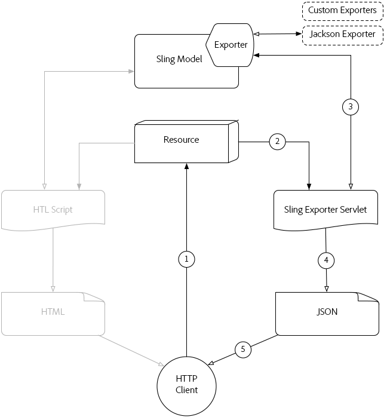

# Compreender [!DNL Sling Model Exporter]

Apache [!DNL Sling Models] 1.3.0 introduz [!DNL Sling Model Exporter], uma maneira elegante de exportar ou serializar [!DNL Sling Model] objetos em abstrações personalizadas. Este artigo justapõe o caso de uso tradicional do uso [!DNL Sling Models] para preencher scripts HTL, com a utilização do [!DNL Sling Model Exporter] estrutura para serializar um [!DNL Sling Model] no JSON.

## Fluxo de solicitação HTTP do modelo Sling tradicional

O caso de uso tradicional do [!DNL Sling Models] é fornecer uma abstração de negócios para um recurso ou solicitação, que fornece scripts HTL (ou, anteriormente JSPs) uma interface para acessar funções de negócios.

Padrões comuns estão se desenvolvendo [!DNL Sling Models] que representam Componentes ou Páginas do AEM e usando o [!DNL Sling Model] objetos para alimentar os scripts HTL com dados, com um resultado final de HTML que é exibido no navegador.

### Fluxo de solicitação HTTP do modelo Sling

1. [!DNL HTTP GET] A solicitação é feita para um recurso no AEM.

   Exemplo: `HTTP GET /content/my-resource.html`

1. Com base no recurso de solicitação `sling:resourceType`, o Script apropriado será resolvido.

1. O Script adapta a Solicitação ou Recurso ao estado [!DNL Sling Model].

1. O Script usa o [!DNL Sling Model] objeto para gerar a representação de HTML.

1. O HTML gerado pelo script é retornado na Resposta HTTP.

Este padrão tradicional funciona bem no contexto de geração de HTML como o [!DNL Sling Model] podem ser facilmente aproveitados por meio de HTL. Criar dados mais estruturados, como JSON ou XML, é uma tarefa muito mais tediosa, pois o HTL não se presta naturalmente à definição desses formatos.

## [!DNL Sling Model Exporter] Fluxo de solicitação HTTP

Apache [!DNL Sling Model Exporter] vem com um Sling fornecido Jackson Exportador que automaticamente serializa um &quot;comum&quot; [!DNL Sling Model] no JSON. O Jackson Exporter, embora bastante configurável, em seu núcleo inspeciona o [!DNL Sling Model] e gera JSON usando qualquer método &quot;getter&quot; como chaves JSON, e os valores de retorno de getter como valores JSON.

A serialização direta de [!DNL Sling Models] permite que eles atendam às solicitações normais da Web com suas respostas de HTML criadas usando o [!DNL Sling Model] fluxo de solicitação (veja acima), mas também exponha representações JSON que podem ser consumidas por serviços da Web ou aplicativos JavaScript.

*Esse fluxo descreve o fluxo usando o exportador Jackson fornecido para produzir a saída JSON. O uso de exportadores personalizados segue o mesmo fluxo, mas com seu formato de saída.*

1. A solicitação HTTP GET é feita para um recurso no AEM com o seletor e a extensão registrados com o [!DNL Sling Model]Exportador do.

   Exemplo: `HTTP GET /content/my-resource.model.json`

1. O Sling resolve o problema do recurso `sling:resourceType`, seletor e extensão para um Sling Exporter Servlet gerado dinamicamente, que é mapeado para o [!DNL Sling Model] com o Exportador.
1. O Sling Exporter Servlet resolvido invoca a variável [!DNL Sling Model Exporter] contra a [!DNL Sling Model] objeto adaptado a partir da solicitação ou do recurso (conforme determinado pelos adaptáveis do Sling Models).
1. O exportador põe em [!DNL Sling Model] com base nas anotações Opções do exportador e Modelo do Sling específico do exportador e retorna o resultado para o Sling Exporter Servlet.
1. O Sling Exporter Servlet retorna a representação JSON do [!DNL Sling Model] na Resposta HTTP.

>[!NOTE]
>
>Enquanto o projeto Apache Sling fornece ao exportador Jackson que serializa [!DNL Sling Models] JSON, a estrutura do Exportador também apoia os Exportadores personalizados. Por exemplo, um projeto poderia implementar um Exportador personalizado que serializa um [!DNL Sling Model] em XML.

>[!NOTE]
>
>Não apenas [!DNL Sling Model Exporter] *serializar* [!DNL Sling Models], ele também pode exportá-los como objetos Java. A exportação para outros objetos Java não desempenha uma função no fluxo de solicitação HTTP e, portanto, não aparece no diagrama acima.

## Materiais de suporte

* [Apache [!DNL Sling Model Exporter] Documentação da estrutura](https://sling.apache.org/documentation/bundles/models.html#exporter-framework-since-130)
