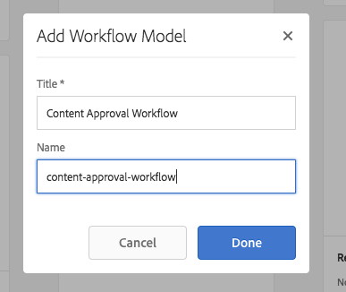
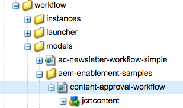
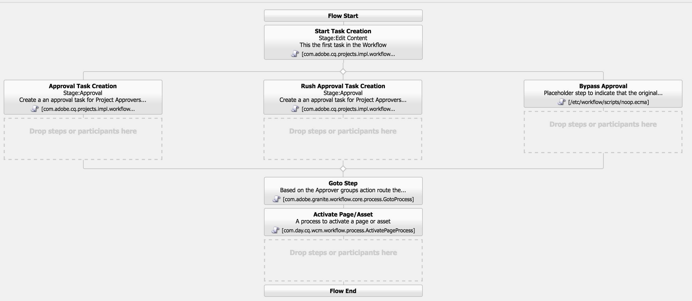

# Desenvolver projetos no AEM

Este é um tutorial de desenvolvimento que ilustra como desenvolver o para [!DNL AEM Projects].  Neste tutorial, criaremos um modelo de Projeto personalizado que poderá ser usado para criar novos Projetos no AEM para gerenciar fluxos de trabalho e tarefas de criação de conteúdo.

>[!VIDEO](https://video.tv.adobe.com/v/16904/?quality=12&learn=on)

*Este vídeo fornece uma breve demonstração do fluxo de trabalho concluído criado no tutorial abaixo.*

## Introdução {#introduction}

[[!DNL AEM Projects]](https://helpx.adobe.com/experience-manager/6-5/sites/authoring/using/projects.html) é um recurso do AEM desenvolvido para facilitar o gerenciamento e o agrupamento de todos os fluxos de trabalho e tarefas associados à criação de conteúdo como parte de uma implementação do AEM Sites ou do Assets.

AEM Projetos vem com vários [modelos de projeto OOTB](https://helpx.adobe.com/experience-manager/6-5/sites/authoring/using/projects.html#ProjectTemplates). Ao criar um novo projeto, os autores podem escolher entre esses modelos disponíveis. Grandes implementações de AEM com requisitos comerciais exclusivos desejarão criar modelos de Projeto personalizados, personalizados para atender às suas necessidades. Ao criar um modelo de Projeto personalizado, os desenvolvedores podem configurar o painel do projeto, entrar em fluxos de trabalho personalizados e criar funções comerciais adicionais para um projeto. Vamos analisar a estrutura de um Modelo de projeto e criar um modelo de amostra.


## Configurar

Este tutorial percorrerá o código necessário para criar um modelo de Projeto personalizado. Você pode baixar e instalar o [pacote anexado](./assets/develop-aem-projects/projects-tasks-guide.ui.apps-0.0.1-SNAPSHOT.zip) em um ambiente local para seguir junto com o tutorial. Você também pode acessar o projeto Maven completo hospedado em [GitHub](https://github.com/Adobe-Marketing-Cloud/aem-guides/tree/feature/projects-tasks-guide).

* [Pacote do tutorial concluído](./assets/develop-aem-projects/projects-tasks-guide.ui.apps-0.0.1-SNAPSHOT.zip)
* [Repositório de código completo no GitHub](https://github.com/Adobe-Marketing-Cloud/aem-guides/tree/feature/projects-tasks-guide)

Este tutorial assume algum conhecimento básico de [AEM práticas de desenvolvimento](https://helpx.adobe.com/experience-manager/6-5/sites/developing/using/the-basics.html) e alguma familiaridade com [AEM configuração de projeto Maven](https://helpx.adobe.com/br/experience-manager/6-5/sites/developing/using/ht-projects-maven.html). Todo o código mencionado deve ser usado como uma referência e só deve ser implantado em uma [instância de desenvolvimento local AEM](https://helpx.adobe.com/experience-manager/6-5/sites/deploying/using/deploy.html#GettingStarted).

## Estrutura de um modelo de projeto

Os Modelos de projeto devem ser colocados sob o controle de origem e devem estar ativos abaixo da pasta do aplicativo em /apps. Idealmente, eles devem ser colocados em uma subpasta com a convenção de nomenclatura de ***/projects/templates/**&lt;my-template>. Ao seguir essa convenção de nomenclatura, quaisquer novos modelos personalizados serão disponibilizados automaticamente para os autores ao criar um projeto. A configuração dos Modelos de projeto disponíveis é definida em: **/content/projects/jcr:content** nó pela propriedade **cq:allowedTemplates**. Por padrão, essa é uma expressão regular: **/(apps|libs)/.*/projects/templates/.***

O nó raiz de um Modelo de projeto terá um **jcr:primaryType** de **cq:Template**. Abaixo do nó raiz de três nós: **gadgets**, **funções** e **fluxos de trabalho**. Esses nós são todos **nt:unstructured**. Abaixo do nó raiz também pode ser um arquivo thumbnail.png exibido ao selecionar o modelo no assistente Criar projeto .

A estrutura completa do nó:

```shell
/apps/<my-app>
    + projects (nt:folder)
         + templates (nt:folder)
              + <project-template-root> (cq:Template)
                   + gadgets (nt:unstructured)
                   + roles (nt:unstructured)
                   + workflows (nt:unstructured)
```

### Raiz do modelo de projeto

O nó raiz do modelo de projeto será do tipo **cq:Template**. Neste nó, você pode configurar as propriedades **jcr:title** e **jcr:description** que serão exibidas no Assistente de Criação de Projetos. Também há uma propriedade chamada **wizard** que aponta para um formulário que preencherá as Propriedades do projeto. O valor padrão de: **/libs/cq/core/content/projects/wizard/steps/defaultproject.html** deve funcionar bem para a maioria dos casos, pois permite que o usuário preencha as propriedades básicas do Projeto e adicione membros do grupo.

**Observe que o Assistente para Criar Projeto não usa o servlet Sling POST. Em vez disso, os valores são publicados em um servlet personalizado:**com.adobe.cq.projects.impl.servlet.ProjectServlet**. Isso deve ser levado em conta ao adicionar campos personalizados.*

Um exemplo de um assistente personalizado pode ser encontrado para o Modelo de projeto de tradução: **/libs/cq/core/content/projects/wizard/translationproject/defaultproject**.

### Gadgets {#gadgets}

Não há propriedades adicionais neste nó, mas os filhos do nó gadgets controlam quais Mosaicos de projetos preenchem o painel do Projeto quando um novo Projeto é criado. [Os mosaicos do projeto](https://helpx.adobe.com/experience-manager/6-5/sites/authoring/using/projects.html#ProjectTiles)  (também conhecidos como gadgets ou pods) são cartões simples que preenchem o local de trabalho de um projeto. Uma lista completa de blocos de ootb pode ser encontrada em: **/libs/cq/gui/components/projects/admin/pod. **Os proprietários do projeto sempre podem adicionar/remover blocos após a criação de um projeto.

### Funções {#roles}

Há 3 [funções padrão](https://helpx.adobe.com/experience-manager/6-5/sites/authoring/using/projects.html#UserRolesinaProject) para cada projeto: **Observadores**, **Editores** e **Proprietários**. Ao adicionar nós filhos abaixo do nó funções, você pode adicionar outras Funções de Projeto específicas de negócios para o modelo. Em seguida, é possível vincular essas funções a fluxos de trabalho específicos associados ao projeto.

### Fluxos de trabalhos {#workflows}

Um dos motivos mais animadores para criar um modelo de projeto personalizado é que ele oferece a capacidade de configurar os fluxos de trabalho disponíveis para uso com o projeto. Eles podem usar fluxos de trabalho OOTB ou fluxos de trabalho personalizados. Abaixo do nó **workflows** é necessário haver um nó **models** (também `nt:unstructured`) e nós filho abaixo especifique os modelos de workflow disponíveis. A propriedade **modelId **aponta para o modelo de fluxo de trabalho em /etc/workflow e a propriedade **wizard** aponta para a caixa de diálogo usada ao iniciar o fluxo de trabalho. Uma grande vantagem dos Projetos é a capacidade de adicionar uma caixa de diálogo personalizada (assistente) para capturar metadados específicos da empresa no início do fluxo de trabalho, que pode impulsionar outras ações no fluxo de trabalho.

```shell
<projects-template-root> (cq:Template)
    + workflows (nt:unstructured)
         + models (nt:unstructured)
              + <workflow-model> (nt:unstructured)
                   - modelId = points to the workflow model
                   - wizard = dialog used to start the workflow
```

## Criação de um template de projeto {#creating-project-template}

Como vamos copiar/configurar nós, usaremos o CRXDE Lite. Na instância de AEM local, abra [CRXDE Lite](http://localhost:4502/crx/de/index.jsp).

1. Comece criando uma nova pasta sob `/apps/&lt;your-app-folder&gt;` chamada `projects`. Crie outra pasta sob o nome `templates`.

   ```shell
   /apps/aem-guides/projects-tasks/
                       + projects (nt:folder)
                                + templates (nt:folder)
   ```

1. Para facilitar as coisas, iniciaremos nosso modelo personalizado a partir do modelo de Projeto Simples existente.

   1. Copie e cole o nó **/libs/cq/core/content/projects/templates/default** abaixo da pasta *templates* criada na Etapa 1.

   ```shell
   /apps/aem-guides/projects-tasks/
                + templates (nt:folder)
                     + default (cq:Template)
   ```

1. Agora você deve ter um caminho como **/apps/aem-guides/projects-tasks/projects/templates/authoring-project**.

   1. Edite as propriedades **jcr:title** e **jcr:description** do nó autor-projeto para valores de título e descrição personalizados.

      1. Deixe a propriedade **wizard** apontando para as propriedades padrão do Projeto.

   ```shell
   /apps/aem-guides/projects-tasks/projects/
            + templates (nt:folder)
                 + authoring-project (cq:Template)
                      - jcr:title = "Authoring Project"
                      - jcr:description = "A project to manage approval and publish process for AEM Sites or Assets"
                      - wizard = "/libs/cq/core/content/projects/wizard/steps/defaultproject.html"
   ```

1. Para este modelo de projeto, queremos usar as Tarefas.
   1. Adicione um novo nó **nt:unstructured** abaixo de authoring-project/gadgets chamado **tasks**.
   1. Adicione propriedades de sequência de caracteres ao nó de tarefas para **cardWeight** = &quot;100&quot;, **jcr:title**=&quot;Tarefas&quot; e **sling:resourceType**=&quot;cq/gui/components/admin/pod/taskpod&quot;.

   Agora, o bloco [Tarefas](https://experienceleague.adobe.com/docs/#Tasks) será exibido por padrão quando um novo projeto for criado.

   ```shell
   ../projects/templates/authoring-project
       + gadgets (nt:unstructured)
            + team (nt:unstructured)
            + asset (nt:unstructured)
            + work (nt:unstructured)
            + experiences (nt:unstructured)
            + projectinfo (nt:unstructured)
            ..
            + tasks (nt:unstructured)
                 - cardWeight = "100"
                 - jcr:title = "Tasks"
                 - sling:resourceType = "cq/gui/components/projects/admin/pod/taskpod"
   ```

1. Adicionaremos uma Função de Aprovador personalizada ao modelo do projeto.

   1. Abaixo do nó do modelo de projeto (authoring-project) , adicione um novo nó **nt:unstructured** rotulado **funções**.
   1. Adicione outro nó **nt:unstructured** rotulado aprovadores como filho do nó de funções.
   1. Adicionar propriedades de sequência de caracteres **jcr:title** = &quot;**Aprovadores**&quot;, **classes** =&quot;**proprietário**&quot;, **roleid**=&quot;**aprovadores**&quot;.
      1. O nome do nó aprovadores, bem como jcr:title e roleid podem ser qualquer valor de string (desde que roleid seja exclusivo).
      1. **** O roleclassgoverna as permissões aplicadas para essa função com base nas  [3 funções do OOTB] (https://docs.adobe.com/docs/en/aem/6-3/author/projects.html#User Funções em um Projeto):  **proprietário**,  **editor** e  **observador**.
      1. Em geral, se a função personalizada for mais de uma função de gerenciamento, a função poderá ser **owner;** se for uma função de criação mais específica como o Fotógrafo ou o Designer, então as funções **editor** deverão ser suficientes. A grande diferença entre **owner** e **editor** é que os proprietários do projeto podem atualizar as propriedades do projeto e adicionar novos usuários ao projeto.

   ```shell
   ../projects/templates/authoring-project
       + gadgets (nt:unstructured)
       + roles (nt:unstructured)
           + approvers (nt:unstructured)
                - jcr:title = "Approvers"
                - roleclass = "owner"
                - roleid = "approver"
   ```

1. Ao copiar o modelo de Projeto simples, você terá 4 workflows OOTB configurados. Cada nó abaixo de workflows/modelos aponta para um workflow específico e um assistente de diálogo de início para esse workflow. Posteriormente neste tutorial, criaremos um fluxo de trabalho personalizado para este projeto. Por enquanto, exclua os nós abaixo de workflow/modelos:

   ```shell
   ../projects/templates/authoring-project
       + gadgets (nt:unstructured)
       + roles (nt:unstructured)
       + workflows (nt:unstructured)
            + models (nt:unstructured)
               - (remove ootb models)
   ```

1. Para facilitar para os autores de conteúdo identificar o Modelo de projeto, você pode adicionar uma Miniatura personalizada. O tamanho recomendado seria de 319x319 pixels.
   1. No CRXDE Lite, crie um novo arquivo como um irmão de gadgets, funções e nós de workflows chamado **thumbnail.png**.
   1. Salve e navegue até o nó `jcr:content` e clique duas vezes na propriedade `jcr:data` (evite clicar em &#39;exibir&#39;).
      1. Isso deve informá-lo com uma caixa de diálogo de edição `jcr:data` de arquivo e você pode fazer upload de uma miniatura personalizada.

   ```shell
   ../projects/templates/authoring-project
       + gadgets (nt:unstructured)
       + roles (nt:unstructured)
       + workflows (nt:unstructured)
       + thumbnail.png (nt:file)
   ```

Representação XML concluída do Modelo de Projeto:

```xml
<?xml version="1.0" encoding="UTF-8"?>
<jcr:root xmlns:sling="http://sling.apache.org/jcr/sling/1.0" xmlns:cq="http://www.day.com/jcr/cq/1.0" xmlns:jcr="http://www.jcp.org/jcr/1.0" xmlns:nt="http://www.jcp.org/jcr/nt/1.0"
    jcr:description="A project to manage approval and publish process for AEM Sites or Assets"
    jcr:primaryType="cq:Template"
    jcr:title="Authoring Project"
    ranking="{Long}1"
    wizard="/libs/cq/core/content/projects/wizard/steps/defaultproject.html">
    <jcr:content
        jcr:primaryType="nt:unstructured"
        detailsHref="/projects/details.html"/>
    <gadgets jcr:primaryType="nt:unstructured">
        <team
            jcr:primaryType="nt:unstructured"
            jcr:title="Team"
            sling:resourceType="cq/gui/components/projects/admin/pod/teampod"
            cardWeight="60"/>
        <tasks
            jcr:primaryType="nt:unstructured"
            jcr:title="Tasks"
            sling:resourceType="cq/gui/components/projects/admin/pod/taskpod"
            cardWeight="100"/>
        <work
            jcr:primaryType="nt:unstructured"
            jcr:title="Workflows"
            sling:resourceType="cq/gui/components/projects/admin/pod/workpod"
            cardWeight="80"/>
        <experiences
            jcr:primaryType="nt:unstructured"
            jcr:title="Experiences"
            sling:resourceType="cq/gui/components/projects/admin/pod/channelpod"
            cardWeight="90"/>
        <projectinfo
            jcr:primaryType="nt:unstructured"
            jcr:title="Project Info"
            sling:resourceType="cq/gui/components/projects/admin/pod/projectinfopod"
            cardWeight="100"/>
    </gadgets>
    <roles jcr:primaryType="nt:unstructured">
        <approvers
            jcr:primaryType="nt:unstructured"
            jcr:title="Approvers"
            roleclass="owner"
            roleid="approvers"/>
    </roles>
    <workflows
        jcr:primaryType="nt:unstructured"
        tags="[]">
        <models jcr:primaryType="nt:unstructured">
        </models>
    </workflows>
</jcr:root>
```

## Teste do modelo de projeto personalizado

Agora podemos testar nosso Modelo de projeto criando um novo Projeto.

1. Você deve ver o modelo personalizado como uma das opções para a criação do projeto.

   

1. Depois de selecionar o modelo personalizado, clique em &quot;Avançar&quot; e observe que ao preencher os Membros do projeto, você pode adicioná-los como uma função de Aprovador.

   

1. Clique em &quot;Criar&quot; para concluir a criação do projeto com base no modelo personalizado. Você observará no Painel do projeto que o Mosaico de tarefas e os outros blocos configurados em gadgets são exibidos automaticamente.

   


## Por que fluxo de trabalho?

Tradicionalmente, AEM workflows centralizados em um processo de aprovação usavam etapas do fluxo de trabalho Participante. AEM Caixa de entrada inclui detalhes sobre tarefas e fluxo de trabalho e integração aprimorada com projetos AEM. Esses recursos tornam o uso das etapas do processo Criar tarefa de projetos uma opção mais atraente.

### Por que tarefas?

Usar uma Etapa de criação de tarefa em relação às etapas tradicionais do Participante oferece algumas vantagens:

* **Data de início e de vencimento**  - facilita para os autores o gerenciamento do tempo, o novo recurso Calendário utiliza essas datas.
* **Prioridade**  - prioridades incorporadas de Baixo, Normal e Alto permitem que os autores priorizem o trabalho
* **Comentários encadeados**  - à medida que os autores trabalham em uma tarefa, eles têm a capacidade de deixar comentários aumentando a colaboração
* **Visibilidade**  - Os blocos de tarefas e as exibições com Projetos permitem que os gerentes visualizem como o tempo está sendo gasto
* **Integração do projeto**  - As tarefas já estão integradas às funções do projeto e aos painéis

Como as etapas do Participante , as Tarefas podem ser atribuídas e roteadas dinamicamente. Metadados de tarefa como Título, Prioridade também podem ser definidos dinamicamente com base em ações anteriores, como veremos no tutorial a seguir.

Embora as Tarefas tenham algumas vantagens sobre as Etapas do participante, elas transportam sobrecarga adicional e não são tão úteis fora de um Projeto. Além disso, todo o comportamento dinâmico das Tarefas deve ser codificado usando scripts ecma que tenham suas próprias limitações.

## Requisitos do caso de utilização de amostras {#goals-tutorial}


O diagrama acima descreve os requisitos de alto nível para nosso fluxo de trabalho de aprovação de amostra.

O primeiro passo será criar uma Tarefa para concluir a edição de um conteúdo. Vamos permitir que o iniciador do workflow escolha o destinatário desta primeira tarefa.

Quando a primeira tarefa for concluída, o destinatário terá três opções para rotear o workflow:

**Normal ** - o roteamento normal cria uma tarefa atribuída ao grupo Aprovador do projeto para revisar e aprovar. A prioridade da tarefa é Normal e a data de vencimento é de 5 dias a partir de quando foi criada.

**Rush**  - o roteamento de rush também cria uma tarefa atribuída ao grupo Aprovador do projeto. A prioridade da tarefa é High e a data de vencimento é de apenas 1 dia.

**Ignorar**  - neste exemplo de fluxo de trabalho, o participante inicial tem a opção de ignorar o grupo de aprovação. (sim, isso pode derrotar a finalidade de um workflow de &quot;Aprovação&quot;, mas nos permite ilustrar recursos de roteamento adicionais)

O Grupo de Aprovadores pode aprovar o conteúdo ou enviá-lo de volta ao destinatário inicial para trabalho novamente. No caso de ser enviada de volta para retrabalho, uma nova tarefa é criada e adequadamente rotulada &quot;Enviada de volta para retrabalho&quot;.

A última etapa do fluxo de trabalho usa a etapa do processo Ativar página/ativo do ootb e replica a carga útil.

## Criar o modelo de fluxo de trabalho

1. No menu Iniciar do AEM, navegue até Ferramentas -> Fluxo de trabalho -> Modelos. Clique em &quot;Criar&quot; no canto superior direito para criar um novo Modelo de fluxo de trabalho.

   Dê um título ao novo modelo: &quot;Fluxo de trabalho de aprovação de conteúdo&quot; e um nome de url: &quot;content-approval-workflow&quot;.

   

   Para obter mais informações relacionadas à [criação de workflows, leia aqui](https://helpx.adobe.com/experience-manager/6-5/sites/developing/using/workflows-models.html).

1. Como prática recomendada, os workflows personalizados devem ser agrupados em sua própria pasta abaixo de /etc/workflow/models. No CRXDE Lite, crie um novo **&#39;nt:folder&#39;** abaixo de /etc/workflow/models chamado **&quot;aem-guides&quot;**. Adicionar uma subpasta garante que os workflows personalizados não sejam substituídos acidentalmente durante as atualizações ou instalações do Service Pack.

   *Observe que é importante nunca colocar a pasta ou os fluxos de trabalho personalizados abaixo de subpastas Ootb, como /etc/workflow/models/dam ou /etc/workflow/models/projects, já que toda a subpasta também pode ser substituída por atualizações ou service packs.

   

   Localização do modelo de fluxo de trabalho na 6.3

   >[!NOTE]
   >
   >Se estiver usando AEM 6.4+, a localização do Fluxo de trabalho foi alterada. Consulte [aqui para obter mais detalhes.](https://helpx.adobe.com/experience-manager/6-5/sites/developing/using/workflows-best-practices.html#LocationsWorkflowModels)

   Se estiver usando AEM 6.4+, o modelo de fluxo de trabalho será criado em `/conf/global/settings/workflow/models`. Repita as etapas acima com o diretório /conf e adicione uma subpasta chamada `aem-guides` e mova o `content-approval-workflow` abaixo dele.

   
Local de definição de fluxo de trabalho modernoLocal do modelo de fluxo de trabalho no 6.4+

1. Introduzido no AEM 6.3 é a capacidade de adicionar Estágios de fluxo de trabalho a um determinado fluxo de trabalho. Os estágios serão exibidos para o usuário na Caixa de entrada na guia Informações do fluxo de trabalho . Ele mostrará ao usuário o estágio atual no fluxo de trabalho, bem como os estágios anteriores e posteriores.

   Para configurar os estágios, abra a caixa de diálogo Propriedades da página no SideKick. A quarta guia é chamada de &quot;Estágios&quot;. Adicione os seguintes valores para configurar as três etapas desse fluxo de trabalho:

   1. Editar conteúdo
   1. Aprovação
   1. Publicação

   

   Configure os Estágios do fluxo de trabalho na caixa de diálogo Propriedades da página .

   

   A barra de progresso do fluxo de trabalho, conforme visto na Caixa de entrada de AEM.

   Como opção, você pode fazer upload de uma **Image** para as Propriedades da página que será usada como a miniatura do fluxo de trabalho quando os usuários a selecionarem. As dimensões da imagem devem ter 319x319 pixels. Adicionar uma **Descrição** às Propriedades da página também será exibido quando um usuário for selecionar o fluxo de trabalho.

1. O processo de fluxo de trabalho Criar tarefa do projeto foi criado para criar uma tarefa como etapa no fluxo de trabalho. Somente após a conclusão da tarefa o workflow avançará. Um aspecto poderoso da etapa Criar tarefa do projeto é que ela pode ler valores de metadados de fluxo de trabalho e usá-los para criar dinamicamente a tarefa.

   Primeiro exclua a Etapa do participante que é criada por padrão. No Sidekick, no menu Componentes, expanda o subcabeçalho **&quot;Projetos&quot;** e arraste e solte o **&quot;Criar tarefa do projeto&quot;** no modelo.

   Clique duas vezes na etapa &quot;Criar tarefa do projeto&quot; para abrir a caixa de diálogo do fluxo de trabalho. Configure as seguintes propriedades:

   Essa guia é comum para todas as etapas do processo do fluxo de trabalho e definiremos o Título e a Descrição (que não estarão visíveis para o usuário final). A propriedade importante que vamos definir é o Estágio do fluxo de trabalho para **&quot;Editar conteúdo&quot;** no menu suspenso.

   ```shell
   Common Tab
   -----------------
       Title = "Start Task Creation"
       Description = "This the first task in the Workflow"
       Workflow Stage = "Edit Content"
   ```

   O processo de fluxo de trabalho Criar tarefa do projeto foi criado para criar uma tarefa como etapa no fluxo de trabalho. A guia Task permite definir todos os valores da tarefa. No nosso caso, queremos que o Destinatário seja dinâmico, de modo que o deixemos em branco. O restante dos valores da propriedade:

   ```shell
   Task Tab
   -----------------
       Name* = "Edit Content"
       Task Priority = "Medium"
       Description = "Edit the content and finalize for approval. Once finished submit for approval."
       Due In - Days = "2"
   ```

   A guia Roteamento é uma caixa de diálogo opcional que pode especificar ações disponíveis para o usuário que conclui a tarefa. Essas ações são apenas valores de string e serão salvas nos metadados do workflow. Esses valores podem ser lidos por scripts e/ou etapas de processo posteriormente no workflow para &quot;rotear&quot; dinamicamente o workflow. Com base nos [objetivos do fluxo de trabalho](#goals-tutorial) adicionaremos três ações a esta guia:

   ```shell
   Routing Tab
   -----------------
       Actions =
           "Normal Approval"
           "Rush Approval"
           "Bypass Approval"
   ```

   Esta guia nos permite configurar um Script de tarefa de pré-criação, onde podemos decidir programaticamente vários valores da tarefa antes de ela ser criada. Temos a opção de apontar o script para um arquivo externo ou incorporar um script curto diretamente na caixa de diálogo. Em nosso caso, apontaremos o script de tarefa de pré-criação para um arquivo externo. Na Etapa 5, criaremos esse script.

   ```shell
   Advanced Settings Tab
   -----------------
      Pre-Create Task Script = "/apps/aem-guides/projects/scripts/start-task-config.ecma"
   ```

1. Na etapa anterior, referenciamos um script de tarefa de pré-criação. Agora criaremos esse script no qual definiremos o Destinatário da Tarefa com base no valor de um valor de metadados de workflow &quot;**Destinatário**&quot;. O valor **&quot;assignee&quot;** será definido quando o workflow for iniciado. Também lemos os metadados do workflow para escolher dinamicamente a prioridade da tarefa lendo o valor &quot;**taskPriority&quot;** dos metadados do workflow, bem como o valor **&quot;taskdueDate&quot; **a ser definido dinamicamente quando a primeira tarefa for devida.

   Para fins organizacionais, criamos uma pasta abaixo da pasta do aplicativo para armazenar todos os scripts relacionados ao projeto: **/apps/aem-guides/projects-tasks/projects/scripts**. Crie um novo arquivo abaixo desta pasta chamado **&quot;start-task-config.ecma&quot;**. *Observe que verifique se o caminho para seu arquivo start-task-config.ecma corresponde ao caminho definido na guia Configurações avançadas na Etapa 4.

   Adicione o seguinte como o conteúdo do arquivo:

   ```
   // start-task-config.ecma
   // Populate the task using values stored as workflow metadata originally posted by the start workflow wizard
   
   // set the assignee based on start workflow wizard
   var assignee = workflowData.getMetaDataMap().get("assignee", Packages.java.lang.String);
   task.setCurrentAssignee(assignee);
   
   //Set the due date for the initial task based on start workflow wizard
   var dueDate = workflowData.getMetaDataMap().get("taskDueDate", Packages.java.util.Date);
   if (dueDate != null) {
       task.setProperty("taskDueDate", dueDate);
   }
   
   //Set the priority based on start workflow wizard
   var taskPriority = workflowData.getMetaDataMap().get("taskPriority", "Medium");
   task.setProperty("taskPriority", taskPriority);
   ```

1. Navegue de volta ao Fluxo de trabalho de aprovação de conteúdo. Arraste e solte o componente **OU Split** (encontrado no Sidekick sob a categoria &#39;Workflow&#39;) abaixo da etapa **Iniciar tarefa**. Na caixa de diálogo Comum, selecione o botão de opção para 3 ramificações. O Split OR lerá o valor de metadados do workflow **&quot;lastTaskAction&quot;** para determinar a rota do workflow. A propriedade **&quot;lastTaskAction&quot;** será definida como um dos valores da Guia Roteamento configurada na Etapa 4. Para cada uma das guias Ramificação , preencha a área de texto **Script** com os seguintes valores:

   ```
   function check() {
   var lastAction = workflowData.getMetaDataMap().get("lastTaskAction","");
   
   if(lastAction == "Normal Approval") {
       return true;
   }
   
   return false;
   }
   ```

   ```
   function check() {
   var lastAction = workflowData.getMetaDataMap().get("lastTaskAction","");
   
   if(lastAction == "Rush Approval") {
       return true;
   }
   
   return false;
   }
   ```

   ```
   function check() {
   var lastAction = workflowData.getMetaDataMap().get("lastTaskAction","");
   
   if(lastAction == "Bypass Approval") {
       return true;
   }
   
   return false;
   }
   ```

   *Observe que estamos fazendo uma correspondência direta da Cadeia de caracteres para determinar a rota, portanto, é importante que os valores definidos nos scripts da Ramificação correspondam aos valores de Rota definidos na Etapa 4.

1. Arraste e solte outra etapa &quot;**Criar tarefa do projeto**&quot; no modelo à extremidade esquerda (Ramificação 1) abaixo da divisão OU. Preencha a caixa de diálogo com as seguintes propriedades:

   ```
   Common Tab
   -----------------
       Title = "Approval Task Creation"
       Description = "Create a an approval task for Project Approvers. Priority is Medium."
       Workflow Stage = "Approval"
   
   Task Tab
   ------------
       Name* = "Approve Content for Publish"
       Task Priority = "Medium"
       Description = "Approve this content for publication."
       Days = "5"
   
   Routing Tab - Actions
   ----------------------------
       "Approve and Publish"
       "Send Back for Revision"
   ```

   Como essa é a rota de Aprovação Normal, a prioridade da tarefa é definida como Média. Além disso, damos ao grupo Aprovadores 5 dias para concluir a tarefa. O destinatário é deixado em branco na guia Tarefa, pois atribuiremos isso dinamicamente na guia Configurações avançadas . Damos ao grupo de Aprovadores duas rotas possíveis ao concluir esta tarefa: **&quot;Aprovar e publicar&quot;** se eles aprovarem o conteúdo e ele puder ser publicado e **&quot;Enviar de volta para revisão&quot;** se houver problemas que o editor original precise corrigir. O aprovador pode deixar comentários que o editor original verá se o fluxo de trabalho for retornado a ele.

Anteriormente neste tutorial, criamos um Modelo de projeto que incluía uma Função de Aprovadores. Cada vez que um novo Projeto é criado a partir deste Modelo, um Grupo específico do projeto será criado para a função Aprovadores . Assim como uma Etapa do participante, uma Tarefa só pode ser atribuída a um usuário ou grupo. Queremos atribuir esta tarefa ao grupo de projetos que corresponde ao Grupo de Aprovadores. Todos os workflows iniciados de um Projeto terão metadados que mapeiam as Funções do Projeto para o grupo específico do Projeto.

Copie e cole o seguinte código na área de texto **Script** da guia **Configurações avançadas **. Esse código lerá os metadados do workflow e atribuirá a tarefa ao grupo Aprovadores do projeto. Se não conseguir localizar o valor do grupo de aprovadores, ele recorrerá à atribuição da tarefa ao grupo Administradores.

```
var projectApproverGrp = workflowData.getMetaDataMap().get("project.group.approvers","administrators");

task.setCurrentAssignee(projectApproverGrp);
```

1. Arraste e solte outra etapa &quot;**Create Project Task**&quot; no modelo para a ramificação central (Ramificação 2) abaixo da divisão OR. Preencha a caixa de diálogo com as seguintes propriedades:

   ```
   Common Tab
   -----------------
       Title = "Rush Approval Task Creation"
       Description = "Create a an approval task for Project Approvers. Priority is High."
       Workflow Stage = "Approval"
   
   Task Tab
   ------------
       Name* = "Rush Approve Content for Publish"
       Task Priority = "High"
       Description = "Rush approve this content for publication."
       Days = "1"
   
   Routing Tab - Actions
   ----------------------------
       "Approve and Publish"
       "Send Back for Revision"
   ```

   Como esta é a rota de Aprovação de Ruptura, a prioridade da tarefa é definida como Alta. Além disso, oferecemos ao grupo Aprovadores apenas um dia para concluir a tarefa. O destinatário é deixado em branco na guia Tarefa, pois atribuiremos isso dinamicamente na guia Configurações avançadas .

   Podemos reutilizar o mesmo trecho de script da Etapa 7 para preencher a área de texto **Script** na guia** Configurações avançadas **do . Copie e cole o código abaixo:

   ```
   var projectApproverGrp = workflowData.getMetaDataMap().get("project.group.approvers","administrators");
   
   task.setCurrentAssignee(projectApproverGrp);
   ```

1. Arraste e solte um componente ** Nenhuma operação** na ramificação da extrema direita (Ramificação 3). O componente Nenhuma operação não executa nenhuma ação e será avançado imediatamente, representando o desejo do editor original de ignorar a etapa de aprovação. Tecnicamente, podemos deixar essa Ramificação sem nenhuma etapa do fluxo de trabalho, mas como prática recomendada, adicionaremos uma etapa Sem operação . Isso deixa claro para outros desenvolvedores qual é a finalidade da Ramificação 3.

   Clique duas vezes na etapa do fluxo de trabalho e configure o Título e a Descrição:

   ```
   Common Tab
   -----------------
       Title = "Bypass Approval"
       Description = "Placeholder step to indicate that the original editor decided to bypass the approver group."
   ```

   

   O Modelo de fluxo de trabalho deve ter esta aparência depois que todas as três ramificações na divisão OR tiverem sido configuradas.

1. Como o grupo Aprovadores tem a opção de enviar o workflow de volta ao editor original para novas revisões, nós dependeremos da etapa **Ir para** para ler a última ação executada e rotear o workflow até o início ou permitir que ele continue.

   Arraste e solte o componente Etapa Ir para (encontrado no Sidekick em Fluxo de trabalho) abaixo da divisão OU, onde ele se reúne novamente. Clique duas vezes em e configure as seguintes propriedades na caixa de diálogo:

   ```
   Common Tab
   ----------------
       Title = "Goto Step"
       Description = "Based on the Approver groups action route the workflow to the beginning or continue and publish the payload."
   
   Process Tab
   ---------------
       The step to go to. = "Start Task Creation"
   ```

   A última peça que vamos configurar é o Script como parte da etapa do processo Ir para . O valor do Script pode ser incorporado por meio da caixa de diálogo ou configurado para apontar para um arquivo externo. O Script Goto deve conter uma função **check()** e retornar true se o workflow tiver que ir para a etapa especificada. Um retorno de falsos resultados em uma continuação do workflow.

   Se o grupo do aprovador escolher a ação **&quot;Enviar de volta para revisão&quot;** (configurada nas Etapa 7 e 8), queremos retornar o workflow para a etapa **&quot;Iniciar criação de tarefa&quot;**.

   Na guia Processo, adicione o seguinte trecho à área de texto Script:

   ```
   function check() {
   var lastAction = workflowData.getMetaDataMap().get("lastTaskAction","");
   
   if(lastAction == "Send Back for Revision") {
       return true;
   }
   
   return false;
   }
   ```

1. Para publicar a carga útil, usaremos a etapa Ativar página/ativo **do processo ootb.** Essa etapa do processo requer pouca configuração e adicionará a carga do workflow à fila de replicação para ativação. Adicionaremos a etapa abaixo da etapa Ir para e, dessa forma, só poderá ser acessada se o grupo Aprovador tiver aprovado o conteúdo para publicação ou se o editor original tiver escolhido a rota Ignorar aprovação .

   Arraste e solte a etapa **Ativar página/ativo** do processo (encontrada no Sidekick em Fluxo de trabalho do WCM) abaixo da Etapa Ir para no modelo.

   

   Como o modelo de fluxo de trabalho deve ser exibido depois de adicionar a etapa Ir para e a etapa Ativar página/ativo .

1. Se o grupo Aprovador enviar o conteúdo de volta para revisão, queremos informar o editor original. Podemos fazer isso alterando dinamicamente as propriedades de criação da Tarefa. Nós desativaremos o valor da propriedade lastActionTaken de **&quot;Enviar de volta para revisão&quot;**. Se esse valor estiver presente, modificaremos o título e a descrição para indicar que essa tarefa é o resultado do conteúdo que está sendo enviado de volta para revisão. Também atualizaremos a prioridade para **&quot;Alto&quot;** para que seja o primeiro item em que o editor funcione. Por fim, definiremos a data de vencimento da tarefa como um dia a partir de quando o workflow foi enviado de volta para revisão.

   Substitua o script start `start-task-config.ecma` (criado na Etapa 5) pelo seguinte:

   ```
   // start-task-config.ecma
   // Populate the task using values stored as workflow metadata originally posted by the start workflow wizard
   
   // set the assignee based on start workflow wizard
   var assignee = workflowData.getMetaDataMap().get("assignee", Packages.java.lang.String);
   task.setCurrentAssignee(assignee);
   
   //Set the due date for the initial task based on start workflow wizard
   var dueDate = workflowData.getMetaDataMap().get("taskDueDate", Packages.java.util.Date);
   if (dueDate != null) {
       task.setProperty("taskDueDate", dueDate);
   }
   
   //Set the priority based on start workflow wizard
   var taskPriority = workflowData.getMetaDataMap().get("taskPriority", "Medium");
   task.setProperty("taskPriority", taskPriority);
   
   var lastAction = workflowData.getMetaDataMap().get("lastTaskAction","");
   
   //change the title and priority if the approver group sent back the content
   if(lastAction == "Send Back for Revision") {
     var taskName = "Review and Revise Content";
   
     //since the content was rejected we will set the priority to High for the revison task
     task.setProperty("taskPriority", "High"); 
   
     //set the Task name (displayed as the task title in the Inbox) 
     task.setProperty("name", taskName);
     task.setProperty("nameHierarchy", taskName);
   
     //set the due date of this task 1 day from current date
     var calDueDate = Packages.java.util.Calendar.getInstance();
     calDueDate.add(Packages.java.util.Calendar.DATE, 1);
     task.setProperty("taskDueDate", calDueDate.getTime());
   
   }
   ```

## Criar o assistente &quot;iniciar fluxo de trabalho&quot; {#start-workflow-wizard}

Ao iniciar um fluxo de trabalho a partir de um projeto, você deve especificar um assistente para iniciar o fluxo de trabalho. O assistente padrão: `/libs/cq/core/content/projects/workflowwizards/default_workflow` permite que o usuário insira um Título de fluxo de trabalho, um comentário de início e um caminho de carga para execução do fluxo de trabalho. Há também vários outros exemplos encontrados em: `/libs/cq/core/content/projects/workflowwizards`.

A criação de um assistente personalizado pode ser muito eficiente, pois é possível coletar informações críticas antes do início do workflow. Os dados são armazenados como parte dos metadados e processos de fluxo de trabalho do fluxo de trabalho e podem ler isso e alterar dinamicamente o comportamento com base nos valores inseridos. Criaremos um assistente personalizado para atribuir dinamicamente a primeira tarefa no workflow com base em um valor de assistente de início.

1. No CRXDE-Lite, criaremos uma subpasta abaixo de `/apps/aem-guides/projects-tasks/projects` pasta chamada &quot;assistentes&quot;. Copie o assistente padrão de: `/libs/cq/core/content/projects/workflowwizards/default_workflow` abaixo da pasta de assistentes recém-criada e renomeie-a para **content-approval-start**. O caminho completo agora deve ser: `/apps/aem-guides/projects-tasks/projects/wizards/content-approval-start`.

   O assistente padrão é um assistente de 2 colunas com a primeira coluna mostrando Título, Descrição e Miniatura do modelo de fluxo de trabalho selecionado. A segunda coluna inclui campos para o Título do fluxo de trabalho, Comentário inicial e Caminho de carga útil. O assistente é um formulário padrão da interface do usuário de toque e usa os [Componentes padrão do formulário da interface do usuário do Granite](https://experienceleague.adobe.com/docs/) para preencher os campos.

   

1. Adicionaremos um campo adicional ao assistente que será usado para definir o destinatário da primeira tarefa no workflow (consulte [Criar o Modelo de Fluxo de Trabalho](#create-workflow-model): Etapa 5).

   Abaixo de `../content-approval-start/jcr:content/items/column2/items` crie um novo nó do tipo `nt:unstructured` chamado **&quot;assign&quot;**. Usaremos o componente Seletor de usuários de projetos (que é baseado no [Componente seletor de usuários do Granite](https://experienceleague.adobe.com/docs/)). Este campo de formulário facilita restringir a seleção de usuários e grupos somente àqueles que pertencem ao projeto atual.

   Abaixo está a representação XML do nó **assign**:

   ```xml
   <assign
       granite:class="js-cq-project-user-picker"
       jcr:primaryType="nt:unstructured"
       sling:resourceType="cq/gui/components/projects/admin/userpicker"
       fieldLabel="Assign To"
       hideServiceUsers="{Boolean}true"
       impersonatesOnly="{Boolean}true"
       showOnlyProjectMembers="{Boolean}true"
       name="assignee"
       projectPath="${param.project}"
       required="{Boolean}true"/>
   ```

1. Também adicionaremos um campo de seleção de prioridade que determinará a prioridade da primeira tarefa no workflow (consulte [Create the Workflow Model](#create-workflow-model): Etapa 5).

   Abaixo de `/content-approval-start/jcr:content/items/column2/items` crie um novo nó do tipo `nt:unstructured` chamado **priority**. Usaremos o [Componente de seleção de interface do usuário do Granite](https://experienceleague.adobe.com/docs/experience-manager-release-information/aem-release-updates/previous-updates/aem-previous-versions.html) para preencher o campo de formulário.

   Abaixo do nó **priority** adicionaremos um nó **items** de **nt:unstructured**. Abaixo do nó **items** adicione mais 3 nós para preencher as opções de seleção para Alto, Médio e Baixo. Cada nó é do tipo **nt:unstructured** e deve ter uma propriedade **text** e **value**. O texto e o valor devem ser o mesmo valor:

   1. Alta
   1. Média
   1. Baixa

   Para o nó Médio, adicione uma propriedade booleana adicional chamada &quot;**seleted&quot;** com um valor definido como **true**. Isso garantirá que a Média seja o valor padrão no campo de seleção.

   Abaixo está uma representação XML da estrutura e das propriedades do nó:

   ```xml
   <priority
       jcr:primaryType="nt:unstructured"
       sling:resourceType="granite/ui/components/coral/foundation/form/select"
       fieldLabel="Task Priority"
       name="taskPriority">
           <items jcr:primaryType="nt:unstructured">
               <high
                   jcr:primaryType="nt:unstructured"
                   text="High"
                   value="High"/>
               <medium
                   jcr:primaryType="nt:unstructured"
                   selected="{Boolean}true"
                   text="Medium"
                   value="Medium"/>
               <low
                   jcr:primaryType="nt:unstructured"
                   text="Low"
                   value="Low"/>
               </items>
   </priority>
   ```

1. Vamos permitir que o iniciador do workflow defina a data de vencimento da tarefa inicial. Usaremos o campo de formulário [Granite UI DatePicker](https://experienceleague.adobe.com/docs/) para capturar essa entrada. Também adicionaremos um campo oculto com um [TypeHint](https://sling.apache.org/documentation/bundles/manipulating-content-the-slingpostservlet-servlets-post.html#typehint) para garantir que a entrada seja armazenada como uma propriedade do tipo Data no JCR.

   Adicione dois nós **nt:unstructured** com as seguintes propriedades representadas abaixo em XML:

   ```xml
   <duedate
       granite:rel="project-duedate"
       jcr:primaryType="nt:unstructured"
       sling:resourceType="granite/ui/components/coral/foundation/form/datepicker"
       displayedFormat="YYYY-MM-DD HH:mm"
       fieldLabel="Due Date"
       minDate="today"
       name="taskDueDate"
       type="datetime"/>
   <duedatetypehint
       jcr:primaryType="nt:unstructured"
       sling:resourceType="granite/ui/components/coral/foundation/form/hidden"
       name="taskDueDate@TypeHint"
       type="datetime"
       value="Calendar"/>
   ```

1. Você pode exibir o código completo da caixa de diálogo Iniciar assistente [aqui](https://github.com/Adobe-Marketing-Cloud/aem-guides/blob/master/projects-tasks-guide/ui.apps/src/main/content/jcr_root/apps/aem-guides/projects-tasks/projects/wizards/content-approval-start/.content.xml).

## Conexão do workflow e do template do projeto {#connecting-workflow-project}

A última coisa que precisamos fazer é garantir que o modelo de fluxo de trabalho esteja disponível para ser iniciado em um dos Projetos. Para fazer isso, precisamos visitar novamente o Modelo de projeto que criamos na Parte 1 desta série.

A configuração do Fluxo de trabalho é uma área de um Modelo de projeto que especifica os fluxos de trabalho disponíveis a serem usados com esse projeto. A configuração também é responsável por especificar o Assistente para Iniciar Fluxo de Trabalho ao iniciar o fluxo de trabalho (que criamos nas [etapas anteriores)](#start-workflow-wizard). A configuração do fluxo de trabalho de um modelo de projeto é &quot;ativa&quot;, o que significa que a atualização da configuração do fluxo de trabalho afetará novos projetos criados, bem como projetos existentes que usam o modelo.

1. No CRXDE-Lite, navegue até o modelo de projeto de criação criado anteriormente em `/apps/aem-guides/projects-tasks/projects/templates/authoring-project/workflows/models`.

   Abaixo do nó modelos adicione um novo nó chamado **contentapproval** com um tipo de nó **nt:unstructured**. Adicione as seguintes propriedades ao nó :

   ```xml
   <contentapproval
       jcr:primaryType="nt:unstructured"
       modelId="/etc/workflow/models/aem-guides/content-approval-workflow/jcr:content/model"
       wizard="/apps/aem-guides/projects-tasks/projects/wizards/content-approval-start.html"
   />
   ```

   >[!NOTE]
   >
   >Se estiver usando o AEM 6.4, a localização do Fluxo de trabalho foi alterada. Aponte a propriedade `modelId` para o local do modelo de fluxo de trabalho em tempo de execução em `/var/workflow/models/aem-guides/content-approval-workflow`
   >
   >
   >Consulte [aqui para obter mais detalhes sobre a alteração no local do fluxo de trabalho.](https://helpx.adobe.com/experience-manager/6-5/sites/developing/using/workflows-best-practices.html#LocationsWorkflowModels)

   ```xml
   <contentapproval
       jcr:primaryType="nt:unstructured"
       modelId="/var/workflow/models/aem-guides/content-approval-workflow"
       wizard="/apps/aem-guides/projects-tasks/projects/wizards/content-approval-start.html"
   />
   ```

1. Depois que o fluxo de trabalho de aprovação de conteúdo for adicionado ao Modelo do projeto, ele deverá estar disponível para ser iniciado no Mosaico de fluxo de trabalho do projeto. Vá em frente e inicie divirta-se com os vários roteiros que criamos.

## Materiais de apoio

* [Download do pacote de tutoriais concluído](./assets/develop-aem-projects/projects-tasks-guide.ui.apps-0.0.1-SNAPSHOT.zip)
* [Repositório de código completo no GitHub](https://github.com/Adobe-Marketing-Cloud/aem-guides/tree/feature/projects-tasks-guide)
* [Documentação de projetos AEM](https://helpx.adobe.com/experience-manager/6-5/sites/authoring/using/projects.html)
