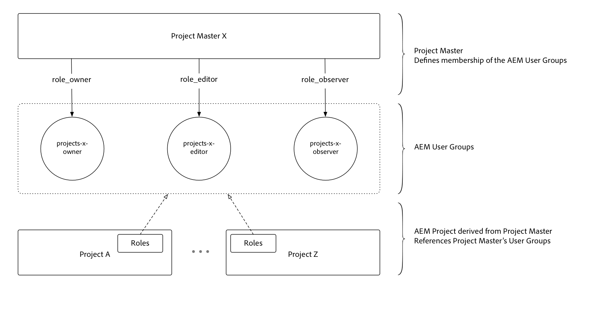

# Usar mestres do projeto

O Project Masters simplifica bastante o gerenciamento de usuários e equipes com [!DNL AEM Projects].

>[!VIDEO](https://video.tv.adobe.com/v/17740/?quality=12&learn=on)

Agora, os administradores podem criar um **[!DNL Master Project]** e atribuir usuários a funções/permissões como parte de uma Equipe de projetos. Os projetos podem ser criados a partir de um projeto Principal e herdam automaticamente a associação à equipe. Isso oferece várias vantagens:

* Reutilizar equipes existentes em vários projetos
* Acelera a criação de projetos, pois as equipes não precisam ser recriadas manualmente
* Gerenciar a associação de equipe de um local central e qualquer atualização nas equipes é automaticamente herdada pelos Projetos
* evita a criação de ACLs duplicadas que podem causar problemas de desempenho

[!DNL Master Projects] pode ser criado na   pasta Mestre em Projetos  [!UICONTROL AEM]. Depois que um projeto Principal é criado, ele é exibido como uma opção ao lado dos modelos disponíveis no assistente quando novos projetos são criados.

[!DNL Project Masters] URL (instância local do autor do AEM):  [http://localhost:4502/projects.html/content/projects/masters](http://localhost:4502/projects.html/content/projects/masters)

## Exclua [!DNL Project Masters]

A exclusão de um projeto principal resulta em projetos derivados inutilizáveis.

Antes de excluir um projeto principal, verifique se todos os projetos derivados foram concluídos e removidos do AEM. Salve os dados do projeto necessários antes de remover os projetos derivados. Depois que todos os projetos derivados forem removidos do AEM, o projeto principal poderá ser excluído com segurança.

## Marcar [!DNL Project Masters] como Inativo

Ao alterar o status do projeto principal para inativo nas propriedades do projeto, os projetos principais inativos desaparecem da lista de projetos principais.

Para mostrar projetos principais inativos, alterne o botão de filtro &quot;mostrar ativo&quot; na barra superior (ao lado do botão de exibição da lista). Para tornar o projeto inativo ativo novamente, basta selecionar o projeto principal inativo, editar as propriedades do projeto e configurá-lo novamente para estar ativo.

## Entender [!DNL Project Masters]

[!DNL Project Masters] trabalhe definindo um conjunto de grupos de usuários AEM (proprietários, editor e observador) e permitindo que projetos derivados façam referência e reutilizem esses grupos de usuários definidos centralmente.

Isso reduz o número geral de grupos de usuários necessários no AEM. Antes de [!DNL Project Masters], cada projeto criava três grupos de usuários com as ACEs que o acompanhavam para impor o controle de permissão, o que significa que 100 projetos renderam 300 grupos de usuários. O Mestrado de projeto permite que qualquer número de Projetos reutilize os mesmos três grupos, supondo que a associação compartilhada se alinhe aos requisitos de negócios no projeto.
