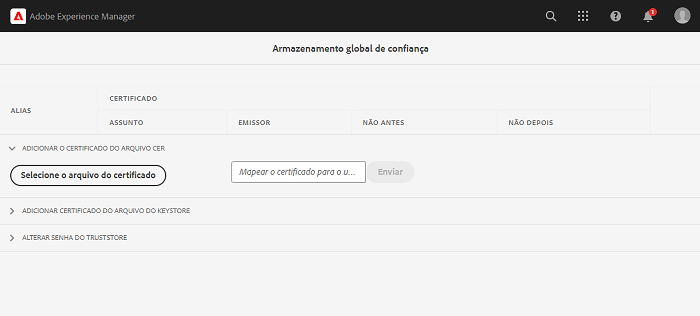

# Chamar APIs internas com certificados privados

Saiba como fazer chamadas de HTTPS do AEM para APIs da web com certificados privados ou autoassinados.

>[!VIDEO](https://video.tv.adobe.com/v/3424853?quality=12&learn=on)

Por padrão, ao tentar fazer uma conexão HTTPS com uma API da web que usa um certificado autoassinado, a conexão falha com o erro:

```
PKIX path building failed: sun.security.provider.certpath.SunCertPathBuilderException: unable to find valid certification path to requested target
```

Normalmente, esse problema ocorre quando o **certificado SSL da API não é emitido por uma autoridade de certificação (CA) reconhecida** e o aplicativo Java™ não pode validar o certificado SSL/TLS.

Saiba como chamar APIs com certificados privados ou autoassinados com sucesso, usando o [Apache HttpClient](https://hc.apache.org/httpcomponents-client-4.5.x/index.html) e a **TrustStore global do AEM**.


## Código de invocação de API de protótipo com o HttpClient

O código a seguir estabelece uma conexão HTTPS com uma API da web:

```java
...
String API_ENDPOINT = "https://example.com";

// Create HttpClientBuilder
HttpClientBuilder httpClientBuilder = HttpClientBuilder.create();

// Create HttpClient
CloseableHttpClient httpClient = httpClientBuilder.build();

// Invoke API
CloseableHttpResponse closeableHttpResponse = httpClient.execute(new HttpGet(API_ENDPOINT));

// Code that reads response code and body from the 'closeableHttpResponse' object
...
```

O código usa as classes de biblioteca [HttpClient](https://hc.apache.org/httpcomponents-client-4.5.x/index.html) do [Apache HttpComponent](https://hc.apache.org/) e seus métodos.


## HttpClient e carregar material da TrustStore do AEM

Para chamar um ponto de acesso de API que tenha um _certificado privado ou autoassinado_, o `SSLContextBuilder` do [HttpClient](https://hc.apache.org/httpcomponents-client-4.5.x/index.html) deve ser carregado com a TrustStore do AEM e usado para facilitar a conexão.

Siga as etapas abaixo:

1. Faça logon no **AEM Author** como **administrador**. 
1. Navegue até **AEM Author > Ferramentas > Segurança > Armazenamento de confiança** e abra a **Armazenamento global de confiança**. Se estiver acessando pela primeira vez, defina uma senha para o Armazenamento global de confiança.

   

1. Para importar um certificado privado, clique no botão **Selecionar arquivo de certificado** e selecione o arquivo de certificado desejado com a extensão `.cer`. Para importar, clique no botão **Enviar**.

1. Atualize o código Java™ conforme abaixo. Observe que, para usar o `@Reference` para obter o `KeyStoreService` do AEM, o código de chamada precisa ser um componente/serviço da OSGi ou um modelo do Sling (e `@OsgiService` precisa ser usado lá).

   ```java
   ...
   
   // Get AEM's KeyStoreService reference
   @Reference
   private com.adobe.granite.keystore.KeyStoreService keyStoreService;
   
   ...
   
   // Get AEM TrustStore using KeyStoreService
   KeyStore aemTrustStore = getAEMTrustStore(keyStoreService, resourceResolver);
   
   if (aemTrustStore != null) {
   
       // Create SSL Context
       SSLContextBuilder sslbuilder = new SSLContextBuilder();
   
       // Load AEM TrustStore material into above SSL Context
       sslbuilder.loadTrustMaterial(aemTrustStore, null);
   
       // Create SSL Connection Socket using above SSL Context
       SSLConnectionSocketFactory sslsf = new SSLConnectionSocketFactory(
               sslbuilder.build(), NoopHostnameVerifier.INSTANCE);
   
       // Create HttpClientBuilder
       HttpClientBuilder httpClientBuilder = HttpClientBuilder.create();
       httpClientBuilder.setSSLSocketFactory(sslsf);
   
       // Create HttpClient
       CloseableHttpClient httpClient = httpClientBuilder.build();
   
       // Invoke API
       closeableHttpResponse = httpClient.execute(new HttpGet(API_ENDPOINT));
   
       // Code that reads response code and body from the 'closeableHttpResponse' object
       ...
   } 
   
   /**
    * 
    * Returns the global AEM TrustStore
    * 
    * @param keyStoreService OOTB OSGi service that makes AEM based KeyStore
    *                         operations easy.
    * @param resourceResolver
    * @return
    */
   private KeyStore getAEMTrustStore(KeyStoreService keyStoreService, ResourceResolver resourceResolver) {
   
       // get AEM TrustStore from the KeyStoreService and ResourceResolver
       KeyStore aemTrustStore = keyStoreService.getTrustStore(resourceResolver);
   
       return aemTrustStore;
   }
   
   ...
   ```

   * Insira o serviço OOTB `com.adobe.granite.keystore.KeyStoreService` OSGi no seu componente da OSGi.
   * Para acessar a TrustStore global do AEM, use `KeyStoreService` e `ResourceResolver`, o método `getAEMTrustStore(...)` faz isso.
   * Crie um objeto de `SSLContextBuilder`, consulte [Detalhes da API](https://javadoc.io/static/org.apache.httpcomponents/httpcore/4.4.8/index.html?org/apache/http/ssl/SSLContextBuilder.html) do Java™.
   * Carregue a TrustStore global do AEM no `SSLContextBuilder`, usando o método `loadTrustMaterial(KeyStore truststore,TrustStrategy trustStrategy)`.
   * Passe `null` para `TrustStrategy` no método acima. Isso garante que somente os certificados confiáveis do AEM obtenham êxito durante a execução da API.


>[!CAUTION]
>
>As chamadas de API com certificados válidos emitidos pela CA falham quando executadas com base na abordagem mencionada. Somente chamadas de API com certificados confiáveis do AEM podem obter êxito com esse método.
>
>Use a [abordagem padrão](#prototypical-api-invocation-code-using-httpclient) para executar chamadas de API de certificados válidos emitidos pela CA, o que significa que somente as APIs associadas a certificados privados devem ser executadas com base no método mencionado acima.

## Evite alterações no JVM Keystore

Uma abordagem convencional para chamar APIs internas com certificados privados de forma eficaz envolve a modificação da JVM Keystore. Para isso, é necessário importar os certificados privados com o comando [keytool](https://docs.oracle.com/pt-br/java/javase/11/tools/keytool.html#GUID-5990A2E4-78E3-47B7-AE75-6D1826259549) do Java™.

No entanto, esse método não está alinhado às práticas recomendadas de segurança, e o AEM oferece uma opção melhor por meio da utilização da **Armazenamento global de confiança** e do [KeyStoreService](https://javadoc.io/doc/com.adobe.aem/aem-sdk-api/latest/com/adobe/granite/keystore/KeyStoreService.html).


## Pacote de solução

O projeto Node.js de exemplo demonstrado no vídeo pode ser baixado [aqui](assets/internal-api-call/REST-APIs.zip).

O código do servlet do AEM está disponível na ramificação `tutorial/web-api-invocation` do projeto de site da WKND; [confira](https://github.com/adobe/aem-guides-wknd/tree/tutorial/web-api-invocation/core/src/main/java/com/adobe/aem/guides/wknd/core/servlets).
