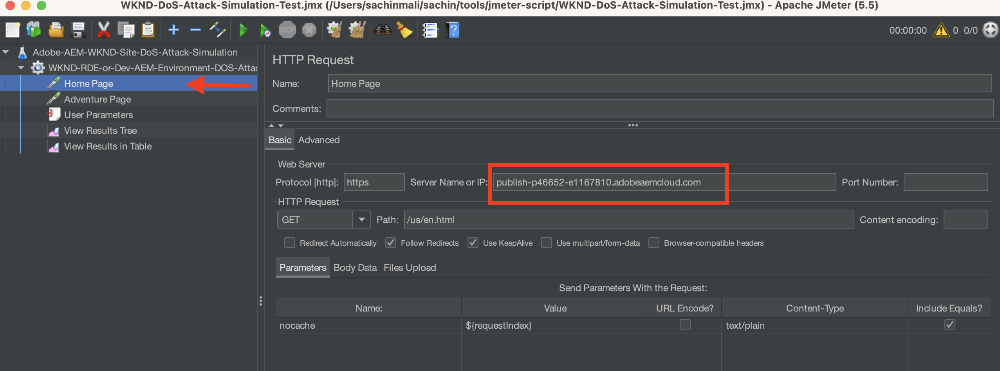

# Usar o ModSecurity para proteger seu site AEM de ataques de DoS

Saiba como habilitar o ModSecurity para proteger seu site contra ataques de Negação de Serviço (DoS) usando o **Conjunto de Regras Principais de ModSecurity (CRS)** do OWASP no Dispatcher de Publicação do Adobe Experience Manager (AEM).


>[!VIDEO](https://video.tv.adobe.com/v/3422976?quality=12&learn=on)

## Visão geral

A base do [Open Web Application Security Project® (OWASP)](https://owasp.org/) fornece o [**OWASP Top 10**](https://owasp.org/www-project-top-ten/) descrevendo as dez preocupações de segurança mais críticas para aplicativos web.

O ModSecurity é uma solução de código aberto para várias plataformas que oferece proteção contra uma variedade de ataques contra aplicativos da Web. Ela também permite o monitoramento do tráfego HTTP, o registro e a análise em tempo real.

O OWSAP® também fornece o [Conjunto de Regras Principais de Segurança OWASP® Mod (CRS)](https://github.com/coreruleset/coreruleset). O CRS é um conjunto de regras genéricas de **detecção de ataque** para uso com ModSecurity. Assim, o CRS tem como objetivo proteger as aplicações Web de uma ampla variedade de ataques, incluindo os dez principais da OWASP, com um mínimo de alertas falsos.

Este tutorial demonstra como habilitar e configurar a regra de CRS **DOS-PROTECTION** para proteger seu site contra um possível ataque de DoS.

>[!TIP]
>
>É importante observar que a [CDN gerenciada](https://experienceleague.adobe.com/docs/experience-manager-cloud-service/content/implementing/content-delivery/cdn.html) da AEM as a Cloud Service satisfaz a maioria dos requisitos de desempenho e segurança do cliente. No entanto, o ModSecurity fornece uma camada extra de segurança e permite regras e configurações específicas do cliente.

## Adicionar CRS ao módulo de projeto do Dispatcher

1. Baixe e extraia o [Conjunto de Regras Principais de ModSecurity mais recente do OWASP](https://github.com/coreruleset/coreruleset/releases).

   ```shell
   # Replace the X.Y.Z with relevent version numbers.
   $ wget https://github.com/coreruleset/coreruleset/archive/refs/tags/vX.Y.Z.tar.gz
   
   # For version v3.3.5 when this tutorial is published
   $ wget https://github.com/coreruleset/coreruleset/archive/refs/tags/v3.3.5.tar.gz
   
   # Extract the downloaded file
   $ tar -xvzf coreruleset-3.3.5.tar.gz
   ```

1. Crie as pastas `modsec/crs` em `dispatcher/src/conf.d/` no código do projeto do AEM. Por exemplo, na cópia local do [projeto do AEM WKND Sites](https://github.com/adobe/aem-guides-wknd).

   {width="200" zoomable="yes"}

1. Copie a pasta `coreruleset-X.Y.Z/rules` do pacote de versão do CRS baixado na pasta `dispatcher/src/conf.d/modsec/crs`.
1. Copie o arquivo `coreruleset-X.Y.Z/crs-setup.conf.example` do pacote de versão do CRS baixado na pasta `dispatcher/src/conf.d/modsec/crs` e renomeie-o para `crs-setup.conf`.
1. Desabilite todas as regras CRS copiadas de `dispatcher/src/conf.d/modsec/crs/rules` renomeando-as como `XXXX-XXX-XXX.conf.disabled`. Você pode usar os comandos abaixo para renomear todos os arquivos de uma só vez.

   ```shell
   # Go inside the newly created rules directory within the dispathcher module
   $ cd dispatcher/src/conf.d/modsec/crs/rules
   
   # Rename all '.conf' extension files to '.conf.disabled'
   $ for i in *.conf; do mv -- "$i" "$i.disabled"; done
   ```

   Consulte Regras CRS renomeadas e arquivo de configuração no código do projeto WKND.

   {width="200" zoomable="yes"}

## Habilitar e configurar a regra de proteção Contra Negação de Serviço (DoS)

Para habilitar e configurar a regra de proteção de Negação de Serviço (DoS), siga as etapas abaixo:

1. Habilite a regra de proteção DoS renomeando `REQUEST-912-DOS-PROTECTION.conf.disabled` como `REQUEST-912-DOS-PROTECTION.conf` (ou remova `.disabled` da extensão de nome de regra) na pasta `dispatcher/src/conf.d/modsec/crs/rules`.
1. Configure a regra definindo as variáveis **DOS_COUNTER_THRESHOLD, DOS_BURST_TIME_SLICE, DOS_BLOCK_TIMEOUT**.
   1. Crie um arquivo `crs-setup.custom.conf` dentro da pasta `dispatcher/src/conf.d/modsec/crs`.
   1. Adicione o trecho de regra abaixo ao arquivo recém-criado.

   ```
   # The Denial of Service (DoS) protection against clients making requests too quickly.
   # When a client is making more than 25 requests (excluding static files) within
   # 60 seconds, this is considered a 'burst'. After two bursts, the client is
   # blocked for 600 seconds.
   SecAction \
       "id:900700,\
       phase:1,\
       nolog,\
       pass,\
       t:none,\
       setvar:'tx.dos_burst_time_slice=60',\
       setvar:'tx.dos_counter_threshold=25',\
       setvar:'tx.dos_block_timeout=600'"    
   ```

Neste exemplo de configuração de regra, o **DOS_COUNTER_THRESHOLD** é 25, o **DOS_BURST_TIME_SLICE** é 60 segundos e o **DOS_BLOCK_TIMEOUT** expira em 600 segundos. Essa configuração identifica mais de duas ocorrências de 25 solicitações, excluindo arquivos estáticos, em 60 segundos, se qualifica como um ataque de DoS, resultando no bloqueio do cliente solicitante por 600 segundos (ou 10 minutos).

>[!WARNING]
>
>Para definir os valores apropriados para suas necessidades, colabore com a equipe de Segurança da Web.

## Inicializar o CRS

Para inicializar o CRS, remova falsos positivos comuns e adicione exceções locais para seu site, siga as etapas abaixo:

1. Para inicializar o CRS, remova `.disabled` do arquivo **REQUEST-901-INITIALIZATION**. Em outras palavras, renomeie o arquivo `REQUEST-901-INITIALIZATION.conf.disabled` como `REQUEST-901-INITIALIZATION.conf`.
1. Para remover os falsos positivos comuns, como o ping do IP local (127.0.0.1), remova `.disabled` do arquivo **REQUEST-905-COMMON-EXCEPTIONS**.
1. Para adicionar exceções locais, como a plataforma AEM ou caminhos específicos do site, renomeie o `REQUEST-900-EXCLUSION-RULES-BEFORE-CRS.conf.example` para `REQUEST-900-EXCLUSION-RULES-BEFORE-CRS.conf`
   1. Adicione exceções de caminho específicas da plataforma AEM ao arquivo recém-renomeado.

   ```
   ########################################################
   # AEM as a Cloud Service exclusions                    #
   ########################################################
   # Ignoring AEM-CS Specific internal and reserved paths
   
   SecRule REQUEST_URI "@beginsWith /systemready" \
       "id:1010,\
       phase:1,\
       pass,\
       nolog,\
       ctl:ruleEngine=Off"    
   
   SecRule REQUEST_URI "@beginsWith /system/probes" \
       "id:1011,\
       phase:1,\
       pass,\
       nolog,\
       ctl:ruleEngine=Off"
   
   SecRule REQUEST_URI "@beginsWith /gitinit-status" \
       "id:1012,\
       phase:1,\
       pass,\
       nolog,\
       ctl:ruleEngine=Off"
   
   ########################################################
   # ADD YOUR SITE related exclusions                     #
   ########################################################
   ...
   ```

1. Além disso, remova o `.disabled` de **REQUEST-910-IP-REPUTATION.conf.disabled** para a verificação de bloco de reputação de IP e `REQUEST-949-BLOCKING-EVALUATION.conf.disabled` para a verificação de pontuação de anomalias.

>[!TIP]
>
>Ao configurar no AEM 6.5, certifique-se de substituir os caminhos acima pelos respectivos caminhos AMS ou no local que verificam a integridade do AEM (também conhecidos como caminhos de heartbeat).

## Adicionar configuração do Apache ModSecurity

Para habilitar o ModSecurity (também conhecido como módulo Apache `mod_security`), siga as etapas abaixo:

1. Crie `modsecurity.conf` em `dispatcher/src/conf.d/modsec/modsecurity.conf` com as principais configurações abaixo.

   ```
   # Include the baseline crs setup
   Include conf.d/modsec/crs/crs-setup.conf
   
   # Include your customizations to crs setup if exist
   IncludeOptional conf.d/modsec/crs/crs-setup.custom.conf
   
   # Select all available CRS rules:
   #Include conf.d/modsec/crs/rules/*.conf
   
   # Or alternatively list only specific ones you want to enable e.g.
   Include conf.d/modsec/crs/rules/REQUEST-900-EXCLUSION-RULES-BEFORE-CRS.conf
   Include conf.d/modsec/crs/rules/REQUEST-901-INITIALIZATION.conf
   Include conf.d/modsec/crs/rules/REQUEST-905-COMMON-EXCEPTIONS.conf
   Include conf.d/modsec/crs/rules/REQUEST-910-IP-REPUTATION.conf
   Include conf.d/modsec/crs/rules/REQUEST-912-DOS-PROTECTION.conf
   Include conf.d/modsec/crs/rules/REQUEST-949-BLOCKING-EVALUATION.conf
   
   # Start initially with engine off, then switch to detection and observe, and when sure enable engine actions
   #SecRuleEngine Off
   #SecRuleEngine DetectionOnly
   SecRuleEngine On
   
   # Remember to use relative path for logs:
   SecDebugLog logs/httpd_mod_security_debug.log
   
   # Start with low debug level
   SecDebugLogLevel 0
   #SecDebugLogLevel 1
   
   # Start without auditing
   SecAuditEngine Off
   #SecAuditEngine RelevantOnly
   #SecAuditEngine On
   
   # Tune audit accordingly:
   SecAuditLogRelevantStatus "^(?:5|4(?!04))"
   SecAuditLogParts ABIJDEFHZ
   SecAuditLogType Serial
   
   # Remember to use relative path for logs:
   SecAuditLog logs/httpd_mod_security_audit.log
   
   # You might still use /tmp for temporary/work files:
   SecTmpDir /tmp
   SecDataDir /tmp
   ```

1. Selecione o `.vhost` desejado no módulo Dispatcher `dispatcher/src/conf.d/available_vhosts` do projeto do AEM, por exemplo, `wknd.vhost`, adicione a entrada abaixo fora do bloco `<VirtualHost>`.

   ```
   # Enable the ModSecurity and OWASP CRS
   <IfModule mod_security2.c>
       Include conf.d/modsec/modsecurity.conf
   </IfModule>
   
   ...
   
   <VirtualHost *:80>
       ServerName    "publish"
       ...
   </VirtualHost>
   ```

Todas as _ModSecurity CRS_ e _DOS-PROTECTION_ configurações acima estão disponíveis na ramificação [tutorial/enable-modsecurity-crs-dos-protection](https://github.com/adobe/aem-guides-wknd/tree/tutorial/enable-modsecurity-crs-dos-protection) do Projeto do Sites do AEM WKND para sua revisão.

### Validar a configuração do Dispatcher

Ao trabalhar com o AEM as a Cloud Service, antes de implantar suas alterações na _configuração do Dispatcher_, é recomendável validá-las localmente usando o script `validate` das [Ferramentas do Dispatcher da AEM SDK](https://experienceleague.adobe.com/docs/experience-manager-learn/cloud-service/local-development-environment-set-up/dispatcher-tools.html?lang=pt-BR).

```
# Go inside Dispatcher SDK 'bin' directory
$ cd <YOUR-AEM-SDK-DIR>/<DISPATCHER-SDK-DIR>/bin

# Validate the updated Dispatcher configurations
$ ./validate.sh <YOUR-AEM-PROJECT-CODE-DIR>/dispatcher/src
```

## Implantar

Implante as configurações do Dispatcher validadas localmente usando o pipeline [Camada da Web](https://experienceleague.adobe.com/docs/experience-manager-cloud-service/content/implementing/using-cloud-manager/cicd-pipelines/configuring-production-pipelines.html?#web-tier-config) ou [Pilha Completa](https://experienceleague.adobe.com/docs/experience-manager-cloud-service/content/implementing/using-cloud-manager/cicd-pipelines/configuring-production-pipelines.html?#full-stack-code) do Cloud Manager. Você também pode usar o [Ambiente de desenvolvimento rápido](https://experienceleague.adobe.com/docs/experience-manager-learn/cloud-service/developing/rde/overview.html) para obter um tempo de resposta mais rápido.

## Verificar

Para verificar a proteção do DoS, neste exemplo, vamos enviar mais de 50 solicitações (25 limites de solicitação vezes duas ocorrências) em um intervalo de 60 segundos. No entanto, essas solicitações devem passar pelo [interno](https://experienceleague.adobe.com/docs/experience-manager-cloud-service/content/implementing/content-delivery/cdn.html) do AEM as a Cloud Service ou por qualquer [outro CDN](https://experienceleague.adobe.com/docs/experience-manager-cloud-service/content/implementing/content-delivery/cdn.html?#point-to-point-CDN) que esteja voltado para o seu site.

Uma técnica para obter a passagem CDN é adicionar um parâmetro de consulta com um **novo valor aleatório em cada solicitação de página do site**.

Para acionar um número maior de solicitações (50 ou mais) em um curto período (como 60 segundos), o Apache [JMeter](https://jmeter.apache.org/) ou a [Ferramenta de referência de desempenho ou guia](https://httpd.apache.org/docs/2.4/programs/ab.html) pode ser usada.

### Simular um ataque de DoS usando o script JMeter

Para simular um ataque DeS usando JMeter, siga as etapas abaixo:

1. [Baixe o Apache JMeter](https://jmeter.apache.org/download_jmeter.cgi) e [instale-o](https://jmeter.apache.org/usermanual/get-started.html#install) localmente
1. [Execute](https://jmeter.apache.org/usermanual/get-started.html#running) localmente usando o script `jmeter` do diretório `<JMETER-INSTALL-DIR>/bin`.
1. Abra o script JMX [WKND-DoS-Attack-Simulation-Test](assets/modsecurity-crs/WKND-DoS-Attack-Simulation-Test.jmx) de amostra no JMeter usando o menu de ferramentas **Abrir**.

   

1. Atualize o valor do campo **Nome do Servidor ou IP** na _Página Inicial_ e na _Página Aventura_ do amostrador de Solicitação HTTP correspondente à URL do ambiente de AEM de teste. Revise outros detalhes do script JMeter de amostra.

   

1. Execute o script pressionando o botão **Iniciar** no menu de ferramentas. O script envia 50 solicitações HTTP (5 usuários e 10 contagens de loop) para a _Página inicial_ e a _Página Adventure_ do site WKND. Portanto, um total de 100 solicitações para arquivos não estáticos qualifica o ataque de DoS por configuração personalizada da regra de CRS **DOS-PROTECTION**.

   

1. O ouvinte JMeter **Exibir Resultados na Tabela** mostra o status de resposta **Falha** para a solicitação número ~ 53 e posterior.

   

1. O **503 Código de resposta HTTP** é retornado para as solicitações com falha. Você pode exibir os detalhes usando o ouvinte JMeter **Exibir Árvore de Resultados**.

   JMeter de Resposta 

### Revisar logs

A configuração do agente de log ModSecurity registra os detalhes do incidente de ataque doS. Para exibir os detalhes, siga as etapas abaixo:

1. Baixe e abra o arquivo de log `httpderror` da **Dispatcher de Publicação**.
1. Pesquise a palavra `burst` no arquivo de log para ver as linhas de **erro**

   ```
   Tue Aug 15 15:19:40.229262 2023 [security2:error] [pid 308:tid 140200050567992] [cm-p46652-e1167810-aem-publish-85df5d9954-bzvbs] [client 192.150.10.209] ModSecurity: Warning. Operator GE matched 2 at IP:dos_burst_counter. [file "/etc/httpd/conf.d/modsec/crs/rules/REQUEST-912-DOS-PROTECTION.conf"] [line "265"] [id "912170"] [msg "Potential Denial of Service (DoS) Attack from 192.150.10.209 - # of Request Bursts: 2"] [ver "OWASP_CRS/3.3.5"] [tag "application-multi"] [tag "language-multi"] [tag "platform-multi"] [tag "paranoia-level/1"] [tag "attack-dos"] [tag "OWASP_CRS"] [tag "capec/1000/210/227/469"] [hostname "publish-p46652-e1167810.adobeaemcloud.com"] [uri "/content/wknd/us/en/adventures.html"] [unique_id "ZNuXi9ft_9sa85dovgTN5gAAANI"]
   
   ...
   
   Tue Aug 15 15:19:40.515237 2023 [security2:error] [pid 309:tid 140200051428152] [cm-p46652-e1167810-aem-publish-85df5d9954-bzvbs] [client 192.150.10.209] ModSecurity: Access denied with connection close (phase 1). Operator EQ matched 0 at IP. [file "/etc/httpd/conf.d/modsec/crs/rules/REQUEST-912-DOS-PROTECTION.conf"] [line "120"] [id "912120"] [msg "Denial of Service (DoS) attack identified from 192.150.10.209 (1 hits since last alert)"] [ver "OWASP_CRS/3.3.5"] [tag "application-multi"] [tag "language-multi"] [tag "platform-multi"] [tag "paranoia-level/1"] [tag "attack-dos"] [tag "OWASP_CRS"] [tag "capec/1000/210/227/469"] [hostname "publish-p46652-e1167810.adobeaemcloud.com"] [uri "/us/en.html"] [unique_id "ZNuXjAN7ZtmIYHGpDEkmmwAAAQw"]
   ```

1. Revise os detalhes como _endereço IP do cliente_, ação, mensagem de erro e detalhes da solicitação.

## Impacto de ModSecurity no desempenho

Habilitar o ModSecurity e as regras associadas tem algumas implicações de desempenho, portanto, lembre-se de quais regras são necessárias, redundantes e ignoradas. Faça parceria com seus especialistas em Segurança na Web para habilitar e personalizar as regras de CRS.

### Regras adicionais

Este tutorial só habilita e personaliza a regra de CRS **DOS-PROTECTION** para fins de demonstração. É recomendável fazer parceria com especialistas em Segurança na Web para entender, revisar e configurar regras apropriadas.
