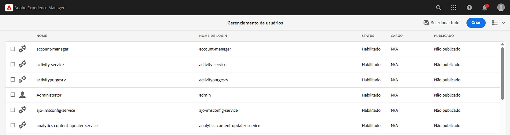
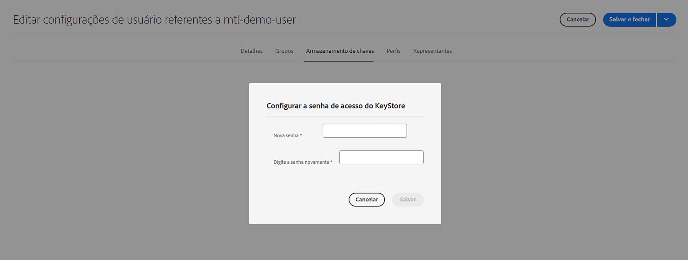
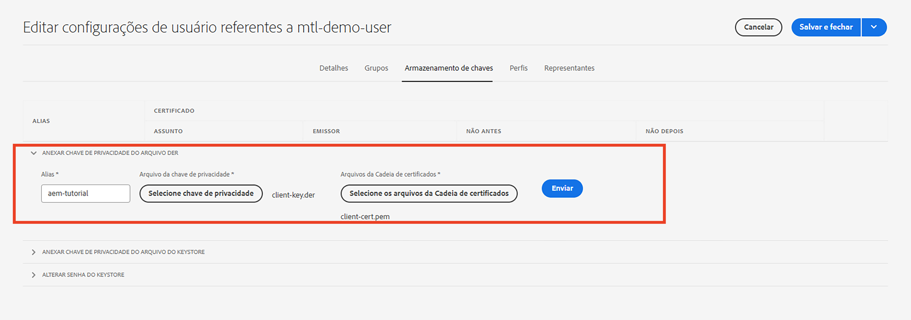
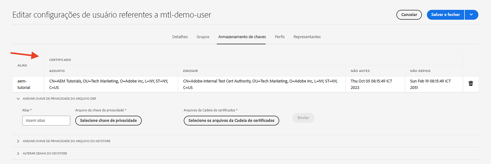

# Autenticação mTLS (Mutual Transport Layer Security)

Saiba como fazer chamadas HTTPS do AEM para APIs da Web que exigem autenticação MTLS (Mutual Transport Layer Security).

A autenticação mTLS ou TLS bidirecional melhora a segurança do protocolo TLS, exigindo **o cliente e o servidor se autenticam**. Essa autenticação é feita usando certificados digitais. Normalmente, é usada em cenários nos quais a segurança e a verificação de identidade fortes são críticas.

Por padrão, ao tentar fazer uma conexão HTTPS com uma API da Web que requer autenticação mTLS, a conexão falha com o erro:

```
javax.net.ssl.SSLHandshakeException: Received fatal alert: certificate_required
```

Esse problema ocorre quando o cliente não apresenta um certificado para autenticação.

Saiba como chamar com êxito APIs que exigem autenticação mTLS usando [Apache HttpClient](https://hc.apache.org/httpcomponents-client-4.5.x/index.html) e **AEM KeyStore e TrustStore**.


## HttpClient e carregar material do KeyStore de AEM

Em um nível superior, as seguintes etapas são necessárias para chamar uma API protegida por mTLS do AEM.

### Geração de certificado do AEM

Solicite o certificado de AEM fazendo parceria com a equipe de segurança de sua organização. A equipe de segurança fornece ou solicita detalhes relacionados ao certificado, como chave, solicitação de assinatura do certificado (CSR) e, usando a CSR, o certificado é emitido.

Para fins de demonstração, gere os detalhes relacionados ao certificado, como chave, solicitação de assinatura do certificado (CSR). No exemplo abaixo, uma CA autoassinada é usada para emitir o certificado.

- Primeiro, gere o certificado interno da autoridade de certificação (CA).

  ```shell
  # Create an internal Certification Authority (CA) certificate
  openssl req -new -x509 -days 9999 -keyout internal-ca-key.pem -out internal-ca-cert.pem
  ```

- Gere o certificado AEM.

  ```shell
  # Generate Key
  openssl genrsa -out client-key.pem
  
  # Generate CSR
  openssl req -new -key client-key.pem -out client-csr.pem
  
  # Generate certificate and sign with internal Certification Authority (CA)
  openssl x509 -req -days 9999 -in client-csr.pem -CA internal-ca-cert.pem -CAkey internal-ca-key.pem -CAcreateserial -out client-cert.pem
  
  # Verify certificate
  openssl verify -CAfile internal-ca-cert.pem client-cert.pem
  ```

- Converta a chave privada do AEM no formato DER, o AEM KeyStore requer a chave privada no formato DER.

  ```shell
  openssl pkcs8 -topk8 -inform PEM -outform DER -in client-key.pem -out client-key.der -nocrypt
  ```

>[!TIP]
>
>Os certificados CA autoassinados são usados apenas para fins de desenvolvimento. Para produção, use uma Autoridade de Certificação (CA) confiável para emitir o certificado.


### Intercâmbio de certificados

Se estiver usando uma CA autoassinada para o certificado AEM, como acima, troque o certificado ou o certificado interno da Autoridade de Certificação (CA) com o provedor da API.

Além disso, se o provedor de API estiver usando um certificado de CA autoassinado, receba o certificado ou o certificado de CA (Autoridade de Certificação) interno do provedor de API.

### Importação de certificado

Para importar o certificado AEM, siga as etapas abaixo:

1. Efetue logon no **Autor do AEM** como um **administrador**.

1. Navegue até **AEM Autor > Ferramentas > Segurança > Usuários > Criar ou selecionar um usuário existente**.

   

   Para fins de demonstração, um novo usuário chamado `mtl-demo-user` é criado.

1. Para abrir o **Propriedades do usuário**, clique no nome do usuário.

1. Clique em **Armazenamento de chaves** e clique em **Criar armazenamento de chaves** botão. Em seguida, no **Definir senha de acesso do KeyStore** , defina uma senha para o keystore deste usuário e clique em Salvar.

   

1. Na nova tela, sob o **ADICIONAR CHAVE PRIVADA DO ARQUIVO DER** siga as etapas abaixo:

   1. Inserir alias

   1. Importe a chave privada do AEM no formato DER, gerada acima.

   1. Importe os arquivos da Cadeia de certificados, gerados acima.

   1. Clique em Enviar

      

1. Verifique se o certificado foi importado com êxito.

   

Se o provedor de API estiver usando um certificado CA autoassinado, importe o certificado recebido para o AEM TrustStore, siga as etapas de [aqui](https://experienceleague.adobe.com/docs/experience-manager-learn/foundation/security/call-internal-apis-having-private-certificate.html#httpclient-and-load-aem-truststore-material).

Da mesma forma, se o AEM estiver usando um certificado CA autoassinado, solicite ao provedor da API que o importe.

### Protótipo de código de invocação da API mTLS usando HttpClient

Atualize o código Java™ conforme abaixo. Para usar `@Reference` anotação para obter AEM `KeyStoreService` serviço, o código de chamada deve ser um componente/serviço OSGi ou um Modelo Sling (e `@OsgiService` é usado lá).


```java
...

// Get AEM's KeyStoreService reference
@Reference
private com.adobe.granite.keystore.KeyStoreService keyStoreService;

...

// Get AEM KeyStore using KeyStoreService
KeyStore aemKeyStore = getAEMKeyStore(keyStoreService, resourceResolver);

if (aemKeyStore != null) {

    // Create SSL Context
    SSLContextBuilder sslbuilder = new SSLContextBuilder();

    // Load AEM KeyStore material into above SSL Context with keystore password
    // Ideally password should be encrypted and stored in OSGi config
    sslbuilder.loadKeyMaterial(aemKeyStore, "admin".toCharArray());

    // If API provider cert is self-signed, load AEM TrustStore material into above SSL Context
    // Get AEM TrustStore
    KeyStore aemTrustStore = getAEMTrustStore(keyStoreService, resourceResolver);
    sslbuilder.loadTrustMaterial(aemTrustStore, null);

    // Create SSL Connection Socket using above SSL Context
    SSLConnectionSocketFactory sslsf = new SSLConnectionSocketFactory(
            sslbuilder.build(), NoopHostnameVerifier.INSTANCE);

    // Create HttpClientBuilder
    HttpClientBuilder httpClientBuilder = HttpClientBuilder.create();
    httpClientBuilder.setSSLSocketFactory(sslsf);

    // Create HttpClient
    CloseableHttpClient httpClient = httpClientBuilder.build();

    // Invoke API
    closeableHttpResponse = httpClient.execute(new HttpGet(MTLS_API_ENDPOINT));

    // Code that reads response code and body from the 'closeableHttpResponse' object
    ...
} 

/**
 * Returns the AEM KeyStore of a user. In this example we are using the
 * 'mtl-demo-user' user.
 * 
 * @param keyStoreService
 * @param resourceResolver
 * @return AEM KeyStore
 */
private KeyStore getAEMKeyStore(KeyStoreService keyStoreService, ResourceResolver resourceResolver) {

    // get AEM KeyStore of 'mtl-demo-user' user, you can create a user or use an existing one. 
    // Then create keystore and upload key, certificate files.
    KeyStore aemKeyStore = keyStoreService.getKeyStore(resourceResolver, "mtl-demo-user");

    return aemKeyStore;
}

/**
 * 
 * Returns the global AEM TrustStore
 * 
 * @param keyStoreService OOTB OSGi service that makes AEM based KeyStore
 *                         operations easy.
 * @param resourceResolver
 * @return
 */
private KeyStore getAEMTrustStore(KeyStoreService keyStoreService, ResourceResolver resourceResolver) {

    // get AEM TrustStore from the KeyStoreService and ResourceResolver
    KeyStore aemTrustStore = keyStoreService.getTrustStore(resourceResolver);

    return aemTrustStore;
}

...
```

- Injetar o OOTB `com.adobe.granite.keystore.KeyStoreService` Serviço OSGi no componente OSGi.
- Obtenha a AEM KeyStore do usuário usando `KeyStoreService` e `ResourceResolver`, o `getAEMKeyStore(...)` faz isso.
- Se o provedor de API estiver usando um certificado CA autoassinado, obtenha o AEM TrustStore global, a variável `getAEMTrustStore(...)` faz isso.
- Criar um objeto de `SSLContextBuilder`, consulte Java™ [Detalhes da API](https://javadoc.io/static/org.apache.httpcomponents/httpcore/4.4.8/index.html?org/apache/http/ssl/SSLContextBuilder.html).
- Carregue a chave de armazenamento do AEM do usuário em `SSLContextBuilder` usar `loadKeyMaterial(final KeyStore keystore,final char[] keyPassword)` método.
- A senha do keystore é a senha definida ao criar o keystore, ela deve ser armazenada na configuração do OSGi, consulte [Valores de configuração do segredo](https://experienceleague.adobe.com/docs/experience-manager-cloud-service/content/implementing/deploying/configuring-osgi.html#secret-configuration-values).

## Evite alterações no JVM Keystore

Uma abordagem convencional para invocar efetivamente APIs mTLS com certificados privados envolve a modificação da JVM Keystore. Isso é feito importando os certificados privados usando o Java™ [keytool](https://docs.oracle.com/en/java/javase/11/tools/keytool.html#GUID-5990A2E4-78E3-47B7-AE75-6D1826259549) comando.

No entanto, esse método não está alinhado às práticas recomendadas de segurança e o AEM oferece uma opção superior por meio da utilização do **KeyStores específicos do usuário e TrustStore global** e [KeyStoreService](https://javadoc.io/doc/com.adobe.aem/aem-sdk-api/latest/com/adobe/granite/keystore/KeyStoreService.html).