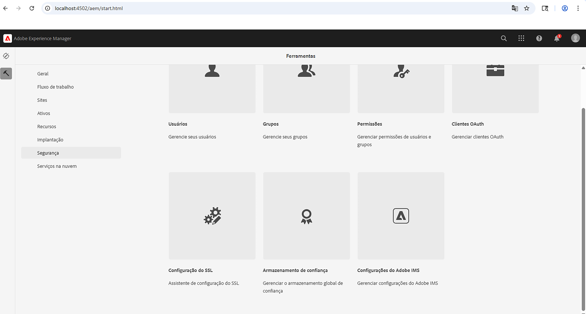
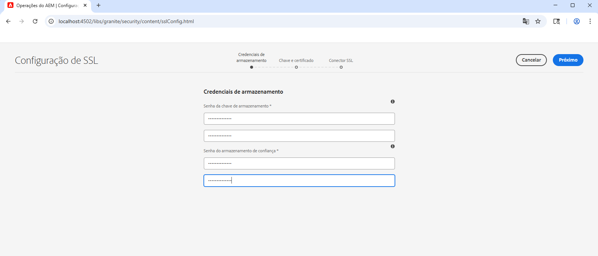
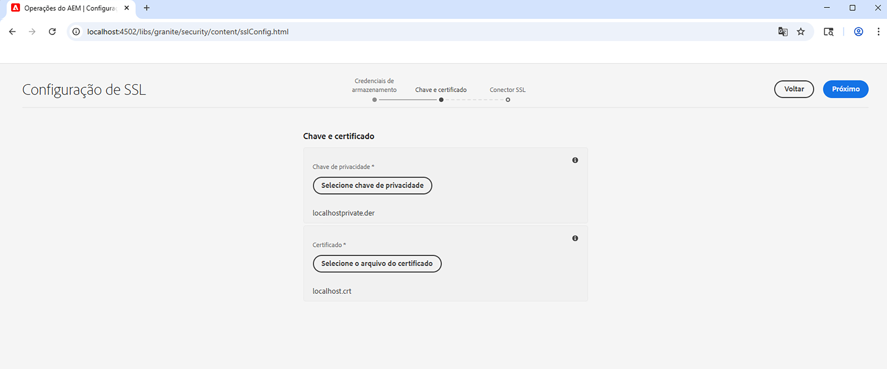
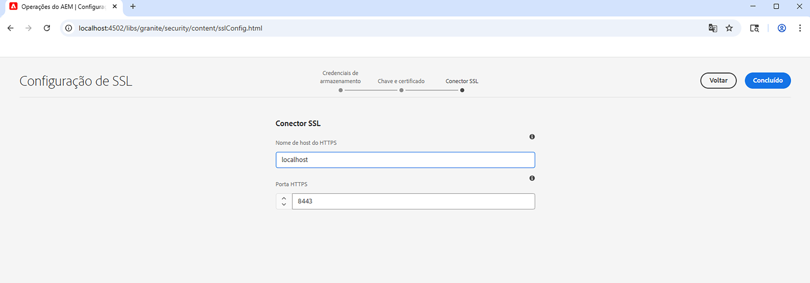
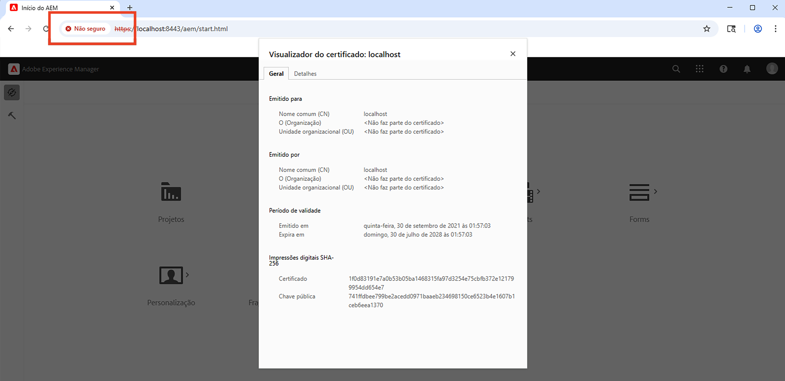

# Usar o assistente SSL no AEM

Saiba como configurar o SSL no Adobe Experience Manager para que ele seja executado em HTTPS usando o assistente SSL integrado.

>[!VIDEO](https://video.tv.adobe.com/v/17993?quality=12&learn=on)


>[!NOTE]
>
>Para ambientes gerenciados, é melhor que o departamento de TI forneça chaves e certificados confiáveis de CA.
>
>Certificados autoassinados devem ser usados apenas para fins de desenvolvimento.

## Usando o Assistente de configuração de SSL

Navegue até __AEM Author > Tools > Security > SSL Configuration__ e abra a variável __Assistente de configuração do SSL__.



### Criar credenciais de armazenamento

Para criar um _Armazenamento de chaves_ associado à `ssl-service` usuário do sistema e um global _Armazenamento de confiança_, use o __Credenciais de armazenamento__ etapa do assistente.

1. Digite a senha e confirme a senha do __Armazenamento de chaves__ associado à `ssl-service` usuário do sistema.
1. Digite a senha e confirme a senha do __Armazenamento de confiança__. Observe que é um armazenamento de confiança do sistema e, se já tiver sido criado, a senha inserida será ignorada.

   

### Carregar chave privada e certificado

Para fazer upload da _chave privada_ e _Certificado SSL_, use o __Chave e certificado__ etapa do assistente.

Normalmente, seu departamento de TI fornece o certificado e a chave confiáveis da CA, mas o certificado autoassinado pode ser usado para __desenvolvimento__ e __teste__ fins.

Para criar ou baixar o certificado autoassinado, consulte a [Chave privada e certificado autoassinados](#self-signed-private-key-and-certificate).

1. Faça upload do __Chave privada__ no formato DER (Distinguished Encoding Rules). Ao contrário do PEM, os arquivos codificados em DER não contêm instruções de texto simples, como `-----BEGIN CERTIFICATE-----`
1. Fazer upload do associado __Certificado SSL__ no `.crt` formato.

   

### Atualizar detalhes do conector SSL

Para atualizar o _hostname_ e _porta_ use o __Conector SSL__ etapa do assistente.

1. Atualize ou verifique a __Nome de host HTTPS__ deve corresponder ao `Common Name (CN)` do certificado.
1. Atualize ou verifique a __Porta HTTPS__ valor.

   

### Verifique a configuração do SSL

1. Para verificar o SSL, clique no link __Ir para o URL HTTPS__ botão.
1. Se estiver usando um certificado autoassinado, você verá `Your connection is not private` erro.

   

## Chave privada e certificado autoassinados

O zip a seguir contém [!DNL DER] e [!DNL CRT] arquivos necessários para a configuração local do AEM SSL e destinados apenas ao desenvolvimento local.

A variável [!DNL DER] e [!DNL CERT] os arquivos são fornecidos para conveniência e gerados usando as etapas descritas na seção Gerar chave privada e certificado autoassinado abaixo.

Se necessário, a senha do certificado é **administrador**.

Este host local - chave privada e certificate.zip autoassinado (expira em julho de 2028)

[Baixar o arquivo de certificado](assets/use-the-ssl-wizard/certificate.zip)

### Geração de chave privada e certificado autoassinado

O vídeo acima descreve a configuração do SSL em uma instância de autor do AEM usando certificados autoassinados. Os comandos abaixo que usam [[!DNL OpenSSL]](https://www.openssl.org/) O pode gerar uma chave privada e um certificado para serem usados na Etapa 2 do assistente.

```shell
### Create Private Key
$ openssl genrsa -aes256 -out localhostprivate.key 4096

### Generate Certificate Signing Request using private key
$ openssl req -sha256 -new -key localhostprivate.key -out localhost.csr -subj '/CN=localhost'

### Generate the SSL certificate and sign with the private key, will expire one year from now
$ openssl x509 -req -extfile <(printf "subjectAltName=DNS:localhost") -days 365 -in localhost.csr -signkey localhostprivate.key -out localhost.crt

### Convert Private Key to DER format - SSL wizard requires key to be in DER format
$ openssl pkcs8 -topk8 -inform PEM -outform DER -in localhostprivate.key -out localhostprivate.der -nocrypt
```
