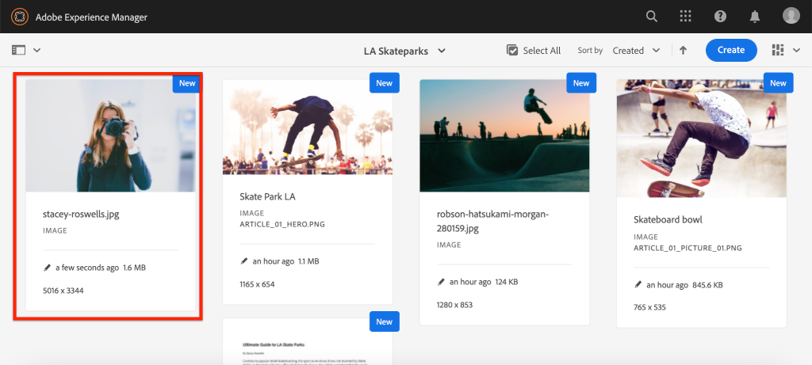
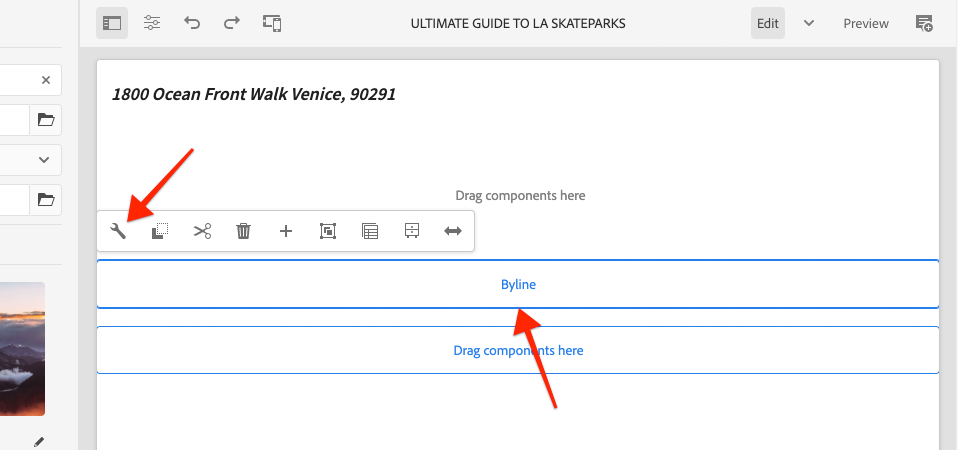

# Componente personalizado {#custom-component}

Este tutorial aborda a criação completa de um Componente AEM Byline personalizado que exibe o conteúdo criado em uma caixa de diálogo e explora o desenvolvimento de um Modelo Sling para encapsular a lógica de negócios que preenche o HTL do componente.

## Pré-requisitos {#prerequisites}

Revise as ferramentas e instruções necessárias para configurar um [ambiente de desenvolvimento local](overview.md#local-dev-environment).

### Projeto inicial

>[!NOTE]
>
> Se você concluiu o capítulo anterior com êxito, é possível reutilizar o projeto e ignorar as etapas para verificar o projeto inicial.

Confira o código base que o tutorial constrói em:

1. Confira a ramificação `tutorial/custom-component-start` de [GitHub](https://github.com/adobe/aem-guides-wknd)

   ```shell
   $ cd aem-guides-wknd
   $ git checkout tutorial/custom-component-start
   ```

1. Implante a base de código em uma instância do AEM local usando suas habilidades Maven:

   ```shell
   $ mvn clean install -PautoInstallSinglePackage
   ```

   >[!NOTE]
   >
   > Se estiver usando o AEM 6.5 ou 6.4, anexe o perfil `classic` a qualquer comando Maven.

   ```shell
   $ mvn clean install -PautoInstallSinglePackage -Pclassic
   ```

Você sempre pode visualizar o código concluído em [GitHub](https://github.com/adobe/aem-guides-wknd/tree/tutorial/custom-component-solution) ou verificar o código localmente ao alternar para a ramificação `tutorial/custom-component-solution`.

## Objetivo

1. Entenda como criar um componente AEM personalizado
1. Saiba como encapsular a lógica comercial com Modelos do Sling
1. Entender como usar um Modelo do Sling de dentro de um Script HTL

## O que você vai criar {#byline-component}

Nesta parte do tutorial WKND, é criado um Componente de linha de bytes que será usado para exibir informações criadas sobre o colaborador de um artigo.


*Componente Byline*

A implementação do componente Byline inclui uma caixa de diálogo que coleta o conteúdo byline e um Modelo Sling personalizado que recupera o conteúdo byline:

* Nome
* Imagem
* Ocupações

## Criar componente Byline {#create-byline-component}

Primeiro, crie a estrutura do nó Componente de Byline e defina uma caixa de diálogo. Isso representa o Componente no AEM e define implicitamente o tipo de recurso do componente pelo seu local no JCR.

A caixa de diálogo expõe a interface com a qual os autores de conteúdo podem fornecer. Para essa implementação, o componente **Image** do Componente principal do WCM AEM será aproveitado para lidar com a criação e renderização da imagem do Byline, de modo que será definido como `sling:resourceSuperType` do nosso componente.

### Criar definição de componente {#create-component-definition}

1. No módulo **ui.apps**, navegue até `/apps/wknd/components` e crie uma nova pasta chamada `byline`.
1. Abaixo da pasta `byline` adicione um novo arquivo chamado `.content.xml`

   

1. Preencha o arquivo `.content.xml` com o seguinte:

   ```xml
   <?xml version="1.0" encoding="UTF-8"?>
       <jcr:root xmlns:sling="http://sling.apache.org/jcr/sling/1.0" xmlns:cq="http://www.day.com/jcr/cq/1.0" xmlns:jcr="http://www.jcp.org/jcr/1.0"
       jcr:primaryType="cq:Component"
       jcr:title="Byline"
       jcr:description="Displays a contributor's byline."
       componentGroup="WKND Sites Project - Content"
       sling:resourceSuperType="core/wcm/components/image/v2/image"/>
   ```

   O arquivo XML acima fornece a definição do componente, incluindo o título, a descrição e o grupo. O `sling:resourceSuperType` aponta para `core/wcm/components/image/v2/image`, que é o [Componente de imagem principal](https://experienceleague.adobe.com/docs/experience-manager-core-components/using/components/image.html).

### Criar o script HTL {#create-the-htl-script}

1. Abaixo da pasta `byline`, adicione um novo arquivo `byline.html`, que é responsável pela apresentação HTML do componente. É importante nomear o arquivo como a pasta, pois ele se torna o script padrão que o Sling usará para renderizar esse tipo de recurso.

1. Adicione o seguinte código ao `byline.html`.

   ```html
   <!--/* byline.html */-->
   <div data-sly-use.placeholderTemplate="core/wcm/components/commons/v1/templates.html">
   </div>
   <sly data-sly-call="${placeholderTemplate.placeholder @ isEmpty=true}"></sly>
   ```

`byline.html` é  [revisitado mais tarde](#byline-htl), assim que o Modelo do Sling é criado. O estado atual do arquivo HTL permite que o componente seja exibido em um estado vazio, no Editor de página do AEM Sites, quando ele é arrastado e solto na página.

### Criar a definição da caixa de diálogo {#create-the-dialog-definition}

Em seguida, defina uma caixa de diálogo para o componente Byline com os seguintes campos:

* **Nome**: um campo de texto com o nome do colaborador.
* **Imagem**: uma referência à imagem bio do colaborador.
* **Profissões**: uma lista de ocupações atribuídas ao colaborador. As profissões devem ser classificadas alfabeticamente por ordem crescente (a a z).

1. Abaixo da pasta `byline`, crie uma nova pasta chamada `_cq_dialog`.
1. Abaixo de `byline/_cq_dialog` adicione um novo arquivo chamado `.content.xml`. Esta é a definição XML da caixa de diálogo. Adicione o seguinte XML:

   ```xml
   <?xml version="1.0" encoding="UTF-8"?>
   <jcr:root xmlns:sling="http://sling.apache.org/jcr/sling/1.0" xmlns:cq="http://www.day.com/jcr/cq/1.0" xmlns:jcr="http://www.jcp.org/jcr/1.0" xmlns:nt="http://www.jcp.org/jcr/nt/1.0"
           jcr:primaryType="nt:unstructured"
           jcr:title="Byline"
           sling:resourceType="cq/gui/components/authoring/dialog">
       <content
               jcr:primaryType="nt:unstructured"
               sling:resourceType="granite/ui/components/coral/foundation/container">
           <items jcr:primaryType="nt:unstructured">
               <tabs
                       jcr:primaryType="nt:unstructured"
                       sling:resourceType="granite/ui/components/coral/foundation/tabs"
                       maximized="{Boolean}false">
                   <items jcr:primaryType="nt:unstructured">
                       <asset
                               jcr:primaryType="nt:unstructured"
                               sling:hideResource="{Boolean}false"/>
                       <metadata
                               jcr:primaryType="nt:unstructured"
                               sling:hideResource="{Boolean}true"/>
                       <properties
                               jcr:primaryType="nt:unstructured"
                               jcr:title="Properties"
                               sling:resourceType="granite/ui/components/coral/foundation/container"
                               margin="{Boolean}true">
                           <items jcr:primaryType="nt:unstructured">
                               <columns
                                       jcr:primaryType="nt:unstructured"
                                       sling:resourceType="granite/ui/components/coral/foundation/fixedcolumns"
                                       margin="{Boolean}true">
                                   <items jcr:primaryType="nt:unstructured">
                                       <column
                                               jcr:primaryType="nt:unstructured"
                                               sling:resourceType="granite/ui/components/coral/foundation/container">
                                           <items jcr:primaryType="nt:unstructured">
                                               <name
                                                       jcr:primaryType="nt:unstructured"
                                                       sling:resourceType="granite/ui/components/coral/foundation/form/textfield"
                                                       emptyText="Enter the contributor's name to display."
                                                       fieldDescription="The contributor's name to display."
                                                       fieldLabel="Name"
                                                       name="./name"
                                                       required="{Boolean}true"/>
                                               <occupations
                                                       jcr:primaryType="nt:unstructured"
                                                       sling:resourceType="granite/ui/components/coral/foundation/form/multifield"
                                                       fieldDescription="A list of the contributor's occupations."
                                                       fieldLabel="Occupations"
                                                       required="{Boolean}false">
                                                   <field
                                                           jcr:primaryType="nt:unstructured"
                                                           sling:resourceType="granite/ui/components/coral/foundation/form/textfield"
                                                           emptyText="Enter an occupation"
                                                           name="./occupations"/>
                                               </occupations>
                                           </items>
                                       </column>
                                   </items>
                               </columns>
                           </items>
                       </properties>
                   </items>
               </tabs>
           </items>
       </content>
   </jcr:root>
   ```

   Essas definições de nó da caixa de diálogo usam o [Sling Resource Merger](https://sling.apache.org/documentation/bundles/resource-merger.html) para controlar quais guias de diálogo são herdadas do componente `sling:resourceSuperType`, nesse caso, o **Componente de imagem dos componentes principais**.

   

### Criar a caixa de diálogo Política {#create-the-policy-dialog}

Seguindo a mesma abordagem da criação da caixa de diálogo, crie uma caixa de diálogo Política (anteriormente conhecida como caixa de diálogo Design) para ocultar campos indesejados na configuração Política herdada do componente Imagem dos componentes principais.

1. Abaixo da pasta `byline`, crie uma nova pasta chamada `_cq_design_dialog`.
1. Abaixo de `byline/_cq_design_dialog` crie um novo arquivo chamado `.content.xml`. Atualize o arquivo com o seguinte: com o XML a seguir. É mais fácil abrir o `.content.xml` e copiar/colar o XML abaixo nele.

   ```xml
   <?xml version="1.0" encoding="UTF-8"?>
   <jcr:root xmlns:sling="http://sling.apache.org/jcr/sling/1.0" xmlns:granite="http://www.adobe.com/jcr/granite/1.0" xmlns:cq="http://www.day.com/jcr/cq/1.0" xmlns:jcr="http://www.jcp.org/jcr/1.0" xmlns:nt="http://www.jcp.org/jcr/nt/1.0"
       jcr:primaryType="nt:unstructured"
       jcr:title="Byline"
       sling:resourceType="cq/gui/components/authoring/dialog">
       <content
               jcr:primaryType="nt:unstructured">
           <items jcr:primaryType="nt:unstructured">
               <tabs
                       jcr:primaryType="nt:unstructured">
                   <items jcr:primaryType="nt:unstructured">
                       <properties
                               jcr:primaryType="nt:unstructured">
                           <items jcr:primaryType="nt:unstructured">
                               <content
                                       jcr:primaryType="nt:unstructured">
                                   <items jcr:primaryType="nt:unstructured">
                                       <decorative
                                               jcr:primaryType="nt:unstructured"
                                               sling:hideResource="{Boolean}true"/>
                                       <altValueFromDAM
                                               jcr:primaryType="nt:unstructured"
                                               sling:hideResource="{Boolean}true"/>
                                       <titleValueFromDAM
                                               jcr:primaryType="nt:unstructured"
                                               sling:hideResource="{Boolean}true"/>
                                       <displayCaptionPopup
                                               jcr:primaryType="nt:unstructured"
                                               sling:hideResource="{Boolean}true"/>
                                       <disableUuidTracking
                                               jcr:primaryType="nt:unstructured"
                                               sling:hideResource="{Boolean}true"/>
                                   </items>
                               </content>
                           </items>
                       </properties>
                       <features
                               jcr:primaryType="nt:unstructured">
                           <items jcr:primaryType="nt:unstructured">
                               <content
                                       jcr:primaryType="nt:unstructured">
                                   <items jcr:primaryType="nt:unstructured">
                                       <accordion
                                               jcr:primaryType="nt:unstructured">
                                           <items jcr:primaryType="nt:unstructured">
                                               <orientation
                                                       jcr:primaryType="nt:unstructured"
                                                       sling:hideResource="{Boolean}true"/>
                                               <crop
                                                       jcr:primaryType="nt:unstructured"
                                                       sling:hideResource="{Boolean}true"/>
                                           </items>
                                       </accordion>
                                   </items>
                               </content>
                           </items>
                       </features>
                   </items>
               </tabs>
           </items>
       </content>
   </jcr:root>
   ```

   A base para o XML anterior **Policy dialog** foi obtida do [Core Components Image component](https://github.com/adobe/aem-core-wcm-components/blob/master/content/src/content/jcr_root/apps/core/wcm/components/image/v2/image/_cq_design_dialog/.content.xml).

   Como na configuração da caixa de diálogo, [Sling Resource Merger](https://sling.apache.org/documentation/bundles/resource-merger.html) é usado para ocultar campos irrelevantes que de outra forma seriam herdados do `sling:resourceSuperType`, como visto pelas definições de nó com a propriedade `sling:hideResource="{Boolean}true"` .

### Implantar o código {#deploy-the-code}

1. Implante a base de código atualizada em uma instância do AEM local usando suas habilidades Maven:

   ```shell
   $ cd aem-guides-wknd
   $ mvn clean install -PautoInstallSinglePackage
   ```

## Adicionar o componente a uma página {#add-the-component-to-a-page}

Para manter as coisas simples e focadas no desenvolvimento de componentes do AEM, adicionaremos o componente Byline em seu estado atual a uma página de Artigo para verificar se a definição do nó `cq:Component` está implantada e correta, o AEM reconhece a nova definição de componente e a caixa de diálogo do componente funciona para criação.

### Adicionar uma imagem aos ativos AEM

Primeiro, faça o upload de uma captura de cabeça de amostra para o AEM Assets a ser usado para preencher a imagem no componente Byline.

1. Navegue até a pasta LA Skateparks no AEM Assets: [http://localhost:4502/assets.html/content/dam/wknd/en/magazine/la-skateparks](http://localhost:4502/assets.html/content/dam/wknd/en/magazine/la-skateparks).

1. Carregue a captura de cabeçalho para **[stacey-roswells.jpg](assets/custom-component/stacey-roswells.jpg)** na pasta.

   

### Crie o componente {#author-the-component}

Em seguida, adicione o componente Byline a uma página no AEM. Como adicionamos o componente Byline ao **Projeto de Sites WKND - Conteúdo** Grupo de Componentes, por meio da definição `ui.apps/src/main/content/jcr_root/apps/wknd/components/byline/.content.xml`, ele fica automaticamente disponível para qualquer grupo de componentes **Contêiner** cujo **Política** permite o **Projeto de Sites WKND - Conteúdo**, que a Página do Artigo O Contêiner de layout é.

1. Navegue até o artigo LA Skatepark em: [http://localhost:4502/editor.html/content/wknd/us/en/magazine/guide-la-skateparks.html](http://localhost:4502/editor.html/content/wknd/us/en/magazine/guide-la-skateparks.html)

1. Na barra lateral esquerda, arraste e solte um **Byline component** em **bottom** do Contêiner de layout da página de artigo aberta.

   

1. Certifique-se de que a **barra lateral esquerda esteja aberta** e visível, e que o **Localizador de ativos** esteja selecionado.

   

1. Selecione o **Espaço reservado do componente Byline**, que, por sua vez, exibe a barra de ação e toque no ícone **chave** para abrir a caixa de diálogo.

   

1. Com a caixa de diálogo aberta e a primeira guia (Ativo) ativa, abre a barra lateral esquerda e, no localizador de ativos, arraste uma imagem para a área de soltar Imagem . Procure por &quot;stacey&quot; para encontrar a imagem biográfica de Stacey Roswells fornecida no pacote ui.content de WKND.

   

1. Depois de adicionar uma imagem, clique na guia **Properties** para inserir o **Name** e **Occupations**.

   Ao inserir ocupações, insira-as em **ordem alfabética reversa** para que a lógica comercial alfabética que implementaremos no Modelo do Sling seja prontamente aparente.

   Toque no botão **Concluído** na parte inferior direita para salvar as alterações.

   

   Os autores do AEM configuram e criam componentes por meio das caixas de diálogo. Nesse ponto do desenvolvimento do componente Byline, as caixas de diálogo são incluídas na coleta de dados, no entanto, a lógica para renderizar o conteúdo criado ainda não foi adicionada. Portanto, somente o espaço reservado é exibido.

1. Depois de salvar a caixa de diálogo, navegue até [CRXDE Lite](http://localhost:4502/crx/de/index.jsp#/content/wknd/us/en/magazine/guide-la-skateparks/jcr%3Acontent/root/container/container/byline) e revise como o conteúdo do componente é armazenado no nó de conteúdo do componente de linha de bytes na página do AEM.

   Encontre o nó Byline component content abaixo da página LA Skate Parks , ou seja `/content/wknd/us/en/magazine/guide-la-skateparks/jcr:content/root/container/container/byline`.

   Observe que os nomes de propriedade `name`, `occupations` e `fileReference` são armazenados no **nó byline**.

   Além disso, observe que o `sling:resourceType` do nó está definido como `wknd/components/content/byline`, que é o que vincula esse nó de conteúdo à implementação do componente Byline.

   

## Criar Modelo de Sling de Byline {#create-sling-model}

Em seguida, criaremos um Modelo do Sling para agir como o modelo de dados e manter a lógica de negócios do componente Byline.

Os Modelos do Sling são objetos Java &quot;POJO&quot; (Plain Old Java Objects) orientados por anotações que facilitam o mapeamento de dados do JCR para variáveis Java e fornecem várias outras sutilezas ao serem desenvolvidas no contexto do AEM.

### Revisar Dependências de Maven {#maven-dependency}

O Modelo de sling Byline dependerá de várias APIs Java fornecidas pelo AEM. Essas APIs são disponibilizadas por meio do `dependencies` listado no arquivo POM do módulo `core`. O projeto usado para este tutorial foi criado para o AEM as a Cloud Service. No entanto, é exclusiva, pois é compatível com o AEM 6.5/6.4. Portanto, ambas as dependências do Cloud Service e do AEM 6.x estão incluídas.

1. Abra o arquivo `pom.xml` abaixo de `<src>/aem-guides-wknd/core/pom.xml`.
1. Encontre a dependência para `aem-sdk-api` - **Somente AEM as a Cloud Service**

   ```xml
   <dependency>
       <groupId>com.adobe.aem</groupId>
       <artifactId>aem-sdk-api</artifactId>
   </dependency>
   ```

   O [aem-sdk-api](https://experienceleague.adobe.com/docs/experience-manager-cloud-service/implementing/developing/aem-as-a-cloud-service-sdk.html?lang=en#building-for-the-sdk) contém todas as APIs Java públicas expostas pelo AEM. O `aem-sdk-api` é usado por padrão ao criar este projeto. A versão é mantida no pom do reator principal localizado na raiz do projeto em `aem-guides-wknd/pom.xml`.

1. Encontre a dependência para `uber-jar` - **AEM 6.5/6.4 Somente**

   ```xml
   ...
       <dependency>
           <groupId>com.adobe.aem</groupId>
           <artifactId>uber-jar</artifactId>
           <classifier>apis</classifier>
       </dependency>
   ...
   ```

   O `uber-jar` só é incluído quando o perfil `classic` é chamado, ou seja `mvn clean install -PautoInstallSinglePackage -Pclassic`. Novamente, isso é exclusivo para este projeto. Em um projeto real, gerado pelo Arquétipo de projeto do AEM, o `uber-jar` será o padrão se a versão do AEM especificada for 6.5 ou 6.4.

   O [uber-jar](https://docs.adobe.com/content/help/en/experience-manager-65/developing/devtools/ht-projects-maven.html#experience-manager-api-dependencies) contém todas as APIs Java públicas expostas pelo AEM 6.x. A versão é mantida no pom do reator principal localizado na raiz do projeto `aem-guides-wknd/pom.xml`.

1. Encontre a dependência para `core.wcm.components.core`:

   ```xml
    <!-- Core Component Dependency -->
       <dependency>
           <groupId>com.adobe.cq</groupId>
           <artifactId>core.wcm.components.core</artifactId>
       </dependency>
   ```

   Todas as APIs Java públicas expostas pelos Componentes principais do AEM. Os Componentes principais do AEM são um projeto mantido fora do AEM e, portanto, têm um ciclo de lançamento separado. Por isso, é uma dependência que precisa ser incluída separadamente e **not** incluída com o `uber-jar` ou `aem-sdk-api`.

   Como o uber-jar, a versão dessa dependência é mantida no arquivo pom do reator pai localizado em `aem-guides-wknd/pom.xml`.

   Mais tarde neste tutorial, usaremos a classe Imagem do componente principal para exibir a imagem no componente Linha de bytes. É necessário ter a dependência do Componente principal para criar e compilar nosso Modelo do Sling.

### Interface de byline {#byline-interface}

Criar uma interface Java pública para o Byline. `Byline.java` define os métodos públicos necessários para direcionar o script  `byline.html` HTL.

1. No módulo `aem-guides-wknd.core` abaixo de `core/src/main/java/com/adobe/aem/guides/wknd/core/models` crie um novo arquivo chamado `Byline.java`

   

1. Atualize `Byline.java` com os seguintes métodos:

   ```java
   package com.adobe.aem.guides.wknd.core.models;
   
   import java.util.List;
   
   /**
   * Represents the Byline AEM Component for the WKND Site project.
   **/
   public interface Byline {
       /***
       * @return a string to display as the name.
       */
       String getName();
   
       /***
       * Occupations are to be sorted alphabetically in a descending order.
       *
       * @return a list of occupations.
       */
       List<String> getOccupations();
   
       /***
       * @return a boolean if the component has enough content to display.
       */
       boolean isEmpty();
   }
   ```

   Os dois primeiros métodos expõem os valores para o **name** e **ocuations** para o componente Byline.

   O método `isEmpty()` é usado para determinar se o componente tem qualquer conteúdo para renderizar ou se está aguardando ser configurado.

   Observe que não há um método para a Imagem; [vamos verificar por que isso é posterior](#tackling-the-image-problem).

### Implementação de byline {#byline-implementation}

`BylineImpl.java` é a implementação do Modelo do Sling que implementa a  `Byline.java` interface definida anteriormente. O código completo para `BylineImpl.java` pode ser encontrado na parte inferior desta seção.

1. Crie uma nova pasta chamada `impl` abaixo de `core/src/main/java/com/adobe/aem/guides/core/models`.
1. Na pasta `impl` crie um novo arquivo `BylineImpl.java`.

   

1. Abrir `BylineImpl.java`. Especifique que ele implementa a interface `Byline`. Use os recursos de preenchimento automático do IDE ou atualize manualmente o arquivo para incluir os métodos necessários para implementar a interface `Byline`:

   ```java
   package com.adobe.aem.guides.wknd.core.models.impl;
   import java.util.List;
   import com.adobe.aem.guides.wknd.core.models.Byline;
   
   public class BylineImpl implements Byline {
   
       @Override
       public String getName() {
           // TODO Auto-generated method stub
           return null;
       }
   
       @Override
       public List<String> getOccupations() {
           // TODO Auto-generated method stub
           return null;
       }
   
       @Override
       public boolean isEmpty() {
           // TODO Auto-generated method stub
           return false;
       }
   }
   ```

1. Adicione as anotações do Modelo do Sling atualizando `BylineImpl.java` com as seguintes anotações de nível de classe. Essa anotação `@Model(..)`é o que transforma a classe em um Modelo do Sling.

   ```java
   import org.apache.sling.api.SlingHttpServletRequest;
   import org.apache.sling.models.annotations.Model;
   import org.apache.sling.models.annotations.DefaultInjectionStrategy;
   ...
   @Model(
           adaptables = {SlingHttpServletRequest.class},
           adapters = {Byline.class},
           resourceType = {BylineImpl.RESOURCE_TYPE},
           defaultInjectionStrategy = DefaultInjectionStrategy.OPTIONAL
   )
   public class BylineImpl implements Byline {
       protected static final String RESOURCE_TYPE = "wknd/components/content/byline";
       ...
   }
   ```

   Vamos analisar essa anotação e seus parâmetros:

   * A anotação `@Model` registra o BylineImpl como um Modelo Sling quando ele é implantado no AEM.
   * O parâmetro `adaptables` especifica que esse modelo pode ser adaptado pela solicitação.
   * O parâmetro `adapters` permite que a classe de implementação seja registrada na interface Byline. Isso permite que o script HTL chame o Modelo do Sling por meio da interface (em vez do impl diretamente). [Mais detalhes sobre adaptadores podem ser encontrados aqui](https://sling.apache.org/documentation/bundles/models.html#specifying-an-alternate-adapter-class-since-110).
   * O `resourceType` aponta para o tipo de recurso do componente Byline (criado anteriormente) e ajuda a resolver o modelo correto se houver várias implementações. [Mais detalhes sobre como associar uma classe de modelo a um tipo de recurso podem ser encontrados aqui](https://sling.apache.org/documentation/bundles/models.html#associating-a-model-class-with-a-resource-type-since-130).

### Implementar os métodos do Modelo do Sling {#implementing-the-sling-model-methods}

#### getName() {#implementing-get-name}

O primeiro método que abordaremos é `getName()` que simplesmente retorna o valor armazenado no nó de conteúdo JCR da linha de bytes na propriedade `name`.

Para isso, a anotação `@ValueMapValue` do Modelo de sling é usada para inserir o valor em um campo Java usando o recurso da Solicitação ValueMap.


```java
import org.apache.sling.models.annotations.injectorspecific.ValueMapValue;

public class BylineImpl implements Byline {
    ...
    @ValueMapValue
    private String name;

    ...
    @Override
    public String getName() {
        return name;
    }
    ...
}
```

Como a propriedade JCR compartilha o mesmo nome do campo Java (ambos são &quot;nome&quot;), `@ValueMapValue` resolve automaticamente essa associação e injeta o valor da propriedade no campo Java.

#### getOccupations() {#implementing-get-occupations}

O próximo método para implementar é `getOccupations()`. Esse método coleta todas as ocupações armazenadas na propriedade JCR `occupations` e retorna uma coleção classificada (alfabeticamente) delas.

Usando a mesma técnica explorada em `getName()` o valor da propriedade pode ser inserido no campo do Modelo do Sling.

Quando os valores da propriedade JCR estão disponíveis no Modelo do Sling por meio do campo Java inserido `occupations`, a lógica comercial de classificação pode ser aplicada no método `getOccupations()` .


```java
import java.util.ArrayList;
import java.util.Collections;
  ...

public class BylineImpl implements Byline {
    ...
    @ValueMapValue
    private List<String> occupations;
    ...
    @Override
    public List<String> getOccupations() {
        if (occupations != null) {
            Collections.sort(occupations);
            return new ArrayList<String>(occupations);
        } else {
            return Collections.emptyList();
        }
    }
    ...
}
  ...
```


#### isEmpty() {#implementing-is-empty}

O último método público é `isEmpty()` que determina quando o componente deve se considerar &quot;suficientemente criado&quot; para renderizar.

Para esse componente, temos requisitos de negócios que indicam que todos os três campos, nome, imagem e ocupações devem ser preenchidos *antes que* o componente possa ser renderizado.


```java
import org.apache.commons.lang3.StringUtils;
  ...
public class BylineImpl implements Byline {
    ...
    @Override
    public boolean isEmpty() {
        if (StringUtils.isBlank(name)) {
            // Name is missing, but required
            return true;
        } else if (occupations == null || occupations.isEmpty()) {
            // At least one occupation is required
            return true;
        } else if (/* image is not null, logic to be determined */) {
            // A valid image is required
            return true;
        } else {
            // Everything is populated, so this component is not considered empty
            return false;
        }
    }
    ...
}
```


#### Lidar com o &quot;problema de imagem&quot; {#tackling-the-image-problem}

Verificar as condições de nome e ocupação são triviais (e o Apache Commons Lang3 fornece a classe sempre útil [StringUtils](https://commons.apache.org/proper/commons-lang/apidocs/org/apache/commons/lang3/StringUtils.html)), no entanto, não está claro como a **presença da Imagem** pode ser validada, pois o componente de Imagem dos Componentes Principais é usado para exibir a imagem.

Há duas maneiras de lidar com isso:

Verifique se a propriedade JCR `fileReference` resolve um ativo. ** ORConverta esse recurso para um Modelo de sling de imagem do componente principal e verifique se o  `getSrc()` método não está vazio.

Optaremos pela abordagem **Second**. A primeira abordagem provavelmente é suficiente, mas neste tutorial o último será usado para permitir a exploração de outros recursos dos Modelos do Sling.

1. Crie um método privado que obtenha a Imagem. Esse método é deixado privado porque não precisamos expor o objeto Image no próprio HTL e seu único método usado para direcionar `isEmpty().`

   O seguinte método privado para `getImage()`:

   ```java
   import com.adobe.cq.wcm.core.components.models.Image;
   ...
   private Image getImage() {
       Image image = null;
       // Figure out how to populate the image variable!
       return image;
   }
   ```

   Como mencionado acima, há mais duas abordagens para obter o **Modelo do Sling de Imagem**:

   O primeiro usa a anotação `@Self` para adaptar automaticamente a solicitação atual ao `Image.class` do Componente principal

   ```java
   @Self
   private Image image;
   ```

   O segundo usa o serviço OSGi [Apache Sling ModelFactory](https://sling.apache.org/apidocs/sling10/org/apache/sling/models/factory/ModelFactory.html), que é um serviço muito útil, e nos ajuda a criar Modelos do Sling de outros tipos no código Java.

   Optaremos pela segunda abordagem.

   >[!NOTE]
   >
   >Em uma implementação real, a abordagem &quot;Um&quot;, usando `@Self` é preferida, pois é a solução mais simples e elegante. Neste tutorial, usaremos a segunda abordagem, pois ela requer a exploração de mais facetas de Modelos do Sling que são extremamente úteis são componentes mais complexos!

   Como os Modelos do Sling são Java POJO, e não OSGi Services, as anotações de injeção do OSGi habituais `@Reference` **não podem** ser usadas, em vez disso os Modelos do Sling fornecem uma anotação especial **[@OSGiService](https://sling.apache.org/documentation/bundles/models.html#injector-specific-annotations)** que fornece funcionalidade semelhante.

1. Atualize `BylineImpl.java` para incluir a anotação `OSGiService` para inserir o `ModelFactory`:

   ```java
   import org.apache.sling.models.factory.ModelFactory;
   import org.apache.sling.models.annotations.injectorspecific.OSGiService;
   ...
   public class BylineImpl implements Byline {
       ...
       @OSGiService
       private ModelFactory modelFactory;
   }
   ```

   Com o `ModelFactory` disponível, um Modelo de sling de imagem do componente principal pode ser criado usando:

   ```java
   modelFactory.getModelFromWrappedRequest(SlingHttpServletRequest request, Resource resource, java.lang.Class<T> targetClass)
   ```

   No entanto, esse método requer uma solicitação e um recurso, ainda não disponíveis no Modelo do Sling. Para obtê-los, mais anotações do Modelo do Sling são usadas!

   Para obter a solicitação atual, a anotação **[@Self](https://sling.apache.org/documentation/bundles/models.html#injector-specific-annotations)** pode ser usada para inserir o `adaptable` (que é definido no `@Model(..)` como `SlingHttpServletRequest.class`, em um campo de classe Java.

1. Adicione a anotação **@Self** para obter a solicitação **SlingHttpServletRequest**:

   ```java
   import org.apache.sling.models.annotations.injectorspecific.Self;
   ...
   @Self
   private SlingHttpServletRequest request;
   ```

   Lembre-se de que usar `@Self Image image` para inserir o Modelo de Sling da Imagem do Componente Principal era uma opção acima - a anotação `@Self` tenta inserir o objeto adaptável (no nosso caso, um SlingHttpServletRequest) e adaptar-se ao tipo de campo de anotação. Como o Modelo Sling da Imagem do Componente Principal é adaptável a partir de objetos SlingHttpServletRequest , isso teria funcionado e seria menos código do que nossa abordagem mais exploratória.

   Agora, introduzimos as variáveis necessárias para instanciar nosso modelo de Imagem por meio da API ModelFactory . Usaremos a anotação **[@PostConstruct](https://sling.apache.org/documentation/bundles/models.html#postconstruct-methods)** do Modelo do Sling para obter esse objeto depois que o Modelo do Sling instanciar.

   `@PostConstruct` é incrivelmente útil e atua em uma capacidade semelhante a um construtor, no entanto, é chamado depois que a classe é instanciada e todos os campos Java anotados são inseridos. Enquanto outras anotações do Modelo do Sling anotam campos de classe Java (variáveis), `@PostConstruct` anota um método de parâmetro nulo e zero, normalmente chamado de `init()` (mas pode receber qualquer nome).

1. Adicione o método **@PostConstruct**:

   ```java
   import javax.annotation.PostConstruct;
   ...
   public class BylineImpl implements Byline {
       ...
       private Image image;
   
       @PostConstruct
       private void init() {
           image = modelFactory.getModelFromWrappedRequest(request,
                                                           request.getResource(),
                                                           Image.class);
       }
       ...
   }
   ```

   Lembre-se de que os Modelos do Sling são **NOT** Serviços OSGi, portanto, é seguro manter o estado da classe. Geralmente `@PostConstruct` deriva e configura o estado de classe do Modelo Sling para uso posterior, de modo semelhante ao que um construtor simples faz.

   Observe que se o método `@PostConstruct` lançar uma exceção, o Modelo do Sling não instanciará (será nulo).

1. **getImage()** agora pode ser atualizada para simplesmente retornar o objeto de imagem.

   ```java
   /**
       * @return the Image Sling Model of this resource, or null if the resource cannot create a valid Image Sling Model.
   */
   private Image getImage() {
       return image;
   }
   ```

1. Vamos voltar para `isEmpty()` e finalizar a implementação:

   ```java
   @Override
   public boolean isEmpty() {
      final Image componentImage = getImage();
   
       if (StringUtils.isBlank(name)) {
           // Name is missing, but required
           return true;
       } else if (occupations == null || occupations.isEmpty()) {
           // At least one occupation is required
           return true;
       } else if (componentImage == null || StringUtils.isBlank(componentImage.getSrc())) {
           // A valid image is required
           return true;
       } else {
           // Everything is populated, so this component is not considered empty
           return false;
       }
   }
   ```

   Observe que várias chamadas para `getImage()` não são problemáticas, pois retorna a variável de classe `image` inicializada e não chama `modelFactory.getModelFromWrappedRequest(...)` o que não é um custo excessivo, mas vale a pena evitar chamar desnecessariamente.

1. O `BylineImpl.java` final deve ter a seguinte aparência:


   ```java
   package com.adobe.aem.guides.wknd.core.models.impl;
   
   import java.util.ArrayList;
   import java.util.Collections;
   import java.util.List;
   import javax.annotation.PostConstruct;
   import org.apache.commons.lang3.StringUtils;
   import org.apache.sling.api.SlingHttpServletRequest;
   import org.apache.sling.models.annotations.DefaultInjectionStrategy;
   import org.apache.sling.models.annotations.Model;
   import org.apache.sling.models.annotations.injectorspecific.OSGiService;
   import org.apache.sling.models.annotations.injectorspecific.Self;
   import org.apache.sling.models.annotations.injectorspecific.ValueMapValue;
   import org.apache.sling.models.factory.ModelFactory;
   import com.adobe.aem.guides.wknd.core.models.Byline;
   import com.adobe.cq.wcm.core.components.models.Image;
   
   @Model(
           adaptables = {SlingHttpServletRequest.class},
           adapters = {Byline.class},
           resourceType = {BylineImpl.RESOURCE_TYPE},
           defaultInjectionStrategy = DefaultInjectionStrategy.OPTIONAL
   )
   public class BylineImpl implements Byline {
       protected static final String RESOURCE_TYPE = "wknd/components/content/byline";
   
       @Self
       private SlingHttpServletRequest request;
   
       @OSGiService
       private ModelFactory modelFactory;
   
       @ValueMapValue
       private String name;
   
       @ValueMapValue
       private List<String> occupations;
   
       private Image image;
   
       @PostConstruct
       private void init() {
           image = modelFactory.getModelFromWrappedRequest(request, request.getResource(), Image.class);
       }
   
       @Override
       public String getName() {
           return name;
       }
   
       @Override
       public List<String> getOccupations() {
           if (occupations != null) {
               Collections.sort(occupations);
               return new ArrayList<String>(occupations);
           } else {
               return Collections.emptyList();
           }
       }
   
       @Override
       public boolean isEmpty() {
           final Image componentImage = getImage();
   
           if (StringUtils.isBlank(name)) {
               // Name is missing, but required
               return true;
           } else if (occupations == null || occupations.isEmpty()) {
               // At least one occupation is required
               return true;
           } else if (componentImage == null || StringUtils.isBlank(componentImage.getSrc())) {
               // A valid image is required
               return true;
           } else {
               // Everything is populated, so this component is not considered empty
               return false;
           }
       }
   
       /**
       * @return the Image Sling Model of this resource, or null if the resource cannot create a valid Image Sling Model.
       */
       private Image getImage() {
           return image;
       }
   }
   ```


## Byline HTL {#byline-htl}

No módulo `ui.apps`, abra `/apps/wknd/components/byline/byline.html` criado na configuração anterior do Componente AEM.

```html
<div data-sly-use.placeholderTemplate="core/wcm/components/commons/v1/templates.html">
</div>
<sly data-sly-call="${placeholderTemplate.placeholder @ isEmpty=false}"></sly>
```

Vamos analisar o que esse script HTL faz até agora:

* O `placeholderTemplate` aponta para o espaço reservado dos Componentes principais, que é exibido quando o componente não está totalmente configurado. Isso é renderizado no Editor de página do AEM Sites como uma caixa com o título do componente, conforme definido acima na propriedade `jcr:title` de `cq:Component`.

* O `data-sly-call="${placeholderTemplate.placeholder @ isEmpty=false}` carrega o `placeholderTemplate` definido acima e passa um valor booleano (atualmente codificado em `false`) para o modelo de espaço reservado. Quando `isEmpty` é verdadeiro, o modelo de espaço reservado renderiza a caixa cinza, caso contrário, não renderiza nada.

### Atualizar HTL Byline

1. Atualize **byline.html** com a seguinte estrutura HTML estrutural:

   ```html
   <div data-sly-use.placeholderTemplate="core/wcm/components/commons/v1/templates.html"
       class="cmp-byline">
           <div class="cmp-byline__image">
               <!-- Include the Core Components Image Component -->
           </div>
           <h2 class="cmp-byline__name"><!-- Include the name --></h2>
           <p class="cmp-byline__occupations"><!-- Include the occupations --></p>
   </div>
   <sly data-sly-call="${placeholderTemplate.placeholder @ isEmpty=true}"></sly>
   ```

   Observe que as classes CSS seguem a [convenção de nomenclatura BEM](https://getbem.com/naming/). Embora o uso de convenções de BEM não seja obrigatório, o BEM é recomendado, pois é usado em classes CSS de componentes principais e geralmente resulta em regras CSS limpas e legíveis.

### Instalação de objetos do Modelo Sling em HTL {#instantiating-sling-model-objects-in-htl}

A [Use block statement](https://github.com/adobe/htl-spec/blob/master/SPECIFICATION.md#221-use) é usada para instanciar objetos do Modelo de Sling no script HTL e atribuí-la a uma variável HTL.

`data-sly-use.byline="com.adobe.aem.guides.wknd.models.Byline"` O usa a interface Byline (com.adobe.aem.guides.wknd.models.Byline) implementada por BylineImpl e adapta o SlingHttpServletRequest atual a ela, e o resultado é armazenado em uma variável HTL nome byline (  `data-sly-use.<variable-name>`).

1. Atualize o `div` externo para fazer referência ao **Modelo do Sling** por sua interface pública:

   ```xml
   <div data-sly-use.byline="com.adobe.aem.guides.wknd.core.models.Byline"
       data-sly-use.placeholderTemplate="core/wcm/components/commons/v1/templates.html"
       class="cmp-byline">
       ...
   </div>
   ```

### Acessar métodos do Modelo Sling {#accessing-sling-model-methods}

HTL empresta do JSTL e usa a mesma redução dos nomes de métodos de getter Java.

Por exemplo, invocar o método `getName()` do Modelo de Sling Byline pode ser encurtado para `byline.name`, de forma semelhante, em vez de `byline.isEmpty`, isso pode ser encurtado para `byline.empty`. Usar nomes completos de método, `byline.getName` ou `byline.isEmpty`, também funciona. Observe que `()` nunca é usado para invocar métodos no HTL (semelhante ao JSTL).

Métodos Java que exigem um parâmetro **não podem** ser usados em HTL. Isso é feito por design para manter a lógica no HTL simples.

1. O nome Byline pode ser adicionado ao componente chamando o método `getName()` no Modelo Byline Sling ou no HTL: `${byline.name}`.

   Atualize a tag `h2` :

   ```xml
   <h2 class="cmp-byline__name">${byline.name}</h2>
   ```

### Uso das opções de expressão HTL {#using-htl-expression-options}

[As ](https://github.com/adobe/htl-spec/blob/master/SPECIFICATION.md#12-available-expression-options) opções de expressões HTL atuam como modificadores no conteúdo em HTL e variam de formatação de data para tradução i18n. As expressões também podem ser usadas para unir listas ou matrizes de valores, que é o que é necessário para exibir as ocupações em um formato delimitado por vírgulas.

As expressões são adicionadas por meio do operador `@` na expressão HTL.

1. Para ingressar na lista de ocupações com &quot;, &quot;, é usado o seguinte código:

   ```html
   <p class="cmp-byline__occupations">${byline.occupations @ join=', '}</p>
   ```

### Exibição condicional do espaço reservado {#conditionally-displaying-the-placeholder}

A maioria dos scripts HTL para componentes do AEM aproveita o **paradigma de espaço reservado** para fornecer uma dica visual para os autores **indicando que um componente foi criado incorretamente e não será exibido na Publicação do AEM**. A convenção para conduzir esta decisão é implementar um método no modelo Sling de suporte do componente, no nosso caso: `Byline.isEmpty()`.

`isEmpty()` é chamado no Modelo de Sling Byline e o resultado (ou antes seu negativo, por meio do  `!` operador ) é salvo em uma variável HTL chamada  `hasContent`:

1. Atualize o `div` externo para salvar uma variável HTL chamada `hasContent`:

   ```html
    <div data-sly-use.byline="com.adobe.aem.guides.wknd.core.models.Byline"
         data-sly-use.placeholderTemplate="core/wcm/components/commons/v1/templates.html"
         data-sly-test.hasContent="${!byline.empty}"
         class="cmp-byline">
         ...
   </div>
   ```

   Observe o uso de `data-sly-test`, o bloco HTL `test` é interessante porque ele define uma variável HTL E renderiza/não renderiza o elemento HTML em que está, com base se o resultado da expressão HTL for verdadeiro ou não. Se &quot;truthy&quot;, o elemento HTML é renderizado, caso contrário, não é renderizado.

   Essa variável HTL `hasContent` agora pode ser reutilizada para mostrar/ocultar condicionalmente o espaço reservado.

1. Atualize a chamada condicional para `placeholderTemplate` na parte inferior do arquivo com o seguinte:

   ```html
   <sly data-sly-call="${placeholderTemplate.placeholder @ isEmpty=!hasContent}"></sly>
   ```

### Exibir a imagem usando os Componentes principais {#using-the-core-components-image}

O script HTL para `byline.html` agora está quase concluído e só falta a imagem.

Como usamos `sling:resourceSuperType` o componente Imagem dos componentes principais para fornecer a criação da imagem, também podemos usar o componente Imagem do componente principal para renderizar a imagem!

Para isso, precisamos incluir o recurso por linha atual, mas forçar o tipo de recurso do componente Imagem dos Componentes Principais, usando o tipo de recurso `core/wcm/components/image/v2/image`. Este é um padrão avançado para a reutilização de componentes. Para isso, o bloco `data-sly-resource` do HTL é usado.

1. Substitua `div` por uma classe de `cmp-byline__image` pelo seguinte:

   ```html
   <div class="cmp-byline__image"
       data-sly-resource="${ '.' @ resourceType = 'core/wcm/components/image/v2/image' }"></div>
   ```

   Esse `data-sly-resource`, incluía o recurso atual por meio do caminho relativo `'.'`, e força a inclusão do recurso atual (ou do recurso de conteúdo byline) com o tipo de recurso `core/wcm/components/image/v2/image`.

   O tipo de recurso do Componente principal é usado diretamente, e não por meio de um proxy, pois é um uso no script e nunca é persistente para nosso conteúdo.

2. Concluído `byline.html` abaixo:

   ```html
   <!--/* byline.html */-->
   <div data-sly-use.byline="com.adobe.aem.guides.wknd.core.models.Byline" 
       data-sly-use.placeholderTemplate="core/wcm/components/commons/v1/templates.html"
       data-sly-test.hasContent="${!byline.empty}"
       class="cmp-byline">
       <div class="cmp-byline__image"
           data-sly-resource="${ '.' @ resourceType = 'core/wcm/components/image/v2/image' }">
       </div>
       <h2 class="cmp-byline__name">${byline.name}</h2>
       <p class="cmp-byline__occupations">${byline.occupations @ join=', '}</p>
   </div>
   <sly data-sly-call="${placeholderTemplate.placeholder @ isEmpty=!hasContent}"></sly>
   ```

3. Implante a base de código em uma instância local do AEM. Como foram feitas grandes alterações nos arquivos POM, execute uma compilação Maven completa a partir do diretório raiz do projeto.

   ```shell
   $ cd aem-guides-wknd/
   $ mvn clean install -PautoInstallSinglePackage
   ```

   Se estiver implantando no AEM 6.5/6.4, chame o perfil `classic`:

   ```shell
   $ mvn clean install -PautoInstallSinglePackage -Pclassic
   ```

### Revisar o componente Byline sem estilo {#reviewing-the-unstyled-byline-component}

1. Após implantar a atualização, navegue até a página [Guia do Ultimate para LA Skateparks ](http://localhost:4502/editor.html/content/wknd/us/en/magazine/guide-la-skateparks.html) ou onde você adicionou o componente Byline anteriormente no capítulo.

1. O **image**, **name** e **ocuations** agora aparecem e temos um componente de Byline não estilizado, mas em funcionamento.

   

### Revisar o registro do Modelo do Sling {#reviewing-the-sling-model-registration}

O [Sling Models Status View](http://localhost:4502/system/console/status-slingmodels) do Console da Web do AEM exibe todos os Modelos do Sling registrados no AEM. O Modelo de Sling Byline pode ser validado como sendo instalado e reconhecido revisando esta lista.

Se o **BylineImpl** não for exibido nessa lista, provavelmente houve um problema com as anotações do Modelo do Sling ou o Modelo do Sling não foi adicionado ao pacote de Modelos do Sling registrado (com.adobe.aem.guides.wknd.core.models) no projeto principal.


*http://localhost:4502/system/console/status-slingmodels*

## Estilos de byline {#byline-styles}

O componente Linha de Byte precisa ser estilizado para alinhar com o design criativo do componente Linha de Byte. Isso será feito usando o SCSS, para o qual o AEM oferece suporte por meio do subprojeto **ui.frontend** Maven.

### Adicionar um estilo padrão

Adicione estilos padrão para o componente Linha de Byte. No projeto **ui.frontend** em `/src/main/webpack/components`:

1. Crie um novo arquivo chamado `_byline.scss`.

   

1. Adicione o CSS de implementações Byline (gravado como SCSS) no `default.scss`:

   ```scss
   .cmp-byline {
       $imageSize: 60px;
   
       .cmp-byline__image {
           float: left;
   
       /* This class targets a Core Component Image CSS class */
       .cmp-image__image {
           width: $imageSize;
           height: $imageSize;
           border-radius: $imageSize / 2;
           object-fit: cover;
           }
       }
   
       .cmp-byline__name {
           font-size: $font-size-medium;
           font-family: $font-family-serif;
           padding-top: 0.5rem;
           margin-left: $imageSize + 25px;
           margin-bottom: .25rem;
           margin-top:0rem;
       }
   
       .cmp-byline__occupations {
           margin-left: $imageSize + 25px;
           color: $gray;
           font-size: $font-size-xsmall;
           text-transform: uppercase;
       }
   }
   ```

1. Revise `main.scss` em `ui.frontend/src/main/webpack/site/main.scss`:

   ```scss
   @import 'variables';
   @import 'wkndicons';
   @import 'base';
   @import '../components/**/*.scss';
   @import './styles/*.scss';
   ```

   `main.scss` é o ponto de entrada principal para estilos incluídos pelo  `ui.frontend` módulo. A expressão regular `'../components/**/*.scss'` incluirá todos os arquivos na pasta `components/`.

1. Crie e implante o projeto completo no AEM:

   ```shell
   $ cd aem-guides-wknd/
   $ mvn clean install -PautoInstallSinglePackage
   ```

   Se estiver usando o AEM 6.4/6.5, adicione o perfil `-Pclassic`.

   >[!TIP]
   >
   >Talvez seja necessário limpar o cache do navegador para garantir que o CSS obsoleto não esteja sendo atendido e atualizar a página com o componente Byline para obter o estilo completo.

## Colocá-lo juntos {#putting-it-together}

Abaixo está a aparência do componente Byline totalmente criado e estilizado na página do AEM.


## Parabéns! {#congratulations}

Parabéns, você acabou de criar um componente personalizado do zero usando o Adobe Experience Manager!

### Próximas etapas {#next-steps}

Continue a aprender sobre o desenvolvimento do AEM Component explorando como gravar testes JUnit para o código Java Byline para garantir que tudo seja desenvolvido corretamente e que a lógica comercial implementada esteja correta e completa.

* [Gravação de testes de unidade ou componentes do AEM](unit-testing.md)

Visualize o código concluído em [GitHub](https://github.com/adobe/aem-guides-wknd) ou revise e implante o código localmente na chave Git `tutorial/custom-component-solution`.

1. Clona o repositório [github.com/adobe/aem-guides-wknd](https://github.com/adobe/aem-guides-wknd).
1. Confira a ramificação `tutorial/custom-component-solution`
