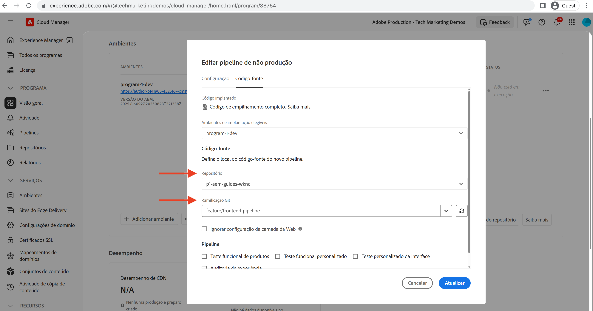
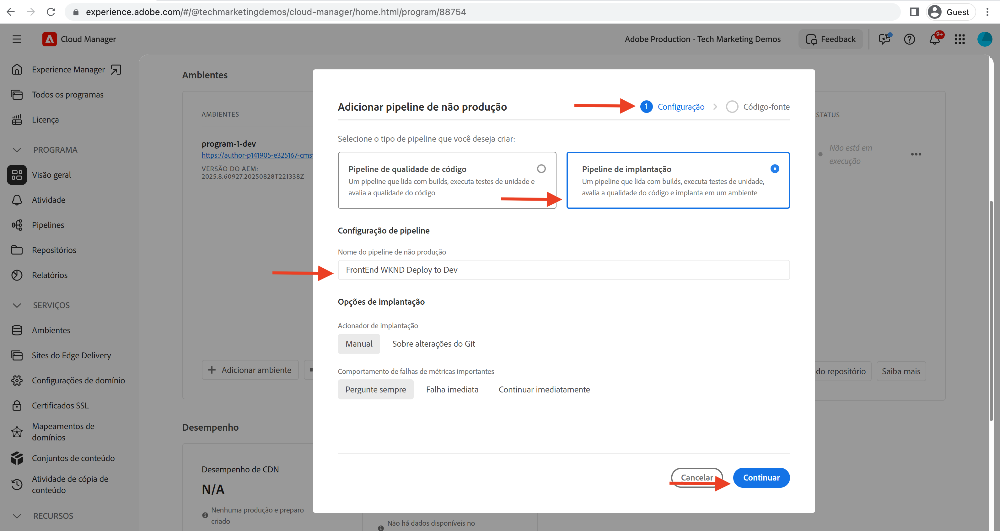
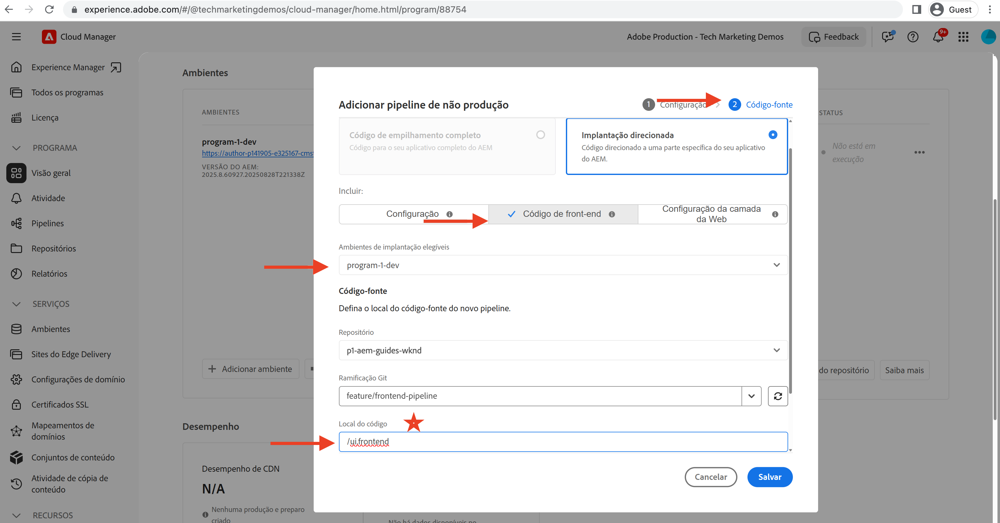
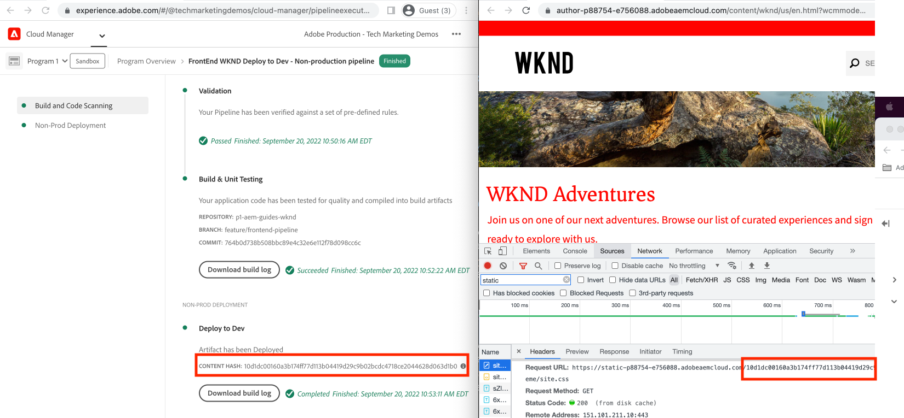

# Implantar usando o pipeline de front-end

Neste capítulo, criamos e executamos um pipeline front-end no Adobe Cloud Manager. Ele só cria os arquivos do `ui.frontend` e os implanta no CDN integrado AEM as a Cloud Service. Assim, afastando-se do  `/etc.clientlibs` entrega de recursos de front-end com base.

## Objetivos {#objectives}

* Crie e execute um pipeline de front-end.
* Verifique se os recursos de front-end NÃO são fornecidos de `/etc.clientlibs` mas de um novo nome de host que começa com `https://static-`

## Uso do pipeline de front-end

>[!VIDEO](https://video.tv.adobe.com/v/3409420?quality=12&learn=on)

## Pré-requisitos {#prerequisites}

Este é um tutorial de várias partes e presume-se que as etapas descritas na seção [Atualizar Projeto de AEM Padrão](./update-project.md) foram concluídas.

Certifique-se de que [privilégios para criar e implantar pipelines no Cloud Manager](https://experienceleague.adobe.com/docs/experience-manager-cloud-manager/content/requirements/users-and-roles.html?lang=en#role-definitions) e [acesso a um ambiente AEM as a Cloud Service](https://experienceleague.adobe.com/docs/experience-manager-cloud-service/content/implementing/using-cloud-manager/manage-environments.html).

## Renomear pipeline existente

Renomeie o pipeline existente de __Implantar no Dev__ para  __Implantação WKND FullStack para desenvolvimento__ ao acessar o __Configuração__ tab&#39;s __Nome do pipeline de não produção__ campo. Isso faz com que explique se um pipeline é de pilha completa ou front-end apenas observando seu nome.

Também na __Código fonte__ , verifique se os valores dos campos Repository e Git Branch estão corretos e se a ramificação tem seu contrato de pipeline front-end alterado.

## Criar um pipeline de front-end

Para __SOMENTE__ crie e implante os recursos de front-end a partir do `ui.frontend` execute as seguintes etapas:

1. Na interface do usuário do Cloud Manager, no __Pipelines__ seção , clique em __Adicionar__ e selecione __Adicionar pipeline de não-produção__ ou __Adicionar pipeline de produção__) com base no ambiente as a Cloud Service AEM para o qual você deseja implantar.

1. No __Adicionar pipeline de não-produção__ , como parte da __Configuração__ selecione as etapas __Pipeline de implantação__ , nomeie-a como __Implantação WKND do FrontEnd para Desenvolvimento__ e clique em __Continuar__

1. Como parte do __Código fonte__ selecione as etapas __Código de front-end__ e selecione o ambiente de __Ambientes de implantação qualificados__. No __Código fonte__ seção garanta que os valores dos campos Repository e Git Branch estejam corretos e que a ramificação tenha seu contrato de pipeline front-end alterado.
E __mais importante__ para __Localização do código__ campo o valor é `/ui.frontend` e, por fim, clique em __Salvar__.

## Sequência de implantação

* Primeiro execute o arquivo recém-renomeado __Implantação WKND FullStack para desenvolvimento__ pipeline para remover os arquivos clientlib WKND do repositório AEM. E o mais importante é preparar o AEM para o contrato de pipeline front-end adicionando __Configuração do Sling__ arquivos (`SiteConfig`, `HtmlPageItemsConfig`).

>[!WARNING]
>
>Depois, a variável __Implantação WKND FullStack para desenvolvimento__ conclusão do pipeline, você terá um __sem estilo__ Site WKND, que pode parecer quebrado. Planeje uma interrupção ou implantação durante horas ímpares, essa é uma interrupção única que você deve planejar durante o switch inicial, de usar um único pipeline de pilha completa para o pipeline front-end.

* Finalmente, execute o __Implantação WKND do FrontEnd para Desenvolvimento__ pipeline para criar somente `ui.frontend` e implante os recursos de front-end diretamente na CDN.

>[!IMPORTANT]
>
>Você percebe que a variável __sem estilo__ O site WKND volta ao normal e desta vez __FrontEnd__ a execução do pipeline era muito mais rápida que o pipeline de pilha completa.

## Verificar alterações de estilo e novo paradigma de delivery

* Abra o site WKND de qualquer página e você pode ver a cor do texto em nós __Adobe Vermelho__ e os arquivos de recursos de front-end (CSS, JS) são entregues a partir da CDN. O nome do host da solicitação de recurso começa com `https://static-pXX-eYY.p123-e456.adobeaemcloud.com/$HASH_VALUE$/theme/site.css` e também o site.js ou qualquer outro recurso estático referenciado na `HtmlPageItemsConfig` arquivo.

>[!TIP]
>
>O `$HASH_VALUE$` aqui está o mesmo que você vê no __Implantação WKND do FrontEnd para Desenvolvimento__  pipeline __HASH DE CONTEÚDO__ campo. AEM for notificado do URL CDN do recurso front-end, o valor será armazenado em `/conf/wknd/sling:configs/com.adobe.cq.wcm.core.components.config.HtmlPageItemsConfig/jcr:content` under __prefixPath__ propriedade.

## Parabéns! {#congratulations}

Parabéns, você criou, executou e verificou o pipeline do Front-End que apenas constrói e implanta o módulo &#39;ui.frontend&#39; do projeto WKND Sites. Agora, sua equipe de front-end pode iterar rapidamente no design do site e no comportamento de front-end, fora do ciclo de vida do projeto de AEM completo.

## Próximas etapas {#next-steps}

No próximo capítulo, [Considerações](considerations.md), você verificará o impacto no processo de desenvolvimento front-end e back-end.
