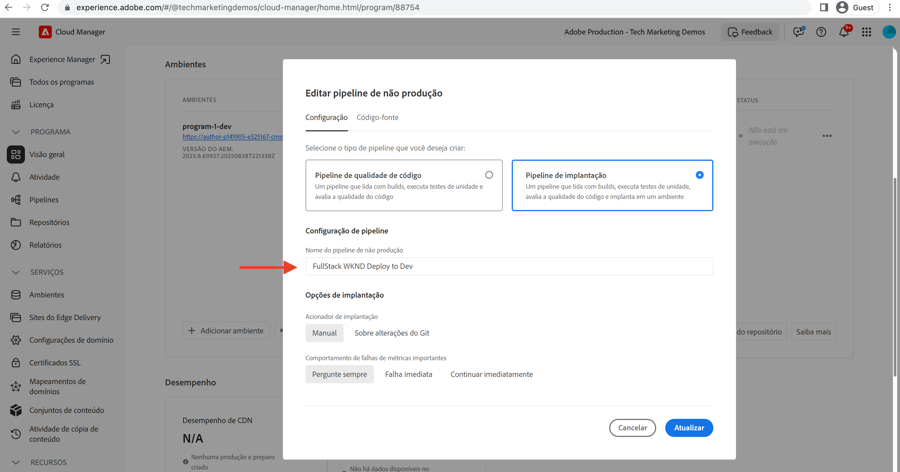

# Implantar com o pipeline de front-end

Neste capítulo, vamos criar e executar um pipeline de front-end no Adobe Cloud Manager. Ele só reúne os arquivos do módulo `ui.frontend` e os implanta na CDN integrada no AEM as a Cloud Service. Assim, ele se distancia da entrega de recursos de front-end baseada em `/etc.clientlibs`.

## Objetivos {#objectives}

* Crie e execute um pipeline de front-end.
* Certifique-se de que os recursos de front-end NÃO sejam entregues a partir de `/etc.clientlibs`, mas de um novo nome de host que comece com `https://static-`

## Usar o pipeline de front-end

>[!VIDEO](https://video.tv.adobe.com/v/3409420?quality=12&learn=on)

## Pré-requisitos {#prerequisites}

Este é um tutorial em várias partes, e presume-se que as etapas descritas em [Atualizar um projeto padrão do AEM](./update-project.md) tenham sido concluídas.

Verifique se você tem [privilégios para criar e implantar pipelines no Cloud Manager](https://experienceleague.adobe.com/docs/experience-manager-cloud-manager/content/requirements/users-and-roles.html?lang=pt-BR#role-definitions), bem como [acesso a um ambiente do AEM as a Cloud Service](https://experienceleague.adobe.com/docs/experience-manager-cloud-service/content/implementing/using-cloud-manager/manage-environments.html?lang=pt-BR).

## Renomear pipeline existente

Renomeie o pipeline existente de __Implantação para desenvolvimento__ para __Implantação de pilha completa da WKND para desenvolvimento__, acessando o campo __Nome do pipeline de não produção__ da guia __Configuração__. Isso serve para explicitar se um pipeline é de pilha completa ou de front-end com base em seu nome.

Além disso, na guia __Código-fonte__, verifique se os valores de campo do repositório e da ramificação do Git estão corretos, e se a ramificação reflete as suas alterações de contrato de pipeline de front-end.

## Criar um pipeline de front-end

Para __SOMENTE__ compilar e implantar os recursos de front-end do módulo `ui.frontend`, execute as seguintes etapas:

1. Na interface do usuário do Cloud Manager, na seção __Pipelines__, clique no botão __Adicionar__ e selecione __Adicionar pipeline de não produção__ (ou __Adicionar pipeline de produção__) com base no ambiente do AEM as a Cloud Service no qual você deseja implantar.

1. Na caixa de diálogo __Adicionar pipeline de não produção__, como parte das etapas __Configuração__, selecione a opção __Pipeline de implantação__, nomeie-a como __Implantação de front-end da WKND para desenvolvimento__ e clique em __Continuar__

1. Como parte das etapas do __Código-fonte__, selecione a opção __Código de front-end__ e escolha o ambiente em __Ambientes de implantação qualificados__. Na seção __Código-fonte__, verifique se os valores dos campos de repositório e ramificação do Git estão corretos, e se a ramificação reflete as suas alterações no contrato do pipeline de front-end.
E, __acima de tudo__, no campo __Localização do código__, o valor deve ser `/ui.frontend`; por fim, clique em __Salvar__.

## Sequência de implantação

* Primeiro, execute o pipeline __Implantação de pilha completa da WKND para desenvolvimento__ recém-renomeado para remover os arquivos de clientlibs da WKND do repositório do AEM. E, acima de tudo, prepare o AEM para o contrato de pipeline de front-end, adicionando __arquivos de configuração do Sling__ (`SiteConfig`, `HtmlPageItemsConfig`).

>[!WARNING]
>
>Após a conclusão do pipeline de __pilha completa da WKND para desenvolvimento__, você terá um site da WKND __não estilizado__ que pode parecer corrompido. Planeje uma interrupção ou implante durante horas ímpares. Essa é uma interrupção única que você precisa planejar durante a ativação inicial, desde usar um pipeline de pilha completa única até o pipeline de front-end.

* Finalmente, execute a __Implantação de front-end da WKND para desenvolvimento__ para compilar somente o módulo `ui.frontend` e implantar os recursos de front-end diretamente na CDN.

>[!IMPORTANT]
>
>Você notará que o site da WKND __estilizado__ voltou ao normal, e, desta vez, a execução do pipeline __de front-end__ foi muito mais rápida que a do pipeline de pilha completa.

## Verificar alterações de estilo e novo paradigma de entrega

* Abra qualquer página do site da WKND, e você verá a cor do texto em __vermelho da Adobe__, e os arquivos de recursos de front-end (CSS, JS) serão entregues pela CDN. O nome de host da solicitação de recurso começa com `https://static-pXX-eYY.p123-e456.adobeaemcloud.com/$HASH_VALUE$/theme/site.css` e também com o site.js ou qualquer outro recurso estático que você tenha referenciado no arquivo `HtmlPageItemsConfig`.

>[!TIP]
>
>O `$HASH_VALUE$` aqui é o mesmo que você vê no campo __CONTENT HASH__ da __Implantação do pipeline de front-end da WKND para desenvolvimento__. O AEM é notificado do URL da CDN do recurso de front-end; o valor é armazenado em `/conf/wknd/sling:configs/com.adobe.cq.wcm.core.components.config.HtmlPageItemsConfig/jcr:content`, na propriedade __prefixPath__.

## Parabéns! {#congratulations}

Parabéns, você criou, executou e verificou o pipeline de front-end, que só compila e implanta o módulo “ui.frontend” do projeto do site da WKND. Agora, a sua equipe de front-end pode iterar rapidamente o design do site e o comportamento do front-end, fora do ciclo de vida completo do projeto do AEM.

## Próximas etapas {#next-steps}

No próximo capítulo, [Considerações](considerations.md), você analisará o impacto no processo de desenvolvimento de front-end e back-end.
