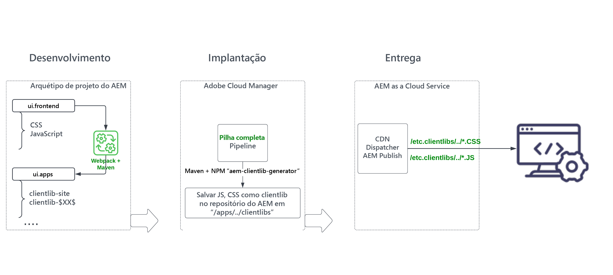

# Revisar o módulo &quot;ui.frontend&quot; do projeto AEM de pilha completa {#aem-full-stack-ui-frontent}

No, este capítulo analisamos o desenvolvimento, a implantação e o delivery de artefatos de front-end de um projeto AEM de pilha completa, concentrando-se no módulo &quot;ui.frontend&quot; do __Projeto do WKND Sites__.


## Objetivos {#objective}

* Entender o fluxo de compilação e implantação de artefatos de front-end em um projeto de pilha completa de AEM
* Revise o projeto de pilha completa de AEM `ui.frontend` do módulo [webpack](https://webpack.js.org/) configurações
* Processo de geração de biblioteca de cliente AEM (também conhecido como clientlibs)

## Fluxo de implantação de front-end para projetos de pilha completa de AEM e Criação rápida de sites

>[!IMPORTANT]
>
>Este vídeo explica e demonstra o fluxo de front-end para ambos **Empilhamento completo e criação rápida de site** Projetos para destacar a diferença sutil no modelo de build, implantação e entrega de recursos de front-end.

>[!VIDEO](https://video.tv.adobe.com/v/3409344?quality=12&learn=on)

## Pré-requisitos {#prerequisites}


* Clonar o [Projeto AEM WKND Sites](https://github.com/adobe/aem-guides-wknd)
* Criou e implantou o projeto clonado AEM WKND Sites para AEM as a Cloud Service.

Ver o projeto do site AEM WKND [README.md](https://github.com/adobe/aem-guides-wknd/blob/main/README.md) para obter mais detalhes.

## Fluxo de artefatos de front-end do projeto de pilha completa de AEM {#flow-of-frontend-artifacts}

Abaixo está uma representação de alto nível da __desenvolvimento, implantação e entrega__ fluxo dos artefatos de front-end em um projeto AEM de pilha completa.




Durante a fase de desenvolvimento, alterações de front-end, como estilo e rebranding, são realizadas atualizando os arquivos CSS, JS do `ui.frontend/src/main/webpack` pasta. Em seguida, durante o tempo de criação, a variável [webpack](https://webpack.js.org/) module-bundler e o maven plugin transformam esses arquivos em clientlibs AEM otimizadas em `ui.apps` módulo.

As alterações de front-end são implantadas no ambiente as a Cloud Service do AEM ao executar o [__Pilha completa__ pipeline no Cloud Manager](https://experienceleague.adobe.com/docs/experience-manager-cloud-service/content/implementing/using-cloud-manager/cicd-pipelines/introduction-ci-cd-pipelines.html).

Os recursos de front-end são fornecidos aos navegadores da Web por meio de caminhos URI que começam com `/etc.clientlibs/`, e normalmente são armazenados em cache no AEM Dispatcher e no CDN.


>[!NOTE]
>
> Do mesmo modo, no __Jornada de criação rápida de site no AEM__, o [alterações no front-end](https://experienceleague.adobe.com/docs/experience-manager-cloud-service/content/sites/administering/site-creation/quick-site/customize-theme.html) são implantados no ambiente do AEM as a Cloud Service executando o __Front-end__ pipeline, consulte [Configurar o seu pipeline](https://experienceleague.adobe.com/docs/experience-manager-cloud-service/content/sites/administering/site-creation/quick-site/pipeline-setup.html)

### Revisar configurações do webpack no projeto Sites WKND {#development-frontend-webpack-clientlib}

* Há três __webpack__ arquivos de configuração usados para agrupar os recursos de front-end de sites WKND.

   1. `webpack.common` - Contém o __comum__ configuração para instruir o agrupamento e a otimização de recursos WKND. A variável __saída__ A propriedade informa onde emitir os arquivos consolidados (também conhecidos como pacotes JavaScript, mas não para ser confundido com pacotes AEM OSGi) que ela cria. O nome padrão é definido como `clientlib-site/js/[name].bundle.js`.

  ```javascript
      ...
      output: {
              filename: 'clientlib-site/js/[name].bundle.js',
              path: path.resolve(__dirname, 'dist')
          }
      ...    
  ```

   1. `webpack.dev.js` contém o __desenvolvimento__ configuração do webpack-dev-serve e aponta para o modelo de HTML a ser usado. Também contém uma configuração de proxy para uma instância do AEM em execução em `localhost:4502`.

  ```javascript
      ...
      devServer: {
          proxy: [{
              context: ['/content', '/etc.clientlibs', '/libs'],
              target: 'http://localhost:4502',
          }],
      ...    
  ```

   1. `webpack.prod.js` contém o __produção__ e usa os plug-ins para transformar os arquivos de desenvolvimento em pacotes otimizados.

  ```javascript
      ...
      module.exports = merge(common, {
          mode: 'production',
          optimization: {
              minimize: true,
              minimizer: [
                  new TerserPlugin(),
                  new CssMinimizerPlugin({ ...})
          }
      ...    
  ```


* Os recursos agrupados são movidos para a `ui.apps` módulo usando [aem-clientlib-generator](https://www.npmjs.com/package/aem-clientlib-generator) plug-in, usando a configuração gerenciada no `clientlib.config.js` arquivo.

```javascript
    ...
    const BUILD_DIR = path.join(__dirname, 'dist');
    const CLIENTLIB_DIR = path.join(
    __dirname,
    '..',
    'ui.apps',
    'src',
    'main',
    'content',
    'jcr_root',
    'apps',
    'wknd',
    'clientlibs'
    );
    ...
```

* A variável __front-end-maven-plugin__ de `ui.frontend/pom.xml` O orquestra a criação de pacotes da web e a geração de clientlib durante a compilação do projeto AEM.

`$ mvn clean install -PautoInstallSinglePackage`

### Implantação no AEM as a Cloud Service {#deployment-frontend-aemaacs}

A variável [__Pilha completa__ pipeline](https://experienceleague.adobe.com/docs/experience-manager-cloud-service/content/implementing/using-cloud-manager/cicd-pipelines/introduction-ci-cd-pipelines.html?#full-stack-pipeline) implanta essas alterações em um ambiente as a Cloud Service do AEM.


### Entrega do AEM as a Cloud Service {#delivery-frontend-aemaacs}

Os recursos de front-end implantados por meio do pipeline de pilha completa são entregues do site do AEM para navegadores da Web como `/etc.clientlibs` arquivos. Você pode verificar isso visitando o [site WKND hospedado publicamente](https://wknd.site/content/wknd/us/en.html) e exibindo a origem da página da web.

```html
    ....
    <link rel="stylesheet" href="/etc.clientlibs/wknd/clientlibs/clientlib-site.lc-181cd4102f7f49aa30eea548a7715c31-lc.min.css" type="text/css">

    ...

    <script async src="/etc.clientlibs/wknd/clientlibs/clientlib-site.lc-d4e7c03fe5c6a405a23b3ca1cc3dcd3d-lc.min.js"></script>
    ....
```

## Parabéns. {#congratulations}

Parabéns, você revisou o módulo ui.frontend do projeto de pilha completa

## Próximas etapas {#next-steps}

No próximo capítulo, [Atualizar projeto para usar pipeline de front-end](update-project.md), você atualizará o Projeto de sites WKND do AEM para habilitá-lo para o contrato de pipeline de front-end.
