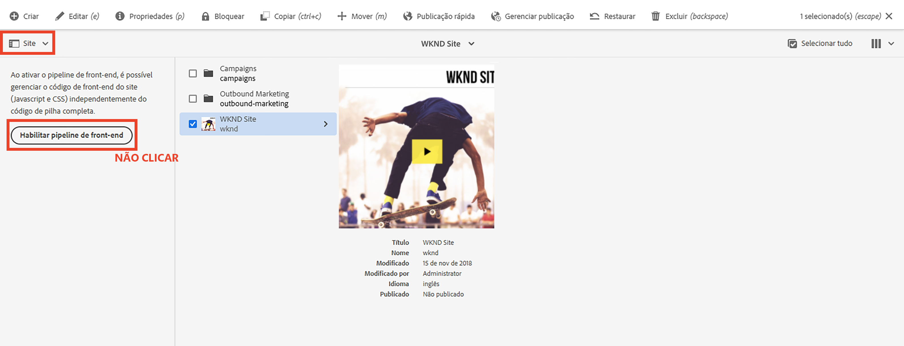

# Atualizar projeto de pilha completa do AEM para usar o pipeline de front-end {#update-project-enable-frontend-pipeline}

Neste capítulo, faremos alterações nas configurações do __projeto do site da WKND__ para usar o pipeline de front-end a fim de implantar o JavaScript e o CSS, em vez de exigir a execução do pipeline de pilha completa. Isso dissocia o ciclo de vida de desenvolvimento e a implantação dos artefatos de front-end e back-end, permitindo um processo de desenvolvimento mais rápido e iterativo em geral.

## Objetivos {#objectives}

* Atualizar projeto de pilha completa para usar o pipeline de front-end

## Visão geral das alterações nas configurações do projeto de pilha completa do AEM

>[!VIDEO](https://video.tv.adobe.com/v/3409419?quality=12&learn=on)

## Pré-requisitos {#prerequisites}

Este é um tutorial em várias partes, e presume-se que você tenha revisado o [módulo “ui.frontend”](./review-uifrontend-module.md).


## Alterações no projeto de pilha completa do AEM

Há três alterações de configuração relacionadas ao projeto e uma alteração de estilo a ser implantada para uma execução de teste, ou seja, um total de quatro alterações específicas no projeto da WKND para habilitá-lo para o contrato de pipeline de front-end.

1. Remover o módulo `ui.frontend` do ciclo de compilação de pilha completa

   * Na raiz `pom.xml` do projeto do site da WKND, comente a entrada do submódulo `<module>ui.frontend</module>`.

   ```xml
       ...
       <modules>
       <module>all</module>
       <module>core</module>
       <!--
       <module>ui.frontend</module>
       -->                
       <module>ui.apps</module>
       ...
   ```

   * E comente a dependência relacionada do `ui.apps/pom.xml`

   ```xml
       ...
       <!-- ====================================================================== -->
       <!-- D E P E N D E N C I E S                                                -->
       <!-- ====================================================================== -->
           ...
       <!--
           <dependency>
               <groupId>com.adobe.aem.guides</groupId>
               <artifactId>aem-guides-wknd.ui.frontend</artifactId>
               <version>${project.version}</version>
               <type>zip</type>
           </dependency>
       -->    
       ...
   ```

1. Prepare o módulo `ui.frontend` para o contrato de pipeline de front-end, adicionando dois novos arquivos de configuração do webpack.

   * Copie o `webpack.common.js` existente como `webpack.theme.common.js` e altere a propriedade `output` e os parâmetros de configuração de plug-in `MiniCssExtractPlugin`, `CopyWebpackPlugin` conforme abaixo:

   ```javascript
   ...
   output: {
           filename: 'theme/js/[name].js', 
           path: path.resolve(__dirname, 'dist')
       }
   ...
   
   ...
       new MiniCssExtractPlugin({
               filename: 'theme/[name].css'
           }),
       new CopyWebpackPlugin({
           patterns: [
               { from: path.resolve(__dirname, SOURCE_ROOT + '/resources'), to: './theme' }
           ]
       })
   ...
   ```

   * Copie o `webpack.prod.js` existente como `webpack.theme.prod.js` e altere o local da variável `common` para o arquivo acima como

   ```javascript
   ...
       const common = require('./webpack.theme.common.js');
   ...
   ```

   >[!NOTE]
   >
   >As duas alterações de configuração do “webpack” acima devem ter nomes diferentes dos arquivos de saída e pastas, para que possamos diferenciar facilmente entre artefatos de front-end do pipeline de clientlibs (pilha completa) e gerados pelo tema (front-end).
   >
   >Como você já deve ter adivinhado, as alterações acima podem ser ignoradas para usar também as configurações do webpack existentes, mas as alterações abaixo são necessárias.
   >
   >Cabe a você decidir como nomeá-los ou organizá-los.


   * No arquivo `package.json`, verifique se o valor da propriedade `name` é igual ao nome do site do nó `/conf`. E, na propriedade `scripts`, um script `build` instruindo como criar os arquivos de front-end a partir deste módulo.

   ```javascript
       {
       "name": "wknd",
       "version": "1.0.0",
       ...
   
       "scripts": {
           "build": "webpack --config ./webpack.theme.prod.js"
       }
   
       ...
       }
   ```

1. Prepare o módulo `ui.content` para o pipeline de front-end, adicionando duas configurações do Sling.

   * Criar um arquivo em `com.adobe.cq.wcm.core.components.config.HtmlPageItemsConfig`: inclui todos os arquivos de front-end que o módulo `ui.frontend` gera na pasta `dist`, usando o processo de compilação do webpack.

   ```xml
   ...
       <css
       jcr:primaryType="nt:unstructured"
       element="link"
       location="header">
       <attributes
           jcr:primaryType="nt:unstructured">
           <as
               jcr:primaryType="nt:unstructured"
               name="as"
               value="style"/>
           <href
               jcr:primaryType="nt:unstructured"
               name="href"
               value="/theme/site.css"/>
   ...
   ```

   >[!TIP]
   >
   >    Consulte a [HtmlPageItemsConfig](https://github.com/adobe/aem-guides-wknd/blob/feature/frontend-pipeline/ui.content/src/main/content/jcr_root/conf/wknd/_sling_configs/com.adobe.cq.wcm.core.components.config.HtmlPageItemsConfig/.content.xml) completa no __projeto do site da WKND no AEM__.


   * Siga o `com.adobe.aem.wcm.site.manager.config.SiteConfig` com o valor `themePackageName` igual ao valor das propriedades `package.json` e `name`, e com `siteTemplatePath` apontando para um valor de caminho de canhoto `/libs/wcm/core/site-templates/aem-site-template-stub-2.0.0`.

   ```xml
   ...
       <?xml version="1.0" encoding="UTF-8"?>
       <jcr:root xmlns:sling="http://sling.apache.org/jcr/sling/1.0" xmlns:jcr="http://www.jcp.org/jcr/1.0" xmlns:nt="http://www.jcp.org/jcr/nt/1.0"
               jcr:primaryType="nt:unstructured"
               siteTemplatePath="/libs/wcm/core/site-templates/aem-site-template-stub-2.0.0"
               themePackageName="wknd">
       </jcr:root>
   ...
   ```

   >[!TIP]
   >
   >    Consulte a [SiteConfig](https://github.com/adobe/aem-guides-wknd/blob/feature/frontend-pipeline/ui.content/src/main/content/jcr_root/conf/wknd/_sling_configs/com.adobe.aem.wcm.site.manager.config.SiteConfig/.content.xml) completa no __projeto do site da WKND no AEM__.

1. Se um tema ou estilos forem alterados para implantação por meio do pipeline de front-end para uma execução de teste, estaremos alterando `text-color` para vermelho da Adobe (ou você pode escolher outra) ao atualizar o `ui.frontend/src/main/webpack/base/sass/_variables.scss`.

   ```css
       $black:     #a40606;
       ...
   ```

Por fim, envie essas alterações ao repositório do Git da Adobe do seu programa.


>[!AVAILABILITY]
>
> Essas alterações estão disponíveis no GitHub, na ramificação [__pipeline de front-end__](https://github.com/adobe/aem-guides-wknd/tree/feature/frontend-pipeline) do __projeto do site da WKND no AEM__.


## Cuidado: botão de _Habilitar pipeline de front-end_

A opção [Site](https://experienceleague.adobe.com/docs/experience-manager-cloud-service/content/sites/authoring/getting-started/basic-handling.html) do [Seletor do painel](https://experienceleague.adobe.com/docs/experience-manager-cloud-service/content/sites/authoring/getting-started/basic-handling.html) mostra o botão **Habilitar pipeline de front-end** ao selecionar a raiz ou a página do site. Clicar no botão **Habilitar pipeline de front-end** substituirá as **configurações do Sling** acima. Certifique-se de **não clicar** nesse botão depois de implantar as alterações acima por meio da execução do pipeline do Cloud Manager.



Se você clicar nele por engano, será necessário executar novamente os pipelines para garantir que o contrato e as alterações no pipeline de front-end sejam restaurados.

## Parabéns! {#congratulations}

Parabéns, você atualizou o projeto do site da WKND para habilitá-lo para o contrato de pipeline de front-end.

## Próximas etapas {#next-steps}

No próximo capítulo, [Implantar com o pipeline de front-end](create-frontend-pipeline.md), você criará e executará um pipeline de front-end, e verá como nós __nos distanciamos__ da entrega de recursos de front-end baseada em “/etc.clientlibs”.
