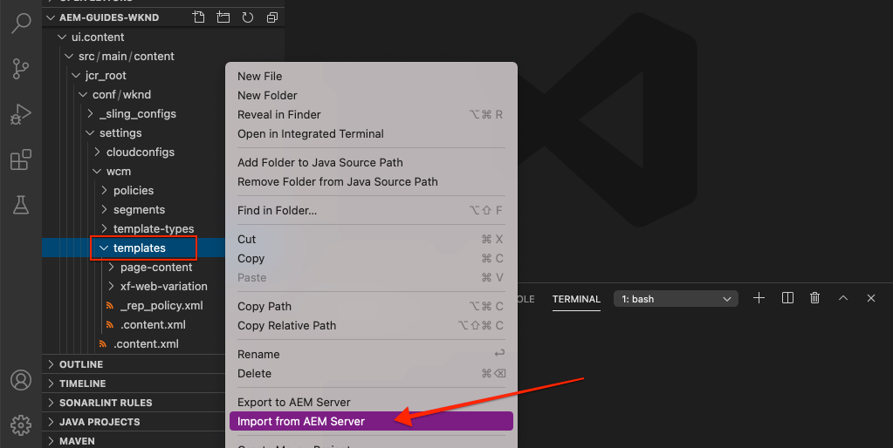
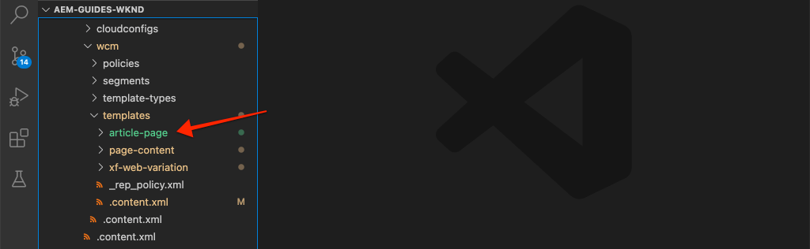

# Páginas e modelos {#pages-and-template}

Neste capítulo, exploraremos a relação entre um componente de página base e modelos editáveis. Criaremos um modelo de artigo sem estilo com base em alguns modelos do [AdobeXD](https://www.adobe.com/products/xd.html). No processo de criação do modelo, os Componentes principais e as configurações avançadas de política dos Modelos editáveis são abordados.

## Pré-requisitos {#prerequisites}

Revise as ferramentas e instruções necessárias para configurar um [ambiente de desenvolvimento local](overview.md#local-dev-environment).

### Projeto inicial

>[!NOTE]
>
> Se você tiver concluído com êxito o capítulo anterior, poderá reutilizar o projeto e ignorar as etapas para fazer check-out do projeto inicial.

Confira o código básico no qual o tutorial se baseia:

1. Verifique a ramificação `tutorial/pages-templates-start` de [GitHub](https://github.com/adobe/aem-guides-wknd)

   ```shell
   $ cd ~/code/aem-guides-wknd
   $ git checkout tutorial/pages-templates-start
   ```

1. Implante a base de código para uma instância AEM local usando suas habilidades Maven:

   ```shell
   $ mvn clean install -PautoInstallSinglePackage
   ```

   >[!NOTE]
   >
   > Se estiver usando AEM 6.5 ou 6.4, anexe o perfil `classic` a qualquer comando Maven.

   ```shell
   $ mvn clean install -PautoInstallSinglePackage -Pclassic
   ```

Você sempre pode visualização o código finalizado em [GitHub](https://github.com/adobe/aem-guides-wknd/tree/pages-templates/solution) ou fazer check-out do código localmente ao alternar para a ramificação `tutorial/pages-templates-solution`.

## Objetivo

1. Inspect um design de página criado no Adobe XD e mapeie-o para Componentes principais.
1. Entenda os detalhes de Modelos editáveis e como as políticas podem ser usadas para impor o controle granular do conteúdo da página.
1. Saiba como Modelos e páginas são vinculados

## O que você vai criar {#what-you-will-build}

Nesta parte do tutorial, você criará um novo Modelo de página de artigo que pode ser usado para criar novas páginas de artigo e se alinha a uma estrutura comum. O Modelo de página de artigo será baseado em designs e em um Kit de interface de usuário produzido no AdobeXD. Este capítulo está focado apenas na construção da estrutura ou esqueleto do modelo. Nenhum estilo será implementado, mas o modelo e as páginas estarão funcionais.


## Planejamento da interface com o Adobe XD {#adobexd}

Na maioria dos casos, o planejamento de novos start de site com modelos e designs estáticos. [Adobe ](https://www.adobe.com/products/xd.html) XD é uma ferramenta de design que constrói experiências do usuário. Em seguida, inspecionaremos um kit de interface do usuário e modelos para ajudar a planejar a estrutura do modelo de página do artigo.

>[!VIDEO](https://video.tv.adobe.com/v/30214/?quality=12&learn=on)

**Baixe o arquivo [ de design de artigo ](https://github.com/adobe/aem-guides-wknd/releases/download/aem-guides-wknd-0.0.2/AEM_UI-kit-WKND-article-design.xd)** WKND.

## Criar o modelo de página de artigo

Ao criar uma página, você deve selecionar um modelo, que será usado como a base de criação da nova página. O modelo define a estrutura da página resultante, o conteúdo inicial e os componentes permitidos.

Há três áreas principais de [Modelos editáveis](https://experienceleague.adobe.com/docs/experience-manager-65/developing/platform/templates/page-templates-editable.html):

1. **Estrutura**  - define os componentes que fazem parte do modelo. Eles não serão editáveis pelos autores de conteúdo.
1. **Conteúdo**  inicial - define os componentes com os quais o modelo será start, que podem ser editados e/ou excluídos pelos autores do conteúdo
1. **Políticas**  - define configurações sobre como os componentes se comportarão e quais opções os autores terão disponíveis.

Em seguida, crie um novo modelo em AEM que corresponda à estrutura dos modelos. Isso ocorrerá em uma instância local do AEM. Siga as etapas no vídeo abaixo:

>[!VIDEO](https://video.tv.adobe.com/v/330991/?quality=12&learn=on)

## Atualize o cabeçalho e o rodapé com fragmentos de experiência {#experience-fragments}

Uma prática comum ao criar conteúdo global, como um cabeçalho ou rodapé, é usar um [Fragmento de experiência](https://docs.adobe.com/content/help/en/experience-manager-learn/sites/experience-fragments/experience-fragments-feature-video-use.html). Fragmentos de experiência, permite que os usuários combinem vários componentes para criar um único componente com capacidade de referência. Os Fragmentos de experiência têm a vantagem de suportar o gerenciamento de vários sites e [localização](https://experienceleague.adobe.com/docs/experience-manager-core-components/using/components/experience-fragment.html?lang=en#localized-site-structure).

O AEM Project Archetype gerou um Cabeçalho e rodapé. Em seguida, atualize os Fragmentos de experiência para corresponder aos modelos. Siga as etapas no vídeo abaixo:

>[!VIDEO](https://video.tv.adobe.com/v/330992/?quality=12&learn=on)

Baixe e instale o pacote de conteúdo de amostra **[WKND-PagesTemplates-Content-Assets.zip](assets/pages-templates/WKND-PagesTemplates-Content-Assets.zip)**.

## Criar uma página de artigo

Em seguida, crie uma nova página usando o modelo Página do artigo. Crie o conteúdo da página para corresponder aos modelos do site. Siga as etapas no vídeo abaixo:

>[!VIDEO](https://video.tv.adobe.com/v/330993/?quality=12&learn=on)

## Inspect a estrutura de nó {#node-structure}

Nesse ponto, a página do artigo está claramente sem estilo. No entanto, a estrutura básica está em vigor. Em seguida, inspecione a estrutura de nós da página do artigo para obter uma melhor compreensão da função do modelo, da página e dos componentes.

Use a ferramenta CRXDE-Lite em uma instância AEM local para visualização da estrutura do nó subjacente.

1. Abra [CRXDE-Lite](http://localhost:4502/crx/de/index.jsp#/content/wknd/us/en/magazine/guide-la-skateparks/jcr%3Acontent) e use a navegação em árvore para navegar até `/content/wknd/us/en/magazine/guide-la-skateparks`.

1. Clique no nó `jcr:content` abaixo da página `la-skateparks` e visualização as propriedades:

   

   Observe o valor de `cq:template`, que aponta para `/conf/wknd/settings/wcm/templates/article-page`, o Modelo de página de artigo que criamos anteriormente.

   Observe também o valor de `sling:resourceType`, que aponta para `wknd/components/page`. Esse é o componente de página criado pelo arquétipo de projeto AEM e é responsável pela renderização da página com base no modelo.

1. Expanda o nó `jcr:content` abaixo de `/content/wknd/us/en/magazine/guide-la-skateparks/jcr:content` e visualização a hierarquia do nó:

   

   Você deve ser capaz de mapear livremente cada um dos nós para os componentes que foram criados. Verifique se você pode identificar os diferentes Container de layout usados inspecionando os nós com prefixo `container`.

1. Em seguida, inspecione o componente de página em `/apps/wknd/components/page`. Visualização as propriedades do componente no CRXDE Lite:

   

   Observe que há apenas 2 scripts HTL, `customfooterlibs.html` e `customheaderlibs.html` abaixo do componente de página. *Então, como esse componente renderiza a página?*

   A propriedade `sling:resourceSuperType` aponta para `core/wcm/components/page/v2/page`. Essa propriedade permite que o componente de página do WKND herde **all** da funcionalidade do componente de página Componente Principal. Este é o primeiro exemplo de algo chamado [Padrão do componente proxy](https://docs.adobe.com/content/help/en/experience-manager-core-components/using/developing/guidelines.html#ProxyComponentPattern). Mais informações podem ser encontradas [aqui.](https://docs.adobe.com/content/help/en/experience-manager-core-components/using/developing/guidelines.html).

1. Inspect outro componente dentro dos componentes WKND, o componente `Breadcrumb` localizado em: `/apps/wknd/components/breadcrumb`. Observe que a mesma propriedade `sling:resourceSuperType` pode ser encontrada, mas desta vez ela aponta para `core/wcm/components/breadcrumb/v2/breadcrumb`. Este é outro exemplo de uso do padrão do componente Proxy para incluir um Componente principal. Na verdade, todos os componentes na base de código WKND são proxies de AEM componentes principais (exceto o nosso famoso componente HelloWorld). É uma prática recomendada tentar reutilizar o máximo possível da funcionalidade dos Componentes principais *antes de* gravar o código personalizado.

1. Em seguida, inspecione a página do componente principal em `/libs/core/wcm/components/page/v2/page` usando o CRXDE Lite:

   >[!NOTE]
   >
   > No AEM 6.5/6.4, os Componentes principais estão localizados em `/apps/core/wcm/components`. No AEM como um Cloud Service, os Componentes principais estão localizados em `/libs` e são atualizados automaticamente.

   

   Observe que muitos outros scripts estão incluídos abaixo desta página. A Página principal do componente contém muita funcionalidade. Essa funcionalidade é dividida em vários scripts para facilitar a manutenção e a leitura. Você pode rastrear a inclusão dos scripts HTL abrindo `page.html` e procurando `data-sly-include`:

   ```html
   <!--/* /libs/core/wcm/components/page/v2/page/page.html */-->
   <!DOCTYPE HTML>
   <html data-sly-use.page="com.adobe.cq.wcm.core.components.models.Page" lang="${page.language}"
       data-sly-use.head="head.html"
       data-sly-use.footer="footer.html"
       data-sly-use.redirect="redirect.html">
       <head data-sly-call="${head.head @ page = page}"></head>
       <body class="${page.cssClassNames}"
           id="${page.id}"
           data-cmp-data-layer-enabled="${page.data ? true : false}">
           <script data-sly-test.dataLayerEnabled="${page.data}">
           window.adobeDataLayer = window.adobeDataLayer || [];
           adobeDataLayer.push({
               page: JSON.parse("${page.data.json @ context='scriptString'}"),
               event:'cmp:show',
               eventInfo: {
                   path: 'page.${page.id @ context="scriptString"}'
               }
           });
           </script>
           <sly data-sly-test.isRedirectPage="${page.redirectTarget && (wcmmode.edit || wcmmode.preview)}"
               data-sly-call="${redirect.redirect @ redirectTarget = page.redirectTarget}"></sly>
           <sly data-sly-test="${!isRedirectPage}">
               <sly data-sly-include="body.skiptomaincontent.html"></sly>
               <sly data-sly-include="body.socialmedia_begin.html"></sly>
               <sly data-sly-include="body.html"></sly>
               <sly data-sly-call="${footer.footer @ page = page}"></sly>
               <sly data-sly-include="body.socialmedia_end.html"></sly>
           </sly>
       </body>
   </html>
   ```

   A outra razão para dividir o HTL em vários scripts é permitir que os componentes proxy substituam scripts individuais para implementar a lógica comercial personalizada. Os scripts HTL, `customfooterlibs.html` e `customheaderlibs.html`, são criados para a finalidade explícita a ser substituída pela implementação de projetos.

   Você pode saber mais sobre como o Modelo editável influencia a renderização da página de conteúdo [lendo este artigo](https://experienceleague.adobe.com/docs/experience-manager-65/developing/platform/templates/page-templates-editable.html).

1. Inspect o outro componente principal, como a navegação estrutural em `/libs/core/wcm/components/breadcrumb/v2/breadcrumb`. Visualização o script `breadcrumb.html` para entender como a marcação do componente de navegação estrutural é gerada.

## Salvando configurações no controle de origem {#configuration-persistence}

Em muitos casos, especialmente no início de um projeto AEM é importante persistir em configurações, como modelos e políticas de conteúdo relacionadas, para o controle de origem. Isso garante que todos os desenvolvedores estejam trabalhando em relação ao mesmo conjunto de conteúdo e configurações e pode garantir uma consistência adicional entre os ambientes. Quando um projeto atinge um certo nível de maturidade, a prática de gerenciar modelos pode ser transferida para um grupo especial de usuários avançados.

Por enquanto, trataremos os modelos como outros códigos e sincronizaremos o **Modelo de página do artigo** para baixo como parte do projeto. Até agora, temos o código **enviado** do nosso projeto AEM para uma instância local do AEM. O **Modelo de página de artigo** foi criado diretamente em uma instância local do AEM, portanto precisamos **importar** o modelo para nosso projeto AEM. O módulo **ui.content** está incluído no projeto AEM para essa finalidade específica.

As próximas etapas serão executadas usando o IDE VSCode usando o plug-in [VSCode AEM Sync](https://marketplace.visualstudio.com/items?itemName=yamato-ltd.vscode-aem-sync&amp;ssr=false#overview), mas podem ser feitas usando qualquer IDE configurado para **importar** ou importar conteúdo de uma instância local do AEM.

1. No VSCode, abra o projeto `aem-guides-wknd`.

1. Expanda o módulo **ui.content** no Explorador de projetos. Expanda a pasta `src` e navegue até `/conf/wknd/settings/wcm/templates`.

1. [!UICONTROL Clique com o botão direito do mouse ] na  `templates` pasta e selecione  **Importar do servidor** AEM:

   

   Os modelos `article-page` devem ser importados e `page-content`, `xf-web-variation` também devem ser atualizados.

   

1. Repita as etapas para importar conteúdo, mas selecione a pasta **policies** localizada em `/conf/wknd/settings/wcm/policies`.

   

1. Inspect o arquivo `filter.xml` localizado em `ui.content/src/main/content/META-INF/vault/filter.xml`.

   ```xml
   <!--ui.content filter.xml-->
   <?xml version="1.0" encoding="UTF-8"?>
   <workspaceFilter version="1.0">
       <filter root="/conf/wknd" mode="merge"/>
       <filter root="/content/wknd" mode="merge"/>
       <filter root="/content/dam/wknd" mode="merge"/>
       <filter root="/content/experience-fragments/wknd" mode="merge"/>
   </workspaceFilter>
   ```

   O arquivo `filter.xml` é responsável por identificar os caminhos dos nós que serão instalados com o pacote. Observe `mode="merge"` em cada um dos filtros que indica que o conteúdo existente não será modificado, somente o novo conteúdo será adicionado. Como os autores de conteúdo podem estar atualizando esses caminhos, é importante que uma implantação de código **e não** substitua o conteúdo. Consulte a [documentação do FileVault](https://jackrabbit.apache.org/filevault/filter.html) para obter mais detalhes sobre como trabalhar com elementos de filtro.

   Compare `ui.content/src/main/content/META-INF/vault/filter.xml` e `ui.apps/src/main/content/META-INF/vault/filter.xml` para entender os diferentes nós gerenciados por cada módulo.

   >[!WARNING]
   >
   > Para garantir implantações consistentes para o site de referência WKND, alguns ramos do projeto são configurados de modo que `ui.content` substituam quaisquer alterações no JCR. Isso é feito por design, isto é, para Ramificações de soluções, já que o código/estilos serão escritos para políticas específicas.

## Parabéns! {#congratulations}

Parabéns, você acabou de criar um novo modelo e página com a Adobe Experience Manager Sites.

### Próximas etapas {#next-steps}

Nesse ponto, a página do artigo está claramente sem estilo. Siga o tutorial [Bibliotecas do lado do cliente e Fluxo de trabalho do front-end](client-side-libraries.md) para aprender as práticas recomendadas para incluir CSS e Javascript para aplicar estilos globais ao site e integrar uma compilação de front-end dedicada.

Visualização o código finalizado em [GitHub](https://github.com/adobe/aem-guides-wknd) ou revise e implante o código localmente no bloco Git `tutorial/pages-templates-solution`.

1. Clique no repositório [github.com/adobe/aem-wknd-guides](https://github.com/adobe/aem-guides-wknd).
1. Confira a ramificação `tutorial/pages-templates-solution`.
