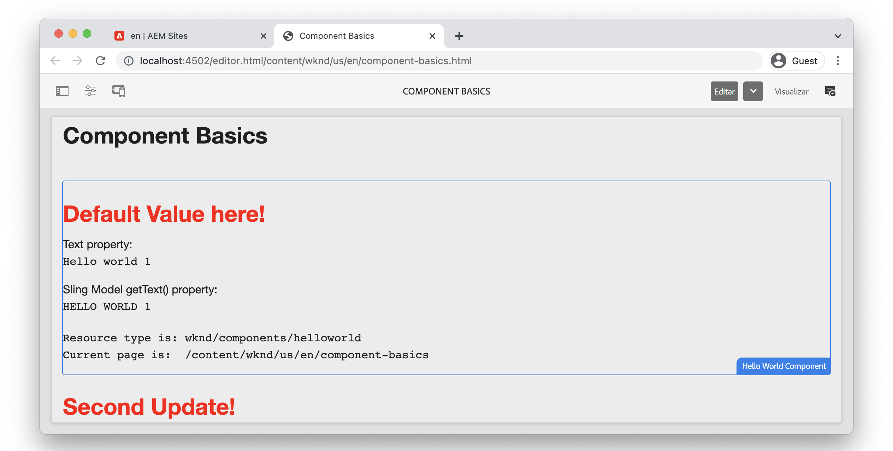

# Noções básicas sobre componentes {#component-basics}

Neste capítulo, vamos explorar a tecnologia subjacente de um componente do Sites do Adobe Experience Manager (AEM) por meio de um `HelloWorld` exemplo. Pequenas modificações são feitas em um componente existente, que abrange tópicos de criação, HTL, Modelos Sling e bibliotecas do lado do cliente.

## Pré-requisitos {#prerequisites}

Analisar as ferramentas e instruções necessárias para a configuração de um [ambiente de desenvolvimento local](./overview.md#local-dev-environment).

O IDE usado nos vídeos é [Código do Visual Studio](https://code.visualstudio.com/) e a variável [Sincronização VSCode com AEM](https://marketplace.visualstudio.com/items?itemName=yamato-ltd.vscode-aem-sync) plug-in.

## Objetivo {#objective}

1. Saiba mais sobre a função de modelos HTL e Modelos Sling para renderizar dinamicamente o HTML.
1. Entenda como as Caixas de diálogo são usadas para facilitar a criação de conteúdo.
1. Aprenda os conceitos básicos das bibliotecas do lado do cliente para incluir CSS e JavaScript para suportar um componente.

## O que você vai criar {#what-build}

Neste capítulo, você executa várias modificações em um `HelloWorld` componente. Ao fazer atualizações no `HelloWorld` componente, você aprenderá sobre as principais áreas do desenvolvimento de componentes do AEM.

## Projeto de início de capítulo {#starter-project}

Este capítulo se baseia em um projeto genérico gerado pelo [Arquétipo de projeto AEM](https://github.com/adobe/aem-project-archetype). Assista ao vídeo abaixo e revise o [pré-requisitos](#prerequisites) para começar!

>[!NOTE]
>
> Se você concluiu com êxito o capítulo anterior, é possível reutilizar o projeto e ignorar as etapas para verificar o projeto inicial.

>[!VIDEO](https://video.tv.adobe.com/v/330985?quality=12&learn=on)

Abra um novo terminal de linha de comando e execute as ações a seguir.

1. Em um diretório vazio, clone o [aem-guides-wknd](https://github.com/adobe/aem-guides-wknd) repositório:

   ```shell
   $ git clone git@github.com:adobe/aem-guides-wknd.git --branch tutorial/component-basics-start --single-branch
   ```

   >[!NOTE]
   >
   > Como opção, você pode continuar usando o projeto gerado no capítulo anterior, [Configuração do projeto](./project-setup.md).

1. Navegue até o  `aem-guides-wknd` pasta.

   ```shell
   $ cd aem-guides-wknd
   ```

1. Crie e implante o projeto em uma instância local do AEM com o seguinte comando:

   ```shell
   $ mvn clean install -PautoInstallSinglePackage
   ```

   >[!NOTE]
   >
   > Se estiver usando o AEM 6.5 ou 6.4, anexe o `classic` para qualquer comando Maven.

   ```shell
   $ mvn clean install -PautoInstallSinglePackage -Pclassic
   ```

1. Importe o projeto para o IDE de sua preferência seguindo as instruções para configurar um [ambiente de desenvolvimento local](overview.md#local-dev-environment).

## Criação de componentes {#component-authoring}

Os componentes podem ser considerados pequenos blocos de construção modulares de uma página da Web. Para reutilizar componentes, eles devem ser configuráveis. Isso é realizado por meio da caixa de diálogo do autor. Em seguida, vamos criar um componente simples e inspecionar como os valores da caixa de diálogo são mantidos no AEM.

>[!VIDEO](https://video.tv.adobe.com/v/330986?quality=12&learn=on)

Abaixo estão as etapas de alto nível executadas no vídeo acima.

1. Crie uma página chamada **Noções básicas sobre componentes** debaixo **Site da WKND** `>` **EUA** `>` **en**.
1. Adicione o **Componente do Hello World** para a página recém-criada.
1. Abra a caixa de diálogo do componente e insira algum texto. Salve as alterações para ver a mensagem exibida na página.
1. Alterne para o modo de desenvolvedor, visualize o Caminho de conteúdo no CRXDE-Lite e inspecione as propriedades da instância do componente.
1. Use o CRXDE-Lite para exibir a `cq:dialog` e `helloworld.html` script de `/apps/wknd/components/content/helloworld`.

## HTL (Linguagem de modelo HTML) e caixas de diálogo {#htl-dialogs}

Idioma do modelo do HTML ou **[HTL](https://experienceleague.adobe.com/docs/experience-manager-htl/content/getting-started.html)** é uma linguagem de modelo leve do lado do servidor usada por componentes do AEM para renderizar conteúdo.

**Caixas de diálogo** defina as configurações disponíveis que podem ser feitas para um componente.

Em seguida, atualizaremos o `HelloWorld` Script HTL para exibir uma saudação extra antes da mensagem de texto.

>[!VIDEO](https://video.tv.adobe.com/v/330987?quality=12&learn=on)

Abaixo estão as etapas de alto nível executadas no vídeo acima.

1. Alterne para o IDE e abra o projeto para o `ui.apps` módulo.
1. Abra o `helloworld.html` e atualize a Marcação HTML.
1. Use as ferramentas do IDE como [Sincronização VSCode com AEM](https://marketplace.visualstudio.com/items?itemName=yamato-ltd.vscode-aem-sync) para sincronizar a alteração de arquivo com a instância local do AEM.
1. Retorne ao navegador e observe que a renderização do componente foi alterada.
1. Abra o `.content.xml` arquivo que define a caixa de diálogo do `HelloWorld` componente em:

   ```plain
   <code>/aem-guides-wknd/ui.apps/src/main/content/jcr_root/apps/wknd/components/helloworld/_cq_dialog/.content.xml
   ```

1. Atualize a caixa de diálogo para adicionar um campo de texto extra chamado **Título** com o nome de `./title`:

   ```xml
   <?xml version="1.0" encoding="UTF-8"?>
   <jcr:root xmlns:sling="http://sling.apache.org/jcr/sling/1.0" xmlns:cq="http://www.day.com/jcr/cq/1.0" xmlns:jcr="http://www.jcp.org/jcr/1.0" xmlns:nt="http://www.jcp.org/jcr/nt/1.0"
       jcr:primaryType="nt:unstructured"
       jcr:title="Properties"
       sling:resourceType="cq/gui/components/authoring/dialog">
       <content
           jcr:primaryType="nt:unstructured"
           sling:resourceType="granite/ui/components/coral/foundation/fixedcolumns">
           <items jcr:primaryType="nt:unstructured">
               <column
                   jcr:primaryType="nt:unstructured"
                   sling:resourceType="granite/ui/components/coral/foundation/container">
                   <items jcr:primaryType="nt:unstructured">
                       <title
                           jcr:primaryType="nt:unstructured"
                           sling:resourceType="granite/ui/components/coral/foundation/form/textfield"
                           fieldLabel="Title"
                           name="./title"/>
                       <text
                           jcr:primaryType="nt:unstructured"
                           sling:resourceType="granite/ui/components/coral/foundation/form/textfield"
                           fieldLabel="Text"
                           name="./text"/>
                   </items>
               </column>
           </items>
       </content>
   </jcr:root>
   ```

1. Reabrir o arquivo `helloworld.html`, que representa o script HTL principal responsável pela renderização do `HelloWorld` componente do caminho abaixo:

   ```plain
       <code>/aem-guides-wknd.ui.apps/src/main/content/jcr_root/apps/wknd/components/helloworld/helloworld.html
   ```

1. Atualizar `helloworld.html` para renderizar o valor de **Saudação** textfield como parte de um `H1` tag:

   ```html
   <div class="cmp-helloworld" data-cmp-is="helloworld">
       <h1 class="cmp-helloworld__title">${properties.title}</h1>
       ...
   </div>
   ```

1. Implante as alterações em uma instância local do AEM usando o plug-in do desenvolvedor ou usando suas habilidades do Maven.

## Modelos sling {#sling-models}

Os Modelos do Sling são objetos POJO (Plain Old Java™ Objects) do Java™ orientados por anotações que facilitam o mapeamento de dados do JCR para as variáveis do Java™. Eles também fornecem várias outras sutilezas ao se desenvolver no contexto do AEM.

Em seguida, vamos fazer algumas atualizações no `HelloWorldModel` Sling Model para aplicar alguma lógica de negócios aos valores armazenados no JCR antes de enviá-los para a página.

>[!VIDEO](https://video.tv.adobe.com/v/330988?quality=12&learn=on)

1. Abra o arquivo `HelloWorldModel.java`, que é o Modelo do Sling usado com o `HelloWorld` componente.

   ```plain
   <code>/aem-guides-wknd.core/src/main/java/com/adobe/aem/guides/wknd/core/models/HelloWorldModel.java
   ```

1. Adicione as seguintes instruções de importação:

   ```java
   import org.apache.commons.lang3.StringUtils;
   import org.apache.sling.models.annotations.DefaultInjectionStrategy;
   ```

1. Atualize o `@Model` anotação para usar um `DefaultInjectionStrategy`:

   ```java
   @Model(adaptables = Resource.class,
      defaultInjectionStrategy = DefaultInjectionStrategy.OPTIONAL)
      public class HelloWorldModel {
      ...
   ```

1. Adicione as seguintes linhas à `HelloWorldModel` classe para mapear os valores das propriedades JCR do componente `title` e `text` para variáveis Java™:

   ```java
   ...
   @Model(adaptables = Resource.class,
   defaultInjectionStrategy = DefaultInjectionStrategy.OPTIONAL)
   public class HelloWorldModel {
   
       ...
   
       @ValueMapValue
       private String title;
   
       @ValueMapValue
       private String text;
   
       @PostConstruct
       protected void init() {
           ...
   ```

1. Adicione o seguinte método `getTitle()` para o `HelloWorldModel` classe, que retorna o valor da propriedade chamada `title`. Este método adiciona a lógica adicional para retornar um valor de string de &quot;Valor padrão aqui!&quot; se a propriedade `title` é nulo ou está em branco:

   ```java
   /***
   *
   * @return the value of title, if null or blank returns "Default Value here!"
   */
   public String getTitle() {
       return StringUtils.isNotBlank(title) ? title : "Default Value here!";
   }
   ```

1. Adicione o seguinte método `getText()` para o `HelloWorldModel` classe, que retorna o valor da propriedade chamada `text`. Esse método transforma a string em todos os caracteres em maiúsculas.

   ```java
       /***
       *
       * @return All caps variation of the text value
       */
   public String getText() {
       return StringUtils.isNotBlank(this.text) ? this.text.toUpperCase() : null;
   }
   ```

1. Crie e implante o pacote a partir do `core` módulo:

   ```shell
   $ cd core
   $ mvn clean install -PautoInstallBundle
   ```

   >[!NOTE]
   >
   > Para uso do AEM 6.4/6.5 `mvn clean install -PautoInstallBundle -Pclassic`

1. Atualizar o arquivo `helloworld.html` em `aem-guides-wknd.ui.apps/src/main/content/jcr_root/apps/wknd/components/content/helloworld/helloworld.html` para usar os métodos recém-criados do `HelloWorld` modelo.

   A variável `HelloWorld` O modelo é instanciado para esta instância do componente por meio da diretiva HTL: `data-sly-use.model="com.adobe.aem.guides.wknd.core.models.HelloWorldModel"`, salvando a instância na variável `model`.

   A variável `HelloWorld` A instância do modelo agora está disponível no HTL por meio do `model` usando o `HelloWord`. Essas invocações de métodos podem usar a sintaxe de método encurtada, por exemplo: `${model.getTitle()}` pode ser reduzida para `${model.title}`.

   Da mesma forma, todos os scripts HTL são inseridos com [objetos globais](https://experienceleague.adobe.com/docs/experience-manager-htl/content/global-objects.html) que podem ser acessadas usando a mesma sintaxe dos objetos Modelo do Sling.

   ```html
   <div class="cmp-helloworld" data-cmp-is="helloworld" 
       data-sly-use.model="com.adobe.aem.guides.wknd.core.models.HelloWorldModel">
       <h1 class="cmp-helloworld__title">${model.title}</h1>
       <div class="cmp-helloworld__item" data-sly-test="${properties.text}">
           <p class="cmp-helloworld__item-label">Text property:</p>
           <pre class="cmp-helloworld__item-output" data-cmp-hook-helloworld="property">${properties.text}</pre>
       </div>
       <div class="cmp-helloworld__item" data-sly-test="${model.text}">
           <p class="cmp-helloworld__item-label">Sling Model getText() property:</p>
           <pre class="cmp-helloworld__item-output" data-cmp-hook-helloworld="property">${model.text}</pre>
       </div>
   </div>
   ```

1. Implante as alterações em uma instância local do AEM usando o plug-in Desenvolvedor do Eclipse ou usando suas habilidades do Maven.

## Bibliotecas do lado do cliente {#client-side-libraries}

Bibliotecas do lado do cliente, `clientlibs` em resumo, o fornece um mecanismo para organizar e gerenciar arquivos CSS e JavaScript necessários para uma implementação do AEM Sites. Bibliotecas do lado do cliente são a maneira padrão de incluir CSS e JavaScript em uma página no AEM.

A variável [ui.frontend](https://experienceleague.adobe.com/docs/experience-manager-core-components/using/developing/archetype/uifrontend.html) O módulo é um dispositivo dissociado [webpack](https://webpack.js.org/) que está integrado ao processo de criação. Isso permite o uso de bibliotecas front-end populares como Sass, LESS e TypeScript. A variável `ui.frontend` O módulo é explorado com mais profundidade na [Capítulo Bibliotecas do lado do cliente](/help/getting-started-wknd-tutorial-develop/project-archetype/client-side-libraries.md).

Em seguida, atualize os estilos CSS para o `HelloWorld` componente.

>[!VIDEO](https://video.tv.adobe.com/v/340750?quality=12&learn=on)

Abaixo estão as etapas de alto nível executadas no vídeo acima.

1. Abra uma janela de terminal e navegue até o `ui.frontend` diretório

1. Estar em `ui.frontend` diretório execute o `npm install npm-run-all --save-dev` comando para instalar o [npm-run-all](https://www.npmjs.com/package/npm-run-all) módulo do nó. Esta etapa é **necessário no projeto AEM gerado pelo Arquétipo 39**, na próxima versão do Arquétipo, isso não é necessário.

1. Em seguida, execute o `npm run watch` comando:

   ```shell
   $ npm run watch
   ```

1. Alterne para o IDE e abra o projeto para o `ui.frontend` módulo.
1. Abra o arquivo `ui.frontend/src/main/webpack/components/_helloworld.scss`.
1. Atualize o arquivo para exibir um título vermelho:

   ```scss
   .cmp-helloworld {}
   .cmp-helloworld__title {
       color: red;
   }
   ```

1. No terminal, você deve ver a atividade indicando que a variável `ui.frontend` O módulo está compilando e sincronizando as alterações com a instância local do AEM.

   ```shell
   Entrypoint site 214 KiB = clientlib-site/site.css 8.45 KiB clientlib-site/site.js 206 KiB
   2022-02-22 17:28:51: webpack 5.69.1 compiled successfully in 119 ms
   change:dist/index.html
   + jcr_root/apps/wknd/clientlibs/clientlib-site/css/site.css
   + jcr_root/apps/wknd/clientlibs/clientlib-site/css
   + jcr_root/apps/wknd/clientlibs/clientlib-site/js/site.js
   + jcr_root/apps/wknd/clientlibs/clientlib-site/js
   + jcr_root/apps/wknd/clientlibs/clientlib-site
   + jcr_root/apps/wknd/clientlibs/clientlib-dependencies/css.txt
   + jcr_root/apps/wknd/clientlibs/clientlib-dependencies/js.txt
   + jcr_root/apps/wknd/clientlibs/clientlib-dependencies
   ```

1. Retorne ao navegador e observe que a cor do título mudou.

   

## Parabéns. {#congratulations}

Parabéns, você aprendeu as noções básicas de desenvolvimento de componentes no Adobe Experience Manager!

### Próximas etapas {#next-steps}

Conheça as páginas e os modelos do Adobe Experience Manager no próximo capítulo [Páginas e modelos](pages-templates.md). Entenda como os Componentes principais são enviados por proxy para o projeto e saiba mais sobre as configurações de política avançadas dos modelos editáveis para criar um modelo de Página de artigo bem estruturado.

Exibir o código concluído em [GitHub](https://github.com/adobe/aem-guides-wknd) ou revise e implante o código localmente em na ramificação Git `tutorial/component-basics-solution`.
