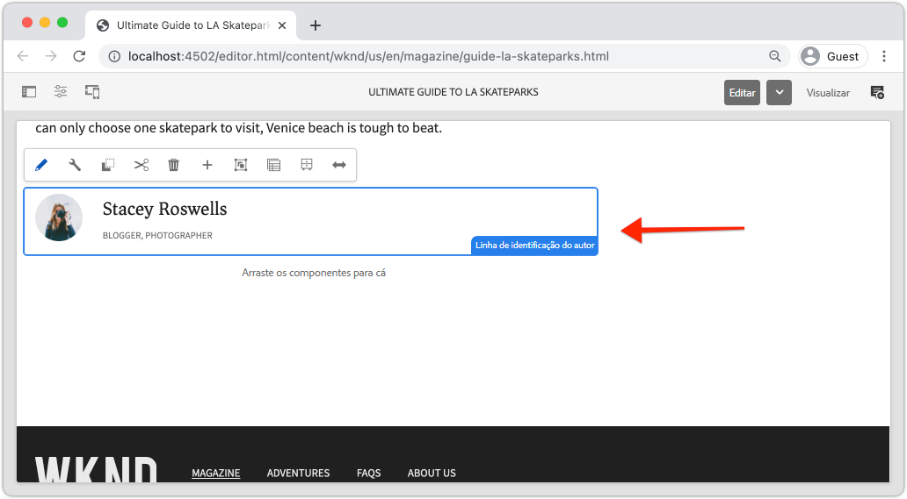
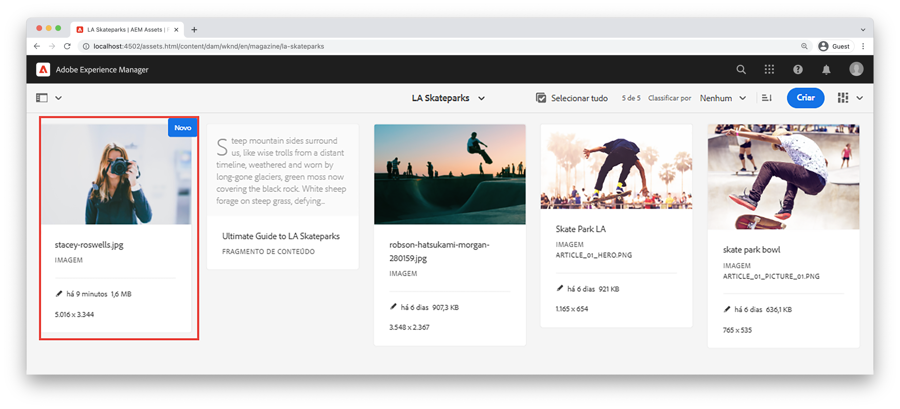
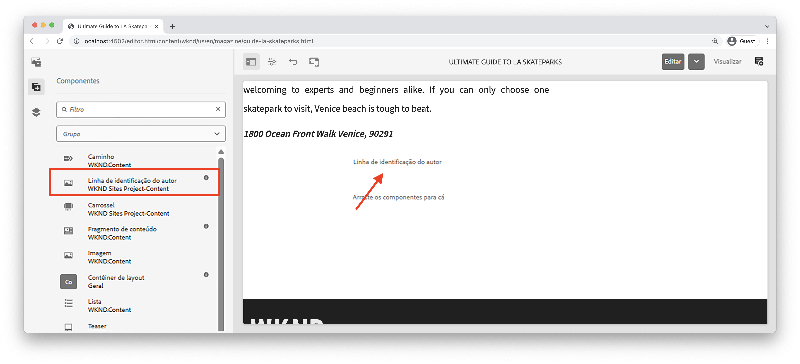
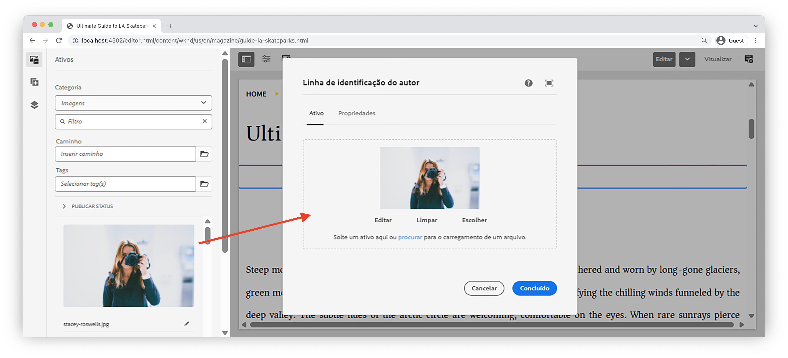
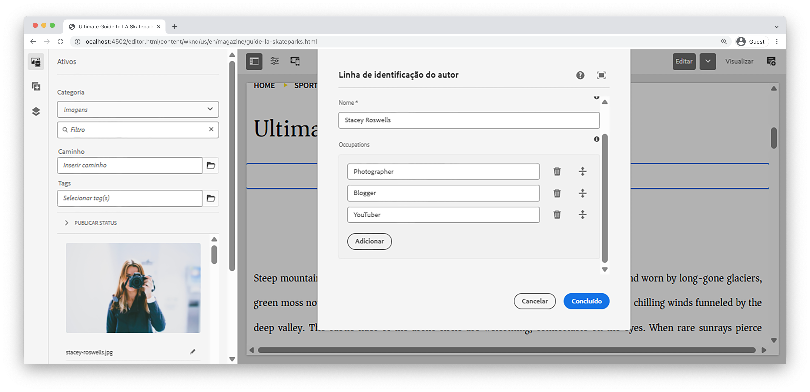
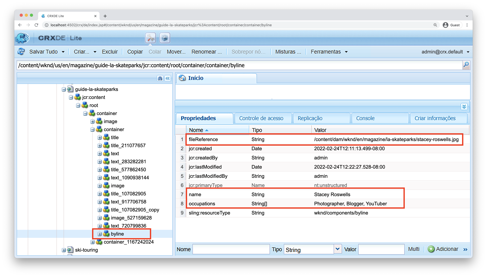
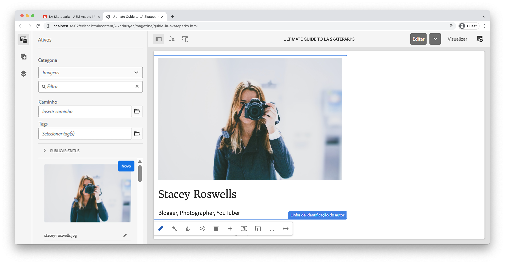
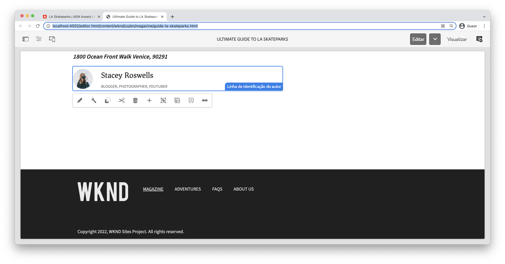

# Componente personalizado {#custom-component}

Este tutorial aborda a criação completa de um Componente de AEM Byline personalizado que exibe o conteúdo criado em uma caixa de diálogo e explora o desenvolvimento de um Modelo do Sling para encapsular a lógica de negócios que preenche o HTL do componente.

## Pré-requisitos {#prerequisites}

Revise as ferramentas necessárias e as instruções para configurar um [ambiente de desenvolvimento local](overview.md#local-dev-environment).

### Projeto inicial

>[!NOTE]
>
> Se você concluiu o capítulo anterior com êxito, é possível reutilizar o projeto e ignorar as etapas para verificar o projeto inicial.

Confira o código base que o tutorial constrói em:

1. Confira o `tutorial/custom-component-start` ramificação de [GitHub](https://github.com/adobe/aem-guides-wknd)

   ```shell
   $ cd aem-guides-wknd
   $ git checkout tutorial/custom-component-start
   ```

1. Implante a base de código em uma instância de AEM local usando suas habilidades Maven:

   ```shell
   $ mvn clean install -PautoInstallSinglePackage
   ```

   >[!NOTE]
   >
   > Se estiver usando AEM 6.5 ou 6.4, anexe a `classic` para qualquer comando Maven.

   ```shell
   $ mvn clean install -PautoInstallSinglePackage -Pclassic
   ```

Você sempre pode exibir o código concluído em [GitHub](https://github.com/adobe/aem-guides-wknd/tree/tutorial/custom-component-solution) ou verifique o código localmente, alternando para a ramificação `tutorial/custom-component-solution`.

## Objetivo

1. Entenda como criar um componente de AEM personalizado
1. Saiba como encapsular a lógica comercial com Modelos do Sling
1. Entender como usar um Modelo do Sling de dentro de um Script HTL

## O que você vai criar {#byline-component}

Nesta parte do tutorial WKND, é criado um Componente de linha de bytes que será usado para exibir informações criadas sobre o colaborador de um artigo.



*Componente Byline*

A implementação do componente Byline inclui uma caixa de diálogo que coleta o conteúdo byline e um Modelo Sling personalizado que recupera o conteúdo byline:

* Nome
* Imagem
* Ocupações

## Criar componente Byline {#create-byline-component}

Primeiro, crie a estrutura do nó Componente de Byline e defina uma caixa de diálogo. Isso representa o Componente no AEM e define implicitamente o tipo de recurso do componente pelo seu local no JCR.

A caixa de diálogo expõe a interface com a qual os autores de conteúdo podem fornecer. Para essa implementação, o componente principal do WCM AEM **Imagem** componente será aproveitado para lidar com a criação e renderização da imagem do Byline, de modo que será definido como o componente `sling:resourceSuperType`.

### Criar definição de componente {#create-component-definition}

1. No **ui.apps** , navegue até `/apps/wknd/components` e criar uma nova pasta chamada `byline`.
1. Abaixo da `byline` pasta adicione um novo arquivo chamado `.content.xml`

   

1. Preencha o `.content.xml` com o seguinte:

   ```xml
   <?xml version="1.0" encoding="UTF-8"?>
       <jcr:root xmlns:sling="http://sling.apache.org/jcr/sling/1.0" xmlns:cq="http://www.day.com/jcr/cq/1.0" xmlns:jcr="http://www.jcp.org/jcr/1.0"
       jcr:primaryType="cq:Component"
       jcr:title="Byline"
       jcr:description="Displays a contributor's byline."
       componentGroup="WKND Sites Project - Content"
       sling:resourceSuperType="core/wcm/components/image/v2/image"/>
   ```

   O arquivo XML acima fornece a definição do componente, incluindo o título, a descrição e o grupo. O `sling:resourceSuperType` pontos a `core/wcm/components/image/v2/image`, que é o [Componente de imagem principal](https://experienceleague.adobe.com/docs/experience-manager-core-components/using/components/image.html).

### Criar o script HTL {#create-the-htl-script}

1. Abaixo da `byline` adicionar um novo arquivo `byline.html`, responsável pela apresentação do HTML do componente. É importante nomear o arquivo como a pasta, pois ele se torna o script padrão que o Sling usará para renderizar esse tipo de recurso.

1. Adicione o seguinte código ao `byline.html`.

   ```html
   <!--/* byline.html */-->
   <div data-sly-use.placeholderTemplate="core/wcm/components/commons/v1/templates.html">
   </div>
   <sly data-sly-call="${placeholderTemplate.placeholder @ isEmpty=true}"></sly>
   ```

`byline.html` é [revisitado mais tarde](#byline-htl), depois que o Modelo do Sling é criado. O estado atual do arquivo HTL permite que o componente seja exibido em um estado vazio, no Editor de página do AEM Sites, quando ele é arrastado e solto na página.

### Criar a definição da caixa de diálogo {#create-the-dialog-definition}

Em seguida, defina uma caixa de diálogo para o componente Byline com os seguintes campos:

* **Nome**: um campo de texto com o nome do colaborador.
* **Imagem**: uma referência à imagem bio do colaborador.
* **Ocupações**: uma lista de ocupações atribuídas ao colaborador. As profissões devem ser classificadas alfabeticamente por ordem crescente (a a z).

1. Abaixo da `byline` criar uma nova pasta chamada `_cq_dialog`.
1. Beneath `byline/_cq_dialog` adicione um novo arquivo chamado `.content.xml`. Esta é a definição XML da caixa de diálogo. Adicione o seguinte XML:

   ```xml
   <?xml version="1.0" encoding="UTF-8"?>
   <jcr:root xmlns:sling="http://sling.apache.org/jcr/sling/1.0" xmlns:cq="http://www.day.com/jcr/cq/1.0" xmlns:jcr="http://www.jcp.org/jcr/1.0" xmlns:nt="http://www.jcp.org/jcr/nt/1.0"
           jcr:primaryType="nt:unstructured"
           jcr:title="Byline"
           sling:resourceType="cq/gui/components/authoring/dialog">
       <content
               jcr:primaryType="nt:unstructured"
               sling:resourceType="granite/ui/components/coral/foundation/container">
           <items jcr:primaryType="nt:unstructured">
               <tabs
                       jcr:primaryType="nt:unstructured"
                       sling:resourceType="granite/ui/components/coral/foundation/tabs"
                       maximized="{Boolean}false">
                   <items jcr:primaryType="nt:unstructured">
                       <asset
                               jcr:primaryType="nt:unstructured"
                               sling:hideResource="{Boolean}false"/>
                       <metadata
                               jcr:primaryType="nt:unstructured"
                               sling:hideResource="{Boolean}true"/>
                       <properties
                               jcr:primaryType="nt:unstructured"
                               jcr:title="Properties"
                               sling:resourceType="granite/ui/components/coral/foundation/container"
                               margin="{Boolean}true">
                           <items jcr:primaryType="nt:unstructured">
                               <columns
                                       jcr:primaryType="nt:unstructured"
                                       sling:resourceType="granite/ui/components/coral/foundation/fixedcolumns"
                                       margin="{Boolean}true">
                                   <items jcr:primaryType="nt:unstructured">
                                       <column
                                               jcr:primaryType="nt:unstructured"
                                               sling:resourceType="granite/ui/components/coral/foundation/container">
                                           <items jcr:primaryType="nt:unstructured">
                                               <name
                                                       jcr:primaryType="nt:unstructured"
                                                       sling:resourceType="granite/ui/components/coral/foundation/form/textfield"
                                                       emptyText="Enter the contributor's name to display."
                                                       fieldDescription="The contributor's name to display."
                                                       fieldLabel="Name"
                                                       name="./name"
                                                       required="{Boolean}true"/>
                                               <occupations
                                                       jcr:primaryType="nt:unstructured"
                                                       sling:resourceType="granite/ui/components/coral/foundation/form/multifield"
                                                       fieldDescription="A list of the contributor's occupations."
                                                       fieldLabel="Occupations"
                                                       required="{Boolean}false">
                                                   <field
                                                           jcr:primaryType="nt:unstructured"
                                                           sling:resourceType="granite/ui/components/coral/foundation/form/textfield"
                                                           emptyText="Enter an occupation"
                                                           name="./occupations"/>
                                               </occupations>
                                           </items>
                                       </column>
                                   </items>
                               </columns>
                           </items>
                       </properties>
                   </items>
               </tabs>
           </items>
       </content>
   </jcr:root>
   ```

   Essas definições de nó de diálogo usam o [Fusão de Recursos Sling](https://sling.apache.org/documentation/bundles/resource-merger.html) para controlar quais guias de diálogo são herdadas do `sling:resourceSuperType` , nesse caso, a variável **Componente de imagem dos Componentes principais**.

   

### Criar a caixa de diálogo Política {#create-the-policy-dialog}

Seguindo a mesma abordagem da criação da caixa de diálogo, crie uma caixa de diálogo Política (anteriormente conhecida como caixa de diálogo Design) para ocultar campos indesejados na configuração Política herdada do componente Imagem dos componentes principais.

1. Abaixo da `byline` criar uma nova pasta chamada `_cq_design_dialog`.
1. Beneath `byline/_cq_design_dialog` crie um novo arquivo chamado `.content.xml`. Atualize o arquivo com o seguinte: com o XML a seguir. É mais fácil abrir o `.content.xml` e copie/cole o XML abaixo nele.

   ```xml
   <?xml version="1.0" encoding="UTF-8"?>
   <jcr:root xmlns:sling="http://sling.apache.org/jcr/sling/1.0" xmlns:granite="http://www.adobe.com/jcr/granite/1.0" xmlns:cq="http://www.day.com/jcr/cq/1.0" xmlns:jcr="http://www.jcp.org/jcr/1.0" xmlns:nt="http://www.jcp.org/jcr/nt/1.0"
       jcr:primaryType="nt:unstructured"
       jcr:title="Byline"
       sling:resourceType="cq/gui/components/authoring/dialog">
       <content
               jcr:primaryType="nt:unstructured">
           <items jcr:primaryType="nt:unstructured">
               <tabs
                       jcr:primaryType="nt:unstructured">
                   <items jcr:primaryType="nt:unstructured">
                       <properties
                               jcr:primaryType="nt:unstructured">
                           <items jcr:primaryType="nt:unstructured">
                               <content
                                       jcr:primaryType="nt:unstructured">
                                   <items jcr:primaryType="nt:unstructured">
                                       <decorative
                                               jcr:primaryType="nt:unstructured"
                                               sling:hideResource="{Boolean}true"/>
                                       <altValueFromDAM
                                               jcr:primaryType="nt:unstructured"
                                               sling:hideResource="{Boolean}true"/>
                                       <titleValueFromDAM
                                               jcr:primaryType="nt:unstructured"
                                               sling:hideResource="{Boolean}true"/>
                                       <displayCaptionPopup
                                               jcr:primaryType="nt:unstructured"
                                               sling:hideResource="{Boolean}true"/>
                                       <disableUuidTracking
                                               jcr:primaryType="nt:unstructured"
                                               sling:hideResource="{Boolean}true"/>
                                   </items>
                               </content>
                           </items>
                       </properties>
                       <features
                               jcr:primaryType="nt:unstructured">
                           <items jcr:primaryType="nt:unstructured">
                               <content
                                       jcr:primaryType="nt:unstructured">
                                   <items jcr:primaryType="nt:unstructured">
                                       <accordion
                                               jcr:primaryType="nt:unstructured">
                                           <items jcr:primaryType="nt:unstructured">
                                               <orientation
                                                       jcr:primaryType="nt:unstructured"
                                                       sling:hideResource="{Boolean}true"/>
                                               <crop
                                                       jcr:primaryType="nt:unstructured"
                                                       sling:hideResource="{Boolean}true"/>
                                           </items>
                                       </accordion>
                                   </items>
                               </content>
                           </items>
                       </features>
                   </items>
               </tabs>
           </items>
       </content>
   </jcr:root>
   ```

   A base para o **Caixa de diálogo Política** O XML foi obtido do [Componentes principais Componente de imagem](https://github.com/adobe/aem-core-wcm-components/blob/master/content/src/content/jcr_root/apps/core/wcm/components/image/v2/image/_cq_design_dialog/.content.xml).

   Como na configuração da caixa de diálogo, [Fusão de Recursos Sling](https://sling.apache.org/documentation/bundles/resource-merger.html) é usada para ocultar campos irrelevantes que, de outra forma, são herdados do `sling:resourceSuperType`, conforme observado pelas definições de nó com `sling:hideResource="{Boolean}true"` propriedade.

### Implantar o código {#deploy-the-code}

1. Sincronize as alterações em `ui.apps` com seu IDE ou usando suas habilidades Maven.

   

## Adicionar o componente a uma página {#add-the-component-to-a-page}

Para manter as coisas simples e focadas no desenvolvimento AEM componente, adicionaremos o componente Sublinhado em seu estado atual a uma página de Artigo para verificar a variável `cq:Component` a definição do nó é implantada e correta, AEM reconhece a definição do novo componente e a caixa de diálogo do componente funciona para a criação.

### Adicionar uma imagem à AEM Assets

Primeiro, carregue uma captura de cabeça de amostra no AEM Assets para usar o para preencher a imagem no componente Linha de Byte.

1. Navegue até a pasta LA Skateparks no AEM Assets: [http://localhost:4502/assets.html/content/dam/wknd/en/magazine/la-skateparks](http://localhost:4502/assets.html/content/dam/wknd/en/magazine/la-skateparks).

1. Carregue a captura de cabeça para  **[stacey-roswells.jpg](assets/custom-component/stacey-roswells.jpg)** na pasta .

   

### Criar o componente {#author-the-component}

Em seguida, adicione o componente Byline a uma página em AEM. Como adicionamos o componente Byline ao **Projeto de sites da WKND - Conteúdo** Grupo de componentes, por meio do `ui.apps/src/main/content/jcr_root/apps/wknd/components/byline/.content.xml` está automaticamente disponível para qualquer **Contêiner** whose **Política** permite que **Projeto de sites da WKND - Conteúdo** grupo de componentes, que é o Contêiner de layout da página do artigo.

1. Navegue até o artigo LA Skatepark em: [http://localhost:4502/editor.html/content/wknd/us/en/magazine/guide-la-skateparks.html](http://localhost:4502/editor.html/content/wknd/us/en/magazine/guide-la-skateparks.html)

1. Na barra lateral esquerda, arraste e solte uma **Componente Byline** em **bottom** do Contêiner de layout da página de artigo aberta.

   

1. Verifique se a **a barra lateral esquerda está aberta** e visíveis, e **Localizador de ativos** está selecionada.

1. Selecione o **Espaço reservado do componente Byline**, que, por sua vez, exibe a barra de ação e toque em **chave inglesa** para abrir a caixa de diálogo.

1. Com a caixa de diálogo aberta e a primeira guia (Ativo) ativa, abre a barra lateral esquerda e, no localizador de ativos, arraste uma imagem para a área de soltar Imagem . Procure por &quot;stacey&quot; para encontrar a imagem biográfica de Stacey Roswells fornecida no pacote ui.content de WKND.

   

1. Depois de adicionar uma imagem, clique no botão **Propriedades** para entrar na guia **Nome** e **Ocupações**.

   Ao inserir ocupações, insira-as em **alfabética reversa** ordenar para que a lógica de negócios alfabética que implementaremos no Modelo do Sling seja prontamente aparente.

   Toque no **Concluído** na parte inferior direita para salvar as alterações.

   

   AEM autores configuram e criam componentes por meio das caixas de diálogo. Nesse ponto do desenvolvimento do componente Byline, as caixas de diálogo são incluídas na coleta de dados, no entanto, a lógica para renderizar o conteúdo criado ainda não foi adicionada. Portanto, somente o espaço reservado é exibido.

1. Depois de salvar a caixa de diálogo, navegue até [CRXDE Lite](http://localhost:4502/crx/de/index.jsp#/content/wknd/us/en/magazine/guide-la-skateparks/jcr%3Acontent/root/container/container/byline) e revise como o conteúdo do componente é armazenado no nó de conteúdo do componente byline na página AEM.

   Encontre o nó Byline Component Content abaixo da página LA Skate Parks, ou seja `/content/wknd/us/en/magazine/guide-la-skateparks/jcr:content/root/container/container/byline`.

   Observe os nomes de propriedade `name`, `occupations`e `fileReference` são armazenadas no **nó byline**.

   Além disso, observe a `sling:resourceType` do nó está definido como `wknd/components/content/byline` que é o que vincula esse nó de conteúdo à implementação do componente Byline.

   

## Criar Modelo de Sling por Linha {#create-sling-model}

Em seguida, criaremos um Modelo do Sling para agir como o modelo de dados e manter a lógica de negócios do componente Byline.

Os Modelos do Sling são objetos Java &quot;POJO&quot; (Plain Old Java Objects) orientados por anotações que facilitam o mapeamento de dados do JCR para variáveis Java e fornecem várias outras sutilezas ao serem desenvolvidas no contexto de AEM.

### Revisar Dependências Maven {#maven-dependency}

O Modelo Byline Sling dependerá de várias APIs Java fornecidas pelo AEM. Essas APIs são disponibilizadas pelo `dependencies` listadas no `core` arquivo POM do módulo. O projeto usado para este tutorial foi criado para AEM as a Cloud Service. No entanto, é único, pois é compatível com o AEM 6.5/6.4. Portanto, ambas as dependências para o Cloud Service e AEM 6.x estão incluídas.

1. Abra o `pom.xml` arquivo debaixo de `<src>/aem-guides-wknd/core/pom.xml`.
1. Encontre a dependência para `aem-sdk-api` - **Somente AEM as a Cloud Service**

   ```xml
   <dependency>
       <groupId>com.adobe.aem</groupId>
       <artifactId>aem-sdk-api</artifactId>
   </dependency>
   ```

   O [aem-sdk-api](https://experienceleague.adobe.com/docs/experience-manager-cloud-service/implementing/developing/aem-as-a-cloud-service-sdk.html?lang=en#building-for-the-sdk) contém todas as APIs Java públicas expostas pelo AEM. O `aem-sdk-api` é usada por padrão ao criar este projeto. A versão é mantida no pom do reator principal localizado na raiz do projeto em `aem-guides-wknd/pom.xml`.

1. Encontre a dependência para a `uber-jar` - **Somente AEM 6.5/6.4**

   ```xml
   ...
       <dependency>
           <groupId>com.adobe.aem</groupId>
           <artifactId>uber-jar</artifactId>
           <classifier>apis</classifier>
       </dependency>
   ...
   ```

   O `uber-jar` é incluído somente quando a variável `classic` perfil é chamado, ou seja `mvn clean install -PautoInstallSinglePackage -Pclassic`. Novamente, isso é exclusivo para este projeto. Em um projeto do mundo real, gerado pelo Arquétipo de projeto AEM da `uber-jar` será o padrão se a versão de AEM especificada for 6.5 ou 6.4.

   O [uber-jar](https://experienceleague.adobe.com/docs/experience-manager-65/developing/devtools/ht-projects-maven.html#experience-manager-api-dependencies) contém todas as APIs do Java públicas expostas pelo AEM 6.x. A versão é mantida no pom do reator principal localizado na raiz do projeto `aem-guides-wknd/pom.xml`.

1. Encontre a dependência para `core.wcm.components.core`:

   ```xml
    <!-- Core Component Dependency -->
       <dependency>
           <groupId>com.adobe.cq</groupId>
           <artifactId>core.wcm.components.core</artifactId>
       </dependency>
   ```

   Todas as APIs Java públicas expostas pelos Componentes principais AEM. AEM Componentes principais é um projeto mantido fora do AEM e, portanto, tem um ciclo de lançamento separado. Por isso, é uma dependência que precisa ser incluída separadamente e é **not** incluído na `uber-jar` ou `aem-sdk-api`.

   Como o uber-jar, a versão dessa dependência é mantida no arquivo pom do reator pai localizado em `aem-guides-wknd/pom.xml`.

   Mais tarde neste tutorial, usaremos a classe Imagem do componente principal para exibir a imagem no componente Linha de bytes. É necessário ter a dependência do Componente principal para criar e compilar nosso Modelo do Sling.

### Interface de byline {#byline-interface}

Criar uma interface Java pública para o Byline. `Byline.java` define os métodos públicos necessários para direcionar o `byline.html` Script HTL.

1. No `aem-guides-wknd.core` módulo abaixo `core/src/main/java/com/adobe/aem/guides/wknd/core/models` crie um novo arquivo chamado `Byline.java`

   

1. Atualizar `Byline.java` pelos seguintes métodos:

   ```java
   package com.adobe.aem.guides.wknd.core.models;
   
   import java.util.List;
   
   /**
   * Represents the Byline AEM Component for the WKND Site project.
   **/
   public interface Byline {
       /***
       * @return a string to display as the name.
       */
       String getName();
   
       /***
       * Occupations are to be sorted alphabetically in a descending order.
       *
       * @return a list of occupations.
       */
       List<String> getOccupations();
   
       /***
       * @return a boolean if the component has enough content to display.
       */
       boolean isEmpty();
   }
   ```

   Os dois primeiros métodos expõem os valores para a variável **name** e **ocupações** para o componente Byline.

   O `isEmpty()` é usado para determinar se o componente tem algum conteúdo para renderizar ou se está aguardando ser configurado.

   Observe que não há um método para a Imagem; [vamos ver por que isso é mais tarde](#tackling-the-image-problem).

1. Os pacotes Java que contêm classes Java públicas, neste caso um Modelo do Sling, devem ter controle de versão usando o pacote  `package-info.java` arquivo.

   Desde o pacote Java da fonte WKND `com.adobe.aem.guides.wknd.core.models` declara que é a versão de `1.0.0`, e estamos adicionando uma interface pública e métodos ininterruptos, a versão deve ser aumentada para `1.1.0`. Abra o arquivo em `core/src/main/java/com/adobe/aem/guides/wknd/core/models/package-info.java` e atualizar `@Version("1.0.0")` para `@Version("1.1.0")`.

       &quot;
       @Version(&quot;2.1.0&quot;)
       pacote com.adobe.aem.guides.wknd.core.models;
       
       importar org.osgi.annotation.versioning.Version;
       &quot;
   
   Sempre que uma alteração for feita nos arquivos deste pacote, a variável [a versão do pacote deve ser ajustada semanticamente](https://semver.org/). Caso contrário, o projeto Maven [bnd-baseline-maven-plugin](https://github.com/bndtools/bnd/tree/master/maven/bnd-baseline-maven-plugin) detectará uma versão de pacote inválida e quebrará a build. Por sorte, em caso de falha, o plug-in Maven informa a versão inválida do pacote Java, bem como a versão que deve ser usada. Acabei de atualizar o `@Version("...")` na violação do pacote Java `package-info.java` para a versão recomendada pelo plug-in para corrigir.

### Implementação de bytes {#byline-implementation}

`BylineImpl.java` é a implementação do Modelo do Sling que implementa o `Byline.java` interface definida anteriormente. O código completo para `BylineImpl.java` pode ser encontrado na parte inferior desta seção.

1. Crie uma nova pasta chamada `impl` debaixo `core/src/main/java/com/adobe/aem/guides/core/models`.
1. No `impl` pasta criar um novo arquivo `BylineImpl.java`.

   

1. Abrir `BylineImpl.java`. Especifique que ele implementa a variável `Byline` interface. Use os recursos de preenchimento automático do IDE ou atualize manualmente o arquivo para incluir os métodos necessários para implementar o `Byline` interface:

   ```java
   package com.adobe.aem.guides.wknd.core.models.impl;
   import java.util.List;
   import com.adobe.aem.guides.wknd.core.models.Byline;
   
   public class BylineImpl implements Byline {
   
       @Override
       public String getName() {
           // TODO Auto-generated method stub
           return null;
       }
   
       @Override
       public List<String> getOccupations() {
           // TODO Auto-generated method stub
           return null;
       }
   
       @Override
       public boolean isEmpty() {
           // TODO Auto-generated method stub
           return false;
       }
   }
   ```

1. Adicionar as anotações do Modelo Sling atualizando `BylineImpl.java` com as seguintes anotações de nível de classe. Essa `@Model(..)`A anotação é o que transforma a classe em um Modelo do Sling.

   ```java
   import org.apache.sling.api.SlingHttpServletRequest;
   import org.apache.sling.models.annotations.Model;
   import org.apache.sling.models.annotations.DefaultInjectionStrategy;
   ...
   @Model(
           adaptables = {SlingHttpServletRequest.class},
           adapters = {Byline.class},
           resourceType = {BylineImpl.RESOURCE_TYPE},
           defaultInjectionStrategy = DefaultInjectionStrategy.OPTIONAL
   )
   public class BylineImpl implements Byline {
       protected static final String RESOURCE_TYPE = "wknd/components/byline";
       ...
   }
   ```

   Vamos analisar essa anotação e seus parâmetros:

   * O `@Model` A anotação registra o BylineImpl como um Modelo Sling quando ele é implantado em AEM.
   * O `adaptables` especifica que esse modelo pode ser adaptado pela solicitação.
   * O `adapters` permite que a classe de implementação seja registrada na interface Byline. Isso permite que o script HTL chame o Modelo do Sling por meio da interface (em vez do impl diretamente). [Mais detalhes sobre adaptadores podem ser encontrados aqui](https://sling.apache.org/documentation/bundles/models.html#specifying-an-alternate-adapter-class-since-110).
   * O `resourceType` aponta para o tipo de recurso do componente Byline (criado anteriormente) e ajuda a resolver o modelo correto se houver várias implementações. [Mais detalhes sobre como associar uma classe de modelo a um tipo de recurso podem ser encontrados aqui](https://sling.apache.org/documentation/bundles/models.html#associating-a-model-class-with-a-resource-type-since-130).

### Implementar os métodos do Modelo do Sling {#implementing-the-sling-model-methods}

#### getName() {#implementing-get-name}

O primeiro método que vamos combater é `getName()` que simplesmente retorna o valor armazenado no nó de conteúdo JCR da linha de bytes na propriedade `name`.

Para isso, a variável `@ValueMapValue` A anotação do Modelo do Sling é usada para inserir o valor em um campo Java usando o ValueMap do recurso da Solicitação.


```java
import org.apache.sling.models.annotations.injectorspecific.ValueMapValue;

public class BylineImpl implements Byline {
    ...
    @ValueMapValue
    private String name;

    ...
    @Override
    public String getName() {
        return name;
    }
    ...
}
```

Como a propriedade JCR compartilha o mesmo nome do campo Java (ambos são &quot;nome&quot;), `@ValueMapValue` resolve automaticamente essa associação e injeta o valor da propriedade no campo Java .

#### getOccupations() {#implementing-get-occupations}

O próximo método de implementação é `getOccupations()`. Esse método coleta todas as ocupações armazenadas na propriedade JCR `occupations` e retornar uma coleção classificada (alfabeticamente) deles.

Uso da mesma técnica explorada em `getName()` o valor da propriedade pode ser inserido no campo do Modelo do Sling.

Quando os valores da propriedade JCR estiverem disponíveis no Modelo do Sling por meio do campo Java inserido `occupations`, a lógica comercial de classificação pode ser aplicada na variável `getOccupations()` método .


```java
import java.util.ArrayList;
import java.util.Collections;
  ...

public class BylineImpl implements Byline {
    ...
    @ValueMapValue
    private List<String> occupations;
    ...
    @Override
    public List<String> getOccupations() {
        if (occupations != null) {
            Collections.sort(occupations);
            return new ArrayList<String>(occupations);
        } else {
            return Collections.emptyList();
        }
    }
    ...
}
  ...
```


#### isEmpty() {#implementing-is-empty}

O último método público é `isEmpty()` que determina quando o componente deve se considerar &quot;suficientemente criado&quot; para renderizar.

Para esse componente, temos requisitos de negócios que indicam que os três campos, nome, imagem e ocupações devem ser preenchidos *before* o componente pode ser renderizado.


```java
import org.apache.commons.lang3.StringUtils;
  ...
public class BylineImpl implements Byline {
    ...
    @Override
    public boolean isEmpty() {
        if (StringUtils.isBlank(name)) {
            // Name is missing, but required
            return true;
        } else if (occupations == null || occupations.isEmpty()) {
            // At least one occupation is required
            return true;
        } else if (/* image is not null, logic to be determined */) {
            // A valid image is required
            return true;
        } else {
            // Everything is populated, so this component is not considered empty
            return false;
        }
    }
    ...
}
```


#### Lidar com o &quot;problema de imagem&quot; {#tackling-the-image-problem}

Verificar o nome e as condições de ocupação são triviais (e o Apache Commons Lang3 fornece o que é sempre útil [StringUtils](https://commons.apache.org/proper/commons-lang/apidocs/org/apache/commons/lang3/StringUtils.html) classe ), no entanto, não está claro como a variável **presença da imagem** pode ser validado, pois o componente Imagem dos componentes principais é usado para exibir a imagem.

Há duas maneiras de lidar com isso:

Verifique se a variável `fileReference` A propriedade JCR resolve um ativo. *OU* Converta esse recurso em um Modelo de sling de imagem do componente principal e garanta que o `getSrc()` O método não está vazio.

Optaremos pela **Second** abordagem. A primeira abordagem provavelmente é suficiente, mas neste tutorial o último será usado para permitir a exploração de outros recursos dos Modelos do Sling.

1. Crie um método privado que obtenha a Imagem. Esse método é deixado privado porque não precisamos expor o objeto Image no próprio HTL e seu único método usado para direcionar `isEmpty().`

   Adicione o seguinte método privado para `getImage()`:

   ```java
   import com.adobe.cq.wcm.core.components.models.Image;
   ...
   private Image getImage() {
       Image image = null;
       // Figure out how to populate the image variable!
       return image;
   }
   ```

   Como mencionado acima, há mais duas abordagens para obter a variável **Modelo do Sling de imagem**:

   O primeiro usa a variável `@Self` anotação, para adaptar automaticamente a solicitação atual ao `Image.class`

   O segundo usa a variável [Apache Sling ModelFactory](https://sling.apache.org/apidocs/sling10/org/apache/sling/models/factory/ModelFactory.html) O serviço OSGi, que é um serviço muito útil e nos ajuda a criar Modelos do Sling de outros tipos no código Java.

   Optaremos pela segunda abordagem.

   >[!NOTE]
   >
   >Em uma implementação real, use a abordagem &quot;Um&quot; `@Self` O é preferido, pois é a solução mais simples e elegante. Neste tutorial, usaremos a segunda abordagem, pois ela requer a exploração de mais facetas de Modelos do Sling que são extremamente úteis são componentes mais complexos!

   Como os Modelos do Sling são os Java POJO&#39;s e não os OSGi Services, as anotações habituais de injeção do OSGi `@Reference` **cannot** em vez disso, os Modelos do Sling fornecem um **[@OSGiService](https://sling.apache.org/documentation/bundles/models.html#injector-specific-annotations)** anotação que fornece funcionalidade semelhante.

1. Atualizar `BylineImpl.java` para incluir a `OSGiService` anotação para injetar a variável `ModelFactory`:

   ```java
   import org.apache.sling.models.factory.ModelFactory;
   import org.apache.sling.models.annotations.injectorspecific.OSGiService;
   ...
   public class BylineImpl implements Byline {
       ...
       @OSGiService
       private ModelFactory modelFactory;
   }
   ```

   Com o `ModelFactory` disponível, um Modelo de sling de imagem do componente principal pode ser criado usando:

   ```java
   modelFactory.getModelFromWrappedRequest(SlingHttpServletRequest request, Resource resource, java.lang.Class<T> targetClass)
   ```

   No entanto, esse método requer uma solicitação e um recurso, ainda não disponíveis no Modelo do Sling. Para obtê-los, mais anotações do Modelo do Sling são usadas!

   Para obter a solicitação atual, o **[@Self](https://sling.apache.org/documentation/bundles/models.html#injector-specific-annotations)** a anotação pode ser usada para injetar a variável `adaptable` (que é definida na variável `@Model(..)` as `SlingHttpServletRequest.class`, em um campo de classe Java.

1. Adicione o **@Self** anotação para obter o **Solicitação SlingHttpServletRequest**:

   ```java
   import org.apache.sling.models.annotations.injectorspecific.Self;
   ...
   @Self
   private SlingHttpServletRequest request;
   ```

   Lembrar, usando `@Self Image image` para injetar o Modelo Sling da imagem do componente principal era uma opção acima - o `@Self` A anotação tenta injetar o objeto adaptável (no nosso caso, um SlingHttpServletRequest) e adaptar ao tipo de campo de anotação. Como o Modelo Sling da Imagem do Componente Principal é adaptável a partir de objetos SlingHttpServletRequest , isso teria funcionado e seria menos código do que nossa abordagem mais exploratória.

   Agora, introduzimos as variáveis necessárias para instanciar nosso modelo de Imagem por meio da API ModelFactory . Usaremos o Modelo do Sling **[@PostConstruct](https://sling.apache.org/documentation/bundles/models.html#postconstruct-methods)** a anotação para obter esse objeto após a instanciação do Modelo do Sling.

   `@PostConstruct` é incrivelmente útil e atua em uma capacidade semelhante a um construtor, no entanto, é chamado depois que a classe é instanciada e todos os campos Java anotados são inseridos. Enquanto outras anotações do Modelo Sling anotam campos de classe Java (variáveis), `@PostConstruct` anota um método de parâmetro void, zero, normalmente chamado de `init()` (mas pode receber qualquer nome).

1. Adicionar **@PostConstruct** método :

   ```java
   import javax.annotation.PostConstruct;
   ...
   public class BylineImpl implements Byline {
       ...
       private Image image;
   
       @PostConstruct
       private void init() {
           image = modelFactory.getModelFromWrappedRequest(request,
                                                           request.getResource(),
                                                           Image.class);
       }
       ...
   }
   ```

   Lembre-se, os Modelos do Sling são **NOT** Serviços OSGi, portanto, é seguro manter o estado da classe. Frequentemente `@PostConstruct` O deriva e configura o estado da classe do Modelo Sling para uso posterior, semelhante ao que um construtor simples faz.

   Observe que se a variável `@PostConstruct` gera uma exceção, o Modelo do Sling não instanciará (será nulo).

1. **getImage()** agora pode ser atualizado para simplesmente retornar o objeto de imagem.

   ```java
   /**
       * @return the Image Sling Model of this resource, or null if the resource cannot create a valid Image Sling Model.
   */
   private Image getImage() {
       return image;
   }
   ```

1. Vamos voltar para `isEmpty()` e finalize a implementação:

   ```java
   @Override
   public boolean isEmpty() {
      final Image componentImage = getImage();
   
       if (StringUtils.isBlank(name)) {
           // Name is missing, but required
           return true;
       } else if (occupations == null || occupations.isEmpty()) {
           // At least one occupation is required
           return true;
       } else if (componentImage == null || StringUtils.isBlank(componentImage.getSrc())) {
           // A valid image is required
           return true;
       } else {
           // Everything is populated, so this component is not considered empty
           return false;
       }
   }
   ```

   Observe várias chamadas para `getImage()` não é problemático, pois retorna o arquivo inicializado `image` variável de classe e não invoca `modelFactory.getModelFromWrappedRequest(...)` O que não é um custo excessivo, mas vale a pena evitar chamar desnecessariamente.

1. A final `BylineImpl.java` deve ter a seguinte aparência:


   ```java
   package com.adobe.aem.guides.wknd.core.models.impl;
   
   import java.util.ArrayList;
   import java.util.Collections;
   import java.util.List;
   import javax.annotation.PostConstruct;
   import org.apache.commons.lang3.StringUtils;
   import org.apache.sling.api.SlingHttpServletRequest;
   import org.apache.sling.models.annotations.DefaultInjectionStrategy;
   import org.apache.sling.models.annotations.Model;
   import org.apache.sling.models.annotations.injectorspecific.OSGiService;
   import org.apache.sling.models.annotations.injectorspecific.Self;
   import org.apache.sling.models.annotations.injectorspecific.ValueMapValue;
   import org.apache.sling.models.factory.ModelFactory;
   import com.adobe.aem.guides.wknd.core.models.Byline;
   import com.adobe.cq.wcm.core.components.models.Image;
   
   @Model(
           adaptables = {SlingHttpServletRequest.class},
           adapters = {Byline.class},
           resourceType = {BylineImpl.RESOURCE_TYPE},
           defaultInjectionStrategy = DefaultInjectionStrategy.OPTIONAL
   )
   public class BylineImpl implements Byline {
       protected static final String RESOURCE_TYPE = "wknd/components/byline";
   
       @Self
       private SlingHttpServletRequest request;
   
       @OSGiService
       private ModelFactory modelFactory;
   
       @ValueMapValue
       private String name;
   
       @ValueMapValue
       private List<String> occupations;
   
       private Image image;
   
       /**
       * @PostConstruct is immediately called after the class has been initialized
       * but BEFORE any of the other public methods. 
       * It is a good method to initialize variables that will be used by methods in the rest of the model
       *
       */
       @PostConstruct
       private void init() {
           // set the image object
           image = modelFactory.getModelFromWrappedRequest(request, request.getResource(), Image.class);
       }
   
       @Override
       public String getName() {
           return name;
       }
   
       @Override
       public List<String> getOccupations() {
           if (occupations != null) {
               Collections.sort(occupations);
               return new ArrayList<String>(occupations);
           } else {
               return Collections.emptyList();
           }
       }
   
       @Override
       public boolean isEmpty() {
           final Image componentImage = getImage();
   
           if (StringUtils.isBlank(name)) {
               // Name is missing, but required
               return true;
           } else if (occupations == null || occupations.isEmpty()) {
               // At least one occupation is required
               return true;
           } else if (componentImage == null || StringUtils.isBlank(componentImage.getSrc())) {
               // A valid image is required
               return true;
           } else {
               // Everything is populated, so this component is not considered empty
               return false;
           }
       }
   
       /**
       * @return the Image Sling Model of this resource, or null if the resource cannot create a valid Image Sling Model.
       */
       private Image getImage() {
           return image;
       }
   }
   ```


## Byline HTL {#byline-htl}

No `ui.apps` módulo, abrir `/apps/wknd/components/byline/byline.html` criamos na configuração anterior do componente AEM.

```html
<div data-sly-use.placeholderTemplate="core/wcm/components/commons/v1/templates.html">
</div>
<sly data-sly-call="${placeholderTemplate.placeholder @ isEmpty=false}"></sly>
```

Vamos analisar o que esse script HTL faz até agora:

* O `placeholderTemplate` aponta para o espaço reservado dos Componentes principais, que é exibido quando o componente não está totalmente configurado. Isso é renderizado no Editor de página do AEM Sites como uma caixa com o título do componente, conforme definido acima na `cq:Component`&#39;s  `jcr:title` propriedade.

* O `data-sly-call="${placeholderTemplate.placeholder @ isEmpty=false}` carrega o `placeholderTemplate` definido acima e passa em um valor booleano (atualmente codificado para `false`) no modelo de espaço reservado. When `isEmpty` for verdadeiro, o modelo de espaço reservado renderiza a caixa cinza, caso contrário, não renderiza nada.

### Atualizar HTL Byline

1. Atualizar **byline.html** com a seguinte estrutura de HTML ósseo:

   ```html
   <div data-sly-use.placeholderTemplate="core/wcm/components/commons/v1/templates.html"
       class="cmp-byline">
           <div class="cmp-byline__image">
               <!--/* Include the Core Components Image Component */-->
           </div>
           <h2 class="cmp-byline__name"><!--/* Include the name */--></h2>
           <p class="cmp-byline__occupations"><!--/* Include the occupations */--></p>
   </div>
   <sly data-sly-call="${placeholderTemplate.placeholder @ isEmpty=true}"></sly>
   ```

   Observe que as classes CSS seguem o [Convenção de nomenclatura BEM](https://getbem.com/naming/). Embora o uso de convenções de BEM não seja obrigatório, o BEM é recomendado, pois é usado em classes CSS de componentes principais e geralmente resulta em regras CSS limpas e legíveis.

### Instalação de objetos do Modelo Sling no HTL {#instantiating-sling-model-objects-in-htl}

O [Usar instrução de bloco](https://github.com/adobe/htl-spec/blob/master/SPECIFICATION.md#221-use) é usada para instanciar objetos do Modelo do Sling no script HTL e atribuí-lo a uma variável HTL.

`data-sly-use.byline="com.adobe.aem.guides.wknd.models.Byline"` usa a interface Byline (com.adobe.aem.guides.wknd.models.Byline) implementada por BylineImpl e adapta o SlingHttpServletRequest atual a ela, e o resultado é armazenado em uma byline de nome de variável HTL ( `data-sly-use.<variable-name>`).

1. Atualizar o exterior `div` para fazer referência à **Byline** Modelo do Sling por sua interface pública:

   ```xml
   <div data-sly-use.byline="com.adobe.aem.guides.wknd.core.models.Byline"
       data-sly-use.placeholderTemplate="core/wcm/components/commons/v1/templates.html"
       class="cmp-byline">
       ...
   </div>
   ```

### Acessar métodos do Modelo Sling {#accessing-sling-model-methods}

HTL empresta do JSTL e usa a mesma redução dos nomes de métodos de getter Java.

Por exemplo, chamar o Modelo de Sling em Linha `getName()` pode ser encurtado para `byline.name`do mesmo modo em vez de `byline.isEmpty`, isso pode ser encurtado para `byline.empty`. Uso de nomes completos de método, `byline.getName` ou `byline.isEmpty`, também funciona. Observe que `()` nunca são usadas para invocar métodos no HTL (semelhante ao JSTL).

Métodos Java que exigem um parâmetro **cannot** ser usado em HTL. Isso é feito por design para manter a lógica no HTL simples.

1. O nome da linha de bytes pode ser adicionado ao componente chamando a função `getName()` no Modelo de Sling Byline ou em HTL: `${byline.name}`.

   Atualize o `h2` tag:

   ```xml
   <h2 class="cmp-byline__name">${byline.name}</h2>
   ```

### Uso das opções de expressão do HTL {#using-htl-expression-options}

[Opções de expressões HTL](https://github.com/adobe/htl-spec/blob/master/SPECIFICATION.md#12-available-expression-options) atuam como modificadores de conteúdo em HTL e variam de formatação de data para tradução i18n. As expressões também podem ser usadas para unir listas ou matrizes de valores, que é o que é necessário para exibir as ocupações em um formato delimitado por vírgulas.

As expressões são adicionadas por meio da variável `@` na expressão HTL.

1. Para ingressar na lista de ocupações com &quot;, &quot;, é usado o seguinte código:

   ```html
   <p class="cmp-byline__occupations">${byline.occupations @ join=', '}</p>
   ```

### Exibição condicional de espaço reservado {#conditionally-displaying-the-placeholder}

A maioria dos scripts HTL para AEM componentes aproveita o **paradigma de espaço reservado** para fornecer uma dica visual aos autores **indicando que um componente foi criado incorretamente e não será exibido na publicação do AEM**. A convenção para conduzir esta decisão é implementar um método no modelo Sling de suporte do componente, no nosso caso: `Byline.isEmpty()`.

`isEmpty()` é chamado no Modelo de Sling Byline e o resultado (ou melhor, seu negativo) por meio do `!` operador) é salvo em uma variável HTL chamada de `hasContent`:

1. Atualizar o exterior `div` para salvar uma variável HTL chamada de `hasContent`:

   ```html
    <div data-sly-use.byline="com.adobe.aem.guides.wknd.core.models.Byline"
         data-sly-use.placeholderTemplate="core/wcm/components/commons/v1/templates.html"
         data-sly-test.hasContent="${!byline.empty}"
         class="cmp-byline">
         ...
   </div>
   ```

   Observe o uso de `data-sly-test`, o HTL `test` O bloco é interessante porque ele define uma variável HTL E renderiza/não renderiza o elemento HTML, com base em se o resultado da expressão HTL for verdadeiro ou não. Se &quot;truthy&quot;, o elemento HTML é renderizado, caso contrário, não é renderizado.

   Essa variável HTL `hasContent` agora pode ser reutilizado para mostrar/ocultar condicionalmente o espaço reservado.

1. Atualizar a chamada condicional para a variável `placeholderTemplate` na parte inferior do arquivo, com o seguinte:

   ```html
   <sly data-sly-call="${placeholderTemplate.placeholder @ isEmpty=!hasContent}"></sly>
   ```

### Exibir a imagem usando os componentes principais {#using-the-core-components-image}

O script HTL para `byline.html` O agora está quase completo e só falta a imagem.

Como usamos `sling:resourceSuperType` o componente de Imagem dos componentes principais para fornecer a criação da imagem, também podemos usar o componente de Imagem do componente principal para renderizar a imagem!

Para isso, precisamos incluir o recurso por linha atual, mas forçar o tipo de recurso do componente de Imagem dos Componentes Principais, usando o tipo de recurso `core/wcm/components/image/v2/image`. Este é um padrão avançado para a reutilização de componentes. Para isso, HTL&#39;s `data-sly-resource` é usado.

1. Substitua o `div` com uma classe de `cmp-byline__image` com o seguinte:

   ```html
   <div class="cmp-byline__image"
       data-sly-resource="${ '.' @ resourceType = 'core/wcm/components/image/v2/image' }"></div>
   ```

   Essa `data-sly-resource`, incluiu o recurso atual por meio do caminho relativo `'.'`, e força a inclusão do recurso atual (ou do recurso de conteúdo byline) com o tipo de recurso de `core/wcm/components/image/v2/image`.

   O tipo de recurso do Componente principal é usado diretamente, e não por meio de um proxy, pois é um uso no script e nunca é persistente para nosso conteúdo.

2. Concluído `byline.html` abaixo:

   ```html
   <!--/* byline.html */-->
   <div data-sly-use.byline="com.adobe.aem.guides.wknd.core.models.Byline" 
       data-sly-use.placeholderTemplate="core/wcm/components/commons/v1/templates.html"
       data-sly-test.hasContent="${!byline.empty}"
       class="cmp-byline">
       <div class="cmp-byline__image"
           data-sly-resource="${ '.' @ resourceType = 'core/wcm/components/image/v2/image' }">
       </div>
       <h2 class="cmp-byline__name">${byline.name}</h2>
       <p class="cmp-byline__occupations">${byline.occupations @ join=', '}</p>
   </div>
   <sly data-sly-call="${placeholderTemplate.placeholder @ isEmpty=!hasContent}"></sly>
   ```

3. Implante a base de código em uma instância de AEM local. Dado que foram efetuadas alterações ao `core` e `ui.apps` ambos os módulos precisam ser implantados.

   ```shell
   $ cd aem-guides-wknd/ui.apps
   $ mvn clean install -PautoInstallPackage
   ```

   ```shell
   $ cd ../core
   $ mvn clean install -PautoInstallBundle
   ```

   Se estiver implantando em AEM 6.5/6.4, chame a função `classic` perfil:

   ```shell
   $ cd ../core
   $ mvn clean install -PautoInstallBundle -Pclassic
   ```

   >[!CAUTION]
   >
   > Você também pode criar o projeto inteiro da raiz usando o perfil Maven `autoInstallSinglePackage` mas isso pode substituir as alterações de conteúdo na página. Isso ocorre porque a variável `ui.content/src/main/content/META-INF/vault/filter.xml` O foi modificado para o código inicial do tutorial substituir de forma limpa o conteúdo AEM existente. Em um cenário do mundo real isso não será um problema.

### Revisar o componente Sublinhado não estilizado {#reviewing-the-unstyled-byline-component}

1. Depois de implantar a atualização, navegue até o [Ultimate Guide to LA Skateparks ](http://localhost:4502/editor.html/content/wknd/us/en/magazine/guide-la-skateparks.html) ou onde você adicionou o componente Byline anteriormente no capítulo.

1. O **imagem**, **name** e **ocupações** agora é exibido e temos um componente sem estilo, mas funcionando como Byline.

   

### Revisar o registro do Modelo do Sling {#reviewing-the-sling-model-registration}

O [AEM exibição de status de modelos do Sling do Console da Web](http://localhost:4502/system/console/status-slingmodels) exibe todos os Modelos do Sling registrados em AEM. O Modelo de Sling Byline pode ser validado como sendo instalado e reconhecido revisando esta lista.

Se a variável **BylineImpl** não é exibido nessa lista, então provavelmente houve um problema com as anotações do Modelo do Sling ou o Modelo do Sling não foi adicionado ao pacote do Sling Models registrado (`com.adobe.aem.guides.wknd.core.models`) no projeto principal.


*http://localhost:4502/system/console/status-slingmodels*

## Estilos de byline {#byline-styles}

O componente Linha de Byte precisa ser estilizado para alinhar com o design criativo do componente Linha de Byte. Para tal, será utilizado o SCSS, que AEM o apoio através do **ui.frontend** Subprojeto Maven.

### Adicionar um estilo padrão

Adicione estilos padrão para o componente Linha de Byte.

1. Retorne ao IDE e à **ui.frontend** projeto em `/src/main/webpack/components`:
1. Crie um novo arquivo com o nome `_byline.scss`.

   

1. Adicione o CSS de implementações Byline (gravado como SCSS) na `_byline.scss`:

   ```scss
   .cmp-byline {
       $imageSize: 60px;
   
       .cmp-byline__image {
           float: left;
   
       /* This class targets a Core Component Image CSS class */
       .cmp-image__image {
           width: $imageSize;
           height: $imageSize;
           border-radius: $imageSize / 2;
           object-fit: cover;
           }
       }
   
       .cmp-byline__name {
           font-size: $font-size-medium;
           font-family: $font-family-serif;
           padding-top: 0.5rem;
           margin-left: $imageSize + 25px;
           margin-bottom: .25rem;
           margin-top:0rem;
       }
   
       .cmp-byline__occupations {
           margin-left: $imageSize + 25px;
           color: $gray;
           font-size: $font-size-xsmall;
           text-transform: uppercase;
       }
   }
   ```
1. Abra um terminal e navegue até o `ui.frontend` módulo.
1. Inicie o `watch` processar com o seguinte comando npm:

   ```shell
   $ cd ui.frontend/
   $ npm run watch
   ```

1. Retorne ao navegador e navegue até o [Artigo da LA SkateParks](http://localhost:4502/editor.html/content/wknd/us/en/magazine/guide-la-skateparks.html). Você deve ver os estilos atualizados para o componente.

   

   >[!TIP]
   >
   > Talvez seja necessário limpar o cache do navegador para garantir que o CSS obsoleto não esteja sendo atendido e atualizar a página com o componente Byline para obter o estilo completo.

## Parabéns! {#congratulations}

Parabéns, você acabou de criar um componente personalizado do zero usando o Adobe Experience Manager!

### Próximas etapas {#next-steps}

Continue a aprender sobre AEM desenvolvimento de componentes explorando como gravar testes JUnit para o código Java Byline para garantir que tudo seja desenvolvido corretamente e que a lógica comercial implementada esteja correta e completa.

* [Gravando testes de unidade ou componentes de AEM](unit-testing.md)

Exibir o código concluído em [GitHub](https://github.com/adobe/aem-guides-wknd) ou revise e implante o código localmente na chave Git `tutorial/custom-component-solution`.

1. Clonar o [github.com/adobe/aem-guides-wknd](https://github.com/adobe/aem-guides-wknd) repositório.
1. Confira o `tutorial/custom-component-solution` ramificação
