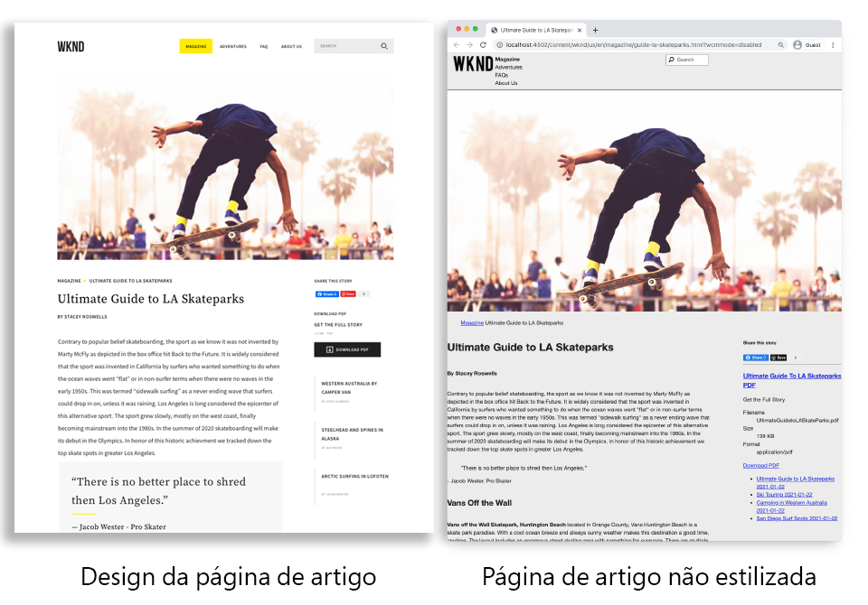
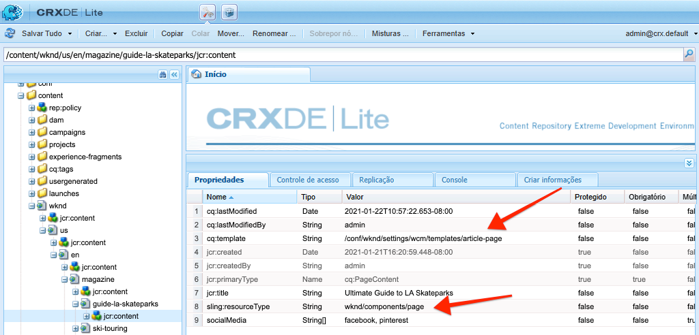
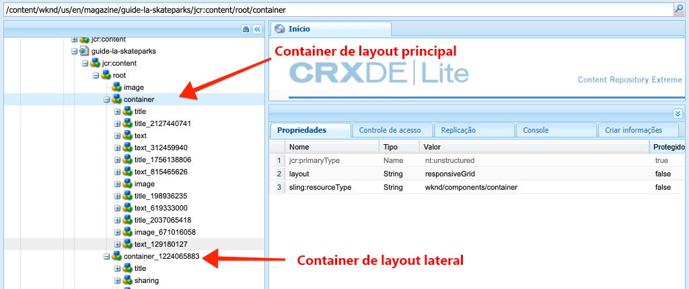
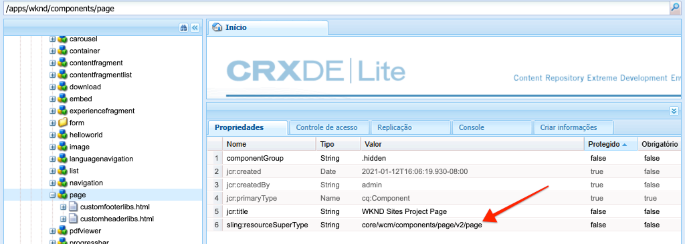
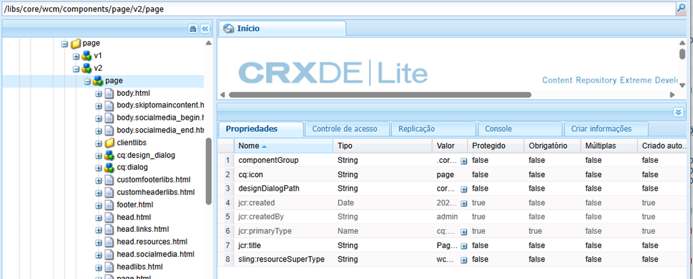

# Páginas e modelos {#pages-and-template}

Neste capítulo, exploraremos a relação entre um componente de página base e modelos editáveis. Criaremos um modelo de artigo não estilizado com base em alguns modelos de [AdobeXD](https://www.adobe.com/products/xd.html). No processo de criação do modelo, os Componentes principais e as configurações de política avançadas dos Modelos editáveis são abordados.

## Pré-requisitos {#prerequisites}

Revise as ferramentas necessárias e as instruções para configurar um [ambiente de desenvolvimento local](overview.md#local-dev-environment).

### Projeto inicial

>[!NOTE]
>
> Se você concluiu o capítulo anterior com êxito, é possível reutilizar o projeto e ignorar as etapas para verificar o projeto inicial.

Confira o código base que o tutorial constrói em:

1. Confira o `tutorial/pages-templates-start` ramificação de [GitHub](https://github.com/adobe/aem-guides-wknd)

   ```shell
   $ cd ~/code/aem-guides-wknd
   $ git checkout tutorial/pages-templates-start
   ```

1. Implante a base de código em uma instância de AEM local usando suas habilidades Maven:

   ```shell
   $ mvn clean install -PautoInstallSinglePackage
   ```

   >[!NOTE]
   >
   > Se estiver usando AEM 6.5 ou 6.4, anexe a `classic` para qualquer comando Maven.

   ```shell
   $ mvn clean install -PautoInstallSinglePackage -Pclassic
   ```

Você sempre pode exibir o código concluído em [GitHub](https://github.com/adobe/aem-guides-wknd/tree/tutorial/pages-templates-solution) ou verifique o código localmente, alternando para a ramificação `tutorial/pages-templates-solution`.

## Objetivo

1. Inspect é um design de página criado no Adobe XD e o mapeia para Componentes principais.
1. Entenda os detalhes de Modelos editáveis e como as políticas podem ser usadas para impor o controle granular do conteúdo da página.
1. Saiba como Modelos e Páginas são vinculados

## O que você vai criar {#what-you-will-build}

Nesta parte do tutorial, você criará um novo Modelo de página de artigo que pode ser usado para criar páginas de novos artigos e se alinha a uma estrutura comum. O modelo da página de artigo será baseado em designs e um kit de interface do usuário produzido no AdobeXD. Este capítulo só é focado na construção da estrutura ou esqueleto do modelo. Nenhum estilo será implementado, mas o modelo e as páginas serão funcionais.



## Planejamento de interface do usuário com Adobe XD {#adobexd}

Na maioria dos casos, o planejamento de um novo site começa com modelos e designs estáticos. [Adobe XD](https://www.adobe.com/products/xd.html) O é uma ferramenta de design que cria experiências do usuário. Em seguida, inspecionaremos um Kit de interface do usuário e modelos para ajudar a planejar a estrutura do Modelo de página de artigo.

>[!VIDEO](https://video.tv.adobe.com/v/30214/?quality=12&learn=on)

**Baixe o [Arquivo de design de artigo WKND](https://github.com/adobe/aem-guides-wknd/releases/download/aem-guides-wknd-0.0.2/AEM_UI-kit-WKND-article-design.xd)**.

>[!NOTE]
>
> Um genérico [O Kit da interface dos componentes principais do AEM também está disponível](https://experienceleague.adobe.com/docs/experience-manager-learn/assets/AEM-CoreComponents-UI-Kit.xd) como ponto de partida para projetos personalizados.

## Criar o modelo da página de artigo

Ao criar uma página, você deve selecionar um modelo, que será usado como a base de criação da nova página. O modelo define a estrutura da página resultante, o conteúdo inicial e os componentes permitidos.

Há três áreas principais de [Modelos editáveis](https://experienceleague.adobe.com/docs/experience-manager-65/developing/platform/templates/page-templates-editable.html):

1. **Estrutura** - define os componentes que fazem parte do modelo. Eles não serão editáveis pelos autores de conteúdo.
1. **Conteúdo inicial** - define os componentes com os quais o modelo começará, eles podem ser editados e/ou excluídos pelos autores de conteúdo
1. **Políticas** - define configurações sobre como os componentes se comportarão e quais opções os autores terão disponíveis.

Em seguida, crie um novo modelo no AEM que corresponda à estrutura dos modelos. Isso ocorrerá em uma instância local de AEM. Siga as etapas do vídeo abaixo:

>[!VIDEO](https://video.tv.adobe.com/v/330991/?quality=12&learn=on)

Etapas de alto nível para o vídeo abaixo:

### Configurações da estrutura

1. Crie um novo modelo usando o **Tipo de modelo da página**, nomeado **Página do artigo**.
1. Mudar para **Estrutura** modo.
1. Adicione um **Fragmento de experiência** componente para agir como o **Cabeçalho** na parte superior do modelo.
   * Configurar o componente para apontar para `/content/experience-fragments/wknd/us/en/site/header/master`.
   * Defina a política como **Cabeçalho da página** e assegurar que **Elemento padrão** está definida como `header`. O `header`será direcionado com CSS no próximo capítulo.
1. Adicione um **Fragmento de experiência** componente para agir como o **Rodapé** na parte inferior do modelo.
   * Configurar o componente para apontar para `/content/experience-fragments/wknd/us/en/site/footer/master`.
   * Defina a política como **Rodapé da página** e assegurar que **Elemento padrão** está definida como `footer`. O `footer` será direcionado com CSS no próximo capítulo.
1. Bloqueie o **main** contêiner que foi incluído quando o modelo foi criado inicialmente.
   * Defina a política como **Página principal** e assegurar que **Elemento padrão** está definida como `main`. O `main` será direcionado com CSS no próximo capítulo.
1. Adicione um **Imagem** para o **main** contêiner.
   * Desbloqueie o **Imagem** componente.
1. Adicione um **Caminho** sob o **Imagem** no contêiner principal.
   * Crie uma nova política para a **Caminho** nome do componente **Página do artigo - Navegação estrutural**. Defina as **Nível inicial da navegação** para **4**.
1. Adicione um **Contêiner** sob o **Caminho** e dentro do **main** contêiner. Isso funcionará como **Contêiner de conteúdo** para o modelo.
   * Desbloqueie o **Conteúdo** contêiner.
   * Defina a política como **Conteúdo da página**.
1. Adicionar outro **Contêiner** sob o **Contêiner de conteúdo**. Isso funcionará como **Painel lateral** para o modelo.
   * Desbloqueie o **Painel lateral** contêiner.
   * Crie uma nova política chamada **Página do artigo - Painel lateral**.
   * Configure o **Componentes permitidos** under **Projeto de sites da WKND - Conteúdo** para incluir: **Botão**, **Baixar**, **Imagem**, **Lista**, **Separador**, **Compartilhamento em mídia social**, **Texto** e **Título**.
1. Atualize a política do contêiner Raiz da página . Este é o contêiner mais externo do modelo. Defina a política como **Raiz da página**.
   * Em **Configurações do contêiner**, defina o **Layout** para **Grade responsiva**.
1. Ativar o modo de layout para o **Contêiner de conteúdo**. Arraste a alça da direita para a esquerda e diminua o contêiner para ter 8 colunas de largura.
1. Ativar o modo de layout para o **Contêiner do painel lateral**. Arraste a alça da direita para a esquerda e diminua o contêiner para ter 4 colunas de largura. Em seguida, arraste a alça esquerda da esquerda para a direita 1 coluna para tornar o contêiner com 3 colunas de largura e deixar uma lacuna de 1 coluna entre **Contêiner de conteúdo**.
1. Abra o emulador móvel e alterne para um ponto de interrupção móvel. Ative o modo de layout novamente e faça o **Contêiner de conteúdo** e **Contêiner do painel lateral** a largura total da página. Isso empilhará os contêineres verticalmente no ponto de interrupção móvel.
1. Atualize a política do **Texto** no **Contêiner de conteúdo**.
   * Defina a política como **Texto do conteúdo**.
   * Em **Plug-ins** > **Estilos de parágrafo**, verificar **Ativar estilos de parágrafo** e assegurar que **Bloco de cotação** estiver ativado.

### Configurações de conteúdo inicial

1. Mudar para **Conteúdo inicial** modo.
1. Adicione um **Título** para o **Contêiner de conteúdo**. Isso atuará como o título do artigo. Quando deixado em branco, ele exibirá automaticamente o Título da página atual.
1. Adicionar um segundo **Título** sob o primeiro componente de Título .
   * Configure o componente com o texto: &quot;Por autor&quot;. Será um espaço reservado para texto.
   * Defina o tipo a ser `H4`.
1. Adicione um **Texto** sob o **Por autor** Componente de título.
1. Adicione um **Título** para o **Contêiner do painel lateral**.
   * Configure o componente com o texto: &quot;Compartilhe esta história&quot;.
   * Defina o tipo a ser `H5`.
1. Adicione um **Compartilhamento em mídia social** sob o **Compartilhar esta história** Componente de título.
1. Adicione um **Separador** sob o **Compartilhamento em mídia social** componente.
1. Adicione um **Baixar** sob o **Separador** componente.
1. Adicione um **Lista** sob o **Baixar** componente.
1. Atualize o **Propriedades da página inicial** para o modelo.
   * Em **Redes sociais** > **Compartilhamento em mídia social**, verificar **Facebook** e **Pinterest**

### Ativar o modelo e adicionar uma miniatura

1. Visualize o modelo no console Modelo navegando até [http://localhost:4502/libs/wcm/core/content/sites/templates.html/conf/wknd](http://localhost:4502/libs/wcm/core/content/sites/templates.html/conf/wknd)
1. **Habilitar** o modelo Página do artigo .
1. Edite as propriedades do modelo de Página do artigo e faça upload da seguinte miniatura para identificar rapidamente as páginas criadas usando o modelo de Página do artigo:

   

## Atualizar o cabeçalho e o rodapé com fragmentos de experiência {#experience-fragments}

Uma prática comum ao criar conteúdo global, como um cabeçalho ou rodapé, é usar um [Fragmento de experiência](https://experienceleague.adobe.com/docs/experience-manager-learn/sites/experience-fragments/experience-fragments-feature-video-use.html). Fragmentos de experiência, permite que os usuários combinem vários componentes para criar um único componente com capacidade de referência. Os Fragmentos de experiência têm a vantagem de oferecer suporte ao gerenciamento de vários sites e [localização](https://experienceleague.adobe.com/docs/experience-manager-core-components/using/components/experience-fragment.html?lang=en#localized-site-structure).

O Arquétipo de projeto AEM gerou um Cabeçalho e um Rodapé. Em seguida, atualize os Fragmentos de experiência para corresponder aos modelos. Siga as etapas do vídeo abaixo:

>[!VIDEO](https://video.tv.adobe.com/v/330992/?quality=12&learn=on)

Etapas de alto nível para o vídeo abaixo:

1. Baixe o pacote de conteúdo de exemplo **[WKND-PagesTemplates-Content-Assets.zip](assets/pages-templates/WKND-PagesTemplates-Content-Assets-1.1.zip)**.
1. Faça upload e instale o pacote de conteúdo usando o Gerenciador de pacotes em [http://localhost:4502/crx/packmgr/index.jsp](http://localhost:4502/crx/packmgr/index.jsp)
1. Atualize o modelo de Variação da Web, que é o modelo usado para Fragmentos de experiência em [http://localhost:4502/editor.html/conf/wknd/settings/wcm/templates/xf-web-variation/structure.html](http://localhost:4502/editor.html/conf/wknd/settings/wcm/templates/xf-web-variation/structure.html)
   * Atualize a política da **Contêiner** no modelo.
   * Defina a política como **Raiz XF**.
   * Em **Componentes permitidos** selecione o grupo de componentes **Projeto de Sites WKND - Estrutura** para incluir **Navegação de idiomas**, **Navegação** e **Pesquisa rápida** componentes.

### Atualizar fragmento de experiência do cabeçalho

1. Abra o Fragmento de experiência que renderiza o Cabeçalho em [http://localhost:4502/editor.html/content/experience-fragments/wknd/us/en/site/header/master.html](http://localhost:4502/editor.html/content/experience-fragments/wknd/us/en/site/header/master.html)
1. Configurar a raiz **Contêiner** do fragmento. Este é o mais externo **Contêiner**.
   * Defina as **Layout** para **Grade responsiva**
1. Adicione o **Logotipo Escuro WKND** como uma imagem na parte superior do **Contêiner**. O logotipo foi incluído no pacote instalado em uma etapa anterior.
   * Modifique o layout da **Logotipo Escuro WKND** a **2** largura das colunas. Arraste as alças da direita para a esquerda.
   * Configure o logotipo com **Texto alternativo** do &quot;Logotipo WKND&quot;.
   * Configure o logotipo para **Link** para `/content/wknd/us/en` na Página inicial.
1. Configure o **Navegação** componente que já está colocado na página.
   * Defina as **Excluir níveis raiz** para **1**.
   * Defina as **Profundidade da estrutura de navegação** para **1**.
   * Modifique o layout da **Navegação** componente a ser **8** largura das colunas. Arraste as alças da direita para a esquerda.
1. Remova o **Navegação de idiomas** componente.
1. Modifique o layout da **Pesquisar** componente a ser **2** largura das colunas. Arraste as alças da direita para a esquerda. Todos os componentes agora devem ser alinhados horizontalmente em uma única linha.

### Atualizar fragmento de experiência do rodapé

1. Abra o Fragmento de experiência que renderiza o Rodapé em [http://localhost:4502/editor.html/content/experience-fragments/wknd/us/en/site/footer/master.html](http://localhost:4502/editor.html/content/experience-fragments/wknd/us/en/site/footer/master.html)
1. Configurar a raiz **Contêiner** do fragmento. Este é o mais externo **Contêiner**.
   * Defina as **Layout** para **Grade responsiva**
1. Adicione o **Logotipo leve WKND** como uma imagem na parte superior do **Contêiner**. O logotipo foi incluído no pacote instalado em uma etapa anterior.
   * Modifique o layout da **Logotipo leve WKND** a **2** largura das colunas. Arraste as alças da direita para a esquerda.
   * Configure o logotipo com **Texto alternativo** do &quot;WKND Logo Light&quot;.
   * Configure o logotipo para **Link** para `/content/wknd/us/en` na Página inicial.
1. Adicione um **Navegação** sob o logotipo. Configure o **Navegação** componente:
   * Defina as **Excluir níveis raiz** para **1**.
   * Desmarcar **Coletar todas as páginas secundárias**.
   * Defina as **Profundidade da estrutura de navegação** para **1**.
   * Modifique o layout da **Navegação** componente a ser **8** largura das colunas. Arraste as alças da direita para a esquerda.

## Criar uma página de artigo

Em seguida, crie uma nova página usando o modelo Página de artigo . Crie o conteúdo da página para corresponder aos modelos do site. Siga as etapas do vídeo abaixo:

>[!VIDEO](https://video.tv.adobe.com/v/330993/?quality=12&learn=on)

Etapas de alto nível para o vídeo abaixo:

1. Navegue até o console Sites em [http://localhost:4502/sites.html/content/wknd/us/en/magazine](http://localhost:4502/sites.html/content/wknd/us/en/magazine).
1. Criar uma nova página abaixo **WKND** > **US** > **PT** > **Revista**.
   * Escolha a **Página do artigo** modelo .
   * Em **Propriedades** defina as **Título** para &quot;Ultimate Guide to LA Skateparks&quot;
   * Defina as **Nome** para &quot;guide-la-skateparks&quot;
1. Substituir **Por autor** Título com o texto &quot;Por Stacey Roswells&quot;.
1. Atualize o **Texto** componente para incluir um parágrafo para preencher o artigo. Você pode usar o seguinte arquivo de texto como cópia: [la-skate-parks-copy.txt](assets/pages-templates/la-skateparks-copy.txt).
1. Adicionar outro **Texto** componente.
   * Atualize o componente para incluir a cotação: &quot;Não há melhor lugar para se destruir que Los Angeles.&quot;
   * Edite o Editor de Rich Text no modo de tela cheia e modifique a citação acima para usar o **Bloco de Cotação** elemento.
1. Continue preenchendo o corpo do artigo para corresponder aos modelos.
1. Configure o **Baixar** componente para usar uma versão PDF do artigo.
   * Em **Baixar** > **Propriedades**, clique na caixa de seleção para **Obter o título do ativo DAM**.
   * Defina as **Descrição** para: &quot;Obtenha a história completa&quot;.
   * Defina as **Texto da ação** para: &quot;Baixe o PDF&quot;.
1. Configure o **Lista** componente.
   * Em **Configurações da lista** > **Criar lista usando**, selecione **Páginas filhas**.
   * Defina as **Página principal** para `/content/wknd/us/en/magazine`.
   * Em **Configurações de item** check **Vincular itens** e verificar **Mostrar data**.

## Inspect a estrutura do nó {#node-structure}

Nesse momento, a página do artigo está claramente sem estilo. No entanto, a estrutura básica está em vigor. Em seguida, inspecione a estrutura de nós da página do artigo para obter uma melhor compreensão da função do modelo, da página e dos componentes.

Use a ferramenta CRXDE-Lite em uma instância de AEM local para visualizar a estrutura subjacente do nó.

1. Abrir [CRXDE-Lite](http://localhost:4502/crx/de/index.jsp#/content/wknd/us/en/magazine/guide-la-skateparks/jcr%3Acontent) e use a navegação em árvore para navegar até `/content/wknd/us/en/magazine/guide-la-skateparks`.

1. Clique no botão `jcr:content` nó abaixo do `la-skateparks` e visualize as propriedades:

   

   Observe o valor para `cq:template`, que indica `/conf/wknd/settings/wcm/templates/article-page`, o Modelo de página de artigo que criamos anteriormente.

   Observe também o valor de `sling:resourceType`, que indica `wknd/components/page`. Esse é o componente de página criado pelo arquétipo do projeto AEM e é responsável pela renderização da página com base no modelo.

1. Expanda o `jcr:content` nó abaixo `/content/wknd/us/en/magazine/guide-la-skateparks/jcr:content` e exibir a hierarquia do nó:

   

   Você deve ser capaz de mapear livremente cada um dos nós para componentes que foram criados. Veja se você pode identificar os diferentes Contêineres de layout usados inspecionando os nós com o prefixo `container`.

1. Em seguida, inspecione o componente de página em `/apps/wknd/components/page`. Veja as propriedades do componente no CRXDE Lite:

   

   Observe que há apenas 2 scripts HTL, `customfooterlibs.html` e `customheaderlibs.html` abaixo do componente página. *Então, como esse componente renderiza a página?*

   O `sling:resourceSuperType` a propriedade aponta para `core/wcm/components/page/v2/page`. Essa propriedade permite que o componente de página da WKND herde **all** da funcionalidade do componente de página Componente principal. Este é o primeiro exemplo de algo chamado [Padrão do componente proxy](https://experienceleague.adobe.com/docs/experience-manager-core-components/using/developing/guidelines.html#ProxyComponentPattern). Mais informações podem ser encontradas [aqui.](https://experienceleague.adobe.com/docs/experience-manager-core-components/using/developing/guidelines.html).

1. Inspect outro componente dentro dos componentes WKND, o `Breadcrumb` componente localizado em: `/apps/wknd/components/breadcrumb`. Observe que o mesmo `sling:resourceSuperType` pode ser encontrada, mas desta vez ela aponta para `core/wcm/components/breadcrumb/v2/breadcrumb`. Este é outro exemplo de uso do padrão de componente Proxy para incluir um Componente principal. Na verdade, todos os componentes na base de código WKND são proxies AEM Componentes principais (exceto pelo nosso famoso componente HelloWorld). É uma prática recomendada tentar reutilizar o máximo possível da funcionalidade dos Componentes principais *before* gravando código personalizado.

1. Em seguida, inspecione a página do componente principal em `/libs/core/wcm/components/page/v2/page` usando o CRXDE Lite:

   >[!NOTE]
   >
   > No AEM 6.5/6.4, os Componentes principais estão localizados em `/apps/core/wcm/components`. No AEM as a Cloud Service, os Componentes principais estão localizados em `/libs` e são atualizados automaticamente.

   

   Observe que muitos outros scripts estão incluídos abaixo desta página. A Página do componente principal contém muitas funcionalidades. Essa funcionalidade é dividida em vários scripts para facilitar a manutenção e a leitura. Você pode rastrear a inclusão dos scripts HTL abrindo o `page.html` e procurando por `data-sly-include`:

   ```html
   <!--/* /libs/core/wcm/components/page/v2/page/page.html */-->
   <!DOCTYPE HTML>
   <html data-sly-use.page="com.adobe.cq.wcm.core.components.models.Page" lang="${page.language}"
       data-sly-use.head="head.html"
       data-sly-use.footer="footer.html"
       data-sly-use.redirect="redirect.html">
       <head data-sly-call="${head.head @ page = page}"></head>
       <body class="${page.cssClassNames}"
           id="${page.id}"
           data-cmp-data-layer-enabled="${page.data ? true : false}">
           <script data-sly-test.dataLayerEnabled="${page.data}">
           window.adobeDataLayer = window.adobeDataLayer || [];
           adobeDataLayer.push({
               page: JSON.parse("${page.data.json @ context='scriptString'}"),
               event:'cmp:show',
               eventInfo: {
                   path: 'page.${page.id @ context="scriptString"}'
               }
           });
           </script>
           <sly data-sly-test.isRedirectPage="${page.redirectTarget && (wcmmode.edit || wcmmode.preview)}"
               data-sly-call="${redirect.redirect @ redirectTarget = page.redirectTarget}"></sly>
           <sly data-sly-test="${!isRedirectPage}">
               <sly data-sly-include="body.skiptomaincontent.html"></sly>
               <sly data-sly-include="body.socialmedia_begin.html"></sly>
               <sly data-sly-include="body.html"></sly>
               <sly data-sly-call="${footer.footer @ page = page}"></sly>
               <sly data-sly-include="body.socialmedia_end.html"></sly>
           </sly>
       </body>
   </html>
   ```

   A outra razão para dividir o HTL em vários scripts é permitir que os componentes proxy substituam scripts individuais para implementar uma lógica comercial personalizada. Os scripts HTL, `customfooterlibs.html` e `customheaderlibs.html`, são criados para o objetivo explícito a ser substituído pela implementação de projetos.

   Saiba mais sobre como o Modelo editável faz parte da renderização do [página de conteúdo lendo este artigo](https://experienceleague.adobe.com/docs/experience-manager-65/developing/platform/templates/page-templates-editable.html).

1. Inspect o outro componente principal, como a navegação estrutural no `/libs/core/wcm/components/breadcrumb/v2/breadcrumb`. Visualize o `breadcrumb.html` para entender como a marcação do componente de navegação estrutural é gerada.

## Salvando Configurações no Controle de Origem {#configuration-persistence}

Em muitos casos, especialmente no início de um projeto AEM, é valioso manter configurações, como modelos e políticas de conteúdo relacionadas, para o controle de origem. Isso garante que todos os desenvolvedores estejam trabalhando com o mesmo conjunto de conteúdo e configurações e pode garantir uma consistência adicional entre os ambientes. Quando um projeto atinge um determinado nível de maturidade, a prática de gerenciar modelos pode ser transferida para um grupo especial de usuários avançados.

Por enquanto, trataremos os modelos como outros pedaços de código e sincronizaremos o **Modelo da página do artigo** como parte do projeto. Até agora temos **empurrado** código do projeto AEM para uma instância local do AEM. O **Modelo da página do artigo** foi criado diretamente em uma instância local do AEM, portanto, precisamos **importar** o modelo para nosso projeto AEM. O **ui.content** está incluído no projeto AEM para este fim específico.

As próximas etapas serão executadas usando o VSCode IDE usando o [Sincronização AEM VSCode](https://marketplace.visualstudio.com/items?itemName=yamato-ltd.vscode-aem-sync&amp;ssr=false#overview) , mas pode estar fazendo o uso de qualquer IDE que você tenha configurado para **importar** ou importe conteúdo de uma instância local do AEM.

1. No VSCode, abra o `aem-guides-wknd` projeto.

1. Expanda o **ui.content** no explorador de projetos. Expanda o `src` e navegue até `/conf/wknd/settings/wcm/templates`.

1. [!UICONTROL Clique com o botão direito] o `templates` e selecione **Importar de AEM Server**:

   

   O `article-page` devem ser importadas, e a variável `page-content`, `xf-web-variation` os modelos também devem ser atualizados.

   

1. Repita as etapas para importar conteúdo, mas selecione o **políticas** pasta localizada em `/conf/wknd/settings/wcm/policies`.

   

1. A Inspect `filter.xml` arquivo localizado em `ui.content/src/main/content/META-INF/vault/filter.xml`.

   ```xml
   <!--ui.content filter.xml-->
   <?xml version="1.0" encoding="UTF-8"?>
   <workspaceFilter version="1.0">
       <filter root="/conf/wknd" mode="merge"/>
       <filter root="/content/wknd" mode="merge"/>
       <filter root="/content/dam/wknd" mode="merge"/>
       <filter root="/content/experience-fragments/wknd" mode="merge"/>
   </workspaceFilter>
   ```

   O `filter.xml` O arquivo é responsável por identificar os caminhos dos nós que serão instalados com o pacote. Observe que `mode="merge"` em cada um dos filtros que indica que o conteúdo existente não será modificado, somente o novo conteúdo será adicionado. Como os autores de conteúdo podem estar atualizando esses caminhos, é importante que uma implantação de código faça isso **not** substituir conteúdo. Consulte a [Documentação do FileVault](https://jackrabbit.apache.org/filevault/filter.html) para obter mais detalhes sobre como trabalhar com elementos de filtro.

   Comparar `ui.content/src/main/content/META-INF/vault/filter.xml` e `ui.apps/src/main/content/META-INF/vault/filter.xml` para entender os diferentes nós gerenciados por cada módulo.

   >[!WARNING]
   >
   > Para garantir implantações consistentes para o site de referência WKND, algumas ramificações do projeto são configuradas de modo que `ui.content` substituirá quaisquer alterações no JCR. Isso é por design, ou seja, para Ramificações de solução, já que o código/estilos serão gravados para políticas específicas.

## Parabéns! {#congratulations}

Parabéns, você acabou de criar um novo modelo e página com o Adobe Experience Manager Sites.

### Próximas etapas {#next-steps}

Nesse momento, a página do artigo está claramente sem estilo. Siga as [Bibliotecas do lado do cliente e fluxo de trabalho de front-end](client-side-libraries.md) tutorial para saber mais sobre as práticas recomendadas para incluir CSS e Javascript a fim de aplicar estilos globais ao site e integrar uma build front-end dedicada.

Exibir o código concluído em [GitHub](https://github.com/adobe/aem-guides-wknd) ou revise e implante o código localmente na chave Git `tutorial/pages-templates-solution`.

1. Clonar o [github.com/adobe/aem-wknd-guides](https://github.com/adobe/aem-guides-wknd) repositório.
1. Confira o `tutorial/pages-templates-solution` ramificação.
