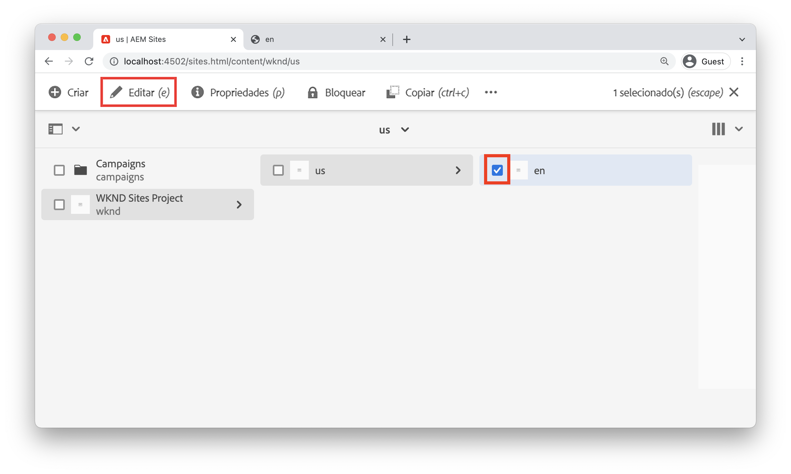
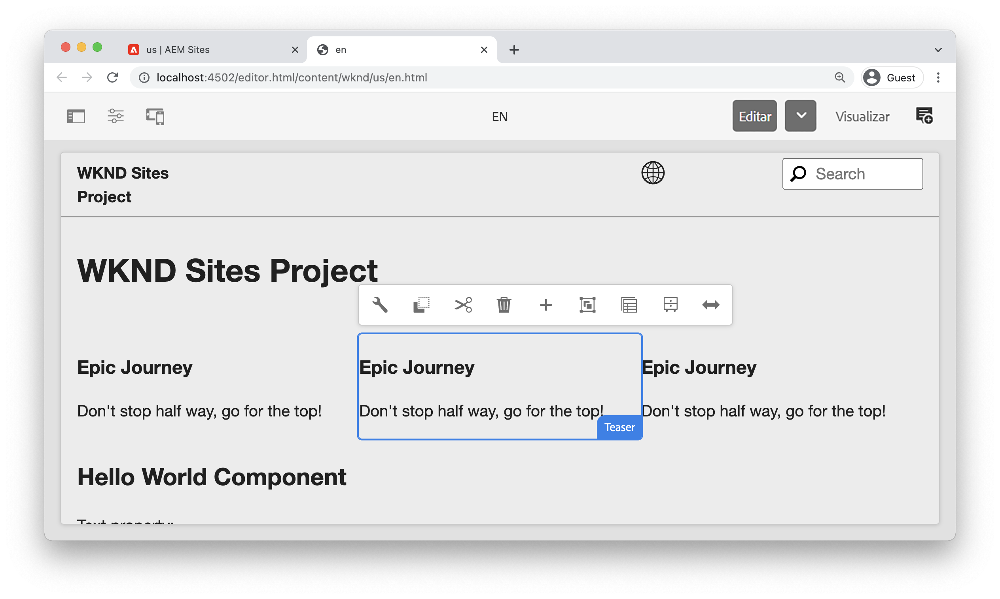
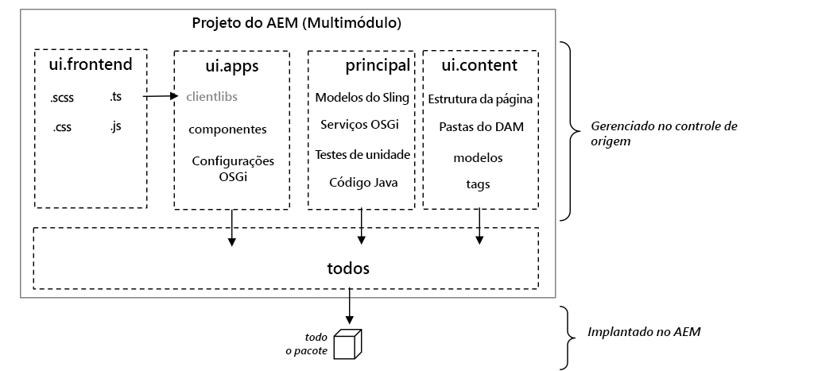
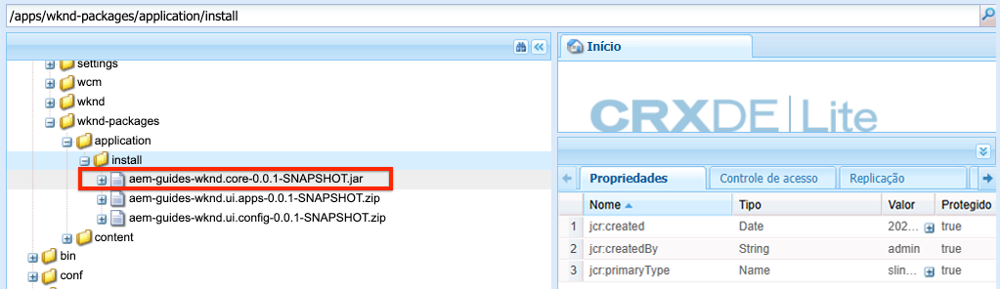
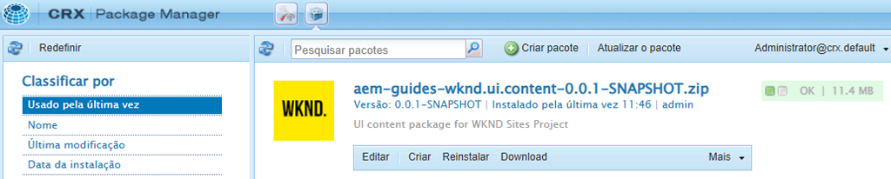

# Configuração do projeto {#project-setup}

Este tutorial aborda a criação de um Projeto Maven Multi Module para gerenciar o código e as configurações de um site Adobe Experience Manager.

## Pré-requisitos {#prerequisites}

Revise as ferramentas necessárias e as instruções para configurar um [ambiente de desenvolvimento local](./overview.md#local-dev-environment). Verifique se você tem uma nova instância do Adobe Experience Manager disponível localmente e se nenhum pacote de amostra/demonstração adicional foi instalado (diferente dos Service Packs necessários).

## Objetivo {#objective}

1. Saiba como gerar um novo projeto de AEM usando um arquétipo Maven.
1. Entenda os diferentes módulos gerados pelo AEM Project Archetype e como eles trabalham juntos.
1. Entenda como os Componentes principais AEM estão incluídos em um projeto AEM.

## O que você vai criar {#what-build}

>[!VIDEO](https://video.tv.adobe.com/v/30152/?quality=12&learn=on)

Neste capítulo, você gerará um novo projeto do Adobe Experience Manager usando o [Arquétipo de projeto AEM](https://github.com/adobe/aem-project-archetype). Seu projeto de AEM contém todos os códigos, conteúdos e configurações usados para uma implementação do Sites. O projeto gerado neste capítulo servirá de base para uma implementação do Site da WKND e será baseado em futuros capítulos.

**O que é um projeto do Maven?** - [Apache Maven](https://maven.apache.org/) O é uma ferramenta de gerenciamento de software para criar projetos. *Todos os Adobe Experience Manager* As implementações do usam os projetos do Maven para criar, gerenciar e implantar código personalizado no AEM.

**O que é um arquétipo Maven?** - A [Arquétipo de Maven](https://maven.apache.org/archetype/index.html) é um modelo ou padrão para gerar novos projetos. O arquétipo AEM Projeto nos permite gerar um novo projeto com um namespace personalizado e incluir uma estrutura de projeto que segue as práticas recomendadas, acelerando muito nosso projeto.

## Criar o projeto {#create}

Há algumas opções para criar um projeto Maven Multi-module para AEM. Este tutorial aproveitará o [Arquétipo de projeto AEM Maven **35º**](https://github.com/adobe/aem-project-archetype). Cloud Manager também [fornece um assistente de interface do usuário](https://experienceleague.adobe.com/docs/experience-manager-cloud-manager/using/getting-started/create-application-project/using-the-wizard.html) para iniciar a criação de um projeto de aplicativo AEM. O projeto subjacente gerado pela interface do usuário do Cloud Manager resulta na mesma estrutura que o uso direto do arquétipo.

>[!NOTE]
>
>Este tutorial usa a versão **35º** do arquétipo. É sempre uma prática recomendada usar a variável **mais recente** versão do arquétipo para gerar um novo projeto.

A próxima série de etapas ocorrerá usando um terminal de linha de comando baseado em UNIX, mas deve ser semelhante se estiver usando um terminal do Windows.

1. Abra um terminal de linha de comando. Verifique se o Maven está instalado:

   ```shell
   $ mvn --version
   Apache Maven 3.6.2
   Maven home: /Library/apache-maven-3.6.2
   Java version: 11.0.4, vendor: Oracle Corporation, runtime: /Library/Java/JavaVirtualMachines/jdk-11.0.4.jdk/Contents/Home
   ```

1. Navegue até o diretório em que deseja gerar o projeto de AEM. Pode ser qualquer diretório no qual você deseja manter o código-fonte do seu projeto. Por exemplo, um diretório chamado `code` abaixo do diretório inicial do usuário:

   ```shell
   $ cd ~/code
   ```

1. Cole o seguinte na linha de comando para [gerar o projeto no modo de lote](https://maven.apache.org/archetype/maven-archetype-plugin/examples/generate-batch.html):

   ```shell
   mvn -B org.apache.maven.plugins:maven-archetype-plugin:3.2.1:generate \
       -D archetypeGroupId=com.adobe.aem \
       -D archetypeArtifactId=aem-project-archetype \
       -D archetypeVersion=35 \
       -D appTitle="WKND Sites Project" \
       -D appId="wknd" \
       -D groupId="com.adobe.aem.guides" \
       -D artifactId="aem-guides-wknd" \
       -D package="com.adobe.aem.guides.wknd" \
       -D version="0.0.1-SNAPSHOT" \
       -D aemVersion="cloud"
   ```

   >[!NOTE]
   >
   > Se o direcionamento AEM 6.5.10+, substitua `aemVersion="cloud"` com `aemVersion="6.5.10"`.

   Uma lista completa das propriedades disponíveis para configurar um projeto [pode ser encontrada aqui](https://github.com/adobe/aem-project-archetype#available-properties).

1. A seguinte estrutura de pastas e arquivos será gerada pelo arquétipo Maven em seu sistema de arquivos local:

   ```plain
    ~/code/
       |--- aem-guides-wknd/
           |--- all/
           |--- core/
           |--- ui.apps/
           |--- ui.apps.structure/
           |--- ui.config/
           |--- ui.content/
           |--- ui.frontend/
           |--- ui.tests /
           |--- it.tests/
           |--- dispatcher/
           |--- analyse/
           |--- pom.xml
           |--- README.md
           |--- .gitignore
   ```

## Implantar e criar o projeto {#build}

Crie e implante o código do projeto em uma instância local do AEM.

1. Certifique-se de ter uma instância do autor de AEM em execução localmente na porta **4502**.
1. Na linha de comando, navegue até o `aem-guides-wknd` diretório do projeto.

   ```shell
   $ cd aem-guides-wknd
   ```

1. Execute o seguinte comando para criar e implantar o projeto inteiro no AEM:

   ```shell
   $ mvn clean install -PautoInstallSinglePackage
   ```

   A build levará cerca de um minuto e deverá terminar com a seguinte mensagem:

   ```
   ...
   [INFO] ------------------------------------------------------------------------
   [INFO] Reactor Summary for aem-guides-wknd 0.0.1-SNAPSHOT:
   [INFO]
   [INFO] aem-guides-wknd .................................... SUCCESS [  0.269 s]
   [INFO] WKND Sites Project - Core .......................... SUCCESS [  8.047 s]
   [INFO] WKND Sites Project - UI Frontend ................... SUCCESS [01:02 min]
   [INFO] WKND Sites Project - Repository Structure Package .. SUCCESS [  1.985 s]
   [INFO] WKND Sites Project - UI apps ....................... SUCCESS [  8.037 s]
   [INFO] WKND Sites Project - UI content .................... SUCCESS [  4.672 s]
   [INFO] WKND Sites Project - UI config ..................... SUCCESS [  0.313 s]
   [INFO] WKND Sites Project - All ........................... SUCCESS [  0.270 s]
   [INFO] WKND Sites Project - Integration Tests ............. SUCCESS [ 15.571 s]
   [INFO] WKND Sites Project - Dispatcher .................... SUCCESS [  0.232 s]
   [INFO] WKND Sites Project - UI Tests ...................... SUCCESS [  0.728 s]
   [INFO] WKND Sites Project - Project Analyser .............. SUCCESS [ 33.398 s]
   [INFO] ------------------------------------------------------------------------
   [INFO] BUILD SUCCESS
   [INFO] ------------------------------------------------------------------------
   [INFO] Total time:  02:18 min
   [INFO] Finished at: 2021-01-31T12:33:56-08:00
   [INFO] ------------------------------------------------------------------------
   ```

   O perfil Maven `autoInstallSinglePackage` compila os módulos individuais do projeto e implanta um único pacote na instância do AEM. Por padrão, esse pacote será implantado em uma instância AEM executada localmente na porta **4502** e com as credenciais de `admin:admin`.

1. Navegue até o Gerenciador de pacotes na sua instância de AEM local: [http://localhost:4502/crx/packmgr/index.jsp](http://localhost:4502/crx/packmgr/index.jsp). Você deve ver pacotes para `aem-guides-wknd.ui.apps`, `aem-guides-wknd.ui.config`, `aem-guides-wknd.ui.content`e `aem-guides-wknd.all`.

1. Navegue até o console Sites : [http://localhost:4502/sites.html/content](http://localhost:4502/sites.html/content). O site WKND será um dos sites. Ele incluirá uma estrutura de site com uma hierarquia de Mestrados em idiomas e EUA. Essa hierarquia de site se baseia nos valores de `language_country` e `isSingleCountryWebsite` ao gerar o projeto usando o arquétipo.

1. Abra o **US** `>` **Inglês** selecionando a página e clicando no link **Editar** na barra de menus:

   

1. O conteúdo inicial já foi criado e vários componentes estão disponíveis para serem adicionados a uma página. Experimente esses componentes para ter uma ideia da funcionalidade. Você aprenderá as noções básicas de um componente no próximo capítulo.

   

   *Amostra de conteúdo gerada pelo Arquétipo*

## Inspect o projeto {#project-structure}

O projeto de AEM gerado é composto de módulos Maven individuais, cada um com uma função diferente. Este tutorial e a maioria do desenvolvimento se concentram nesses módulos:

* [núcleo](https://experienceleague.adobe.com/docs/experience-manager-core-components/using/developing/archetype/core.html) - Código Java, principalmente desenvolvedores de back-end.
* [ui.frontend](https://experienceleague.adobe.com/docs/experience-manager-core-components/using/developing/archetype/uifrontend.html) - Contém o código-fonte para CSS, JavaScript, Sass, Type Script, principalmente para desenvolvedores front-end.
* [ui.apps](https://experienceleague.adobe.com/docs/experience-manager-core-components/using/developing/archetype/uiapps.html) - Contém definições de componente e diálogo, incorpora CSS compilado e JavaScript como bibliotecas de clientes.
* [ui.content](https://experienceleague.adobe.com/docs/experience-manager-core-components/using/developing/archetype/uicontent.html) - contém conteúdo estrutural e configurações, como modelos editáveis, esquemas de metadados (/content, /conf).

* **all** - este é um módulo Maven vazio que combina os módulos acima em um único pacote que pode ser implantado em um ambiente AEM.



Consulte a [Documentação do AEM Project Archetype](https://experienceleague.adobe.com/docs/experience-manager-core-components/using/developing/archetype/overview.html) para saber mais detalhes sobre **all** os módulos Maven.

### Inclusão dos componentes principais {#core-components}

[Componentes principais do AEM](https://experienceleague.adobe.com/docs/experience-manager-core-components/using/introduction.html?lang=pt-BR) são um conjunto de componentes padronizados do Web Content Management (WCM) para AEM. Esses componentes fornecem um conjunto básico de uma funcionalidade e são projetados para serem estilizados, personalizados e estendidos para projetos individuais.

AEM ambientes as a Cloud Service incluem a versão mais recente de [Componentes principais do AEM](https://experienceleague.adobe.com/docs/experience-manager-core-components/using/introduction.html). Portanto, os projetos gerados para AEM as a Cloud Service do **not** incluir uma incorporação dos Componentes principais AEM.

Para projetos gerados AEM 6.5/6.4, o arquétipo é incorporado automaticamente [Componentes principais do AEM](https://experienceleague.adobe.com/docs/experience-manager-core-components/using/introduction.html) no projeto. É uma prática recomendada para o AEM 6.5/6.4 incorporar AEM componentes principais para garantir que a versão mais recente seja implantada com seu projeto. Mais informações sobre como os Componentes principais são [incluído no projeto pode ser encontrado aqui](https://experienceleague.adobe.com/docs/experience-manager-core-components/using/developing/archetype/using.html#core-components).

## Gerenciamento de controle de origem {#source-control}

É sempre uma boa ideia usar alguma forma de controle de origem para gerenciar o código em seu aplicativo. Este tutorial usa git e GitHub. Há vários arquivos que são gerados pelo Maven e/ou pelo IDE de escolha que devem ser ignorados pelo SCM.

O Maven criará uma pasta de destino sempre que você criar e instalar o pacote de códigos. A pasta de destino e o conteúdo devem ser excluídos do SCM.

Beneath `ui.apps` observe que muitos `.content.xml` os arquivos são criados. Esses arquivos XML mapeiam os tipos de nó e as propriedades do conteúdo instalado no JCR. Esses arquivos são essenciais e devem **not** ser ignorado.

O arquétipo do projeto AEM gerará uma amostra `.gitignore` arquivo que pode ser usado como ponto de partida para o qual os arquivos podem ser ignorados com segurança. O arquivo é gerado em `<src>/aem-guides-wknd/.gitignore`.

## Parabéns! {#congratulations}

Parabéns, você acabou de criar seu primeiro Projeto AEM!

### Próximas etapas {#next-steps}

Entenda a tecnologia subjacente de um Componente de sites do Adobe Experience Manager (AEM) por meio de um `HelloWorld` exemplo com [Noções básicas sobre componentes](component-basics.md) tutorial.

## Comandos Maven avançados (Bônus) {#advanced-maven-commands}

Durante o desenvolvimento, você pode estar trabalhando com apenas um dos módulos e não quiser criar o projeto inteiro para economizar tempo. Você também pode implantar diretamente em uma instância do AEM Publish ou talvez em uma instância do AEM que não esteja em execução na porta 4502.

Em seguida, analisaremos alguns perfis e comandos Maven adicionais que podem ser usados para maior flexibilidade durante o desenvolvimento.

### Módulo principal {#core-module}

O **[núcleo](https://experienceleague.adobe.com/docs/experience-manager-core-components/using/developing/archetype/core.html)** contém todo o código Java associado ao projeto. Quando criado, ele implanta um pacote OSGi para AEM. Para criar apenas este módulo:

1. Navegue até o `core` pasta (debaixo de `aem-guides-wknd`):

   ```shell
   $ cd core/
   ```

1. Execute o seguinte comando:

   ```shell
   $ mvn clean install -PautoInstallBundle
   ...
   [INFO] --- sling-maven-plugin:2.4.0:install (install-bundle) @ aem-guides-wknd.core ---
   [INFO] Installing Bundle aem-guides-wknd.core(~/code/aem-guides-wknd/core/target/aem-guides-wknd.core-0.0.1-SNAPSHOT.jar) to http://localhost:4502/system/console via WebConsole
   [INFO] Bundle installed
   [INFO] ------------------------------------------------------------------------
   [INFO] BUILD SUCCESS
   [INFO] ------------------------------------------------------------------------
   [INFO] Total time:  8.558 s
   ```

1. Navegar para [http://localhost:4502/system/console/bundles](http://localhost:4502/system/console/bundles). Este é o console OSGi da Web e contém informações sobre todos os pacotes instalados na instância do AEM.

1. Ative o **Id** classificar e você deve ver o pacote WKND instalado e ativo.

   

1. Você pode ver o local &#39;físico&#39; do jar em [CRXDE-Lite](http://localhost:4502/crx/de/index.jsp#/apps/wknd-packages/application/install/aem-guides-wknd.core-1.0.0-SNAPSHOT.jar):

   

### Módulos de Ui.apps e Ui.content {#apps-content-module}

O **[ui.apps](https://experienceleague.adobe.com/docs/experience-manager-core-components/using/developing/archetype/uiapps.html)** O módulo maven contém todo o código de renderização necessário para o site abaixo `/apps`. Isso inclui CSS/JS que será armazenado em um formato do AEM chamado [clientlibs](https://experienceleague.adobe.com/docs/experience-manager-65/developing/introduction/clientlibs.html). Isso também inclui [HTL](https://experienceleague.adobe.com/docs/experience-manager-htl/using/overview.html?lang=pt-BR) scripts para renderização de HTML dinâmico. Você pode pensar no **ui.apps** como um mapa para a estrutura no JCR, mas em um formato que pode ser armazenado em um sistema de arquivos e comprometido com o controle de origem. O **ui.apps** O módulo contém somente código.

Para criar apenas este módulo:

1. Na linha de comando. Navegue até o `ui.apps` pasta (debaixo de `aem-guides-wknd`):

   ```shell
   $ cd ../ui.apps
   ```

1. Execute o seguinte comando:

   ```shell
   $ mvn clean install -PautoInstallPackage
   ...
   Package installed in 122ms.
   [INFO] ------------------------------------------------------------------------
   [INFO] BUILD SUCCESS
   [INFO] ------------------------------------------------------------------------
   [INFO] Total time:  6.972 s
   [INFO] Finished at: 2019-12-06T14:44:12-08:00
   [INFO] ------------------------------------------------------------------------
   ```

1. Navegar para [http://localhost:4502/crx/packmgr/index.jsp](http://localhost:4502/crx/packmgr/index.jsp). Você deve ver o `ui.apps` pacote como o primeiro pacote instalado e deve ter um carimbo de data e hora mais recente que qualquer outro pacote.

   

1. Retorne à linha de comando e execute o seguinte comando (na função `ui.apps` pasta):

   ```shell
   $ mvn -PautoInstallPackagePublish clean install
   ...
   [INFO] --- content-package-maven-plugin:1.0.2:install (install-package-publish) @ aem-guides-wknd.ui.apps ---
   [INFO] Installing aem-guides-wknd.ui.apps (/Users/dgordon/code/aem-guides-wknd/ui.apps/target/aem-guides-wknd.ui.apps-0.0.1-SNAPSHOT.zip) to http://localhost:4503/crx/packmgr/service.jsp
   [INFO] I/O exception (java.net.ConnectException) caught when processing request: Connection refused (Connection refused)
   [INFO] Retrying request
   [INFO] I/O exception (java.net.ConnectException) caught when processing request: Connection refused (Connection refused)
   [INFO] Retrying request
   [INFO] I/O exception (java.net.ConnectException) caught when processing request: Connection refused (Connection refused)
   [INFO] Retrying request
   [INFO] ------------------------------------------------------------------------
   [INFO] BUILD FAILURE
   [INFO] ------------------------------------------------------------------------
   [INFO] Total time:  6.717 s
   [INFO] Finished at: 2019-12-06T14:51:45-08:00
   [INFO] ------------------------------------------------------------------------
   ```

   O perfil `autoInstallPackagePublish` tem como objetivo implantar o pacote em um ambiente de publicação em execução na porta **4503**. O erro acima é esperado se uma instância AEM em execução em http://localhost:4503 não puder ser encontrada.

1. Por fim, execute o seguinte comando para implantar o `ui.apps` pacote na porta **4504**:

   ```shell
   $ mvn -PautoInstallPackage clean install -Daem.port=4504
   ...
   [INFO] --- content-package-maven-plugin:1.0.2:install (install-package) @ aem-guides-wknd.ui.apps ---
   [INFO] Installing aem-guides-wknd.ui.apps (/Users/dgordon/code/aem-guides-wknd/ui.apps/target/aem-guides-wknd.ui.apps-0.0.1-SNAPSHOT.zip) to http://localhost:4504/crx/packmgr/service.jsp
   [INFO] I/O exception (java.net.ConnectException) caught when processing request: Connection refused (Connection refused)
   [INFO] Retrying request
   [INFO] I/O exception (java.net.ConnectException) caught when processing request: Connection refused (Connection refused)
   [INFO] Retrying request
   [INFO] I/O exception (java.net.ConnectException) caught when processing request: Connection refused (Connection refused)
   [INFO] Retrying request
   [INFO] ------------------------------------------------------------------------
   [INFO] BUILD FAILURE
   [INFO] --------------------------------------------------------------------
   ```

   Novamente, uma falha de build ocorrerá se nenhuma instância de AEM estiver em execução na porta **4504** está disponível. O parâmetro `aem.port` é definido no arquivo POM em `aem-guides-wknd/pom.xml`.

O **[ui.content](https://experienceleague.adobe.com/docs/experience-manager-core-components/using/developing/archetype/uicontent.html)** é estruturado da mesma forma que o módulo **ui.apps** módulo. A única diferença é que a variável **ui.content** O módulo contém o que é conhecido como **mutável** conteúdo. **Variável** conteúdo refere-se essencialmente a configurações que não são de código, como Modelos, Políticas ou estruturas de pastas armazenadas no controle de origem **but** pode ser modificado diretamente em uma instância do AEM. Isso será explorado com muito mais detalhes no capítulo sobre Páginas e Modelos.

Os mesmos comandos Maven usados para criar o **ui.apps** pode ser usado para criar o **ui.content** módulo. Sinta-se à vontade para repetir as etapas acima a partir do **ui.content** pasta.

## Resolução de problemas

Se tiver problemas para gerar o projeto usando o Arquétipo de projeto AEM, consulte a lista de [problemas conhecidos](https://github.com/adobe/aem-project-archetype#known-issues) e lista de aberturas [problemas](https://github.com/adobe/aem-project-archetype/issues).
