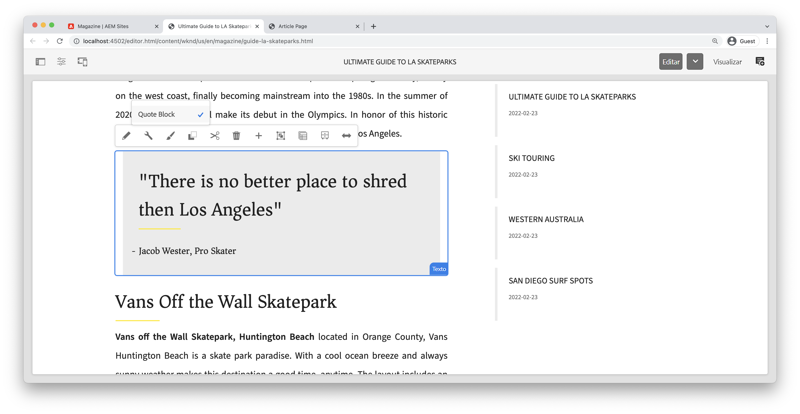

# Desenvolvimento com o sistema de estilo {#developing-with-the-style-system}

Saiba como implementar estilos individuais e usar os Componentes principais usando o Sistema de estilo Experience Manager. Este tutorial aborda o desenvolvimento do Sistema de estilos para estender os Componentes principais com CSS específico da marca e configurações avançadas de política do Editor de modelos.

## Pré-requisitos {#prerequisites}

Revise as ferramentas necessárias e as instruções para configurar um [ambiente de desenvolvimento local](overview.md#local-dev-environment).

Também é recomendável revisar a [Bibliotecas do lado do cliente e fluxo de trabalho front-end](client-side-libraries.md) tutorial para entender os fundamentos das bibliotecas do lado do cliente e as várias ferramentas de front-end integradas ao projeto do AEM.

### Projeto inicial

>[!NOTE]
>
> Se você concluiu o capítulo anterior com êxito, é possível reutilizar o projeto e ignorar as etapas para verificar o projeto inicial.

Confira o código base que o tutorial constrói em:

1. Confira o `tutorial/style-system-start` ramificação de [GitHub](https://github.com/adobe/aem-guides-wknd)

   ```shell
   $ cd aem-guides-wknd
   $ git checkout tutorial/style-system-start
   ```

1. Implante a base de código em uma instância de AEM local usando suas habilidades Maven:

   ```shell
   $ mvn clean install -PautoInstallSinglePackage
   ```

   >[!NOTE]
   >
   > Se estiver usando AEM 6.5 ou 6.4, anexe a `classic` para qualquer comando Maven.

   ```shell
   $ mvn clean install -PautoInstallSinglePackage -Pclassic
   ```

Você sempre pode exibir o código concluído em [GitHub](https://github.com/adobe/aem-guides-wknd/tree/tutorial/style-system-solution) ou verifique o código localmente, alternando para a ramificação `tutorial/style-system-solution`.

## Objetivo

1. Entenda como usar o Sistema de estilos para aplicar CSS específico da marca aos Componentes principais AEM.
1. Saiba mais sobre a notação BEM e como ela pode ser usada para escopo cuidadoso de estilos.
1. Aplicar configurações de política avançadas com Modelos editáveis.

## O que você vai criar {#what-you-will-build}

Neste capítulo, usaremos o [Recurso Sistema de estilos](https://experienceleague.adobe.com/docs/experience-manager-learn/sites/page-authoring/style-system-feature-video-use.html) para criar variações do **Título** e **Texto** componentes usados na página Artigo .


*Estilo sublinhado disponível para uso para o Componente de título*

## Segundo plano {#background}

O [Sistema de estilos](https://experienceleague.adobe.com/docs/experience-manager-65/authoring/siteandpage/style-system.html) permite que desenvolvedores e editores de modelo criem várias variações visuais de um componente. Os autores, por sua vez, podem decidir qual estilo usar ao compor uma página. Aproveitaremos o Sistema de estilos no restante do tutorial para atingir vários estilos únicos, além de aproveitar os Componentes principais em uma abordagem de código baixo.

A ideia geral com o Sistema de estilos é que os autores possam escolher vários estilos de como um componente deve ser exibido. Os &quot;estilos&quot; são respaldados por classes CSS adicionais que são injetadas na div externa de um componente. Nas bibliotecas de clientes, as regras de CSS são adicionadas com base nessas classes de estilo para que o componente mude de aparência.

Você pode encontrar [documentação detalhada do Style System aqui](https://experienceleague.adobe.com/docs/experience-manager-cloud-service/sites/authoring/features/style-system.html?lang=pt-BR). Há também um grande [vídeo técnico para entender o sistema de estilos](https://experienceleague.adobe.com/docs/experience-manager-learn/sites/developing/style-system-technical-video-understand.html).

## Estilo sublinhado - Título {#underline-style}

O [Componente de título](https://experienceleague.adobe.com/docs/experience-manager-core-components/using/components/title.html) foi anexada ao projeto em `/apps/wknd/components/title` como parte da **ui.apps** módulo. Os estilos padrão dos elementos Cabeçalho (`H1`, `H2`, `H3`...) já tiverem sido implementadas na **ui.frontend** módulo.

O [Designs de artigo WKND](assets/pages-templates/wknd-article-design.xd) contém um estilo exclusivo para o componente de Título com um sublinhado. Em vez de criar dois componentes ou modificar a caixa de diálogo do componente, o Sistema de estilos pode ser usado para permitir que os autores tenham a opção de adicionar um estilo sublinhado.


### Adicionar uma política de título

Adicione uma nova política para os componentes de Título para permitir que os autores de conteúdo escolham o estilo Sublinhado a ser aplicado a componentes específicos. Isso é feito usando o Editor de modelo no AEM.

1. Navegue até o **Página do artigo** modelo localizado em: [http://localhost:4502/editor.html/conf/wknd/settings/wcm/templates/article-page/structure.html](http://localhost:4502/editor.html/conf/wknd/settings/wcm/templates/article-page/structure.html)

1. Em **Estrutura** no modo principal **Contêiner de layout**, selecione o **Política** ícone ao lado do **Título** componente listado em *Componentes permitidos*:

   

1. Crie uma nova política para o componente de Título com os seguintes valores:

   *Título da política **: **Título da WKND**

   *Propriedades* > *Guia Estilos* > *Adicionar um novo estilo*

   **Sublinhado** : `cmp-title--underline`

   

   Clique em **Concluído** para salvar as alterações na política de Título.

   >[!NOTE]
   >
   > O valor `cmp-title--underline` preenche a classe CSS no div externo da marcação HTML do componente.

### Aplicar o estilo sublinhado

Como um autor, aplique o estilo sublinhado a determinados Componentes de título.

1. Navegue até o **La Skateparks** artigo no editor do AEM Sites em: [http://localhost:4502/editor.html/content/wknd/us/en/magazine/guide-la-skateparks.html](http://localhost:4502/editor.html/content/wknd/us/en/magazine/guide-la-skateparks.html)
1. Em **Editar** , escolha um componente de Título . Clique no botão **pincel** e selecione o **Sublinhado** estilo:

   

   >[!NOTE]
   >
   > Nesse ponto, nenhuma alteração visível ocorrerá, pois a variável `underline` O estilo não foi implementado. No próximo exercício, esse estilo é implementado.

1. Clique no botão **Informações da página** ícone > **Exibir como publicado** para inspecionar a página fora do editor de AEM.
1. Use as ferramentas do desenvolvedor do navegador para verificar se a marcação em torno do componente de Título tem a classe CSS `cmp-title--underline` aplicado ao div externo.

   

   ```html
   <div class="title cmp-title--underline">
       <div data-cmp-data-layer="{&quot;title-b6450e9cab&quot;:{&quot;@type&quot;:&quot;wknd/components/title&quot;,&quot;repo:modifyDate&quot;:&quot;2022-02-23T17:34:42Z&quot;,&quot;dc:title&quot;:&quot;Vans Off the Wall Skatepark&quot;}}" 
       id="title-b6450e9cab" class="cmp-title">
           <h2 class="cmp-title__text">Vans Off the Wall Skatepark</h2>
       </div>
   </div>
   ```

### Implementar o estilo sublinhado - ui.frontend

Em seguida, implemente o estilo Sublinhado usando o **ui.frontend** módulo do nosso projeto. Usaremos o servidor de desenvolvimento de webpack fornecido com o **ui.frontend** para visualizar os estilos *before* implantação em uma instância local do AEM.

1. Inicie o `watch` do **ui.frontend** módulo:

   ```shell
   $ cd ~/code/aem-guides-wknd/ui.frontend/
   $ npm run watch
   ```

   Isso iniciará um processo que monitora as alterações no `ui.frontend` e sincronize as alterações na instância de AEM.


1. Retorne o IDE e abra o arquivo `_title.scss` localizada em: `ui.frontend/src/main/webpack/components/_title.scss`.
1. Introduza uma nova regra direcionada para a variável `cmp-title--underline` classe:

   ```scss
   /* Default Title Styles */
   .cmp-title {}
   .cmp-title__text {}
   .cmp-title__link {}
   
   /* Add Title Underline Style */
   .cmp-title--underline {
       .cmp-title__text {
           &:after {
           display: block;
               width: 84px;
               padding-top: 8px;
               content: '';
               border-bottom: 2px solid $brand-primary;
           }
       }
   }
   ```

   >[!NOTE]
   >
   >É considerada uma prática recomendada usar sempre estilos de escopo restritos para o componente de destino. Isso garante que estilos extras não afetem outras áreas da página.
   >
   >Todos os componentes principais seguem até **[Notação BEM](https://github.com/adobe/aem-core-wcm-components/wiki/css-coding-conventions)**. É uma prática recomendada direcionar a classe CSS externa ao criar um estilo padrão para um componente. Outra prática recomendada é direcionar nomes de classe especificados pela notação BEM do Componente principal em vez de elementos HTML.

1. Retorne ao navegador e à página de AEM. Você deve ver o estilo Sublinhado adicionado:

   

1. No editor de AEM, agora é possível ativar e desativar o **Sublinhado** e ver as alterações visualmente.

## Estilo do bloco de aspas - Texto {#text-component}

Em seguida, repita etapas semelhantes para aplicar um estilo exclusivo ao [Componente de texto](https://experienceleague.adobe.com/docs/experience-manager-core-components/using/components/text.html). O componente de Texto foi enviado por proxy para o projeto em `/apps/wknd/components/text` como parte da **ui.apps** módulo. Os estilos padrão dos elementos de parágrafo já foram implementados na variável **ui.frontend**.

O [Designs de artigo WKND](assets/pages-templates/wknd-article-design.xd) contém um estilo exclusivo para o componente de Texto com um bloco de aspas:


### Adicionar uma política de texto

Em seguida, adicione uma nova política para os componentes de Texto.

1. Navegue até o **Modelo da página do artigo** localizada em: [http://localhost:4502/editor.html/conf/wknd/settings/wcm/templates/article-page/structure.html](http://localhost:4502/editor.html/conf/wknd/settings/wcm/templates/article-page/structure.html).

1. Em **Estrutura** no modo principal **Contêiner de layout**, selecione o **Política** ícone ao lado do **Texto** componente listado em *Componentes permitidos*:

   

1. Atualize a política do componente de Texto com os seguintes valores:

   *Título da política **: **Texto do conteúdo**

   *Plug-ins* > *Estilos de parágrafo* > *Ativar estilos de parágrafo*

   *Guia Estilos* > *Adicionar um novo estilo*

   **Bloco de Cotação** : `cmp-text--quote`

   

   

   Clique em **Concluído** para salvar as alterações na política de texto.

### Aplicar o estilo do bloco de aspas

1. Navegue até o **La Skateparks** artigo no editor do AEM Sites em: [http://localhost:4502/editor.html/content/wknd/us/en/magazine/guide-la-skateparks.html](http://localhost:4502/editor.html/content/wknd/us/en/magazine/guide-la-skateparks.html)
1. Em **Editar** , escolha um componente de Texto . Edite o componente para incluir um elemento de aspas:

   

1. Selecione o componente de texto e clique no botão **pincel** e selecione o **Bloco de Cotação** estilo:

   

1. Use as ferramentas de desenvolvedor do navegador para inspecionar a marcação. Você deve ver o nome da classe `cmp-text--quote` foi adicionado ao div externo do componente:

   ```html
   <!-- Quote Block style class added -->
   <div class="text cmp-text--quote">
       <div data-cmp-data-layer="{&quot;text-60910f4b8d&quot;:{&quot;@type&quot;:&quot;wknd/components/text&quot;,&quot;repo:modifyDate&quot;:&quot;2022-02-24T00:55:26Z&quot;,&quot;xdm:text&quot;:&quot;<blockquote>&amp;nbsp; &amp;nbsp; &amp;nbsp;&amp;quot;There is no better place to shred then Los Angeles&amp;quot;</blockquote>\r\n<p>- Jacob Wester, Pro Skater</p>\r\n&quot;}}" id="text-60910f4b8d" class="cmp-text">
           <blockquote>&nbsp; &nbsp; &nbsp;"There is no better place to shred then Los Angeles"</blockquote>
           <p>- Jacob Wester, Pro Skater</p>
       </div>
   </div>
   ```

### Implementar o estilo do bloco de aspas - ui.frontend

Em seguida, implementaremos o estilo Bloco de Cotação usando o **ui.frontend** módulo do nosso projeto.

1. Se ainda não estiver em execução, inicie o `watch` do **ui.frontend** módulo:

   ```shell
   $ npm run watch
   ```

1. Atualizar o arquivo `text.scss` localizada em: `ui.frontend/src/main/webpack/components/_text.scss`:

   ```css
   /* Default text style */
   .cmp-text {}
   .cmp-text__paragraph {}
   
   /* WKND Text Quote style */
   .cmp-text--quote {
       .cmp-text {
           background-color: $brand-third;
           margin: 1em 0em;
           padding: 1em;
   
           blockquote {
               border: none;
               font-size: $font-size-large;
               font-family: $font-family-serif;
               padding: 14px 14px;
               margin: 0;
               margin-bottom: 0.5em;
   
               &:after {
                   border-bottom: 2px solid $brand-primary; /*yellow border */
                   content: '';
                   display: block;
                   position: relative;
                   top: 0.25em;
                   width: 80px;
               }
           }
           p {
               font-family:  $font-family-serif;
           }
       }
   }
   ```

   >[!CAUTION]
   >
   > Nesse caso, os elementos de HTML brutos são direcionados pelos estilos. Isso ocorre porque o componente de Texto fornece um Editor de Rich Text para os autores de conteúdo. A criação de estilos diretamente no conteúdo do RTE deve ser feita com cuidado e é ainda mais importante criar um escopo restrito dos estilos.

1. Retorne ao navegador mais uma vez e você deve ver o estilo de bloco Cotação adicionado:

   

1. Pare o servidor de desenvolvimento de webpack.

## Largura fixa - Contêiner (Bônus) {#layout-container}

Os componentes do contêiner foram usados para criar a estrutura básica do Modelo de página de artigo e fornecer as zonas de soltar para os autores de conteúdo adicionarem conteúdo em uma página. Os contêineres também podem aproveitar o Sistema de estilos, fornecendo aos autores de conteúdo ainda mais opções para projetar layouts.

O **Contêiner principal** do modelo de Página do artigo contém os dois contêineres que podem ser criados pelo autor e tem uma largura fixa.


*Contêiner principal no modelo da página de artigo*.

A política da **Contêiner principal** define o elemento padrão como `main`:


O CSS que faz a variável **Contêiner principal** fixa é definido no **ui.frontend** módulo em `ui.frontend/src/main/webpack/site/styles/container_main.scss` :

```SCSS
main.container {
    padding: .5em 1em;
    max-width: $max-content-width;
    float: unset!important;
    margin: 0 auto!important;
    clear: both!important;
}
```

Em vez de direcionar o `main` HTML, o Sistema de estilos pode ser usado para criar um elemento **Largura fixa** como parte da política Contêiner. O sistema de estilos poderia oferecer aos usuários a opção de alternar entre **Largura fixa** e **Largura do fluido** contêineres.

1. **Desafio extra** - utilizar os ensinamentos retirados dos exercícios anteriores e utilizar o Sistema de Estilos para implementar uma **Largura fixa** e **Largura do fluido** estilos para o componente Contêiner .

## Parabéns! {#congratulations}

Parabéns, a Página do artigo é quase completamente estilizada e você ganhou uma experiência prática usando o Sistema de estilos de AEM.

### Próximas etapas {#next-steps}

Saiba mais sobre as etapas completas para criar um [componente de AEM personalizado](custom-component.md) que exibe o conteúdo criado em uma caixa de diálogo e explora o desenvolvimento de um Modelo do Sling para encapsular a lógica de negócios que preenche o HTL do componente.

Exibir o código concluído em [GitHub](https://github.com/adobe/aem-guides-wknd) ou revise e implante o código localmente na chave Git `tutorial/style-system-solution`.

1. Clonar o [github.com/adobe/aem-wknd-guides](https://github.com/adobe/aem-guides-wknd) repositório.
1. Confira o `tutorial/style-system-solution` ramificação.
