# Desenvolvimento com o sistema de estilo {#developing-with-the-style-system}

Saiba como implementar estilos individuais e usar os Componentes principais usando o Sistema de estilo Experience Manager. Este tutorial aborda o desenvolvimento do Sistema de estilos para estender os Componentes principais com CSS específico da marca e configurações avançadas de política do Editor de modelos.

## Pré-requisitos {#prerequisites}

Revise as ferramentas e instruções necessárias para configurar um [ambiente de desenvolvimento local](overview.md#local-dev-environment).

Também é recomendável revisar o tutorial [Client-side Library and Front-end Workflow](client-side-libraries.md) para entender os fundamentos das bibliotecas do lado do cliente e as várias ferramentas de front-end incorporadas ao projeto do AEM.

### Projeto inicial

>[!NOTE]
>
> Se você concluiu o capítulo anterior com êxito, é possível reutilizar o projeto e ignorar as etapas para verificar o projeto inicial.

Confira o código base que o tutorial constrói em:

1. Confira a ramificação `tutorial/style-system-start` de [GitHub](https://github.com/adobe/aem-guides-wknd)

   ```shell
   $ cd aem-guides-wknd
   $ git checkout tutorial/style-system-start
   ```

1. Implante a base de código em uma instância de AEM local usando suas habilidades Maven:

   ```shell
   $ mvn clean install -PautoInstallSinglePackage
   ```

   >[!NOTE]
   >
   > Se estiver usando AEM 6.5 ou 6.4, anexe o perfil `classic` a qualquer comando Maven.

   ```shell
   $ mvn clean install -PautoInstallSinglePackage -Pclassic
   ```

Você sempre pode visualizar o código concluído em [GitHub](https://github.com/adobe/aem-guides-wknd/tree/tutorial/style-system-solution) ou verificar o código localmente ao alternar para a ramificação `tutorial/style-system-solution`.

## Objetivo

1. Entenda como usar o Sistema de estilos para aplicar CSS específico da marca aos Componentes principais AEM.
1. Saiba mais sobre a notação BEM e como ela pode ser usada para escopo cuidadoso de estilos.
1. Aplicar configurações de política avançadas com Modelos editáveis.

## O que você vai criar {#what-you-will-build}

Neste capítulo, usaremos o recurso [Sistema de estilos](https://docs.adobe.com/content/help/en/experience-manager-learn/sites/page-authoring/style-system-feature-video-use.html) para criar variações dos componentes **Title** e **Text** usados na página Artigo.

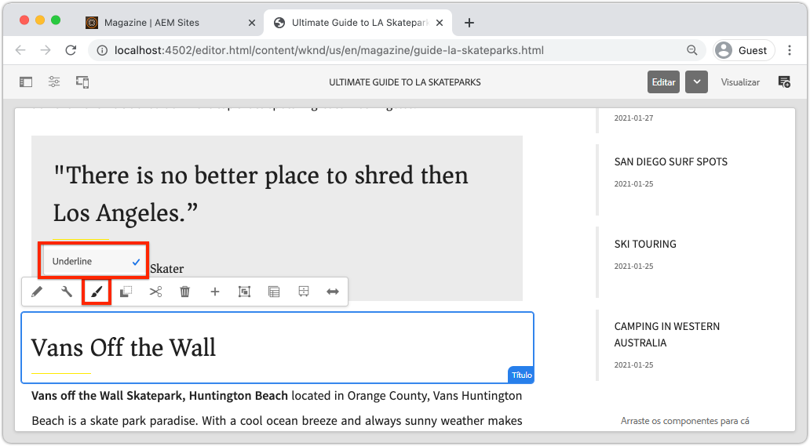

*Estilo sublinhado disponível para uso para o Componente de título*

## Segundo plano {#background}

O [Style System](https://docs.adobe.com/content/help/pt-BR/experience-manager-65/developing/components/style-system.translate.html) permite que desenvolvedores e editores de modelo criem várias variações visuais de um componente. Os autores, por sua vez, podem decidir qual estilo usar ao compor uma página. Aproveitaremos o Sistema de estilos no restante do tutorial para atingir vários estilos únicos, além de aproveitar os Componentes principais em uma abordagem de código baixo.

A ideia geral com o Sistema de estilos é que os autores possam escolher vários estilos de como um componente deve ser exibido. Os &quot;estilos&quot; são respaldados por classes CSS adicionais que são injetadas na div externa de um componente. Nas bibliotecas de clientes, as regras de CSS são adicionadas com base nessas classes de estilo para que o componente mude de aparência.

Você pode encontrar [documentação detalhada do Sistema de estilos aqui](https://experienceleague.adobe.com/docs/experience-manager-cloud-service/sites/authoring/features/style-system.html). Também há um excelente [vídeo técnico para entender o Sistema de estilos](https://experienceleague.adobe.com/docs/experience-manager-learn/sites/developing/style-system-technical-video-understand.html).

## Estilo sublinhado - Título {#underline-style}

O [Componente de título](https://experienceleague.adobe.com/docs/experience-manager-core-components/using/components/title.html) foi enviado por proxy para o projeto em `/apps/wknd/components/title` como parte do módulo **ui.apps**. Os estilos padrão dos elementos Cabeçalho (`H1`, `H2`, `H3`...) já foram implementados no módulo **ui.frontend**.

Os [Designs de Artigo WKND](assets/pages-templates/wknd-article-design.xd) contêm um estilo exclusivo para o componente de Título com um sublinhado. Em vez de criar dois componentes ou modificar a caixa de diálogo do componente, o Sistema de estilos pode ser usado para permitir que os autores tenham a opção de adicionar um estilo sublinhado.


### Marcação do título do Inspect

Como desenvolvedor de front-end, a primeira etapa para criar estilo em um Componente principal é entender a marcação gerada pelo componente.

1. Abra um novo navegador e visualize o componente Título no site AEM Biblioteca de componentes principais: [https://www.aemcomponents.dev/content/core-components-examples/library/page-authoring/title.html](https://www.aemcomponents.dev/content/core-components-examples/library/page-authoring/title.html)

1. Abaixo está a marcação do componente de Título:

   ```html
   <div class="cmp-title">
       <h1 class="cmp-title__text">Lorem Ipsum</h1>
   </div>
   ```

   A notação BEM do componente Título:

   ```plain
   BLOCK cmp-title
       ELEMENT cmp-title__text
   ```

1. O sistema Style adiciona uma classe CSS ao div externo ao redor do componente. Portanto, a marcação que será direcionada será semelhante ao seguinte:

   ```html
   <div class="STYLE-SYSTEM-CLASS-HERE"> <!-- Custom CSS class - implementation gets to define this -->
       <div class="cmp-title">
           <h1 class="cmp-title__text">Lorem Ipsum</h1>
       </div>
   </div>
   ```

### Implementar o estilo sublinhado - ui.frontend

Em seguida, implemente o estilo Sublinhado usando o módulo **ui.frontend** do nosso projeto. Usaremos o servidor de desenvolvimento do webpack que é fornecido com o módulo **ui.frontend** para visualizar os estilos *antes de* implantar em uma instância local de AEM.

1. Inicie o servidor de desenvolvimento do webpack executando o seguinte comando no módulo **ui.frontend**:

   ```shell
   $ cd ~/code/aem-guides-wknd/ui.frontend/
   $ npm start
   
   > aem-maven-archetype@1.0.0 start code/aem-guides-wknd/ui.frontend
   > webpack-dev-server --open --config ./webpack.dev.js
   ```

   Isso deve abrir um navegador em [http://localhost:8080](http://localhost:8080).

   >[!NOTE]
   >
   > Se as imagens aparecerem quebradas, verifique se o projeto inicial foi implantado em uma instância local de AEM (em execução na porta 4502) e se o navegador usado também fez logon na instância de AEM local.

   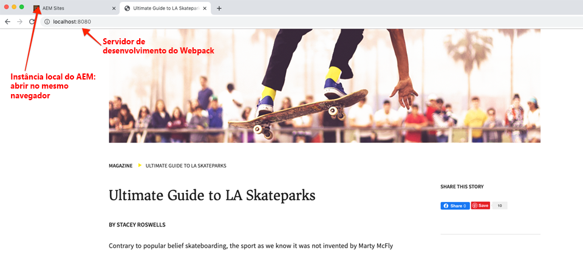

1. No IDE, abra o arquivo `index.html` localizado em: `ui.frontend/src/main/webpack/static/index.html`. Esta é a marcação estática usada pelo servidor de desenvolvimento de webpack.
1. Em `index.html`, encontre uma instância do Componente de título para adicionar o estilo em sublinhado pesquisando no documento *cmp-title*. Escolha o componente Título com o texto *&quot;Vans off the Wall Skatepark&quot;* (linha 218). Adicione a classe `cmp-title--underline` ao div ao redor:

   ```diff
   - <div class="title aem-GridColumn--phone--12 aem-GridColumn aem-GridColumn--default--8">
   + <div class="cmp-title--underline title aem-GridColumn--phone--12 aem-GridColumn aem-GridColumn--default--8">
        <div data-cmp-data-layer="{&#34;title-8bea562fa0&#34;:{&#34;@type&#34;:&#34;wknd/components/title&#34;,&#34;repo:modifyDate&#34;:&#34;2021-01-22T18:54:20Z&#34;,&#34;dc:title&#34;:&#34;Vans Off the Wall&#34;}}" id="title-8bea562fa0" class="cmp-title">
            <h2 class="cmp-title__text">Vans Off the Wall</h2>
        </div>
    </div>
   ```

1. Retorne ao navegador e verifique se a classe extra está refletida na marcação.
1. Retorne ao módulo **ui.frontend** e atualize o arquivo `title.scss` localizado em: `ui.frontend/src/main/webpack/components/_title.scss`:

   ```css
   /* Add Title Underline Style */
   .cmp-title--underline {
       .cmp-title__text {
           &:after {
           display: block;
               width: 84px;
               padding-top: 8px;
               content: '';
               border-bottom: 2px solid $brand-primary;
           }
       }
   }
   ```

   >[!NOTE]
   >
   >É considerada uma prática recomendada usar sempre estilos de escopo restritos para o componente de destino. Isso garante que estilos extras não afetem outras áreas da página.
   >
   >Todos os Componentes principais seguem **[notação BEM](https://github.com/adobe/aem-core-wcm-components/wiki/css-coding-conventions)**. É uma prática recomendada direcionar a classe CSS externa ao criar um estilo padrão para um componente. Outra prática recomendada é direcionar nomes de classe especificados pela notação BEM do Componente principal em vez de elementos HTML.

1. Retorne ao navegador mais uma vez e você deve ver o estilo Sublinhado adicionado:

   

1. Pare o servidor de desenvolvimento de webpack.

### Adicionar uma política de título

Em seguida, precisamos adicionar uma nova política para os componentes de Título para permitir que os autores de conteúdo escolham o estilo Sublinhado a ser aplicado a componentes específicos. Isso é feito usando o Editor de modelo no AEM.

1. Implante a base de código em uma instância de AEM local usando suas habilidades Maven:

   ```shell
   $ cd ~/code/aem-guides-wknd
   $ mvn clean install -PautoInstallSinglePackage
   ```

1. Navegue até o modelo **Página do artigo** localizado em: [http://localhost:4502/editor.html/conf/wknd/settings/wcm/templates/article-page/structure.html](http://localhost:4502/editor.html/conf/wknd/settings/wcm/templates/article-page/structure.html)

1. No modo **Estrutura**, no **Contêiner de layout** principal, selecione o ícone **Política** ao lado do componente **Título** listado em *Componentes permitidos*:

   

1. Crie uma nova política para o componente de Título com os seguintes valores:

   *Título da política **:  **Título da WKND**

   *Propriedades*  > Guia  *Estilos*  >  *Adicionar um novo estilo*

   **Sublinhado** :  `cmp-title--underline`

   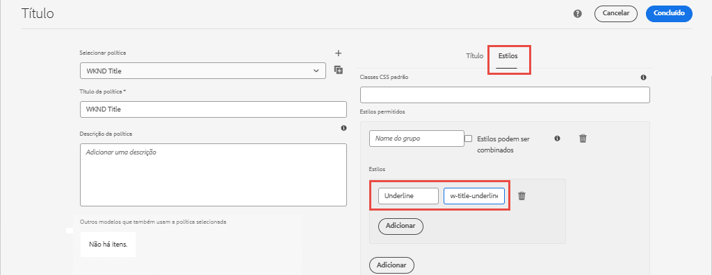

   Clique em **Concluído** para salvar as alterações na política de Título.

   >[!NOTE]
   >
   > O valor `cmp-title--underline` corresponde à classe CSS definida anteriormente durante o desenvolvimento no módulo **ui.frontend**.

### Aplicar o estilo sublinhado

Por fim, como autor, podemos optar por aplicar o estilo de sublinhado a determinados Componentes de título.

1. Navegue até o artigo **La Skateparks** no editor do AEM Sites em: [http://localhost:4502/editor.html/content/wknd/us/en/magazine/guide-la-skateparks.html](http://localhost:4502/editor.html/content/wknd/us/en/magazine/guide-la-skateparks.html)
1. No modo **Editar**, escolha um componente de Título. Clique no ícone **pincel** e selecione o estilo **Sublinhado**:

   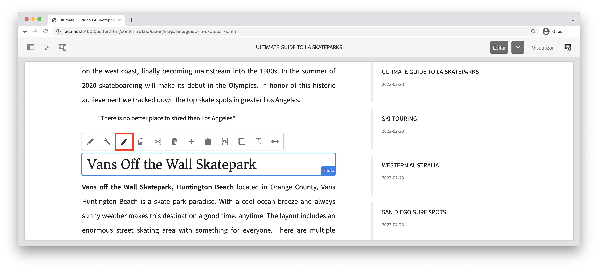

   Como autor, você deve ser capaz de ativar/desativar o estilo.

1. Clique no ícone **Informações da página** > **Exibir como publicada** para inspecionar a página fora AEM editor.

   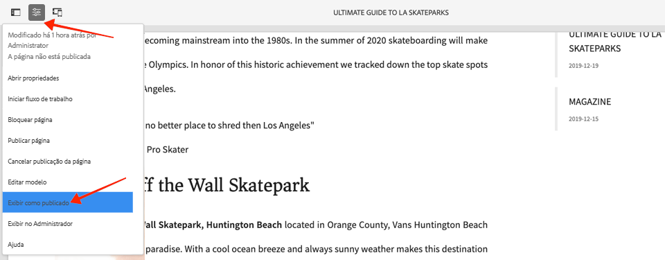

   Use as ferramentas do desenvolvedor do navegador para verificar se a marcação ao redor do componente de Título tem a classe CSS `cmp-title--underline` aplicada à div externa.

## Estilo do bloco de aspas - Texto {#text-component}

Em seguida, repita etapas semelhantes para aplicar um estilo exclusivo ao [Componente de texto](https://experienceleague.adobe.com/docs/experience-manager-core-components/using/components/text.html). O componente de Texto foi enviado por proxy para o projeto em `/apps/wknd/components/text` como parte do módulo **ui.apps**. Os estilos padrão dos elementos de parágrafo já foram implementados no **ui.frontend**.

Os [Designs de Artigo WKND](assets/pages-templates/wknd-article-design.xd) contêm um estilo exclusivo para o componente de Texto com um bloco de aspas:

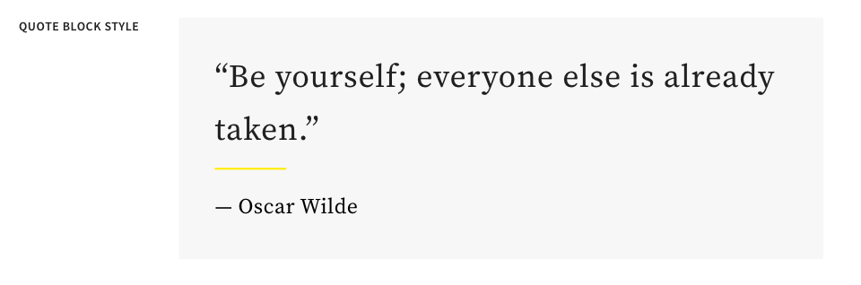

### Marcação de componente de texto do Inspect

Novamente, verificaremos a marcação do componente de texto.

1. Revise a marcação do componente de texto em: [https://www.aemcomponents.dev/content/core-components-examples/library/page-authoring/text.html](https://www.aemcomponents.dev/content/core-components-examples/library/page-authoring/text.html)

1. Abaixo está a marcação para o componente de Texto:

   ```html
   <div class="text">
       <div class="cmp-text" data-cmp-data-layer="{&quot;text-2d9d50c5a7&quot;:{&quot;@type&quot;:&quot;core/wcm/components/text/v2/text&quot;,&quot;repo:modifyDate&quot;:&quot;2019-01-22T11:56:17Z&quot;,&quot;xdm:text&quot;:&quot;<p>Lorem ipsum dolor sit amet, consectetur adipiscing elit, sed do eiusmod tempor incididunt ut labore et dolore magna aliqua. Eu mi bibendum neque egestas congue quisque egestas. Varius morbi enim nunc faucibus a pellentesque. Scelerisque eleifend donec pretium vulputate sapien nec sagittis.</p>\n&quot;}}" id="text-2d9d50c5a7">
           <p>Lorem ipsum dolor sit amet, consectetur adipiscing elit, sed do eiusmod tempor incididunt ut labore et dolore magna aliqua. Eu mi bibendum neque egestas congue quisque egestas. Varius morbi enim nunc faucibus a pellentesque. Scelerisque eleifend donec pretium vulputate sapien nec sagittis.</p>
       </div>
   </div>
   ```

   A notação BEM do componente de texto:

   ```plain
   BLOCK cmp-text
       ELEMENT
   ```

1. O sistema Style adiciona uma classe CSS ao div externo ao redor do componente. Portanto, a marcação que será direcionada será semelhante ao seguinte:

   ```html
   <div class="text STYLE-SYSTEM-CLASS-HERE"> <!-- Custom CSS class - implementation gets to define this -->
       <div class="cmp-text" data-cmp-data-layer="{&quot;text-2d9d50c5a7&quot;:{&quot;@type&quot;:&quot;core/wcm/components/text/v2/text&quot;,&quot;repo:modifyDate&quot;:&quot;2019-01-22T11:56:17Z&quot;,&quot;xdm:text&quot;:&quot;<p>Lorem ipsum dolor sit amet, consectetur adipiscing elit, sed do eiusmod tempor incididunt ut labore et dolore magna aliqua. Eu mi bibendum neque egestas congue quisque egestas. Varius morbi enim nunc faucibus a pellentesque. Scelerisque eleifend donec pretium vulputate sapien nec sagittis.</p>\n&quot;}}" id="text-2d9d50c5a7">
           <p>Lorem ipsum dolor sit amet, consectetur adipiscing elit, sed do eiusmod tempor incididunt ut labore et dolore magna aliqua. Eu mi bibendum neque egestas congue quisque egestas. Varius morbi enim nunc faucibus a pellentesque. Scelerisque eleifend donec pretium vulputate sapien nec sagittis.</p>
       </div>
   </div>
   ```

### Implementar o estilo do bloco de aspas - ui.frontend

Em seguida, implementaremos o estilo Bloco de Cotação usando o módulo **ui.frontend** do nosso projeto.

1. Inicie o servidor de desenvolvimento do webpack executando o seguinte comando no módulo **ui.frontend**:

   ```shell
   $ cd ~/code/aem-guides-wknd/ui.frontend/
   $ npm start
   ```

1. No IDE, abra o arquivo `index.html` localizado em: `ui.frontend/src/main/webpack/static/index.html`.
1. Em `index.html`, encontre uma instância do Componente de texto procurando pelo texto *&quot;Jacob Wester&quot;* (linha 210). Adicione a classe `cmp-text--quote` ao div ao redor:

   ```diff
   - <div class="text aem-GridColumn--phone--12 aem-GridColumn aem-GridColumn--default--8">
   + <div class="cmp-text--quote text aem-GridColumn--phone--12 aem-GridColumn aem-GridColumn--default--8">
        <div data-cmp-data-layer="{&#34;text-a15f39a83a&#34;:{&#34;@type&#34;:&#34;wknd/components/text&#34;,&#34;repo:modifyDate&#34;:&#34;2021-01-22T00:23:27Z&#34;,&#34;xdm:text&#34;:&#34;&lt;blockquote>&amp;quot;There is no better place to shred then Los Angeles.”&lt;/blockquote>\r\n&lt;p>- Jacob Wester, Pro Skater&lt;/p>\r\n&#34;}}" id="text-a15f39a83a" class="cmp-text">
            <blockquote>&quot;There is no better place to shred then Los Angeles.”</blockquote>
            <p>- Jacob Wester, Pro Skater</p>
        </div>
    </div>
   ```

1. Atualize o arquivo `text.scss` localizado em: `ui.frontend/src/main/webpack/components/_text.scss`:

   ```css
   /* WKND Text Quote style */
   .cmp-text--quote {
       .cmp-text {
           background-color: $brand-third;
           margin: 1em 0em;
           padding: 1em;
   
           blockquote {
               border: none;
               font-size: $font-size-large;
               font-family: $font-family-serif;
               padding: 14px 14px;
               margin: 0;
               margin-bottom: 0.5em;
   
               &:after {
                   border-bottom: 2px solid $brand-primary; /*yellow border */
                   content: '';
                   display: block;
                   position: relative;
                   top: 0.25em;
                   width: 80px;
               }
           }
           p {
               font-family:  $font-family-serif;
           }
       }
   }
   ```

   >[!CAUTION]
   >
   > Nesse caso, os elementos HTML brutos são direcionados pelos estilos. Isso ocorre porque o componente de Texto fornece um Editor de Rich Text para os autores de conteúdo. A criação de estilos diretamente no conteúdo do RTE deve ser feita com cuidado e é ainda mais importante criar um escopo restrito dos estilos.

1. Retorne ao navegador mais uma vez e você deve ver o estilo de bloco Cotação adicionado:

   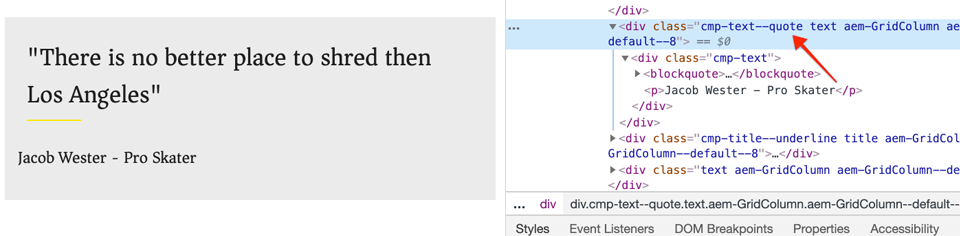

1. Pare o servidor de desenvolvimento de webpack.

### Adicionar uma política de texto

Em seguida, adicione uma nova política para os componentes de Texto.

1. Implante a base de código em uma instância de AEM local usando suas habilidades Maven:

   ```shell
   $ cd ~/code/aem-guides-wknd
   $ mvn clean install -PautoInstallSinglePackage
   ```

1. Navegue até o **Modelo de Página do Artigo** localizado em: [http://localhost:4502/editor.html/conf/wknd/settings/wcm/templates/article-page/structure.html](http://localhost:4502/editor.html/conf/wknd/settings/wcm/templates/article-page/structure.html)).

1. No modo **Estrutura**, no **Contêiner de layout** principal, selecione o ícone **Política** ao lado do componente **Texto** listado em *Componentes permitidos*:

   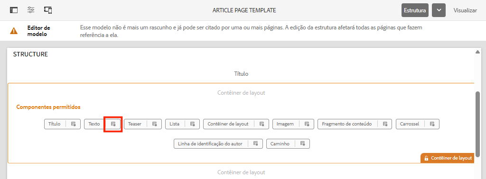

1. Atualize a política do componente de Texto com os seguintes valores:

   *Título da política **:  **Texto do conteúdo**

   *Plug-ins*  > Estilos  *de parágrafo*  >  *Ativar estilos de parágrafo*

   *Guia Estilos*  >  *Adicionar um novo estilo*

   **Bloco**  de aspas:  `cmp-text--quote`

   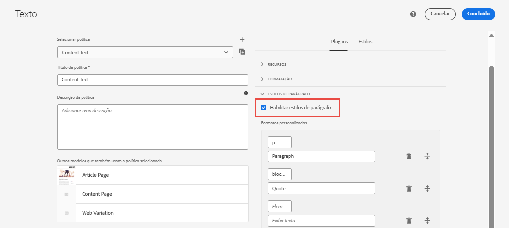

   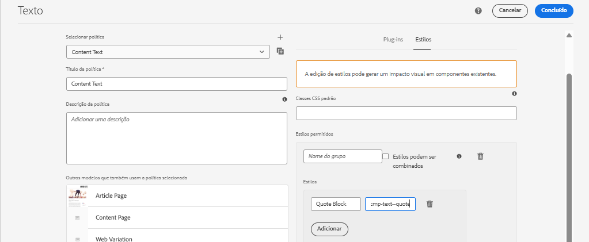

   Clique em **Concluído** para salvar as alterações na política de Texto.

### Aplicar o estilo do bloco de aspas

1. Navegue até o artigo **La Skateparks** no editor do AEM Sites em: [http://localhost:4502/editor.html/content/wknd/us/en/magazine/guide-la-skateparks.html](http://localhost:4502/editor.html/content/wknd/us/en/magazine/guide-la-skateparks.html)
1. No modo **Editar**, escolha um componente de Texto. Edite o componente para incluir um elemento de aspas:

   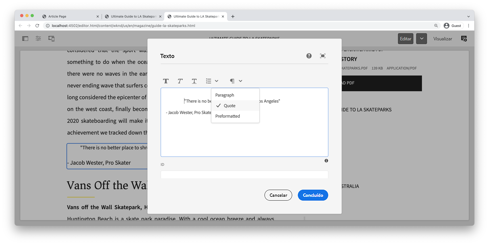

1. Selecione o componente de texto, clique no ícone **pincel** e selecione o estilo **Bloco de aspas**:

   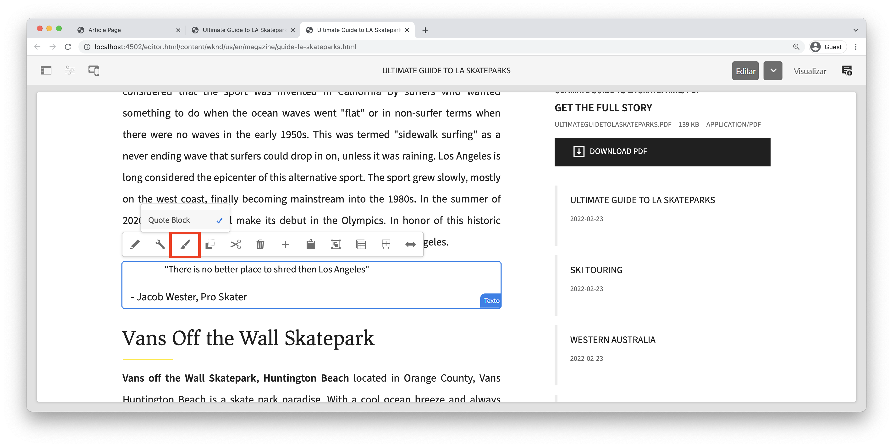

   Como autor, você deve ser capaz de ativar/desativar o estilo.

## Largura fixa - Contêiner (Bônus) {#layout-container}

Os componentes do contêiner foram usados para criar a estrutura básica do Modelo de página de artigo e fornecer as zonas de soltar para os autores de conteúdo adicionarem conteúdo em uma página. Os contêineres também podem aproveitar o Sistema de estilos, fornecendo aos autores de conteúdo ainda mais opções para projetar layouts.

O **Contêiner principal** do modelo Página de artigo contém os dois contêineres que podem ser criados para autor e tem uma largura fixa.

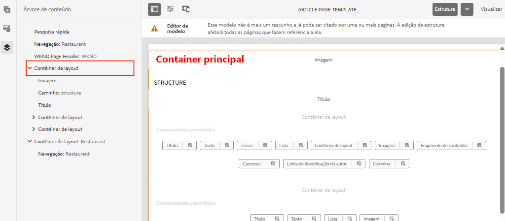

*Contêiner principal no modelo da página de artigo*.

A política do **Contêiner principal** define o elemento padrão como `main`:

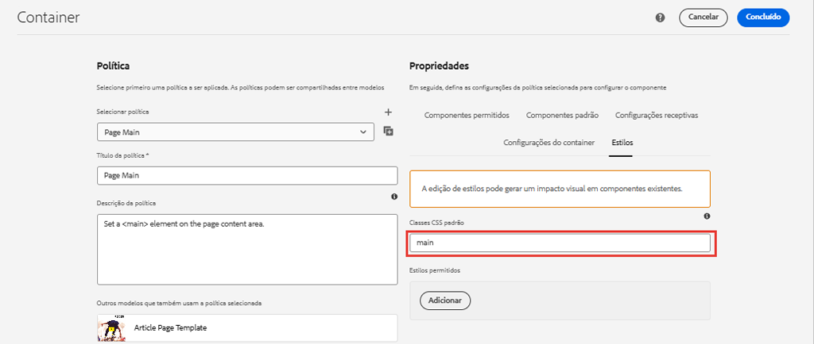

O CSS que faz o **Contêiner principal** fixo é definido no módulo **ui.frontend** em `ui.frontend/src/main/webpack/site/styles/container_main.scss` :

```SCSS
main.container {
    padding: .5em 1em;
    max-width: $max-content-width;
    float: unset!important;
    margin: 0 auto!important;
    clear: both!important;
}
```

Em vez de direcionar o elemento HTML `main`, o Sistema de estilos poderia ser usado para criar um estilo **Fixed width** como parte da política Contêiner. O Sistema de estilos poderia oferecer aos usuários a opção de alternar entre contêineres de **Largura fixa** e **Largura de fluido**.

1. **Desafio extra**  - use as lições aprendidas dos exercícios anteriores e o Sistema de estilos para implementar uma  **largura** fixa e  **Estilos** fluidos para o componente Contêiner.

## Parabéns! {#congratulations}

Parabéns, a Página do artigo é quase completamente estilizada e você ganhou uma experiência prática usando o Sistema de estilos de AEM.

### Próximas etapas {#next-steps}

Aprenda as etapas de ponta a ponta para criar um [Componente de AEM personalizado](custom-component.md) que exibe o conteúdo criado em uma caixa de diálogo e explora o desenvolvimento de um Modelo do Sling para encapsular a lógica comercial que preenche o HTL do componente.

Visualize o código concluído em [GitHub](https://github.com/adobe/aem-guides-wknd) ou revise e implante o código localmente na chave Git `tutorial/style-system-solution`.

1. Clona o repositório [github.com/adobe/aem-wknd-guides](https://github.com/adobe/aem-guides-wknd).
1. Confira a ramificação `tutorial/style-system-solution`.
