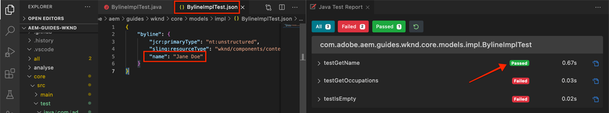

# Teste de unidade {#unit-testing}

Este tutorial aborda a implementação de um Teste de Unidade que valida o comportamento do Modelo do Sling do componente Byline, criado no tutorial [Componente Personalizado](./custom-component.md).

## Pré-requisitos {#prerequisites}

Revise as ferramentas e instruções necessárias para configurar um [ambiente de desenvolvimento local](overview.md#local-dev-environment).

_Se o Java 8 e o Java 11 estiverem instalados no sistema, o executante do teste do Código VS poderá escolher o tempo de execução do Java mais baixo ao executar os testes, resultando em falhas de teste. Se isso ocorrer, desinstale o Java 8._

### Projeto inicial

>[!NOTE]
>
> Se você concluiu o capítulo anterior com êxito, é possível reutilizar o projeto e ignorar as etapas para verificar o projeto inicial.

Confira o código base que o tutorial constrói em:

1. Confira a ramificação `tutorial/unit-testing-start` de [GitHub](https://github.com/adobe/aem-guides-wknd)

   ```shell
   $ cd aem-guides-wknd
   $ git checkout tutorial/unit-testing-start
   ```

1. Implante a base de código em uma instância de AEM local usando suas habilidades Maven:

   ```shell
   $ mvn clean install -PautoInstallSinglePackage
   ```

   >[!NOTE]
   >
   > Se estiver usando AEM 6.5 ou 6.4, anexe o perfil `classic` a qualquer comando Maven.

   ```shell
   $ mvn clean install -PautoInstallSinglePackage -Pclassic
   ```

Você sempre pode visualizar o código concluído em [GitHub](https://github.com/adobe/aem-guides-wknd/tree/tutorial/unit-testing-start) ou verificar o código localmente ao alternar para a ramificação `tutorial/unit-testing-start`.

## Objetivo

1. Entenda as noções básicas do teste de unidade.
1. Saiba mais sobre estruturas e ferramentas usadas frequentemente para testar o código AEM.
1. Entenda as opções para fazer zombaria ou simular AEM recursos ao gravar testes de unidade.

## Segundo plano {#unit-testing-background}

Neste tutorial, exploraremos como escrever [Testes de Unidade](https://en.wikipedia.org/wiki/Unit_testing) para o [Modelo do Sling](https://sling.apache.org/documentation/bundles/models.html) do nosso componente Byline (criado no [Criação de um Componente de AEM personalizado](custom-component.md)). Os testes de unidade são testes de tempo de criação gravados em Java que verificam o comportamento esperado do código Java. Normalmente, cada teste de unidade é pequeno e valida a saída de um método (ou unidades de trabalho) em relação aos resultados esperados.

Usaremos AEM práticas recomendadas e:

* [JUnit 5](https://junit.org/junit5/)
* [Estrutura de teste do Mockito](https://site.mockito.org/)
* [estrutura de teste wcm.io](https://wcm.io/testing/)  (que se baseia em mocks do  [Apache Sling](https://sling.apache.org/documentation/development/sling-mock.html))

## Teste de unidade e gerenciador de nuvem do Adobe {#unit-testing-and-adobe-cloud-manager}

[O Adobe Cloud ](https://experienceleague.adobe.com/docs/experience-manager-cloud-manager/using/introduction-to-cloud-manager.html?lang=pt-BR) Manager integra a execução de teste de unidade e o relatório de cobertura de  [código ao ](https://experienceleague.adobe.com/docs/experience-manager-cloud-manager/using/how-to-use/understand-your-test-results.html#code-quality-testing) pipeline de CI/CD para ajudar a incentivar e promover as práticas recomendadas de teste de unidade AEM código.

Embora o código de teste de unidade seja uma boa prática para qualquer base de código, ao usar o Cloud Manager, é importante aproveitar seus recursos de teste e relatório de qualidade de código fornecendo testes de unidade para que o Cloud Manager seja executado.

## Inspect as dependências de teste de Maven {#inspect-the-test-maven-dependencies}

O primeiro passo é inspecionar as dependências de Maven para suportar a gravação e a execução dos testes. Há quatro dependências necessárias:

1. JUnit5
1. Estrutura de teste do Mockito
1. Mocks do Apache Sling
1. Estrutura de teste do AEM Mocks (por io.wcm)

As dependências de teste **JUnit5**, **Mockito** e **AEM Mocks** são automaticamente adicionadas ao projeto durante a configuração usando o [AEM arquétipo Maven](project-setup.md).

1. Para exibir essas dependências, abra o POM do reator pai em **aem-guides-wknd/pom.xml**, navegue até `<dependencies>..</dependencies>` e verifique se as seguintes dependências estão definidas:

   ```xml
   <dependencies>
       ...       
       <!-- Testing -->
       <dependency>
           <groupId>org.junit</groupId>
           <artifactId>junit-bom</artifactId>
           <version>5.6.2</version>
           <type>pom</type>
           <scope>import</scope>
       </dependency>
       <dependency>
           <groupId>org.mockito</groupId>
           <artifactId>mockito-core</artifactId>
           <version>3.3.3</version>
           <scope>test</scope>
       </dependency>
       <dependency>
           <groupId>org.mockito</groupId>
           <artifactId>mockito-junit-jupiter</artifactId>
           <version>3.3.3</version>
           <scope>test</scope>
       </dependency>
       <dependency>
           <groupId>junit-addons</groupId>
           <artifactId>junit-addons</artifactId>
           <version>1.4</version>
           <scope>test</scope>
       </dependency>
       <dependency>
           <groupId>io.wcm</groupId>
           <artifactId>io.wcm.testing.aem-mock.junit5</artifactId>
           <!-- Prefer the latest version of AEM Mock Junit5 dependency -->
           <version>3.0.2</version>
           <scope>test</scope>
       </dependency>        
       ...
   </dependencies>
   ```

1. Abra **aem-guides-wknd/core/pom.xml** e veja se as dependências de teste correspondentes estão disponíveis:

   ```xml
   ...
   <!-- Testing -->
   <dependency>
       <groupId>org.junit.jupiter</groupId>
       <artifactId>junit-jupiter</artifactId>
       <scope>test</scope>
   </dependency>
   <dependency>
       <groupId>org.mockito</groupId>
       <artifactId>mockito-core</artifactId>
       <scope>test</scope>
   </dependency>
   <dependency>
       <groupId>org.mockito</groupId>
       <artifactId>mockito-junit-jupiter</artifactId>
       <scope>test</scope>
   </dependency>
   <dependency>
       <groupId>junit-addons</groupId>
       <artifactId>junit-addons</artifactId>
       <scope>test</scope>
   </dependency>
   <dependency>
       <groupId>io.wcm</groupId>
       <artifactId>io.wcm.testing.aem-mock.junit5</artifactId>
       <exclusions>
           <exclusion>
               <groupId>org.apache.sling</groupId>
               <artifactId>org.apache.sling.models.impl</artifactId>
           </exclusion>
           <exclusion>
               <groupId>org.slf4j</groupId>
               <artifactId>slf4j-simple</artifactId>
           </exclusion>
       </exclusions>
       <scope>test</scope>
   </dependency>
   <!-- Required to be able to support injection with @Self and @Via -->
   <dependency>
       <groupId>org.apache.sling</groupId>
       <artifactId>org.apache.sling.models.impl</artifactId>
       <version>1.4.4</version>
       <scope>test</scope>
   </dependency>
   ...
   ```

   Uma pasta de origem paralela no projeto **core** conterá os testes de unidade e quaisquer arquivos de teste de suporte. Esta pasta **test** fornece a separação das classes de teste do código-fonte, mas permite que os testes atuem como se estivessem nos mesmos pacotes que o código-fonte.

## Criação do teste JUnit {#creating-the-junit-test}

Os testes de unidade normalmente mapeiam de 1 a 1 com classes Java. Neste capítulo, gravaremos um teste JUnit para o **BylineImpl.java**, que é o Modelo do Sling que suporta o componente Byline.


*Local onde são armazenados os testes de unidade.*

1. Crie um teste de unidade para o `BylineImpl.java` fazendo uma nova classe Java em `src/test/java` em uma estrutura de pasta de pacote Java que espelhe a localização da classe Java a ser testada.

   

   Como estamos testando

   * `src/main/java/com/adobe/aem/guides/wknd/core/models/impl/BylineImpl.java`

   crie uma classe Java de teste de unidade correspondente em

   * `src/test/java/com/adobe/aem/guides/wknd/core/models/impl/BylineImplTest.java`

   O sufixo `Test` no arquivo de teste da unidade, `BylineImplTest.java` é uma convenção que nos permite

   1. Identifique-o facilmente como o arquivo de teste _para_ `BylineImpl.java`
   1. Mas também, diferencie o arquivo de teste _de_ a classe que está sendo testada, `BylineImpl.java`


## Revisão de BylineImplTest.java {#reviewing-bylineimpltest-java}

Neste ponto, o arquivo de teste JUnit é uma classe Java vazia. Atualize o arquivo com o seguinte código:

```java
package com.adobe.aem.guides.wknd.core.models.impl;

import static org.junit.jupiter.api.Assertions.*;

import org.junit.jupiter.api.BeforeEach;
import org.junit.jupiter.api.Test;

public class BylineImplTest {

    @BeforeEach
    void setUp() throws Exception {

    }

    @Test 
    void testGetName() { 
        fail("Not yet implemented");
    }
    
    @Test 
    void testGetOccupations() { 
        fail("Not yet implemented");
    }

    @Test 
    void testIsEmpty() { 
        fail("Not yet implemented");
    }
}
```

1. O primeiro método `public void setUp() { .. }` é anotado com `@BeforeEach` da JUnit, que instrui o executador de teste da JUnit a executar este método antes de executar cada método de teste nesta classe. Isso fornece um local útil para inicializar um estado de teste comum exigido por todos os testes.

2. Os métodos subsequentes são os métodos de teste, cujos nomes têm o prefixo `test` por convenção e são marcados com a anotação `@Test`. Observe que, por padrão, todos os nossos testes estão definidos para falhar, pois ainda não os implementamos.

   Para começar, começamos com um único método de teste para cada método público na classe que estamos testando, portanto:

   | BylineImpl.java |  | BylineImplTest.java |
   | ------------------|--------------|---------------------|
   | getName() | é testado por | testGetName() |
   | getOccupations() | é testado por | testGetOccupations() |
   | isEmpty() | é testado por | testIsEmpty() |

   Esses métodos podem ser expandidos conforme necessário, como veremos mais adiante neste capítulo.

   Quando essa classe de teste JUnit (também conhecida como caso de teste JUnit) é executada, cada método marcado com `@Test` será executado como um teste que pode ser aprovado ou falhar.


*`core/src/test/java/com/adobe/aem/guides/wknd/core/models/impl/BylineImplTest.java`*

1. Execute o caso de teste JUnit clicando com o botão direito do mouse no arquivo `BylineImplTest.java` e tocando em **Executar**.
Como esperado, todos os testes falharam, pois ainda não foram implementados.

   

   *Clique com o botão direito do mouse em BylineImplTests.java > Executar*

## Revisão de BylineImpl.java {#reviewing-bylineimpl-java}

Ao gravar testes de unidade, há duas abordagens principais:

* [TDD ou desenvolvimento](https://en.wikipedia.org/wiki/Test-driven_development) orientado para testes, que envolve escrever os testes de unidade de forma incremental, imediatamente antes do desenvolvimento da implementação; gravar um teste, gravar a implementação para fazer o teste passar.
* Implementação - primeiro desenvolvimento, que envolve o desenvolvimento de código de trabalho primeiro e, em seguida, a gravação de testes que validam esse código.

Neste tutorial, a última abordagem é usada (como já criamos um **BylineImpl.java** em um capítulo anterior). Por isso, devemos rever e entender os comportamentos dos seus métodos públicos, mas também alguns dos seus detalhes de implementação. Tal pode parecer contrário, uma vez que um bom teste só deve incidir sobre os fatores de produção e os resultados, contudo, quando se trabalha em AEM, há uma variedade de considerações de aplicação que têm de ser entendidas para a realização de testes de trabalho.

O TDD no contexto de AEM requer um nível de especialização e é melhor adotado por AEM desenvolvedores com capacidade AEM desenvolvimento e teste de unidade de código AEM.

## Configuração AEM contexto de teste  {#setting-up-aem-test-context}

A maioria dos códigos escritos para AEM depende de APIs JCR, Sling ou AEM, que, por sua vez, exigem que o contexto de um AEM em execução seja executado corretamente.

Como os testes de unidade são executados na criação, fora do contexto de uma instância de AEM em execução, não há esse contexto. Para facilitar isso, o [mocks AEM do wcm.io](https://wcm.io/testing/aem-mock/usage.html) cria um contexto de modelo que permite que essas APIs _principalmente_ atuem como se estivessem em execução no AEM.

1. Crie um contexto AEM usando **wcm.io&#39;s** `AemContext` em **BylineImplTest.java** adicionando-o como uma extensão JUnit decorada com `@ExtendWith` no arquivo **BylineImplTest.java**. A extensão cuida de todas as tarefas de inicialização e limpeza necessárias. Crie uma variável de classe para `AemContext` que pode ser usada para todos os métodos de teste.

   ```java
   import org.junit.jupiter.api.extension.ExtendWith;
   import io.wcm.testing.mock.aem.junit5.AemContext;
   import io.wcm.testing.mock.aem.junit5.AemContextExtension;
   ...
   
   @ExtendWith(AemContextExtension.class)
   class BylineImplTest {
   
       private final AemContext ctx = new AemContext();
   ```

   Essa variável, `ctx`, expõe um modelo AEM contexto que fornece várias abstrações de AEM e Sling:

   * O Modelo de Sling BylineImpl será registrado neste contexto
   * As estruturas de conteúdo do JCR de bloco são criadas neste contexto
   * Os serviços OSGi personalizados podem ser registrados neste contexto
   * Fornece uma variedade de modelos de objetos e ajuda comuns necessários, como objetos SlingHttpServletRequest , uma variedade de modelos de Sling e AEM serviços OSGi, como ModelFactory, PageManager, Page, Template, ComponentManager, ComponentManager, Component, TagManager, Tag, etc.
      * *Observe que nem todos os métodos para esses objetos estão implementados!*
   * E [muito mais](https://wcm.io/testing/aem-mock/usage.html)!

   O objeto **`ctx`** atuará como o ponto de entrada para a maior parte do contexto do modelo.

1. No método `setUp(..)`, que é executado antes de cada método `@Test`, defina um estado de teste de modelo comum:

   ```java
   @BeforeEach
   public void setUp() throws Exception {
       ctx.addModelsForClasses(BylineImpl.class);
       ctx.load().json("/com/adobe/aem/guides/wknd/core/models/impl/BylineImplTest.json", "/content");
   }
   ```

   * **`addModelsForClasses`** registra o Modelo do Sling a ser testado, no modelo AEM Contexto, para que possa ser instanciado nos  `@Test` métodos.
   * **`load().json`** carrega estruturas de recursos no contexto do modelo, permitindo que o código interaja com esses recursos como se fossem fornecidos por um repositório real. As definições de recurso no arquivo **`BylineImplTest.json`** são carregadas no contexto mock JCR em **/content**.
   * **`BylineImplTest.json`** ainda não existe, portanto, vamos criá-lo e definir as estruturas de recurso do JCR necessárias para o teste.

1. Os arquivos JSON que representam as estruturas de recursos do pacote são armazenados em **core/src/test/resources** seguindo a mesma definição de caminho de pacote que o arquivo de teste Java do JUnit.

   Crie um novo arquivo JSON em **core/test/resources/com/adobe/aem/guides/wknd/core/models/impl** chamado **BylineImplTest.json** com o seguinte conteúdo:

   ```json
   {
       "byline": {
       "jcr:primaryType": "nt:unstructured",
       "sling:resourceType": "wknd/components/content/byline"
       }
   }
   ```

   

   Esse JSON define um recurso mock (nó JCR) para o teste de unidade do componente Byline. Neste ponto, o JSON tem o conjunto mínimo de propriedades necessárias para representar um recurso de conteúdo do componente Byline, o `jcr:primaryType` e `sling:resourceType`.

   Uma regra geral ao trabalhar com testes de unidade é criar o conjunto mínimo de conteúdo, contexto e código do mock necessário para satisfazer cada teste. Evite a tentação de construir um contexto de zombaria completo antes de escrever os testes, pois isso geralmente resulta em artefatos desnecessários.

   Agora, com a existência de **BylineImplTest.json**, quando `ctx.json("/com/adobe/aem/guides/wknd/core/models/impl/BylineImplTest.json", "/content")` é executado, as definições de recurso de modelo são carregadas no contexto no caminho **/content.**

## Teste de getName() {#testing-get-name}

Agora que temos uma configuração básica de contexto de modelo, gravaremos nosso primeiro teste para **BylineImpl&#39;s getName()**. Este teste deve garantir que o método **getName()** retorne o nome de criação correto armazenado na propriedade &quot;**name&quot;** do recurso.

1. Atualize o método **testGetName**() em **BylineImplTest.java** da seguinte maneira:

   ```java
   import com.adobe.aem.guides.wknd.core.components.Byline;
   ...
   @Test
   public void testGetName() {
       final String expected = "Jane Doe";
   
       ctx.currentResource("/content/byline");
       Byline byline = ctx.request().adaptTo(Byline.class);
   
       String actual = byline.getName();
   
       assertEquals(expected, actual);
   }
   ```

   * **`String expected`** define o valor esperado. Definiremos isso como &quot;**Jane Concluída**&quot;.
   * **`ctx.currentResource`** define o contexto do recurso mock para avaliar o código, de forma que seja definido como  **/content/** bylineas, onde o recurso de conteúdo mock byline é carregado.
   * **`Byline byline`** instancia o Modelo de sling Byline adaptando-o do objeto de solicitação de mock.
   * **`String actual`** chama o método que estamos testando,  `getName()`, no objeto Modelo de sling Byline.
   * **`assertEquals`** afirma que o valor esperado corresponde ao valor retornado pelo objeto do Modelo de sling byline. Se esses valores não forem iguais, o teste falhará.

1. Execute o teste... e ele falhará com um `NullPointerException`.

   Observe que esse teste NÃO falha porque nunca definimos uma propriedade `name` no JSON mock, que fará com que o teste falhe, no entanto, a execução do teste não chegou a esse ponto! Esse teste falha devido a um `NullPointerException` no próprio objeto byline.

1. No `BylineImpl.java`, se `@PostConstruct init()` lançar uma exceção, impede que o Modelo do Sling instancie e faz com que esse objeto do Modelo do Sling seja nulo.

   ```java
   @PostConstruct
   private void init() {
       image = modelFactory.getModelFromWrappedRequest(request, request.getResource(), Image.class);
   }
   ```

   Acontece que, embora o serviço OSGi ModelFactory seja fornecido por meio do `AemContext` (por meio do Contexto do Apache Sling), nem todos os métodos são implementados, incluindo `getModelFromWrappedRequest(...)` que é chamado no método `init()` do BylineImpl. Isso resulta em um [AbstractMethodError](https://docs.oracle.com/en/java/javase/11/docs/api/java.base/java/lang/AbstractMethodError.html), o que, por termo, faz com que `init()` falhe, e a adaptação resultante do `ctx.request().adaptTo(Byline.class)` é um objeto nulo.

   Como os modelos fornecidos não podem acomodar nosso código, precisamos implementar o contexto de zombaria nós mesmos. Para isso, podemos usar o Mockito para criar um objeto de modeloFactory, que retorna um objeto de imagem de zombaria quando `getModelFromWrappedRequest(...)` é chamado a ele.

   Como para instanciar o Modelo de Sling Byline, esse contexto de modelo deve estar em vigor, podemos adicioná-lo ao método `@Before setUp()`. Também precisamos adicionar o `MockitoExtension.class` à anotação `@ExtendWith` acima da classe **BylineImplTest**.

   ```java
   package com.adobe.aem.guides.wknd.core.models.impl;
   
   import org.mockito.junit.jupiter.MockitoExtension;
   import org.mockito.Mock;
   
   import com.adobe.aem.guides.wknd.core.models.Byline;
   import com.adobe.cq.wcm.core.components.models.Image;
   
   import io.wcm.testing.mock.aem.junit5.AemContext;
   import io.wcm.testing.mock.aem.junit5.AemContextExtension;
   
   import org.apache.sling.models.factory.ModelFactory;
   import org.junit.jupiter.api.BeforeEach;
   import org.junit.jupiter.api.Test;
   import org.junit.jupiter.api.extension.ExtendWith;
   
   import static org.junit.jupiter.api.Assertions.*;
   import static org.mockito.Mockito.*;
   import org.apache.sling.api.resource.Resource;
   
   @ExtendWith({ AemContextExtension.class, MockitoExtension.class })
   public class BylineImplTest {
   
       private final AemContext ctx = new AemContext();
   
       @Mock
       private Image image;
   
       @Mock
       private ModelFactory modelFactory;
   
       @BeforeEach
       public void setUp() throws Exception {
           ctx.addModelsForClasses(BylineImpl.class);
   
           ctx.load().json("/com/adobe/aem/guides/wknd/core/models/impl/BylineImplTest.json", "/content");
   
           lenient().when(modelFactory.getModelFromWrappedRequest(eq(ctx.request()), any(Resource.class), eq(Image.class)))
                   .thenReturn(image);
   
           ctx.registerService(ModelFactory.class, modelFactory, org.osgi.framework.Constants.SERVICE_RANKING,
                   Integer.MAX_VALUE);
       }
   
       @Test
       void testGetName() { ...
   }
   ```

   * **`@ExtendWith({AemContextExtension.class, MockitoExtension.class})`** marca a classe Caso de teste a ser executada com a extensão Jupiter  [ ](https://www.javadoc.io/page/org.mockito/mockito-junit-jupiter/latest/org/mockito/junit/jupiter/MockitoExtension.html) Mockito Junit, que permite o uso das anotações @Mock para definir objetos mock no nível da Classe.
   * **`@Mock private Image`** cria um objeto mock do tipo  `com.adobe.cq.wcm.core.components.models.Image`. Observe que isso é definido no nível da classe para que, conforme necessário, os métodos `@Test` possam alterar seu comportamento, conforme necessário.
   * **`@Mock private ModelFactory`** cria um objeto modelo do tipo ModelFactory. Observe que este é um zombro Mockito puro e não tem métodos implementados nele. Observe que isso é definido no nível da classe para que, conforme necessário, os métodos `@Test`possam alterar seu comportamento, conforme necessário.
   * **`when(modelFactory.getModelFromWrappedRequest(..)`** registra o comportamento mock para quando  `getModelFromWrappedRequest(..)` é chamado no objeto mock ModelFactory . O resultado definido em `thenReturn (..)` é retornar o objeto de imagem de zombaria. Observe que esse comportamento é chamado somente quando: o primeiro parâmetro é igual ao objeto de solicitação de `ctx`, o segundo parâmetro é qualquer objeto de Recurso e o terceiro parâmetro deve ser a classe Imagem dos componentes principais. Aceitamos qualquer Recurso porque, em todos os testes, estaremos configurando o `ctx.currentResource(...)` para vários recursos de modelo definidos no **BylineImplTest.json**. Observe que adicionamos o rigor **lenient()** porque desejaremos substituir esse comportamento do ModelFactory mais tarde.
   * **`ctx.registerService(..)`.** registra o objeto modeloFactory no AemContext, com a classificação de serviço mais alta. Isso é necessário, pois o ModelFactory usado no `init()` do BylineImpl é injetado por meio do campo `@OSGiService ModelFactory model`. Para que o AemContext injete **our** objeto mock, que lida com chamadas para `getModelFromWrappedRequest(..)`, devemos registrá-lo como o Serviço de classificação mais alta desse tipo (ModelFactory).

1. Execute o teste novamente e ele falhará novamente, mas desta vez a mensagem estará clara por que ele falhou.

   

   *Falha de testGetName() devido à asserção*

   Recebemos um **AssertionError** que significa que a condição de asserção no teste falhou, e ele informa que o **valor esperado é &quot;Jane Doe&quot;**, mas o **valor real é nulo**. Isso faz sentido porque a propriedade &quot;**name&quot;** não foi adicionada ao mock **/content/byline** definição de recurso em **BylineImplTest.json**, portanto, vamos adicioná-la:

1. Atualize **BylineImplTest.json** para definir `"name": "Jane Doe".`

   ```json
   {
       "byline": {
       "jcr:primaryType": "nt:unstructured",
       "sling:resourceType": "wknd/components/content/byline",
       "name": "Jane Doe"
       }
   }
   ```

1. Execute novamente o teste e **`testGetName()`** agora será aprovado!

   


## Teste de getOccupations() {#testing-get-occupations}

Muito bem! Nosso primeiro teste foi bem-sucedido! Vamos continuar e testar `getOccupations()`. Como a inicialização do contexto do modelo foi feita no método `@Before setUp()`, isso estará disponível para todos os métodos `@Test` neste caso de teste, incluindo `getOccupations()`.

Lembre-se de que esse método deve retornar uma lista de ocupações (decrescentes) classificadas alfabeticamente armazenada na propriedade de ocupações.

1. Atualize **`testGetOccupations()`** da seguinte maneira:

   ```java
   import java.util.List;
   import com.google.common.collect.ImmutableList;
   ...
   @Test
   public void testGetOccupations() {
       List<String> expected = new ImmutableList.Builder<String>()
                               .add("Blogger")
                               .add("Photographer")
                               .add("YouTuber")
                               .build();
   
       ctx.currentResource("/content/byline");
       Byline byline = ctx.request().adaptTo(Byline.class);
   
       List<String> actual = byline.getOccupations();
   
       assertEquals(expected, actual);
   }
   ```

   * **`List<String> expected`** defina o resultado esperado.
   * **`ctx.currentResource`** define o recurso atual para avaliar o contexto em relação à definição de recurso de modelo em /content/byline. Isso garante que o **BylineImpl.java** seja executado no contexto do nosso recurso mock.
   * **`ctx.request().adaptTo(Byline.class)`** instancia o Modelo de sling Byline adaptando-o do objeto de solicitação de mock.
   * **`byline.getOccupations()`** chama o método que estamos testando,  `getOccupations()`, no objeto Modelo de sling Byline.
   * **`assertEquals(expected, actual)`** afirma que a lista esperada é igual à lista real.

1. Lembre-se, exatamente como **`getName()`** acima, o **BylineImplTest.json** não define ocupações, portanto, esse teste falhará se for executado, pois `byline.getOccupations()` retornará uma lista vazia.

   Atualize **BylineImplTest.json** para incluir uma lista de ocupações, e elas serão definidas em ordem não alfabética para garantir que nossos testes validem se as ocupações são classificadas alfabeticamente por **`getOccupations()`**.

   ```json
   {
       "byline": {
       "jcr:primaryType": "nt:unstructured",
       "sling:resourceType": "wknd/components/content/byline",
       "name": "Jane Doe",
       "occupations": ["Photographer", "Blogger", "YouTuber"]
       }
   }
   ```

1. Execute o teste e novamente nós passamos! Parece ter as ocupações organizadas funcionando!

   

   *testGetOccupations() passa*

## Testar isEmpty() {#testing-is-empty}

O último método a testar **`isEmpty()`**.

Testar `isEmpty()` é interessante, pois requer testes para uma variedade de condições. Revisando o método **BylineImpl.java**, as seguintes condições devem ser testadas:`isEmpty()`

* Retornar verdadeiro quando o nome estiver vazio
* Retornar verdadeiro quando as ocupações forem nulas ou vazias
* Retorna true quando a imagem for nula ou não tiver um URL src
* Retornar falso quando o nome, as ocupações e a Imagem (com um URL src) estiverem presentes

Para isso, precisamos criar novos métodos de teste, cada um testando uma condição específica, bem como novas estruturas de recursos de modelo em `BylineImplTest.json` para conduzir esses testes.

Observe que essa verificação nos permitiu ignorar o teste para quando `getName()`, `getOccupations()` e `getImage()` estiverem vazias, pois o comportamento esperado desse estado é testado por `isEmpty()`.

1. O primeiro teste testará a condição de um componente totalmente novo, que não tenha propriedades definidas.

   Adicione uma nova definição de recurso a `BylineImplTest.json`, dando a ele o nome semântico &quot;**empty**&quot;

   ```json
   {
       "byline": {
           "jcr:primaryType": "nt:unstructured",
           "sling:resourceType": "wknd/components/content/byline",
           "name": "Jane Doe",
           "occupations": ["Photographer", "Blogger", "YouTuber"]
       },
       "empty": {
           "jcr:primaryType": "nt:unstructured",
           "sling:resourceType": "wknd/components/content/byline"
       }
   }
   ```

   **`"empty": {...}`** defina uma nova definição de recurso chamada &quot;empty&quot; que só tem um  `jcr:primaryType` e  `sling:resourceType`.

   Lembre-se de que carregamos `BylineImplTest.json` em `ctx` antes da execução de cada método de teste em `@setUp`, de modo que essa nova definição de recurso está imediatamente disponível para nós em testes em **/content/empty.**

1. Atualize `testIsEmpty()` da seguinte maneira, definindo o recurso atual para o novo modelo de definição de recurso &quot;**empty**&quot;.

   ```java
   @Test
   public void testIsEmpty() {
       ctx.currentResource("/content/empty");
       Byline byline = ctx.request().adaptTo(Byline.class);
   
       assertTrue(byline.isEmpty());
   }
   ```

   Execute o teste e garanta que ele seja aprovado.

1. Em seguida, crie um conjunto de métodos para garantir que, se qualquer um dos pontos de dados necessários (nome, ocupações ou imagem) estiver vazio, `isEmpty()` retorne true.

   Para cada teste, uma definição de recurso de modelo discreta é usada, atualize **BylineImplTest.json** com as definições de recurso adicionais para **sem nome** e **sem ocupações**.

   ```json
   {
       "byline": {
           "jcr:primaryType": "nt:unstructured",
           "sling:resourceType": "wknd/components/content/byline",
           "name": "Jane Doe",
           "occupations": ["Photographer", "Blogger", "YouTuber"]
       },
       "empty": {
           "jcr:primaryType": "nt:unstructured",
           "sling:resourceType": "wknd/components/content/byline"
       },
       "without-name": {
           "jcr:primaryType": "nt:unstructured",
           "sling:resourceType": "wknd/components/content/byline",
           "occupations": "[Photographer, Blogger, YouTuber]"
       },
       "without-occupations": {
           "jcr:primaryType": "nt:unstructured",
           "sling:resourceType": "wknd/components/content/byline",
           "name": "Jane Doe"
       }
   }
   ```

   Crie os seguintes métodos de teste para testar cada um desses estados.

   ```java
   @Test
   public void testIsEmpty() {
       ctx.currentResource("/content/empty");
   
       Byline byline = ctx.request().adaptTo(Byline.class);
   
       assertTrue(byline.isEmpty());
   }
   
   @Test
   public void testIsEmpty_WithoutName() {
       ctx.currentResource("/content/without-name");
   
       Byline byline = ctx.request().adaptTo(Byline.class);
   
       assertTrue(byline.isEmpty());
   }
   
   @Test
   public void testIsEmpty_WithoutOccupations() {
       ctx.currentResource("/content/without-occupations");
   
       Byline byline = ctx.request().adaptTo(Byline.class);
   
       assertTrue(byline.isEmpty());
   }
   
   @Test
   public void testIsEmpty_WithoutImage() {
       ctx.currentResource("/content/byline");
   
       lenient().when(modelFactory.getModelFromWrappedRequest(eq(ctx.request()),
           any(Resource.class),
           eq(Image.class))).thenReturn(null);
   
       Byline byline = ctx.request().adaptTo(Byline.class);
   
       assertTrue(byline.isEmpty());
   }
   
   @Test
   public void testIsEmpty_WithoutImageSrc() {
       ctx.currentResource("/content/byline");
   
       when(image.getSrc()).thenReturn("");
   
       Byline byline = ctx.request().adaptTo(Byline.class);
   
       assertTrue(byline.isEmpty());
   }
   ```

   **`testIsEmpty()`** O testa a definição de recurso de modelo vazio e faz com que  `isEmpty()` seja verdadeiro.

   **`testIsEmpty_WithoutName()`** O testa uma definição de recurso de modelo que tem ocupações, mas nenhum nome.

   **`testIsEmpty_WithoutOccupations()`** O testa uma definição de recurso de modelo que tem um nome, mas nenhuma ocupação.

   **`testIsEmpty_WithoutImage()`** O testa uma definição de recurso de modelo com um nome e ocupações, mas define o modelo de Imagem para retornar a nulo. Observe que queremos substituir o comportamento `modelFactory.getModelFromWrappedRequest(..)`definido em `setUp()` para garantir que o objeto de Imagem retornado por esta chamada seja nulo. O recurso de bordas do Mockito é restrito e não deseja código duplicado. Portanto, definimos o modelo com as configurações **`lenient`** para observar explicitamente que estamos substituindo o comportamento no método `setUp()`.

   **`testIsEmpty_WithoutImageSrc()`** O testa uma definição de recurso de modelo com um nome e ocupações, mas define o modelo de Imagem para retornar uma string em branco quando  `getSrc()` é chamado.

1. Por fim, grave um teste para garantir que **isEmpty()** retorne false quando o componente estiver configurado corretamente. Para essa condição, podemos reutilizar **/content/byline** que representa um componente Byline totalmente configurado.

   ```java
   @Test
   public void testIsNotEmpty() {
       ctx.currentResource("/content/byline");
       when(image.getSrc()).thenReturn("/content/bio.png");
   
       Byline byline = ctx.request().adaptTo(Byline.class);
   
       assertFalse(byline.isEmpty());
   }
   ```

1. Agora, execute todos os testes de unidade no arquivo BylineImplTest.java e revise a saída do Relatório de teste do Java.


## Execução de testes de unidade como parte da compilação {#running-unit-tests-as-part-of-the-build}

Os testes de unidade são executados e precisam ser aprovados como parte da compilação maven. Isso garante que todos os testes sejam bem-sucedidos antes da implantação de um aplicativo. A execução de metas Maven, como pacote ou instalação, chama automaticamente e requer a aprovação de todos os testes de unidade no projeto.

```shell
$ mvn package
```


```shell
$ mvn package
```

Da mesma forma, se alterarmos um método de teste para falhar, a build falhará e reportará quais testes falharam e por quê.


## Revise o código {#review-the-code}

Visualize o código concluído em [GitHub](https://github.com/adobe/aem-guides-wknd) ou revise e implante o código localmente na chave Git `tutorial/unit-testing-solution`.
