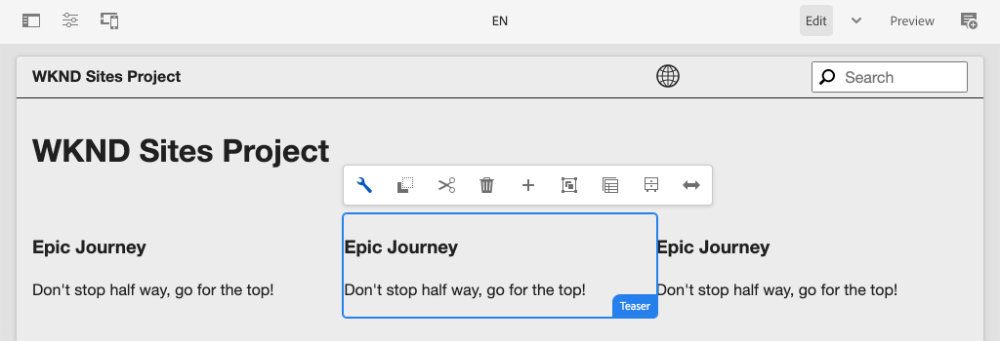

# Configuração do projeto {#project-setup}

Este tutorial aborda a criação de um Projeto Maven Multi Module para gerenciar o código e as configurações de um Site da Adobe Experience Manager.

## Pré-requisitos {#prerequisites}

Revise as ferramentas e instruções necessárias para configurar um [ambiente de desenvolvimento local](overview.md#local-dev-environment). Verifique se você tem uma nova instância da Adobe Experience Manager disponível localmente e se nenhum pacote adicional de amostra/demonstração foi instalado (exceto os Service Packs necessários).

## Objetivo {#objective}

1. Saiba como gerar um novo projeto AEM usando um arquétipo Maven.
1. Entenda os diferentes módulos gerados pelo AEM Project Archetype e como eles trabalham juntos.
1. Entenda como AEM Componentes principais estão incluídos em um Projeto AEM.

## O que você vai criar {#what-build}

>[!VIDEO](https://video.tv.adobe.com/v/30152/?quality=12&learn=on)

Neste capítulo, você gerará um novo projeto da Adobe Experience Manager usando o [AEM Project Archetype](https://github.com/adobe/aem-project-archetype). Seu projeto AEM contém todos os códigos, conteúdos e configurações usados para a implementação do Sites. O projeto gerado neste capítulo servirá de base para a implementação do Site da WKND e será desenvolvido em futuros capítulos.

**O que é um projeto Maven?** -  [Apache ](https://maven.apache.org/) Mavenis é uma ferramenta de gerenciamento de software para a construção de projetos. *Todas as implementações do Adobe Experience* Manager usam projetos Maven para criar, gerenciar e implantar código personalizado sobre AEM.

**O que é um arquétipo Maven?** - Um  [arquétipo ](https://maven.apache.org/archetype/index.html) Maven é um modelo ou padrão para gerar novos projetos. O arquétipo AEM Projeto nos permite gerar um novo projeto com uma namespace personalizada e incluir uma estrutura de projeto que segue as práticas recomendadas, acelerando muito nosso projeto.

## Criar o projeto {#create}

Há algumas opções para criar um projeto Maven Multi-module para AEM. Este tutorial aproveitará o [Maven AEM Project Archetype **25**](https://github.com/adobe/aem-project-archetype). O Cloud Manager também [fornece um assistente de interface de usuário](https://docs.adobe.com/content/help/en/experience-manager-cloud-manager/using/getting-started/create-an-application-project.html) para iniciar a criação de um projeto de aplicativo AEM. O projeto subjacente gerado pela interface do usuário do Cloud Manager resulta na mesma estrutura que o uso direto do tipo de arquétipo.

>[!NOTE]
>
>Este tutorial usa a versão **25** do arquétipo. É sempre uma prática recomendada usar a versão **mais recente** do arquétipo para gerar um novo projeto.

A próxima série de etapas ocorrerá usando um terminal de linha de comando baseado em UNIX, mas deve ser semelhante se estiver usando um terminal do Windows.

1. Abra um terminal de linha de comando. Verifique se o Maven está instalado:

   ```shell
   $ mvn --version
   Apache Maven 3.6.2
   Maven home: /Library/apache-maven-3.6.2
   Java version: 11.0.4, vendor: Oracle Corporation, runtime: /Library/Java/JavaVirtualMachines/jdk-11.0.4.jdk/Contents/Home
   ```

1. Verifique se o perfil **adobe-public** está ativo executando o seguinte comando:

   ```shell
   $ mvn help:effective-settings
       ...
   <activeProfiles>
       <activeProfile>adobe-public</activeProfile>
   </activeProfiles>
   <pluginGroups>
       <pluginGroup>org.apache.maven.plugins</pluginGroup>
       <pluginGroup>org.codehaus.mojo</pluginGroup>
   </pluginGroups>
   </settings>
   [INFO] ------------------------------------------------------------------------
   [INFO] BUILD SUCCESS
   [INFO] ------------------------------------------------------------------------
   [INFO] Total time:  0.856 s
   ```

   Se você **not** consultar o **adobe-public**, isso indica que o Adobe repo não é referenciado corretamente no arquivo `~/.m2/settings.xml`. Revise as etapas para instalar e configurar o Apache Maven em [um ambiente de desenvolvimento local](https://docs.adobe.com/content/help/en/experience-manager-learn/foundation/development/set-up-a-local-aem-development-environment.html#install-apache-maven).

1. Navegue até um diretório no qual você deseja gerar o projeto AEM. Pode ser qualquer diretório no qual você deseja manter o código-fonte do seu projeto. Por exemplo, um diretório chamado `code` abaixo do diretório inicial do usuário:

   ```shell
   $ cd ~/code
   ```

1. Cole o seguinte na linha de comando para [gerar o projeto no modo de lote](https://maven.apache.org/archetype/maven-archetype-plugin/examples/generate-batch.html):

   ```shell
   mvn -B archetype:generate \
       -D archetypeGroupId=com.adobe.aem \
       -D archetypeArtifactId=aem-project-archetype \
       -D archetypeVersion=25 \
       -D appTitle="WKND Sites Project" \
       -D appId="wknd" \
       -D groupId="com.adobe.aem.guides.wknd" \
       -D artifactId="aem-guides-wknd" \
       -D version="0.0.1-SNAPSHOT" \
       -D aemVersion="cloud"
   ```

   >[!NOTE]
   >
   > Se estiver usando AEM 6.5.5.0+ ou 6.4.8.1+, substitua `aemVersion="cloud"` pela versão do público alvo AEM, ou seja, `aemVersion="6.5.5"` ou `aemVersion="6.4.8.1"`

   Uma lista completa das propriedades disponíveis para configurar um projeto [pode ser encontrada aqui](https://github.com/adobe/aem-project-archetype#available-properties).

1. A seguinte estrutura de pastas e arquivos será gerada pelo arquétipo Maven em seu sistema de arquivos local:

   ```plain
    ~/code/
       |--- aem-guides-wknd/
           |--- all/
           |--- core/
           |--- ui.apps/
           |--- ui.apps.structure/
           |--- ui.config/
           |--- ui.content/
           |--- ui.frontend/
           |--- ui.tests /
           |--- it.tests/
           |--- dispatcher/
           |--- analyse/
           |--- pom.xml
           |--- README.md
           |--- .gitignore
   ```

## Implantar e criar o projeto {#build}

Crie e implante o código do projeto em uma instância local do AEM.

1. Verifique se você tem uma instância do autor de AEM em execução localmente na porta **4502**.
1. Na linha de comando, navegue até o diretório do projeto `aem-guides-wknd`.

   ```shell
   $ cd aem-guides-wknd
   ```

1. Execute o seguinte comando para criar e implantar o projeto inteiro no AEM:

   ```shell
   $ mvn clean install -PautoInstallSinglePackage
   ```

   A compilação levará cerca de um minuto e deverá terminar com a seguinte mensagem:

   ```
   ...
   [INFO] ------------------------------------------------------------------------
   [INFO] Reactor Summary for aem-guides-wknd 0.0.1-SNAPSHOT:
   [INFO]
   [INFO] aem-guides-wknd .................................... SUCCESS [  0.269 s]
   [INFO] WKND Sites Project - Core .......................... SUCCESS [  8.047 s]
   [INFO] WKND Sites Project - UI Frontend ................... SUCCESS [01:02 min]
   [INFO] WKND Sites Project - Repository Structure Package .. SUCCESS [  1.985 s]
   [INFO] WKND Sites Project - UI apps ....................... SUCCESS [  8.037 s]
   [INFO] WKND Sites Project - UI content .................... SUCCESS [  4.672 s]
   [INFO] WKND Sites Project - UI config ..................... SUCCESS [  0.313 s]
   [INFO] WKND Sites Project - All ........................... SUCCESS [  0.270 s]
   [INFO] WKND Sites Project - Integration Tests ............. SUCCESS [ 15.571 s]
   [INFO] WKND Sites Project - Dispatcher .................... SUCCESS [  0.232 s]
   [INFO] WKND Sites Project - UI Tests ...................... SUCCESS [  0.728 s]
   [INFO] WKND Sites Project - Project Analyser .............. SUCCESS [ 33.398 s]
   [INFO] ------------------------------------------------------------------------
   [INFO] BUILD SUCCESS
   [INFO] ------------------------------------------------------------------------
   [INFO] Total time:  02:18 min
   [INFO] Finished at: 2021-01-31T12:33:56-08:00
   [INFO] ------------------------------------------------------------------------
   ```

   O perfil Maven `autoInstallSinglePackage` compila os módulos individuais do projeto e implanta um único pacote para a instância AEM. Por padrão, esse pacote será implantado em uma instância AEM executada localmente na porta **4502** e com as credenciais de `admin:admin`.

1. Navegue até Gerenciador de pacotes na instância de AEM local: [http://localhost:4502/crx/packmgr/index.jsp](http://localhost:4502/crx/packmgr/index.jsp). Você deve ver pacotes para `aem-guides-wknd.ui.apps`, `aem-guides-wknd.ui.config`, `aem-guides-wknd.ui.content` e `aem-guides-wknd.all`.

1. Navegue até o console Sites: [http://localhost:4502/sites.html/content](http://localhost:4502/sites.html/content). O site WKND será um dos sites. Ela incluirá uma estrutura de site com uma hierarquia de Mestres de idioma e EUA. Essa hierarquia de site se baseia nos valores de `language_country` e `isSingleCountryWebsite` ao gerar o projeto usando o arquétipo.

1. Abra a página **US** `>` **Inglês** selecionando a página e clicando no botão **Editar** na barra de menus:

   

1. O conteúdo inicial já foi criado e vários componentes estão disponíveis para serem adicionados a uma página. Experimente esses componentes para ter uma ideia da funcionalidade. Você aprenderá as noções básicas de um componente no próximo capítulo.

   

   *Conteúdo de amostra gerado pelo Archetype*

## Inspect o projeto {#project-structure}

O projeto AEM gerado é composto por módulos Maven individuais, cada um com uma função diferente. Este tutorial e a maioria do desenvolvimento se concentram nestes módulos:

* [core](https://docs.adobe.com/content/help/en/experience-manager-core-components/using/developing/archetype/core.html)  - Código Java, principalmente desenvolvedores de back-end.
* [ui.frontender](https://docs.adobe.com/content/help/en/experience-manager-core-components/using/developing/archetype/uifrontend.html)  - contém código fonte para CSS, JavaScript, Sass, Type Script, principalmente para desenvolvedores front-end.
* [ui.apps](https://docs.adobe.com/content/help/en/experience-manager-core-components/using/developing/archetype/uiapps.html)  - contém definições de componente e caixa de diálogo, incorpora CSS e JavaScript compilados como bibliotecas de cliente.
* [ui.content](https://docs.adobe.com/content/help/en/experience-manager-core-components/using/developing/archetype/uicontent.html) - contém conteúdo estrutural e configurações como modelos editáveis, schemas de metadados (/content, /conf).

* **all** - este é um módulo Maven vazio que combina os módulos acima em um único pacote que pode ser implantado em um ambiente AEM.


Consulte a [AEM Documentação do Project Archetype](https://docs.adobe.com/content/help/en/experience-manager-core-components/using/developing/archetype/overview.html) para saber mais detalhes sobre **todos** os módulos Maven.

### Inclusão dos componentes principais {#core-components}

[AEM componentes principais ](https://docs.adobe.com/content/help/pt-BR/experience-manager-core-components/using/introduction.html) são um conjunto de componentes padronizados de Gestão de conteúdo da Web (WCM) para AEM. Esses componentes fornecem um conjunto básico de uma funcionalidade e são projetados para serem estilizados, personalizados e estendidos para projetos individuais.

AEM como ambientes Cloud Service incluem a versão mais recente de [AEM Componentes principais](https://docs.adobe.com/content/help/en/experience-manager-core-components/using/introduction.html). Portanto, os projetos gerados para AEM como um Cloud Service **not** incluem uma incorporação de AEM componentes principais.

Para projetos gerados AEM 6.5/6.4, o arquétipo incorpora automaticamente [AEM Componentes principais](https://docs.adobe.com/content/help/en/experience-manager-core-components/using/introduction.html) no projeto. É uma prática recomendada para o AEM 6.5/6.4 incorporar AEM componentes principais para garantir que a versão mais recente seja implantada com seu projeto. Mais informações sobre como os Componentes principais estão [incluídos no projeto podem ser encontradas aqui](https://docs.adobe.com/content/help/en/experience-manager-core-components/using/developing/archetype/using.html#core-components).

## Gerenciamento do controle de origem {#source-control}

É sempre uma boa ideia usar alguma forma de controle de origem para gerenciar o código em seu aplicativo. Este tutorial usa git e GitHub. Há vários arquivos que são gerados pela Maven e/ou pelo IDE de escolha que devem ser ignorados pelo SCM.

O Maven criará uma pasta de públicos alvos sempre que você criar e instalar o pacote de códigos. A pasta e o conteúdo do público alvo devem ser excluídos do SCM.

Abaixo de `ui.apps` observe que muitos arquivos `.content.xml` foram criados. Esses arquivos XML mapeiam os tipos de nó e as propriedades do conteúdo instalado no JCR. Esses arquivos são críticos e **e não** devem ser ignorados.

O arquétipo de projeto AEM gerará um arquivo de amostra `.gitignore` que pode ser usado como um ponto de partida para o qual os arquivos podem ser ignorados com segurança. O arquivo é gerado em `<src>/aem-guides-wknd/.gitignore`.

## Parabéns! {#congratulations}

Parabéns, você acabou de criar seu primeiro Projeto AEM!

### Próximas etapas {#next-steps}

Entenda a tecnologia subjacente de um Componente do Adobe Experience Manager (AEM) Sites através de um exemplo simples `HelloWorld` com o tutorial [Informações básicas sobre componentes](component-basics.md).

## Comandos Maven avançados (Bônus) {#advanced-maven-commands}

Durante o desenvolvimento, talvez você esteja trabalhando com apenas um dos módulos e queira evitar a construção do projeto inteiro para economizar tempo. Você também pode desejar implantar diretamente em uma instância do AEM Publish ou talvez em uma instância de AEM que não esteja em execução na porta 4502.

Em seguida, vamos observar alguns perfis e comandos Maven adicionais que podem ser usados para maior flexibilidade durante o desenvolvimento.

### Módulo principal {#core-module}

O módulo **[core](https://docs.adobe.com/content/help/en/experience-manager-core-components/using/developing/archetype/core.html)** contém todo o código Java associado ao projeto. Quando criado, ele implanta um pacote OSGi para AEM. Para criar apenas este módulo:

1. Navegue até a pasta `core` (abaixo de `aem-guides-wknd`):

   ```shell
   $ cd core/
   ```

1. Execute o seguinte comando:

   ```shell
   $ mvn clean install -PautoInstallBundle
   ...
   [INFO] --- sling-maven-plugin:2.4.0:install (install-bundle) @ aem-guides-wknd.core ---
   [INFO] Installing Bundle aem-guides-wknd.core(~/code/aem-guides-wknd/core/target/aem-guides-wknd.core-0.0.1-SNAPSHOT.jar) to http://localhost:4502/system/console via WebConsole
   [INFO] Bundle installed
   [INFO] ------------------------------------------------------------------------
   [INFO] BUILD SUCCESS
   [INFO] ------------------------------------------------------------------------
   [INFO] Total time:  8.558 s
   ```

1. Navegue até [http://localhost:4502/system/console/bundles](http://localhost:4502/system/console/bundles). Este é o console Web OSGi e contém informações sobre todos os pacotes instalados na instância do AEM.

1. Alterne a coluna de classificação **Id** e você deverá ver o conjunto WKND instalado e ativo.

   

1. Você pode ver o local &#39;físico&#39; do jar em [CRXDE-Lite](http://localhost:4502/crx/de/index.jsp#/apps/wknd-packages/application/install/aem-guides-wknd.core-1.0.0-SNAPSHOT.jar):

   

### Módulos Ui.apps e Ui.content {#apps-content-module}

O módulo **[ui.apps](https://docs.adobe.com/content/help/en/experience-manager-core-components/using/developing/archetype/uiapps.html)** contém todo o código de renderização necessário para o site abaixo de `/apps`. Isso inclui CSS/JS que serão armazenados em um formato AEM chamado [clientlibs](https://docs.adobe.com/content/help/en/experience-manager-cloud-service/implementing/developing/clientlibs.html). Isso também inclui scripts [HTL](https://docs.adobe.com/content/help/pt-BR/experience-manager-htl/using/overview.html) para renderização de HTML dinâmico. Você pode considerar o módulo **ui.apps** como um mapa para a estrutura no JCR, mas em um formato que pode ser armazenado em um sistema de arquivos e confirmado para o controle de origem. O módulo **ui.apps** contém apenas código.

Para criar este módulo:

1. Na linha de comando. Navegue até a pasta `ui.apps` (abaixo de `aem-guides-wknd`):

   ```shell
   $ cd ../ui.apps
   ```

1. Execute o seguinte comando:

   ```shell
   $ mvn clean install -PautoInstallPackage
   ...
   Package installed in 122ms.
   [INFO] ------------------------------------------------------------------------
   [INFO] BUILD SUCCESS
   [INFO] ------------------------------------------------------------------------
   [INFO] Total time:  6.972 s
   [INFO] Finished at: 2019-12-06T14:44:12-08:00
   [INFO] ------------------------------------------------------------------------
   ```

1. Navegue até [http://localhost:4502/crx/packmgr/index.jsp](http://localhost:4502/crx/packmgr/index.jsp). Você deve ver o pacote `ui.apps` como o primeiro pacote instalado e ele deve ter um carimbo de data e hora mais recente do que qualquer outro pacote.

   

1. Retorne à linha de comando e execute o seguinte comando (na pasta `ui.apps`):

   ```shell
   $ mvn -PautoInstallPackagePublish clean install
   ...
   [INFO] --- content-package-maven-plugin:1.0.2:install (install-package-publish) @ aem-guides-wknd.ui.apps ---
   [INFO] Installing aem-guides-wknd.ui.apps (/Users/dgordon/code/aem-guides-wknd/ui.apps/target/aem-guides-wknd.ui.apps-0.0.1-SNAPSHOT.zip) to http://localhost:4503/crx/packmgr/service.jsp
   [INFO] I/O exception (java.net.ConnectException) caught when processing request: Connection refused (Connection refused)
   [INFO] Retrying request
   [INFO] I/O exception (java.net.ConnectException) caught when processing request: Connection refused (Connection refused)
   [INFO] Retrying request
   [INFO] I/O exception (java.net.ConnectException) caught when processing request: Connection refused (Connection refused)
   [INFO] Retrying request
   [INFO] ------------------------------------------------------------------------
   [INFO] BUILD FAILURE
   [INFO] ------------------------------------------------------------------------
   [INFO] Total time:  6.717 s
   [INFO] Finished at: 2019-12-06T14:51:45-08:00
   [INFO] ------------------------------------------------------------------------
   ```

   O perfil `autoInstallPackagePublish` destina-se a implantar o pacote em um ambiente Publish que em execução na porta **4503**. O erro acima é esperado se uma instância AEM em execução em http://localhost:4503 não for encontrada.

1. Por fim, execute o seguinte comando para implantar o pacote `ui.apps` na porta **4504**:

   ```shell
   $ mvn -PautoInstallPackage clean install -Daem.port=4504
   ...
   [INFO] --- content-package-maven-plugin:1.0.2:install (install-package) @ aem-guides-wknd.ui.apps ---
   [INFO] Installing aem-guides-wknd.ui.apps (/Users/dgordon/code/aem-guides-wknd/ui.apps/target/aem-guides-wknd.ui.apps-0.0.1-SNAPSHOT.zip) to http://localhost:4504/crx/packmgr/service.jsp
   [INFO] I/O exception (java.net.ConnectException) caught when processing request: Connection refused (Connection refused)
   [INFO] Retrying request
   [INFO] I/O exception (java.net.ConnectException) caught when processing request: Connection refused (Connection refused)
   [INFO] Retrying request
   [INFO] I/O exception (java.net.ConnectException) caught when processing request: Connection refused (Connection refused)
   [INFO] Retrying request
   [INFO] ------------------------------------------------------------------------
   [INFO] BUILD FAILURE
   [INFO] --------------------------------------------------------------------
   ```

   Novamente, uma falha de compilação ocorrerá se nenhuma instância AEM em execução na porta **4504** estiver disponível. O parâmetro `aem.port` é definido no arquivo POM em `aem-guides-wknd/pom.xml`.

O módulo **[ui.content](https://docs.adobe.com/content/help/en/experience-manager-core-components/using/developing/archetype/uicontent.htm)** está estruturado da mesma forma que o módulo **ui.apps**. A única diferença é que o módulo **ui.content** contém o que é conhecido como conteúdo **mutable**. **O**   **** conteúdo multiablecontent refere-se essencialmente a configurações não-código, como Modelos, Políticas ou estruturas de pastas, que são armazenadas no controle do código-fonte, mas que podem ser modificadas diretamente em uma instância AEM. Isso será explorado com muito mais detalhes no capítulo sobre Páginas e Modelos.

Os mesmos comandos Maven usados para criar o módulo **ui.apps** podem ser usados para criar o módulo **ui.content**. Sinta-se à vontade para repetir as etapas acima na pasta **ui.content**.