# Introdução à criação e publicação {#author-content-publish}

É importante entender como um usuário atualizará o conteúdo do site. Neste capítulo, adotaremos a persona de um **Autor do conteúdo** e faça algumas atualizações editoriais no site geradas no capítulo anterior. No final do capítulo, publicaremos as alterações para entender como o site ativo é atualizado.

## Pré-requisitos {#prerequisites}

Este é um tutorial de várias partes e presume-se que as etapas descritas na seção [Criar um site](./create-site.md) capítulo foi concluído.

## Objetivo {#objective}

1. Entender os conceitos de **Páginas** e **Componentes** no AEM Sites.
1. Saiba como atualizar o conteúdo do site.
1. Saiba como publicar alterações no site ativo.

## Criar uma nova página {#create-page}

Normalmente, um site é dividido em páginas para formar uma experiência com várias páginas. AEM estrutura o conteúdo da mesma maneira. Em seguida, crie uma nova página para o site.

1. Faça logon no AEM **Autor** Serviço usado no capítulo anterior.
1. Na tela inicial do AEM, clique em **Sites** > **Site WKND** > **Inglês** > **Artigo**
1. No canto superior direito, clique em **Criar** > **Página**.

   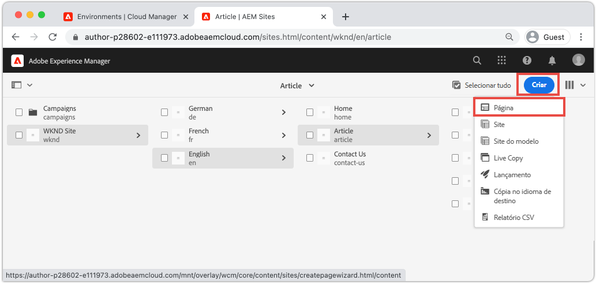

   Isso levará à **Criar página** assistente.

1. Escolha a **Página do artigo** modelo e clique em **Próximo**.

   As páginas em AEM são criadas com base em um modelo de página. Os Modelos de página serão explorados com mais detalhes na variável [Modelos de página](page-templates.md) capítulo.

1. Em **Propriedades** insira um **Título** do &quot;Hello World&quot;.
1. Defina as **Nome** a `hello-world` e clique em **Criar**.

   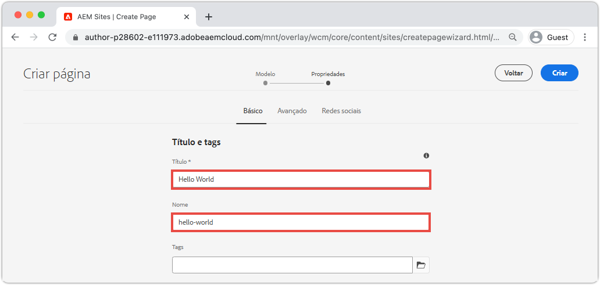

1. No pop-up da caixa de diálogo, clique em **Abrir** para abrir a página recém-criada.

## Criar um componente {#author-component}

AEM Os componentes podem ser considerados como pequenos blocos componentes modulares de uma página da Web. Ao quebrar a interface em partes ou componentes lógicos, é muito mais fácil gerenciar. Para reutilizar componentes, eles devem ser configuráveis. Isso é feito por meio da caixa de diálogo do autor.

AEM fornece um conjunto de [Componentes principais](https://experienceleague.adobe.com/docs/experience-manager-core-components/using/introduction.html?lang=pt-BR) que estejam prontos para uso em produção. O **Componentes principais** ir de elementos básicos como [Texto](https://experienceleague.adobe.com/docs/experience-manager-core-components/using/components/text.html) e [Imagem](https://experienceleague.adobe.com/docs/experience-manager-core-components/using/components/image.html) para elementos de interface mais complexos, como um [Carrossel](https://experienceleague.adobe.com/docs/experience-manager-core-components/using/components/carousel.html).

Em seguida, crie alguns componentes usando o Editor de páginas de AEM.

1. Navegue até o **Hello World** página criada no exercício anterior.
1. Verifique se você está **Editar** e, no painel lateral esquerdo, clique no botão **Componentes** ícone .

   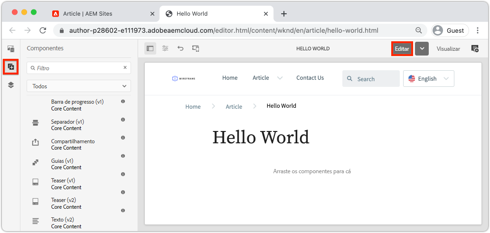

   Isso abrirá a biblioteca de Componentes e listará os Componentes disponíveis que podem ser usados na página.

1. Role para baixo e **Arrastar e soltar** a **Texto (v2)** na região editável principal da página.

   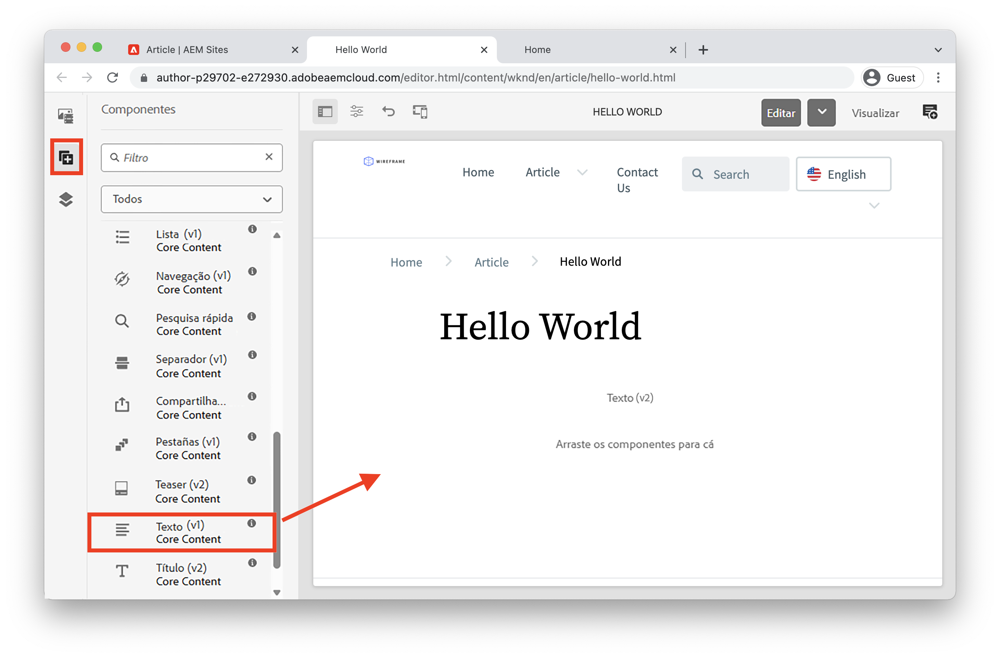

1. Clique no botão **Texto** componente a ser realçado e clique no botão **chave inglesa** ícone  para abrir a caixa de diálogo do Componente. Insira algum texto e salve as alterações na caixa de diálogo.

   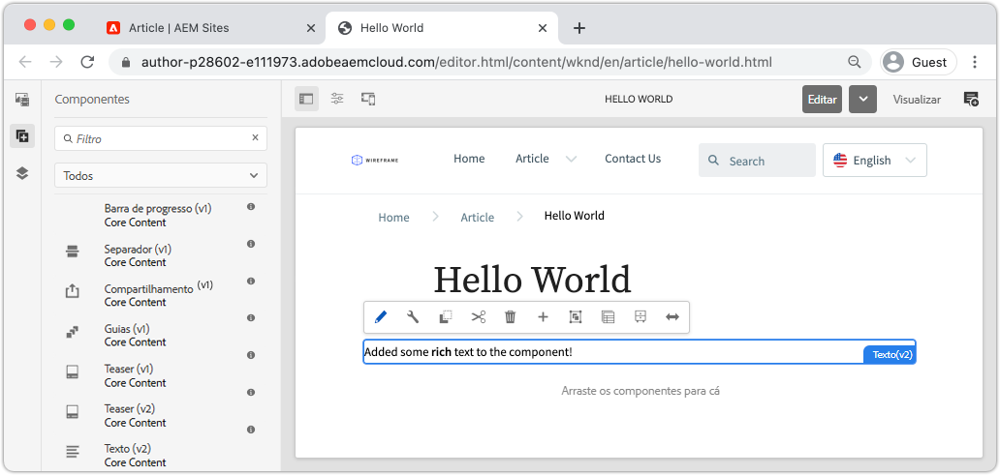

   O **Texto** agora deve exibir o rich text na página.

1. Repita as etapas acima, exceto para arrastar uma instância do **Image(v2)** na página. Abra o **Imagem** caixa de diálogo do componente.

1. No painel esquerdo, alterne para a **Localizador de ativos** clicando no botão **Ativos** ícone .
1. **Arrastar e soltar** uma imagem na caixa de diálogo do Componente e clique em **Concluído** para salvar as alterações.

   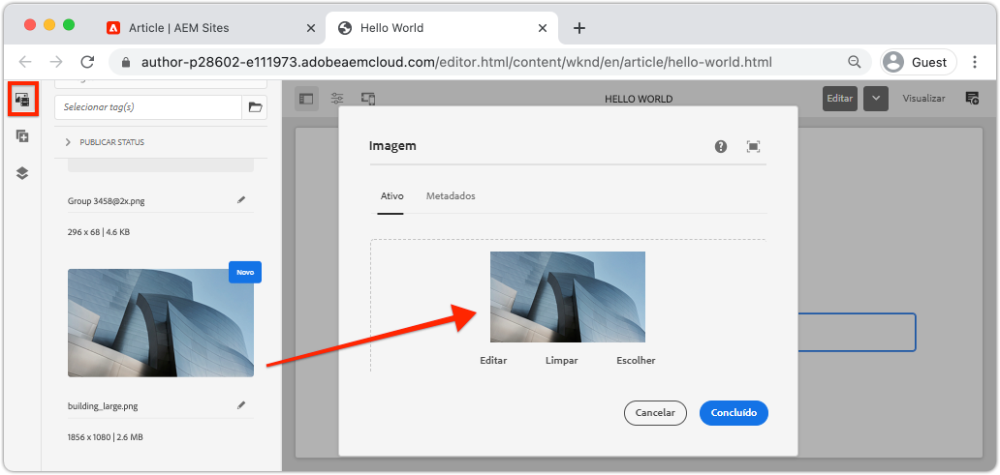

1. Observe que há componentes na página, como o **Título**, **Navegação**, **Pesquisar** que são fixas. Essas áreas são configuradas como parte do Modelo de página e não podem ser modificadas em uma página individual. Isso será mais explorado no próximo capítulo.

Sinta-se à vontade para experimentar alguns dos outros componentes. Documentação sobre cada [O Componente principal pode ser encontrado aqui](https://experienceleague.adobe.com/docs/experience-manager-core-components/using/introduction.html). Uma série detalhada de vídeos sobre [A criação de página pode ser encontrada aqui](https://experienceleague.adobe.com/docs/experience-manager-learn/sites/page-authoring/aem-sites-authoring-overview.html).

## Publicar atualizações {#publish-updates}

AEM ambientes são divididos entre um **Serviço de Autores** e **Serviço de publicação**. Neste capítulo, fizemos várias modificações no site no **Serviço de Autores**. Para que os visitantes do site visualizem as alterações, precisamos publicá-las na **Serviço de publicação**.

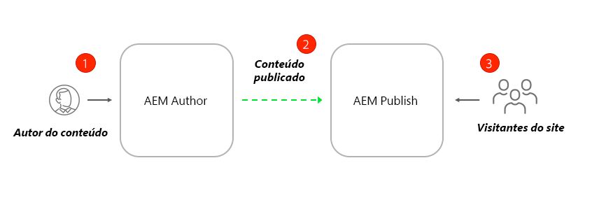

*Fluxo de alto nível de conteúdo de Autor para Publicação*

**1.** Os autores de conteúdo fazem atualizações no conteúdo do site. As atualizações podem ser visualizadas, revisadas e aprovadas para serem colocadas online.

**2.** O conteúdo foi publicado. A publicação pode ser executada sob demanda ou programada para uma data futura.

**3.** Os visitantes do site verão as alterações refletidas no serviço de publicação.

### Publicar as alterações

Em seguida, vamos publicar as alterações.

1. Na tela inicial AEM, acesse **Sites** e selecione o **Site WKND**.
1. Clique no botão **Gerenciar publicação** na barra de menus.

   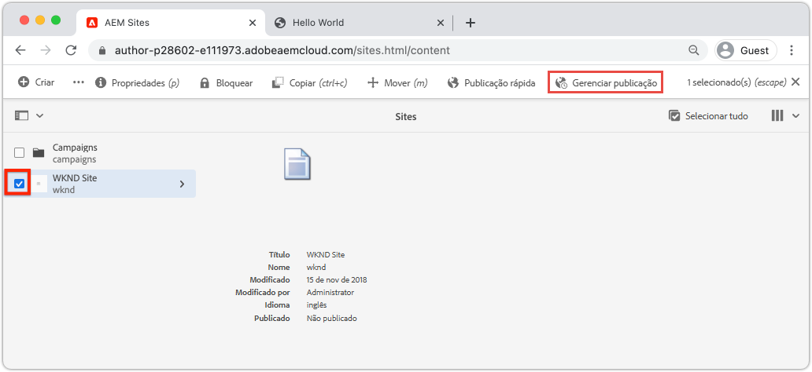

   Como esse site é totalmente novo, queremos publicar todas as páginas e podemos usar o assistente Gerenciar publicação para definir exatamente o que precisa ser publicado.

1. Em **Opções** deixe as configurações padrão como **Publicar** e agendá-lo para **Agora**. Clique em **Avançar**.
1. Em **Escopo**, selecione o **Site WKND** e clique em **Incluir configurações de filhos**. Na caixa de diálogo , marque **Incluir filhos**. Desmarque o restante das caixas para garantir que todo o site seja publicado.

   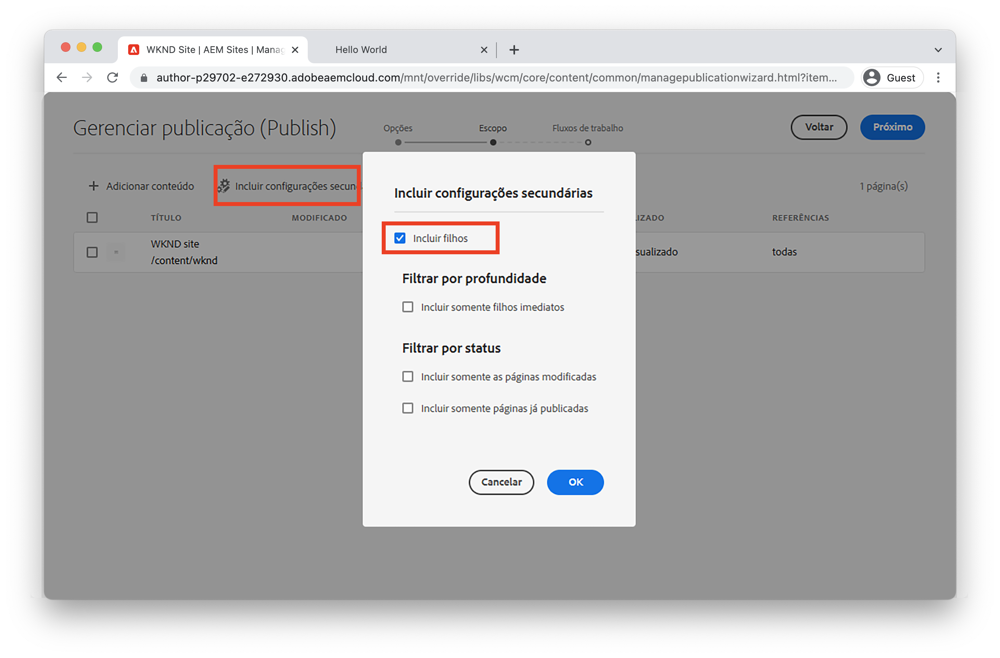

1. Clique no botão **Referências publicadas** botão. Na caixa de diálogo, verifique se tudo está marcado. Isso incluirá a variável **Modelo de site padrão** e várias configurações geradas pelo Modelo de site. Clique em **Concluído** para atualizar.

   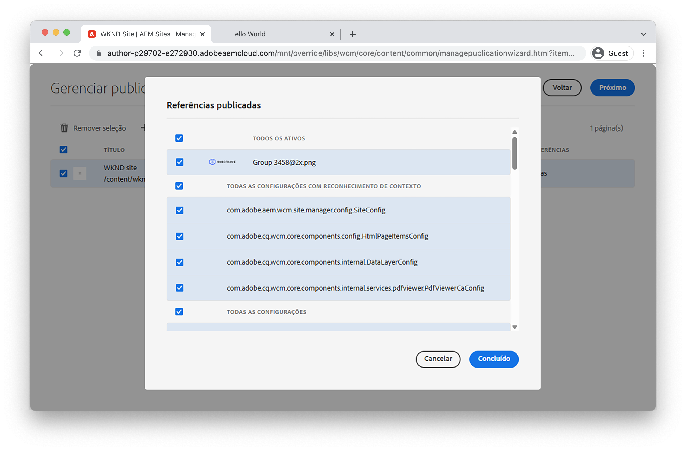

1. Finalmente, marque a caixa ao lado de **Site WKND** e clique em **Próximo** no canto superior direito.
1. No **Fluxos de trabalho** , insira um **Título do fluxo de trabalho**. Pode ser qualquer texto e pode ser útil como parte de uma trilha de auditoria posteriormente. Digite &quot;Initial publish&quot; (Publicação inicial) e clique em **Publicar**.

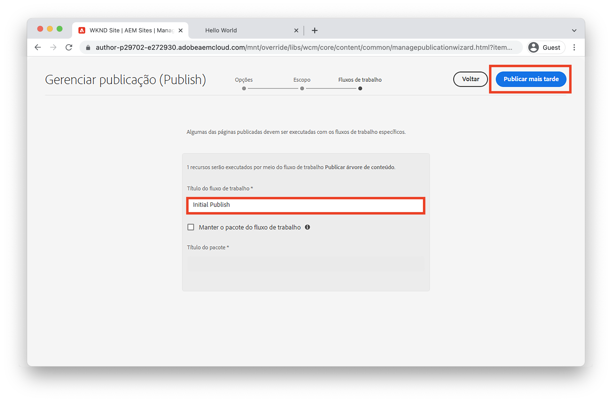

## Exibir conteúdo publicado {#publish}

Em seguida, navegue até o serviço Publicar para exibir as alterações.

1. Uma maneira fácil de obter o URL do serviço de publicação é copiar o url do autor e substituir o `author` palavra com `publish`. Por exemplo:

   * **URL do autor** - `https://author-pYYYY-eXXXX.adobeaemcloud.com/`
   * **Publicar URL** - `https://publish-pYYYY-eXXXX.adobeaemcloud.com/`

1. Adicionar `/content/wknd.html` para o URL de publicação, de modo que o URL final tenha a seguinte aparência: `https://publish-pYYYY-eXXXX.adobeaemcloud.com/content/wknd.html`.

   >[!NOTE]
   >
   > Alterar `wknd.html` para corresponder ao nome do seu site, se você tiver fornecido um nome exclusivo durante [criação do site](create-site.md).

1. Ao navegar até o URL de publicação, você deve ver o site, sem nenhuma das funcionalidades de criação do AEM.

   

1. Usar o **Navegação** clique no menu **Artigo** > **Hello World** para navegar até a página Hello World criada anteriormente.
1. Retorne ao **Serviço de criação do AEM** e faça algumas alterações de conteúdo adicionais no Editor de páginas.
1. Publique essas alterações diretamente no editor de páginas clicando no **Propriedades da página** ícone > **Publicar página**

   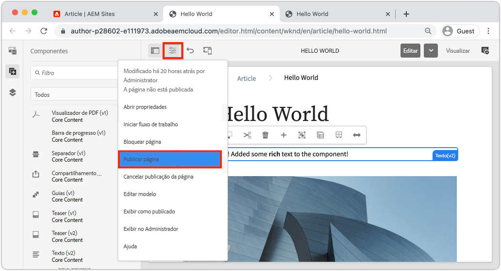

1. Retorne ao **Serviço de publicação do AEM** para exibir as alterações. É mais provável que você **not** veja imediatamente as atualizações. Isso ocorre porque a variável **Serviço de publicação do AEM** inclui [armazenamento em cache por meio de um servidor da Web Apache e CDN](https://experienceleague.adobe.com/docs/experience-manager-cloud-service/implementing/content-delivery/caching.html). Por padrão, o conteúdo de HTML é armazenado em cache por ~5 minutos.

1. Para ignorar o cache para fins de teste/depuração, basta adicionar um parâmetro de consulta como `?nocache=true`. O URL seria semelhante `https://publish-pYYYY-eXXXX.adobeaemcloud.com/content/wknd/en/article/hello-world.html?nocache=true`. Mais detalhes sobre a estratégia de armazenamento em cache e as configurações disponíveis [pode ser encontrada aqui](https://experienceleague.adobe.com/docs/experience-manager-cloud-service/implementing/content-delivery/overview.html).

1. Você também pode encontrar o URL para o Serviço de publicação no Cloud Manager. Navegue até o **Programa Cloud Manager** > **Ambientes** > **Ambiente**.

   

   Em **Segmentos do ambiente** você pode encontrar links para o **Autor** e **Publicar** serviços.

## Parabéns! {#congratulations}

Parabéns, você acabou de criar e publicar as mudanças no seu site AEM!

### Próximas etapas {#next-steps}

Em uma implementação real, o planejamento de um site com modelos e designs de interface do usuário normalmente precede a criação do site. Saiba como os Kits da interface do usuário do Adobe XD podem ser usados para projetar e acelerar sua implementação do Adobe Experience Manager Sites em [Planejamento de interface do usuário com o Adobe XD](./ui-planning-adobe-xd.md).

Deseja continuar a explorar os recursos do AEM Sites? Sinta-se à vontade para entrar diretamente no capítulo em [Modelos de página](./page-templates.md) para entender a relação entre um modelo de página e uma página.

