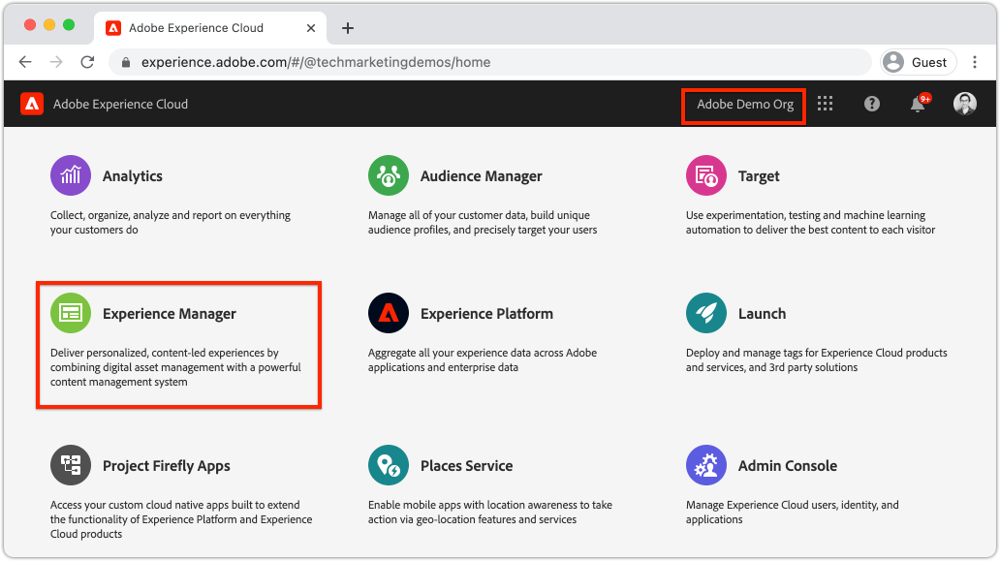
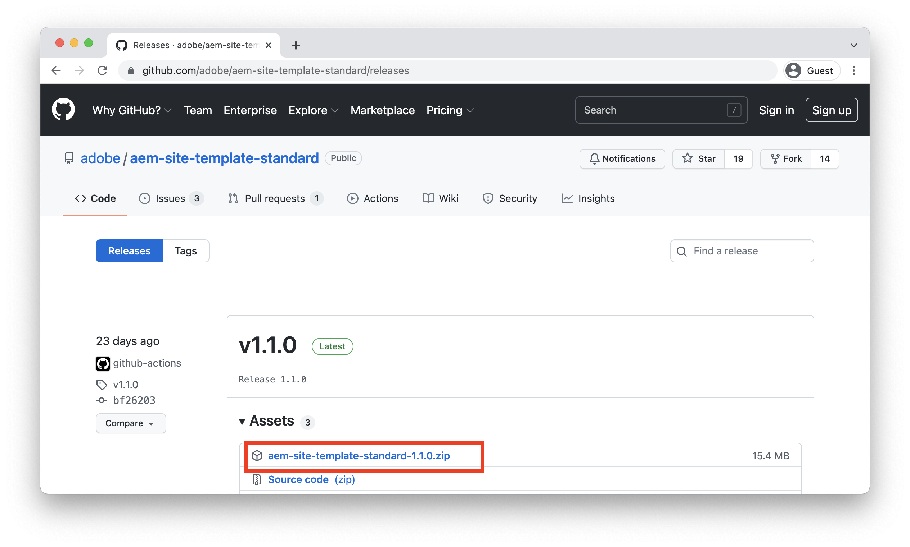

# Criar um site {#create-site}

>[!CAUTION]
>
> No momento, a ferramenta Criação rápida de site é uma visualização técnica. É disponibilizado para fins de ensaio e avaliação e não se destina à utilização da produção, a menos que acordado com o apoio ao Adobe.

Como parte da Criação rápida de sites, use o Assistente de criação de sites no Adobe Experience Manager, AEM, para gerar um novo site. O modelo de site padrão fornecido pelo Adobe é usado como ponto de partida para o novo site.

## Pré-requisitos {#prerequisites}

As etapas neste capítulo ocorrerão em um ambiente Adobe Experience Manager as a Cloud Service. Certifique-se de ter acesso administrativo ao ambiente de AEM. É recomendável usar um [Programa Sandbox](https://experienceleague.adobe.com/docs/experience-manager-cloud-service/onboarding/getting-access/sandbox-programs/introduction-sandbox-programs.html) e [Ambiente de desenvolvimento](https://experienceleague.adobe.com/docs/experience-manager-cloud-service/implementing/using-cloud-manager/manage-environments.html) ao concluir este tutorial.

Revise o [documentação de integração](https://experienceleague.adobe.com/docs/experience-manager-cloud-service/onboarding/home.html) para obter mais detalhes.

## Objetivo {#objective}

1. Saiba como usar o Assistente de criação de site para gerar um novo site.
1. Entender a função dos Modelos de site.
1. Explore o site de AEM gerado.

## Faça logon no Adobe Experience Manager Author {#author}

Como primeira etapa, faça logon no ambiente as a Cloud Service AEM. AEM ambientes são divididos entre um **Serviço de Autores** e **Serviço de publicação**.

* **Serviço de Autores** - onde o conteúdo do site é criado, gerenciado e atualizado. Normalmente, somente os usuários internos têm acesso à variável **Serviço de Autores** e está atrás de uma tela de logon.
* **Serviço de publicação** - hospeda o site ativo. Esse é o serviço que os usuários finais verão e normalmente está disponível publicamente.

A maioria do tutorial ocorrerá usando o **Serviço de Autores**.

1. Navegue até a Adobe Experience Cloud [https://experience.adobe.com/](https://experience.adobe.com/). Faça logon usando sua conta pessoal ou uma conta da empresa/escola.
1. Verifique se a Organização correta está selecionada no menu e clique em **Experience Manager**.

   

1. Em **Cloud Manager** click **Launch**.
1. Passe o mouse sobre o Programa que deseja usar e clique no botão **Programa Cloud Manager** ícone .

   

1. No menu superior, clique em **Ambientes** para exibir os ambientes provisionados.

1. Encontre o ambiente que deseja usar e clique no link **URL do autor**.

   

   >[!NOTE]
   >
   >É recomendável usar um **Desenvolvimento** ambiente para este tutorial.

1. Uma nova guia será iniciada no AEM **Serviço de Autores**. Clique em **Fazer logon com o Adobe** e você deve estar conectado automaticamente com as mesmas credenciais do Experience Cloud.

1. Depois de ser redirecionado e autenticado, você verá a tela inicial AEM.

   

>[!NOTE]
>
> Está tendo problemas para acessar o Experience Manager? Revise o [documentação de integração](https://experienceleague.adobe.com/docs/experience-manager-cloud-service/onboarding/home.html)

## Baixe o modelo básico do site

Um Modelo de site fornece um ponto de partida para um novo site. Um Modelo de site inclui alguns temas básicos, modelos de página, configurações e conteúdo de exemplo. Exatamente o que está incluído no Modelo de site depende do desenvolvedor. O Adobe fornece um **Modelo básico do site** para acelerar novas implementações.

1. Abra uma nova guia do navegador e navegue até o projeto de modelo de site básico no GitHub: [https://github.com/adobe/aem-site-template-standard](https://github.com/adobe/aem-site-template-standard). O projeto é de código aberto e licenciado para ser usado por qualquer pessoa.
1. Clique em **Versões** e navegue até o [versão mais recente](https://github.com/adobe/aem-site-template-standard/releases/latest).
1. Expanda o **Ativos** e baixe o arquivo zip do modelo:

   

   Esse arquivo zip será usado no próximo exercício.

   >[!NOTE]
   >
   > Este tutorial é escrito usando a versão **1.1.0** do Modelo básico do site. Ao iniciar um novo projeto para uso de produção, é sempre recomendável usar a versão mais recente.

## Criar um novo site

Em seguida, gere um novo site usando o Modelo de Site do exercício anterior.

1. Retorne ao ambiente AEM. Na tela inicial AEM, acesse **Sites**.
1. No canto superior direito, clique em **Criar** > **Site (Modelo)**. Isso levará à **Assistente para Criar Site**.
1. Em **Selecionar um modelo de site** clique no botão **Importar** botão.

   Faça upload do **.zip** arquivo de modelo baixado do exercício anterior.

1. Selecione o **Modelo básico AEM site** e clique em **Próximo**.

   

1. Em **Detalhes do site** > **Título do site** enter `WKND Site`.

   Em uma implementação real, &quot;Site WKND&quot; seria substituído pelo nome da marca de sua empresa ou organização. Neste tutorial, estamos simulando a criação de um site para uma marca fictícia de estilo de vida &quot;WKND&quot;.

1. Em **Nome do site** enter `wknd`.

   

   >[!NOTE]
   >
   > Se estiver usando um ambiente de AEM compartilhado, anexe um identificador exclusivo ao **Nome do site**. Por exemplo `wknd-site-johndoe`. Isso garantirá que vários usuários possam concluir o mesmo tutorial, sem conflitos.

1. Clique em **Criar** para gerar o Site. Clique em **Concluído** no **Sucesso** quando AEM terminar de criar o site.

## Explore o novo site

1. Navegue até o console AEM Sites , se ainda não estiver lá.
1. Um novo **Site WKND** foi gerada. Ele incluirá uma estrutura de site com uma hierarquia multilíngue.
1. Abra o **Inglês** > **Início** selecionando a página e clicando no link **Editar** na barra de menus:

   

1. O conteúdo inicial já foi criado e vários componentes estão disponíveis para serem adicionados a uma página. Experimente esses componentes para ter uma ideia da funcionalidade. Você aprenderá as noções básicas de um componente no próximo capítulo.

   

   *Amostra de conteúdo fornecida pelo modelo do site*

## Parabéns! {#congratulations}

Parabéns, você acabou de criar seu primeiro site AEM!

### Próximas etapas {#next-steps}

Use o editor de páginas no Adobe Experience Manager, AEM, para atualizar o conteúdo do site no [Criar conteúdo e publicar](author-content-publish.md) capítulo. Saiba como os Componentes atômicos podem ser configurados para atualizar o conteúdo. Entenda a diferença entre um autor do AEM e ambientes de publicação e saiba como publicar atualizações no site ativo.
