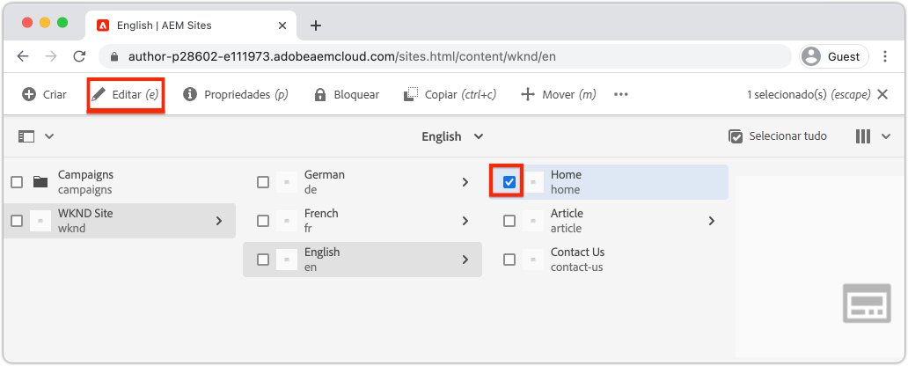

# Criar um site {#create-site}

Como parte da criação rápida de sites, use o assistente de criação de sites do Adobe Experience Manager, AEM, para gerar um novo site. O modelo de site padrão fornecido pela Adobe é usado como ponto de partida para o novo site.

## Pré-requisitos {#prerequisites}

As etapas deste capítulo serão realizadas em um ambiente do Adobe Experience Manager as a Cloud Service. Verifique se você tem acesso administrativo ao ambiente do AEM. É recomendável usar um [Programa de sandbox](https://experienceleague.adobe.com/docs/experience-manager-cloud-service/onboarding/getting-access/sandbox-programs/introduction-sandbox-programs.html?lang=pt-BR) e um [Ambiente de desenvolvimento](https://experienceleague.adobe.com/docs/experience-manager-cloud-service/implementing/using-cloud-manager/manage-environments.html?lang=pt-BR) para realizar este tutorial.

Ambientes do [Programa de produção](https://experienceleague.adobe.com/docs/experience-manager-cloud-service/content/implementing/using-cloud-manager/programs/introduction-production-programs.html?lang=pt-BR) também podem ser usados para este tutorial; no entanto, certifique-se de que as atividades deste tutorial não afetem o trabalho que está sendo executado nos ambientes de destino, pois este tutorial implanta um conteúdo e um código no ambiente de destino do AEM.

O [SDK do AEM](https://experienceleague.adobe.com/pt-br/docs/experience-manager-learn/cloud-service/local-development-environment-set-up/aem-runtime) pode ser usado para partes deste tutorial. Alguns aspectos deste tutorial que dependem dos serviços em nuvem, como a [implantação de temas com o pipeline de front-end do Cloud Manager](https://experienceleague.adobe.com/docs/experience-manager-learn/getting-started-wknd-tutorial-develop/site-template/theming.html?lang=pt-BR), não podem ser executados no SDK do AEM.

Consulte a [documentação de integração](https://experienceleague.adobe.com/docs/experience-manager-cloud-service/onboarding/home.html?lang=pt-BR) para mais detalhes.

## Objetivo {#objective}

1. Aprender a usar o assistente de criação de sites para gerar um novo site.
1. Entender a função dos modelos de site.
1. Explorar o site do AEM gerado.

## Fazer logon no Adobe Experience Manager Author {#author}

A primeira etapa é fazer logon no ambiente do AEM as a Cloud Service. Os ambientes do AEM estão divididos entre um **Serviço de criação** e um **Serviço de publicação**.

* **Serviço de criação**: onde o conteúdo do site é criado, gerenciado e atualizado. Normalmente, apenas usuários internos têm acesso ao **Serviço de criação**, e esse acesso exige que os usuários façam logon.
* **Serviço de publicação**: hospeda o site ativo. Este é o serviço que os usuários finais verão e que normalmente está disponível publicamente.

A maioria dos tutoriais será realizada com o **Serviço de criação**.

1. Navegue até a Adobe Experience Cloud [https://experience.adobe.com/](https://experience.adobe.com/). Faça logon com a sua conta pessoal ou uma conta empresarial/educacional.
1. Certifique-se de que a organização correta esteja selecionada no menu e clique em **Experience Manager**.

   

1. Em **Cloud Manager**, clique em **Iniciar**.
1. Passe cursor do mouse sobre o programa que deseja usar e clique no ícone **Programa do Cloud Manager**.

   

1. No menu superior, clique em **Ambientes** para visualizar os ambientes provisionados.

1. Encontre o ambiente que você deseja usar e clique no **URL de criação**.

   

   >[!NOTE]
   >
   >É recomendável usar um ambiente de **Desenvolvimento** para este tutorial.

1. Uma nova guia é iniciada para o **Serviço de criação** do AEM. Clique em **Fazer logon na Adobe**, e o logon deverá ser feito automaticamente com as mesmas credenciais da Experience Cloud.

1. Após ser redirecionado(a) e autenticado(a), você deverá ver a tela inicial do AEM.

   

>[!NOTE]
>
> Problemas ao acessar o Experience Manager? Consulte a [documentação de integração](https://experienceleague.adobe.com/docs/experience-manager-cloud-service/onboarding/home.html?lang=pt-BR)

## Baixar o modelo de site básico

Um modelo de site fornece um ponto de partida para um novo site. Um modelo de site inclui alguns temas básicos, modelos de página, configurações e conteúdo de amostra. Cabe ao desenvolvedor determinar exatamente o que está incluído no modelo de site. A Adobe fornece um **Modelo de site básico** para acelerar novas implementações.

1. Abra uma nova guia do navegador e navegue até o projeto de modelo de site básico no GitHub: [https://github.com/adobe/aem-site-template-standard](https://github.com/adobe/aem-site-template-standard). O projeto é de código aberto e licenciado para ser usado por qualquer pessoa.
1. Clique em **Versões** e navegue até a [última versão](https://github.com/adobe/aem-site-template-standard/releases/latest).
1. Expanda a lista suspensa de **Ativos** e baixe o arquivo zip do modelo:

   

   Esse arquivo zip será usado no próximo exercício.

   >[!NOTE]
   >
   > Este tutorial foi escrito com a versão **1.1.0** do modelo de site básico. Ao iniciar um novo projeto para uso na produção, é sempre recomendável usar a versão mais recente.

## Criar um novo site

Em seguida, gere um novo site com o modelo de site do exercício anterior.

1. Retorne ao ambiente do AEM. Na tela inicial do AEM, navegue até **Sites**.
1. No canto superior direito, clique em **Criar** > **Site (modelo)**. Isso exibirá o **Assistente de criação de sites**.
1. Em **Selecione um modelo de site**, clique no botão **Importar**.

   Carregue o arquivo **.zip** do modelo baixado no exercício anterior.

1. Selecione o **Modelo de site básico do AEM** e clique em **Próximo**.

   

1. Em **Detalhes do site** > **Título do site**, digite `WKND Site`.

   Em uma implementação real, “Site da WKND” seria substituído pelo nome da marca da sua empresa ou organização. Neste tutorial, estamos simulando a criação de um site para uma marca fictícia de estilo de vida, a “WKND”.

1. Em **Nome do site**, digite `wknd`.

   

   >[!NOTE]
   >
   > Se estiver usando um ambiente do AEM compartilhado, anexe um identificador exclusivo ao **Nome do site**. Por exemplo, `wknd-site-johndoe`. Isso garantirá que vários usuários possam realizar o mesmo tutorial, sem conflitos.

1. Clique em **Criar** para gerar o site. Clique em **Concluído** na caixa de diálogo **Sucesso** quando o AEM terminar de criar o site.

## Explorar o novo site

1. Navegue até o console do AEM Sites, se ainda não estiver nele.
1. Um novo **Site da WKND** foi gerado. Ele incluirá uma estrutura do site com uma hierarquia multilíngue.
1. Abra a página **Inglês** > **Página inicial**, selecionando a página e clicando no botão **Editar** na barra do menu:

   

1. O conteúdo inicial já foi criado, e vários componentes estão disponíveis para ser adicionados a uma página. Experimente esses componentes para ter uma ideia de como funcionam. Você aprenderá as noções básicas dos componentes no próximo capítulo.

   

   *Conteúdo de amostra fornecido pelo modelo de site*

## Parabéns! {#congratulations}

Parabéns, você acabou de criar o seu primeiro site do AEM!

### Próximas etapas {#next-steps}

Use o editor de páginas do Adobe Experience Manager, AEM, para atualizar o conteúdo do site no capítulo [Criar conteúdo e publicar](author-content-publish.md). Saiba como os componentes atômicos podem ser configurados para atualizar o conteúdo. Entenda a diferença entre os ambientes de criação e publicação do AEM, e saiba como publicar atualizações no site ativo.
