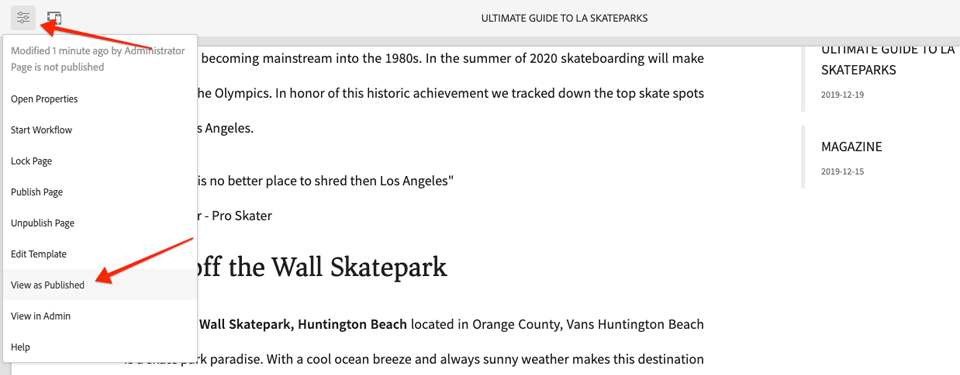
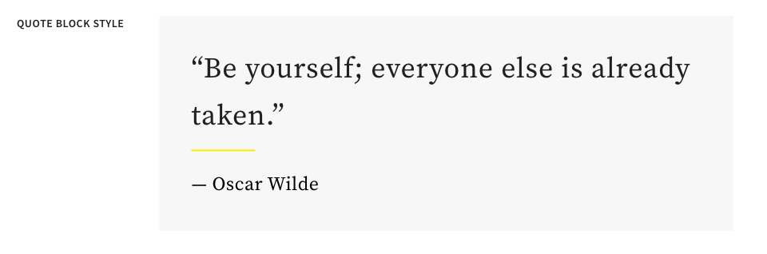
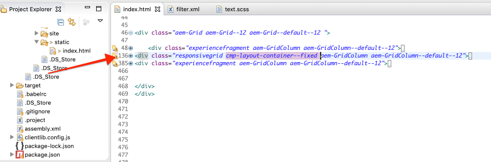
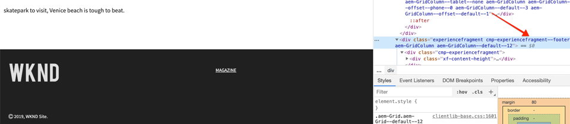

# Desenvolvimento com o sistema de estilo {#developing-with-the-style-system}

Saiba mais sobre como implementar estilos individuais e usar os Componentes principais usando o Sistema de estilo Experience Manager. Este tutorial aborda o desenvolvimento do Sistema de estilo para estender os Componentes principais com CSS específico da marca e configurações avançadas de política do Editor de modelos.

## Pré-requisitos {#prerequisites}

Revise as ferramentas e instruções necessárias para configurar um ambiente [de desenvolvimento](overview.md#local-dev-environment)local.

Também é recomendável revisar o tutorial de Bibliotecas do lado do [cliente e Fluxo de trabalho](client-side-libraries.md) do front-end para entender os fundamentos das bibliotecas do lado do cliente e as várias ferramentas de front-end incorporadas ao projeto do AEM.

### Projeto inicial

Confira o código básico no qual o tutorial se baseia:

1. Clonar o repositório [github.com/adobe/aem-guides-wknd](https://github.com/adobe/aem-guides-wknd) .
1. Confira o `style-system/start` ramo

   ```shell
   $ git clone git@github.com:adobe/aem-guides-wknd.git ~/code/aem-guides-wknd
   $ cd ~/code/aem-guides-wknd
   $ git checkout style-system/start
   ```

1. Implante a base de código para uma instância AEM local usando suas habilidades Maven:

   ```shell
   $ cd ~/code/aem-guides-wknd
   $ mvn clean install -PautoInstallSinglePackage
   ```

Você sempre pode visualização o código finalizado no [GitHub](https://github.com/adobe/aem-guides-wknd/tree/style-system/solution) ou fazer check-out do código localmente ao alternar para a ramificação `style-system/solution`.

## Objetivo

1. Entenda como usar o Sistema de estilo para aplicar CSS específico da marca aos Componentes principais AEM.
1. Saiba mais sobre a notação do BEM e como ela pode ser usada para definir estilos com cuidado.
1. Aplicar configurações avançadas de política com Modelos editáveis.

## O que você vai criar {#what-you-will-build}

Neste capítulo, usaremos o recurso [Sistema de](https://docs.adobe.com/content/help/en/experience-manager-learn/sites/page-authoring/style-system-feature-video-use.html) estilo para criar várias variações de componentes usados na página Artigo. Também usaremos o Sistema de estilo para criar variações para elementos estruturais, como o Container Cabeçalho/Rodapé e Layout.

>[!VIDEO](https://video.tv.adobe.com/v/30386/?quality=12&learn=on)

## Segundo plano {#background}

O Sistema [de](https://docs.adobe.com/content/help/pt-BR/experience-manager-65/developing/components/style-system.translate.html) estilo permite que desenvolvedores e editores de modelo criem várias variações visuais de um componente. Os autores, por sua vez, podem decidir qual estilo usar ao compor uma página. Nós aproveitaremos o Sistema de estilo durante o restante do tutorial para atingir vários estilos únicos, enquanto aproveitamos os Componentes principais em uma abordagem de código baixo.

A ideia geral do Sistema de estilo é que os autores possam escolher vários estilos de como um componente deve ser exibido. Os &quot;estilos&quot; são suportados por classes CSS adicionais que são injetadas na div externa de um componente. Nas bibliotecas do cliente, as regras CSS são adicionadas com base nessas classes de estilo para que o componente altere a aparência.

Você pode encontrar documentação [detalhada para o Sistema de estilo aqui](https://docs.adobe.com/content/help/pt-BR/experience-manager-65/developing/components/style-system.translate.html). Há também um excelente vídeo [técnico para entender o Sistema](https://docs.adobe.com/content/help/en/experience-manager-learn/sites/developing/style-system-technical-video-understand.html)de estilo.

## Estilo do componente de título {#title-component}

Nesse ponto, o Componente [](https://docs.adobe.com/content/help/en/experience-manager-core-components/using/components/title.html) Title foi anexado ao projeto em `/apps/wknd/components/content/title` como parte do módulo **ui.apps** . Os estilos padrão dos elementos Cabeçalho (`H1`, `H2`, `H3`...) já foram implementados no módulo **ui.frontenda** no `_elements.scss` arquivo em `ui.frontend/src/main/webpack/base/sass/_elements.scss`.

### Estilo sublinhado

Os designs [do artigo](assets/pages-templates/wknd-article-design.xd) WKND contêm um estilo exclusivo para o componente Título com um sublinhado. Em vez de criar dois componentes ou modificar a caixa de diálogo do componente, o Sistema de estilo pode ser usado para permitir que os autores adicionem uma opção de estilo sublinhado.


### Marcação do componente do título do Inspect

Como um desenvolvedor de front-end, a primeira etapa para estilizar um componente principal é entender a marcação gerada pelo componente.

Como parte do projeto gerado, o arquétipo incorporou o projeto **Principais exemplos** de componentes. Para desenvolvedores e autores de conteúdo, isso contém uma referência fácil para entender todos os recursos disponíveis com os Componentes principais. Uma versão ao vivo também está [disponível](https://opensource.adobe.com/aem-core-wcm-components/library.html).

1. Abra um novo navegador e visualização o componente Título:

   Instância AEM local: [http://localhost:4502/editor.html/content/core-components-examples/library/title.html](http://localhost:4502/editor.html/content/core-components-examples/library/title.html)

   Exemplo ao vivo: [https://opensource.adobe.com/aem-core-wcm-components/library/title.html](https://opensource.adobe.com/aem-core-wcm-components/library/title.html)

1. Abaixo está a marcação do componente Título:

   ```html
   <div class="cmp-title">
       <h1 class="cmp-title__text">Lorem Ipsum</h1>
   </div>
   ```

   A notação BEM do componente Título:

   ```plain
   BLOCK cmp-title
       ELEMENT cmp-title__text
   ```

1. O sistema Style adiciona uma classe CSS à div externa ao redor do componente. Portanto, a marcação a ser direcionada será semelhante a algo como o seguinte:

   ```html
   <div class="STYLE-SYSTEM-CLASS-HERE"> <!-- Custom CSS class - implementation gets to define this -->
       <div class="cmp-title">
           <h1 class="cmp-title__text">Lorem Ipsum</h1>
       </div>
   </div>
   ```

### Implementação do estilo sublinhado - ui.frontenda

Em seguida, implementaremos o estilo sublinhado usando o módulo **ui.frontenda** do nosso projeto. Usaremos o servidor de desenvolvimento de webpack fornecido com o módulo **ui.front-end** para pré-visualização dos estilos *antes* de implantar em uma instância local do AEM.

1. Start o servidor de desenvolvimento de webpack executando o seguinte comando no módulo **ui.frontender** :

   ```shell
   $ cd ~/code/aem-guides-wknd/ui.frontend/
   $ npm start
   
   > aem-maven-archetype@1.0.0 start code/aem-guides-wknd/ui.frontend
   > webpack-dev-server --open --config ./webpack.dev.js
   ```

   Isso deve abrir um navegador em [http://localhost:8080](http://localhost:8080).

   >[!NOTE]
   >
   > Se as imagens parecerem quebradas, verifique se o projeto inicial foi implantado em uma instância local do AEM (em execução na porta 4502) e se o navegador usado também se conectou à instância AEM local.

   

1. No Eclipse ou no IDE de sua escolha, abra o arquivo `index.html` localizado em: `ui.frontend/src/main/webpack/static/index.html`. Esta é a marcação estática usada pelo servidor de desenvolvimento de webpack.
1. Em `index.html` encontrar uma instância do Componente de título para adicionar o estilo sublinhado, pesquisando o documento por *cmp-title*. Escolha o componente Título com o texto *&quot;Vans off the Wall Skatepark&quot;* (linha 218). Adicione a classe `cmp-title--underline` ao div circundante:

   ```html
    <!-- before -->
    <div class="title aem-GridColumn aem-GridColumn--default--8">
        <div class="cmp-title">
            <h2 class="cmp-title__text">Vans off the Wall Skatepark</h2>
        </div>
    </div>
   ```

   ```html
    <!-- After -->
    <div class="cmp-title--underline title aem-GridColumn aem-GridColumn--default--8">
        <div class="cmp-title">
            <h2 class="cmp-title__text">Vans off the Wall Skatepark</h2>
        </div>
    </div>
   ```

1. Retorne ao navegador e verifique se a classe extra está refletida na marcação.
1. Retorne ao módulo **ui.front** e atualize o arquivo `title.scss` localizado em: `ui.frontend/src/main/webpack/components/content/title/scss/title.scss`:

   ```css
   /* Add Title Underline Style */
   .cmp-title--underline {
   
       .cmp-title {
       }
   
       .cmp-title__text {
           &:after {
           display: block;
               width: 84px;
               padding-top: 8px;
               content: '';
               border-bottom: 2px solid $brand-primary;
           }
       }
   }
   ```

   >[!NOTE]
   >
   >É considerada uma prática recomendada sempre aplicar estilos de escopo apertado ao componente do público alvo. Isso garante que os estilos extras não afetem outras áreas da página.
   >
   >Todos os componentes principais seguem a notação **[do](https://github.com/adobe/aem-core-wcm-components/wiki/css-coding-conventions)** BEM. É uma prática recomendada público alvo da classe CSS externa ao criar um estilo padrão para um componente. Outra prática recomendada é usar nomes de classe de público alvo especificados pela notação BEM do componente principal em vez de elementos HTML.

1. Retorne ao navegador mais uma vez e você deve ver o estilo sublinhado adicionado:

   

1. Pare o servidor de desenvolvimento de webpack.

### Adicionar uma política de título

Em seguida, precisamos adicionar uma nova política para os componentes de Título para permitir que os autores de conteúdo escolham o estilo de sublinhado a ser aplicado a componentes específicos. Isso é feito usando o Editor de modelos no AEM.

1. Implante a base de código para uma instância AEM local usando suas habilidades Maven:

   ```shell
   $ cd ~/code/aem-guides-wknd
   $ mvn clean install -PautoInstallSinglePackage
   ```

1. Navegue até o Modelo **de Página de** Artigo localizado em: [http://localhost:4502/editor.html/conf/wknd/settings/wcm/templates/article-page-template/structure.html](http://localhost:4502/editor.html/conf/wknd/settings/wcm/templates/article-page-template/structure.html).

1. No modo **Estrutura** , no Container **principal** Layout, selecione o ícone **Política** ao lado do componente **Título** listado em Componentes ** permitidos:

   

1. Crie uma nova política para o componente Título com os seguintes valores:

   *Título da política **: **Título da WKND**

   *Propriedades* > Guia *Estilos >* *Adicionar um novo estilo*

   **Sublinhado** : `cmp-title--underline`

   

   Clique em **Concluído** para salvar as alterações na política Título.

   >[!NOTE]
   >
   > O valor `cmp-title--underline` corresponde à classe CSS que definimos anteriormente ao desenvolver no módulo **ui.frontenda** .

### Aplicar o estilo sublinhado

Por fim, como autor, podemos optar por aplicar o estilo sublinhado a determinados Componentes do título.

1. Navegue até o artigo **La Skatepark** no editor da AEM Sites em: [http://localhost:4502/editor.html/content/wknd/us/en/magazine/guide-la-skateparks.html](http://localhost:4502/editor.html/content/wknd/us/en/magazine/guide-la-skateparks.html)
1. No modo **Editar** , escolha um componente Título. Clique no ícone de **pincel** e selecione o estilo de **sublinhado** :

   

   Como autor, você deve ser capaz de ativar/desativar o estilo.

1. Clique no ícone Informações **da** página > **Visualização como publicada** para inspecionar a página fora AEM editor.

   

   Use as ferramentas do desenvolvedor do navegador para verificar se a marcação em torno do componente Título tem a classe CSS aplicada `cmp-title--underline` à div externa.

## Estilo do componente de texto {#text-component}

Em seguida, repetiremos etapas semelhantes para aplicar um estilo exclusivo ao Componente [de](https://docs.adobe.com/content/help/pt/experience-manager-core-components/using/components/text.html)texto. O componente de Texto foi enviado por proxy para o projeto em `/apps/wknd/components/content/text` como parte do módulo **ui.apps** . Os estilos padrão dos elementos de parágrafo já foram implementados no módulo **ui.frontenda** no `_elements.scss` arquivo em `ui.frontend/src/main/webpack/base/sass/_elements.scss`.

### Estilo de bloco de aspas

Os designs [do artigo](assets/pages-templates/wknd-article-design.xd) WKND contêm um estilo exclusivo para o componente Texto com um bloco de aspas:



### Marcação do componente de texto da Inspect

Mais uma vez, inspecionaremos a marcação do componente de Texto.

1. Abra um novo navegador e visualização o componente de Texto como parte da Biblioteca de componentes principais:
Instância AEM local: [http://localhost:4502/editor.html/content/core-components-examples/library/text.html](http://localhost:4502/editor.html/content/core-components-examples/library/text.html)

   Exemplo ao vivo: [https://opensource.adobe.com/aem-core-wcm-components/library/text.html](https://opensource.adobe.com/aem-core-wcm-components/library/text.html)

1. Abaixo está a marcação do componente Texto:

   ```html
   <div class="cmp-text">
       <p><b>Bold </b>can be used to emphasize a word or phrase, as can <u>underline</u> and <i>italics.&nbsp;</i><sup>Superscript</sup> and <sub>subscript</sub> are useful for mathematical (E = mc<sup>2</sup>) or scientific (h<sub>2</sub>O) expressions. Paragraph styles can provide alternative renderings, such as quote sections:</p>
       <blockquote>"<i>Be yourself; everyone else is already taken"</i></blockquote>
       <b>- Oscar Wilde</b>
   </div>
   ```

   A notação BEM do componente Título:

   ```plain
   BLOCK cmp-text
       ELEMENT
   ```

1. O sistema Style adiciona uma classe CSS à div externa ao redor do componente. Portanto, a marcação a ser direcionada será semelhante a algo como o seguinte:

   ```html
   <div class="STYLE-SYSTEM-CLASS-HERE"> <!-- Custom CSS class - implementation gets to define this -->
       <div class="cmp-text">
           <p><b>Bold </b>can be used to emphasize a word or phrase, as can <u>underline</u> and <i>italics.&nbsp;</i><sup>Superscript</sup> and <sub>subscript</sub> are useful for mathematical (E = mc<sup>2</sup>) or scientific (h<sub>2</sub>O) expressions. Paragraph styles can provide alternative renderings, such as quote sections:</p>
           <blockquote>"<i>Be yourself; everyone else is already taken"</i></blockquote>
           <b>- Oscar Wilde</b>
       </div>
   </div>
   ```

### Implementar o estilo de bloco de aspas - ui.frontenda

Em seguida, implementaremos o estilo de bloco de cotação usando o módulo **ui.frontenda** do nosso projeto.

1. Start o servidor de desenvolvimento de webpack executando o seguinte comando no módulo **ui.frontender** :

   ```shell
   $ cd ~/code/aem-guides-wknd/ui.frontend/
   $ npm start
   
   > aem-maven-archetype@1.0.0 start code/aem-guides-wknd/ui.frontend
   > webpack-dev-server --open --config ./webpack.dev.js
   ```

1. No Eclipse ou no IDE de sua escolha, abra o arquivo `index.html` localizado em: `ui.frontend/src/main/webpack/static/index.html`. Esta é a marcação estática usada pelo servidor de desenvolvimento de webpack.
1. Em `index.html` encontrar uma instância do Componente de texto, pesquisando pelo texto *&quot;Jacob Wester&quot;* (linha 210). Adicione a classe `cmp-text--quote` ao div circundante:

   ```html
    <!-- before -->
    <div class="text aem-GridColumn aem-GridColumn--default--8">
        <div class="cmp-text">
            <blockquote>"There is no better place to shred then Los Angeles"</blockquote>
            <p>Jacob Wester - Pro Skater</p>
        </div>
    </div>
   ```

   ```html
    <!-- After -->
    <div class="cmp-text--quote text aem-GridColumn aem-GridColumn--default--8">
        <div class="cmp-text">
            <blockquote>"There is no better place to shred then Los Angeles"</blockquote>
            <p>Jacob Wester - Pro Skater</p>
        </div>
    </div>
   ```

1. Retorne ao navegador e verifique se a classe extra está refletida na marcação.
1. Retorne ao módulo **ui.front** e atualize o arquivo `text.scss` localizado em: `ui.frontend/src/main/webpack/components/content/text/scss/text.scss`:

   ```css
   /* WKND Text Quote style */
   
   .cmp-text--quote {
   
       .cmp-text {
           background-color: $brand-third;
           margin: 1em 0em;
           padding: 1em;
   
           blockquote {
               border: none;
               font-size: $font-size-h2;
               font-family: $font-family-serif;
               padding: 14px 14px;
               margin: 0;
               margin-bottom: 0.5em;
   
               &:after {
                   border-bottom: 2px solid $brand-primary; /*yellow border */
                   content: '';
                   display: block;
                   position: relative;
                   top: 0.25em;
                   width: 80px;
               }
           }
   
           p {
               font-size:    $font-size-large;
               font-family:  $font-family-serif;
           }
       }
   }
   ```

   >[!CAUTION]
   >
   > Nesse caso, os elementos HTML brutos são direcionados pelos estilos. Isso ocorre porque o componente Texto fornece um Editor de Rich Text para autores de conteúdo. A criação de estilos diretamente em relação ao conteúdo RTE deve ser feita com cuidado e é ainda mais importante aplicar um escopo mais restrito aos estilos.

1. Retorne ao navegador mais uma vez e você deve ver o estilo de bloco Cotação adicionado:

   

1. Pare o servidor de desenvolvimento de webpack.

### Adicionar uma política de texto

Em seguida, adicione uma nova política para os componentes de Texto.

1. Implante a base de código para uma instância AEM local usando suas habilidades Maven:

   ```shell
   $ cd ~/code/aem-guides-wknd
   $ mvn clean install -PautoInstallSinglePackage
   ```

1. Navegue até o Modelo **de Página de** Artigo localizado em: [http://localhost:4502/editor.html/conf/wknd/settings/wcm/templates/article-page-template/structure.html](http://localhost:4502/editor.html/conf/wknd/settings/wcm/templates/article-page-template/structure.html).

1. No modo **Estrutura** , no Container **principal** Layout, selecione o ícone **Política** ao lado do componente **Texto** listado em *Componentes* permitidos:

   

1. Crie uma nova política para o componente de Texto com os seguintes valores:

   *Título da política **: **Texto WKND**

   *Plug-ins* > Estilos *de parágrafo* > *Ativar estilos de parágrafo*

   *Guia* Estilos > *Adicionar um novo estilo*

   **Bloco** de aspas: `cmp-text--quote`

   

   

   Clique em **Concluído** para salvar as alterações na política de texto.

### Aplicar o estilo de bloco de aspas

1. Navegue até o artigo **La Skatepark** no editor da AEM Sites em: [http://localhost:4502/editor.html/content/wknd/us/en/magazine/guide-la-skateparks.html](http://localhost:4502/editor.html/content/wknd/us/en/magazine/guide-la-skateparks.html)
1. No modo **Editar** , escolha um componente de Texto. Edite o componente para incluir um elemento de citação:

   

1. Selecione o componente de texto e clique no ícone de **pincel** e selecione o estilo de bloco **de** aspas:

   

   Como autor, você deve ser capaz de ativar/desativar o estilo.

## Contêiner de layout {#layout-container}

Os Container de layout foram usados para criar a estrutura básica do Modelo de página de artigo e fornecer as zonas de soltar para que os autores de conteúdo adicionem conteúdo a uma página. Os Container de layout também podem aproveitar o Sistema de estilo, fornecendo aos autores de conteúdo ainda mais opções para criar layouts.

Atualmente, uma regra CSS é aplicada a toda a página que impõe uma largura fixa. Em vez disso, uma abordagem mais flexível é criar um estilo de Largura **** fixa que os autores de conteúdo podem ativar/desativar.

### Implementação do estilo de largura fixa - ui.frontenda

Start implementar o estilo Largura fixa no módulo **ui.frontenda** do nosso projeto.

1. Start o servidor de desenvolvimento de webpack executando o seguinte comando no módulo **ui.frontender** :

   ```shell
   $ cd ~/code/aem-guides-wknd/ui.frontend/
   $ npm start
   ```

1. Open the file `index.html` located at: `ui.frontend/src/main/webpack/static/index.html`.
1. Queremos tornar o corpo de nosso Modelo de página de artigo de largura fixa, deixando o Cabeçalho e o Rodapé livres para expandir mais. Portanto, queremos público alvo do segundo `<div class='responsivegrid aem-GridColumn aem-GridColumn--default--12'` (Container de layout) entre os dois Fragmentos de experiência (linha 136)

   

1. Adicione a classe `cmp-layout-container--fixed` à classe `div` identificada na etapa anterior.

   ```html
   <!-- Experience Fragment Header -->
   <div class="experiencefragment aem-GridColumn aem-GridColumn--default--12">
       ...
   </div>
   <!-- Main body Layout Container -->
   <div class="responsivegrid cmp-layout-container--fixed aem-GridColumn aem-GridColumn--default--12">
       ...
   </div>
   <!-- Experience Fragment Footer -->
   <div class="experiencefragment aem-GridColumn aem-GridColumn--default--12">
       ...
   </div>
   ```

1. Atualize o arquivo `container.scss` localizado em: `ui.frontend/src/main/webpack/components/content/container/scss/container.scss`:

   ```css
   /* WKND Layout Container - Fixed Width */
   
   .cmp-layout-container--fixed {
       @media (min-width: $screen-medium + 1) {
           display:block;
           max-width:  $max-width !important;
           float: unset !important;
           margin: 0 auto !important;
           padding: 0 $gutter-padding;
           clear: both !important;
       }
   }
   ```

1. Atualize o arquivo `_elements.scss` localizado em: `ui.frontend/src/main/webpack/base/sass/_elements.scss` e altere a `.root` regra para ter uma nova largura máxima definida para a variável `$max-body-width`.

   ```css
    /* Before */
    body {
        ...
   
        .root {
            max-width: $max-width;
            margin: 0 auto;
            padding-top: 12px;
        }
    }
   ```

   ```css
    /* After */
    body {
        ...
   
        .root {
            max-width: $max-body-width;
            margin: 0 auto;
            padding-top: 12px;
        }
    }
   ```

   >[!NOTE]
   >
   > A lista completa de variáveis e valores pode ser encontrada em: `ui.frontend/src/main/webpack/base/sass/_variables.scss`.

1. Ao retornar ao navegador, você deve ver que o conteúdo principal da página é exibido da mesma forma, mas o cabeçalho e o rodapé são muito mais amplos. Isso é esperado.

   

### Atualizar a política de Container de layout

Em seguida, adicionaremos o estilo Largura fixa atualizando as políticas de Container de layout no AEM.

1. Implante a base de código para uma instância AEM local usando suas habilidades Maven:

   ```shell
   $ cd ~/code/aem-guides-wknd
   $ mvn clean install -PautoInstallSinglePackage
   ```

1. Navegue até o Modelo **de Página de** Artigo localizado em: [http://localhost:4502/editor.html/conf/wknd/settings/wcm/templates/article-page-template/structure.html](http://localhost:4502/editor.html/conf/wknd/settings/wcm/templates/article-page-template/structure.html).

1. No modo **Estrutura** , selecione o Container **principal de** Layout (entre o cabeçalho e o rodapé do fragmento de experiência ) e selecione o ícone **Política** .

   

1. Atualize a política padrão **do site** WKND para incluir um estilo adicional para Largura **** fixa com um valor de `cmp-layout-container--fixed`:

   

   Salve as alterações e consulte a página Modelo de página do artigo.

1. Selecione novamente o Container **principal de** layout (entre o cabeçalho e o rodapé do fragmento de experiência). Desta vez, o ícone do **pincel** deve aparecer e você pode selecionar Largura **** fixa no menu suspenso de estilo.

   

   Você deve poder ativar/desativar os estilos.

1. Navegue até o artigo **La Skatepark** no editor da AEM Sites em: [http://localhost:4502/editor.html/content/wknd/us/en/magazine/guide-la-skateparks.html](http://localhost:4502/editor.html/content/wknd/us/en/magazine/guide-la-skateparks.html). Você deve ver o container de largura fixa em ação.

## Cabeçalho/rodapé - Fragmento de experiência {#experience-fragment}

Em seguida, adicionaremos estilos ao cabeçalho e rodapé para finalizar o modelo de página do artigo. O cabeçalho e o rodapé foram implementados como um Fragmento de experiência, que é um agrupamento de componentes dentro de um container. Podemos aplicar uma classe CSS exclusiva aos componentes do Fragmento de experiência, assim como outros componentes principais com o Sistema de estilo.

### Implementação do estilo do cabeçalho - ui.frontenda

Os componentes dentro do componente Cabeçalho já têm o estilo de corresponder aos designs [do](assets/pages-templates/wknd-article-design.xd)Adobe XD, apenas algumas pequenas modificações no layout são necessárias.

1. Start o servidor de desenvolvimento de webpack executando o seguinte comando no módulo **ui.frontender** :

   ```shell
   $ cd ~/code/aem-guides-wknd/ui.frontend/
   $ npm start
   ```

1. Open the file `index.html` located at: `ui.frontend/src/main/webpack/static/index.html`.
1. Encontre a **primeira** instância do componente Fragmento de experiência pesquisando por *class=&quot;experience* (Linha 48).
1. Adicione a classe `cmp-experiencefragment--header` à classe `div` identificada na etapa anterior.

   ```html
       ...
       <div class="root responsivegrid">
           <div class="aem-Grid aem-Grid--12 aem-Grid--default--12 ">
   
           <!-- add cmp-experiencefragment--header -->
           <div class="experiencefragment cmp-experiencefragment--header aem-GridColumn aem-GridColumn--default--12">
               ...
   ```

1. Open the file `experiencefragment.scss` located at: `ui.frontend/src/main/webpack/components/content/experiencefragment/scss/experiencefragment.scss`. Anexe os seguintes estilos ao arquivo:

   ```css
   /* Header Style */
   .cmp-experiencefragment--header {
   
       .cmp-experiencefragment {
           max-width: $max-width;
           margin: 0 auto;
       }
   
       /* Logo Image */
       .cmp-image__image {
           max-width: 8rem;
           margin-top: $gutter-padding / 2;
           margin-bottom: $gutter-padding / 2;
       }
   
       @media (max-width: $screen-medium) {
   
           .cmp-experiencefragment {
               padding-top: 1rem;
               padding-bottom: 1rem;
           }
           /* Logo Image */
           .cmp-image__image {
               max-width: 6rem;
               margin-top: .75rem;
           }
       }
   }
   ```

   >[!CAUTION]
   >
   > Estamos usando um atalho aqui para criar o estilo do Logotipo no cabeçalho. O Logotipo é apenas um componente de Imagem que está dentro do Fragmento de experiência. Digamos que depois, precisávamos adicionar outra imagem ao cabeçalho, não conseguiríamos diferenciar entre os dois. Se necessário, uma classe &quot;logo&quot; pode ser sempre adicionada ao componente de Imagem aqui.

1. Retorne ao navegador e visualização o servidor de desenvolvimento de webpack. Os estilos de cabeçalho devem ser atualizados para ficarem mais alinhados ao restante do conteúdo. Ao diminuir o navegador para a largura de um tablet/dispositivo móvel, você também deve notar que o logotipo é dimensionado de forma mais apropriada.

   

### Implementação do estilo do rodapé - ui.frontende

O rodapé nos designs [do](assets/pages-templates/wknd-article-design.xd) Adobe XD inclui um plano de fundo preto com texto claro. Será necessário criar um estilo para o conteúdo em nosso rodapé do fragmento de experiência para refletir isso.

1. Open the file `index.html` located at: `ui.frontend/src/main/webpack/static/index.html`.

1. Localize a **segunda** instância do componente Fragmento de experiência pesquisando por *class=&quot;experiencefragment* (Linha 385).

1. Adicione a classe `cmp-experiencefragment--footer` à classe `div` identificada na etapa anterior.

   ```html
   <!-- add cmp-experiencefragment--footer -->
   <div class="experiencefragment cmp-experiencefragment--footer aem-GridColumn aem-GridColumn--default--12">
   ```

1. Reabra o arquivo `experiencefragment.scss` localizado em: `ui.frontend/src/main/webpack/components/content/experiencefragment/scss/experiencefragment.scss`. **Anexe** os seguintes estilos ao arquivo:

   ```css
   /* Footer Style */
   .cmp-experiencefragment--footer {
   
       background-color: $black;
       color: $gray-light;
       margin-top: 5rem;
   
       p {
           font-size: $font-size-small;
       }
   
       .cmp-experiencefragment {
           max-width: $max-width;
           margin: 0 auto;
           padding-bottom: 0rem;
       }
   
       /* Separator */
       .cmp-separator {
           margin-top: 2rem;
           margin-bottom: 2rem;
       }
   
       .cmp-separator__horizontal-rule {
           border: 0;
       }
   
       /* Navigation */
       .cmp-navigation__item-link {
           color: $nav-link-inverse;
           &:hover,
           &:focus {
               background-color: unset;
               text-decoration: underline;
           }
       }
   
       .cmp-navigation__item--level-1.cmp-navigation__item--active .cmp-navigation__item-link {
           background-color: unset;
           color: $gray-lighter;
           text-decoration: underline;
       }
   
   }
   ```

   >[!CAUTION]
   >
   > Novamente, estamos usando um atalho substituindo os estilos padrão do componente Navegação de dentro do CSS do rodapé do fragmento de experiência. É improvável que haja vários componentes de Navegação no rodapé e também é improvável que um autor de conteúdo queira alternar um estilo de navegação. Uma prática melhor seria criar um estilo de rodapé apenas para o componente de Navegação.

1. Retorne ao navegador e ao servidor de desenvolvimento de webpack. Os estilos de rodapé devem ser atualizados para corresponder mais aos designs de XD.

   

1. Pare o servidor de desenvolvimento de webpack.

### Atualizar a política de fragmento de experiência

Em seguida, adicionaremos os estilos Cabeçalho e Rodapé atualizando a política do componente Fragmento de experiência no AEM.

1. Implante a base de código para uma instância AEM local usando suas habilidades Maven:

   ```shell
   $ cd ~/code/aem-guides-wknd
   $ mvn clean install -PautoInstallSinglePackage
   ```

1. Navegue até o Modelo **de Página de** Artigo localizado em: [http://localhost:4502/editor.html/conf/wknd/settings/wcm/templates/article-page-template/structure.html](http://localhost:4502/editor.html/conf/wknd/settings/wcm/templates/article-page-template/structure.html).

1. No modo **Estrutura** , selecione Fragmento **de** experiência do cabeçalho e selecione o ícone **Política** .

   

1. Atualize o fragmento de experiência do site **WKND - política de cabeçalho** para adicionar uma classe **CSS** padrão com um valor de `cmp-experiencefragment--header`:

   

   Salve as alterações e agora você deve ver os estilos CSS de cabeçalho apropriados aplicados.

   >[!NOTE]
   >
   > Como não há necessidade de alternar o estilo Cabeçalho para além do modelo, podemos simplesmente defini-lo como o estilo CSS Padrão.

1. Em seguida, selecione o Fragmento **de** experiência de rodapé e clique no ícone de **Política** para abrir a configuração de Política.

1. Atualize o fragmento de experiência do site **WKND - política de rodapé** para adicionar uma classe **CSS** padrão com um valor de `cmp-experiencefragment--footer`:

   

   Salve as alterações e você deverá ver os estilos de CSS do rodapé aplicados.

   

1. Navegue até o artigo **La Skatepark** no editor da AEM Sites em: [http://localhost:4502/editor.html/content/wknd/us/en/magazine/guide-la-skateparks.html](http://localhost:4502/editor.html/content/wknd/us/en/magazine/guide-la-skateparks.html). Você deve ver o cabeçalho e o rodapé atualizados aplicados.

## Análise {#review}

Analise os estilos e recursos implementados como parte do capítulo.

>[!VIDEO](https://video.tv.adobe.com/v/30378/?quality=12&learn=on)

## Parabéns! {#congratulations}

Parabéns, a Página do artigo está quase completamente estilizada e você ganhou uma experiência prática usando o Sistema de estilo AEM.

### Próximas etapas {#next-steps}

Saiba mais sobre as etapas completas para criar um Componente [de AEM](custom-component.md) personalizado que exibe o conteúdo criado em uma caixa de diálogo e explora o desenvolvimento de um Modelo Sling para encapsular a lógica comercial que preenche o HTL do componente.

Visualização o código finalizado no [GitHub](https://github.com/adobe/aem-guides-wknd) ou revise e implante o código localmente no bloco Git `style-system/solution`.

1. Clonar o repositório [github.com/adobe/aem-wknd-guides](https://github.com/adobe/aem-guides-wknd) .
1. Confira o `style-system/solution` galho.
