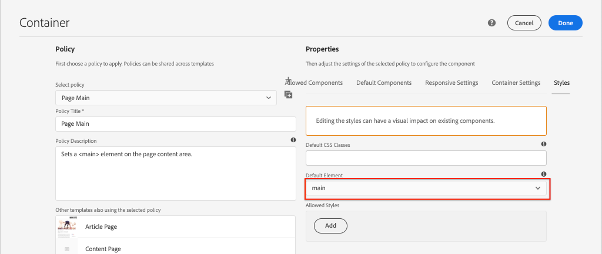

# Desenvolvimento com o sistema de estilo {#developing-with-the-style-system}

Saiba mais sobre como implementar estilos individuais e usar os Componentes principais usando o Sistema de estilo Experience Manager. Este tutorial aborda o desenvolvimento do Sistema de estilo para estender os Componentes principais com CSS específico da marca e configurações avançadas de política do Editor de modelos.

## Pré-requisitos {#prerequisites}

Revise as ferramentas e instruções necessárias para configurar um [ambiente de desenvolvimento local](overview.md#local-dev-environment).

Também é recomendável revisar o tutorial [Bibliotecas do lado do cliente e Fluxo de trabalho do front-end](client-side-libraries.md) para entender os fundamentos das bibliotecas do lado do cliente e as várias ferramentas de front-end incorporadas ao projeto do AEM.

### Projeto inicial

>[!NOTE]
>
> Se você tiver concluído com êxito o capítulo anterior, poderá reutilizar o projeto e ignorar as etapas para fazer check-out do projeto inicial.

Confira o código básico no qual o tutorial se baseia:

1. Verifique a ramificação `tutorial/style-system-start` de [GitHub](https://github.com/adobe/aem-guides-wknd)

   ```shell
   $ cd aem-guides-wknd
   $ git checkout tutorial/style-system-start
   ```

1. Implante a base de código para uma instância AEM local usando suas habilidades Maven:

   ```shell
   $ mvn clean install -PautoInstallSinglePackage
   ```

   >[!NOTE]
   >
   > Se estiver usando AEM 6.5 ou 6.4, anexe o perfil `classic` a qualquer comando Maven.

   ```shell
   $ mvn clean install -PautoInstallSinglePackage -Pclassic
   ```

Você sempre pode visualização o código finalizado em [GitHub](https://github.com/adobe/aem-guides-wknd/tree/tutorial/style-system-solution) ou fazer check-out do código localmente ao alternar para a ramificação `tutorial/style-system-solution`.

## Objetivo

1. Entenda como usar o Sistema de estilo para aplicar CSS específico da marca aos Componentes principais AEM.
1. Saiba mais sobre a notação do BEM e como ela pode ser usada para definir estilos com cuidado.
1. Aplicar configurações avançadas de política com Modelos editáveis.

## O que você vai criar {#what-you-will-build}

Neste capítulo, usaremos o recurso [Sistema de estilo](https://docs.adobe.com/content/help/en/experience-manager-learn/sites/page-authoring/style-system-feature-video-use.html) para criar variações dos componentes **Title** e **Texto** usados na página Artigo.


*Estilo sublinhado disponível para uso para o Componente de título*

## Segundo plano {#background}

O [Sistema de estilo](https://docs.adobe.com/content/help/pt-BR/experience-manager-65/developing/components/style-system.translate.html) permite que desenvolvedores e editores de modelo criem várias variações visuais de um componente. Os autores, por sua vez, podem decidir qual estilo usar ao compor uma página. Nós aproveitaremos o Sistema de estilo durante o restante do tutorial para atingir vários estilos únicos, enquanto aproveitamos os Componentes principais em uma abordagem de código baixo.

A ideia geral do Sistema de estilo é que os autores possam escolher vários estilos de como um componente deve ser exibido. Os &quot;estilos&quot; são suportados por classes CSS adicionais que são injetadas na div externa de um componente. Nas bibliotecas do cliente, as regras CSS são adicionadas com base nessas classes de estilo para que o componente altere a aparência.

Você pode encontrar [documentação detalhada para o Sistema de estilo aqui](https://experienceleague.adobe.com/docs/experience-manager-cloud-service/sites/authoring/features/style-system.html). Há também um excelente [vídeo técnico para entender o Sistema de estilo](https://experienceleague.adobe.com/docs/experience-manager-learn/sites/developing/style-system-technical-video-understand.html).

## Estilo sublinhado - Título {#underline-style}

O componente [Title](https://experienceleague.adobe.com/docs/experience-manager-core-components/using/components/title.html) foi anexado ao proxy no projeto em `/apps/wknd/components/title` como parte do módulo **ui.apps**. Os estilos padrão dos elementos Cabeçalho (`H1`, `H2`, `H3`...) já foram implementados no módulo **ui.frontendent**.

Os designs de [Artigo WKND](assets/pages-templates/wknd-article-design.xd) contêm um estilo exclusivo para o componente Título com um sublinhado. Em vez de criar dois componentes ou modificar a caixa de diálogo do componente, o Sistema de estilo pode ser usado para permitir que os autores adicionem uma opção de estilo sublinhado.


### Marcação do título do Inspect

Como um desenvolvedor de front-end, a primeira etapa para estilizar um componente principal é entender a marcação gerada pelo componente.

1. Abra um novo navegador e visualização o componente Título no site AEM Biblioteca de componentes principais: [https://www.aemcomponents.dev/content/core-components-examples/library/page-authoring/title.html](https://www.aemcomponents.dev/content/core-components-examples/library/page-authoring/title.html)

1. Abaixo está a marcação do componente Título:

   ```html
   <div class="cmp-title">
       <h1 class="cmp-title__text">Lorem Ipsum</h1>
   </div>
   ```

   A notação BEM do componente Título:

   ```plain
   BLOCK cmp-title
       ELEMENT cmp-title__text
   ```

1. O sistema Style adiciona uma classe CSS à div externa ao redor do componente. Portanto, a marcação a ser direcionada será semelhante a algo como o seguinte:

   ```html
   <div class="STYLE-SYSTEM-CLASS-HERE"> <!-- Custom CSS class - implementation gets to define this -->
       <div class="cmp-title">
           <h1 class="cmp-title__text">Lorem Ipsum</h1>
       </div>
   </div>
   ```

### Implementação do estilo sublinhado - ui.frontenda

Em seguida, implemente o estilo sublinhado usando o módulo **ui.frontenda** do nosso projeto. Usaremos o servidor de desenvolvimento de webpack fornecido com o módulo **ui.front-end** para pré-visualização dos estilos *antes de* implantar em uma instância local do AEM.

1. Start o servidor de desenvolvimento de webpack executando o seguinte comando no módulo **ui.front-end**:

   ```shell
   $ cd ~/code/aem-guides-wknd/ui.frontend/
   $ npm start
   
   > aem-maven-archetype@1.0.0 start code/aem-guides-wknd/ui.frontend
   > webpack-dev-server --open --config ./webpack.dev.js
   ```

   Isso deve abrir um navegador em [http://localhost:8080](http://localhost:8080).

   >[!NOTE]
   >
   > Se as imagens parecerem quebradas, verifique se o projeto inicial foi implantado em uma instância local do AEM (em execução na porta 4502) e se o navegador usado também se conectou à instância AEM local.

   

1. No IDE, abra o arquivo `index.html` localizado em: `ui.frontend/src/main/webpack/static/index.html`. Esta é a marcação estática usada pelo servidor de desenvolvimento de webpack.
1. Em `index.html` localize uma instância do Componente de título para adicionar o estilo sublinhado, pesquisando no documento *cmp-title*. Escolha o componente Título com o texto *&quot;Vans off the Wall Skatepark&quot;* (linha 218). Adicione a classe `cmp-title--underline` ao div circundante:

   ```diff
   - <div class="title aem-GridColumn--phone--12 aem-GridColumn aem-GridColumn--default--8">
   + <div class="cmp-title--underline title aem-GridColumn--phone--12 aem-GridColumn aem-GridColumn--default--8">
        <div data-cmp-data-layer="{&#34;title-8bea562fa0&#34;:{&#34;@type&#34;:&#34;wknd/components/title&#34;,&#34;repo:modifyDate&#34;:&#34;2021-01-22T18:54:20Z&#34;,&#34;dc:title&#34;:&#34;Vans Off the Wall&#34;}}" id="title-8bea562fa0" class="cmp-title">
            <h2 class="cmp-title__text">Vans Off the Wall</h2>
        </div>
    </div>
   ```

1. Retorne ao navegador e verifique se a classe extra está refletida na marcação.
1. Retorne ao módulo **ui.frontendent** e atualize o arquivo `title.scss` localizado em: `ui.frontend/src/main/webpack/components/_title.scss`:

   ```css
   /* Add Title Underline Style */
   .cmp-title--underline {
       .cmp-title__text {
           &:after {
           display: block;
               width: 84px;
               padding-top: 8px;
               content: '';
               border-bottom: 2px solid $brand-primary;
           }
       }
   }
   ```

   >[!NOTE]
   >
   >É considerada uma prática recomendada sempre aplicar estilos de escopo apertado ao componente do público alvo. Isso garante que os estilos extras não afetem outras áreas da página.
   >
   >Todos os componentes principais seguem **[notação BEM](https://github.com/adobe/aem-core-wcm-components/wiki/css-coding-conventions)**. É uma prática recomendada público alvo da classe CSS externa ao criar um estilo padrão para um componente. Outra prática recomendada é usar nomes de classe de público alvo especificados pela notação BEM do componente principal em vez de elementos HTML.

1. Retorne ao navegador mais uma vez e você deve ver o estilo sublinhado adicionado:

   

1. Pare o servidor de desenvolvimento de webpack.

### Adicionar uma política de título

Em seguida, precisamos adicionar uma nova política para os componentes de Título para permitir que os autores de conteúdo escolham o estilo de sublinhado a ser aplicado a componentes específicos. Isso é feito usando o Editor de modelos no AEM.

1. Implante a base de código para uma instância AEM local usando suas habilidades Maven:

   ```shell
   $ cd ~/code/aem-guides-wknd
   $ mvn clean install -PautoInstallSinglePackage
   ```

1. Navegue até o modelo **Página do artigo** localizado em: [http://localhost:4502/editor.html/conf/wknd/settings/wcm/templates/article-page/structure.html](http://localhost:4502/editor.html/conf/wknd/settings/wcm/templates/article-page/structure.html)

1. No modo **Estrutura**, no Container **Layout** principal, selecione o ícone **Política** ao lado do componente **Title** listado em *Componentes permitidos*:

   

1. Crie uma nova política para o componente Título com os seguintes valores:

   *Título da política **:  **Título da WKND**

   *Propriedades*  > Guia *Estilos >*   *Adicionar um novo estilo*

   **Sublinhado** :  `cmp-title--underline`

   

   Clique em **Concluído** para salvar as alterações na política de Título.

   >[!NOTE]
   >
   > O valor `cmp-title--underline` corresponde à classe CSS que definimos anteriormente durante o desenvolvimento no módulo **ui.front-end**.

### Aplicar o estilo sublinhado

Por fim, como autor, podemos optar por aplicar o estilo sublinhado a determinados Componentes do título.

1. Navegue até o artigo **La Skatepark** no editor da AEM Sites em: [http://localhost:4502/editor.html/content/wknd/us/en/magazine/guide-la-skateparks.html](http://localhost:4502/editor.html/content/wknd/us/en/magazine/guide-la-skateparks.html)
1. No modo **Editar**, escolha um componente de Título. Clique no ícone **pincel** e selecione o estilo **Sublinhado**:

   

   Como autor, você deve ser capaz de ativar/desativar o estilo.

1. Clique no ícone **Informações da página** > **Visualização como Publicado** para inspecionar a página fora do editor AEM.

   

   Use as ferramentas do desenvolvedor do navegador para verificar se a marcação em torno do componente Título tem a classe CSS `cmp-title--underline` aplicada à div externa.

## Estilo de bloco de aspas - Texto {#text-component}

Em seguida, repita etapas semelhantes para aplicar um estilo exclusivo ao [Componente de texto](https://experienceleague.adobe.com/docs/experience-manager-core-components/using/components/text.html). O componente de Texto foi anexado ao proxy no projeto em `/apps/wknd/components/text` como parte do módulo **ui.apps**. Os estilos padrão dos elementos de parágrafo já foram implementados em **ui.frontende**.

Os designs de [Artigo WKND](assets/pages-templates/wknd-article-design.xd) contêm um estilo exclusivo para o componente Texto com um bloco de aspas:


### Marcação do componente de texto da Inspect

Mais uma vez, inspecionaremos a marcação do componente de Texto.

1. Revise a marcação do componente de Texto em: [https://www.aemcomponents.dev/content/core-components-examples/library/page-authoring/text.html](https://www.aemcomponents.dev/content/core-components-examples/library/page-authoring/text.html)

1. Abaixo está a marcação do componente Texto:

   ```html
   <div class="text">
       <div class="cmp-text" data-cmp-data-layer="{&quot;text-2d9d50c5a7&quot;:{&quot;@type&quot;:&quot;core/wcm/components/text/v2/text&quot;,&quot;repo:modifyDate&quot;:&quot;2019-01-22T11:56:17Z&quot;,&quot;xdm:text&quot;:&quot;<p>Lorem ipsum dolor sit amet, consectetur adipiscing elit, sed do eiusmod tempor incididunt ut labore et dolore magna aliqua. Eu mi bibendum neque egestas congue quisque egestas. Varius morbi enim nunc faucibus a pellentesque. Scelerisque eleifend donec pretium vulputate sapien nec sagittis.</p>\n&quot;}}" id="text-2d9d50c5a7">
           <p>Lorem ipsum dolor sit amet, consectetur adipiscing elit, sed do eiusmod tempor incididunt ut labore et dolore magna aliqua. Eu mi bibendum neque egestas congue quisque egestas. Varius morbi enim nunc faucibus a pellentesque. Scelerisque eleifend donec pretium vulputate sapien nec sagittis.</p>
       </div>
   </div>
   ```

   A notação BEM do componente de texto:

   ```plain
   BLOCK cmp-text
       ELEMENT
   ```

1. O sistema Style adiciona uma classe CSS à div externa ao redor do componente. Portanto, a marcação a ser direcionada será semelhante a algo como o seguinte:

   ```html
   <div class="text STYLE-SYSTEM-CLASS-HERE"> <!-- Custom CSS class - implementation gets to define this -->
       <div class="cmp-text" data-cmp-data-layer="{&quot;text-2d9d50c5a7&quot;:{&quot;@type&quot;:&quot;core/wcm/components/text/v2/text&quot;,&quot;repo:modifyDate&quot;:&quot;2019-01-22T11:56:17Z&quot;,&quot;xdm:text&quot;:&quot;<p>Lorem ipsum dolor sit amet, consectetur adipiscing elit, sed do eiusmod tempor incididunt ut labore et dolore magna aliqua. Eu mi bibendum neque egestas congue quisque egestas. Varius morbi enim nunc faucibus a pellentesque. Scelerisque eleifend donec pretium vulputate sapien nec sagittis.</p>\n&quot;}}" id="text-2d9d50c5a7">
           <p>Lorem ipsum dolor sit amet, consectetur adipiscing elit, sed do eiusmod tempor incididunt ut labore et dolore magna aliqua. Eu mi bibendum neque egestas congue quisque egestas. Varius morbi enim nunc faucibus a pellentesque. Scelerisque eleifend donec pretium vulputate sapien nec sagittis.</p>
       </div>
   </div>
   ```

### Implementar o estilo de bloco de aspas - ui.frontenda

Em seguida, implementaremos o estilo de bloco de cotações usando o módulo **ui.frontende** do nosso projeto.

1. Start o servidor de desenvolvimento de webpack executando o seguinte comando no módulo **ui.front-end**:

   ```shell
   $ cd ~/code/aem-guides-wknd/ui.frontend/
   $ npm start
   ```

1. No IDE, abra o arquivo `index.html` localizado em: `ui.frontend/src/main/webpack/static/index.html`.
1. Em `index.html` localize uma instância do Componente de texto procurando pelo texto *&quot;Jacob Wester&quot;* (linha 210). Adicione a classe `cmp-text--quote` ao div circundante:

   ```diff
   - <div class="text aem-GridColumn--phone--12 aem-GridColumn aem-GridColumn--default--8">
   + <div class="cmp-text--quote text aem-GridColumn--phone--12 aem-GridColumn aem-GridColumn--default--8">
        <div data-cmp-data-layer="{&#34;text-a15f39a83a&#34;:{&#34;@type&#34;:&#34;wknd/components/text&#34;,&#34;repo:modifyDate&#34;:&#34;2021-01-22T00:23:27Z&#34;,&#34;xdm:text&#34;:&#34;&lt;blockquote>&amp;quot;There is no better place to shred then Los Angeles.”&lt;/blockquote>\r\n&lt;p>- Jacob Wester, Pro Skater&lt;/p>\r\n&#34;}}" id="text-a15f39a83a" class="cmp-text">
            <blockquote>&quot;There is no better place to shred then Los Angeles.”</blockquote>
            <p>- Jacob Wester, Pro Skater</p>
        </div>
    </div>
   ```

1. Atualize o arquivo `text.scss` localizado em: `ui.frontend/src/main/webpack/components/_text.scss`:

   ```css
   /* WKND Text Quote style */
   .cmp-text--quote {
       .cmp-text {
           background-color: $brand-third;
           margin: 1em 0em;
           padding: 1em;
   
           blockquote {
               border: none;
               font-size: $font-size-large;
               font-family: $font-family-serif;
               padding: 14px 14px;
               margin: 0;
               margin-bottom: 0.5em;
   
               &:after {
                   border-bottom: 2px solid $brand-primary; /*yellow border */
                   content: '';
                   display: block;
                   position: relative;
                   top: 0.25em;
                   width: 80px;
               }
           }
           p {
               font-family:  $font-family-serif;
           }
       }
   }
   ```

   >[!CAUTION]
   >
   > Nesse caso, os elementos HTML brutos são direcionados pelos estilos. Isso ocorre porque o componente Texto fornece um Editor de Rich Text para autores de conteúdo. A criação de estilos diretamente em relação ao conteúdo RTE deve ser feita com cuidado e é ainda mais importante aplicar um escopo mais restrito aos estilos.

1. Retorne ao navegador mais uma vez e você deve ver o estilo de bloco Cotação adicionado:

   

1. Pare o servidor de desenvolvimento de webpack.

### Adicionar uma política de texto

Em seguida, adicione uma nova política para os componentes de Texto.

1. Implante a base de código para uma instância AEM local usando suas habilidades Maven:

   ```shell
   $ cd ~/code/aem-guides-wknd
   $ mvn clean install -PautoInstallSinglePackage
   ```

1. Navegue até **Modelo de página do artigo** localizado em: [http://localhost:4502/editor.html/conf/wknd/settings/wcm/templates/article-page/structure.html](http://localhost:4502/editor.html/conf/wknd/settings/wcm/templates/article-page/structure.html)).

1. No modo **Estrutura**, no Container de layout principal **selecione o ícone** Política **ao lado do componente** Texto **listado em *Componentes permitidos*:**

   

1. Atualize a política de componente de Texto com os seguintes valores:

   *Título da política **:  **Texto do conteúdo**

   *Plug-ins* > Estilos  *de parágrafo* >  *Ativar estilos de parágrafo*

   *Guia*  Estilos >  *Adicionar um novo estilo*

   **Bloco**  de aspas:  `cmp-text--quote`

   

   

   Clique em **Concluído** para salvar as alterações na política de Texto.

### Aplicar o estilo de bloco de aspas

1. Navegue até o artigo **La Skatepark** no editor da AEM Sites em: [http://localhost:4502/editor.html/content/wknd/us/en/magazine/guide-la-skateparks.html](http://localhost:4502/editor.html/content/wknd/us/en/magazine/guide-la-skateparks.html)
1. No modo **Editar**, escolha um componente de Texto. Edite o componente para incluir um elemento de citação:

   

1. Selecione o componente de texto e clique no ícone **pincel** e selecione o estilo **Bloco de aspas**:

   

   Como autor, você deve ser capaz de ativar/desativar o estilo.

## Largura fixa - Container (Bônus) {#layout-container}

Os componentes do container foram usados para criar a estrutura básica do Modelo de página de artigo e fornecer as zonas de soltar para que os autores de conteúdo adicionem conteúdo a uma página. Os container também podem aproveitar o Sistema de estilo, fornecendo aos autores de conteúdo ainda mais opções para criar layouts.

O **Container principal** do modelo Página de artigo contém os dois container que podem ser criados pelo autor e tem uma largura fixa.


*Container principal no modelo* de página do artigo.

A política do **Container principal** define o elemento padrão como `main`:



O CSS que faz com que o **Container principal** seja fixo está definido no módulo **ui.front-end** em `ui.frontend/src/main/webpack/site/styles/container_main.scss` :

```SCSS
main.container {
    padding: .5em 1em;
    max-width: $max-content-width;
    float: unset!important;
    margin: 0 auto!important;
    clear: both!important;
}
```

Em vez de direcionar o elemento HTML `main`, o Sistema de estilo poderia ser usado para criar um estilo **Largura fixa** como parte da política de Container. O Sistema de estilo pode dar aos usuários a opção de alternar entre os container **Largura fixa** e **Largura líquida**.

1. **Desafio**  de bônus - use as lições aprendidas com os exercícios anteriores e use o Sistema de estilo para implementar uma  **largura** fixa e estilos de  **largura** fluidos para o componente do Container.

## Parabéns! {#congratulations}

Parabéns, a Página do artigo está quase completamente estilizada e você ganhou uma experiência prática usando o Sistema de estilo AEM.

### Próximas etapas {#next-steps}

Saiba mais sobre as etapas de ponta a ponta para criar um [componente AEM personalizado](custom-component.md) que exibe o conteúdo criado em uma caixa de diálogo e explora o desenvolvimento de um Modelo Sling para encapsular a lógica comercial que preenche o HTL do componente.

Visualização o código finalizado em [GitHub](https://github.com/adobe/aem-guides-wknd) ou revise e implante o código localmente no bloco Git `tutorial/style-system-solution`.

1. Clique no repositório [github.com/adobe/aem-wknd-guides](https://github.com/adobe/aem-guides-wknd).
1. Confira a ramificação `tutorial/style-system-solution`.
