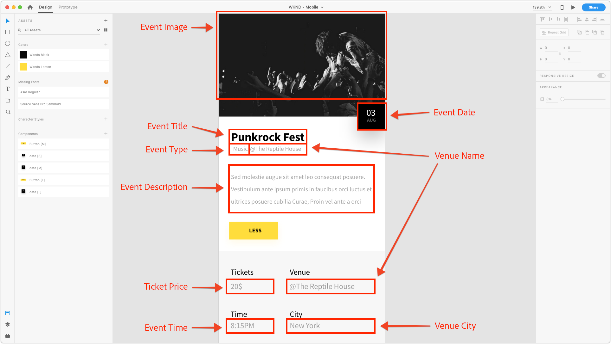

# Capítulo 2 - Uso de modelos de fragmento de conteúdo

AEM Modelos de fragmento de conteúdo definem schemas de conteúdo que podem ser usados para simplificar a criação de conteúdo bruto por AEM autores. Essa abordagem é semelhante à criação em andaimes ou em formulários. O conceito principal com Fragmentos de conteúdo é que o conteúdo criado é agnóstico de apresentação, o que significa que ele se destina ao uso de vários canais, no qual o aplicativo que consome, seja AEM, um aplicativo de página única ou um aplicativo móvel, controla a forma como o conteúdo é exibido ao usuário.

A principal preocupação do Fragmento do conteúdo é garantir:

1. O conteúdo correto é coletado do autor
2. O conteúdo pode ser exposto em um formato estruturado e bem compreendido aos aplicativos de consumo.

Este capítulo aborda a ativação e a definição de Modelos de fragmento de conteúdo usados para definir uma estrutura de dados normalizada e uma interface de criação para modelagem e criação de &quot;Eventos&quot;.

## Ativar modelos de fragmento de conteúdo

Os Modelos de fragmento de conteúdo **devem** ser ativados por meio **[AEM navegador ](https://docs.adobe.com/content/help/en/experience-manager-cloud-service/implementing/developing/configurations.html)** de configuração.

Se os Modelos de fragmento de conteúdo **não** estiverem ativados para uma configuração, o botão **[!UICONTROL Criar] > Fragmento [!UICONTROL de]** conteúdo não será exibido para a configuração relevante do AEM.

>[!NOTE]
>
>AEM configurações representam um conjunto de configurações [de locatário com reconhecimento de](https://sling.apache.org/documentation/bundles/context-aware-configuration/context-aware-configuration.html) contexto armazenadas em `/conf`. Geralmente AEM configurações se correlacionam a um site específico gerenciado no AEM Sites ou a uma unidade de negócios responsável por um subconjunto de conteúdo (ativos, páginas etc.) em AEM.
>
>Para que uma configuração afete uma hierarquia de conteúdo, a configuração deve ser referenciada pela `cq:conf` propriedade na hierarquia de conteúdo. (Isso é feito para a [!DNL WKND Mobile] configuração na **Etapa 5** abaixo).
>
>Quando a `global` configuração é usada, a configuração se aplica a todo o conteúdo e não `cq:conf` precisa ser definida.
>
>See the [[!UICONTROL Configuration Browser] documentation](https://docs.adobe.com/content/help/en/experience-manager-cloud-service/implementing/developing/configurations.html) for more information.

1. Faça logon no AEM Author como um usuário com as permissões apropriadas para modificar a configuração relevante.
   * Para este tutorial, o usuário **administrador** pode ser usado.
1. Navegue até **[!UICONTROL Ferramenta] > [!UICONTROL Geral] > Navegador [!UICONTROL de configuração]**
1. Toque no ícone **de** pasta ao lado de **[!DNL WKND Mobile]** para selecionar e, em seguida, toque no botão **[!UICONTROL Editar] no canto superior esquerdo** .
1. Selecione Modelos **[!UICONTROL de fragmento de]** conteúdo e toque em **[!UICONTROL Salvar e fechar]** no canto superior direito.

   Isso permite a utilização de Modelos de fragmento de conteúdo em árvores de conteúdo da Pasta de ativos com a [!DNL WKND Mobile] configuração aplicada.

   >[!NOTE]
   >
   >Esta alteração de configuração não é reversível na interface do usuário da Web de Configuração  AEM. Para desfazer essa configuração:
   >    
   >    1. Abrir [CRXDE Lite](http://localhost:4502/crx/de)
   >    1. Vá até `/conf/wknd-mobile/settings/dam/cfm`
   >    1. Excluir o `models` nó

   >    
   >Todos os Modelos de fragmento de conteúdo existentes criados nessa configuração serão excluídos, bem como suas definições serão armazenadas em `/conf/wknd-mobile/settings/dam/cfm/models`.

1. Aplique a **[!DNL WKND Mobile]** configuração à pasta **[!DNL WKND Mobile]** Ativos para permitir que os Fragmentos de conteúdo dos Modelos de fragmento de conteúdo sejam criados na hierarquia da pasta Ativos:

   1. Navegue até **[!UICONTROL AEM] > [!UICONTROL Ativos] > [!UICONTROL Arquivos]**
   1. Selecione a pasta **[!UICONTROL WKND Mobile]**
   1. Toque no botão **[!UICONTROL Propriedades]** na barra de ação superior para abrir Propriedades [!UICONTROL da pasta]
   1. Em Propriedades [!UICONTROL da]pasta, toque na guia **[!UICONTROL Cloud Services]**
   1. Verifique se o campo Configuração **[!UICONTROL da]** nuvem está definido como **/conf/wknd-mobile**
   1. Toque em **[!UICONTROL Salvar e fechar]** no canto superior direito para persistir as alterações

>[!VIDEO](https://video.tv.adobe.com/v/28336/?quality=12&learn=on)

## Como entender o modelo de fragmento de conteúdo a ser criado

Antes de definir o modelo de Fragmento de conteúdo, vamos rever a experiência que estaremos conduzindo para garantir que estamos capturando todos os pontos de dados necessários. Para isso, iremos analisar o design de aplicativos móveis e mapear os elementos de design para o conteúdo a ser coletado.

Podemos dividir os pontos de dados que definem um Evento da seguinte forma:

Munido do mapeamento, podemos definir o Fragmento do conteúdo que será usado para coletar e, por fim, expor os dados do Evento.

## Criação do modelo de fragmento de conteúdo

1. Navegue até **[!UICONTROL Ferramentas] > [!UICONTROL Ativos] > Modelos [!UICONTROL de fragmento de]** conteúdo.
1. Toque na **[!DNL WKND Mobile]** pasta para abrir.
1. Toque em **[!UICONTROL Criar]** para abrir o assistente de criação do Modelo de fragmento de conteúdo.
1. Digite **[!DNL Event]** como o Título **[!UICONTROL do]** Modelo *(a descrição é opcional)* e toque em **[!UICONTROL Criar]** para salvar.

>[!VIDEO](https://video.tv.adobe.com/v/28337/?quality=12&learn=on)

## Definição da estrutura do Modelo de fragmento de conteúdo

1. Navegue até **[!UICONTROL Ferramentas] > [!UICONTROL Ativos] > Modelos [!UICONTROL de fragmento de] conteúdo >[!DNL WKND]**.
1. Selecione o Modelo de fragmento de **[!DNL Event]** conteúdo e toque em **[!UICONTROL Editar]** na barra de ação superior.
1. Na guia **[!UICONTROL Tipos] de dados à direita, arraste a entrada** de texto de linha **[!UICONTROL Única para a zona suspensa esquerda para definir o]** **[!DNL Question]** campo.
1. Verifique se a nova entrada **[!UICONTROL de texto de linha]** única está selecionada à esquerda e a guia **[!UICONTROL Propriedades]** está selecionada à direita. Preencha os campos Propriedades da seguinte forma:

   * [!UICONTROL Renderizar como] : `textfield`
   * [!UICONTROL Rótulo do campo] : `Event Title`
   * [!UICONTROL Nome da Propriedade] : `eventTitle`
   * [!UICONTROL Extensão] Máx.: 25
   * [!UICONTROL Obrigatório] : `Yes`

Repita essas etapas usando as definições de entrada definidas abaixo para criar o restante do Modelo de fragmento de conteúdo do Evento.

>[!NOTE]
>
> Os campos Nome **da** propriedade DEVEM corresponder exatamente, pois o aplicativo Android está programado para destacar esses nomes.

### Descrição de evento

* [!UICONTROL Tipo de dados] : `Multi-line text`
* [!UICONTROL Rótulo do campo] : `Event Description`
* [!UICONTROL Nome da Propriedade] : `eventDescription`
* [!UICONTROL Tipo padrão] : `Rich text`

### Data e hora do evento

* [!UICONTROL Tipo de dados] : `Date and time`
* [!UICONTROL Rótulo do campo] : `Event Date and Time`
* [!UICONTROL Nome da Propriedade] : `eventDateAndTime`
* [!UICONTROL Obrigatório] : `Yes`

### Tipo de evento

* [!UICONTROL Tipo de dados] : `Enumeration`
* [!UICONTROL Rótulo do campo] : `Event Type`
* [!UICONTROL Nome da Propriedade] : `eventType`
* [!UICONTROL Opções] : `Art,Music,Performance,Photography`

### Preço do bilhete

* [!UICONTROL Tipo de dados] : `Number`
* [!UICONTROL Renderizar como] : `numberfield`
* [!UICONTROL Rótulo do campo] : `Ticket Price`
* [!UICONTROL Nome da Propriedade] : `eventPrice`
* [!UICONTROL Tipo] : `Integer`
* [!UICONTROL Obrigatório] : `Yes`

### Imagem do evento

* [!UICONTROL Tipo de dados] : `Content Reference`
* [!UICONTROL Renderizar como] : `contentreference`
* [!UICONTROL Rótulo do campo] : `Event Image`
* [!UICONTROL Nome da Propriedade] : `eventImage`
* [!UICONTROL Caminho raiz] : `/content/dam/wknd-mobile/images`
* [!UICONTROL Obrigatório] : `Yes`

### Nome do local

* [!UICONTROL Tipo de dados] : `Single-line text`
* [!UICONTROL Renderizar como] : `textfield`
* [!UICONTROL Rótulo do campo] : `Venue Name`
* [!UICONTROL Nome da Propriedade] : `venueName`
* [!UICONTROL Extensão] Máx.: 20
* [!UICONTROL Obrigatório] : `Yes`

### Cidade do local

* [!UICONTROL Tipo de dados] : `Enumeration`
* [!UICONTROL Rótulo do campo] : `Venue City`
* [!UICONTROL Nome da Propriedade] : `venueCity`
* [!UICONTROL Opções] : `Basel,London,Los Angeles,Paris,New York,Tokyo`

>[!VIDEO](https://video.tv.adobe.com/v/28335/?quality=12&learn=on)

>[!NOTE]
>
>O Nome **[!UICONTROL da]** propriedade indica o nome da propriedade **** do JCR onde esse valor será armazenado, bem como a chave no arquivo JSON. Esse deve ser um nome semântico que não será alterado durante a vida útil do Modelo de fragmento de conteúdo.

Depois de concluir a criação do Modelo de fragmento de conteúdo, você deve terminar com uma definição que se parece com:

## Próxima etapa

Como opção, instale o pacote de conteúdo [com.adobe.aem.guides.wknd-mobile.content.chapter-2.zip](https://github.com/adobe/aem-guides-wknd-mobile/releases/latest) no AEM Author por meio do [AEM Package Manager](http://localhost:4502/crx/packmgr/index.jsp). Este pacote contém as configurações e o conteúdo descritos nesta parte do tutorial.

* [Capítulo 3 - Criação de fragmentos de conteúdo do Evento](./chapter-3.md)
