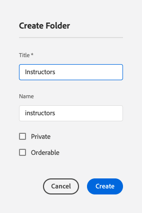

# Fragmentos de conteúdo do autor

No [capítulo anterior](/help/headless-tutorial/graphql/advanced-graphql/create-content-fragment-models.md), você criou cinco modelos de fragmento de conteúdo: pessoa, equipe, local, endereço e informações de contato. Este capítulo percorre as etapas para criar fragmentos de conteúdo com base nesses modelos. Também explica como criar políticas de pastas para limitar quais modelos de fragmento de conteúdo podem ser usados na pasta.

## Pré-requisitos {#prerequisites}

Este documento faz parte de um tutorial dividido em várias partes. Verifique se o [capítulo anterior](create-content-fragment-models.md) foi concluído antes de continuar com este capítulo.

## Objetivos {#objectives}

Neste capítulo, saiba como:

* Criar pastas e definir limites usando políticas de pastas
* Criar referências de fragmento diretamente do editor de Fragmento de conteúdo
* Use os tipos de dados Guia, Data e Objeto JSON
* Inserir referências de conteúdo e fragmento no editor de texto de várias linhas
* Adicionar várias referências de fragmento
* Aninhar fragmentos de conteúdo

## Instalar conteúdo de amostra {#sample-content}

Instale um pacote do AEM que contenha várias pastas e imagens de amostra usadas para acelerar o tutorial.

1. Baixar [Advanced-GraphQL-Tutorial-Starter-Package-1.1.zip](/help/headless-tutorial/graphql/advanced-graphql/assets/tutorial-files/Advanced-GraphQL-Tutorial-Starter-Package-1.1.zip)
1. No AEM, navegue até **Ferramentas** > **Implantação** > **Pacotes** para acessar o **Gerenciador de Pacotes**.
1. Carregue e instale o pacote (arquivo zip) baixado na etapa anterior.

   

## Criar pastas e definir limites usando políticas de pastas

Na página inicial do AEM, selecione **Assets** > **Arquivos** > **WKND Compartilhado** > **Inglês**. Aqui você pode ver as várias categorias de Fragmento de conteúdo, incluindo Aventuras e Colaboradores.

### Criar pastas {#create-folders}

Navegue até a pasta **Aventuras**. Você pode ver que as pastas para Equipes e Locais já foram criadas para armazenar Fragmentos de conteúdo de Equipes e Locais.

Crie uma pasta para os Fragmentos de conteúdo dos instrutores que são baseados no Modelo de fragmento de conteúdo de pessoa.

1. Na página Aventuras, selecione **Criar** > **Pasta** no canto superior direito.

   

1. No modal Criar pasta exibido, digite &quot;Professor&quot; no campo **Título**. Observe o &#39;s&#39; no final. Os títulos das pastas que contêm muitos fragmentos devem ser plurais. Selecione **Criar**.

   

   Agora você criou uma pasta para armazenar o Adventure Instructors.

### Definir limites usando políticas de pasta

O AEM permite definir permissões e políticas para pastas de Fragmento de conteúdo. Ao usar as permissões, você pode conceder acesso a determinadas pastas apenas a determinados usuários (autores) ou grupos de autores. Com as políticas de pastas, é possível limitar os modelos de fragmento de conteúdo que os autores podem usar nessas pastas. Neste exemplo, vamos limitar uma pasta aos modelos de Pessoa e Informações de contato. Para configurar uma política de pasta:

1. Selecione a pasta **Professor** que você criou e selecione **Propriedades** na barra de navegação superior.

   

1. Selecione a guia **Políticas** e desmarque **Herdado de /content/dam/wknd-shared**. No campo **Modelos de fragmento de conteúdo permitidos por caminho**, selecione o ícone de pasta.

   

1. Na caixa de diálogo Selecionar caminho que é aberta, siga o caminho **conf** > **WKND Compartilhado**. O modelo de fragmento de conteúdo de pessoas, criado no capítulo anterior, contém uma referência ao modelo de fragmento de conteúdo de informações de contato. Os modelos de Informações de pessoa e contato devem ser permitidos na pasta Professores para criar um Fragmento de conteúdo do professor. Selecione **Pessoa** e **Informações de contato** e pressione **Selecionar** para fechar a caixa de diálogo.

   

1. Selecione **Salvar e Fechar** e **OK** na caixa de diálogo de êxito exibida.

1. Agora você configurou uma política de pasta para a pasta de instrutores. Navegue até a pasta **Professor** e selecione **Criar** > **Fragmento do conteúdo**. Os únicos modelos que agora você pode selecionar são **Pessoa** e **Informações de contato**.

   

## Fragmentos de conteúdo de autor para professores

Navegue até a pasta **Professor**. Aqui, vamos criar uma pasta aninhada para armazenar as informações de contato dos instrutores.

Siga as etapas descritas na seção em [criando pastas](#create-folders) para criar uma pasta denominada &quot;Informações de contato&quot;. A pasta aninhada herda as políticas de pasta da pasta principal. Você pode configurar políticas mais específicas para que a pasta recém-criada permita que apenas o modelo de Informações de contato seja usado.

### Criar um fragmento do conteúdo do professor

Vamos criar quatro pessoas que podem ser adicionadas a uma equipe de professores de aventura.

1. Na pasta Professores, crie um Fragmento de conteúdo com base no Modelo de fragmento de conteúdo de pessoa e atribua a ele o título de &quot;Jacob Wester&quot;.

   O fragmento de conteúdo recém-criado tem a seguinte aparência:

   

1. Insira o seguinte conteúdo nos campos:

   * **Nome completo**: Jacob Wester
   * **Biografia**: Jacob Wester é um instrutor de caminhada há dez anos e amou cada minuto! Jacob é um buscador de aventura com um talento para escalar e mochila. Jacob é o vencedor de competições de escalada, incluindo a Batalha da Baía competição de pedregulhos. Jacob atualmente mora na Califórnia.
   * **Nível de experiência do professor**: especialista
   * **Habilidades**: escalada, surf, mochilas
   * **Detalhes do administrador**: Jacob Wester tem coordenado aventuras de mochila por três anos.

1. No campo **Imagem do Perfil**, adicione uma referência de conteúdo a uma imagem. Navegue até **WKND Compartilhado** > **Inglês** > **Colaboradores** > **jacob_wester.jpg** para criar um caminho para a imagem.

### Criar uma referência de fragmento por meio do editor de Fragmento de conteúdo {#fragment-reference-from-editor}

O AEM permite criar uma referência de fragmento diretamente do editor de fragmentos de conteúdo. Vamos criar uma referência para as informações de contato do Jacob.

1. Selecione **Novo fragmento do conteúdo** abaixo do campo **Informações de contato**.

   

1. O modal Novo fragmento de conteúdo é aberto. Na guia Selecionar destino, siga o caminho **Aventuras** > **Professor** e marque a caixa de seleção ao lado da pasta **Informações de contato**. Selecione **Avançar** para prosseguir para a guia Propriedades.

   

1. Na guia Propriedades, digite &quot;Informações de contato do Jacob Wester&quot; no campo **Título**. Selecione **Criar** e pressione **Abrir** na caixa de diálogo êxito exibida.

   

   Novos campos que permitem editar o fragmento de conteúdo das informações de contato são exibidos.

   

1. Insira o seguinte conteúdo nos campos:

   * **Telefone**: 209-888-0000
   * **Email**: jwester@wknd.com

   Quando terminar, selecione **Salvar**. Agora você criou um fragmento de conteúdo das informações de contato.

1. Para voltar para o fragmento de conteúdo do professor, selecione **Jacob Wester** no canto superior esquerdo do editor.

   

   O campo **Informações de contato** agora contém o caminho para o fragmento de informações de contato referenciado. Esta é uma referência de fragmento aninhado. O fragmento concluído do conteúdo do professor tem esta aparência:

   

1. Selecione **Salvar e fechar** para salvar o fragmento de conteúdo. Agora você tem um novo Fragmento do conteúdo do professor.

### Criar fragmentos adicionais

Siga o mesmo processo descrito na [seção anterior](#fragment-reference-from-editor) para criar mais três fragmentos de conteúdo de instrutores e três fragmentos de conteúdo de informações de contato para esses instrutores. Adicione o seguinte conteúdo nos fragmentos de Professores:

**Stacey Roswells**

| Campos | Valores |
| --- | --- |
| Título do fragmento de conteúdo | Stacey Roswells |
| Nome completo | Stacey Roswells |
| Informação de contato | /content/dam/wknd-shared/en/adventures/Instructors/contact-info/stacey-roswells-contact-info |
| Foto do perfil | /content/dam/wknd-shared/en/contributors/stacey-roswells.jpg |
| Biografia | Stacey Roswells é uma alpinista talentosa e aventureira alpina. Nascida em Baltimore, Maryland, Stacey é a mais nova de seis filhos. O pai de Stacey era tenente-coronel da Marinha dos Estados Unidos e a mãe era instrutora de dança moderna. A família de Stacey mudou-se com frequência com as atribuições de dever do pai, e tirou as primeiras fotos quando o pai estava estacionado na Tailândia. Também foi aqui que Stacey aprendeu a escalar. |
| Nível de experiência do professor | Avançado  |
| Habilidades | Escalada de rochas | Esqui | Mochila |

**Kumar Selvaraj**

| Campos | Valores |
| --- | --- |
| Título do fragmento de conteúdo | Kumar Selvaraj |
| Nome completo | Kumar Selvaraj |
| Informação de contato | /content/dam/wknd-shared/en/adventures/Instructors/contact-info/kumar-selvaraj-contact-info |
| Foto do perfil | /content/dam/wknd-shared/en/contributors/kumar-selvaraj.jpg |
| Biografia | Kumar Selvaraj é um instrutor profissional experiente com certificação AMGA cujo principal objetivo é ajudar os alunos a melhorar suas habilidades de escalada e caminhada. |
| Nível de experiência do professor | Avançado  |
| Habilidades | Escalada de rochas | Mochila |

**Ayo Ogunseinde**

| Campos | Valores |
| --- | --- |
| Título do fragmento de conteúdo | Ayo Ogunseinde |
| Nome completo | Ayo Ogunseinde |
| Informação de contato | /content/dam/wknd-shared/en/adventures/Instructors/contact-info/ayo-ogunseinde-contact-info |
| Foto do perfil | /content/dam/wknd-shared/en/contributors/ayo-ogunseinde-237739.jpg |
| Biografia | Ayo Ogunseinde é um alpinista profissional e instrutor de mochilas que vive em Fresno, no centro da Califórnia. O objetivo de Ayo é guiar os caminhantes em suas aventuras mais épicas do parque nacional. |
| Nível de experiência do professor | Avançado  |
| Habilidades | Escalada de rochas | Ciclismo | Mochila |

Deixe o campo **Informações Adicionais** vazio.

Adicione as seguintes informações nos fragmentos de Informações de contato:

| Título do fragmento de conteúdo | Celular | Email |
| ------- | -------- | -------- |
| Stacey Roswells Contact Info | 209-888-0011 | sroswells@wknd.com |
| Informações de contato de Kumar Selvaraj | 209-888-0002 | kselvaraj@wknd.com |
| Informações de contato de Ayo Ogunseinde | 209-888-0304 | aogunseinde@wknd.com |

Agora você está pronto para criar uma Equipe!

## Criação de fragmentos de conteúdo para locais

Navegue até a pasta **Locais**. Aqui, você vê duas pastas aninhadas que já foram criadas: Parque Nacional de Yosemite e Yosemite Valley Lodge.


Ignore a pasta Yosemite Valley Lodge por enquanto. Retornamos a ela posteriormente nesta seção quando criamos um local que atua como Base Inicial para nossa equipe de instrutores.

Acesse a pasta **Parque Nacional de Yosemite**. Atualmente, contém apenas uma foto do Parque Nacional de Yosemite. Vamos criar um Fragmento de conteúdo usando o Modelo de fragmento de conteúdo de localização e intitulá-lo de &quot;Parque Nacional de Yosemite&quot;.

### Marcadores de posição de guias

O AEM permite usar espaços reservados para guias a fim de agrupar diferentes tipos de conteúdo e facilitar a leitura e o gerenciamento dos fragmentos de conteúdo. No capítulo anterior, você adicionou espaços reservados para guias ao modelo de Localização. Como resultado, o Fragmento de Conteúdo de Local agora tem duas seções de guia: **Detalhes de Local** e **Endereço de Local**.


A guia **Detalhes do Local** contém os campos **Nome**, **Descrição**, **Informações de Contato**, **Imagem do Local** e **Clima por Temporada**, enquanto a guia **Endereço do Local** contém uma referência a um Fragmento de Conteúdo de Endereço. As guias deixam claro quais tipos de conteúdo devem ser preenchidos, de modo que a criação de conteúdo é mais fácil de gerenciar.

### Tipo de dados Objeto JSON

O campo **Tempo por Temporada** é um tipo de dados Objeto JSON, o que significa que ele aceita dados no formato JSON. Esse tipo de dados é flexível e pode ser usado para qualquer dado que você queira incluir no seu conteúdo.

Você pode ver a descrição do campo criada no capítulo anterior, passando o mouse sobre o ícone de informações à direita do campo.


Nesse caso, precisamos fornecer o tempo médio para o local. Insira os seguintes dados:

```json
{
    "summer": "81 / 89°F",
    "fall": "56 / 83°F",
    "winter": "46 / 51°F",
    "spring": "57 / 71°F"
}
```

O campo **Tempo por Temporada** agora deve ter esta aparência:


### Adicionar conteúdo

Vamos adicionar o restante do conteúdo ao Fragmento do conteúdo de localização para consultar as informações com o GraphQL no próximo capítulo.

1. Na guia **Detalhes do local**, insira as seguintes informações nos campos:

   * **Nome**: Parque Nacional de Yosemite
   * **Descrição**: o Parque Nacional de Yosemite está localizado nas montanhas de Sierra Nevada, na Califórnia. É famosa por suas lindas cachoeiras, sequoias gigantes e vistas icônicas dos penhascos El Capitan e Half Dome. Caminhadas e acampamentos são as melhores maneiras de experimentar Yosemite. Numerosas trilhas oferecem oportunidades infinitas para aventura e exploração.

1. No campo **Informações de contato**, crie um Fragmento de conteúdo com base no modelo de Informações de contato e o nomeie como &quot;Informações de contato do Parque Nacional de Yosemite&quot;. Siga o mesmo processo descrito na seção anterior sobre [criando uma referência de fragmento a partir do editor](#fragment-reference-from-editor) e insira os seguintes dados nos campos:

   * **Telefone**: 209-999-0000
   * **Email**: yosemite@wknd.com

1. No campo **Imagem do local**, navegue até **Aventuras** > **Locais** > **Parque Nacional de Yosemite** > **yosemite-national-park.jpeg** para criar um caminho para a imagem.

   Lembre-se de que, no capítulo anterior, você configurou a validação da imagem; portanto, as dimensões da imagem do Local devem ser inferiores a 2560 x 1800 e o tamanho do arquivo deve ser inferior a 3 MB.

1. Com todas as informações adicionadas, a guia **Detalhes do local** agora tem esta aparência:

   

1. Navegue até a guia **Endereço do local**. No campo **Endereço**, crie um Fragmento de conteúdo intitulado &quot;Endereço do Parque Nacional de Yosemite&quot; usando o Modelo de Fragmento de Conteúdo de Endereço que você criou no capítulo anterior. Siga o mesmo processo descrito na seção sobre [criando uma referência de fragmento a partir do editor](#fragment-reference-from-editor) e insira os seguintes dados nos campos:

   * **Rua Endereço**: 9010 Curry Village Drive
   * **Cidade**: Yosemite Valley
   * **Estado**: CA
   * **CEP**: 95389
   * **País**: Estados Unidos

1. A guia **Endereço do local** concluída do fragmento do Parque Nacional de Yosemite tem esta aparência:

   

1. Selecione **Salvar e fechar**.

### Criar mais um fragmento

1. Navegue até a pasta **Yosemite Valley Lodge**. Crie um fragmento de conteúdo usando o modelo de fragmento de conteúdo de localização e o nomeie como &quot;Yosemite Valley Lodge&quot;.

1. Na guia **Detalhes do local**, insira as seguintes informações nos campos:

   * **Nome**: Yosemite Valley Lodge
   * **Descrição**: o Yosemite Valley Lodge é um centro para reuniões de grupo e todos os tipos de atividades, como compras, refeições, pesca, caminhadas e muito mais.

1. No campo **Informações de contato**, crie um Fragmento de conteúdo com base no modelo de Informações de contato e o nomeie como &quot;Informações de contato do Yosemite Valley Lodge&quot;. Siga o mesmo processo descrito na seção sobre [criando uma referência de fragmento a partir do editor](#fragment-reference-from-editor) e insira os seguintes dados nos campos do novo Fragmento de conteúdo:

   * **Telefone**: 209-992-0000
   * **Email**: yosemitelodge@wknd.com

   Salve o fragmento de conteúdo recém-criado.

1. Volte para **Yosemite Valley Lodge** e vá para a guia **Endereço do local**. No campo **Endereço**, crie um Fragmento de conteúdo intitulado &quot;Endereço do Yosemite Valley Lodge&quot; usando o Modelo de Fragmento de Conteúdo de Endereço que você criou no capítulo anterior. Siga o mesmo processo descrito na seção sobre [criando uma referência de fragmento a partir do editor](#fragment-reference-from-editor) e insira os seguintes dados nos campos:

   * **Rua Endereço**: 9006 Yosemite Lodge Drive
   * **Cidade**: Parque Nacional de Yosemite
   * **Estado**: CA
   * **CEP**: 95389
   * **País**: Estados Unidos

   Salve o fragmento de conteúdo recém-criado.

1. Volte para **Yosemite Valley Lodge** e selecione **Salvar e fechar**. A pasta **Yosemite Valley Lodge** agora contém três fragmentos de conteúdo: Yosemite Valley Lodge, Yosemite Valley Lodge Contact Info e Yosemite Valley Lodge Address.

   

## Criar um fragmento do conteúdo da equipe

Procure pastas para **Equipes** > **Equipe do Yosemite**. Você pode ver que a pasta Equipe do Yosemite atualmente contém apenas o logotipo da equipe.


Vamos criar um fragmento de conteúdo usando o Modelo de fragmento de conteúdo de equipe e atribuí-lo ao título de &quot;Equipe do Yosemite&quot;.

### Referências de conteúdo e fragmento no editor de texto de várias linhas

O AEM permite adicionar conteúdo e referências de fragmento diretamente no editor de texto multilinha e recuperá-las posteriormente usando consultas do GraphQL. Vamos adicionar referências de conteúdo e fragmento ao campo **Descrição**.

1. Primeiro, adicione o seguinte texto no campo **Descrição**: &quot;A equipe de aventureiros profissionais e instrutores de caminhada trabalhando no Parque Nacional de Yosemite.&quot;

1. Para adicionar uma referência de conteúdo, selecione o ícone **Inserir ativo** na barra de ferramentas do editor de texto de várias linhas.

   

1. No modal exibido, selecione **team-yosemite-logo.png** e pressione **Select**.

   

   A referência de conteúdo agora é adicionada ao campo **Descrição**.

Lembre-se, no capítulo anterior, você permitiu a adição de referências de fragmento ao campo **Descrição**. Vamos adicionar um aqui.

1. Selecione o ícone **Inserir fragmento de conteúdo** na barra de ferramentas do editor de texto de várias linhas.

   

1. Navegue até **WKND Compartilhado** > **Inglês** > **Aventuras** > **Locais** > **Yosemite Valley Lodge** > **Yosemite Valley Lodge**. Pressione **Selecionar** para inserir o fragmento de conteúdo.

   

   O campo **Descrição** agora se parece com o seguinte:

   

Agora você adicionou as referências de conteúdo e fragmento diretamente no editor de texto de várias linhas.

### Tipo de dados de Data e Hora

Vamos analisar os tipos de dados Data e hora. Selecione o ícone **Calendário** no lado direito do campo **Data de Fundação da Equipe** para abrir a exibição de calendário.


Datas passadas ou futuras podem ser definidas usando as setas para frente e para trás em ambos os lados do mês. Digamos que a equipe do Yosemite foi fundada em 24 de maio de 2016, então definiremos a data para então.

### Adicionar várias referências de fragmento

Vamos adicionar Professores à referência do fragmento Membros da equipe.

1. Selecione **Adicionar** no campo **Membros da Equipe**.

   

1. No novo campo exibido, selecione o ícone de pasta para abrir a modal Selecionar caminho. Navegue pelas pastas até **WKND Compartilhado** > **Inglês** > **Aventuras** > **Professor** e marque a caixa de seleção ao lado de **jacob-wester**. Pressione **Selecionar** para salvar o caminho.

   

1. Selecione o botão **Adicionar** mais três vezes. Use os novos campos para adicionar os três professores restantes à equipe. O campo **Membros da Equipe** agora tem esta aparência:

   

1. Selecione **Salvar e fechar** para salvar o fragmento de conteúdo da equipe.

### Adicionar referências de fragmento a um fragmento de conteúdo de aventura

Por fim, vamos adicionar os Fragmentos de conteúdo recém-criados a uma aventura.

1. Navegue até **Aventuras** > **Embalagem do Yosemite** e abra o Fragmento de conteúdo da embalagem do Yosemite. Na parte inferior do formulário, você pode ver os três campos criados no capítulo anterior: **Local**, **Equipe do professor** e **Administrador**.

1. Adicione a referência do fragmento no campo **Local**. O caminho do Local deve fazer referência ao Fragmento de Conteúdo do Parque Nacional de Yosemite que você criou: `/content/dam/wknd-shared/en/adventures/locations/yosemite-national-park/yosemite-national-park`.

1. Adicione a referência do fragmento no campo **Equipe do professor**. O caminho da Equipe deve fazer referência ao Fragmento de conteúdo da Equipe do Yosemite que você criou: `/content/dam/wknd-shared/en/adventures/teams/yosemite-team/yosemite-team`. Esta é uma referência de fragmento aninhado. O fragmento de conteúdo da equipe contém uma referência ao modelo de Pessoa que faz referência aos modelos de Informações de contato e Endereço. Portanto, você tem fragmentos de conteúdo aninhados três níveis abaixo.

1. Adicione a referência do fragmento no campo **Administrador**. Digamos que Jacob Wester seja um administrador do Yosemite Backpacking Adventure. O caminho deve levar ao Fragmento de conteúdo Jacob Wester e aparecer da seguinte maneira: `/content/dam/wknd-shared/en/adventures/instructors/jacob-wester`.

1. Agora você adicionou três referências de fragmento a um Fragmento de conteúdo de aventura. Os campos têm esta aparência:

   

1. Selecione **Salvar e fechar** para salvar seu conteúdo.

## Parabéns.

Parabéns! Agora você criou fragmentos de conteúdo com base nos modelos avançados de fragmento de conteúdo criados no capítulo anterior. Você também criou uma política de pastas para limitar quais modelos de fragmento de conteúdo podem ser selecionados em uma pasta.

## Próximas etapas

No [próximo capítulo](/help/headless-tutorial/graphql/advanced-graphql/explore-graphql-api.md), você aprenderá a enviar consultas avançadas do GraphQL usando o IDE (Ambiente de Desenvolvimento Integrado) GraphiQL. Essas consultas nos permitem visualizar os dados criados neste capítulo e, eventualmente, adicionar essas consultas ao aplicativo WKND.
