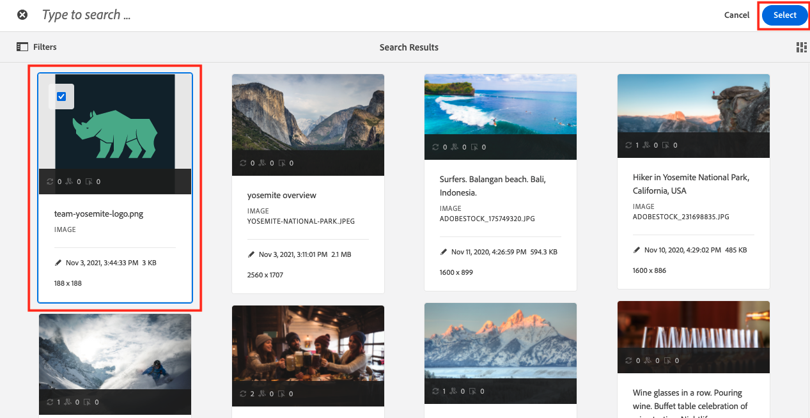
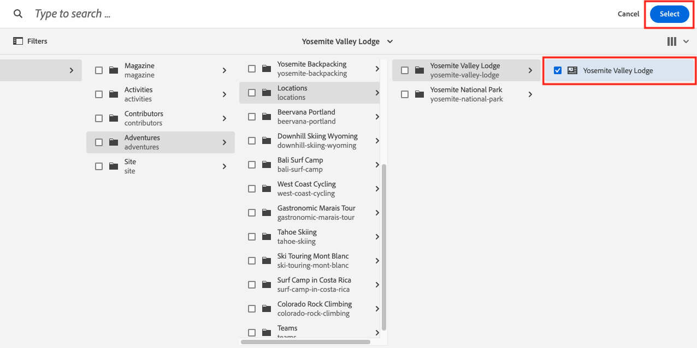

# Fragmentos do conteúdo do autor

No [capítulo anterior](/help/headless-tutorial/graphql/advanced-graphql/create-content-fragment-models.md), você criou cinco Modelos de fragmento de conteúdo: Informações de Pessoa, Equipe, Local, Endereço e Contato. Este capítulo aborda as etapas para criar Fragmentos de conteúdo com base nesses modelos. Ele também explica como criar políticas de pastas para limitar quais Modelos de fragmentos de conteúdo podem ser usados na pasta.

## Pré-requisitos {#prerequisites}

Este documento faz parte de um tutorial de várias partes. Certifique-se de que os capítulos anteriores foram concluídos antes de prosseguir com este capítulo.

## Objetivos {#objectives}

Neste capítulo, saiba como:

* Criar pastas e definir limites usando políticas de pastas
* Criar referências de fragmento diretamente do editor de Fragmento de conteúdo
* Usar tipos de dados de Tabulação, Data e Objeto JSON
* Inserir referências de conteúdo e fragmento no editor de texto de várias linhas
* Adicionar várias referências de fragmento
* Aninhar fragmentos de conteúdo

## Instalar conteúdo de amostra {#sample-content}

Instale um pacote de AEM que contenha várias pastas e imagens de amostra usadas para acelerar o tutorial.

1. Baixar [Advanced-GraphQL-Tutorial-Starter-Package-1.0.zip](/help/headless-tutorial/graphql/advanced-graphql/assets/tutorial-files/Advanced-GraphQL-Tutorial-Starter-Package-1.0.zip)
1. Em AEM, navegue até **Ferramentas** > **Implantação** > **Pacotes** para acessar **Gerenciador de pacotes**.
1. Faça upload e instale o pacote (arquivo zip) baixado na etapa anterior.

   

## Criar pastas e definir limites usando políticas de pastas

Na página inicial do AEM, selecione **Ativos** > **Arquivos** > **Site WKND** > **Inglês**. Aqui você pode ver as várias categorias de Fragmento de conteúdo, incluindo Aventuras e Contribuidores exploradas nas [tutorial GraphQL de várias etapas](../multi-step/overview.md).

### Criar pastas {#create-folders}

Navegue até o **Aventuras** pasta. Você pode ver que as pastas de Equipes e Locais já foram criadas para armazenar Grupos e Localizações e Fragmentos de conteúdo.

Crie uma pasta para Fragmentos de conteúdo de instrutores com base no Modelo de fragmento de conteúdo de pessoa.

1. Na página Aventuras, selecione **Criar** > **Pasta** no canto superior direito.

   

1. No modal Criar pasta exibido, digite &quot;Instrutores&quot; no **Título** campo. Observe o &quot;s&quot; no final. Os títulos das pastas que contêm muitos fragmentos devem ser plurais. Selecione **Criar**.

   

   Agora você criou uma pasta para armazenar instrutores do Adventure.

### Definir limites usando políticas de pastas

AEM permite definir permissões e políticas para pastas de Fragmento de conteúdo . Ao usar permissões, é possível conceder acesso somente a determinadas pastas de usuários (autores) ou grupos de autores. Ao usar as políticas de pastas, é possível limitar quais modelos de Fragmento de Conteúdo os autores podem usar nessas pastas. Neste exemplo, vamos limitar uma pasta aos modelos Pessoa e Informações de contato . Para configurar uma política de pastas:

1. Selecione o **Instrutores** pasta que você criou e selecione **Propriedades** na barra de navegação superior.

   

1. Selecione o **Políticas** e, em seguida, desmarcar **Herdado de /content/dam/wknd**. No **Modelos de fragmentos de conteúdo permitidos por caminho** selecione o ícone de pasta.

   

1. Na caixa de diálogo Selecionar caminho que é aberta, siga o caminho **conf** > **Site WKND**. O Modelo de fragmento de conteúdo da pessoa, criado no capítulo anterior, contém uma referência ao Modelo de fragmento de conteúdo das informações de contato. Os modelos Pessoa e Informações de contato devem ser permitidos na pasta Instrutores para criar um Fragmento de conteúdo de instrutor. Selecionar **Pessoa** e **Informações de contato** e pressione **Selecionar** para fechar a caixa de diálogo.

   

1. Selecionar **Salvar e fechar** e selecione **OK** na caixa de diálogo de sucesso exibida.

1. Agora você configurou uma política de pastas para a pasta Instrutors. Navegue até o **Instrutores** e selecione **Criar** > **Fragmento de conteúdo**. Os únicos modelos que agora você pode selecionar são **Pessoa** e **Informações de contato**.

   

## Fragmentos de conteúdo do autor para instrutores

Navegue até o **Instrutores** pasta. A partir daqui, vamos criar uma pasta aninhada para armazenar as informações de contato dos instrutores.

Siga as etapas descritas na seção sobre [criação de pastas](#create-folders) para criar uma pasta denominada &quot;Informações de contato&quot;. Observe que a pasta aninhada herda as políticas de pastas da pasta pai. Você pode configurar políticas mais específicas para que a pasta recém-criada permita que o modelo Informações de contato seja usado apenas.

### Criar um fragmento de conteúdo de instrutor

Vamos criar quatro pessoas que podem ser adicionadas a uma equipe de instrutores de risco. Reutilize as imagens e os nomes dos Fragmentos de conteúdo dos contribuidores que foram criados no [tutorial GraphQL de várias etapas](../multi-step/author-content-fragments.md). Embora o tutorial anterior tenha detalhado como criar Fragmentos de conteúdo básicos, este tutorial tem como foco recursos mais avançados.

1. Na pasta Instrutores , crie um novo Fragmento de conteúdo com base no Modelo de Fragmento de conteúdo da pessoa e atribua a ele um título de &quot;Jacob Wester&quot;.

   O Fragmento de conteúdo recém-criado é semelhante ao seguinte:

   

1. Insira o seguinte conteúdo nos campos:

   * **Nome completo**: Jacob Wester
   * **Biografia**: Jacob Wester tem sido instrutor de caminhada por dez anos e tem adorado cada minuto dele! Ele é um candidato de aventura com talento para escalar e fazer mochila. Jacob é o vencedor das competições de escalada, incluindo a Batalha da Competição Bouldering . Atualmente ele mora na Califórnia.
   * **Nível de experiência do instrutor**: Especialista
   * **Habilidades**: Escala de Rocha, Surfe, Embalagem
   * **Detalhes do administrador**: Jacob Wester coordena aventuras de bastidores há 3 anos.

1. No **Imagem do perfil** , adicione uma referência de conteúdo a uma imagem. Navegue até **Site WKND** > **Inglês** > **Contribuidores** > **jacob_wester.jpg** para criar um caminho para a imagem.

### Criar uma nova referência de fragmento no editor Fragmento de conteúdo {#fragment-reference-from-editor}

AEM permite criar uma referência de fragmento diretamente do editor de Fragmento de conteúdo. Vamos criar uma referência às informações de contato do Jacob.

1. Selecionar **Novo fragmento de conteúdo** abaixo do **Informações de contato** campo.

   

1. O modal Novo fragmento de conteúdo é aberto. Na guia Selecionar destino , siga o caminho **Aventuras** > **Instrutores** e marque a caixa de seleção ao lado do **Informações de contato** pasta. Selecionar **Próximo** para prosseguir para a guia Properties .

   

1. Na guia Propriedades , digite &quot;Informações de contato do Jacob Wester&quot; na guia **Título** campo. Selecionar **Criar** e pressione **Abrir** na caixa de diálogo de sucesso exibida.

   

   Novos campos que permitem editar o Fragmento de conteúdo das informações de contato.

   

1. Insira o seguinte conteúdo nos campos:

   * **Telefone**: 209-888-0000
   * **Email**: jwester@wknd.com

   Quando terminar, selecione **Salvar**. Agora você criou um novo Fragmento de conteúdo de informações de contato.

1. Para voltar para o Fragmento de conteúdo do instrutor, selecione **Jacob Wester** no canto superior esquerdo do editor.

   

   O **Informações de contato** agora contém o caminho para o fragmento Informações de contato referenciado. Esta é uma referência de fragmento aninhado. O Fragmento de conteúdo do instrutor finalizado tem esta aparência:

   

1. Selecionar **Salvar e fechar** para salvar o Fragmento do conteúdo. Agora você tem um novo Fragmento de conteúdo de instrutor.

### Criar fragmentos adicionais

Siga o mesmo processo descrito no [seção anterior](#fragment-reference-from-editor) para criar mais três Fragmentos de conteúdo de instrutores e três Fragmentos de conteúdo de informações de contato para esses instrutores. Adicione o seguinte conteúdo nos fragmentos de instrutores:

**Stacey Roswells**

| Fields | Valores |
| --- | --- |
| Título do fragmento do conteúdo | Stacey Roswells |
| Nome completo | Stacey Roswells |
| Informação de contato | /content/dam/wknd/en/adventures/instrutors/contact-info/stacey-roswells-contact-info |
| Imagem do perfil | /content/dam/wknd/en/contributors/stacey-roswells.jpg |
| Biografia | Stacey Roswells é uma alpinista de rock e aventureira alpina. Nascido em Baltimore, Maryland, Stacey é a mais nova de seis crianças. Seu pai era tenente-coronel na Marinha dos Estados Unidos e sua mãe era uma instrutora de dança moderna. A família dela se mudou frequentemente com as tarefas do pai, e ela tirou as primeiras fotos quando ele estava estacionado na Tailândia. Foi também aqui que Stacey aprendeu a escalar. |
| Nível de experiência do instrutor | Avançado  |
| Habilidades | Escala de Rocha | Esqui | Embalagem retroativa |

**Kumar Selvaraj**

| Campos | Valores |
| --- | --- |
| Título do fragmento do conteúdo | Kumar Selvaraj |
| Nome completo | Kumar Selvaraj |
| Informação de contato | /content/dam/wknd/en/adventures/instrutors/contact-info/kumar-self-contact-info |
| Imagem do perfil | /content/dam/wknd/en/contributors/Kumar_Selvaraj.JPG |
| Biografia | Kumar Selvaraj é um instrutor profissional certificado pela AMGA experiente, cujo objetivo principal é ajudar os estudantes a aprimorar suas habilidades de escalada e caminhada. |
| Nível de experiência do instrutor | Avançado  |
| Habilidades | Escala de Rocha | Embalagem retroativa |

**Ayo Ogunseinde**

| Campos | Valores |
| --- | --- |
| Título do fragmento do conteúdo | Ayo Ogunseinde |
| Nome completo | Ayo Ogunseinde |
| Informação de contato | /content/dam/wknd/en/adventures/instrutors/contact-info/ayo-ogunseinde-contact-info |
| Imagem do perfil | /content/dam/wknd/en/contributors/ayo-ogunseinde-237739.jpg |
| Biografia | Ayo Ogunseinde é um alpinista profissional e instrutor de mochilas que vive em Fresno, na Califórnia Central. O objetivo dela é guiar os caminhoneiros em suas aventuras mais épicas do parque nacional. |
| Nível de experiência do instrutor | Avançado  |
| Habilidades | Escala de Rocha | Ciclo | Embalagem retroativa |

Deixe o **Informações adicionais** campo vazio.

Adicione as seguintes informações nos fragmentos Informações de contato :

| Título do fragmento do conteúdo | Telefone | Email |
| ------- | -------- | -------- |
| Informações de Contato de Stacey Roswells | 2009-888-0011 | sroswells@wknd.com |
| Informações de contato do Kumar Selvaraj | 2009-888-0002 | kselvaraj@wknd.com |
| Informações de contato de Ayo Ogunseinde | 2009-888-0304 | aogunseinde@wknd.com |

Agora você está pronto para criar uma Equipe!

## Fragmentos de conteúdo do autor para locais

Navegue até o **Localizações** pasta. Aqui você vê duas pastas aninhadas que já foram criadas: Parque Nacional de Yosemite e Vale do Yosemite Lodge.


Ignore a pasta Lodge do Vale do Yosemite por enquanto. Retornaremos a ele mais tarde nesta seção quando criarmos uma nova localização que atuará como uma Base para a nossa equipe de instrutores.

Navegue até o **Parque Nacional Yosemite** pasta. Atualmente, contém apenas uma foto do Parque Nacional Yosemite. Vamos criar um novo Fragmento de conteúdo usando o Modelo de Fragmento de conteúdo de localização e nomeá-lo como &quot;Parque nacional Yosemite&quot;.

### Marcadores de posição de guia

O AEM permite usar espaços reservados em guias para agrupar diferentes tipos de conteúdo e facilitar a leitura e o gerenciamento dos Fragmentos de conteúdo. No capítulo anterior, você adicionou espaços reservados na guia ao modelo Localização. Como resultado, o Fragmento do conteúdo do local agora tem duas seções de guia: **Detalhes da localização** e **Endereço de localização**.


O **Detalhes da localização** contém a guia **Nome**, **Descrição**, **Informações de contato**, **Imagem de localização** e **Tempo por temporada** campos, enquanto a variável **Endereço de localização** contém uma referência a um Fragmento do conteúdo do endereço. As guias deixam claro quais tipos de conteúdo devem ser preenchidos, de modo que a criação de conteúdo é mais fácil de gerenciar.

### Tipo de dados do objeto JSON

O **Tempo por temporada** é um tipo de dados JSON Object , o que significa que aceita dados no formato JSON. Esse tipo de dados é flexível e pode ser usado para quaisquer dados que você deseja incluir no seu conteúdo.

Você pode ver a descrição do campo criada no capítulo anterior, passando o mouse sobre o ícone de informações à direita do campo.


Nesse caso, precisamos fornecer o tempo médio para o local. Insira os seguintes dados:

```json
{
    "summer": "81 / 89°F",
    "fall": "56 / 83°F",
    "winter": "46 / 51°F",
    "spring": "57 / 71°F"
}
```

O **Tempo por temporada** O campo agora deve ser semelhante a:


### Adicionar conteúdo

Vamos adicionar o restante do conteúdo ao Fragmento de conteúdo do local para consultar as informações com GraphQL no próximo capítulo.

1. No **Detalhes da localização** , insira as seguintes informações nos campos:

   * **Nome**: Parque Nacional Yosemite
   * **Descrição**: O Parque Nacional Yosemite fica nas montanhas da Califórnia, em Sierra Nevada. É famoso por suas lindas cachoeiras, sequoeiras gigantes, e pontos de vista icônicos dos penhascos de El Capitan e Half Dome. Caminhar e acampar são as melhores maneiras de experimentar Yosemite. Várias trilhas oferecem infinitas oportunidades para aventura e exploração.

1. No **Informações de contato** , crie um novo Fragmento de conteúdo com base no modelo Informações de contato e o rotule como &quot;Informações de contato do Parque Nacional do Yosemite&quot;. Siga o mesmo processo descrito na seção anterior em [criação de uma nova referência de fragmento no editor](#fragment-reference-from-editor) e insira os seguintes dados nos campos:

   * **Telefone**: 209-999-0000
   * **Email**: yosemite@wknd.com

1. No **Imagem de localização** , navegue até **Aventuras** > **Localizações** > **Parque Nacional Yosemite** > **yosemite-national-park.jpeg** para criar um caminho para a imagem.

   Lembre-se de que no capítulo anterior você configurou a validação da imagem, de modo que as dimensões da imagem de Localização devem ser menores que 2560 x 1800, e seu tamanho de arquivo deve ser menor que 3 MB.

1. Com todas as informações adicionadas, a variável **Detalhes da localização** agora tem esta aparência:

   

1. Navegue até o **Endereço de localização** guia . No **Endereço** , crie um novo Fragmento de conteúdo chamado &quot;Endereço do Parque Nacional do Yosemite&quot; usando o Modelo de Fragmento de conteúdo do endereço criado no capítulo anterior. Siga o mesmo processo descrito na seção sobre [criação de uma nova referência de fragmento no editor](#fragment-reference-from-editor) e insira os seguintes dados nos campos:

   * **Endereço**: Unidade de Aldeia 9010
   * **Cidade**: Vale do Yosemite
   * **Estado**: CA
   * **Código postal**: 95389
   * **País**: Estados Unidos

1. A **Endereço de localização** A guia do fragmento Parque Nacional Yosemite tem esta aparência:

   

1. Selecione **Salvar e fechar**.

### Criar um fragmento adicional

1. Navegue até o **Vale do Yosemite Lodge** pasta. Crie um novo Fragmento de conteúdo usando o Modelo de fragmento de conteúdo de localização e o rotule como &quot;Lodge do Vale Yosemite&quot;.

1. No **Detalhes da localização** , insira as seguintes informações nos campos:

   * **Nome**: Vale do Yosemite Lodge
   * **Descrição**: Yosemite Valley Lodge é um centro de encontros em grupo e todo o tipo de atividades, tais como compras, jantar, pesca, caminhada, e muito mais.

1. No **Informações de contato** , crie um novo Fragmento de conteúdo com base no modelo Informações de contato e o rotule como &quot;Informações de contato do Lodge do Vale do Yosemite&quot;. Siga o mesmo processo descrito na seção sobre [criação de uma nova referência de fragmento no editor](#fragment-reference-from-editor) e insira os seguintes dados nos campos do novo Fragmento de conteúdo:

   * **Telefone**: 209-992-0000
   * **Email**: yosemitelodge@wknd.com

   Salve o Fragmento do conteúdo recém-criado.

1. Navegue de volta para **Vale do Yosemite Lodge** e vá para o **Endereço de localização** guia . No **Endereço** , crie um novo Fragmento de conteúdo chamado &quot;Endereço de lodge do Vale do Yosemite&quot; usando o Modelo de fragmento de conteúdo de endereço criado no capítulo anterior. Siga o mesmo processo descrito na seção sobre [criação de uma nova referência de fragmento no editor](#fragment-reference-from-editor) e insira os seguintes dados nos campos:

   * **Endereço**: Unidade Yosemite Lodge 9006
   * **Cidade**: Parque Nacional Yosemite
   * **Estado**: CA
   * **Código postal**: 95389
   * **País**: Estados Unidos

   Salve o Fragmento do conteúdo recém-criado.

1. Navegue de volta para **Vale do Yosemite Lodge**, em seguida selecione **Salvar e fechar**. O **Vale do Yosemite Lodge** agora contém três fragmentos de conteúdo: Yosemite Valley Lodge, Yosemite Valley Lodge Contact Info, e Yosemite Valley Lodge Address.

   

## Criar um fragmento de conteúdo de equipe

Navegue pelas pastas para **Equipes** > **Equipe Yosemite**. Você pode ver que a pasta Yosemite Team atualmente contém apenas o logotipo da equipe.


Vamos criar um novo Fragmento de conteúdo usando o Modelo de fragmento de conteúdo da equipe e nomeá-lo como &quot;Equipe Yosemite&quot;.

### Referências de conteúdo e fragmento no editor de texto de várias linhas

AEM permite adicionar referências de conteúdo e fragmento diretamente no editor de texto de várias linhas e recuperá-las posteriormente usando consultas GraphQL. Vamos adicionar referências de conteúdo e fragmento no **Descrição** campo.

1. Primeiro, adicione o seguinte texto no **Descrição** campo : &quot;A equipe de aventureiros profissionais e instrutores de caminhada que trabalham no Parque Nacional de Yosemite.&quot;

1. Para adicionar uma referência de conteúdo, selecione o **Inserir ativo** na barra de ferramentas do editor de texto de várias linhas.

   

1. No modal exibido, selecione **equipe-yosemite-logo.png** e pressione **Selecionar**.

   

   A referência de conteúdo agora é adicionada ao **Descrição** campo.

Lembre-se de que, no capítulo anterior, você permitiu que referências de fragmento fossem adicionadas ao **Descrição** campo. Vamos adicionar um aqui.

1. Selecione o **Inserir fragmento de conteúdo** na barra de ferramentas do editor de texto de várias linhas.

   

1. Navegue até **Site WKND** > **Inglês** > **Aventuras** > **Localizações** > **Vale do Yosemite Lodge** > **Vale do Yosemite Lodge**. Press **Selecionar** para inserir o Fragmento de conteúdo.

   

   O **Descrição** O campo agora é semelhante ao seguinte:

   

Agora, você adicionou as referências de conteúdo e fragmento diretamente no editor de texto de várias linhas.

### Tipo de dados Data e Hora

Vamos analisar os tipos de dados Data e Hora. Selecione o **Calendário** no lado direito do **Data de criação da equipe** para abrir a exibição de calendário.


Datas passadas ou futuras podem ser definidas usando as setas para frente e para trás em qualquer um dos lados do mês. Digamos que a equipe Yosemite foi fundada em 24 de maio de 2016, então vamos definir a data para isso.

### Adicionar várias referências de fragmento

Vamos adicionar Instrutores à referência de fragmento Membros da equipe.

1. Selecionar **Adicionar** no **Membros da equipe** campo.

   

1. No novo campo exibido, selecione o ícone de pasta para abrir a modal Selecionar caminho . Navegue pelas pastas para **Site WKND** > **Inglês** > **Aventuras** > **Instrutores** e, em seguida, marque a caixa de seleção ao lado de **jacob-wester**. Press **Selecionar** para salvar o caminho.

   

1. Selecione o **Adicionar** mais três vezes. Use os novos campos para adicionar os três instrutores restantes à equipe. O **Membros da equipe** agora é semelhante a:

   

1. Selecionar **Salvar e fechar** para salvar o Fragmento do conteúdo da equipe.

### Adicionar referências de fragmento a um Fragmento de conteúdo de empreendimento

Por fim, vamos adicionar os Fragmentos de conteúdo recém-criados a uma Aventura.

1. Navegar para **Aventuras** > **Embalagem de origem Yosemite** e abra o Fragmento de conteúdo de backpack do Yosemite. Na parte inferior do formulário, é possível ver os três campos criados no capítulo anterior: **Localização**, **Equipe de instrutores** e **Administrador**.

1. Adicione a referência do fragmento no **Localização** campo. O caminho de Localização deve fazer referência ao Fragmento de Conteúdo do Parque Nacional Yosemite que você criou: `/content/dam/wknd/en/adventures/locations/yosemite-national-park/yosemite-national-park`.

1. Adicione a referência do fragmento no **Equipe de instrutores** campo. O caminho da Equipe deve fazer referência ao Fragmento de Conteúdo da Equipe Yosemite que você criou: `/content/dam/wknd/en/adventures/teams/yosemite-team/yosemite-team`. Esta é uma referência de fragmento aninhado. O Fragmento do conteúdo da equipe contém uma referência ao modelo Pessoa que faz referência às Informações de contato e aos modelos de Endereço. Portanto, você tem fragmentos de conteúdo aninhados em três níveis abaixo.

1. Adicione a referência do fragmento no **Administrador** campo. Vamos dizer que Jacob Wester é um Administrador da Yosemite Backpackaging Adventure. O caminho deve levar ao Fragmento de conteúdo do Jacob Wester e ser exibido da seguinte maneira: `/content/dam/wknd/en/adventures/instructors/jacob-wester`.

1. Agora você adicionou três referências de fragmento a um Fragmento de conteúdo de empreendimento. Os campos têm esta aparência:

   

1. Selecionar **Salvar e fechar** para salvar seu conteúdo.

## Parabéns!

Parabéns! Agora você criou Fragmentos de conteúdo com base nos Modelos avançados de fragmento de conteúdo criados no capítulo anterior. Você também criou uma política de pastas para limitar quais Modelos de fragmentos de conteúdo podem ser selecionados em uma pasta.

## Próximas etapas

No [próximo capítulo](/help/headless-tutorial/graphql/advanced-graphql/explore-graphql-api.md)Além disso, você aprenderá sobre o envio de consultas GraphQL avançadas usando o Ambiente de desenvolvimento integrado GraphiQL (IDE). Essas consultas nos permitirão visualizar os dados criados neste capítulo e, eventualmente, adicionar essas consultas ao aplicativo WKND.

Embora seja opcional para este tutorial, certifique-se de publicar todo o conteúdo em situações de produção real. Mais detalhes sobre os ambientes Autor e Publicação podem ser encontrados no [série de vídeos sem periféricos](/help/headless-tutorial/graphql/video-series/author-publish-architecture.md)
