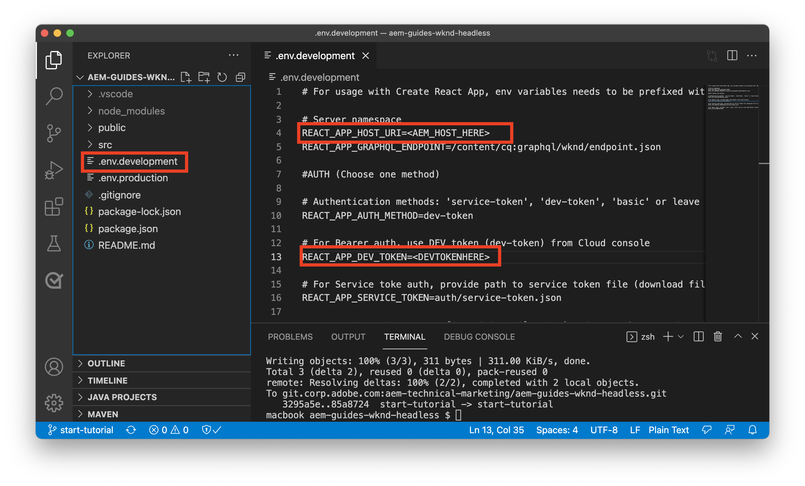
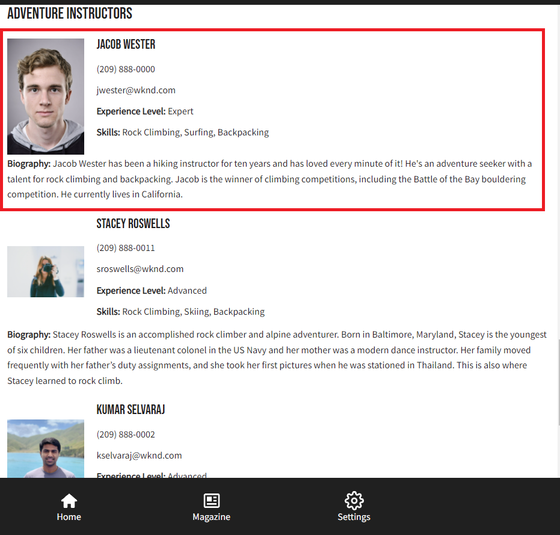

# Integração de aplicativos do cliente

No capítulo anterior, você criou e atualizou consultas persistentes usando solicitações HTTP PUT e POST.

Este capítulo o orienta pelas etapas para integrar essas consultas persistentes ao aplicativo WKND usando solicitações HTTP GET em cinco componentes React:

* Local
* Endereço
* Instrutores
* Administrador
* Equipe

## Pré-requisitos {#prerequisites}

Este documento faz parte de um tutorial de várias partes. Certifique-se de que os capítulos anteriores foram concluídos antes de prosseguir com este capítulo. Conclusão da [tutorial básico](/help/headless-tutorial/graphql/multi-step/overview.md) é recomendada.

_As capturas de tela do IDE neste capítulo vêm de [Código do Visual Studio](https://code.visualstudio.com/)_

### Capítulo 1-4 Pacote de soluções (opcional) {#solution-package}

Um pacote de soluções está disponível para ser instalado e conclui as etapas na interface do usuário do AEM para os capítulos 1 a 4. Este pacote é **não é necessário** se os capítulos anteriores tiverem sido concluídos.

1. Baixar [Advanced-GraphQL-Tutorial-Solution-Package-1.1.zip](/help/headless-tutorial/graphql/advanced-graphql/assets/tutorial-files/Advanced-GraphQL-Tutorial-Solution-Package-1.1.zip).
1. Em AEM, navegue até **Ferramentas** > **Implantação** > **Pacotes** para acessar **Gerenciador de pacotes**.
1. Faça upload e instale o pacote (arquivo zip) baixado na etapa anterior.

## Objetivos {#objectives}

Neste tutorial, você aprenderá a integrar as solicitações de consultas persistentes ao aplicativo WKND GraphQl React de amostra usando o JavaScript sem cabeçalho AEM [SDK](https://github.com/adobe/aem-headless-client-js).

## Instale e execute o aplicativo cliente de amostra {#install-client-app}

Para acelerar o tutorial, é fornecido um aplicativo React JS inicial.

>[!NOTE]
> 
> Abaixo estão as instruções para conectar o aplicativo React a um **Autor** ambiente em AEM as a Cloud Service usando um [token de acesso de desenvolvimento local](/help/headless-tutorial/authentication/local-development-access-token.md). Também é possível conectar o aplicativo a um [instância de autor local usando o SDK do AEMaaCS](/help/headless-tutorial/graphql/quick-setup/local-sdk.md) usando autenticação básica.

1. Baixar **[aem-guides-wknd-headless-start-tutorial.zip](/help/headless-tutorial/graphql/advanced-graphql/assets/tutorial-files/aem-guides-wknd-headless-start-tutorial.zip)**.
1. Descompacte o arquivo e abra o projeto no IDE.
1. Obter um [token de desenvolvimento local](/help/headless-tutorial/authentication/local-development-access-token.md) para seu ambiente de AEM do target.
1. No projeto, abra o arquivo `.env.development`.
   1. Definir `REACT_APP_DEV_TOKEN` igual a `accessToken` do token de desenvolvimento local. (Não o arquivo JSON inteiro)
   1. Definir `REACT_APP_HOST_URI` para o url do seu AEM **Autor** ambiente.

   
1. Abra um novo terminal e navegue até a pasta do projeto. Execute os seguintes comandos:

   ```shell
   $ npm install
   $ npm start
   ```

1. Um novo navegador deve abrir em `http://localhost:3000/aem-guides-wknd-pwa`.
1. Toque **Acampamento** > **Embalagem de origem Yosemite** para exibir os detalhes da aventura de Backpack do Yosemite.

   

1. Abra as ferramentas do desenvolvedor do navegador e inspecione o `XHR` solicitação

   

   Você deve ver um `POST` ao ponto de extremidade GraphQL. Exibir o `Payload`, você pode ver a consulta GraphQL completa que foi enviada. Nas próximas seções, o aplicativo será atualizado para uso **persistente** consultas.


## Introdução

No tutorial básico, uma consulta GraphQl parametrizada é usada para solicitar um único Fragmento de conteúdo e renderizar os detalhes da aventura. Em seguida, atualize o `adventureDetailQuery` para incluir novos campos e usar consultas persistentes criadas no capítulo anterior.

Cinco componentes são criados:

| Componente de reação | Local |
|-------|------|
| Administrador | `src/components/Administrator.js` |
| Equipe | `src/components/Team.js` |
| Local | `src/components/Location.js` |
| Instrutores | `src/components/Instructors.js` |
| Endereço | `src/components/Address.js` |

## Atualizar o gancho useGraphQL

Um personalizado [Gancho do efeito de reação](https://reactjs.org/docs/hooks-overview.html#effect-hook) foi criada e escuta alterações no `query`e, quando alterado, faz uma solicitação HTTP POST ao ponto de extremidade GraphQL da AEM e retorna a resposta JSON ao aplicativo.

Criar um novo gancho para usar **persistente** consultas. O aplicativo pode, então, fazer solicitações HTTP GET para detalhes do Adventure. O `runPersistedQuery` do [AEM SDK do cliente headless](https://github.com/adobe/aem-headless-client-js) é usada para facilitar a execução de uma consulta persistente.

1. Abra o arquivo `src/api/useGraphQL.js`
1. Adicionar um novo gancho para `useGraphQLPersisted`:

   ```javascript
   /**
   * Custom React Hook to perform a GraphQL query to a persisted query endpoint
   * @param persistedPath - the short path to the persisted query
   * @param fragmentPathParam - optional parameters object that can be passed in for parameterized persistent queries
   */
   export function useGraphQLPersisted(persistedPath, fragmentPathVariable) {
       let [data, setData] = useState(null);
       let [errors, setErrors] = useState(null);
   
       useEffect(() => {
           let queryVariables = {};
   
           // we pass in a primitive fragmentPathVariable (String) and then construct the object {fragmentPath: fragmentPathParam} to pass as query params to the persisted query
           // It is simpler to pass a primitive into a React hooks, as comparing the state of a dependent object can be difficult. see https://reactjs.org/docs/hooks-faq.html#can-i-skip-an-effect-on-updates
           if(fragmentPathVariable) {
               queryVariables = {fragmentPath: fragmentPathVariable};
           }
   
           // execute a persisted query using the given path and pass in variables (if needed)
           sdk.runPersistedQuery(persistedPath, queryVariables)
               .then(({ data, errors }) => {
               if (errors) setErrors(mapErrors(errors));
               if (data) setData(data);
           })
           .catch((error) => {
           setErrors(error);
           });
   }, [persistedPath, fragmentPathVariable]);
   
   return { data, errors }
   }
   ```
1. Salve as alterações no arquivo.

## Atualizar Componente Detalhes da Aventura

O arquivo `src/api/queries.js` contém as consultas GraphQL usadas para potencializar o aplicativo `adventureDetailQuery` retorna detalhes de uma aventura individual usando a solicitação POST GraphQL padrão. Em seguida, atualize o `AdventureDetail` componente para usar o `wknd/all-adventure-details` query.

1. Abrir `src/screens/AdventureDetail.js`.
1. Comente primeiro a seguinte linha:

   ```javascript
   export default function AdventureDetail() {
   
       ...
   
       //const { data, errors } = useGraphQL(adventureDetailQuery(adventureFragmentPath));
   ```

   O acima usa o POST GraphQL padrão para recuperar detalhes de aventura com base em um `adventureFragmentPath`

1. Para usar o `useGraphQLPersisted` gancho, adicione a seguinte linha :

   ```javascript
   export default function AdventureDetail() {
   
      //const { data, errors } = useGraphQL(adventureDetailQuery(adventureFragmentPath));
       const {data, errors} = useGraphQLPersisted("wknd/all-adventure-details", adventureFragmentPath);
   ```

   Observe o caminho `wknd/all-adventure-details` é o caminho para a consulta persistente criada no capítulo anterior.

   >[!CAUTION]
   >
   > Para que a consulta atualizada funcione `wknd/all-adventure-details` deve ser mantido no ambiente de AEM do target. Revise as etapas em [Consultas GraphQL persistentes](/help/headless-tutorial/graphql/advanced-graphql/graphql-persisted-queries.md#cache-control-all-adventures) ou instale o [Pacote de solução AEM](/help/headless-tutorial/graphql/advanced-graphql/assets/tutorial-files/Advanced-GraphQL-Tutorial-Solution-Package-1.1.zip)

1. Retorne ao aplicativo em execução no navegador e use as ferramentas de desenvolvedor do navegador para inspecionar a solicitação após navegar para um **Detalhes da empresa** página.

   

   ```
   http://localhost:3000/graphql/execute.json/wknd/all-adventure-details;fragmentPath=/content/dam/wknd/en/adventures/yosemite-backpacking/yosemite-backpacking
   ```

   Agora você deve ver um `GET` solicitação que está usando a consulta persistente em `wknd/all-adventure-details`.

1. Navegue até outros detalhes da aventura e observe que o mesmo `GET` é feita, mas com caminhos de fragmento diferentes. O pedido deve continuar a funcionar como anteriormente.

Consulte `AdventureDetail.js` no [aem-guides-wknd-headless-solution-tutorial.zip](/help/headless-tutorial/graphql/advanced-graphql/assets/tutorial-files/aem-guides-wknd-headless-solution-tutorial.zip) para obter um exemplo completo do componente atualizado.

Em seguida, crie a **Localização**, **Administrador** e **Instrutores** componentes para renderizar dados de localização. O **Endereço** é referenciado dentro do **Equipe** componente.

## Desenvolver o componente Localização

1. No `AdventureDetail.js` adicione uma referência ao arquivo `<Location>` componente que transmite os dados de localização do `adventure` objeto de dados:

   ```javascript
   export default function AdventureDetail() {
       ...
   
       return (
           ...
   
           <Location data={adventure.location} />
   ```

1. Revise o arquivo em `src/components/Location.js`. O `Location` componente renderiza os dados do local a ser atendido, informações de contato, informações sobre o tempo e uma imagem de local do **Localização** Modelo de fragmento de conteúdo. No mínimo, a variável `Location` espera que um componente `address` objeto a ser transmitido.
1. Consulte `Location.js` no [aem-guides-wknd-headless-solution-tutorial.zip](/help/headless-tutorial/graphql/advanced-graphql/assets/tutorial-files/aem-guides-wknd-headless-solution-tutorial.zip) para obter um exemplo completo do componente atualizado.

Depois que as atualizações forem feitas, a página de detalhes renderizada deverá ser a seguinte:


## Desenvolver o componente Equipe

1. No `AdventureDetail.js` adicione uma referência ao arquivo `<Team>` componente (abaixo do `<Location>` componente) transmitindo o `instructorTeam` dados da `adventure` objeto de dados:

   ```javascript
   <Location data={adventure.location} />
   <Team data={adventure.instructorTeam} />
   ```

1. Revise o arquivo em `src/components/Team.js`. O `Team` componente renderiza dados sobre a data de criação da equipe, a imagem e a descrição do **Equipe** Fragmento do conteúdo.

1. Em `Team.js` observe a inclusão do `Address` componente.

   ```javascript
   export default function Team({data}) {
       ...
       {teamPath && <Address _path={teamPath}/>}
   ```

   Aqui, um caminho para a equipe atual é passado para o `Address` , que, por sua vez, executa uma consulta para obter o endereço com base na equipe.

1. Consulte `Team.js` no [aem-guides-wknd-headless-solution-tutorial.zip](/help/headless-tutorial/graphql/advanced-graphql/assets/tutorial-files/aem-guides-wknd-headless-solution-tutorial.zip) para obter um exemplo completo do componente.

Uma vez integrado, o query deve ter esta aparência:


## Desenvolver o componente Endereço

1. Revise o arquivo em `src/components/Address.js`. O `Address` componente renderiza informações de endereço, como endereço de rua, cidade, estado, código postal, país da **Endereço** Fragmento do conteúdo e telefone e email da **Informações de contato** referência do fragmento.
1. O `Address` é semelhante ao `AdventureDetails` na medida em que faz uma chamada persistente para recuperar dados com base em um caminho. A diferença é que ele usa `/wknd/team-location-by-location-path` para fazer o pedido.
1. Consulte `Address.js` no [aem-guides-wknd-headless-solution-tutorial.zip](/help/headless-tutorial/graphql/advanced-graphql/assets/tutorial-files/aem-guides-wknd-headless-solution-tutorial.zip) para obter um exemplo completo do componente.

## Desenvolver o componente Administrador

1. No `AdventureDetail.js` adicione uma referência ao arquivo `<Adminstrator>` componente (abaixo do `<Team>` componente) transmitindo o `administrator` dados da `adventure` objeto de dados:

   ```javascript
   <Location data={adventure.location} />
   <Team data={adventure.instructorTeam} />
   <Administrator data={adventure.administrator} /> 
   ```

1. Revise o arquivo em `src/components/Administrator.js`. O `Administrator` componente renderiza detalhes como o nome completo da **Administrador** Fragmento do conteúdo e renderize o telefone e o email do **Informações de contato** referência do fragmento.
1. Consulte `Administrator.js` em [aem-guides-wknd-headless-solution-tutorial.zip](/help/headless-tutorial/graphql/advanced-graphql/assets/tutorial-files/aem-guides-wknd-headless-solution-tutorial.zip) para obter um exemplo completo do componente.

Depois de criar o componente Administrador, você está pronto para renderizar o aplicativo. A saída deve corresponder à imagem abaixo:


## Desenvolver o componente Instrutores

1. No `AdventureDetail.js` adicione uma referência ao arquivo `<Instructors>` componente (abaixo do `<Administrator>` componente) transmitindo o `instructorTeam` dados da `adventure` objeto de dados:

   ```javascript
   <Location data={adventure.location} />
   <Team data={adventure.instructorTeam}/>
   <Administrator data={adventure.administrator} />             
   <Instructors data={adventure.instructorTeam} />
   ```

1. Revise o arquivo em `src/components/Instructors.js`. O `Instructors` componente renderiza dados sobre cada membro da equipe, incluindo nome completo, biografia, imagem, número de telefone, nível de experiência e habilidades. O componente repete uma matriz para exibir cada membro.
1. Consulte `Instructors.js` em [aem-guides-wknd-headless-solution-tutorial.zip](/help/headless-tutorial/graphql/advanced-graphql/assets/tutorial-files/aem-guides-wknd-headless-solution-tutorial.zip) para obter um exemplo completo do componente.

Depois de renderizar o aplicativo, a saída deve corresponder à imagem abaixo:



## Exemplo de aplicativo WKND concluído

O aplicativo concluído deve ter esta aparência:


### Aplicativo de cliente final

A versão final do aplicativo pode ser baixada e usada:
**[aem-guides-wknd-headless-solution-tutorial.zip](/help/headless-tutorial/graphql/advanced-graphql/assets/tutorial-files/aem-guides-wknd-headless-solution-tutorial.zip)**

## Parabéns

Parabéns! Agora você concluiu a integração e a implementação das consultas persistentes no aplicativo WKND de amostra.