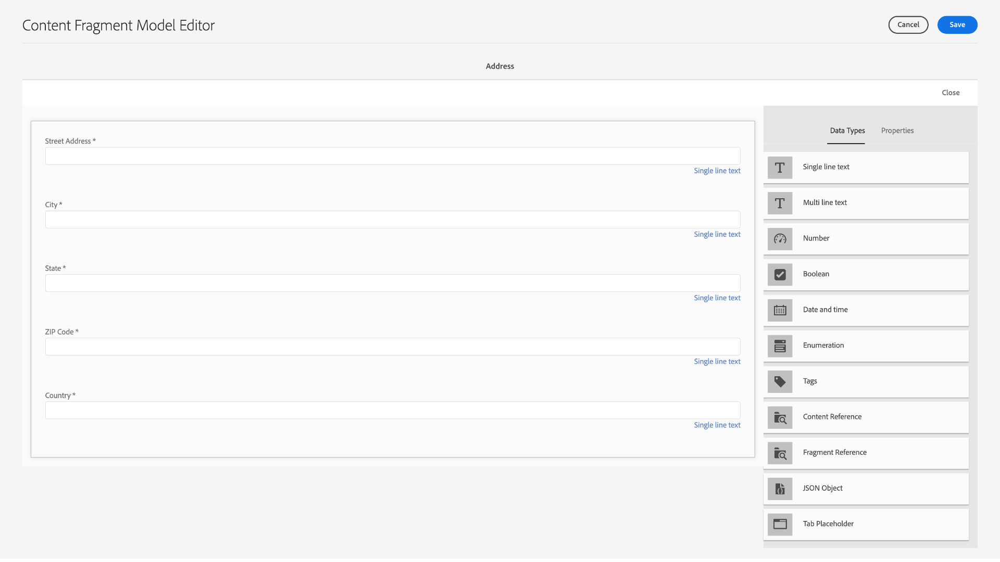
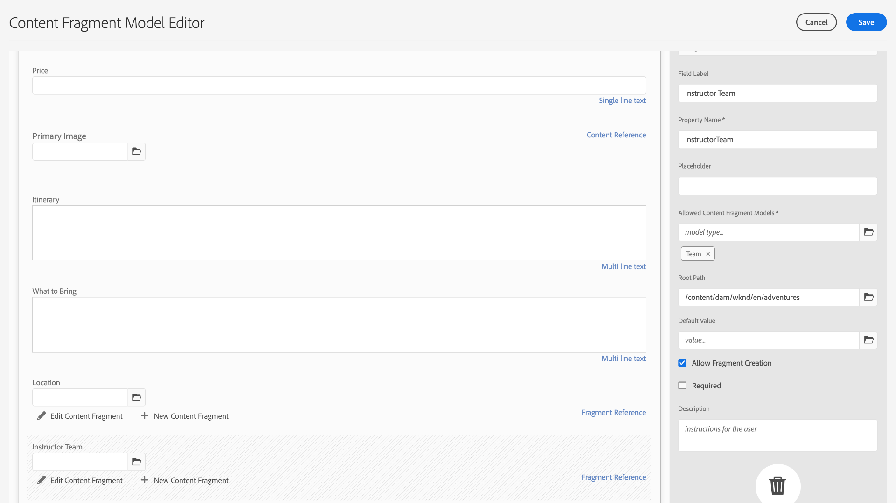

# Criar modelos de fragmento de conteúdo {#create-content-fragment-models}

Este capítulo aborda as etapas para criar cinco Modelos de fragmento de conteúdo:

* **Informação de contato**
* **Endereço**
* **Person**
* **Local**
* **Equipe**

Os modelos de fragmento de conteúdo permitem definir relações entre tipos de conteúdo e persistir tais relações como schemas. Use referências de fragmento aninhadas, vários tipos de dados de conteúdo e o tipo de guia para organização de conteúdo visual. Tipos de dados mais avançados, como espaços reservados para guias, referências de fragmento, objetos JSON e o tipo de dados de data e hora.

Este capítulo também aborda como aprimorar as regras de validação para referências de conteúdo, como imagens.

## Pré-requisitos {#prerequisites}

Este é um tutorial avançado. Antes de continuar com este capítulo, certifique-se de ter concluído a [configuração rápida](../quick-setup/cloud-service.md). Leia também o capítulo de visão geral anterior para obter mais informações sobre a configuração do tutorial avançado.

## Objetivos {#objectives}

* Criar modelos de fragmentos do conteúdo.
* Adicione marcadores de posição de guia, data e hora, objetos JSON, referências de fragmento e referências de conteúdo aos modelos.
* Adicionar validação às referências de conteúdo.

## Visão geral do modelo de fragmento de conteúdo {#content-fragment-model-overview}

O vídeo a seguir fornece uma breve introdução aos Modelos de fragmentos de conteúdo e como eles são usados neste tutorial.

>[!VIDEO](https://video.tv.adobe.com/v/340037/?quality=12&learn=on)

## Criar modelos de fragmento de conteúdo {#create-models}

Vamos criar alguns Modelos de fragmento de conteúdo para o aplicativo WKND. Se você precisar de uma introdução básica para criar Modelos de fragmentos de conteúdo, consulte o capítulo apropriado na [tutorial básico](../multi-step/content-fragment-models.md).

1. Navegar para **Ferramentas** > **Ativos** > **Modelos de fragmentos do conteúdo**.

   

2. Selecionar **Site WKND** para exibir a lista de Modelos de fragmento de conteúdo existentes para o site.

### Modelo de Informações de Contato {#contact-info-model}

Em seguida, crie um modelo que contenha as informações de contato para uma pessoa ou um local.

1. Selecionar **Criar** no canto superior direito.

2. Forneça ao modelo um título de &quot;Informações de contato&quot; e selecione **Criar**. No modal bem-sucedido exibido, selecione **Abrir** para editar o modelo recém-criado.

3. Comece arrastando um **Texto de linha única** no modelo. Dê um **Rótulo do campo** de &quot;Telefone&quot; no **Propriedades** guia . O nome da propriedade é preenchido automaticamente como `phone`. Marque a caixa de seleção para criar o campo **Obrigatório**.

4. Navegue até o **Tipos de dados** e, em seguida, adicione outro **Texto de linha única** abaixo do campo &quot;Telefone&quot;. Dê um **Rótulo do campo** de &quot;Email&quot; e também defina-o como **Obrigatório**.

O Adobe Experience Manager vem com alguns métodos de validação integrados. Esses métodos de validação permitem adicionar regras de governança a campos específicos nos Modelos de fragmento de conteúdo. Nesse caso, vamos adicionar uma regra de validação para garantir que os usuários só possam inserir endereços de email válidos ao preencher esse campo. Em **Tipo de validação** lista suspensa, selecione **E-mail**.

O modelo de fragmento de conteúdo concluído deve ter esta aparência:

Depois de concluído, selecione **Salvar** para confirmar as alterações e fechar o Editor do modelo de fragmento de conteúdo.

### Modelo de endereço {#address-model}

Em seguida, crie um modelo para um endereço.

1. No **Site WKND**, selecione **Criar** no canto superior direito.

2. Insira um título de &quot;Endereço&quot; e selecione **Criar**.

   i. No modal bem-sucedido exibido, selecione **Abrir** para editar o modelo recém-criado.

3. Arraste e solte uma **Texto de linha única** no modelo e dê a ele um **Rótulo do campo** de &quot;Endereço&quot;. O nome da propriedade é então preenchido como `streetAddress`. Selecione o **Obrigatório** caixa de seleção.

4. Repita as etapas acima e adicione mais quatro campos de &quot;Texto de linha única&quot; ao modelo. Use os seguintes rótulos:

   * Cidade
   * Estado
   * Código postal
   * País

5. Selecionar **Salvar** para salvar as alterações no modelo de Endereço.

   O modelo de fragmento &quot;Endereço&quot; completo deve ser semelhante a:
   

### Modelo de pessoa {#person-model}

Em seguida, crie um modelo que contenha informações sobre uma pessoa.

1. No canto superior direito, selecione **Criar**.

2. Dê ao modelo um título de &quot;Pessoa&quot; e selecione **Criar**. No modal bem-sucedido exibido, selecione **Abrir** para editar o modelo recém-criado.

3. Comece arrastando um **Texto de linha única** no modelo. Dê um **Rótulo do campo** de &quot;Nome completo&quot;. O nome da propriedade é preenchido automaticamente como `fullName`. Marque a caixa de seleção para criar o campo **Obrigatório**.

   

4. Os Modelos de fragmento de conteúdo podem ser mencionados em outros modelos. Navegue até o **Tipos de dados** e arraste e solte a guia **Referência do fragmento** e dê a ele um rótulo de &quot;Informações de contato&quot;.

5. No **Propriedades** na guia , em **Modelos permitidos de fragmento do conteúdo** , selecione o ícone de pasta e escolha o **Informações de contato** modelo de fragmento criado anteriormente.

6. Adicione um **Referência de conteúdo** e dê a ele um **Rótulo do campo** de &quot;Imagem do perfil&quot;. Selecione o ícone de pasta em **Caminho raiz** para abrir o modal de seleção de caminho. Selecione um caminho raiz selecionando **conteúdo** > **Ativos**, em seguida, marcar a caixa de seleção para **Site WKND**. Use o **Selecionar** no canto superior direito para salvar o caminho. O caminho do texto final deve ler-se `/content/dam/wknd`.

   

7. Em **Aceitar apenas tipos de conteúdo especificados**, selecione &quot;Image&quot;.

   

8. Para limitar o tamanho e as dimensões do arquivo de imagem, vamos examinar algumas opções de validação para o campo de referência de conteúdo.

   Em **Aceitar apenas o tamanho de ficheiro especificado**, selecione &quot;Less than or equal to&quot; e campos adicionais serão exibidos abaixo.
   

9. Para **Max**, digite &quot;5&quot; e para **Selecionar Unidade**, selecione &quot;Megabytes (MB)&quot;. Essa validação permite que apenas imagens do tamanho especificado sejam escolhidas.

10. Em **Aceitar somente a largura da imagem especificada**, selecione &quot;Largura máxima&quot;. No **Máx (pixels)** digite &quot;500&quot;. Selecione as mesmas opções para **Aceitar apenas uma altura de imagem especificada**.

    Essas validações garantem que as imagens adicionadas não excedam os valores especificados. As regras de validação agora devem ter esta aparência:
    

11. Adicione um **Texto de várias linhas** e dê a ele um **Rótulo do campo** de &quot;Biografia&quot;. Deixe o **Tipo padrão** lista suspensa como a opção padrão &quot;Rich Text&quot;.

    

12. Navegue até o **Tipos de dados** e arraste uma **Enumeração** embaixo de &quot;Imagem do perfil&quot;. Em vez do padrão **Renderizar como** , selecione **Lista suspensa**. Insira uma seleção de opções de nível de experiência de instrutor, como Expert, Advanced, Intermediate.

13. Em seguida, arraste outro **Enumeração** em &quot;Nível de experiência do instrutor&quot; e escolha &quot;caixas de seleção&quot; no campo **Renderizar como** opção. Insira habilidades diferentes, como Escala de Rock, Surfe, Ciclismo, Esqui e Background. O rótulo da opção e o valor da opção devem corresponder como abaixo:

    

14. Por fim, crie um rótulo de campo &quot;Detalhes do administrador&quot; usando um **Texto de várias linhas** campo.

Selecionar **Salvar** para confirmar as alterações e fechar o Editor do modelo de fragmento de conteúdo.

### Modelo de localização {#location-model}

O próximo Modelo de fragmento de conteúdo descreve um local físico. Esse modelo usa espaços reservados em guias. Os espaços reservados em guias ajudam a organizar os tipos de dados no editor de modelo e o conteúdo no editor de fragmentos, respectivamente, categorizando o conteúdo. Cada espaço reservado cria uma guia, semelhante a uma guia em um navegador da Internet, no editor Fragmento de conteúdo. O modelo de Localização deve ter duas guias: Detalhes do local e endereço do local.

1. Como anteriormente, selecione **Criar** para criar outro Modelo de fragmento de conteúdo. Para o Título do Modelo, digite &quot;Localização&quot;. Selecionar **Criar** seguida de **Abrir** no modal bem-sucedido exibido.

2. Adicione um **Marcador de posição de tabulação** para o modelo e rotule-o como &quot;Detalhes do local&quot;.

3. Arraste e solte uma **Texto de linha única** e rotule-o como &quot;Nome&quot;. Abaixo deste rótulo de campo, adicione um **texto de várias linhas** e rotule-o como &quot;Descrição&quot;.

4. Em seguida, adicione um **Referência do fragmento** e rotule-o como &quot;Informações de contato&quot;. Na guia propriedades, em **Modelos permitidos de fragmento do conteúdo**, selecione o **Ícone da pasta** e escolha o modelo de fragmento &quot;Informações de contato&quot; criado anteriormente.

5. Adicione um **Referência de conteúdo** em &quot;Informações de contato&quot;. Atribua um rótulo a &quot;Imagem de localização&quot;. O **Caminho raiz** deve ser `/content/dam/wknd.` Em **Aceitar apenas tipos de conteúdo especificados**, selecione &quot;Image&quot;.

6. Também vamos adicionar um **Objeto JSON** no campo &quot;Imagem de localização&quot;. Como esse tipo de dados é flexível, ele pode ser usado para exibir qualquer dado que você deseja incluir no seu conteúdo. Nesse caso, o JSON Object é usado para exibir informações sobre o tempo. Rotule o objeto JSON &quot;Tempo por temporada&quot;. No **Propriedades** , adicione uma **Descrição** portanto, fica claro para o usuário quais dados devem ser inseridos aqui: &quot;Dados JSON relacionados ao local do evento por estação (primavera, verão, outono, inverno).&quot;

   

7. Para criar a guia Endereço de localização , adicione um **Marcador de posição de tabulação** para o modelo e rotule-o como &quot;Endereço de localização&quot;.

8. Arraste e solte uma **Referência do fragmento** e da guia propriedades, em **Modelos permitidos de fragmento do conteúdo**, selecione o **Endereço** modelo.

9. Selecionar **Salvar** para confirmar as alterações e fechar o Editor do modelo de fragmento de conteúdo. O modelo de Localização concluído deve aparecer como abaixo:

   

### Modelo de equipe {#team-model}

Finalmente, crie um modelo que descreva uma equipe de pessoas.

1. No **Site WKND** página, selecione **Criar** para criar outro Modelo de fragmento de conteúdo. Para o Título do Modelo, digite &quot;Equipe&quot;. Como anteriormente, selecione **Criar** seguida de **Abrir** no modal bem-sucedido exibido.

2. Adicione um **Texto de várias linhas** para o formulário. Em **Rótulo do campo**, digite &quot;Descrição&quot;.

3. Adicione um **Data e hora** para o modelo e rotule-o como &quot;Data de criação da equipe&quot;. Nesse caso, mantenha o padrão **Tipo** definido como &quot;Data&quot;, mas observe que também é possível usar &quot;Data e hora&quot; ou &quot;Hora&quot;.

   

4. Navegue até o **Tipos de dados** guia . Abaixo da &quot;Data de criação da equipe&quot;, adicione um **Referência do fragmento**. No **Renderizar como** selecione &quot;vários campos&quot; na lista suspensa. Para **Rótulo do campo**, digite &quot;Membros da equipe&quot;. Esse campo vincula-se ao modelo Pessoa criado anteriormente. Como o tipo de dados é um multicampo, vários fragmentos de Pessoa podem ser adicionados, permitindo a criação de um grupo de pessoas.

   

5. Em **Modelos permitidos de fragmento do conteúdo**, use o ícone de pasta para abrir o modal Selecionar caminho e selecione o **Pessoa** modelo. Use o **Selecionar** para salvar o caminho.

   

6. Selecionar **Salvar** para confirmar as alterações e fechar o Editor do modelo de fragmento de conteúdo.

## Adicionar referências de fragmento ao modelo de publicidade {#fragment-references}

Semelhante à forma como o modelo Equipe tem uma referência de fragmento para o modelo Pessoa, os modelos Equipe e Local devem ser referenciados no modelo Aventura para exibir esses novos modelos no aplicativo WKND.

1. No **Site WKND** selecione o **Aventura** e, em seguida, selecione **Editar** no início da navegação.

   

2. Na parte inferior do formulário, abaixo de &quot;O que trazer&quot;, adicione um **Referência do fragmento** campo. Insira um **Rótulo do campo** de &quot;Localização&quot;. Em **Modelos permitidos de fragmento do conteúdo**, selecione o **Localização** modelo.

   

3. Adicione mais um **Referência do fragmento** e rotule-o como &quot;Equipe do instrutor&quot;. Em **Modelos permitidos de fragmento do conteúdo**, selecione o **Equipe** modelo.

   

4. Adicionar outro **Referência do fragmento** e rotule-o como &quot;Administrador&quot;.

   

5. Selecionar **Salvar** para confirmar as alterações e fechar o Editor do modelo de fragmento de conteúdo.

## Práticas recomendadas     {#best-practices}

Há algumas práticas recomendadas relacionadas à criação de Modelos de fragmento de conteúdo:

* Crie modelos que mapeiam para componentes UX. Por exemplo, o aplicativo WKND tem Modelos de fragmento de conteúdo para aventuras, artigos e localização. Você também pode adicionar cabeçalhos, promoções ou isenções de responsabilidade. Cada um desses exemplos compõe um componente UX específico.

* Crie o menor número possível de modelos. Limitar o número de modelos permite maximizar a reutilização e simplificar o gerenciamento de conteúdo.

* Aninhe os Modelos de fragmento do conteúdo conforme necessário, mas somente conforme necessário. Lembre-se de que o aninhamento é realizado com referências de fragmento ou referências de conteúdo. Considere um máximo de cinco níveis de aninhamento.

## Parabéns! {#congratulations}

Parabéns! Agora você adicionou guias, usou os tipos de dados de data e hora e objeto JSON e aprendeu mais sobre referências de fragmento e conteúdo. Você também adicionou regras de validação de referência de conteúdo.

## Próximas etapas {#next-steps}

O próximo capítulo desta série cobrirá [criação de fragmentos de conteúdo](/help/headless-tutorial/graphql/advanced-graphql/author-content-fragments.md) dos modelos criados neste capítulo. Saiba como usar os tipos de dados introduzidos neste capítulo e criar políticas de pastas para limitar quais Modelos de fragmentos de conteúdo podem ser criados em uma pasta de ativos.

Embora seja opcional para este tutorial, certifique-se de publicar todo o conteúdo em situações de produção real. Para obter uma análise dos ambientes Autor e Publicação no AEM, consulte o
[Série de vídeos GraphQL sem cabeçalho AEM](/help/headless-tutorial/graphql/video-series/author-publish-architecture.md).
