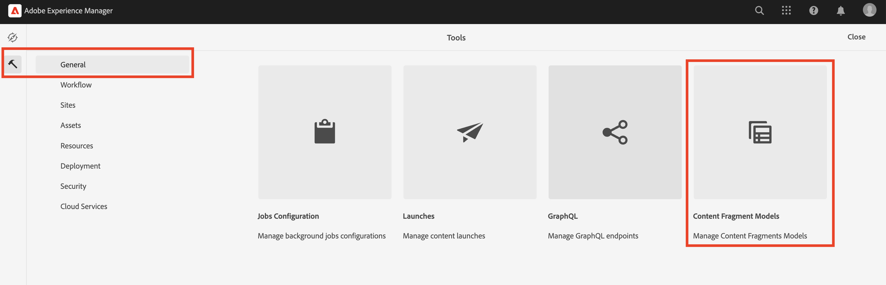

# Criar modelos de fragmentos de conteúdo {#create-content-fragment-models}

Este capítulo aborda as etapas para criar cinco modelos de fragmento de conteúdo:

* **Informações de contato**
* **Endereço**
* **Pessoa**
* **Local**
* **Equipe**

Os modelos de fragmento de conteúdo permitem definir relações entre tipos de conteúdo e manter essas relações como esquemas. Use referências de fragmento aninhadas, vários tipos de dados de conteúdo e o tipo de guia para organização visual do conteúdo. Tipos de dados mais avançados, como espaços reservados para guias, referências de fragmentos, objetos JSON e o tipo de dados data e hora.

Este capítulo também aborda como aprimorar as regras de validação para referências de conteúdo, como imagens.

## Pré-requisitos {#prerequisites}

Este é um tutorial avançado. Antes de continuar com este capítulo, verifique se você concluiu a [instalação rápida](../quick-setup/cloud-service.md). Leia também o capítulo [visão geral](../overview.md) anterior para obter mais informações sobre a configuração do tutorial avançado.

## Objetivos {#objectives}

* Criar modelos de fragmento de conteúdo.
* Adicione espaços reservados em guias, data e hora, objetos JSON, referências de fragmento e referências de conteúdo aos modelos.
* Adicione validação às referências de conteúdo.

## Visão geral do modelo de fragmento de conteúdo {#content-fragment-model-overview}

O vídeo a seguir fornece uma breve introdução aos modelos de fragmento de conteúdo e como eles são usados neste tutorial.

>[!VIDEO](https://video.tv.adobe.com/v/340037?quality=12&learn=on)

## Criar modelos de fragmentos de conteúdo {#create-models}

Vamos criar alguns modelos de fragmento de conteúdo para o aplicativo WKND. Se você precisar de uma introdução básica à criação de modelos de fragmento de conteúdo, consulte o capítulo apropriado no [tutorial básico](../multi-step/content-fragment-models.md).

1. Navegue até **Ferramentas** > **Geral** > **Modelos de fragmentos de conteúdo**.

   

1. Selecione **WKND Compartilhado** para exibir a lista de modelos de fragmento de conteúdo existentes para o site.

### Modelo de informações de contato {#contact-info-model}

Em seguida, crie um modelo que contenha as informações de contato de uma pessoa ou local.

1. Selecione **Criar** no canto superior direito.

1. Dê ao modelo um título de &quot;Informações de Contato&quot; e selecione **Criar**. No modal de sucesso exibido, selecione **Abrir** para editar o modelo recém-criado.

1. Comece arrastando um campo de **Texto de linha única** para o modelo. Atribua a ele o **Rótulo do Campo** de &quot;Telefone&quot; na guia **Propriedades**. O nome da propriedade é preenchido automaticamente como `phone`. Marque a caixa de seleção para tornar o campo **Obrigatório**.

1. Navegue até a guia **Tipos de Dados** e adicione outro campo **Texto de linha única** abaixo do campo &quot;Telefone&quot;. Atribua a ele o **Rótulo do campo** de &quot;Email&quot; e também defina-o como **Obrigatório**.

O Adobe Experience Manager vem com alguns métodos de validação integrados. Esses métodos de validação permitem adicionar regras de governança a campos específicos nos modelos de fragmento de conteúdo. Nesse caso, vamos adicionar uma regra de validação para garantir que os usuários só possam inserir endereços de email válidos ao preencher esse campo. Na lista suspensa **Tipo de Validação**, selecione **Email**.

O modelo completo de fragmento de conteúdo deve ser semelhante a:

Depois de concluído, selecione **Salvar** para confirmar as alterações e fechar o Editor de modelo de fragmento de conteúdo.

### Modelo de endereço {#address-model}

Em seguida, crie um modelo para um endereço.

1. No **WKND Compartilhado**, selecione **Criar** no canto superior direito.

1. Insira um título de &quot;Endereço&quot; e selecione **Criar**. No modal de sucesso exibido, selecione **Abrir** para editar o modelo recém-criado.

1. Arraste e solte um campo **Texto de linha única** no modelo e atribua a ele o **Rótulo do campo** de &quot;Endereço&quot;. O nome da propriedade é preenchido como `streetAddress`. Marque a caixa de seleção **Obrigatório**.

1. Repita as etapas acima e adicione mais quatro campos de &quot;Texto de linha única&quot; ao modelo. Use os seguintes rótulos:

   * Cidade
   * Estado
   * Código postal
   * País

1. Selecione **Salvar** para salvar as alterações no modelo de endereço.

   O modelo de fragmento &quot;Endereço&quot; concluído deve ter esta aparência:
   

### Modelo de pessoa {#person-model}

Em seguida, crie um modelo que contenha informações sobre uma pessoa.

1. No canto superior direito, selecione **Criar**.

1. Dê ao modelo um título de &quot;Pessoa&quot; e selecione **Criar**. No modal de sucesso exibido, selecione **Abrir** para editar o modelo recém-criado.

1. Comece arrastando um campo de **Texto de linha única** para o modelo. Atribua a ele o **Rótulo do campo** de &quot;Nome completo&quot;. O nome da propriedade é preenchido automaticamente como `fullName`. Marque a caixa de seleção para tornar o campo **Obrigatório**.

   

1. Os modelos de fragmento de conteúdo podem ser consultados em outros modelos. Navegue até a guia **Tipos de dados**, arraste e solte o campo **Referência de fragmento** e atribua a ele o rótulo &quot;Informações de contato&quot;.

1. Na guia **Propriedades**, no campo **Modelos de fragmento de conteúdo permitidos**, selecione o ícone de pasta e escolha o modelo de fragmento **Informações de contato** criado anteriormente.

1. Adicione um campo **Referência de Conteúdo** e forneça a ele o **Rótulo do Campo** da &quot;Imagem do Perfil&quot;. Selecione o ícone de pasta em **Caminho raiz** para abrir a modal de seleção de caminho. Selecione um caminho raiz selecionando **conteúdo** > **Assets** e marcando a caixa de seleção de **WKND Compartilhado**. Use o botão **Selecionar** na parte superior direita para salvar o caminho. O caminho do texto final deve ser `/content/dam/wknd-shared`.

   

1. Em **Aceitar somente tipos de conteúdo especificados**, selecione &quot;Imagem&quot;.

   

1. Para limitar o tamanho e as dimensões do arquivo de imagem, vamos ver algumas opções de validação para o campo de referência de conteúdo.

   Em **Aceitar apenas o tamanho de arquivo especificado**, selecione &quot;Menor que ou igual a&quot; e campos adicionais aparecerão abaixo.
   

1. Para **Máx**, digite &quot;5&quot; e para **Selecionar Unidade**, selecione &quot;Megabytes (MB)&quot;. Essa validação permite que apenas imagens do tamanho especificado sejam escolhidas.

1. Em **Aceitar apenas a largura de imagem especificada**, selecione &quot;Largura Máxima&quot;. No campo **Máx. (pixels)** exibido, digite &quot;10000&quot;. Selecione as mesmas opções para **Aceitar apenas uma altura de imagem especificada**.

   Essas validações garantem que as imagens adicionadas não excedam os valores especificados. Agora, as regras de validação se parecem com o seguinte:

   

1. Adicione um campo **Texto de várias linhas** e dê a ele um **Rótulo do Campo** de &quot;Biografia&quot;. Deixe a lista suspensa **Tipo padrão** como a opção padrão de &quot;Rich Text&quot;.

   

1. Navegue até a guia **Tipos de Dados** e arraste um campo **Enumeração** abaixo de &quot;Biografia&quot;. Em vez da opção padrão **Renderizar como**, selecione **Lista suspensa** e atribua a ela o **Rótulo do campo** de &quot;Nível de experiência do professor&quot;. Insira uma seleção de opções de nível de experiência do professor, como _Especialista, Avançado, Intermediário_.

1. Em seguida, arraste outro campo **Enumeração** em &quot;Nível de Experiência do Professor&quot; e escolha &quot;caixas de seleção&quot; na opção **Renderizar como**. Atribua a ele o **Rótulo do campo** de &quot;Habilidades&quot;. Entre em diferentes habilidades, como escalada, surf, ciclismo, esqui e mochila. O rótulo da opção e o valor da opção devem corresponder conforme abaixo:

   

1. Por fim, crie um rótulo de campo &quot;Detalhes do administrador&quot; usando um campo **Texto de várias linhas**.

Selecione **Salvar** para confirmar as alterações e fechar o Editor de modelo de fragmento de conteúdo.

### Modelo de localização {#location-model}

O próximo modelo de fragmento de conteúdo descreve um local físico. Esse modelo usa espaços reservados em guias. Os espaços reservados para guias ajudam a organizar os tipos de dados no editor de modelo e o conteúdo no editor de fragmento, respectivamente, categorizando o conteúdo. Cada espaço reservado cria uma guia, semelhante a uma guia em um navegador da Internet, no editor de Fragmento de conteúdo. O modelo de Localização deve ter duas guias: Detalhes da localização e Endereço da localização.

1. Como anteriormente, selecione **Criar** para criar outro modelo de fragmento de conteúdo. Para o Título do modelo, digite &quot;Local&quot;. Selecione **Criar** seguido de **Abrir** no modal bem-sucedido que aparece.

1. Adicione um campo **Espaço reservado de guia** ao modelo e rotule-o como &quot;Detalhes de localização&quot;.

1. Arraste e solte um **Texto de linha única** e rotule-o como &quot;Nome&quot;. Abaixo deste rótulo de campo, adicione um campo **texto multilinha** e rotule-o como &quot;Descrição&quot;.

1. Em seguida, adicione um campo **Referência de fragmento** e rotule-o como &quot;Informações de contato&quot;. Na guia de propriedades, em **Modelos de fragmento de conteúdo permitidos**, selecione o **ícone de pasta** e escolha o modelo de fragmento &quot;Informações de contato&quot; criado anteriormente.

1. Adicione um campo **Referência de conteúdo** em &quot;Informações de contato&quot;. Rotule-o como &quot;Imagem de localização&quot;. O **Caminho Raiz** deve ser `/content/dam/wknd-shared.` em **Aceitar somente tipos de conteúdo especificados**, selecione &quot;Imagem&quot;.

1. Também vamos adicionar um campo **Objeto JSON** sob a &quot;Imagem do local&quot;. Como esse tipo de dados é flexível, ele pode ser usado para exibir quaisquer dados que você deseja incluir no conteúdo. Nesse caso, o objeto JSON é usado para exibir informações sobre o tempo. Rotule o objeto JSON &quot;Clima por temporada&quot;. Na guia **Propriedades**, adicione uma **Descrição** para que fique claro para o usuário quais dados devem ser inseridos aqui: &quot;Dados JSON sobre o clima do local do evento por estação (primavera, Verão, outono, inverno).&quot;

   

1. Para criar a guia Endereço do local, adicione um campo **Espaço reservado de guia** ao modelo e rotule-o como &quot;Endereço do local&quot;.

1. Arraste e solte um campo **Referência de fragmento** e, na guia de propriedades, rotule-o como &quot;Endereço&quot; e, em **Modelos de fragmento de conteúdo permitidos**, selecione o modelo **Endereço**.

1. Selecione **Salvar** para confirmar as alterações e fechar o Editor de modelo de fragmento de conteúdo. O modelo de Localização concluído deve aparecer conforme abaixo:

   

### Modelo da equipe {#team-model}

Finalmente, crie um modelo que descreva uma equipe de pessoas.

1. Na página **WKND Compartilhado**, selecione **Criar** para criar outro Modelo de Fragmento de Conteúdo. Para o Título do modelo, digite &quot;Equipe&quot;. Como anteriormente, selecione **Criar** seguido de **Abrir** no modal bem-sucedido exibido.

1. Adicione um campo de **Texto de várias linhas** ao formulário. Em **Rótulo do campo**, digite &quot;Descrição&quot;.

1. Adicione um campo **Data e Hora** ao modelo e rotule-o como &quot;Data de Fundação da Equipe&quot;. Nesse caso, mantenha o **Type** padrão definido como &quot;Date&quot;, mas observe que também é possível usar &quot;Date &amp; Time&quot; ou &quot;Time&quot;.

   

1. Navegue até a guia **Tipos de Dados**. Abaixo da &quot;Data de Fundação da Equipe&quot;, adicione uma **Referência de fragmento**. Na lista suspensa **Renderizar como**, selecione &quot;vários campos&quot;. Para **Rótulo do Campo**, digite &quot;Membros da Equipe&quot;. Este campo está vinculado ao modelo _Pessoa_ criado anteriormente. Como o tipo de dados é um multicampo, vários fragmentos de Pessoa podem ser adicionados, permitindo a criação de uma equipe de pessoas.

   

1. Em **Modelos de fragmento de conteúdo permitidos**, use o ícone de pasta para abrir a modal Selecionar caminho e selecione o modelo **Pessoa**. Use o botão **Selecionar** para salvar o caminho.

   

1. Selecione **Salvar** para confirmar as alterações e fechar o Editor de modelo de fragmento de conteúdo.

## Adicionar referências de fragmento ao modelo de aventura {#fragment-references}

Semelhante à forma como o modelo Equipe tem uma referência de fragmento para o modelo Pessoa, os modelos Equipe e Localização devem ser referenciados a partir do modelo Aventura para exibir esses novos modelos no aplicativo WKND.

1. Na página **WKND Compartilhado**, selecione o modelo **Aventura** e selecione **Editar** na navegação superior.

   

1. Na parte inferior do formulário, abaixo de &quot;O que trazer&quot;, adicione um campo **Referência de fragmento**. Insira um **Rótulo de campo** de &quot;Localização&quot;. Em **Modelos de fragmento de conteúdo permitidos**, selecione o modelo **Localização**.

   

1. Adicione mais um campo **Referência de fragmento** e rotule-o como &quot;Equipe do professor&quot;. Em **Modelos de fragmento de conteúdo permitidos**, selecione o modelo **Equipe**.

   

1. Adicione outro campo **Referência de fragmento** e rotule-o como &quot;Administrador&quot;.

   

1. Selecione **Salvar** para confirmar as alterações e fechar o Editor de modelo de fragmento de conteúdo.

## Práticas recomendadas {#best-practices}

Existem algumas práticas recomendadas relacionadas à criação de modelos de fragmento de conteúdo:

* Criar modelos que mapeiam para componentes UX. Por exemplo, o aplicativo WKND tem modelos de fragmento de conteúdo para aventuras, artigos e localização. Você também pode adicionar cabeçalhos, promoções ou isenções de responsabilidade. Cada um desses exemplos compõe um componente UX específico.

* Crie o menor número de modelos possível. Limitar o número de modelos permite maximizar a reutilização e simplificar o gerenciamento de conteúdo.

* Aninhe os modelos de fragmento de conteúdo tão profundamente quanto necessário, mas somente conforme necessário. Lembre-se de que o aninhamento é realizado com referências de fragmento ou de conteúdo. Considere um máximo de cinco níveis de aninhamento.

## Parabéns. {#congratulations}

Parabéns! Agora você adicionou guias, usou os tipos de dados de objeto data e hora e JSON e aprendeu mais sobre referências de fragmento e conteúdo. Você também adicionou regras de validação de referência de conteúdo.

## Próximas etapas {#next-steps}

O próximo capítulo desta série abordará [criação de fragmentos de conteúdo](/help/headless-tutorial/graphql/advanced-graphql/author-content-fragments.md) a partir dos modelos criados neste capítulo. Saiba como usar os tipos de dados introduzidos neste capítulo e criar políticas de pasta para limitar quais modelos de fragmento de conteúdo podem ser criados em uma pasta de ativos.

Embora seja opcional para este tutorial, publique todo o conteúdo em situações de produção reais. Para obter uma revisão dos ambientes Autor e Publicação no AEM, consulte o
[Série de vídeos do AEM Headless e do GraphQL](/help/headless-tutorial/graphql/video-series/author-publish-architecture.md).
