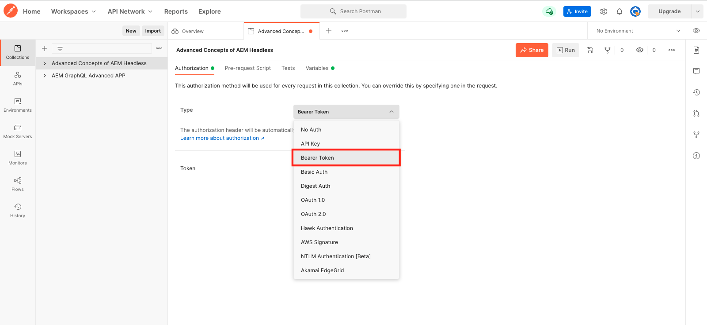
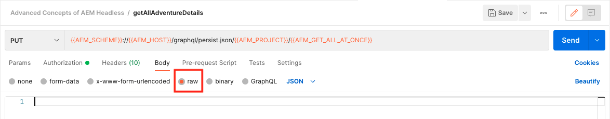

# Consultas GraphQL persistentes

As consultas persistentes são consultas armazenadas no servidor do Adobe Experience Manager (AEM). Os clientes podem enviar uma solicitação HTTP GET com o nome da consulta para executá-la. O benefício desta abordagem é a capacidade de armazenamento em cache. Embora as consultas GraphQL do lado do cliente também possam ser executadas usando solicitações HTTP POST, que não podem ser armazenadas em cache, as consultas persistentes podem ser armazenadas em cache por caches HTTP ou CDN, melhorando o desempenho. As consultas persistentes permitem simplificar as solicitações e melhorar a segurança, pois as consultas são encapsuladas no servidor e o administrador do AEM tem controle total sobre elas. É uma prática recomendada e o uso de consultas persistentes ao trabalhar com a API GraphQL AEM.

No capítulo anterior, você explorou algumas consultas GraphQL avançadas para coletar dados do aplicativo WKND. Neste capítulo, você manterá essas consultas para AEM, atualizá-las e aprender a usar o controle de cache em consultas persistentes.

## Pré-requisitos {#prerequisites}

Este documento faz parte de um tutorial de várias partes. Certifique-se de que os capítulos anteriores foram concluídos antes de prosseguir com este capítulo.

Este tutorial usa [Postman](https://www.postman.com/) para executar solicitações HTTP. Certifique-se de estar conectado ao serviço antes de iniciar este capítulo. Este tutorial também requer conhecimento prático do aplicativo Postman, como configurar uma coleção, criar variáveis e fazer solicitações. Consulte a documentação do Postman em [criação de solicitações](https://learning.postman.com/docs/sending-requests/requests/) e [enviar sua primeira solicitação](https://learning.postman.com/docs/getting-started/sending-the-first-request/) para obter mais detalhes sobre como fazer solicitações de API no aplicativo.

Neste capítulo, as consultas exploradas no capítulo anterior são persistentes para AEM. Você pode baixar um arquivo de texto com essas consultas GraphQL padrão [here](assets/graphql-persisted-queries/advanced-concepts-aem-headless-graphql-queries.txt) para facilitar a referência.

## Objetivos {#objectives}

Neste capítulo, saiba como:

* Manter consultas GraphQL com parâmetros
* Atualizar consultas persistentes
* Usar parâmetros de controle de cache com consultas persistentes

## Visão geral de consultas persistentes

Este vídeo fornece uma visão geral de como persistir consultas GraphQL, atualizá-las e usar o controle de cache.

>[!VIDEO](https://video.tv.adobe.com/v/340036/?quality=12&learn=on)

## Habilitar consultas persistentes

Primeiro, verifique se as consultas persistentes estão habilitadas para o projeto do Site WKND na sua instância de AEM.

1. Navegar para **Ferramentas** > **Geral** > **Navegador de configuração**.

1. Selecionar **Site WKND**, em seguida selecione **Propriedades** na barra de navegação superior para abrir as propriedades de configuração.

   

   Na página Propriedades de configuração , você deve ver que a variável **Consultas Persistentes GraphQL** está ativada.

   

## Importar Coleção de Postman

Para facilitar o acompanhamento do tutorial, uma coleção de Postman é fornecida. Como alternativa, ferramentas de linha de comando como `curl` pode ser usada.

1. Baixe e instale [Postman](https://www.postman.com/)
1. Baixe o [AdvancedConceptsofAEMHeadless.postman_collection.json](/help/headless-tutorial/graphql/advanced-graphql/assets/tutorial-files/AdvancedConceptsofAEMHeadless.postman_collection.json)
1. Abra o aplicativo Postman
1. Selecionar **Arquivo** > **Importar** > **Fazer upload do arquivo** e escolha `AdvancedConceptsofAEMHeadless.postman_collection.json` para importar a coleção.

   

### Autenticação

A autenticação é necessária para enviar consultas contra uma instância do autor de AEM. Este tutorial é baseado no ambiente as a Cloud Service AEM e usa a autenticação Portador com um token de desenvolvimento. Para configurar a autenticação para sua coleção Postman, use as seguintes etapas:

1. Para obter um token de desenvolvimento, navegue até o Console do desenvolvedor da nuvem, abra o **Integrações** e selecione **Obter Token de Desenvolvimento Local**.

   

1. Na sua coleção Postman, navegue até o **Autenticação** e selecione **Token do portador** no **Tipo** menu suspenso.

   

1. Insira o token de desenvolvimento no **Token** campo. Você pode passar o token por meio de uma variável, conforme explicado na próxima seção.

   

### Variáveis {#variables}

Você pode transmitir valores como tokens de autenticação e componentes de URI por meio de variáveis na sua coleção Postman para simplificar o processo. Neste tutorial, use as seguintes etapas para criar variáveis:

1. Navegue até o **Variáveis** na sua coleção Postman e crie as seguintes variáveis:

   | Variável | Valor |
   | --- | --- |
   | `AEM_SCHEME` | `https` |
   | `AEM_AUTH_TOKEN` | (Seu token de desenvolvimento) |
   | `AEM_HOST` | (O nome do host da sua instância de AEM) |
   | `AEM_PROJECT` | `wknd` |

1. Você também pode adicionar variáveis para cada query mantida que deseja criar. Para este tutorial, mantenha as seguintes consultas: `getAdventureAdministratorDetailsByAdministratorName`, `getTeamByAdventurePath`, `getLocationDetailsByLocationPath`, `getTeamMembersByAdventurePath`, `getLocationPathByAdventurePath`e `getTeamLocationByLocationPath`.

   Crie as seguintes variáveis:

   * `AEM_GET_ADVENTURE_ADMINISTRATOR_DETAILS_BY_ADMINISTRATOR_NAME` : `adventure-administrator-details-by-administrator-name`
   * `AEM_GET_ADVENTURE_ADMINISTRATOR_DETAILS_BY_ADMINISTRATOR_NAME` : `adventure-administrator-details-by-administrator-name`
   * `AEM_GET_TEAM_LOCATION_BY_LOCATION_PATH` : `team-location-by-location-path`
   * `AEM_GET_TEAM_MEMBERS_BY_ADVENTURE_PATH` : `team-members-by-adventure-path`
   * `AEM_GET_LOCATION_DETAILS_BY_LOCATION_PATH` : `location-details-by-location-path`
   * `AEM_GET_LOCATION_PATH_BY_ADVENTURE_PATH` : `location-path-by-adventure-path`
   * `AEM_GET_TEAM_BY_ADVENTURE_PATH` : `team-by-adventure-path`

   Depois de concluído, a variável **Variáveis** na sua coleção Postman deve ser semelhante ao seguinte:

   

## Manter consultas GraphQL com parâmetros

No [Série de vídeos GraphQL sem cabeçalho AEM](../video-series/graphql-persisted-queries.md), você aprendeu a criar consultas GraphQL persistentes. Nesta seção, vamos persistir e executar uma consulta GraphQL com um parâmetro.

### Criar uma consulta persistente {#create-persisted-query}

Neste exemplo, vamos persistir no `getAdventureAdministratorDetailsByAdministratorName` que você criou no capítulo anterior.

>[!NOTE]
>
>O método PUT HTTP é usado para criar uma consulta persistente e o método POST HTTP é usado para atualizá-la.

1. Primeiro, adicione uma nova solicitação em sua coleção Postman. Selecione o método HTTP PUT para criar uma consulta persistente e usar o seguinte URI de solicitação:

   ```plaintext
   {{AEM_SCHEME}}://{{AEM_HOST}}/graphql/persist.json/{{AEM_PROJECT}}/{{AEM_GET_ADVENTURE_ADMINISTRATOR_DETAILS_BY_ADMINISTRATOR_NAME}}
   ```

   Observe que o URI usa a variável `/graphql/persist.json` ação.

1. Cole o `getAdventureAdministratorDetailsByAdministratorName` Consulta GraphQL no corpo da solicitação. Observe que é a consulta GraphQL padrão com uma variável `name` que exige uma `String`.

   

1. Execute a solicitação. Você deve receber a seguinte resposta:

   

   Você criou com êxito uma consulta persistente chamada `adventure-administrator-details-by-administrator-name`.

### Executar uma consulta persistente

Vamos executar a consulta persistente que você criou.

1. Crie uma nova solicitação do GET em sua coleção Postman, usando o seguinte URI de solicitação:

   ```plaintext
   {{AEM_SCHEME}}://{{AEM_HOST}}/graphql/execute.json/{{AEM_PROJECT}}/{{AEM_GET_ADVENTURE_ADMINISTRATOR_DETAILS_BY_ADMINISTRATOR_NAME}}
   ```

   Observe que o URI da solicitação agora inclui o `execute.json` ação.

   Se você executar essa solicitação como está, um erro será lançado porque a consulta requer uma variável `name`. Você deve passar essa variável como parâmetro no URI da solicitação.

   

1. Em seguida, recupere um Administrador com o nome Jacob Wester. Os parâmetros para as consultas GraphQL persistentes devem ser separados dos componentes do URI anteriores por `;` e codificadas antes de passá-las para o URI de solicitação. No console do navegador, execute o seguinte comando:

   ```js
   encodeURIComponent(";name=Jacob Wester")
   ```

   

1. Copie o resultado do console e cole-o no final do URI da solicitação no Postman. Você deve ter o seguinte URI de solicitação:

   ```plaintext
   {{AEM_SCHEME}}://{{AEM_HOST}}/graphql/execute.json/{{AEM_PROJECT}}/{{AEM_GET_ADVENTURE_ADMINISTRATOR_DETAILS_BY_ADMINISTRATOR_NAME}}%3Bname%3DJacob%20Wester
   ```

1. Execute a solicitação GET. Você deve receber a seguinte resposta:

   

Agora você criou e executou uma consulta GraphQL mantida com um parâmetro.

Você pode seguir as etapas descritas acima para manter o restante das consultas GraphQL da [arquivo de texto](assets/graphql-persisted-queries/advanced-concepts-aem-headless-graphql-queries.txt) uso das variáveis criadas na [início deste capítulo](#variables).

O [Coleção de postman](/help/headless-tutorial/graphql/advanced-graphql/assets/tutorial-files/AdvancedConceptsofAEMHeadless.postman_collection.json) O também está disponível para download e importação.

## Atualizar consultas persistentes

Embora as consultas persistentes sejam criadas usando uma solicitação PUT, você deve usar uma solicitação POST para atualizar uma consulta persistente existente. Para este tutorial, vamos atualizar a consulta mantida chamada `adventure-administrator-details-by-administrator-name` que você criou na [seção anterior](#create-persisted-query).

1. Duplique a guia usada para a solicitação de PUT na seção anterior. Na cópia, altere o método HTTP para POST.

1. Na consulta GraphQL, vamos remover a variável `plaintext` do `administratorDetails` campo.

   

1. Execute a solicitação. Você deve obter a seguinte resposta:

   

Agora você atualizou o `adventure-administrator-details-by-administrator-name` consulta persistente. É importante sempre atualizar as consultas GraphQL em AEM caso de alterações.

## Envio de parâmetros de controle de cache em consultas persistentes {#cache-control-all-adventures}

A API GraphQL da AEM permite adicionar parâmetros de controle de cache às suas consultas para melhorar o desempenho.

Use o `getAllAdventureDetails` query criada no capítulo anterior. A resposta da consulta é grande e é útil controlar sua `age` no cache.

Essa consulta persistente é usada posteriormente para atualizar o [aplicativo cliente](/help/headless-tutorial/graphql/advanced-graphql/client-application-integration.md).

1. Na coleção Postman, crie uma nova variável:

   ```plaintext
   AEM_GET_ALL_AT_ONCE: all-adventure-details
   ```

1. Crie uma nova solicitação PUT para continuar esta consulta.

1. No **Corpo** da solicitação, selecione a **raw** tipo de dados.

   

1. Para usar o controle de cache em um query, é necessário envolver o query em uma estrutura JSON e adicionar parâmetros de controle de cache no final. Copie e cole a seguinte query no corpo de sua solicitação:

   ```json
   {
   "query": " query getAllAdventureDetails($fragmentPath: String!) { adventureByPath(_path: $fragmentPath){ item { _path adventureTitle adventureActivity adventureType adventurePrice adventureTripLength adventureGroupSize adventureDifficulty adventurePrice adventurePrimaryImage{ ...on ImageRef{ _path mimeType width height } } adventureDescription { html json } adventureItinerary { html json } location { _path name description { html json } contactInfo{ phone email } locationImage{ ...on ImageRef{ _path } } weatherBySeason address{ streetAddress city state zipCode country } } instructorTeam { _metadata{ stringMetadata{ name value } } teamFoundingDate description { json } teamMembers { fullName contactInfo { phone email } profilePicture{ ...on ImageRef { _path } } instructorExperienceLevel skills biography { html } } } administrator { fullName contactInfo { phone email } biography { html } } } _references { ...on ImageRef { _path mimeType } ...on LocationModel { _path __typename } } } }", 
   "cache-control": { "max-age": 300 }
   }
   ```

   >[!CAUTION]
   >
   >A consulta encapsulada não deve conter quebras de linha.

   Sua solicitação agora deve ser semelhante ao seguinte:

   

1. Execute a solicitação. Você deve obter a resposta indicando que a variável `all-adventure-details` a consulta persistente foi criada com êxito.

   

## Parabéns!

Parabéns! Agora você aprendeu a manter consultas GraphQL com parâmetros, atualizar consultas persistentes e usar parâmetros de controle de cache com consultas persistentes.

## Próximas etapas

No [próximo capítulo](/help/headless-tutorial/graphql/advanced-graphql/client-application-integration.md), você implementará as solicitações de consultas persistentes no aplicativo WKND.

Embora seja opcional para este tutorial, certifique-se de publicar todo o conteúdo em situações de produção real. Para obter uma análise dos ambientes Autor e Publicação no AEM, consulte o [Série de vídeos GraphQL sem cabeçalho AEM](../video-series/author-publish-architecture.md).