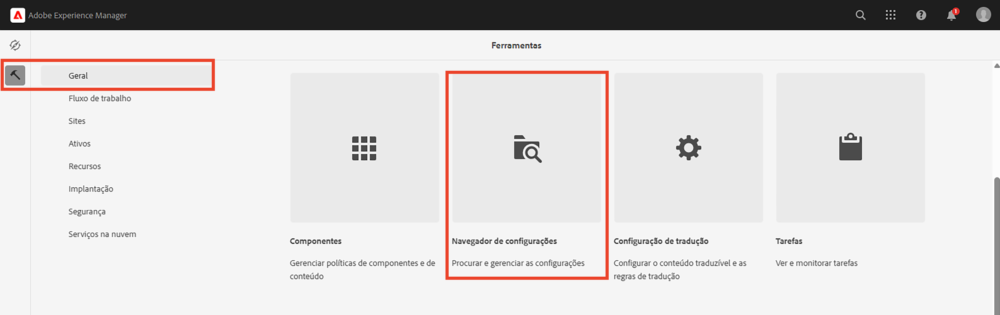
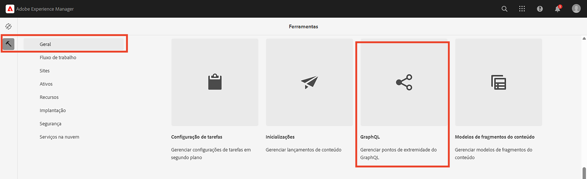
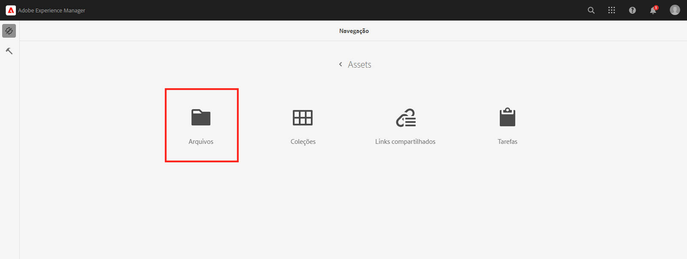
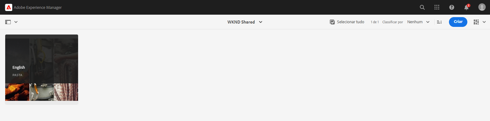
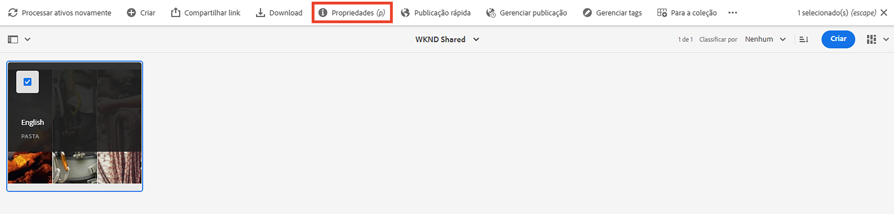
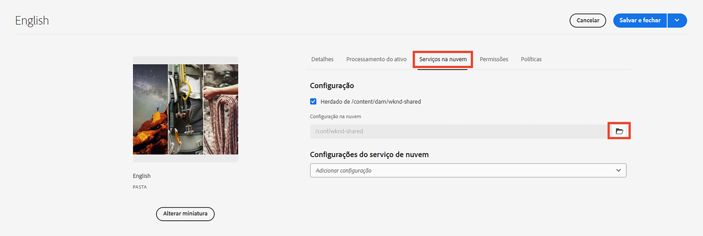

# Conceitos avançados de AEM headless

Este tutorial completo continua o [tutorial básico](../multi-step/overview.md) que cobria os fundamentos de Adobe Experience Manager (AEM) Headless e GraphQL. O tutorial avançado ilustra aspectos detalhados do trabalho com Modelos de fragmentos de conteúdo, Fragmentos de conteúdo e a API GraphQL AEM, incluindo o uso de AEM GraphQL em um aplicativo cliente.

## Pré-requisitos

Complete o [configuração rápida para AEM as a Cloud Service](../quick-setup/cloud-service.md) para configurar seu ambiente.

É altamente recomendável concluir a etapa anterior [tutorial básico](../multi-step/overview.md) e [série de vídeos](../video-series/modeling-basics.md) tutoriais antes de prosseguir com este tutorial avançado. Embora você possa concluir o tutorial usando um ambiente de AEM local, este tutorial só aborda o fluxo de trabalho para AEM as a Cloud Service.

## Objetivos

Este tutorial aborda os seguintes tópicos:

* Crie Modelos de Fragmento de conteúdo usando regras de validação e tipos de dados mais avançados, como Marcadores de tabulação, referências de fragmento aninhadas, objetos JSON e tipos de dados Data e hora.
* Crie Fragmentos de conteúdo enquanto trabalha com conteúdo aninhado e referências de fragmento, e configure as políticas de pastas para o controle de criação do fragmento de conteúdo.
* Explore AEM recursos da API GraphQL usando consultas GraphQL com variáveis e diretivas.
* Mantenha consultas GraphQL com parâmetros no AEM e saiba como usar parâmetros de controle de cache com consultas persistentes.
* Integre solicitações de consultas persistentes ao aplicativo WKND GraphQL React da amostra usando o SDK JavaScript sem cabeçalho do AEM.

## Conceitos avançados de AEM Visão geral headless

O vídeo a seguir fornece uma visão geral de alto nível dos conceitos abordados neste tutorial. O tutorial inclui a definição de Modelos de fragmento de conteúdo com tipos de dados mais avançados, o aninhamento de Fragmentos de conteúdo e a persistência de consultas GraphQL em AEM.

>[!VIDEO](https://video.tv.adobe.com/v/340035/?quality=12&learn=on)

## Configuração do projeto

O projeto do Site WKND tem todas as configurações necessárias, portanto, você pode iniciar o tutorial logo após concluir a [configuração rápida](../quick-setup/cloud-service.md). Esta seção só destaca algumas etapas importantes que podem ser usadas ao criar seu próprio projeto sem cabeçalho AEM.

### Criar uma configuração

A primeira etapa para iniciar qualquer novo projeto no AEM é criar sua configuração como um espaço de trabalho e criar pontos de extremidade de API GraphQL. Para exibir ou criar uma configuração, navegue até **Ferramentas** > **Geral** > **Navegador de configuração**.

Observe que a configuração do site WKND já foi criada para o tutorial. Para criar uma configuração para seu próprio projeto, selecione **Criar** no canto superior direito e preencha o formulário no modal Criar configuração exibido.

### Criar pontos de extremidade da API GraphQL

Em seguida, é necessário configurar pontos de extremidade de API para enviar consultas GraphQL. Para revisar endpoints existentes ou criar um, navegue até **Ferramentas** > **Ativos** > **GraphQL**.

Observe que os endpoints global e WKND já foram criados. Para criar um terminal para o projeto, selecione **Criar** no canto superior direito e siga o workflow .

>[!NOTE]
>
> Depois de salvar o ponto de extremidade, você verá uma modal sobre como visitar o Console de segurança, que permite ajustar as configurações de segurança se desejar configurar o acesso ao ponto de extremidade. No entanto, as permissões de segurança propriamente ditas estão fora do escopo deste tutorial. Para obter mais informações, consulte [Documentação AEM](https://experienceleague.adobe.com/docs/experience-manager-64/administering/security/security.html).

### Criar uma pasta raiz de idioma para o projeto

Uma pasta raiz de idioma é uma pasta com um código de idioma ISO como seu nome, como EN ou FR. O sistema de gerenciamento de tradução de AEM usa essas pastas para definir o idioma principal do conteúdo e os idiomas para a tradução de conteúdo.

Ir para **Navegação** > **Ativos** > **Arquivos**.

Navegue até o **Site WKND** pasta. Observar a pasta com o título &quot;Inglês&quot; e o nome &quot;EN&quot;. Essa pasta é a pasta raiz de idioma do projeto de site WKND.

Para o seu próprio projeto, crie uma pasta raiz de idioma dentro da sua configuração. Consulte a seção sobre [criação de pastas](/help/headless-tutorial/graphql/advanced-graphql/author-content-fragments.md#create-folders) para obter mais detalhes.

### Atribuir uma configuração à pasta aninhada

Por fim, você deve atribuir a configuração do seu projeto à pasta raiz do idioma. Essa atribuição permite a criação de Fragmentos de conteúdo com base nos Modelos de fragmento de conteúdo definidos na configuração do seu projeto.

Para atribuir a pasta raiz de idioma à configuração, selecione a pasta e selecione **Propriedades** na barra de navegação superior.

Em seguida, navegue até o **Cloud Services** e selecione o ícone de pasta na guia **Configuração na nuvem** campo.

No modal exibido, selecione a configuração criada anteriormente para atribuir a pasta raiz de idioma a ela.

### Práticas recomendadas

Estas são as práticas recomendadas para criar seu próprio projeto no AEM:

* A hierarquia de pastas deve ser modelada tendo em mente a localização e a tradução. Em outras palavras, as pastas de idioma devem ser aninhadas nas pastas de configuração, o que permite uma tradução fácil do conteúdo nessas pastas de configuração.
* A hierarquia de pastas deve ser mantida simples e direta. Evite mover ou renomear pastas e fragmentos posteriormente, especialmente depois de publicar para uso ao vivo, pois isso altera caminhos que podem afetar referências de fragmento e consultas GraphQL.

## Pacotes iniciais e de solução

Dois AEM **pacotes** estão disponíveis e podem ser instalados via [Gerenciador de pacotes](/help/headless-tutorial/graphql/advanced-graphql/author-content-fragments.md#sample-content)

* [Advanced-GraphQL-Tutorial-Starter-Package-1.0.zip](/help/headless-tutorial/graphql/advanced-graphql/assets/tutorial-files/Advanced-GraphQL-Tutorial-Starter-Package-1.0.zip) O é usado posteriormente no tutorial e contém imagens e pastas de exemplo.
* [Advanced-GraphQL-Tutorial-Solution-Package-1.1.zip](/help/headless-tutorial/graphql/advanced-graphql/assets/tutorial-files/Advanced-GraphQL-Tutorial-Solution-Package-1.1.zip) contém a solução concluída para os Capítulos 1 a 4, incluindo novos Modelos de fragmento de conteúdo, Fragmentos de conteúdo e consultas GraphQL persistentes. Útil para aqueles que desejam pular diretamente para o [Integração de aplicativos do cliente](/help/headless-tutorial/graphql/advanced-graphql/client-application-integration.md) capítulo.

Dois projetos React JS estão disponíveis para experimentar com consultas [de um aplicativo cliente sem periféricos](/help/headless-tutorial/graphql/advanced-graphql/client-application-integration.md).

* [aem-guides-wknd-headless-start-tutorial.zip](/help/headless-tutorial/graphql/advanced-graphql/assets/tutorial-files/aem-guides-wknd-headless-start-tutorial.zip) - Iniciar aplicativo cliente concluído em [Capítulo 5 - Integração de aplicativos do cliente](/help/headless-tutorial/graphql/advanced-graphql/client-application-integration.md).
* [aem-guides-wknd-headless-solution-tutorial.zip](/help/headless-tutorial/graphql/advanced-graphql/assets/tutorial-files/aem-guides-wknd-headless-solution-tutorial.zip) - aplicativo cliente concluído que usa **persistente** consultas.

## Introdução

Para começar a usar este tutorial avançado, siga estas etapas:

1. Configurar um ambiente de desenvolvimento usando [AEM as a Cloud Service](../quick-setup/cloud-service.md).
1. Inicie o capítulo tutorial em [criação de modelos de fragmentos do conteúdo](/help/headless-tutorial/graphql/advanced-graphql/create-content-fragment-models.md).
