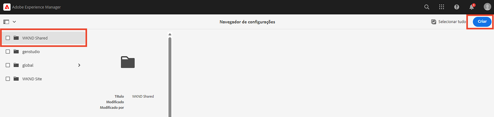

# Conceitos avançados de AEM headless

Este tutorial completo continua o [tutorial básico](../multi-step/overview.md) que abrangiam os fundamentos do Adobe Experience Manager (AEM) Headless e do GraphQL. O tutorial avançado ilustra aspectos detalhados de como trabalhar com Modelos de fragmentos de conteúdo, Fragmentos de conteúdo e as consultas persistentes do GraphQL AEM, incluindo o uso de consultas persistentes do GraphQL em um aplicativo cliente.

## Pré-requisitos

Complete o [configuração rápida para AEM as a Cloud Service](../quick-setup/cloud-service.md) para configurar seu ambiente as a Cloud Service AEM.

É altamente recomendável concluir a etapa anterior [tutorial básico](../multi-step/overview.md) e [série de vídeos](../video-series/modeling-basics.md) tutoriais antes de prosseguir com este tutorial avançado. Embora você possa concluir o tutorial usando um ambiente de AEM local, este tutorial só aborda o fluxo de trabalho para AEM as a Cloud Service.

>[!CAUTION]
>
>Se você não tiver acesso a AEM ambiente as a Cloud Service, poderá concluir [AEM Configuração rápida sem cabeçalho usando o SDK local](https://experienceleague.adobe.com/docs/experience-manager-learn/getting-started-with-aem-headless/graphql/quick-setup/local-sdk.html). No entanto, é importante observar que algumas páginas da interface do usuário do produto, como a navegação de Fragmentos de conteúdo , são diferentes.

## Objetivos

Este tutorial aborda os seguintes tópicos:

* Crie Modelos de Fragmento de conteúdo usando regras de validação e tipos de dados mais avançados, como Marcadores de tabulação, referências de fragmento aninhadas, objetos JSON e tipos de dados Data e hora.
* Crie Fragmentos de conteúdo enquanto trabalha com conteúdo aninhado e referências de fragmento, e configure as políticas de pastas para o controle de criação de fragmentos de conteúdo.
* Explore AEM recursos da API do GraphQL usando consultas do GraphQL com variáveis e diretivas.
* Mantenha as consultas do GraphQL com parâmetros no AEM e saiba como usar parâmetros de controle de cache com consultas persistentes.
* Integre solicitações de consultas persistentes ao aplicativo WKND GraphQL React de amostra usando o SDK JavaScript sem cabeçalho AEM.

## Conceitos avançados de AEM Visão geral headless

O vídeo a seguir fornece uma visão geral de alto nível dos conceitos abordados neste tutorial. O tutorial inclui a definição de Modelos de fragmento de conteúdo com tipos de dados mais avançados, o aninhamento de Fragmentos de conteúdo e a persistência de consultas do GraphQL no AEM.

>[!VIDEO](https://video.tv.adobe.com/v/340035?quality=12&learn=on)

>[!CAUTION]
>
>Este vídeo (às 2:25) menciona a instalação do editor de consultas GraphiQL por meio do Gerenciador de pacotes para explorar as consultas do GraphQL. No entanto, em versões mais recentes do AEM como Cloud Service a incorporado **Explorador GraphiQL** for fornecido, portanto, a instalação do pacote não é necessária. Consulte [Uso do GraphiQL IDE](https://experienceleague.adobe.com/docs/experience-manager-cloud-service/content/headless/graphql-api/graphiql-ide.html) para obter mais informações.

## Configuração do projeto

O projeto do Site WKND tem todas as configurações necessárias, portanto, você pode iniciar o tutorial logo após concluir a [configuração rápida](../quick-setup/cloud-service.md). Esta seção só destaca algumas etapas importantes que podem ser usadas ao criar seu próprio projeto sem cabeçalho AEM.

### Revisar a configuração existente

A primeira etapa para iniciar qualquer novo projeto no AEM é criar sua configuração como um espaço de trabalho e criar pontos de extremidade da API do GraphQL. Para revisar ou criar uma configuração, navegue até **Ferramentas** > **Geral** > **Navegador de configuração**.

Observe que a variável `WKND Shared` a configuração do site já foi criada para o tutorial. Para criar uma configuração para seu próprio projeto, selecione **Criar** no canto superior direito e preencha o formulário no modal Criar configuração exibido.

### Revisar pontos de extremidade da API do GraphQL

Em seguida, é necessário configurar pontos de extremidade de API para enviar consultas do GraphQL. Para revisar endpoints existentes ou criar um, navegue até **Ferramentas** > **Geral** > **GraphQL**.

Observe que a variável `WKND Shared Endpoint` já foi criada. Para criar um terminal para o projeto, selecione **Criar** no canto superior direito e siga o workflow .

>[!NOTE]
>
> Depois de salvar o ponto de extremidade, você verá uma modal sobre como visitar o Console de segurança, que permite ajustar as configurações de segurança se desejar configurar o acesso ao ponto de extremidade. No entanto, as permissões de segurança propriamente ditas estão fora do escopo deste tutorial. Para obter mais informações, consulte [Documentação AEM](https://experienceleague.adobe.com/docs/experience-manager-64/administering/security/security.html?lang=pt-BR).

### Revisar a estrutura de conteúdo WKND e a pasta raiz de idioma

Uma estrutura de conteúdo bem definida é fundamental para o sucesso AEM implementação sem periféricos. Isso é útil para escalabilidade, usabilidade e gerenciamento de permissões do seu conteúdo.

Uma pasta raiz de idioma é uma pasta com um código de idioma ISO como seu nome, como EN ou FR. O sistema de gerenciamento de tradução de AEM usa essas pastas para definir o idioma principal do conteúdo e os idiomas para a tradução de conteúdo.

Ir para **Navegação** > **Ativos** > **Arquivos**.

Navegue até o **WKND Compartilhado** pasta. Observar a pasta com o título &quot;Inglês&quot; e o nome &quot;EN&quot;. Essa pasta é a pasta raiz de idioma do projeto de site WKND.

Para o seu próprio projeto, crie uma pasta raiz de idioma dentro da sua configuração. Consulte a seção sobre [criação de pastas](/help/headless-tutorial/graphql/advanced-graphql/author-content-fragments.md#create-folders) para obter mais detalhes.

### Atribuir uma configuração à pasta aninhada

Por fim, você deve atribuir a configuração do seu projeto à pasta raiz do idioma. Essa atribuição permite a criação de Fragmentos de conteúdo com base nos Modelos de fragmento de conteúdo definidos na configuração do seu projeto.

Para atribuir a pasta raiz de idioma à configuração, selecione a pasta e selecione **Propriedades** na barra de navegação superior.

Em seguida, navegue até o **Cloud Services** e selecione o ícone de pasta na guia **Configuração na nuvem** campo.

No modal exibido, selecione a configuração criada anteriormente para atribuir a pasta raiz de idioma a ela.

### Práticas recomendadas

Estas são as práticas recomendadas para criar seu próprio projeto no AEM:

* A hierarquia de pastas deve ser modelada tendo em mente a localização e a tradução. Em outras palavras, as pastas de idioma devem ser aninhadas nas pastas de configuração, o que permite uma tradução fácil do conteúdo nessas pastas de configuração.
* A hierarquia de pastas deve ser mantida simples e direta. Evite mover ou renomear pastas e fragmentos posteriormente, especialmente depois de publicar para uso ao vivo, pois isso altera caminhos que podem afetar referências de fragmento e consultas do GraphQL.

## Pacotes iniciais e de solução

Dois AEM **pacotes** estão disponíveis e podem ser instalados via [Gerenciador de pacotes](/help/headless-tutorial/graphql/advanced-graphql/author-content-fragments.md#sample-content)

* [Advanced-GraphQL-Tutorial-Starter-Package-1.1.zip](/help/headless-tutorial/graphql/advanced-graphql/assets/tutorial-files/Advanced-GraphQL-Tutorial-Starter-Package-1.1.zip) O é usado posteriormente no tutorial e contém imagens e pastas de exemplo.
* [Advanced-GraphQL-Tutorial-Solution-Package-1.2.zip](/help/headless-tutorial/graphql/advanced-graphql/assets/tutorial-files/Advanced-GraphQL-Tutorial-Solution-Package-1.2.zip) contém a solução concluída para os Capítulos 1 a 4, incluindo novos Modelos de fragmento de conteúdo, Fragmentos de conteúdo e consultas persistentes do GraphQL. Útil para aqueles que desejam pular diretamente para o [Integração de aplicativos do cliente](/help/headless-tutorial/graphql/advanced-graphql/client-application-integration.md) capítulo.

O [Aplicativo React - Tutorial Avançado - Aventuras WKND](https://github.com/adobe/aem-guides-wknd-graphql/blob/main/advanced-tutorial/README.md) O projeto está disponível para analisar e explorar o aplicativo de amostra. Este aplicativo de amostra recupera o conteúdo do AEM chamando as consultas persistentes do GraphQL e renderizando-o em uma experiência imersiva.

## Introdução

Para começar a usar este tutorial avançado, siga estas etapas:

1. Configurar um ambiente de desenvolvimento usando [AEM as a Cloud Service](../quick-setup/cloud-service.md).
1. Inicie o capítulo tutorial em [Criar modelos de fragmento de conteúdo](/help/headless-tutorial/graphql/advanced-graphql/create-content-fragment-models.md).
