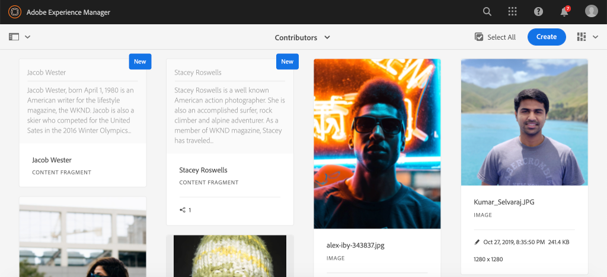

# Criação do fragmento de conteúdo {#authoring-content-fragments}

Neste capítulo, você criará e editará um novo Fragmento de conteúdo com base no [recém-definido Modelo de fragmento de conteúdo do colaborador](./content-fragment-models.md). Você também aprenderá a criar variações de Fragmentos de conteúdo.

## Pré-requisitos {#prerequisites}

Este é um tutorial de várias partes e presume-se que as etapas descritas em [Definição de modelos de fragmento de conteúdo](./content-fragment-models.md) foram concluídas.

## Objetivos {#objectives}

* Criar um fragmento de conteúdo com base em um modelo de fragmento de conteúdo
* Criar uma variação de Fragmento de conteúdo

## Visão geral da criação de fragmentos de conteúdo {#overview}

>[!VIDEO](https://video.tv.adobe.com/v/22451/?quality=12&learn=on)

O vídeo acima fornece uma visão geral de alto nível da criação de Fragmentos de conteúdo.

## Criar um fragmento de conteúdo {#create-content-fragment}

No capítulo anterior, [Definindo Modelos de Fragmento de Conteúdo](./content-fragment-models.md), um modelo de **Colaborador** foi criado. Crie um novo Fragmento de conteúdo usando esse modelo.

1. No menu **Início do AEM**, navegue até **Ativos** > **Arquivos**.
1. Clique nas pastas para navegar até **Site WKND** > **Inglês** > **Contribuidores**. Esta pasta contém uma lista de capturas de cabeçalho para os Contribuidores da marca WKND.

1. Clique em **Criar** no canto superior direito e selecione **Fragmento de conteúdo**:

   

1. Selecione o modelo **Contributor** e clique em **Próximo**.

   

   Este é o mesmo modelo **Contributor** que foi criado no capítulo anterior.

1. Insira **Stacey Roswells** para o título e clique em **Create**.
1. Clique em **Abrir** na caixa de diálogo **Êxito** para abrir o fragmento recém-criado.

   

   Observe que os campos definidos pelo modelo agora estão disponíveis para criar essa instância do Fragmento de conteúdo.

1. Para **Nome Completo** digite: **Stacey Roswells**.
1. Para **Biografia**, insira uma breve biografia. Precisa de alguma inspiração? Você pode reutilizar esse [arquivo de texto](assets/author-content-fragments/stacey-roswells-bio.txt).
1. Para **Referência de imagem** clique no ícone **pasta** e navegue até **Site WKND** > **Inglês** > **Contribuidores** > **Sites de chave estática.jpg&lt;a11/ >.** Isso será avaliado no caminho: `/content/dam/wknd/en/contributors/stacey-roswells.jpg`.
1. Para **Ocupação** escolha **Fotógrafo**.

   

1. Clique em **Save** para salvar as alterações.

## Criar uma variação de fragmento de conteúdo

Todos os Fragmentos de conteúdo começam com uma variação **Master**. A variação **Master** pode ser considerada o conteúdo *padrão* do fragmento e é automaticamente usada quando o conteúdo é exposto por meio das APIs GraphQL. Também é possível criar variações de um Fragmento de conteúdo. Esse recurso oferece flexibilidade adicional para projetar uma implementação.

Variações podem ser usadas para direcionar canais específicos. Por exemplo, uma variação **mobile** pode ser criada e contém uma quantidade menor de texto ou faz referência a uma imagem específica de canal. A forma como as variações são usadas está realmente à altura da implementação. Como qualquer recurso, um planejamento cuidadoso deve ser feito antes da utilização.

Em seguida, crie uma nova variação para ter uma ideia dos recursos disponíveis.

1. Abra novamente o Fragmento de conteúdo **Stacey Roswells**.
1. No painel lateral esquerdo, clique em **Criar variação**.
1. No modal **Nova variação**, insira um Título de **Resumo**.

   

1. Clique no campo **Biografias** de várias linhas e clique no botão **Expandir** para entrar na visualização em tela cheia do campo de várias linhas.

   

1. Clique em **Resumir texto** no menu superior direito.

1. Insira um **Target** de **50** palavras e clique em **Start**.

   

   Isso abrirá uma pré-visualização de resumo. O processador de idioma da máquina do AEM tentará resumir o texto com base na contagem de palavras de destino. Você também pode selecionar frases diferentes para remover.

1. Clique em **Resumir** quando estiver satisfeito com o resumo. Clique no campo de texto de várias linhas e alterne o botão **Expandir** para retornar à exibição principal.

1. Clique em **Save** para salvar as alterações.

## Criar um fragmento de conteúdo adicional

Repita as etapas descritas em [Criar um fragmento de conteúdo](#create-content-fragment) para criar um **Contribuidor** adicional. Ele será usado no próximo capítulo como um exemplo de como consultar vários fragmentos.

1. Na pasta **Contributors** clique em **Criar** no canto superior direito e selecione **Fragmento de conteúdo**:
1. Selecione o modelo **Contributor** e clique em **Próximo**.
1. Insira **Jacob Wester** para o título e clique em **Create**.
1. Clique em **Abrir** na caixa de diálogo **Êxito** para abrir o fragmento recém-criado.
1. Para **Nome Completo** digite: **Jacob Wester**.
1. Para **Biografia**, insira uma breve biografia. Precisa de alguma inspiração? Você pode reutilizar esse [arquivo de texto](assets/author-content-fragments/jacob-wester.txt).
1. Para **Referência de imagem** clique no ícone **pasta** e navegue até **Site WKND** > **Inglês** > **Contribuidores** > **jacob_wester.jpg**. Isso será avaliado no caminho: `/content/dam/wknd/en/contributors/jacob_wester.jpg`.
1. Para **Occupation** escolha **Writer**.
1. Clique em **Save** para salvar as alterações. Não há necessidade de criar uma variação, a menos que você deseje!

   

   Agora você deve ter dois fragmentos **Contributors**.

## Parabéns! {#congratulations}

Parabéns, você acabou de criar vários Fragmentos de conteúdo e criou uma variação.

## Próximas etapas {#next-steps}

No próximo capítulo, [Explore GraphQL APIs](explore-graphql-api.md), você explorará as APIs GraphQL do AEM usando a ferramenta GraphQL integrada. Saiba como o AEM gera automaticamente um esquema GraphQL com base em um modelo de Fragmento de conteúdo. Você tentará construir consultas básicas usando a sintaxe GraphQL.