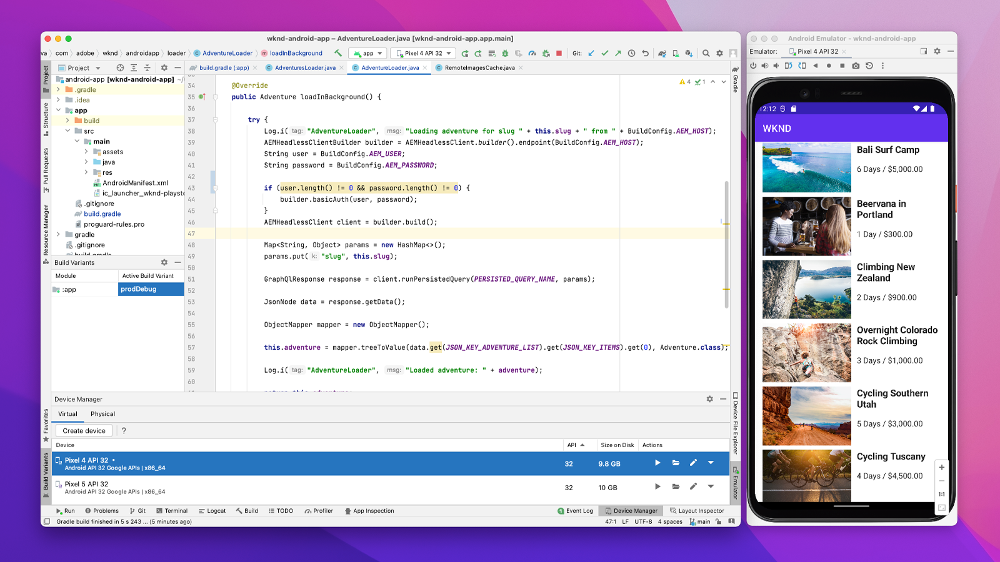

# Implantações móveis AEM Headless

As implantações móveis sem periféricos de AEM são aplicativos móveis nativos para iOS, Android™ etc. que consomem e interagem com conteúdo no AEM de forma headless.

As implantações móveis exigem configuração mínima, pois as conexões HTTP para APIs AEM Headless não são iniciadas no contexto de um navegador.

## Configurações de implantação

A configuração de implantação a seguir deve estar em vigor para implantações de aplicativos móveis.

| O aplicativo móvel se conecta ao | Autor do AEM | AEM Publish | Visualização do AEM |
|---------------------------------------------------:|:----------:|:-----------:|:-----------:|
| [Filtros do Dispatcher](./configurations/dispatcher-filters.md) | ✘ | ✔ | ✔ |
| Compartilhamento de recursos entre origens (CORS) | ✘ | ✘ | ✘ |
| [Hospedeiros AEM](./configurations/aem-hosts.md) | ✔ | ✔ | ✔ |

## Exemplo de aplicativos móveis

O Adobe fornece exemplos de aplicativos móveis iOS e Android™.

    <!-- iOS app -->
    

       

           

               <figure class="image is-16by9">
                   
               </figure>
           

           

               

                   
<a href="../example-apps/ios-swiftui-app.md" title="aplicativo iOS">aplicativo iOS</a>

                   
Um aplicativo de exemplo do iOS, escrito em SwiftUI, que consome conteúdo de APIs do AEM Headless GraphQL.

                   <a href="../example-apps/ios-swiftui-app.md" class="spectrum-Button spectrum-Button--outline spectrum-Button--primary spectrum-Button--sizeM">
                       Exibir exemplo
                   </a>
               

           

       

    

    <!-- Android app -->
    

       

           

               <figure class="image is-16by9">
                   
               </figure>
           

           

               

                   
<a href="../example-apps/android-app.md" title="aplicativo Android™">aplicativo Android™</a>

                   
Um exemplo de aplicativo Java™ Android™ que consome conteúdo de APIs AEM Headless GraphQL.

                   <a href="../example-apps/android-app.md" class="spectrum-Button spectrum-Button--outline spectrum-Button--primary spectrum-Button--sizeM">
                       Exibir exemplo
                   </a>
               

           

       

    

