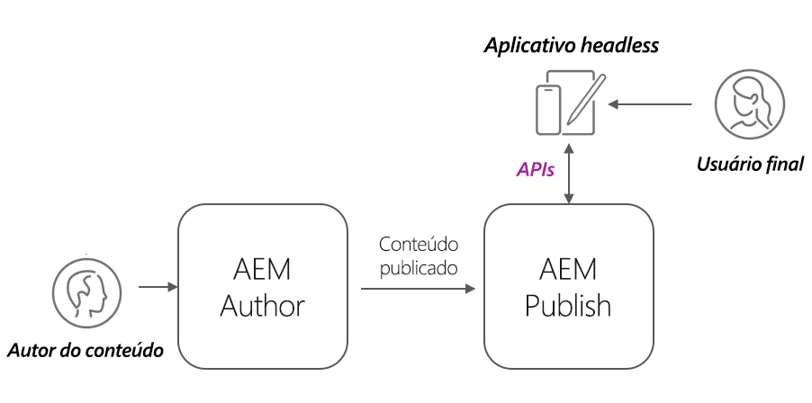
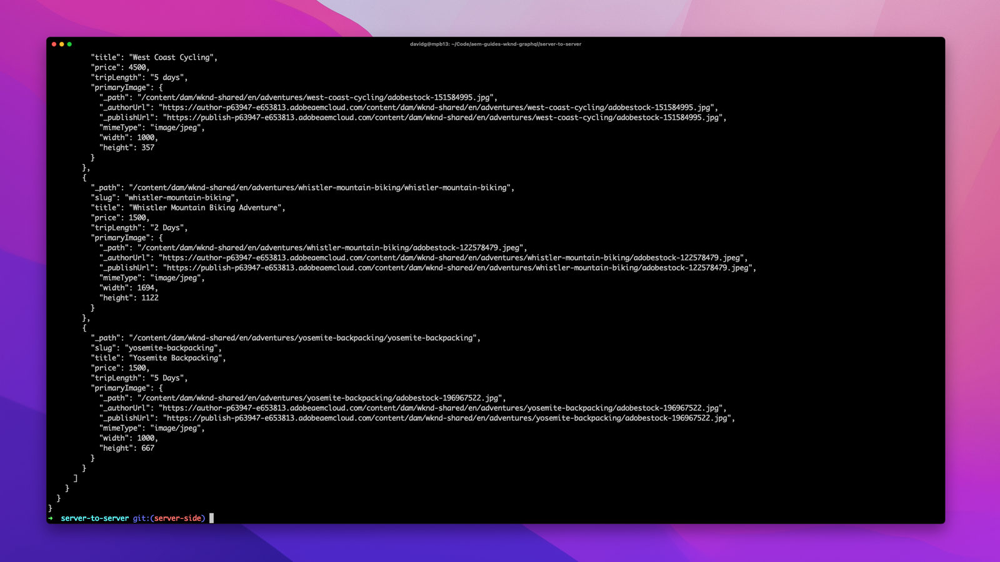

# Implantações AEM Headless

As implantações de cliente do AEM headless assumem muitas formas: AEM hospedado no SPA SPA, externo, site, aplicativo móvel ou até mesmo processo de servidor para servidor.

Dependendo do cliente e de como ele é implantado, as implantações sem periféricos de AEM têm considerações diferentes.

## Arquitetura de serviço do AEM

Antes de explorar as considerações de implantação, é fundamental entender a arquitetura lógica do AEM, bem como a separação e as funções dos níveis de serviço do AEM as a Cloud Service. O AEM as a Cloud Service é composto de dois serviços lógicos:

+ __Autor do AEM__ O é o serviço no qual as equipes criam, colaboram e publicam fragmentos de conteúdo (e outros ativos).
+ __Publicação no AEM__ é o serviço que foi publicado Os fragmentos de conteúdo (e outros ativos) são replicados para consumo geral.
+ __Visualização do AEM__ é o serviço que imita o AEM Publicar no comportamento, mas tem conteúdo publicado para fins de visualização ou revisão. A Visualização do AEM é destinada a públicos-alvo internos, e não para a entrega geral de conteúdo. O uso da Visualização do AEM é opcional, com base no fluxo de trabalho desejado.

Arquitetura típica de implantação headless do AEM as a Cloud Service_

Os clientes sem periféricos do AEM que operam em uma capacidade de produção normalmente interagem com o AEM Publish, que contém o conteúdo publicado e aprovado. Os clientes que interagem com o AEM Author precisam ter cuidado especial, pois o AEM Author é seguro por padrão, exigindo autorização para todas as solicitações, e também pode ter trabalho em andamento ou conteúdo não aprovado.

## Implantações de clientes headless

    <!-- Single-page App (SPA) -->
    

       

           

               <figure class="image is-16by9">
                   
               </figure>
           

           

               

                   
<a href="./spa.md" title="Aplicativo de página única (SPA)">Aplicativo de página única (SPA)</a>

                   
Saiba mais sobre as considerações de implantação para aplicativos de página única (SPA).

                   <a href="./spa.md" class="spectrum-Button spectrum-Button--outline spectrum-Button--primary spectrum-Button--sizeM">
                       Saiba mais
                   </a>
               

           

       

    

<!-- Web component/JS -->

   

       

           <figure class="image is-16by9">
               
           </figure>
       

       

           

               
<a href="./web-component.md" title="Componente da Web/JS">Componente da Web/JS</a>

               
Saiba mais sobre as considerações de implantação para componentes da Web e consumidores headless de JavaScript baseados em navegador.

               <a href="./web-component.md" class="spectrum-Button spectrum-Button--outline spectrum-Button--primary spectrum-Button--sizeM">
                   Saiba mais
               </a>
           

       

   

<!-- Mobile apps -->

   

       

           <figure class="image is-16by9">
               
           </figure>
       

       

           

               
<a href="./mobile.md" title="Aplicativos móveis">Aplicativo móvel</a>

               
Saiba mais sobre as considerações de implantação para aplicativos móveis.

               <a href="./mobile.md" class="spectrum-Button spectrum-Button--outline spectrum-Button--primary spectrum-Button--sizeM">
                   Saiba mais
               </a>
           

       

   

<!-- Server-to-server apps -->

   

       

           <figure class="image is-16by9">
               
           </figure>
       

       

           

               
<a href="./server-to-server.md" title="Aplicativos de servidor para servidor">Aplicativo de servidor para servidor</a>

               
Saiba mais sobre as considerações de implantação para aplicativos de servidor para servidor

               <a href="./server-to-server.md" class="spectrum-Button spectrum-Button--outline spectrum-Button--primary spectrum-Button--sizeM">
                   Saiba mais
               </a>
           

       

   

