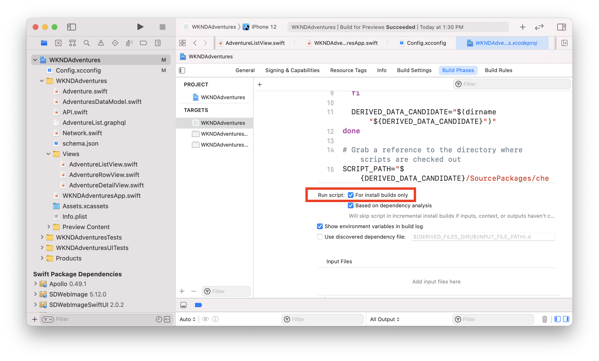

# Aplicativo SwiftUI do iOS

Exemplos de aplicativos são uma ótima maneira de explorar os recursos headless do Adobe Experience Manager (AEM). Este aplicativo iOS demonstra como consultar o conteúdo usando as APIs GraphQL da AEM. O Apollo Client iOS é usado para gerar consultas GraphQL e mapear dados para objetos Swift para potencializar o aplicativo. A SwiftUI é usada para renderizar uma lista simples e uma visualização detalhada do conteúdo.

>[!VIDEO](https://video.tv.adobe.com/v/338042/?quality=12&learn=on)

## Pré-requisitos {#prerequisites}

As seguintes ferramentas devem ser instaladas localmente:

* [Xcode 9.3+](https://developer.apple.com/xcode/)
* [Git](https://git-scm.com/)

## Requisitos do AEM

O aplicativo foi projetado para se conectar a um AEM **Publicar** com a versão mais recente do [Site de referência WKND](https://github.com/adobe/aem-guides-wknd/releases/latest) instalado.

* [AEM as a Cloud Service](https://experienceleague.adobe.com/docs/experience-manager-cloud-service/overview/introduction.html)
* [AEM 6.5.10+](https://experienceleague.adobe.com/docs/experience-manager-65/release-notes/service-pack/new-features-latest-service-pack.html?lang=pt-BR)

Recomendamos [implantação do site de referência WKND em um ambiente Cloud Service](https://experienceleague.adobe.com/docs/experience-manager-cloud-service/implementing/deploying/overview.html#coding-against-the-right-aem-version). Uma configuração local usando [o SDK do AEM Cloud Service](https://experienceleague.adobe.com/docs/experience-manager-learn/cloud-service/local-development-environment-set-up/overview.html) ou [AEM 6.5 QuickStart jar](https://experienceleague.adobe.com/docs/experience-manager-learn/foundation/development/set-up-a-local-aem-development-environment.html?lang=en#install-local-aem-instances) também pode ser usado.

## Como usar

1. Clonar o `aem-guides-wknd-graphql` repositório:

   ```shell
   git clone git@github.com:adobe/aem-guides-wknd-graphql.git
   ```

1. Launch [Xcode](https://developer.apple.com/xcode/) e abra a pasta `ios-swiftui-app`
1. Modificar o arquivo `Config.xcconfig` arquivo e atualização `AEM_HOST` para corresponder ao ambiente de publicação do AEM de destino

   ```plain
   // Target hostname for AEM environment, do not include http:// or https://
   AEM_HOST = localhost:4503
   // GraphQL Endpoint
   AEM_GRAPHQL_ENDPOINT = /content/cq:graphql/wknd/endpoint.json
   ```

1. Crie o aplicativo usando o Xcode e implante o aplicativo no simulador do iOS
1. Uma lista de aventuras do site de referência WKND deve ser exibida no aplicativo.

## O código

Abaixo está um breve resumo dos arquivos e códigos importantes usados para potencializar o aplicativo. O código completo pode ser encontrado em [GitHub](https://github.com/adobe/aem-guides-wknd-graphql/tree/main/ios-swiftui-app).

### Apollo iOS

O [Apollo iOS](https://www.apollographql.com/docs/ios/) O cliente é usado pelo aplicativo para executar a consulta GraphQL em relação ao AEM. O funcionário [Tutorial do Apollo](https://www.apollographql.com/docs/ios/tutorial/tutorial-introduction/) O tem muito mais detalhes sobre como instalar e usar o .

`schema.json` é um arquivo que representa o esquema GraphQL de um ambiente AEM com o site de referência WKND instalado. `schema.json` foi baixado do AEM e adicionado ao projeto. O cliente Apollo inspeciona todos os arquivos com a extensão `.graphql` como parte de uma fase de criação personalizada. O cliente Apollo usa a variável `schema.json` arquivo e qualquer `.graphql` queries para gerar automaticamente o arquivo `API.swift`.

Isso fornece ao aplicativo um modelo altamente digitado para executar a consulta e o(s) modelo(s) que representa os resultados.


`AdventureList.graphql` contém a consulta usada para consultar as aventuras:

```
query AdventureList
{
  adventureList {
    items {
      _path
      adventureTitle
      adventurePrice
      adventureActivity
      adventureDescription {
        plaintext
        markdown
      }
      adventureDifficulty
      adventureTripLength
      adventurePrimaryImage {
        ...on ImageRef {
          _authorUrl
          _publishUrl
        }
      }
    }
  }
}
```

`Network.swift` constrói o `ApolloClient`. O `endpointURL` usada é construída pela leitura dos valores da variável `Config.xcconfig` arquivo. Se você deseja se conectar a um AEM **Autor** e é necessário adicionar cabeçalhos adicionais para autenticação. `ApolloClient` aqui.

```swift
// Network.swift
private(set) lazy var apollo: ApolloClient = {
        // The cache is necessary to set up the store, which we're going to hand to the provider
        let cache = InMemoryNormalizedCache()
        let store = ApolloStore(cache: cache)
  
        let client = URLSessionClient()
        let provider = DefaultInterceptorProvider(client: client, shouldInvalidateClientOnDeinit: true, store: store)
        let url = Connection.baseURL // from Configx.xcconfig 

        // no additional headers, public instances by default require no additional authentication
        let requestChainTransport = RequestChainNetworkTransport(interceptorProvider: provider, endpointURL: url)

        return ApolloClient(networkTransport: requestChainTransport,store: store)
    }()
}
```

### Dados da Aventura

O aplicativo foi projetado para exibir uma lista de Aventuras e, em seguida, uma visualização detalhada de cada aventura.

`AdventuresDataModel.swift` é uma classe que inclui uma função `fetchAdventures()`. Essa função usa o `ApolloClient` para executar a query. Em uma consulta bem-sucedida, a matriz de resultados será do tipo `AdventureListQuery.Data.AdventureList.Item`, gerado automaticamente pelo `API.swift` arquivo.

```swift
func fetchAdventures() {
        Network.shared.apollo
            //AdventureListQuery() generated based on AdventureList.graphql file
           .fetch(query: AdventureListQuery()) { [weak self] result in
           
             guard let self = self else {
               return
             }
                   
             switch result {
             case .success(let graphQLResult):
                print("Success AdventureListQuery() from: \(graphQLResult.source)")

                if let adventureDataItems =  graphQLResult.data?.adventureList.items {
                    // map graphQL items to an array of Adventure objects
                    self.adventures = adventureDataItems.compactMap { Adventure(adventureData: $0!) }
                }
                ...
             }
           }
}
```

É possível usar `AdventureListQuery.Data.AdventureList.Item` diretamente para ligar o aplicativo. No entanto, é muito possível que alguns dados estejam incompletos e, portanto, algumas propriedades possam ser nulas.

`Adventure.swift` é um modelo personalizado que atua como um invólucro do modelo gerado pela Apolo. `Adventure` é inicializado com `AdventureListQuery.Data.AdventureList.Item`. A `typealias` é usado para encurtar para tornar o código mais legível:

```
// use typealias
typealias AdventureData = AdventureListQuery.Data.AdventureList.Item
```

O `Adventure` struct é inicializado com um `AdventureData` objeto:

```swift
struct Adventure: Identifiable {
    let id: String
    let adventureTitle: String
    let adventurePrice: String
    let adventureDescription: String
    let adventureActivity: String
    let adventurePrimaryImageUrl: String
    
    // initialize with AdventureData object aka AdventureListQuery.Data.AdventureList.Item
    init(adventureData: AdventureData) {
        // use path as unique idenitifer, otherwise
        self.id = adventureData._path ?? UUID().uuidString
        self.adventureTitle = adventureData.adventureTitle ?? "Untitled"
        self.adventurePrice = adventureData.adventurePrice ?? "Free"
        self.adventureActivity = adventureData.adventureActivity ?? ""
        ...
```

Isso nos permite fornecer valores padrão e executar verificações adicionais para dados incompletos. Podemos então usar o `Adventure` modelo para alimentar com segurança vários elementos da interface do usuário e não precisar verificar constantemente valores nulos.

Em AEM, partes do conteúdo são identificadas exclusivamente por `_path`. Em `Adventure.swift` preenchemos o `id` com o valor de `_path`. Isso permite `Adventure` para implementar a `Identifiable` e facilita a iteração em uma matriz ou lista.

### Exibições

SwiftUI é usado para as várias exibições no aplicativo. Um excelente tutorial para [criação de listas e navegação](https://developer.apple.com/tutorials/swiftui/building-lists-and-navigation) pode ser encontrada no site do desenvolvedor do Apple. O código deste aplicativo é derivado vagamente dele.

`WKNDAdventuresApp.swift` é a entrada do pedido. Inclui `AdventureListView` e `.onAppear` é usado para buscar os dados da aventura.

`AdventureListView.swift` - cria um `NavigationView` e uma lista de aventuras povoadas por `AdventureRowView`. Navegação para um `AdventureDetailView` está configurado aqui.

`AdventureRowView` - exibe a imagem principal da Aventura e o Título da Aventura em uma linha.

`AdventureDetailView` - exibe um detalhe completo da aventura individual, incluindo o título, a descrição, o preço, o tipo de atividade e a imagem principal.

Quando a CLI do Apollo é executada e gerada novamente `API.swift` isso faz com que a visualização pare. Para usar a função Visualização automática, será necessário atualizar o **Apollo CLI** Criar fase e verificar para executar o script **Somente para builds de instalação**.



### Imagens remotas

[SDWebImageSwiftUI](https://github.com/SDWebImage/SDWebImageSwiftUI) e [SDWEbImage](https://github.com/SDWebImage/SDWebImage) são usadas para carregar as imagens remotas de AEM que preenchem a imagem principal da Aventura nas exibições Linha e Detalhe.

O [AsyncImage](https://developer.apple.com/documentation/swiftui/asyncimage) é uma visualização nativa da SwiftUI que também pode ser usada. `AsyncImage` só é compatível com o iOS 15.0+.

## Recursos adicionais

* [Introdução ao AEM Headless - Tutorial do GraphQL](https://experienceleague.adobe.com/docs/experience-manager-learn/getting-started-with-aem-headless/graphql/multi-step/overview.html)
* [Tutorial de navegação e listas da interface do usuário do Swift](https://developer.apple.com/tutorials/swiftui/building-lists-and-navigation)
* [Tutorial do cliente do Apollo iOS](https://www.apollographql.com/docs/ios/tutorial/tutorial-introduction/)

