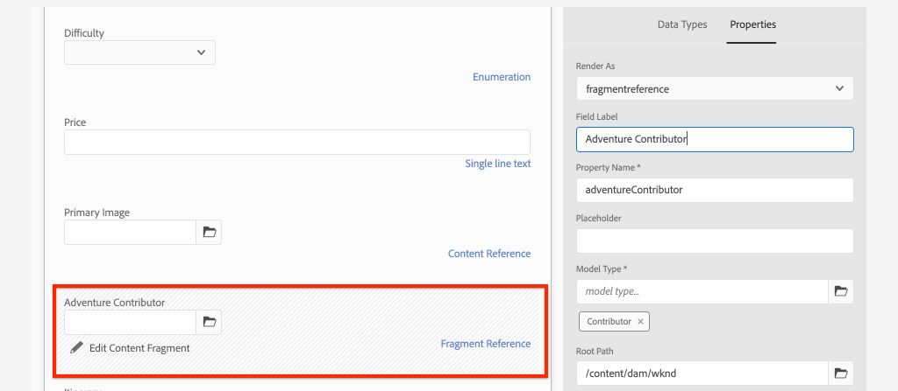
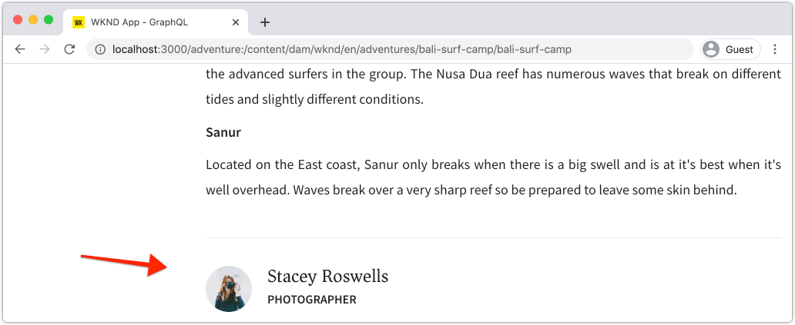

# Modelagem avançada de dados com referências de fragmento

É possível fazer referência a um Fragmento de conteúdo a partir de outros Fragmentos de conteúdo. Isso permite que um usuário crie modelos de dados complexos com relações entre Fragmentos.

Neste capítulo, você atualizará o modelo da Aventura para incluir uma referência ao modelo do Contribuidor usando o campo **Referência do fragmento**. Você também aprenderá a modificar um query GraphQL para incluir campos de um modelo referenciado.

## Pré-requisitos

Este é um tutorial de várias partes e presume-se que as etapas descritas nas partes anteriores foram concluídas.

## Objetivos

Neste capítulo, aprenderemos a:

* Atualizar um Modelo de fragmento de conteúdo para usar o campo Referência do fragmento
* Criar um query GraphQL que retorna campos de um modelo referenciado

## Adicionar uma referência de fragmento {#add-fragment-reference}

Atualize o modelo de fragmento de conteúdo da Adobe para adicionar uma referência ao modelo do contribuidor.

1. Abra um novo navegador e navegue até AEM.
1. No menu **AEM Start**, navegue até **Ferramentas** > **Ativos** > **Modelos de fragmento de conteúdo** > **Site WKND**.
1. Abra o **Modelo de fragmento de conteúdo do Adventure**

   

1. Em **Tipos de dados**, arraste e solte um campo **Referência de fragmento** no painel principal.

   

1. Atualize **Propriedades** para este campo com o seguinte:

   * Renderizar como - `fragmentreference`
   * Rótulo de campo - **Colaborador de risco**
   * Nome da Propriedade - `adventureContributor`
   * Tipo de modelo - selecione o modelo **Contributor**
   * Caminho raiz - `/content/dam/wknd`

   

   O nome da propriedade `adventureContributor` agora pode ser usado para fazer referência a um Fragmento de conteúdo do contribuidor.

1. Salve as alterações no modelo.

## Atribuir um contribuidor a uma empresa

Agora que o modelo de Fragmento de conteúdo da Aventura foi atualizado, podemos editar um fragmento existente e fazer referência a um Colaborador. Observe que a edição do modelo de Fragmento de conteúdo *afeta* quaisquer Fragmentos de conteúdo criados a partir dele.

1. Navegue até **Assets** > **Arquivos** > **Site WKND** > **Inglês** > **Aventuras** > **[Campo de Surfe de Bali](http://localhost:4502/assets.html/content/dam/wknd/en/adventures/bali-surf-camp)**.

   

1. Clique no fragmento de conteúdo **Bali Surf Camp** para abrir o Editor de fragmentos de conteúdo.
1. Atualize o campo **Colaborador de Aventura** e selecione um Colaborador clicando no ícone de pasta.

   

   *Selecionar um caminho para um fragmento de contribuinte*

   

   Observe que somente os fragmentos criados usando o modelo **Contributor** podem ser selecionados.

1. Salve as alterações no fragmento.

1. Repita as etapas acima para atribuir um contribuinte a aventuras como [Yosemite Backpacking](http://localhost:4502/editor.html/content/dam/wknd/en/adventures/yosemite-backpacking/yosemite-backpacking) e [Colorado Rock Climbing](http://localhost:4502/editor.html/content/dam/wknd/en/adventures/colorado-rock-climbing/colorado-rock-climbing)

## Fragmento de conteúdo aninhado pelo query com GraphiQL

Em seguida, execute um query para uma Aventura e adicione propriedades aninhadas do modelo de Colaborador referenciado. Usaremos a ferramenta GraphiQL para verificar rapidamente a sintaxe do query.

1. Navegue até a ferramenta GraphiQL no AEM: [http://localhost:4502/content/graphiql.html](http://localhost:4502/content/graphiql.html)

1. Digite o seguinte query:

   ```graphql
   {
     adventureByPath(_path:"/content/dam/wknd/en/adventures/bali-surf-camp/bali-surf-camp") {
        item {
          _path
          adventureTitle
          adventureContributor {
            fullName
            occupation
            pictureReference {
           ...on ImageRef {
             _path
           }
         }
       }
     }
    }
   }
   ```

   O query acima é para uma única Aventura pelo caminho. A propriedade `adventureContributor` faz referência ao modelo do Colaborador e, em seguida, podemos solicitar propriedades do Fragmento de conteúdo aninhado.

1. Execute o query e você deverá obter um resultado como o seguinte:

   ```json
   {
     "data": {
       "adventureByPath": {
           "item": {
               "_path": "/content/dam/wknd/en/adventures/bali-surf-camp/bali-surf-camp",
               "adventureTitle": "Bali Surf Camp",
               "adventureContributor": {
                   "fullName": "Stacey Roswells",
                   "occupation": "Photographer",
                   "pictureReference": {
                       "_path": "/content/dam/wknd/en/contributors/stacey-roswells.jpg"
                   }
               }
           }
        }
     }
   }
   ```

1. Experimente outros query como `adventureList` e adicione propriedades para o Fragmento de conteúdo referenciado em `adventureContributor`.

## Atualize o aplicativo React para exibir o conteúdo do Contributor

Em seguida, atualize os query usados pelo aplicativo React para incluir o novo Contribuidor e exibir informações sobre o Contribuidor como parte da visualização de detalhes da Aventura.

1. Abra o aplicativo WKND GraphQL React no IDE.

1. Abra o arquivo `src/components/AdventureDetail.js`.

   

1. Encontre a função `adventureDetailQuery(_path)`. A função `adventureDetailQuery(..)` simplesmente envolve um query GraphQL de filtragem, que usa a sintaxe AEM `<modelName>ByPath` para query de um único Fragmento de conteúdo identificado pelo caminho JCR.

1. Atualize o query para incluir informações sobre o Contribuidor referenciado:

   ```javascript
   function adventureDetailQuery(_path) {
       return `{
           adventureByPath (_path: "${_path}") {
           item {
               _path
               adventureTitle
               adventureActivity
               adventureType
               adventurePrice
               adventureTripLength
               adventureGroupSize
               adventureDifficulty
               adventurePrice
               adventurePrimaryImage {
                   ... on ImageRef {
                   _path
                   mimeType
                   width
                   height
                   }
               }
               adventureDescription {
                   html
               }
               adventureItinerary {
                   html
               }
               adventureContributor {
                   fullName
                   occupation
                   pictureReference {
                       ...on ImageRef {
                           _path
                       }
                   }
               }
             }
          }
        }
       `;
   }
   ```

   Com esta atualização, propriedades adicionais sobre `adventureContributor`, `fullName`, `occupation` e `pictureReference` serão incluídas no query.

1. Inspect o componente `Contributor` incorporado no arquivo `AdventureDetail.js` em `function Contributor(...)`. Esse componente renderizará o nome, a ocupação e a imagem do Colaborador, se as propriedades existirem.

   O componente `Contributor` é referenciado no método `AdventureDetail(...)` `return`:

   ```javascript
   function AdventureDetail(props) {
       ...
       return (
           ...
            <h2>Itinerary</h2>
           <hr />
           <div className="adventure-detail-itinerary"
                dangerouslySetInnerHTML={{__html: adventureData.adventureItinerary.html}}></div>
           {/* Contributor component is instaniated and 
               is passed the adventureContributor object from the GraphQL Query results */}
           <Contributer {...adventureData.adventureContributor} />
           ...
       )
   }
   ```

1. Salve as alterações no arquivo.
1. Start o aplicativo React, se ainda não estiver em execução:

   ```shell
   $ cd aem-guides-wknd-graphql/react-app
   $ npm start
   ```

1. Navegue até [http://localhost:3000](http://localhost:3000/) e clique em uma Aventura que tenha um Contribuidor referenciado. Agora você deve ver as informações do Contribuidor listadas abaixo de **Itinerário**:

   

## Parabéns!{#congratulations}

Parabéns! Você atualizou um Modelo de fragmento de conteúdo existente para fazer referência a um fragmento de conteúdo aninhado usando o campo **Referência de fragmento**. Você também aprendeu a modificar um query GraphQL para incluir campos de um modelo referenciado.

## Próximas etapas {#next-steps}

No próximo capítulo, [Implantação de produção usando um ambiente de publicação de AEM](./production-deployment.md), saiba mais sobre os serviços de autor e publicação de AEM e o padrão de implantação recomendado para aplicativos sem cabeçalho. Você atualizará um aplicativo existente para usar variáveis de ambiente para alterar dinamicamente um ponto de extremidade GraphQL com base no ambiente do público alvo. Você também aprenderá a configurar corretamente o AEM para o CORS (Cross-Origem resource sharing, compartilhamento de recursos entre ).
