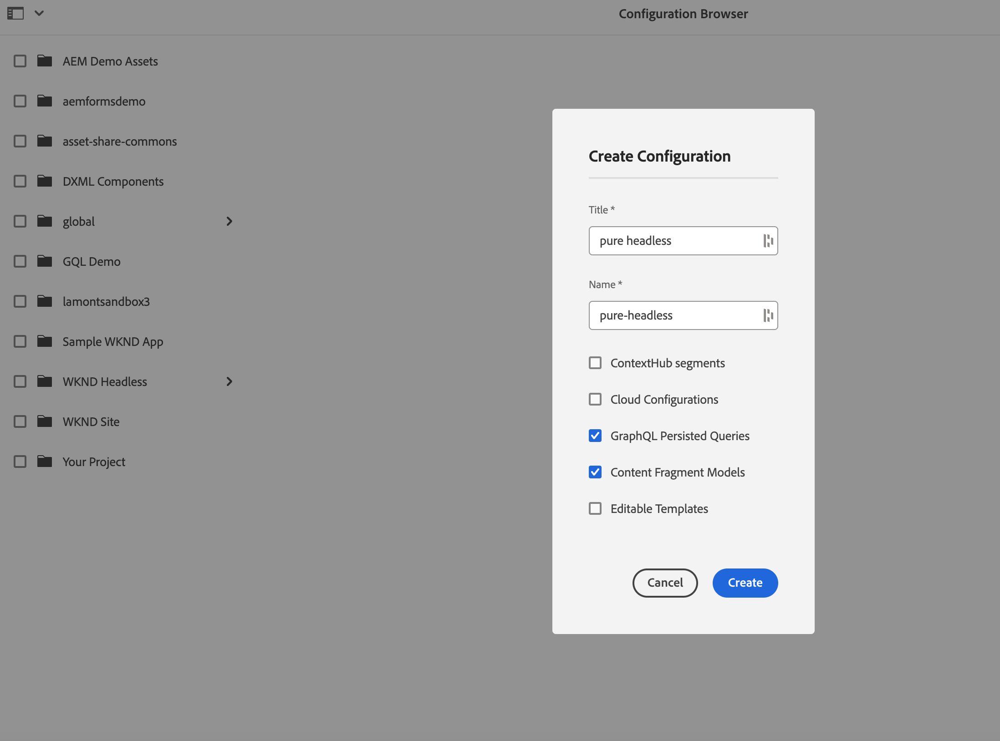

# Modelagem de conteúdo

Bem-vindo ao capítulo de tutorial sobre fragmentos de conteúdo e endpoints do GraphQL no Adobe Experience Manager (AEM). Abordaremos como aproveitar os fragmentos de conteúdo, criar modelos de fragmento e usar endpoints do GraphQL no AEM.

Os fragmentos de conteúdo oferecem uma abordagem estruturada para gerenciar conteúdo em vários canais, fornecendo flexibilidade e reutilização. A ativação de fragmentos de conteúdo no AEM permite a criação de conteúdo modular, melhorando a consistência e a adaptabilidade.

Primeiro, guiaremos você pela ativação dos Fragmentos de conteúdo no AEM, abrangendo as configurações e definições necessárias para uma integração perfeita.

Em seguida, abordaremos a criação de modelos de fragmento, que definem a estrutura e os atributos. Saiba como projetar modelos alinhados aos seus requisitos de conteúdo e gerenciá-los de maneira eficaz.

Em seguida, demonstraremos a criação de fragmentos de conteúdo dos modelos, fornecendo orientação passo a passo sobre criação e publicação.

Além disso, exploraremos a definição de endpoints do AEM GraphQL. O GraphQL recupera dados do AEM com eficiência, e definiremos e configuraremos endpoints para expor os dados desejados. As consultas persistentes otimizarão o desempenho e o armazenamento em cache.

Ao longo do tutorial, forneceremos explicações, exemplos de código e dicas práticas. No final, você terá as habilidades para ativar Fragmentos de conteúdo, criar Modelos de fragmento, gerar Fragmentos e definir endpoints de AEM GraphQL e consultas persistentes. Vamos começar!

## Configuração sensível ao contexto

1. Navegue até __Ferramentas > Navegador de configuração__ para criar uma configuração para a experiência headless.

   

   Forneça um __título__ e __name__, e verifique __Consultas persistentes do GraphQL__ e __Modelos de fragmentos do conteúdo__.


## Modelos de fragmentos do conteúdo

1. Navegue até __Ferramentas > Modelos de fragmentos do conteúdo__ e selecione a pasta com o nome da configuração criada na etapa 1.

   

1. Dentro da pasta, selecione __Criar__ e nomeie o modelo __Teaser__. Adicione os seguintes tipos de dados à __Teaser__ modelo.

   | Tipo de dados | Nome | Obrigatório | Opções |
   |----------|------|----------|---------|
   | Referência de conteúdo | Ativo | sim | Adicione uma imagem padrão se desejar. Exemplo: /content/dam/wknd-headless/assets/AdobeStock_307513975.mp4 |
   | Texto em linha única | Título | sim |
   | Texto em linha única | Pré-título | não |
   | Texto multilinha | Descrição | não | Verificar se o tipo padrão é rich text |
   | Lista discriminada | Estilo | sim | Renderizar como lista suspensa. As opções são Herói -> Herói e Destaque -> Destaque |

   

1. Dentro da pasta, crie um segundo modelo chamado __Oferta__. Clique em criar, dê ao modelo o nome &quot;Oferta&quot; e adicione os seguintes tipos de dados:

   | Tipo de dados | Nome | Obrigatório | Opções |
   |----------|------|----------|---------|
   | Referência de conteúdo | Ativo | sim | Adicionar imagem padrão. Exemplo: `/content/dam/wknd-headless/assets/AdobeStock_238607111.jpeg` |
   | Texto multilinha | Descrição | não |  |
   | Texto multilinha | Artigo | não |  |

   

1. Dentro da pasta, crie um terceiro modelo chamado __Lista de imagens__. Clique em criar, nomeie o modelo como &quot;Lista de imagens&quot; e adicione os seguintes tipos de dados:

   | Tipo de dados | Nome | Obrigatório | Opções |
   |----------|------|----------|---------|
   | Referência de fragmento | Listar itens | sim | Renderizar como vários campos. O modelo de fragmento de conteúdo permitido é Oferta. |

   

## Fragmentos de conteúdo

1. Agora navegue até Ativos e crie uma pasta para o novo site. Clique em criar e nomeie a pasta.

   

1. Depois que a pasta for criada, selecione-a e abra sua __Propriedades__.
1. No da pasta __Configurações da nuvem__ selecione a configuração [criado anteriormente](#enable-content-fragments-and-graphql).

   

   Clique na nova pasta e crie um teaser. Clique em __Criar__ e __Fragmento do conteúdo__ e selecione o __Teaser__ modelo. Nomear o modelo __Herói__ e clique em __Criar__.

   | Nome | Notas |
   |----------|------|
   | Ativo | Deixe como valor padrão ou escolha um ativo diferente (vídeo ou imagem) |
   | Título | `Explore. Discover. Live.` |
   | Pré-título | `Join use for your next adventure.` |
   | Descrição | Deixe em branco |
   | Estilo | `Hero` |

   

## Pontos de extremidade GraphQL.

1. Navegue até __Ferramentas > GraphQL__

   

1. Clique em __Criar__ e nomeie o novo endpoint e escolha a configuração recém-criada.

   

## Consultas persistentes de GraphQL

1. Vamos testar o novo terminal. Navegue até __Ferramentas > Editor de consultas GraphQL__ e escolha nosso terminal para o menu suspenso no canto superior direito da janela.

1. No Editor de consultas, crie algumas consultas diferentes.


   ```graphql
   {
       teaserList {
           items {
           title
           }
       }
   }
   ```

   Você deve obter uma lista contendo o único fragmento criado [acima](#create-content).

   Para este exercício, crie uma query completa que o aplicativo AEM headless usa. Crie uma query que retorne um único teaser por caminho. No editor de consultas, insira a seguinte consulta:

   ```graphql
   query TeaserByPath($path: String!) {
   component: teaserByPath(_path: $path) {
       item {
       __typename
       _path
       _metadata {
           stringMetadata {
           name
           value
           }
       }
       title
       preTitle
       style
       asset {
           ... on MultimediaRef {
           __typename
           _authorUrl
           _publishUrl
           format
           }
           ... on ImageRef {
           __typename
           _authorUrl
           _publishUrl
           mimeType
           width
           height
           }
       }
       description {
           html
           plaintext
       }
       }
   }
   }
   ```

   No __variáveis de consulta__ na parte inferior, digite:

   ```json
   {
       "path": "/content/dam/pure-headless/hero"
   }
   ```

   >[!NOTE]
   >
   > Talvez seja necessário ajustar a variável de consulta `path` com base nos nomes da pasta e do fragmento.


   Execute a consulta para receber os resultados do fragmento de conteúdo criado anteriormente.

1. Clique em __Salvar__  para criar uma consulta persistente (salvar) e nomear a consulta __teaser__. Isso nos permite fazer referência à consulta por nome no aplicativo.

## Próximas etapas

Parabéns! Você configurou o AEM as a Cloud Service com sucesso para permitir a criação de fragmentos de conteúdo e endpoints do GraphQL. Você também criou um modelo de fragmento de conteúdo e um fragmento de conteúdo, além de definir um terminal GraphQL e uma consulta persistente. Agora você está pronto para seguir para o próximo capítulo do tutorial, em que aprenderá a criar um aplicativo AEM Headless React que consome os fragmentos de conteúdo e o endpoint do GraphQL criados neste capítulo.

[Próximo capítulo: APIs AEM Headless e React](./2-aem-headless-apis-and-react.md)
