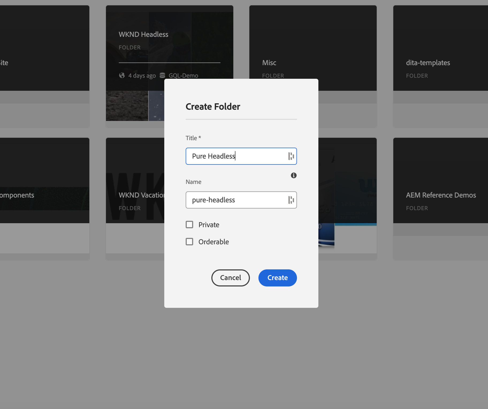
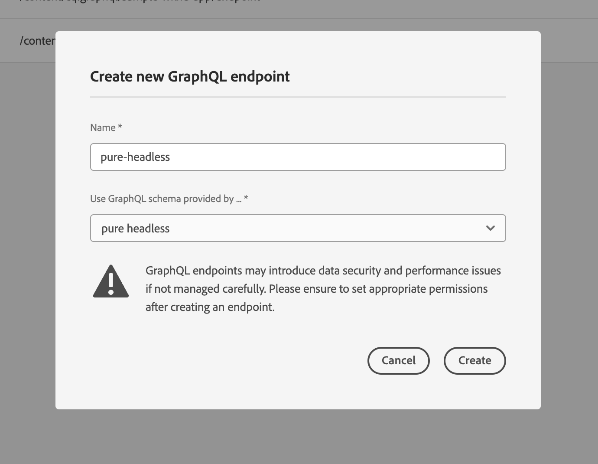

# Modelagem de conteúdo

Bem-vindo ao capítulo tutorial sobre Fragmentos de conteúdo e pontos de extremidade do GraphQL no Adobe Experience Manager (AEM). Abordaremos o aproveitamento dos Fragmentos de conteúdo, a criação de Modelos de fragmento e o uso de pontos de extremidade do GraphQL no AEM.

Os Fragmentos de conteúdo oferecem uma abordagem estruturada para gerenciar conteúdo em vários canais, proporcionando flexibilidade e capacidade de reutilização. Habilitar Fragmentos de conteúdo no AEM permite a criação de conteúdo modular, melhorando a consistência e a adaptabilidade.

Primeiro, vamos orientá-lo na ativação dos Fragmentos de conteúdo no AEM, abordando as configurações e configurações necessárias para uma integração perfeita.

Em seguida, abordaremos a criação de Modelos de fragmento, que definem a estrutura e os atributos. Saiba como projetar modelos alinhados às suas necessidades de conteúdo e gerenciá-los com eficácia.

Em seguida, demonstraremos a criação de Fragmentos de conteúdo a partir dos modelos, fornecendo orientação passo a passo sobre a criação e a publicação.

Além disso, exploraremos a definição AEM endpoints do GraphQL. O GraphQL recupera dados de AEM de maneira eficiente, e configuraremos endpoints para expor os dados desejados. Consultas persistentes otimizarão o desempenho e o armazenamento em cache.

Durante todo o tutorial, forneceremos explicações, exemplos de código e dicas práticas. No final, você terá as habilidades de ativar os Fragmentos de conteúdo, criar Modelos de fragmento, gerar Fragmentos e definir AEM endpoints do GraphQL e consultas persistentes. Vamos começar!

## Configuração sensível ao contexto

1. Navegar para __Ferramentas > Navegador de configuração__ para criar uma configuração para a experiência sem periféricos.

   

   Forneça uma __título__ e __name__ e verificar __Consultas Persistentes do GraphQL__ e __Modelos de fragmentos do conteúdo__.


## Modelos de fragmentos do conteúdo

1. Navegar para __Ferramentas > Modelos de fragmento de conteúdo__ e selecione a pasta com o nome da configuração criada na etapa 1.

   

1. Dentro da pasta, selecione __Criar__ e nomeie o modelo __Teaser__. Adicione os seguintes tipos de dados ao __Teaser__ modelo.

   | Tipo de dados | Nome | Obrigatório | Opções |
   |----------|------|----------|---------|
   | Referência de conteúdo | Ativo | sim | Adicione uma imagem padrão, se desejar. Ex: /content/dam/wknd-headless/assets/AdobeStock_307513975.mp4 |
   | Texto em linha única | Título | sim |
   | Texto em linha única | Pré-título | não |
   | Texto multilinha | Descrição | não | Certifique-se de que o tipo padrão seja rich text |
   | Lista discriminada | Estilo | sim | Renderizar como lista suspensa. As opções são Herói -> Herói e em destaque -> em destaque |

   

1. Dentro da pasta, crie um segundo modelo chamado __Oferta__. Clique em criar e dê ao modelo o nome &quot;Oferta&quot; e adicione os seguintes tipos de dados:

   | Tipo de dados | Nome | Obrigatório | Opções |
   |----------|------|----------|---------|
   | Referência de conteúdo | Ativo | sim | Adicione a imagem padrão. Exemplo: `/content/dam/wknd-headless/assets/AdobeStock_238607111.jpeg` |
   | Texto multilinha | Descrição | não |  |
   | Texto multilinha | Artigo | não |  |

   

1. Dentro da pasta, crie um terceiro modelo chamado __Lista de imagens__. Clique em criar e dê ao modelo o nome &quot;Lista de imagens&quot; e adicione os seguintes tipos de dados:

   | Tipo de dados | Nome | Obrigatório | Opções |
   |----------|------|----------|---------|
   | Referência de fragmento | Listar itens | sim | Renderizar como Campo múltiplo. O modelo de fragmento de conteúdo permitido é Oferta. |

   

## Fragmentos de conteúdo

1. Agora, navegue até Ativos e crie uma pasta para o novo site. Clique em criar e nomeie a pasta.

   

1. Após a criação da pasta, selecione-a e abra-a __Propriedades__.
1. Na pasta __Configurações da nuvem__ , selecione a configuração [criado anteriormente](#enable-content-fragments-and-graphql).

   

   Clique na nova pasta e crie um teaser. Clique em __Criar__ e __Fragmento de conteúdo__ e selecione o __Teaser__ modelo. Nomeie o modelo __Herói__ e clique em __Criar__.

   | Nome | Notas |
   |----------|------|
   | Ativo | Deixe como valor padrão ou escolha um ativo diferente (vídeo ou imagem) |
   | Título | `Explore. Discover. Live.` |
   | Pré-título | `Join use for your next adventure.` |
   | Descrição | Deixe em branco |
   | Estilo | `Hero` |

   

## Pontos de extremidade GraphQL.

1. Navegar para __Ferramentas > GraphQL__

   

1. Clique em __Criar__ e dê um nome ao novo ponto de extremidade e escolha a configuração recém-criada.

   

## Consultas GraphQL Persistidas

1. Vamos testar o novo terminal. Navegar para __Ferramentas > Editor de consultas do GraphQL__ e escolha o terminal para o menu suspenso no canto superior direito da janela.

1. No Editor de consultas, crie algumas consultas diferentes.


   ```graphql
   {
       teaserList {
           items {
           title
           }
       }
   }
   ```

   É necessário obter uma lista contendo o único fragmento criado [above](#create-content).

   Para este exercício, crie uma consulta completa que o aplicativo sem cabeçalho AEM usa. Crie uma consulta que retorne um único teaser por caminho. No editor de query, insira a seguinte query:

   ```graphql
   query TeaserByPath($path: String!) {
   component: teaserByPath(_path: $path) {
       item {
       __typename
       _path
       _metadata {
           stringMetadata {
           name
           value
           }
       }
       title
       preTitle
       style
       asset {
           ... on MultimediaRef {
           __typename
           _authorUrl
           _publishUrl
           format
           }
           ... on ImageRef {
           __typename
           _authorUrl
           _publishUrl
           mimeType
           width
           height
           }
       }
       description {
           html
           plaintext
       }
       }
   }
   }
   ```

   No __variáveis de consulta__ na parte inferior, digite:

   ```json
   {
       "path": "/content/dam/pure-headless/hero"
   }
   ```

   >[!NOTE]
   >
   > Talvez seja necessário ajustar a variável de consulta `path` baseado nos nomes de pasta e fragmento.


   Execute a query para receber os resultados do Fragmento de conteúdo criado anteriormente.

1. Clique em __Salvar__  para persistir (salvar) a consulta e nomear a consulta __teaser__. Isso nos permite fazer referência à consulta por nome no aplicativo.

## Próximas etapas

Parabéns! Você configurou AEM as a Cloud Service com êxito para permitir a criação de Fragmentos de conteúdo e pontos de extremidade do GraphQL. Você também criou um Modelo de fragmento de conteúdo e um Fragmento de conteúdo, e definiu um terminal GraphQL e uma consulta persistente. Agora você está pronto para prosseguir para o próximo capítulo tutorial, onde aprenderá a criar um aplicativo de Reação sem cabeçalho AEM que consuma os Fragmentos de conteúdo e o ponto de extremidade do GraphQL criado neste capítulo.

[Próximo capítulo: AEM APIs headless e React](./2-aem-headless-apis-and-react.md)