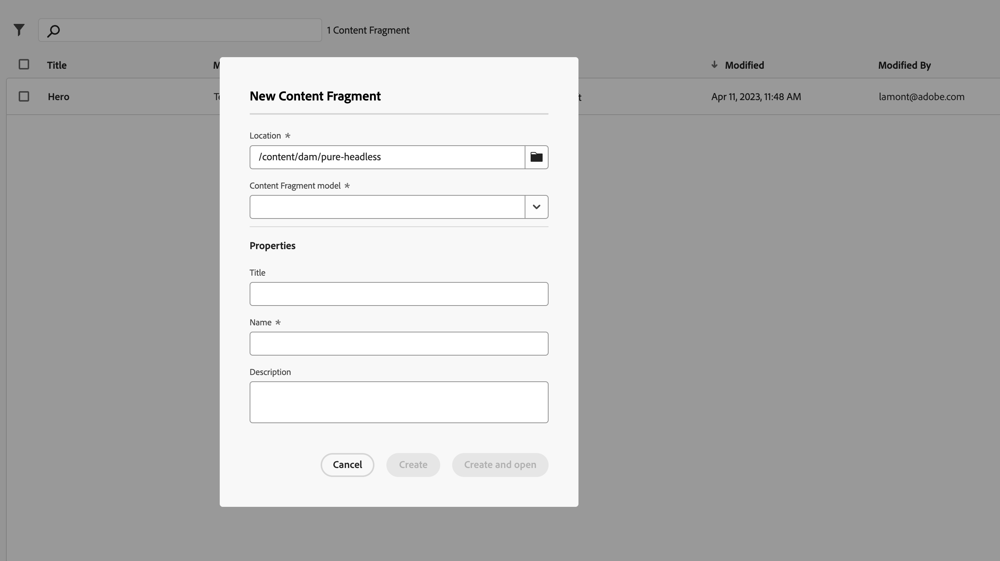

# Criar componente complexo

Bem-vindo a este capítulo de tutorial, onde exploraremos a criação de um componente complexo da Lista de imagens que renderiza fragmentos de conteúdo, referências de fragmento de conteúdo aninhadas e ativos de imagem referenciados. Vamos um passo além, tornando o aplicativo React editável usando o Editor universal.

Os fragmentos de conteúdo no Adobe Experience Manager (AEM) fornecem uma abordagem estruturada para o gerenciamento de conteúdo. Usamos fragmentos de conteúdo para preencher nosso componente Lista de imagens, lidando com referências aninhadas e exibindo ativos de imagem referenciados.

Neste tutorial, guiaremos você pela criação do componente Lista de imagens, lidando com referências aninhadas, renderizando ativos de imagem referenciados e integrando o Editor universal. Você aprenderá a configurar dependências, projetar a estrutura do componente, recuperar e analisar fragmentos de conteúdo e tornar o aplicativo editável usando o Editor universal.

No final deste capítulo de tutorial, você terá um componente de Lista de imagens totalmente funcional e editável. Você estará equipado com o conhecimento e as habilidades para criar componentes dinâmicos no aplicativo React, aprimorando a experiência de criação de conteúdo com o Editor universal. Vamos começar a criar seu componente editável da Lista de imagens!

## Criar uma lista de imagens

1. Agora devemos criar alguns fragmentos de oferta e um componente de lista de imagens.  Navegue até o console de fragmentos de conteúdo.

   

   Criaremos um fragmento do tipo `imagelist` (o modelo é `imagelist`) e daremos a ele o título `imagelist`.

   No editor de Fragmento de conteúdo, temos a oportunidade de selecionar um fragmento para incluir ou criar um fragmento.  Selecione criar um fragmento.

   Nosso tipo de modelo é Lista de imagens.  Dê um título e um nome ao fragmento.

1. Como uma lista de imagens é um fragmento do tipo container que inclui referência a outros fragmentos, novas ofertas podem ser criadas diretamente no editor.  Crie um fragmento de oferta e inclua uma descrição da imagem e um artigo.  Você pode recortar e colar o texto abaixo.  Estamos usando o título do fragmento como o título do cartão.

   __Artigo 1__

   _Título_

   ```text
   Aloha Spirits in Northern Norway
   ```

   _Descrição_

   ```text
   We traveled to Northern Norway to document the joy of surfing in extreme, but breathtakingly beautiful conditions.
   ```

   _Artigo_

   ```text
   Aloha Spirits in Northern Norway
   BY JACOB WESTER
   
   Steep mountain sides surround us, like wise trolls from a distant timeline, weathered and worn by long-gone glaciers, green moss now covering the black rock. White sheep forage on steep grass, defying the chilling winds funneled by the deep valley. The subtle hues of the arctic circle are welcoming, comfortable on the eyes. When rare sun rays pierce through the low clouds, the scenery reveals its vibrancy, as the waves reflect a translucent cyan blue before crashing loudly onto white sand. A small but playful groundswell is building, the offshore breeze grooming playful lines down the point, making for welcoming conditions for acclimatizing to cold water and thick neoprene. Knowing it is our last surf before a few days of hard wind, we take full advantage out of every ripple the North Atlantic Ocean sends our way. Tomorrow this place will have taken on a very different, much more hostile appearance.
   
   "When rare sun rays pierce through the low clouds, the scenery reveals its vibrancy"
   
   The front
   
   The front is due to arrive any hour now, weather charts calling for anything in between regular bad weather and full arctic storm. In our fishing cabin in the quaint fiord, weather and surf forecast websites are refreshed hourly, for any update or hint on where to find the most manageable conditions. Wetsuits dried and ready, fresh wax coat on the surfboards. Tents are inspected, every seam scrutinized. To properly score in this part of the world, equipment means everything, and any inconsistency can ruin a session, the whole trip even. As our social media devices are put on sleep mode and reading lamps are switched off, the wind grows in intensity, rattling our windows through the night. Every surfer knows the feeling of combined anxiety and excitement, the questions that linger in our minds while falling asleep before a swell. Tomorrow they will be answered; we tell each other before updating the charts just one last time.
   
   Clear skies
   
   The morning after the winds have subsided, and when arriving at a secret coastline we have been given directions to, we are greeted by clean waves, improving with the incoming tide. A few cars parked in the grassy field outside the quiet farm village, and local surfers getting changed are signs that in 2015, no surf spots are kept away from satellite photos and internet forums. Still, there are enough of waves to keep us all warm in the frigid line-up. The media crew on the beach is doing their best to keep dry. The rain keeps hammering down; to a point where little freshwater streams start flooding the field, and cameras start breaking down. If finding good surf this far north in October is a daunting task, documenting it is proving even more difficult. It's easy to mistake the athletes in the water for the tough ones; stripping naked in near freezing temps and paddling out into the North Atlantic Ocean to get their fix of far-traveled energy. Instead, the real heroes are often the ones on the beach, stumbling on slippery rocks, wearing layers upon layers of technical clothing, cameras in plastic bags, fighting the elements to get the shot, all to make the trip "worth it". Even if the true reward is in the waves surfed, without documentations they are just memories, and in a time where success is measured in thumbs-up icons and visitor stats, the golden memories of the moments you shared in the water are no longer enough, for better or for worse.
   
   Mythical northern lights
   
   A window of blue afternoon sky is getting nearer, and from experience we know that it might be only a matter of minutes before the rain starts again. In only a week, late summer has turned into autumn, the rain crystallizing above us, capping the black mountains with a fine layer of white snow. In front of the picturesque lineup we pitch our tents on wet grass, sheltered by the cliff wall on one side and some old fishing sheds. Neoprene is hung to dry after hours in the water, not that it won't still be wet the following morning, but any attempts to make surfing in the Arctic easier count. As dark falls, we make another pot of pesto tortellini and prepare for the night, to the sound of polished rocks rumbling in the shore break below our tents.
   
   Like a faint torch, a striking green hue shines through the tent fabric, disappearing just as quickly. The sound of zippers does its best to penetrate the ocean's roar, as we curiously peek our heads out into the freezing wind. Moments after, we sprint out in sweatpants, cameras in hand to document the fabled phenomenon the past week's cloud layer has prevented us from seeing; the Aurora Borealis. It starts with only the faintest streaks of green and blue, seemingly appearing out of thin air, only to vanish before our eyes have had a chance to adjust to the dark. Every pulse becoming more radiant, and before we know it we are gazing in awe at the dancing curtains, shifting colors under starry skies. After a week of battling the elements, it's as if Mother Nature has decided to treat us with just a taste of the breathtaking beauty she is capable of, as if we have finally proven ourselves worthy. With our jaws still open, we watch on as the mesmerizing curtains of emerald green are veiled in a dark cloud layer, and the winds once again take hold of the bay. The exhibition is over for now, but these islands will stay in our minds forever. See you next time, Lofoten, may the forces of life yet again gravitate us towards your majestic shores, because in the hardship of finding what we came for, something else has emerged, a yearning for the undisturbed, the unknown and the truly magical. It's waiting for you no matter where you are in the world.
   ```

   __Artigo 2__

   _Título_

   ```text
   Camping Western Australia
   ```

   _Descrição_

   ```text
   A vibrant red, dusty highway stretches out before us into what seems like infinity, at the far reach of our sights it distorts and shimmers from the afternoon heat, fading into the blue of the horizon. For the past hour the image has stayed roughly the same, apart from the occasional road train flying by, its fifty meters of steel and rubber promptly asking us to give way before disappearing in our rear view mirrors.
   ```

   _Artigo_

   ```text
   Western Australia by Camper Van
   BY SOFIA SJÖBERG
   
   A vibrant red, dusty highway stretches out before us into what seems like infinity, at the far reach of our sights it distorts and shimmers from the afternoon heat, fading into the blue of the horizon. For the past hour the image has stayed roughly the same, apart from the occasional road train flying by, its fifty meters of steel and rubber promptly asking us to give way before disappearing in our rear view mirrors. The fuel gauge of our rented Toyota Hiace is well below one third, and we can't seem to remember how far the next gas station is… Welcome to West Australia!
   
   Wanderlust \ˈwɒndəlʌst\ 
   
   a strong desire to travel.
   
   noun
   
   Traveling by camper van is an ambiguous affair – while avoiding many of the arduous preparations of a long journey, such as carefully planning ones stops, booking hotel nights and deciding what to do and see far in advance, one instead deals with the prospect of not knowing much at all of the itinerary beforehand. Not an easy task for a control freak, but an oh-so-alluring potential of exploration for the more adventurous traveler. Perhaps somewhere along the road towards your destination, an enticing sign leads you to something fantastic that you weren't anticipating at all, or maybe you end up realizing that the quaint romantic town described in your guidebook was a total tourist trap and hardly worth staying in for long. Just get back in your van and go look for something new!
   
   Hiking and camping on the coast
   
   The Australian West coast is a camper's heaven. Endless miles of desert roads leading to secret beaches, vast canyons and crystal clear rivers, and the very few people you are likely to meet on your journey will be some of the most easy-going characters you'll find anywhere in the world. And if you think the landscape surrounding you is breathtakingly beautiful (and it is), you better prepare yourself for your first night in the Australian desert. It begins hours before the first stars come out. As the sun starts setting, the sky takes on a mesmerizing gradient, ranging from the brightest orange on the horizon to a dark purple above your head, and as you keep staring up and behind you, nearly tripping over, it stretches into a deep greyish green, far to the east. As night slowly falls, the spectrums of hues blend together into a thick impenetrable black, as one by one the stars of the southern hemisphere's window into space reveal themselves. With no cities around for a thousand miles, light pollution is unheard of. At this point, time ceases to exist, as you gaze into the nothingness of the past, while scattered and confused thoughts of existentialism and the meaning of it all battle for your mind's attention.
   
   A trusty vehicle
   
   "Are you sure we won't get stuck in the sand here?", Sofia asks me nervously as we trot in two-wheel drive down a winding road through the rolling dunes of the Quobba station outback. Somewhere in the distance the Indian Ocean is calling, salt saturating the desert air and flashes of blue horizon luring us closer to the end of the road. Rumors of a world class pointbreak has brought us and our surfboards here, and my intuition tells me we're getting closer, every bend and rollover making me stretch my neck in the hope of finally seeing what I'm silently praying to discover. Just as our poor Toyota is about to sink into the increasingly deeper sand for a final resting place, we make it over one last knoll before our destination is revealed. In front of us a majestic bay stretches out, sapphire-blue waves crashing on sparkling sand, and a reeling lefthand pointbreak rolling down the far end, the offshore spray grooming the swell lines to perfection. At this point I'm having a hard time focusing on the road as we roll into the Red Bluff camping community. In the center of a handful of campgrounds scattered along the beach is a tiny general store/surf shop/pizza restaurant, run by a friendly local woman and her five sons and daughters, all miniature replicas of herself, sun-bleached hair and a deep golden surf tan from countless hours spent in the surf. We get allotted a private space on the far end of the beach where we set up camp for the next two nights, unknowing that they will turn to three, then four and eventually five, in this little slice of paradise. The following days turn into a timeless blur of surfing, sleeping, drinking beer around the fire, and watching the humpback whales migrate in the hundreds on their way north along the coast. These majestic creatures are constantly present, sometimes breaching the surface just outside the surf line-up, providing delightful entertainment in between waves.
   
   Surfing is a must do
   
   Then there's the surf. A pointbreak breaking for 300 meters down a shallow coral shelf, producing immaculate almond-shaped barrels, grinding down the reef at a barely makeable speed. Even though many of the waves race past me on my struggling backhand, the few that I make it to the end of are some of the best I've ever experienced, and I have a hard time containing my excitement, hooting and hollering to Sofia on the cliffs, with her Canon 5D in hand. The line-up out back is an eclectic mix of old salty men on oversized gun surfboards, young semi-pros with stickered boards, girlfriends on longboards and hippies with dreadlocks and big smiles. Nothing of the notorious localism I have read about online, even though I quickly learn to respect the noticeable pecking order, letting the obviously more skilled crowd get the biggest set waves. There are still plenty of action for everyone, and a friendly smile opens up even the grumpiest old-timer. After the sun has set, the same faces are seen around campfires and tailgate barbeques all over the campground, where many seem to have gotten stuck for the season, ignoring distant calls of civilization urging them to return to normal lives. As the stars come out, we set up our cameras for timelapses, hoping to capture some of the magic that is happening above us, all the while our heads turn heavy from the five hours in the water and the beverages that followed.
   ```

   __Artigo 3__

   _Título_

   ```text
   Ski Touring
   ```

   _Descrição_

   ```text
   My backpack feels heavier for every meter, slowly deforming my spine and wearing down my shoulders. My mouth tastes like blood, while salty pearls of sweat find their way to my eyes. I look back up, I'm not there yet, just a few hundred more steps, keep walking, keep counting, block out the pain.
   ```

   _Artigo_

   ```text
   Ski Touring
   BY SOFIA SJÖBERG
   
   My backpack feels heavier for every meter, slowly deforming my spine and wearing down my shoulders. My mouth tastes like blood, while salty pearls of sweat find their way to my eyes. I look back up, I'm not there yet, just a few hundred more steps, keep walking, keep counting, block out the pain. On shaking legs, I reach the summit and I'm immediately humbled by the uninterrupted panorama before me. Before I know it, serotonin receptors are firing, emotions bursting out from the deep, reigniting me with vigor from within. Below my feet is a mountain face stretching out for a thousand meters covered by a smooth blanket of powder, with the evening sun replicated thousand-fold in the uncountable snow crystals. Making high-speed turns down the run, I no longer feel any pain. My mind is as clear as it ever has been, unadulterated joy spreading through my nervous system, and the minutes seem like hours. Back at the bottom, I start counting the hours until I get to do it again.
   
   "...a mountain face stretching out for a thousand meters covered by a smooth blanket of powder, with the evening sun replicated thousand-fold in the uncountable snow crystals"
   
   - Sofia Sjöberg
   
   The pastime us earthlings refer to as "skiing", must seem peculiar, if not laughable if observed by an extraterrestrial species. We give hard-earned money to amusement park-like mountain resorts, where intricate cable systems transport us to the top, allowing us to slide down snow in near friction-less conditions on wooden planks strapped to our feet, only to start over, again and again and again. Like hairless apes, freed by technology from the natural dangers of living, we race down miles of groomed trails, carving our signatures in the glistening snow with sharp metal edges. When our legs give up and food money runs out, we get back in our cars and migrate back to our urban hives and desk jobs, our bodies for the moment reignited by signal substances we no longer have use for in modern civilization, but still so eagerly seek.
   
   However, this is a very modern interpretation of skiing. Long before the first p-tex base or metal edge was ever conceived of, and before anyone ever got the idea of hauling people up a mountain on a cable for payment, crafty Scandinavians began strapping their feet to wooden planks, allowing them a more efficient means of transportation through deep snow. Over time, steady improvement of gear and technique evolved this new phenomenon into a practical way of hunting, gathering, and communicating, as our animal-hide clad ancestors unknowingly invented what we today call ski-touring.
   
   Fast forward 5000 years, and although human ingenuity, competition and spirit for invention has further evolved this once crude way of transportation, the principles remain the same. We designed our now countless different models of wooden planks to float on top of powder snow, crafted metal edges to cut through ice, we shaved off every superfluous gram we could find to help us on our journeys, to reach farther, higher and steeper. And today, when in many places, multi-billion dollar corporations charge us big money to ride down over-crowded slopes, many of us are returning to the original way of skiing. Exchanging lift queues for solitude, quantity for quality, and apres-ski beer for trail mix, a new generation of skiers are rediscovering the virtue of earning one's turns, the silence of the mountains, and how far into the unknown a little off-season cardio training can get you.
   ```

   __Artigo 4__

   _Título_

   ```text
   San Diego Surf Spots
   ```

   _Descrição_

   ```text
   We traveled to Northern Norway to document the joy of surfing in extreme, but breathtakingly beautiful conditions.
   ```

   _Artigo_

   ```text
   San Diego Surf Spots
   BY JUSTIN BARR
   
   Lorem ipsum dolor sit amet, consectetur adipiscing elit, sed do eiusmod tempor incididunt ut labore et dolore magna aliqua. Pulvinar neque laoreet suspendisse interdum consectetur libero. Sapien pellentesque habitant morbi tristique senectus et netus et malesuada. Sed risus pretium quam vulputate dignissim suspendisse. Sed risus ultricies tristique nulla aliquet. Nisl nunc mi ipsum faucibus vitae aliquet nec ullamcorper sit. Malesuada pellentesque elit eget gravida cum sociis natoque. Risus at ultrices mi tempus imperdiet nulla malesuada. Senectus et netus et malesuada fames ac turpis. Condimentum vitae sapien pellentesque habitant morbi. Nunc vel risus commodo viverra maecenas accumsan lacus vel. Porttitor leo a diam sollicitudin tempor id eu.
   
   GORGEOUS BEACH POINT BREAKS
   
   In nibh mauris cursus mattis molestie. Egestas maecenas pharetra convallis posuere morbi leo urna molestie at. Dui sapien eget mi proin sed. Sagittis purus sit amet volutpat consequat. Dignissim sodales ut eu sem integer vitae justo eget magna. Magna fringilla urna porttitor rhoncus dolor purus. Ac felis donec et odio pellentesque. Proin libero nunc consequat interdum. Consectetur a erat nam at. Neque convallis a cras semper. Sollicitudin aliquam ultrices sagittis orci a scelerisque purus semper eget. Leo vel orci porta non. Adipiscing elit duis tristique sollicitudin nibh sit amet commodo nulla. Pretium vulputate sapien nec sagittis aliquam. Magnis dis parturient montes nascetur ridiculus mus. Vulputate sapien nec sagittis aliquam malesuada bibendum arcu vitae elementum. Pellentesque eu tincidunt tortor aliquam nulla facilisi cras fermentum odio. Non tellus orci ac auctor augue mauris augue neque gravida.
   
   Euismod elementum nisi quis eleifend quam adipiscing vitae proin. Morbi tincidunt augue interdum velit. Nisl vel pretium lectus quam. Ac turpis egestas sed tempus urna et pharetra. At erat pellentesque adipiscing commodo elit at. Semper eget duis at tellus at urna condimentum. Lectus magna fringilla urna porttitor rhoncus dolor. Purus faucibus ornare suspendisse sed nisi lacus sed. Senectus et netus et malesuada fames ac turpis egestas. Quis ipsum suspendisse ultrices gravida dictum.
   
   Ut placerat orci nulla pellentesque dignissim enim sit amet. Tristique senectus et netus et. Aliquam vestibulum morbi blandit cursus risus at. Enim nec dui nunc mattis enim ut tellus elementum. Aliquet enim tortor at auctor urna nunc id. Pellentesque massa placerat duis ultricies lacus sed. Aliquam eleifend mi in nulla posuere sollicitudin aliquam ultrices. Consectetur libero id faucibus nisl tincidunt eget. Nisl vel pretium lectus quam id leo in vitae. Facilisis magna etiam tempor orci. Sit amet justo donec enim diam. Sodales ut eu sem integer vitae. Erat pellentesque adipiscing commodo elit at. Eu turpis egestas pretium aenean pharetra magna ac. Tortor at risus viverra adipiscing at. Donec massa sapien faucibus et. Tempor nec feugiat nisl pretium fusce. Diam donec adipiscing tristique risus nec feugiat in fermentum.
   
   Eu facilisis sed odio morbi quis. Consequat semper viverra nam libero justo laoreet sit amet. Eget mi proin sed libero enim sed faucibus. Vitae tempus quam pellentesque nec nam aliquam sem. Justo donec enim diam vulputate ut pharetra sit. Risus sed vulputate odio ut enim blandit volutpat maecenas volutpat. Mauris pellentesque pulvinar pellentesque habitant morbi. Iaculis at erat pellentesque adipiscing. Libero id faucibus nisl tincidunt eget nullam non nisi est. Interdum consectetur libero id faucibus nisl tincidunt. Volutpat odio facilisis mauris sit amet massa. Tristique senectus et netus et malesuada fames ac turpis egestas. Leo vel orci porta non pulvinar neque laoreet suspendisse interdum. Sapien et ligula ullamcorper malesuada proin libero. Interdum consectetur libero id faucibus nisl tincidunt.
   ```

1. Vamos retornar ao Editor de consultas e buscar esse novo componente.  Observe que estamos referenciando o `OfferModel` em nossa consulta e os metadados, que usaremos para o título do cartão.

   ```graphql
   query imageList {
     cards: imageListList(
         _assetTransform: {
         format:WEBP
         width:1900,
         preferWebp:true
         }
     )  {
         items {
         listItems {
             ...on OfferModel {
             _path
             _metadata {
                 stringMetadata {
                   name
                   value
                 }
             }
             description {
                 json
             }
             asset {
                 ...on ImageRef {
                 _dynamicUrl
                 }
             }
             }
         }
         }
     }
   }
   ```

1. Agora conecte isso ao nosso aplicativo.  Em nosso `home.js`, referenciaremos nossa nova consulta. Acima de `useEffect()`, definiremos `list` e `setList`.

   ```javascript
   const [list, setList] = useState({});
   ```

   Dentro de `useEffect()` uma nova solicitação para a consulta imagelist.

   ```javascript
   sdk.runPersistedQuery('pure-headless/imagelist')
   .then(({ data }) => {
       if (data) {
       setList(data);
       }
   })
   .catch((error) => {
       console.log(`Error with pure-headless/imagelist. ${error.message}`);
   });
   ```

   E agora, vamos adicioná-lo ao DOM do nosso aplicativo.

   ```javascript
   <div>{list.cards && <ImageList content={list.cards} />}</div>
   ```

   Vamos analisar nosso componente de lista de imagens.  Dentro da imagelist, repetimos cada oferta.

   ```javascript
   {content.items && content.items.map((items) => (
   <Cards key={items} content={items.listItems} />
   ))}
   ```

   No componente de cartão, renderizamos cada cartão.

   ```javascript
   const Cards = ({ content }) => {
   return (
       <div className='cards'>
       {content && content.map((card) => (
           <div className='card' key={card._path} itemID={`urn:aemconnection:${card._path}/jcr:content/data/master`} itemfilter='cf' itemType='reference' itemScope>
           <Image src={card.asset._dynamicUrl} />
           <h3 itemProp="_metadata" itemType="text">{card._metadata && parseName(card)}</h3>
           <div itemProp="description"
               itemType="richtext">{mapJsonRichText(card.description.json)}</div>
           </div>
       ))}
       </div>
   );
   };
   ```

   Além disso, observe que estamos referenciando um componente de imagem e transmitindo a ele um URL dinâmico.

   No componente de imagem, estamos usando o URL dinâmico para criar um conjunto de origem com vários URLs.

   ```javascript
   const srcset = [
   `${context.url.replace(/\/$/, '') + src} 1900w`,
   `${context.url.replace(/\/$/, '') + src.replace('width=1900', 'width=1200')} 1200w`,
   `${context.url.replace(/\/$/, '') + src.replace('width=1900', 'width=900')} 900w`,
   `${context.url.replace(/\/$/, '') + src.replace('width=1900', 'width=')} 600w`
   ];
   ```

## Habilitar Editor Universal

1. Adicionar `<meta />` ao aplicativo.  Abra `App.js` e insira importar na parte superior do arquivo.

   ```javascript
   import { Helmet } from 'react-helmet';
   ```

   E, no retorno do aplicativo, adicione o seguinte código:

   ```javascript
   <Helmet>
   <meta name='urn:auecon:aemconnection' content={`aem:${context.url}`} />
   </Helmet>
   ```

   >[!TIP]
   >
   > Estamos usando a biblioteca Capacete para tornar isso dinâmico com base no arquivo `.env`. No entanto, você pode codificá-lo no `index.html`.

1. Agora vamos atualizar o Cartão para identificar o fragmento e o tipo de dados para editar cada cartão.

   Dentro de `<div className='card' key={card._path}>`

   adicionar

   ```javascript
   itemID={`urn:aemconnection:${card._path}/jcr:content/data/master`} itemfilter='cf' itemType='reference' itemScope
   ```

   Agora você deve ter:

   ```javascript
   <div className='card' key={card._path} itemID={`urn:aemconnection:${card._path}/jcr:content/data/master`} itemfilter='cf' itemType='reference' itemScope>
   ```

1. Agora, identifique o que é editável.

   Ao `<h3 />` adicione:

   ```javascript
   itemProp="_metadata" itemType="text"
   ```

   Ao nosso `<div />` adicione:

   ```javascript
   itemProp="description" itemType="richtext"
   ```

   O código final do cartão:

   ```javascript
   const Cards = ({ content }) => {
   return (
       <div className='cards'>
       {content && content.map((card) => (
           <div className='card' key={card._path} itemID={`urn:aemconnection:${card._path}/jcr:content/data/master`} itemfilter='cf' itemType='reference' itemScope>
           <Image src={card.asset._dynamicUrl} />
           <h3 itemProp="_metadata" itemType="text">{card._metadata && parseName(card)}</h3>
           <div itemProp="description"
               itemType="richtext">{mapJsonRichText(card.description.json)}</div>
           </div>
       ))}
       </div>
   );
   };
   ```

Código final para `home.js`:

```javascript
import React, { useContext, useEffect, useState } from 'react';
import AEMHeadless from '@adobe/aem-headless-client-js';
import { AppContext } from '../../utils/context';
import Teaser from '../../components/teaser/teaser';
import ImageList from '../../components/imagelist/imagelist';

import './home.css';

const Home = () => {
  const [content, setContent] = useState({});
  const [list, setList] = useState({});
  const context = useContext(AppContext);

  useEffect(() => {
    const sdk = new AEMHeadless({
      serviceURL: context.url,
      endpoint: context.endpoint,
      auth: context.token
    });


    sdk.runPersistedQuery('pure-headless/teaser', { path: `/content/dam/${context.project}/hero` })
      .then(({ data }) => {
        if (data) {
          setContent(data);
        }
      })
      .catch((error) => {
        console.log(`Error with pure-headless/teaser. ${error.message}`);
      });

    sdk.runPersistedQuery('pure-headless/imagelist')
      .then(({ data }) => {
        if (data) {
          setList(data);
        }
      })
      .catch((error) => {
        console.log(`Error with pure-headless/imagelist. ${error.message}`);
      });

  }, [context]);

  return (
    <div className='main-body'>
      <div>{content.component && <Teaser content={content.component.item} />}</div>
      <div>{list.cards && <ImageList content={list.cards} />}</div>
    </div>
  );
};

export default Home;
```


## Parabéns.

Você criou com sucesso uma experiência do AEM Headless que é totalmente alimentada pelas APIs do AEM Headless e pode ser editada com o Universal Editor.
