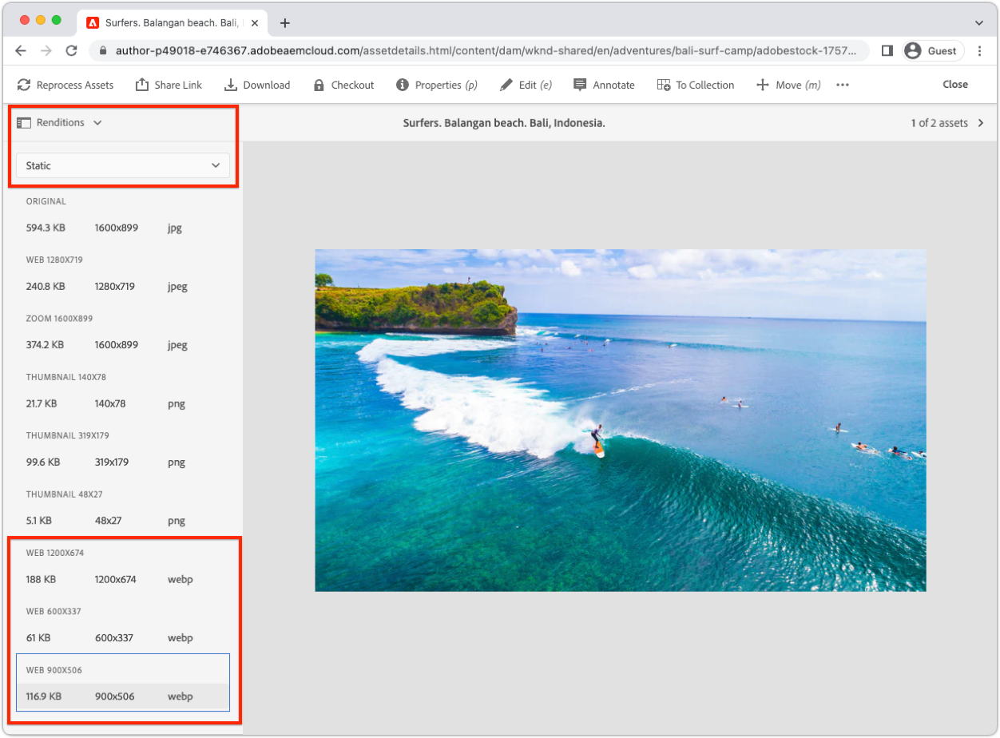

# Imagens com AEM headless {#images-with-aem-headless}

As imagens são um aspecto crítico do [desenvolvimento de experiências ricas e convincentes AEM sem interface](https://experienceleague.adobe.com/docs/experience-manager-learn/getting-started-with-aem-headless/graphql/multi-step/overview.html?lang=pt-BR). AEM Headless suporta o gerenciamento de ativos de imagem e sua entrega otimizada.

Fragmentos de conteúdo usados AEM modelagem de conteúdo sem cabeçalho, geralmente fazem referência a ativos de imagem destinados à exibição na experiência sem cabeçalho. AEM consultas do GraphQL podem ser escritas para fornecer URLs para imagens com base em onde a imagem é referenciada.

O `ImageRef` tem três opções de URL para referências de conteúdo:

+ `_path` é o caminho referenciado no AEM e não inclui uma origem AEM (nome do host)
+ `_authorUrl` é o URL completo para o ativo de imagem no Autor do AEM
   + [Autor do AEM](https://experienceleague.adobe.com/docs/experience-manager-learn/cloud-service/underlying-technology/introduction-author-publish.html) pode ser usada para fornecer uma experiência de visualização do aplicativo sem periféricos.
+ `_publishUrl` é o URL completo para o ativo de imagem no AEM Publish
   + [Publicação do AEM](https://experienceleague.adobe.com/docs/experience-manager-learn/cloud-service/underlying-technology/introduction-author-publish.html) geralmente é onde a implantação de produção do aplicativo sem cabeçalho exibe imagens.

Os campos são melhor usados com base nos seguintes critérios:

| Campos ImageRef | Aplicativo Web do cliente fornecido pelo AEM | O aplicativo cliente consulta o autor do AEM | Consultas de aplicativo do cliente AEM Publish |
|--------------------|:------------------------------:|:-----------------------------:|:------------------------------:|
| `_path` | ✔ | (O aplicativo deve especificar o host no URL) | (O aplicativo deve especificar o host no URL) |
| `_authorUrl` | ✘ | ✔ | ✘ |
| `_publishUrl` | ✘ | ✘ | ✔ |

Utilização de `_authorUrl` e `_publishUrl` O deve estar alinhado ao ponto de extremidade AEM GraphQL que está sendo usado para gerar a resposta do GraphQL.

>[!CONTEXTUALHELP]
>id="aemcloud_learn_headless_graphql_images"
>title="Imagens com AEM headless"
>abstract="Saiba como o AEM Headless suporta o gerenciamento de ativos de imagem e seu delivery otimizado."

## Modelo de fragmentos do conteúdo

Verifique se o campo Fragmento do conteúdo que contém a referência da imagem é do __referência de conteúdo__ tipo de dados.

Os tipos de campo são revisados na seção [Modelo de fragmento de conteúdo](https://experienceleague.adobe.com/docs/experience-manager-cloud-service/content/assets/content-fragments/content-fragments-models.html), selecionando o campo e inspecionando o __Propriedades__ à direita.


## Consulta persistente do GraphQL

Na query de GraphQL, retorne o campo como o `ImageRef` e solicitar os campos apropriados `_path`, `_authorUrl`ou `_publishUrl` exigido pelo seu aplicativo. Por exemplo, querendo uma aventura no [Projeto de Site WKND](https://github.com/adobe/aem-guides-wknd) e incluindo o URL da imagem para as referências do ativo de imagem em sua `primaryImage` , pode ser feito com uma nova consulta persistente `wknd-shared/adventure-image-by-path` definido como:

```graphql
query ($path: String!) {
  adventureByPath(_path: $path) {
    item {
      title,
      primaryImage {
        ... on ImageRef {
          _path
          _authorUrl
          _publishUrl
        }
      }
    }
  }
}
```

O `$path` usada na variável `_path` o filtro requer o caminho completo para o fragmento de conteúdo (por exemplo, `/content/dam/wknd-shared/en/adventures/bali-surf-camp/bali-surf-camp`).

## Resposta do GraphQL

A resposta JSON resultante contém os campos solicitados contendo os URLs para os ativos de imagem.

```json
{
  "data": {
    "adventureByPath": {
      "item": {
        "adventurePrimaryImage": {
          "_path": "/content/dam/wknd-shared/en/adventures/bali-surf-camp/adobestock-175749320.jpg",
          "_authorUrl": "https://author-p123-e456.adobeaemcloud.com/content/dam/wknd-shared/en/adventures/bali-surf-camp/adobestock-175749320.jpg",
          "_publishUrl": "https://publish-p123-e789.adobeaemcloud.com/content/dam/wknd-shared/en/adventures/bali-surf-camp/adobestock-175749320.jpg"
        }
      }
    }
  }
}
```

Para carregar a imagem referenciada em seu aplicativo, use o campo apropriado, `_path`, `_authorUrl`ou `_publishUrl` do `adventurePrimaryImage` como o URL de origem da imagem.

Os domínios da `_authorUrl` e `_publishUrl` são automaticamente definidas por AEM as a Cloud Service usando a variável [Externalizador](https://experienceleague.adobe.com/docs/experience-manager-cloud-service/content/implementing/developer-tools/externalizer.html).

No React, a exibição da imagem da publicação do AEM é semelhante a:

```html

```

## Representações de imagem

Suporte a ativos de imagem personalizáveis [representações](../../../assets/authoring/renditions.md), que são representações alternativas do ativo original. As representações personalizadas podem ajudar na otimização de uma experiência sem cabeçalho. Em vez de solicitar o ativo de imagem original, que geralmente é um arquivo grande de alta resolução, as representações otimizadas podem ser solicitadas pelo aplicativo sem cabeçalho.

### Criar representações

Os administradores do AEM Assets definem as representações personalizadas usando Perfis de processamento. Os Perfis de processamento podem ser aplicados a árvores ou ativos de pasta específicos diretamente para gerar as representações desses ativos.

#### Processando perfis

As especificações de representações de ativos são definidas em [Processando perfis](../../../assets/configuring/processing-profiles.md) pelos administradores do AEM Assets.

Crie ou atualize um Perfil de processamento e adicione definições de representação para os tamanhos de imagem necessários para o aplicativo sem cabeçalho. As representações podem ter qualquer nome, mas devem ser nomeadas semanticamente.


Neste exemplo, três renderizações são criadas:

| Nome da representação | Extensão | Largura máxima |
|-----------------------|:---------:|----------:|
| web-otimized-large | webp | 1200 px |
| mídia otimizada para a Web | webp | 900 px |
| web-otimized-small | webp | 600 px |

Os atributos chamados na tabela acima são importantes:

+ __Nome da representação__ é usada para solicitar a representação.
+ __Extensão__ é a extensão usada para solicitar a variável __nome da representação__. Preferência `webp` representações, pois são otimizadas para entrega na Web.
+ __Largura máxima__ é usada para informar ao desenvolvedor qual renderização deve ser usada com base em seu uso no aplicativo sem periféricos.

As definições de representação dependem das necessidades do aplicativo sem periféricos, portanto, defina a representação ideal definida para o caso de uso e seja nomeada semanticamente em relação a como estão sendo usadas.

#### Reprocessar ativos{#reprocess-assets}

Com o Perfil de processamento criado (ou atualizado), reprocesse os ativos para gerar as novas representações definidas no Perfil de processamento. Novas representações não existem, até que os ativos sejam processados com o perfil de processamento.

+ De preferência, [atribuído o Perfil de processamento a uma pasta](../../../assets/configuring//processing-profiles.md) para que qualquer novo ativo carregado nessa pasta gere automaticamente as representações. Os ativos existentes devem ser reprocessados usando a abordagem ad hoc abaixo.

+ Ou, ad-hoc, selecionando uma pasta ou ativo, selecionando __Reprocessar ativos__ e selecionando o novo nome do Perfil de processamento.

   

#### Revisar representações

As representações podem ser validadas por [abrir a exibição de representações de um ativo](../../../assets/authoring/renditions.md)e selecionar as novas representações para visualização no painel de representações. Se as renderizações estiverem ausentes, [verifique se os ativos são processados usando o Perfil de processamento](#reprocess-assets).



#### Publicar ativos

Certifique-se de que os ativos com as novas representações sejam [(re)publicado](../../../assets/sharing/publish.md) assim, as novas representações são acessíveis no AEM Publish.

### Acessar representações

As representações são acessadas diretamente ao anexar a variável __nomes de representação__ e __extensões de representação__ definido no Perfil de processamento no URL do ativo.

| URL do ativo | Subcaminho de representações | Nome da representação | Extensão de representação |  | URL de representação |
|-----------|:------------------:|:--------------:|--------------------:|:--:|---|
| https://publish-p123-e789.adobeaemcloud.com/content/dam/example.jpeg | /_jcr_content/renditions/ | web-otimized-large | .webp | → | https://publish-p123-e789.adobeaemcloud.com/content/dam/example.jpeg/_jcr_content/renditions/web-optimized-large.webp |
| https://publish-p123-e789.adobeaemcloud.com/content/dam/example.jpeg | /_jcr_content/renditions/ | mídia otimizada para a Web | .webp | → | https://publish-p123-e789.adobeaemcloud.com/content/dam/example.jpeg/_jcr_content/renditions/web-optimized-medium.webp |
| https://publish-p123-e789.adobeaemcloud.com/content/dam/example.jpeg | /_jcr_content/renditions/ | web-otimized-small | .webp | → | https://publish-p123-e789.adobeaemcloud.com/content/dam/example.jpeg/_jcr_content/renditions/web-optimized-small.webp |

{style=&quot;table-layout:auto&quot;}

### Consulta GraphQL{#renditions-graphl-query}

AEM GraphQL requer sintaxe extra para solicitar representações de imagem. Em vez disso [imagens são consultadas](#images-graphql-query) da maneira habitual, e a representação desejada é especificada no código. É importante [garantir que os ativos de imagem usados pelo aplicativo sem cabeçalho tenham as mesmas representações nomeadas](#reprocess-assets).

### Exemplo de reação

Vamos criar um aplicativo React simples que exibe três representações, web-otimized-small, web-otimized-medium e web-otimized-large, de um único ativo de imagem.


#### Criar componente de imagem{#react-example-image-component}

Crie um componente React que renderize as imagens. Esse componente aceita quatro propriedades:

+ `assetUrl`: O URL do ativo de imagem, conforme fornecido pela resposta do query do GraphQL.
+ `renditionName`: O nome da representação a ser carregada.
+ `renditionExtension`: A extensão da representação a ser carregada.
+ `alt`: O texto alternativo da imagem; acessibilidade é importante!

Esse componente constrói o [URL de representação usando o formato descrito em __Acessar representações__](#access-renditions). Um `onError` O manipulador é definido para exibir o ativo original no caso de a representação estar ausente.

Este exemplo usa o url do ativo original como fallback na `onError` manipulador, no evento, uma representação está ausente.

```javascript
// src/Image.js

export default function Image({ assetUrl, renditionName, renditionExtension, alt }) {
  // Construct the rendition Url in the format:
  //   <ASSET URL>/_jcr_content/renditions<RENDITION NAME>.<RENDITION EXTENSION>
  const renditionUrl = `${assetUrl}/_jcr_content/renditions/${renditionName}.${renditionExtension}`;

  // Load the original image asset in the event the named rendition is missing
  const handleOnError = (e) => { e.target.src = assetUrl; }

  return (
    <>
      
    </>
  );
}
```

#### Defina as `App.js`{#app-js}

Este simples `App.js` consultas AEM uma imagem da Aventura e exibem as três representações dessa imagem: web-otimized-small, web-otimized-medium e web-otimized-large.

A consulta contra AEM é realizada no gancho React personalizado [useAdventureByPath que usa o SDK sem cabeçalho AEM](./aem-headless-sdk.md#graphql-persisted-queries).

Os resultados da query e os parâmetros de representação específicos são passados para a função [Componente de reação de imagem](#react-example-image-component).

```javascript
// src/App.js

import "./App.css";
import { useAdventureByPath } from './api/persistedQueries'
import Image from "./Image";

function App() {

  // Get data from AEM using GraphQL persisted query as defined above 
  // The details of defining a React useEffect hook are explored in How to > AEM Headless SDK
  let { data, error } = useAdventureByPath("/content/dam/wknd-shared/en/adventures/bali-surf-camp/bali-surf-camp");

  // Wait for GraphQL to provide data
  if (!data) { return <></> }

  return (
    <div className="app">
      
      <h2>Small rendition</h2>
      {/* Render the web-optimized-small rendition for the Adventure Primary Image */}
      <Image
        assetUrl={data.adventureByPath.item.primaryImage._publishUrl}
        renditionName="web-optimized-small"
        renditionExtension="webp"
        alt={data.adventureByPath.item.title}
      />

      <hr />

      <h2>Medium rendition</h2>
      {/* Render the web-optimized-medium rendition for the Adventure Primary Image */}
      <Image
        assetUrl={data.adventureByPath.item.primaryImage._publishUrl}
        renditionName="web-optimized-medium"
        renditionExtension="webp"
        alt={data.adventureByPath.item.title}
      />

      <hr />

      <h2>Large rendition</h2>
      {/* Render the web-optimized-large rendition for the Adventure Primary Image */}
      <Image
        assetUrl={data.adventureByPath.item.primaryImage._publishUrl}
        renditionName="web-optimized-large"
        renditionExtension="webp"
        alt={data.adventureByPath.item.title}
      />
    </div>
  );
}

export default App;
```
