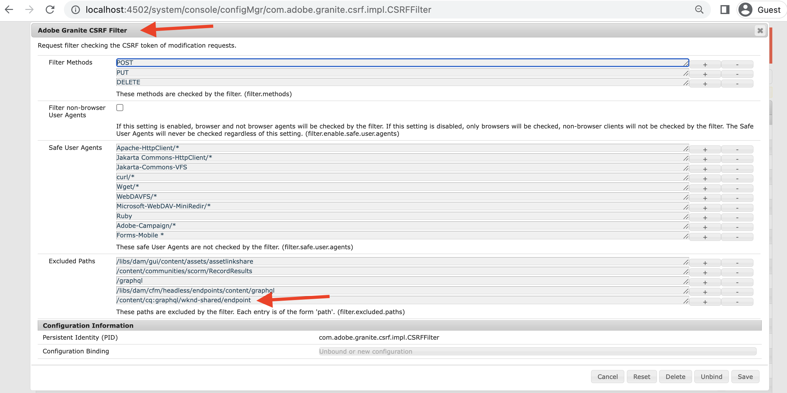
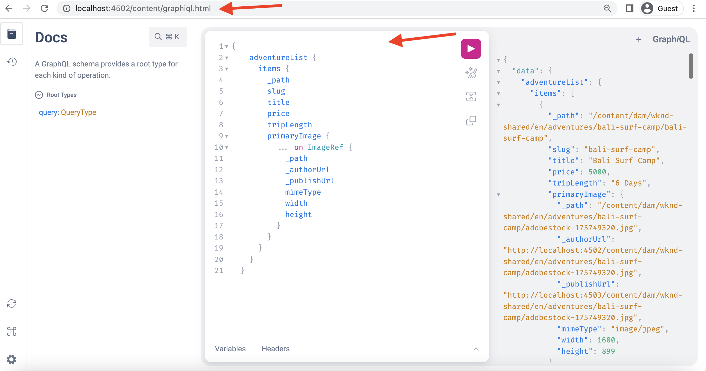

# Instalar o GraphiQL IDE no AEM 6.5

No AEM 6.5, a ferramenta GraphiQL IDE deve ser instalada manualmente.

1. Navegue até o **[Portal de distribuição de software](https://experience.adobe.com/#/downloads/content/software-distribution/en/aemcloud.html)** > **AEM as a Cloud Service**.
1. Pesquise por &quot;GraphiQL&quot; (não deixe de incluir o **i** in **GraphiQL**).
1. Baixe o mais recente **Pacote de conteúdo GraphiQL v.x.x.x**.

   

   O arquivo zip é um pacote AEM que pode ser instalado diretamente.

1. No menu Iniciar do AEM, navegue até **Ferramentas** > **Implantação** > **Pacotes**.
1. Clique em **Fazer upload do pacote** e escolha o pacote baixado na etapa anterior. Clique em **Instalar** para instalar o pacote.

   

1. Navegue até **CRXDE Lite** > **Painel Repositório** > selecionar `/content/graphiql` nó (por exemplo, <http://localhost:4502/crx/de/index.jsp#/content/graphiql>).
1. No **Propriedades** valor de alteração da guia de `endpoint` propriedade para `/content/_cq_graphql/wknd-shared/endpoint.json`.
   

1. Navegue até a **Configuração do console da Web** Interface do usuário > Pesquisar por **Filtro CSRF** configuração (por exemplo,<http://localhost:4502/system/console/configMgr/com.adobe.granite.csrf.impl.CSRFFilter)>
1. No `Excluded Paths` atualização do campo nome da propriedade, o caminho do ponto de extremidade WKND GraphQL para `/content/cq:graphql/wknd-shared/endpoint`.

1. Acesse o editor de GraphiQL usando `//HOST:PORT/content/graphiql.html`e verifique se você pode construir uma nova consulta ou executar uma consulta existente. (por exemplo, <http://localhost:4502/content/graphiql.html>)

>[!TIP]
>
>Para oferecer suporte ao esquema GraphQL específico do projeto e à execução da consulta, é necessário fazer as alterações correspondentes para o `endpoint` e `Excluded Paths` valores nas etapas acima.
