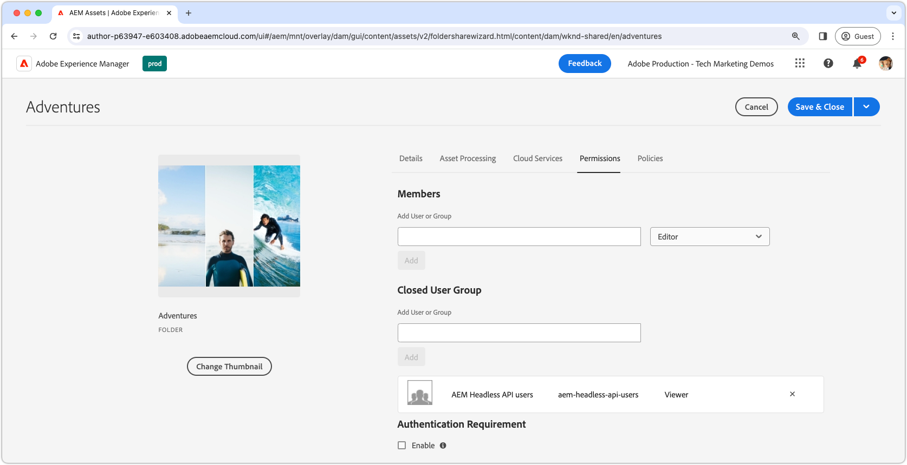

# Proteção de conteúdo no AEM Headless

Garantir a integridade e a segurança de seus dados ao veicular conteúdo AEM Headless do AEM Publish é fundamental ao veicular conteúdo confidencial. Esta instrução aborda a proteção do conteúdo distribuído pelos endpoints da API do GraphQL sem periféricos do AEM.

As orientações neste tutorial onde há requisitos rigorosos para que o conteúdo esteja disponível exclusivamente para usuários ou grupos de usuários específicos. É imperativo distinguir entre conteúdo de marketing personalizado e conteúdo privado, como PII ou dados financeiros pessoais, para evitar confusão e resultados não intencionais. Este tutorial aborda a proteção de conteúdo privado.

Ao discutir o conteúdo de marketing, estamos nos referindo ao conteúdo personalizado para usuários individuais ou grupos, que não se destina ao consumo geral. No entanto, é essencial entender que, embora esse conteúdo possa ser direcionado para determinados usuários, sua exposição fora do contexto pretendido (por exemplo, por meio da manipulação de solicitações HTTP) não representa um risco de segurança, legal ou de reputação.

É enfatizado que todo o conteúdo abordado neste artigo é considerado privado e só pode ser visualizado por usuários ou grupos designados. O conteúdo de marketing geralmente não requer proteção. Em vez disso, seu fornecimento a usuários específicos pode ser gerenciado pelo aplicativo e armazenado em cache para melhorar o desempenho.

Esta instrução não abrange:

- Proteger os endpoints diretamente, mas em vez disso se concentra em proteger o conteúdo que eles fornecem.
- Autenticação para AEM Publish ou obtenção de tokens de logon. Os métodos de autenticação e a transmissão de credenciais dependem de casos de uso e implementações individuais.

## Grupos de usuários

Primeiro, devemos definir um [grupo de usuários](https://experienceleague.adobe.com/en/docs/experience-manager-learn/cloud-service/accessing/aem-users-groups-and-permissions) contendo os usuários que devem ter acesso ao conteúdo protegido.

{align="center"}

Os grupos de usuários atribuem acesso ao conteúdo AEM Headless, incluindo Fragmentos de conteúdo ou outros ativos referenciados.

1. Faça logon no AEM Author como **administrador de usuário**.
1. Navegue até **Ferramentas** > **Segurança** > **Grupos**.
1. Selecione **Criar** no canto superior direito.
1. Na guia **Detalhes**, especifique a **ID do Grupo** e o **Nome do Grupo**.
   - A ID do grupo e o Nome do grupo podem ser qualquer coisa, mas neste exemplo usam o nome **Usuários da API AEM Headless**.
1. Selecione **Salvar e fechar**.
1. Selecione o grupo recém-criado e escolha **Ativar** na barra de ações.

Se vários níveis de acesso forem necessários, crie vários grupos de usuários que podem ser associados a diferentes conteúdos.

### Adicionar usuários aos grupos

Para conceder acesso a solicitações de API AEM Headless do GraphQL a conteúdo protegido, você pode associar a solicitação headless a um usuário pertencente a um grupo de usuários específico. Estas são duas abordagens comuns:

1. **contas técnicas [AEM as a Cloud Service](https://experienceleague.adobe.com/en/docs/experience-manager-learn/getting-started-with-aem-headless/authentication/service-credentials):**
   - Crie uma conta técnica no AEM as a Cloud Service Developer Console.
   - Faça logon no AEM Author uma vez com a conta técnica.
   - Adicione a conta técnica ao grupo de usuários por meio de **Ferramentas > Segurança > Grupos > Usuários da API AEM Headless > Membros**.
   - **Ativar** o usuário da conta técnica e o grupo de usuários no AEM Publish.
   - Este método requer que o cliente headless não exponha as Credenciais de serviço ao usuário, pois elas são credenciais de um usuário específico e não devem ser compartilhadas.

   {align="center"}

2. **Usuários nomeados:**
   - Autentique usuários nomeados e adicione-os diretamente ao grupo de usuários no AEM Publish.
   - Esse método exige que o cliente headless autentique credenciais do usuário com AEM Publish, obtenha um token de logon ou acesso do AEM AEM e use esse token para solicitações subsequentes ao. Os detalhes de como fazer isso não são abordados nesta instrução e dependem da implementação.

## Proteção dos fragmentos de conteúdo

A proteção de fragmentos de conteúdo é essencial para proteger o conteúdo AEM headless e é alcançada ao associar o conteúdo a um Grupo de usuários fechado (CUG). Quando um usuário faz uma solicitação para a API AEM Headless do GraphQL, o conteúdo retornado é filtrado com base nos CUGs do usuário.

{align="center"}

Siga estas etapas para fazer isso por meio de [Grupos de Usuários Fechados (CUGs)](https://experienceleague.adobe.com/en/docs/experience-manager-learn/assets/advanced/closed-user-groups).

1. Faça logon no AEM Author como um **usuário do DAM**.
2. Navegue até **Assets > Arquivos** e selecione a **pasta** que contém os Fragmentos de conteúdo a serem protegidos. Os CUGs são aplicados hierarquicamente e afetam subpastas, a menos que sejam substituídos por um CUG diferente.
   - Certifique-se de que os usuários pertencentes a outros canais que utilizam o conteúdo das pastas estejam incluídos nesse grupo de usuários. Como alternativa, inclua os grupos de usuários associados a esses canais na lista de CUGs. Caso contrário, o conteúdo não estará acessível a esses canais.
3. Selecione a pasta e escolha **Propriedades** na barra de ferramentas.
4. Selecione a guia **Permissões**.
5. Digite o **Nome do Grupo** e selecione o botão **Adicionar** para adicionar o novo CUG.
6. **Salve** para aplicar o CUG.
7. **Selecione** a pasta de ativos e selecione **Publish** para enviar a pasta com os CUGs aplicados ao AEM Publish, onde ela será avaliada como uma permissão.

Execute essas mesmas etapas para todas as pastas que contenham Fragmentos de conteúdo que precisam ser protegidos, aplicando os CUGs corretos a cada pasta.

Agora, quando uma solicitação HTTP é feita para o endpoint da API do GraphQL sem periféricos do AEM, somente os Fragmentos de conteúdo acessíveis pelos CUGs especificados do usuário solicitante serão incluídos no resultado. Se o usuário não tiver acesso a qualquer fragmento de conteúdo, o resultado estará vazio, embora ainda retorne um código de status 200 HTTP.

### Proteção do conteúdo referenciado

Os fragmentos de conteúdo geralmente fazem referência a outro conteúdo AEM, como imagens. Para proteger esse conteúdo referenciado, aplique CUGs às pastas de ativos nas quais os ativos referenciados estão armazenados. Observe que os ativos referenciados geralmente são solicitados usando métodos distintos daqueles das APIs AEM Headless GraphQL. Consequentemente, a maneira pela qual os tokens de acesso são passados em solicitações para esses ativos referenciados pode ser diferente.

Dependendo da arquitetura de conteúdo, pode ser necessário aplicar CUGs a várias pastas para garantir que todo o conteúdo referenciado esteja protegido.

## Impedir o armazenamento em cache de conteúdo protegido

O AEM as a Cloud Service [armazena em cache respostas HTTP por padrão](https://experienceleague.adobe.com/en/docs/experience-manager-learn/cloud-service/caching/publish) para aprimoramento de desempenho. No entanto, isso pode causar problemas com a veiculação de conteúdo protegido. Para evitar o armazenamento em cache desse conteúdo, [remova cabeçalhos de cache para pontos de extremidade específicos](https://experienceleague.adobe.com/en/docs/experience-manager-learn/cloud-service/caching/publish#how-to-customize-cache-rules-1) na configuração do Apache da instância do AEM Publish.

Adicione a seguinte regra ao arquivo de configuração do Apache do projeto do Dispatcher para remover cabeçalhos de cache de pontos de extremidade específicos:

```xml
# dispatcher/src/conf.d/available_vhosts/example.vhost

<VirtualHost *:80>
    ...
    # Replace `example` with the name of your GraphQL endpoint's configuration name.
    <LocationMatch "^/graphql/execute.json/example/.*$">
        # Remove cache headers for protected endpoints so they are not cached
        Header unset Cache-Control
        Header unset Surrogate-Control
        Header set Age 0
    </LocationMatch>
    ...
</VirtualHost>
```

Observe que isso incorrerá em uma penalidade de desempenho, pois o conteúdo não será armazenado em cache pelo Dispatcher ou CDN. Este é um compromisso entre desempenho e segurança.

## Proteção de pontos de acesso AEM Headless da API do GraphQL

Este guia não aborda a proteção dos próprios [pontos de extremidade da API do GraphQL sem periféricos do AEM](https://experienceleague.adobe.com/en/docs/experience-manager-cloud-service/content/headless/graphql-api/graphql-endpoint), mas foca na proteção do conteúdo distribuído por eles. Todos os usuários, incluindo usuários anônimos, podem acessar os endpoints com conteúdo protegido. Somente o conteúdo acessível pelos Grupos fechados de usuários do usuário serão retornados. Se nenhum conteúdo estiver acessível, a resposta da API AEM Headless ainda terá um código de status de resposta 200 HTTP, mas os resultados estarão vazios. Normalmente, proteger o conteúdo é suficiente, pois os próprios endpoints não expõem inerentemente dados confidenciais. Se você precisar proteger os pontos de extremidade, aplique ACLs a eles no AEM Publish por meio de [scripts de Inicialização do Repositório de Sling (repoinit)](https://sling.apache.org/documentation/bundles/repository-initialization.html#repoinit-parser-test-scenarios).
