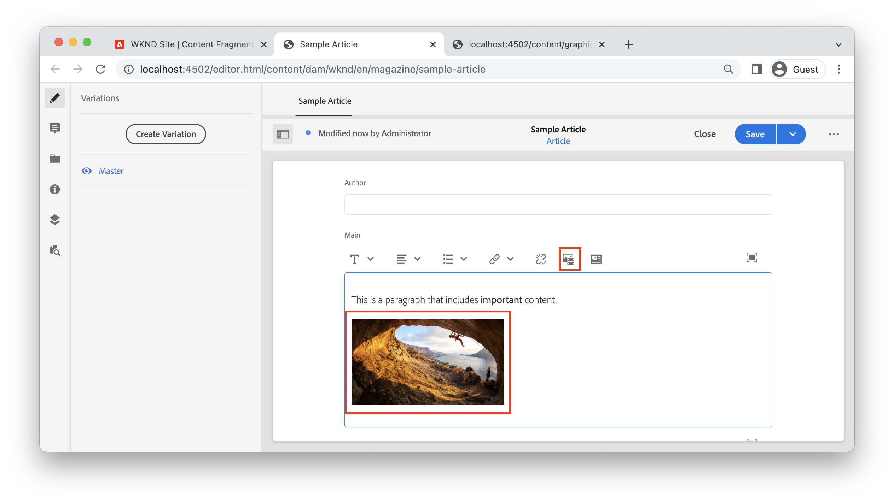
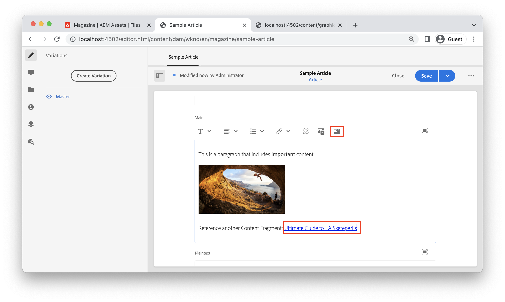

# Trabalhar com rich text no Adobe Experience Manager Headless

O campo Multi line text é um tipo de dados de Fragmentos de conteúdo que permite que os autores criem conteúdo rich text. As referências a outro conteúdo, como imagens ou outros Fragmentos de conteúdo, podem ser inseridas dinamicamente em linha dentro do fluxo do texto. AEM API GraphQL oferece um recurso robusto para retornar rich text como HTML, texto sem formatação ou como JSON puro. A representação JSON é poderosa, pois oferece ao aplicativo cliente controle total sobre como renderizar o conteúdo.

## Editor de várias linhas

>[!VIDEO](https://video.tv.adobe.com/v/342104/?quality=12&learn=on)


No Editor de fragmento de conteúdo, a barra de menu do campo Texto de várias linhas fornece aos autores recursos padrão de formatação de rich text, como **bold**, *itálico* e sublinhado. Abrir o campo Multi-line no modo de tela cheia ativa [ferramentas adicionais de formatação, como Tipo de parágrafo, localizar e substituir, verificação ortográfica e muito mais](https://experienceleague.adobe.com/docs/experience-manager-cloud-service/content/assets/content-fragments/content-fragments-variations.html).

## Tipo de dados de texto de várias linhas {#multi-line-data-type}

Use o **Texto de várias linhas** tipo de dados ao definir o Modelo do fragmento de conteúdo para ativar a criação de rich text.


Ao usar o tipo de dados Multi-line text , é possível definir a variável **Tipo padrão** para:

* Texto formatado
* Markdown
* Texto sem formatação

O **Tipo padrão** influencia diretamente a experiência de edição e determina se as ferramentas de rich text estão presentes.

Você também pode [habilitar referências em linha](#insert-fragment-references) para outros Fragmentos de conteúdo, verificando o **Permitir referência de fragmento** e configurar o **Modelos permitidos de fragmento do conteúdo**.

## Resposta em rich text com API GraphQL

Ao criar uma consulta GraphQL, os desenvolvedores podem escolher tipos de resposta diferentes de `html`, `plaintext`, `markdown`e `json` de um campo Multi-line .

Os desenvolvedores podem usar o [Visualização JSON](https://experienceleague.adobe.com/docs/experience-manager-cloud-service/content/assets/content-fragments/content-fragments-json-preview.html) no editor Fragmento de conteúdo para mostrar todos os valores do Fragmento de conteúdo atual que podem ser retornados usando a API GraphQL.

### Exemplo de JSON

O `json` A resposta oferece mais flexibilidade para desenvolvedores front-end ao trabalhar com conteúdo de rich text. O conteúdo Rich Text é fornecido como uma matriz de tipos de nó JSON que podem ser processados exclusivamente com base na plataforma do cliente.

Abaixo está um tipo de resposta JSON de um campo de várias linhas chamado `main` que contém um parágrafo: &quot;*Este é um parágrafo que inclui **importante**conteúdo.*&quot; onde &quot;importante&quot; é marcado como **bold**.

**Consulta GraphQL:**

```graphql
{
  articleByPath(_path: "/content/dam/wknd/en/magazine/sample-article")
  {
    item {
      _path
      main {
        json
      }
    }
  }
}
```

**Resposta GraphQL:**

```json
{
  "data": {
    "articleByPath": {
      "item": {
        "_path": "/content/dam/wknd/en/magazine/sample-article",
        "main": {
          "json": [
            {
              "nodeType": "paragraph",
              "content": [
                {
                  "nodeType": "text",
                  "value": "This is a paragraph that includes "
                },
                {
                  "nodeType": "text",
                  "value": "important",
                  "format": {
                    "variants": [
                      "bold"
                    ]
                  }
                },
                {
                  "nodeType": "text",
                  "value": " content. "
                }
              ]
            }
          ]
        }
      }
    }
  }
}
```

### Outros exemplos

Abaixo estão vários exemplos de tipos de resposta de um campo de várias linhas chamado `main` que contém um parágrafo: &quot;Este é um parágrafo que inclui **importante** conteúdo.&quot; em que &quot;importante&quot; é marcado como **bold**.

+++exemplo HTML

**Consulta GraphQL:**

```graphql
{
  articleByPath(_path: "/content/dam/wknd/en/magazine/sample-article")
  {
    item {
      _path
      main {
        html
      }
    }
  }
}
```

**Resposta GraphQL:**

```json
{
  "data": {
    "articleByPath": {
      "item": {
        "_path": "/content/dam/wknd/en/magazine/sample-article",
        "main": {
            "html": "<p>This is a paragraph that includes <b>important</b> content.&nbsp;</p>\n"
        }
      }
    }
  }
}
```

+++

+++Exemplo de marcação

**Consulta GraphQL:**

```graphql
{
  articleByPath(_path: "/content/dam/wknd/en/magazine/sample-article")
  {
    item {
      _path
      main {
        markdown
      }
    }
  }
}
```

**Resposta GraphQL:**

```json
{
  "data": {
    "articleByPath": {
      "item": {
        "_path": "/content/dam/wknd/en/magazine/sample-article",
        "main": {
            "markdown": "This is a paragraph that includes **important** content. \n\n ",
        }
      }
    }
  }
}
```

+++

+++Exemplo de texto simples

**Consulta GraphQL:**

```graphql
{
  articleByPath(_path: "/content/dam/wknd/en/magazine/sample-article")
  {
    item {
      _path
      main {
        plaintext
      }
    }
  }
}
```

**Resposta GraphQL:**

```json
{
  "data": {
    "articleByPath": {
      "item": {
        "_path": "/content/dam/wknd/en/magazine/sample-article",
        "main": {
            "plaintext": "This is a paragraph that includes important content. ",
        }
      }
    }
  }
}
```

O `plaintext` a opção de renderização elimina qualquer formatação.

+++


## Como renderizar uma resposta JSON de rich text {#render-multiline-json-richtext}

A resposta JSON de rich text do campo de várias linhas é estruturada como uma árvore hierárquica. Cada objeto ou nó representa um bloco de HTML diferente do rich text.

Abaixo está uma amostra de resposta JSON de um campo de texto Multi-line. Observe que cada objeto, ou nó, inclui uma `nodeType` que representa o bloco HTML do rich text como `paragraph`, `link`e `text`. Cada nó contém opcionalmente `content` que é um subarray que contém quaisquer filhos do nó atual.

```json
"json": [// root "content" or child nodes
            {
                "nodeType": "paragraph", // node for a paragraph
                "content": [ // children of current node
                {
                    "nodeType": "text", // node for a text
                    "value": "This is the first paragraph. "
                },
                {
                    "nodeType": "link",
                    "data": {
                        "href": "http://www.adobe.com"
                    },
                    "value": "An external link"
                }
                ],
            },
            {
                "nodeType": "paragraph",
                "content": [
                {
                    "nodeType": "text",
                    "value": "This is the second paragraph."
                },
                ],
            },
]
```

A maneira mais fácil de renderizar a Linha múltipla `json` é processar cada objeto ou nó na resposta e, em seguida, processar qualquer filho do nó atual. Uma função recursiva pode ser usada para atravessar a árvore JSON.

Abaixo está o código de amostra que ilustra uma abordagem de travessia recursiva. As amostras são baseadas em JavaScript e usam o React [JSX](https://reactjs.org/docs/introducing-jsx.html), no entanto, os conceitos de programação podem ser aplicados a qualquer língua.

```javascript
// renderNodeList - renders a list of nodes
function renderNodeList(childNodes) {
    
    if(!childNodes) {
        // null check
        return null;
    }

    return childNodes.map(node, index) => {
        return renderNode(node);
    }
}
```

O `renderNodeList` é o ponto de entrada no algoritmo recursivo. O `renderNodeList` espera uma matriz de `childNodes`. Cada nó na matriz é então passado para uma função `renderNode`.

```javascript
// renderNode - renders an individual node
function renderNode(node) {

    // if the current node has children, recursively process them
    const children = node.content ? renderNodeList(node.content) : null;

    // use a map to render the current node based on its nodeType
    return nodeMap[node.nodeType]?.(node, children);
}
```

O `renderNode` espera um único objeto chamado `node`. Um nó pode ter filhos que são processados recursivamente usando o `renderNodeList` descrita acima. Finalmente, um `nodeMap` é usada para renderizar o conteúdo do nó com base em sua `nodeType`.

```javascript
// nodeMap - object literal that maps a JSX response based on a given key (nodeType)
const nodeMap = {
    'paragraph': (node, children) => <p>{children}</p>,
    'link': node => <a href={node.data.href} target={node.data.target}>{node.value}</a>,
    'text': node => node.value,
    'unordered-list': (node, children) => <ul>{children}</ul>,
    'ordered-list': (node, children) => <ol>{children}</ol>,
    'list-item': (node, children) => <li>{children}</li>,
    ...
}
```

O `nodeMap` é um literal de Objeto JavaScript usado como um mapa. Cada uma das &quot;chaves&quot; representa uma variável diferente `nodeType`. Parâmetros de `node` e `children` pode ser passado para as funções resultantes que renderizam o nó. O tipo de retorno usado neste exemplo é JSX, no entanto, a abordagem pode ser adaptada para criar um literal de string que representa conteúdo HTML.

### Exemplo de código completo

Um utilitário de renderização de rich text reutilizável pode ser encontrado no [Exemplo de reação GraphQL WKND](https://github.com/adobe/aem-guides-wknd-graphql/tree/main/react-app).

* [renderRichText.js](https://github.com/adobe/aem-guides-wknd-graphql/tree/main/react-app/src/utils/renderRichText.js) - utilitário reutilizável que expõe uma função `mapJsonRichText`. Esse utilitário pode ser usado por componentes que desejam renderizar uma resposta JSON de rich text como React JSX.
* [AdventureDetail.js](https://github.com/adobe/aem-guides-wknd-graphql/blob/main/react-app/src/components/AdventureDetail.js) - Exemplo de componente que faz uma solicitação GraphQL que inclui rich text. O componente usa o `mapJsonRichText` para renderizar o rich text e quaisquer referências.


## Adicionar referências em linha ao rich text {#insert-fragment-references}

O campo Linha múltipla permite que os autores insiram imagens ou outros ativos digitais do AEM Assets no fluxo do rich text.



A captura de tela acima descreve uma imagem inserida no campo Várias linhas usando a variável **Inserir ativo** botão.

As referências a outros Fragmentos de conteúdo também podem ser vinculadas ou inseridas no campo Várias linhas usando o **Inserir fragmento de conteúdo** botão.



A captura de tela acima descreve outro Fragmento de conteúdo, Guia Ultimate para os Parks de LA Skate, sendo inserido no campo de várias linhas. Os tipos de Fragmentos de conteúdo que podem ser inseridos em campos são controlados pela variável **Modelos permitidos de fragmento do conteúdo** na configuração do [Tipo de dados de várias linhas](#multi-line-data-type) no Modelo de fragmento de conteúdo.

## Consultar referências em linha com GraphQL

A API GraphQL permite que os desenvolvedores criem uma consulta que inclui propriedades adicionais sobre qualquer referência inserida em um campo Multi-line. A resposta JSON inclui um `_references` que lista essas propriedades extras. A resposta JSON fornece aos desenvolvedores controle total sobre como renderizar as referências ou links em vez de precisar lidar com o HTML opinativo.

Por exemplo, talvez você queira:

* Incluir lógica de roteamento personalizada para gerenciar links para outros Fragmentos de conteúdo ao implementar um Aplicativo de página única, como usar o React Router ou Next.js
* Renderize uma imagem em linha usando o caminho absoluto para um ambiente de publicação do AEM como `src` valor.
* Determine como renderizar uma referência incorporada para outro Fragmento de conteúdo com propriedades personalizadas adicionais.

Use o `json` tipo de retorno e inclua o `_references` objeto ao criar uma consulta GraphQL:

**Consulta GraphQL:**

```graphql
{
  articleByPath(_path: "/content/dam/wknd/en/magazine/sample-article")
  {
    item {
      _path
      main {
        json
      }
    }
    _references {
      ...on ImageRef {
        _path
        _publishUrl
        width
      }
      ...on ArticleModel {
        _path
        author
      }
      
    }
  }
}
```

Na query acima, a variável `main` é retornado como JSON. O `_references` objeto inclui fragmentos para manusear referências do tipo `ImageRef` ou de tipo `ArticleModel`.

**Resposta JSON:**

```json
{
  "data": {
    "articleByPath": {
      "item": {
        "_path": "/content/dam/wknd/en/magazine/sample-article",
        "main": {
          "json": [
            {
              "nodeType": "paragraph",
              "content": [
                {
                  "nodeType": "text",
                  "value": "This is a paragraph that includes "
                },
                {
                  "nodeType": "text",
                  "value": "important",
                  "format": {
                    "variants": [
                      "bold"
                    ]
                  }
                },
                {
                  "nodeType": "text",
                  "value": " content. "
                }
              ]
            },
            {
              "nodeType": "paragraph",
              "content": [
                {
                  "nodeType": "reference",
                  "data": {
                    "path": "/content/dam/wknd/en/activities/climbing/sport-climbing.jpg",
                    "mimetype": "image/jpeg"
                  }
                }
              ]
            },
            {
              "nodeType": "paragraph",
              "content": [
                {
                  "nodeType": "text",
                  "value": "Reference another Content Fragment: "
                },
                {
                  "nodeType": "reference",
                  "data": {
                    "href": "/content/dam/wknd/en/magazine/la-skateparks/ultimate-guide-to-la-skateparks",
                    "type": "fragment"
                  },
                  "value": "Ultimate Guide to LA Skateparks"
                }
              ]
            }
          ]
        }
      },
      "_references": [
        {
          "_path": "/content/dam/wknd/en/activities/climbing/sport-climbing.jpg",
          "_publishUrl": "http://localhost:4503/content/dam/wknd/en/activities/climbing/sport-climbing.jpg",
          "width": 1920
        },
        {
          "_path": "/content/dam/wknd/en/magazine/la-skateparks/ultimate-guide-to-la-skateparks",
          "author": "Stacey Roswells",
        }
      ]
    }
  }
}
```

A resposta JSON inclui onde a referência foi inserida no rich text com a variável `"nodeType": "reference"`. O `_references` em seguida, inclui cada referência com as propriedades adicionais solicitadas. Por exemplo, a variável `ImageRef` retorna a variável `width` da imagem referenciada no artigo.

## Renderização de referências em linha em rich text

Para renderizar referências em linha, a abordagem recursiva é explicada em [Renderização de uma resposta JSON de várias linhas](#render-multiline-json-richtext) pode ser expandida.

Onde `nodeMap` é o mapa que renderiza os nós JSON.

```javascript
const nodeMap = {
        'reference': (node, children) => {

            // variable for reference in _references object
            let reference;
            
            // asset reference
            if(node.data.path) {
                // find reference based on path
                reference = references.find( ref => ref._path === node.data.path);
            }
            // Fragment Reference
            if(node.data.href) {
                // find in-line reference within _references array based on href and _path properties
                reference = references.find( ref => ref._path === node.data.href);
            }

            // if reference found, merge properties of reference and current node, then return render method of it using __typename property
            return reference ? renderReference[reference.__typename]({...reference, ...node}) : null;
        }
    }
```

A abordagem de alto nível é inspecionar sempre que uma `nodeType` igual `reference` na resposta JSON da linha múltipla. Uma função de renderização personalizada pode ser chamada, incluindo a variável `_references` objeto retornado na resposta GraphQL.

O caminho de referência em linha pode ser comparado à entrada correspondente no `_references` objeto e outro mapa personalizado `renderReference` pode ser chamado.

```javascript
const renderReference = {
    // node contains merged properties of the in-line reference and _references object
    'ImageRef': (node) => {
        // when __typename === ImageRef
        return  
    },
    'AdventureModel': (node) => {
        // when __typename === AdventureModel
        return <Link to={`/adventure:${node._path}`}>{`${node.adventureTitle}: ${node.adventurePrice}`}</Link>;
    }
    ...
}
```

O `__typename` do `_references` pode ser usado para mapear diferentes tipos de referência para diferentes funções de renderização.

### Exemplo de código completo

Um exemplo completo de escrita de um renderizador de referências personalizado pode ser encontrado em [AdventureDetail.js](https://github.com/adobe/aem-guides-wknd-graphql/blob/main/react-app/src/components/AdventureDetail.js) como parte da [Exemplo de reação GraphQL WKND](https://github.com/adobe/aem-guides-wknd-graphql/tree/main/react-app).

## Exemplo de ponta a ponta

>[!VIDEO](https://video.tv.adobe.com/v/342105/?quality=12&learn=on)

O vídeo anterior mostra um exemplo completo:

1. Atualização do campo de texto Multi-line de um modelo de fragmento de conteúdo para permitir referências de fragmento
1. Uso do Editor de fragmento de conteúdo para incluir uma imagem e fazer referência a outro fragmento em um campo de texto de várias linhas.
1. Criação de uma consulta GraphQL que inclui a resposta de texto de várias linhas como JSON e qualquer `_references` usado.
1. Escreva uma SPA React que renderize as referências em linha da resposta Rich Text.
