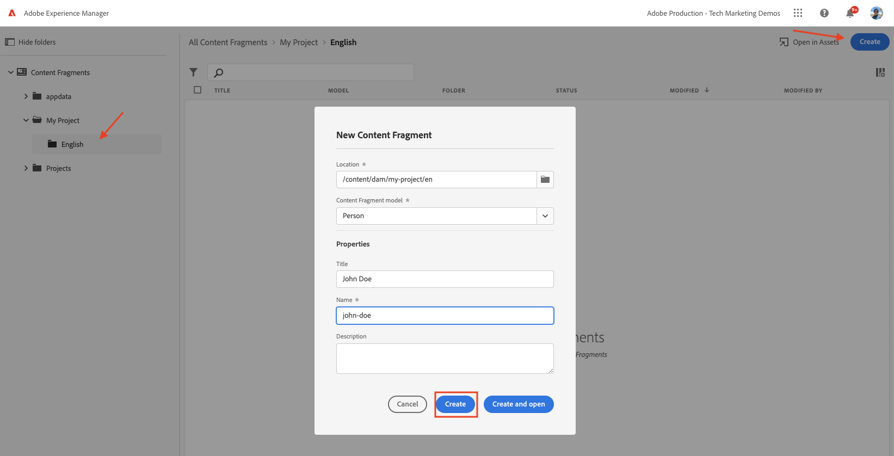

# Criação do fragmento de conteúdo {#authoring-content-fragments}

Neste capítulo, você cria e edita um novo Fragmento do conteúdo com base na variável [modelo de fragmento de conteúdo recém-definido](./content-fragment-models.md). Você também aprenderá a criar variações de Fragmentos de conteúdo.

## Pré-requisitos {#prerequisites}

Este é um tutorial de várias partes e presume-se que as etapas descritas na seção [Definição dos modelos de fragmento do conteúdo](./content-fragment-models.md) foram concluídas.

## Objetivos {#objectives}

* Criar um fragmento de conteúdo com base em um modelo de fragmento de conteúdo
* Criar uma variação de Fragmento de conteúdo

## Criar um da pasta do ativo

Os Fragmentos de conteúdo são armazenados em pastas no AEM Assets. Para criar Fragmentos de conteúdo dos modelos criados no capítulo anterior, uma pasta deve ser criada para armazená-los. Uma configuração é necessária na pasta para permitir a criação de fragmentos de modelos específicos.

1. Na tela inicial AEM, navegue até **Ativos** > **Arquivos**.

   

1. Toque **Criar** no canto superior direito e toque **Pasta**. Na caixa de diálogo resultante, digite:

   * Título*: **Meu projeto**
   * Nome: **meu projeto**

   

1. Selecione o **Minha pasta** pasta e toque **Propriedades**.

   

1. Toque no **Cloud Services** guia . Na guia Configuração da nuvem , use o localizador de caminho para selecionar a variável **Meu projeto** configuração. O valor deve ser `/conf/my-project`.

   

   Configurar essa propriedade permite que Fragmentos de conteúdo sejam criados usando os modelos criados no capítulo anterior.

1. Toque no **Políticas** na guia , em **Modelos permitidos de fragmento do conteúdo** use o localizador de caminho para selecionar o **Pessoa** e **Equipe** modelo criado anteriormente.

   

   Essas políticas são herdadas por qualquer subpasta automaticamente e podem ser substituídas. Você também pode permitir modelos por tags ou habilitar modelos de outras configurações de projeto. Esse mecanismo fornece uma maneira poderosa de gerenciar a hierarquia de conteúdo.

1. Toque **Salvar e fechar** para salvar as alterações nas propriedades da pasta.

1. Navegue dentro do **Meu projeto** pasta.

1. Crie outra pasta com os seguintes valores:

   * Título*: **Inglês**
   * Nome: **en**

   Uma prática recomendada é a criação de projetos de apoio multilingue. Consulte [a seguinte página de documentos para obter mais informações](https://experienceleague.adobe.com/docs/experience-manager-cloud-service/content/assets/admin/translate-assets.html).

## Criar um fragmento de conteúdo {#create-content-fragment}

Os próximos vários Fragmentos de conteúdo são criados com base na variável **Equipe** e **Pessoa** modelos.

1. Na tela inicial AEM, toque em **Fragmentos de conteúdo** para abrir a interface do usuário de Fragmentos de conteúdo .

   

1. No painel esquerdo, expanda **Meu projeto** e tocar **Inglês**.
1. Toque **Criar** para apresentar **Novo fragmento de conteúdo** e insira os seguintes valores:

   * Local: `/content/dam/my-project/en`
   * Modelo do fragmento de conteúdo: **Pessoa**
   * Título: **John Doe**
   * Nome: `john-doe`

   
1. Toque **Criar**.
1. Repita as etapas acima para criar um fragmento que represente **Alison Smith**:

   * Local: `/content/dam/my-project/en`
   * Modelo do fragmento de conteúdo: **Pessoa**
   * Título: **Alison Smith**
   * Nome: `alison-smith`

   Toque **Criar** para criar o fragmento Pessoa .

1. Em seguida, repita as etapas para criar um **Equipe** fragmento representando **Alfa da equipe**:

   * Local: `/content/dam/my-project/en`
   * Modelo do fragmento de conteúdo: **Equipe**
   * Título: **Alfa da equipe**
   * Nome: `team-alpha`

   Toque **Criar** para criar o fragmento Equipe .

1. Deve haver três Fragmentos de conteúdo abaixo de **Meu projeto** > **Inglês**:

   

## Editar fragmentos de conteúdo de pessoa {#edit-person-content-fragments}

Em seguida, preencha os fragmentos recém-criados com dados.

1. Toque na caixa de seleção ao lado de **John Doe** e tocar **Abrir**.

   

1. O Editor de fragmento de conteúdo contém um formulário com base no modelo de Fragmento de conteúdo . Preencha os vários campos para adicionar conteúdo ao **John Doe** fragmento. Para Imagem de perfil, carregue sua própria imagem no AEM Assets.

   

1. Toque **Salvar e fechar** para salvar as alterações no fragmento John Doe.
1. Retorne à interface do usuário do Fragmento de conteúdo e abra o **Alison Smith** para edição.
1. Repita as etapas acima para preencher a variável **Alison Smith** fragmento com conteúdo.

## Editar fragmento de conteúdo da equipe {#edit-team-content-fragment}

1. Abra o **Alfa da equipe** Fragmento do conteúdo usando a interface do usuário do Fragmento do conteúdo.
1. Preencha os campos para **Título**, **Nome abreviado** e **Descrição**.
1. Selecione o **John Doe** e **Alison Smith** Fragmentos de conteúdo para preencher a variável **Membros da equipe** campo :

   

   >[!NOTE]
   >
   >Também é possível criar Fragmentos de conteúdo em linha usando o **Novo fragmento de conteúdo** botão.

1. Toque **Salvar e fechar** para salvar as alterações no fragmento Alfa do grupo.

## Publicar fragmentos de conteúdo

Após análise e verificação, publique o `Content Fragments`

1. Na tela inicial AEM, toque em **Fragmentos de conteúdo** para abrir a interface do usuário de Fragmentos de conteúdo .

1. No painel esquerdo, expanda **Meu projeto** e tocar **Inglês**.

1. Toque na caixa de seleção ao lado dos fragmentos de conteúdo e toque em **Publicar**.
   

## Parabéns.  {#congratulations}

Parabéns, você criou vários Fragmentos de conteúdo e criou uma variação.

## Próximas etapas {#next-steps}

No próximo capítulo, [Explorar APIs GraphQL](explore-graphql-api.md), você explorará AEM APIs GraphQL usando a ferramenta GrapiQL integrada. Saiba como o AEM gera automaticamente um esquema GraphQL com base em um modelo de Fragmento de conteúdo. Você tentará construir consultas básicas usando a sintaxe GraphQL.

## Documentação relacionada

* [Gerenciamento dos fragmentos de conteúdo](https://experienceleague.adobe.com/docs/experience-manager-cloud-service/content/assets/content-fragments/content-fragments-managing.html)
* [Variações - Criação dos fragmentos de conteúdo](https://experienceleague.adobe.com/docs/experience-manager-cloud-service/content/assets/content-fragments/content-fragments-variations.html)
