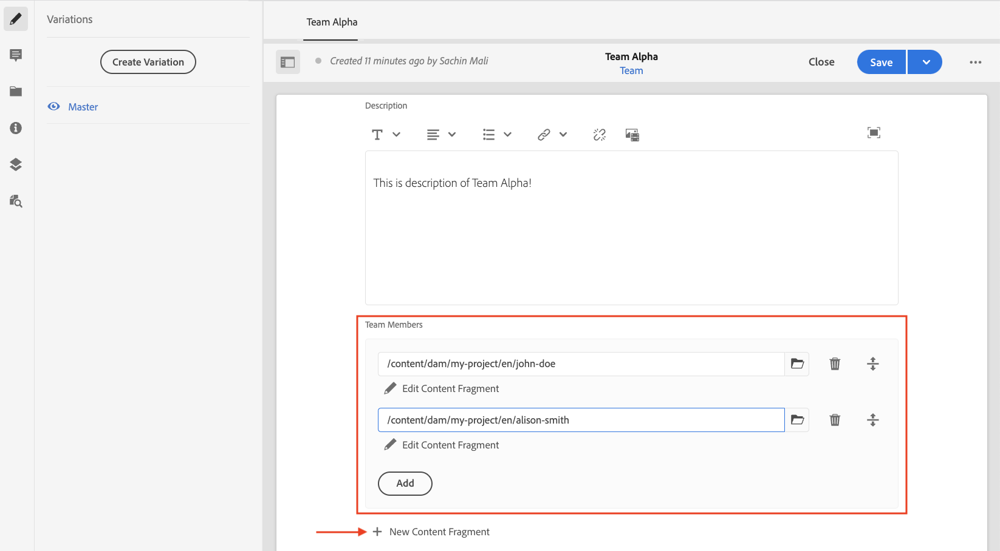

# Criação de fragmento de conteúdo {#authoring-content-fragments}

Neste capítulo, você cria e edita um novo Fragmento de conteúdo com base na variável [modelo de fragmento de conteúdo recém-definido](./content-fragment-models.md). Você também aprenderá a criar variações de Fragmentos de conteúdo.

## Pré-requisitos {#prerequisites}

Este é um tutorial em várias partes e presume-se que as etapas descritas no [Definição de modelos de fragmento de conteúdo](./content-fragment-models.md) foram concluídas.

## Objetivos {#objectives}

* Criar um fragmento de conteúdo com base em um modelo de fragmento de conteúdo
* Criar uma variação de Fragmento do conteúdo

## Criar uma pasta de ativos

Os fragmentos de conteúdo são armazenados em pastas no AEM Assets. Para criar fragmentos de conteúdo a partir dos modelos criados no capítulo anterior, uma pasta deve ser criada para armazená-los. Uma configuração é necessária na pasta para habilitar a criação de fragmentos de modelos específicos.

1. Na tela inicial do AEM, acesse **Assets** > **Arquivos**.

   

1. Toque **Criar** no canto superior direito e toque em **Pasta**. Na caixa de diálogo resultante, digite:

   * Título*: **Meu projeto**
   * Nome: **my-project**

   

1. Selecione o **Minha pasta** pasta e toque em **Propriedades**.

   

1. Toque no **Cloud Service** guia. Na guia Configuração na nuvem, use o localizador de caminho para selecionar o **Meu projeto** configuração. O valor deve ser `/conf/my-project`.

   

   Definir essa propriedade permite que os fragmentos de conteúdo sejam criados usando os modelos criados no capítulo anterior.

1. Toque no **Políticas** , no menu **Modelos de fragmentos do conteúdo permitido** use o localizador de caminho para selecionar o campo **Person** e **Equipe** modelo criado anteriormente.

   

   Essas políticas são herdadas automaticamente por qualquer subpasta e podem ser substituídas. Você também pode permitir modelos por tags ou ativar modelos de outras configurações do projeto. Esse mecanismo fornece uma maneira eficiente de gerenciar a hierarquia de conteúdo.

1. Toque **Salvar e fechar** para salvar as alterações nas propriedades da pasta.

1. Navegue dentro do **Meu projeto** pasta.

1. Crie outra pasta com os seguintes valores:

   * Título*: **Inglês**
   * Nome: **en**

   Uma prática recomendada é configurar projetos para suporte multilíngue. Consulte [a página de documentos a seguir para obter mais informações](https://experienceleague.adobe.com/docs/experience-manager-cloud-service/content/assets/admin/translate-assets.html).

## Criar um fragmento de conteúdo {#create-content-fragment}

>[!TIP]
>
>Para usuários locais do SDK do AEM: utilize a interface do usuário do AEM Assets para criar e criar fragmentos de conteúdo, em vez da interface do usuário de fragmentos de conteúdo descrita abaixo. Para obter instruções detalhadas, consulte o [Documentação do AEM](https://experienceleague.adobe.com/docs/experience-manager-cloud-service/content/assets/content-fragments/content-fragments-managing.html).

Em seguida, vários Fragmentos de conteúdo são criados com base no **Equipe** e **Person** modelos.

1. Na Tela inicial do AEM, toque em **Fragmentos de conteúdo** para abrir a interface dos fragmentos de conteúdo.

   

1. No painel esquerdo, expanda **Meu projeto** e toque em **Inglês**.
1. Toque **Criar** para trazer à tona o **Novo fragmento de conteúdo** e insira os seguintes valores:

   * Localização: `/content/dam/my-project/en`
   * Modelo de fragmento de conteúdo: **Person**
   * Título: **John Doe**
   * Nome: `john-doe`

   
1. Toque **Criar**.
1. Repita as etapas acima para criar um fragmento representando **Alison Smith**:

   * Localização: `/content/dam/my-project/en`
   * Modelo de fragmento de conteúdo: **Person**
   * Título: **Alison Smith**
   * Nome: `alison-smith`

   Toque **Criar** para criar o fragmento Pessoa.

1. Em seguida, repita as etapas para criar um **Equipe** fragmento que representa **Alpha da equipe**:

   * Localização: `/content/dam/my-project/en`
   * Modelo de fragmento de conteúdo: **Equipe**
   * Título: **Alpha da equipe**
   * Nome: `team-alpha`

   Toque **Criar** para criar o fragmento Equipe.

1. Deve haver três fragmentos de conteúdo abaixo de **Meu projeto** > **Inglês**:

   

## Editar fragmentos de conteúdo de pessoa {#edit-person-content-fragments}

Em seguida, preencha os fragmentos recém-criados com dados.

1. Toque na caixa de seleção ao lado de **John Doe** e toque em **Abertura**.

   

1. O Editor de fragmento de conteúdo contém um formulário baseado no modelo de fragmento de conteúdo. Preencha os vários campos para adicionar conteúdo à **John Doe** fragmento. Para Foto do perfil, carregue sua própria imagem no AEM Assets.

   

1. Toque **Salvar e fechar** para salvar as alterações no fragmento John Doe.
1. Retorne à interface do usuário do fragmento de conteúdo e abra o **Alison Smith** arquivo para edição.
1. Repita as etapas acima para preencher o **Alison Smith** fragmentar com conteúdo.

## Editar fragmento do conteúdo da equipe {#edit-team-content-fragment}

1. Abra o **Alpha da equipe** Fragmento de conteúdo usando a interface do fragmento de conteúdo.
1. Preencha os campos para **Título**, **Nome curto**, e **Descrição**.
1. Selecione o **John Doe** e **Alison Smith** Fragmentos de conteúdo para preencher o **Membros da equipe** campo:

   

   >[!NOTE]
   >
   >Também é possível criar Fragmentos de conteúdo em linha usando o **Novo fragmento de conteúdo** botão.

1. Toque **Salvar e fechar** para salvar as alterações no fragmento Alpha do grupo.

## Publicar fragmentos de conteúdo

>[!TIP]
>
>Para usuários locais do SDK do AEM: utilize a interface do usuário do AEM Assets para publicar fragmentos de conteúdo, em vez da interface do usuário de fragmentos de conteúdo descrita abaixo. Para obter instruções detalhadas, consulte o [Documentação do AEM](https://experienceleague.adobe.com/docs/experience-manager-cloud-service/content/assets/content-fragments/content-fragments-managing.html#publishing-and-referencing-a-fragment).

Após a revisão e a verificação, publique o `Content Fragments`

1. Na Tela inicial do AEM, toque em **Fragmentos de conteúdo** para abrir a interface dos fragmentos de conteúdo.

1. No painel esquerdo, expanda **Meu projeto** e toque em **Inglês**.

1. Toque na caixa de seleção ao lado dos fragmentos de conteúdo e toque em **Publish**.
   

## Parabéns. {#congratulations}

Parabéns, você criou vários fragmentos de conteúdo e uma variação.

## Próximas etapas {#next-steps}

No próximo capítulo, [Explorar APIs do GraphQL](explore-graphql-api.md), você explorará as APIs do GraphQL AEM usando a ferramenta GrapiQL integrada. Saiba como o AEM gera automaticamente um esquema do GraphQL com base em um modelo de Fragmento de conteúdo. Você experimentará a construção de consultas básicas usando a sintaxe do GraphQL.

## Documentação relacionada

* [Gerenciamento dos fragmentos de conteúdo](https://experienceleague.adobe.com/docs/experience-manager-cloud-service/content/assets/content-fragments/content-fragments-managing.html)
* [Variações - Criação dos fragmentos de conteúdo](https://experienceleague.adobe.com/docs/experience-manager-cloud-service/content/assets/content-fragments/content-fragments-variations.html?lang=pt-BR)
