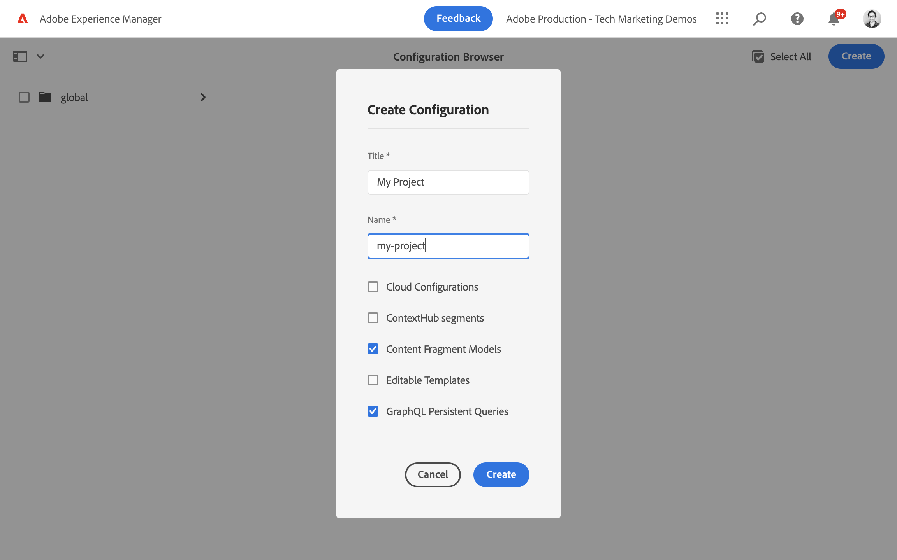
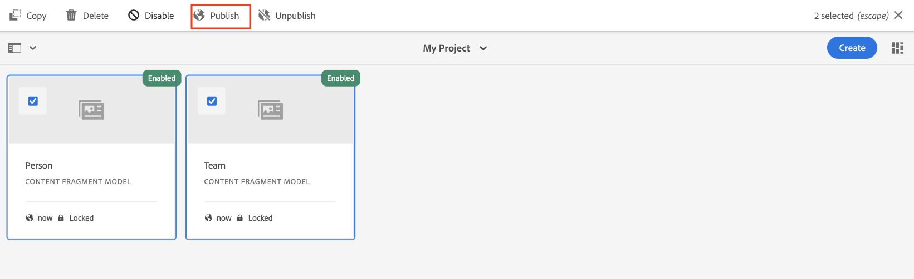

# Definição de Modelos de fragmentos de conteúdo {#content-fragment-models}

Neste capítulo, saiba como modelar conteúdo e criar um esquema com **Modelos de fragmentos do conteúdo**. Você aprende sobre os diferentes tipos de dados que podem ser usados para definir um esquema como parte do modelo.

Criamos dois modelos simples, **Equipe** e **Person**. A variável **Equipe** modelo de dados tem nome, nome curto e descrição e faz referência a **Person** modelo de dados, que tem nome completo, biodetalhes, imagem do perfil e lista de ocupações.

Você também é bem-vindo para criar seu próprio modelo seguindo as etapas básicas e ajustar as respectivas etapas, como consultas do GraphQL e código do aplicativo React, ou simplesmente seguir as etapas descritas nestes capítulos.

## Pré-requisitos {#prerequisites}

Este é um tutorial em várias partes e presume-se que um [O ambiente do autor do AEM está disponível](./overview.md#prerequisites).

## Objetivos {#objectives}

* Crie um modelo de fragmento de conteúdo.
* Identifique os tipos de dados disponíveis e as opções de validação para criar modelos.
* Entender como o modelo de fragmento de conteúdo define **ambos** o esquema de dados e o modelo de criação de um Fragmento de conteúdo.

## Criar uma configuração de projeto

Uma configuração de projeto contém todos os modelos de Fragmento de conteúdo associados a um projeto específico e fornece um meio de organizar modelos. Pelo menos um projeto deve ser criado **antes** criação do modelo de fragmento de conteúdo.

1. Faça logon no AEM **Autor** ambiente (por exemplo, `https://author-pYYYY-eXXXX.adobeaemcloud.com/`)
1. Na tela inicial do AEM, acesse **Ferramentas** > **Geral** > **Navegador de configuração**.

   
1. Clique em **Criar**, no canto superior direito
1. Na caixa de diálogo resultante, digite:

   * Título*: **Meu projeto**
   * Nome*: **my-project** (prefere usar todas as letras minúsculas usando hifens para separar palavras. Essa string influencia o endpoint exclusivo do GraphQL no qual os aplicativos clientes executam solicitações.)
   * Marcar **Modelos de fragmentos do conteúdo**
   * Marcar **Consultas persistentes do GraphQL**

   

## Criar modelos de fragmentos de conteúdo

Em seguida, crie dois modelos para um **Equipe** e uma **Person**.

### Criar o modelo de pessoa

Criar um modelo para um **Person**, que é o modelo de dados que representa uma pessoa que faz parte de uma equipe.

1. Na tela inicial do AEM, acesse **Ferramentas** > **Geral** > **Modelos de fragmentos do conteúdo**.

   

1. Navegue até o **Meu projeto** pasta.
1. Toque **Criar** no canto superior direito para exibir a **Criar modelo** assistente.
1. Entrada **Título do modelo** insira **Person** e toque em **Criar**. Na caixa de diálogo resultante, toque em **Abertura**, para criar o modelo.

1. Arrastar e soltar um **Texto em linha única** elemento no painel principal. Insira as seguintes propriedades na **Propriedades** guia:

   * **Rótulo do campo**: **Nome completo**
   * **Nome da propriedade**: `fullName`
   * Marcar **Obrigatório**

   

   A variável **Nome da propriedade** define o nome da propriedade que é persistida no AEM. A variável **Nome da propriedade** também define o **key** para esta propriedade como parte do esquema de dados. Este **key** é usado quando os dados do Fragmento de conteúdo são expostos por meio de APIs do GraphQL.

1. Toque no **Tipos de dados** e arraste e solte uma **Texto multilinha** sob o campo **Nome completo** campo. Insira as seguintes propriedades:

   * **Rótulo do campo**: **Biografia**
   * **Nome da propriedade**: `biographyText`
   * **Tipo padrão**: **Rich Text**

1. Clique em **Tipos de dados** e arraste e solte uma **Referência de conteúdo** campo. Insira as seguintes propriedades:

   * **Rótulo do campo**: **Foto do perfil**
   * **Nome da propriedade**: `profilePicture`
   * **Caminho raiz**: `/content/dam`

   Ao configurar o **Caminho raiz**, você pode clicar no botão **pasta** ícone para exibir uma modal e selecionar o caminho. Restringe quais pastas os autores podem usar para preencher o caminho. `/content/dam` é a raiz na qual todos os AEM Assets (imagens, vídeos, outros fragmentos de conteúdo) são armazenados.

1. Adicione uma validação à **Referência da Imagem** para que somente tipos de conteúdo de **Imagens** para preencher o campo.

   

1. Clique em **Tipos de dados** e arraste e solte uma **Enumeração**  tipo de dados abaixo de **Referência da Imagem** campo. Insira as seguintes propriedades:

   * **Renderizar como**: **Caixas de seleção**
   * **Rótulo do campo**: **Ocupação**
   * **Nome da propriedade**: `occupation`

1. Adicionar vários **Opções** usando o **Adicionar uma opção** botão. Use o mesmo valor para **Rótulo de opção** e **Valor de opção**:

   **Artista**, **Influenciador**, **Fotógrafo**, **Viajante**, **Escritor**, **YouTuber**

1. A versão final **Person** O modelo deve ser semelhante ao seguinte:

   

1. Clique em **Salvar** para salvar as alterações.

### Criar o modelo de equipe

Criar um modelo para um **Equipe**, que é o modelo de dados de uma equipe de pessoas. O modelo Equipe faz referência ao modelo Pessoa para representar os membros da equipe.

1. No **Meu projeto** pasta, toque em **Criar** no canto superior direito para exibir a **Criar modelo** assistente.
1. Entrada **Título do modelo** insira **Equipe** e toque em **Criar**.

   Toque **Abertura** no diálogo resultante, para abrir o modelo recém-criado.

1. Arrastar e soltar um **Texto em linha única** elemento no painel principal. Insira as seguintes propriedades na **Propriedades** guia:

   * **Rótulo do campo**: **Título**
   * **Nome da propriedade**: `title`
   * Marcar **Obrigatório**

1. Toque no **Tipos de dados** e arraste e solte uma **Texto em linha única** elemento no painel principal. Insira as seguintes propriedades na **Propriedades** guia:

   * **Rótulo do campo**: **Nome curto**
   * **Nome da propriedade**: `shortName`
   * Marcar **Obrigatório**
   * Marcar **Exclusivo**
   * Em, **Tipo de validação** > escolher **Personalizado**
   * Em, **Regex de validação personalizada** > inserir `^[a-z0-9\-_]{5,40}$` - isso garante que apenas valores alfanuméricos em minúsculas e traços de 5 a 40 caracteres possam ser inseridos.

   A variável `shortName` A propriedade nos fornece uma maneira de consultar uma equipe individual com base em um caminho encurtado. A variável **Exclusivo** Essa configuração garante que o valor seja sempre exclusivo por Fragmento de conteúdo desse modelo.

1. Toque no **Tipos de dados** e arraste e solte uma **Texto multilinha** sob o campo **Nome curto** campo. Insira as seguintes propriedades:

   * **Rótulo do campo**: **Descrição**
   * **Nome da propriedade**: `description`
   * **Tipo padrão**: **Rich Text**

1. Clique em **Tipos de dados** e arraste e solte uma **Referência do fragmento** campo. Insira as seguintes propriedades:

   * **Renderizar como**: **Múltiplo campo**
   * **Rótulo do campo**: **Membros da equipe**
   * **Nome da propriedade**: `teamMembers`
   * **Modelos de fragmentos do conteúdo permitido**: Use o ícone de pasta para selecionar o **Person** modelo.

1. A versão final **Equipe** O modelo deve ser semelhante ao seguinte:

   

1. Clique em **Salvar** para salvar as alterações.

1. Agora você deve ter dois modelos para trabalhar:

   

## Publicar configuração do projeto e modelos de fragmento de conteúdo

Após revisão e verificação, publicar o `Project Configuration` &amp; `Content Fragment Model`

1. Na tela inicial do AEM, acesse **Ferramentas** > **Geral** > **Navegador de configuração**.

1. Toque na caixa de seleção ao lado de **Meu projeto** e toque em **Publish**

   

1. Na tela inicial do AEM, acesse **Ferramentas** > **Geral** > **Modelos de fragmentos do conteúdo**.

1. Navegue até o **Meu projeto** pasta.

1. Toque **Person** e **Equipe** modelos e toque em **Publish**

   

## Parabéns. {#congratulations}

Parabéns, você acabou de criar seus primeiros modelos de fragmento de conteúdo!

## Próximas etapas {#next-steps}

No próximo capítulo, [Criação de modelos de fragmento de conteúdo](author-content-fragments.md), você cria e edita um novo fragmento de conteúdo com base em um modelo de fragmento de conteúdo. Você também aprenderá a criar variações de Fragmentos de conteúdo.

## Documentação relacionada

* [Modelos de fragmentos do conteúdo](https://experienceleague.adobe.com/docs/experience-manager-cloud-service/content/assets/content-fragments/content-fragments-models.html)

